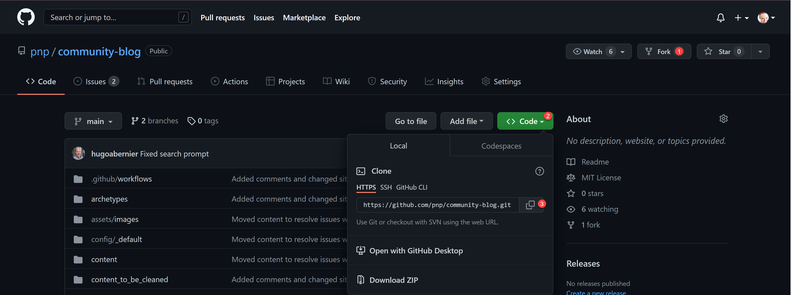

# Contributing guidelines

We love to have your contributions! To author a blog post, follow these steps:

1. register for a GitHub account in case you don't already have one - it's free
2. Fork this repository to create a copy in your account:

- open [pnp/community-blog/](https://github.com/pnp/community-blog/) (this repository)
- select **Fork**

The URL of your fork is now `https://github.com/<YOUR GITHUB ACCOUNT>/community-blog/`

3. Clone the repository

Now you want to clone the repository so you have it locally available:

- Select **Code**
- Copy the URL (it is `https://github.com/<YOUR GITHUB ACCOUNT>/community-blog.git`)



- Open the terminal in VS Code
- Navigate to a directory where you want to clone the repository
- Type `git clone <COPIED URL HERE>`

4. Add Upstream

You will now want to make sure, that all your contributions point to the original repository, which is why you want to add an upstream to it:

- navigate to the folder where your cloned repository is located with `cd community-blog`
- type `git remote add upstream https://github.com/pnp/community-blog` (this needs to be the original repository URL)
- to check if everything works correctly, type `git remote -v`, you should see this output:

```powershell
origin  https://github.com/<YOUR ACCOUNT HERE>/community-blog.git (fetch)
origin  https://github.com/<YOUR ACCOUNT HERE>/community-blog.git (push)
upstream https://github.com/pnp/community-blog (fetch)
upstream https://github.com/pnp/community-blog (push)
```

5. Write your blog post

- type `code .` in VSCode terminal (yes, there is a space (` `) between `code` and the `.`) to open your project in a new VS Code instance
- in the **community-blog/content/posts** folder, create your post as an `.md` file.
- reference media in the subfolder of **community-blog/content/media**, that you name as you named your post
- in case you need some help on how markdown works, please see this article:
//TODO insert Bob German's article on markdown

6. commit and push your changes to your fork

Whenever you want to upload your changes to your remote fork:

- type `git add .` (yes, there is a space (` `) between `add` and the `.`) - this adds all changes to staging area
- type `git commit -m "YOUR COMMIT MESSAGE"` (please don't be the person that is not giving context to their changes) - this will commit your changes with the messages
- type `git push` to push the changes to your remote fork

7. Pull request

You will now want to (kindly) ask the repository maintainer to pull in your changes. You do that with a pull request:

- Open [pnp/community-blog](https://github.com/pnp/community-blog) (this repository)
- Select **Pull requests**
- Select **New pull request**


- Select **compare across forks**
- Select your fork from the **head repository**


- Select **Compare & pull request**


- Fill out the form (please read carefully, this way we don't need to go back and forth too often)
  - give your PR a descriptive title
  - describe what's in the PR
  - provide us with your twitter handle and a short text how we can promote your article. Including your twitter handle this text can't be longer than 257 characters.
- You can always switch to **Preview** to see how it looks like
- Select **Create pull request**
- If needed, you can commit more files and changes

A maintainer will review your pull request and merge your changes soon so that your blog appears on the [Microsoft 365 Community blog](https://pnp.github.io/community-blog/). This repository is maintained by volunteers in their free time, please be kind. Everyone is doing their best to keep things moving forward.

