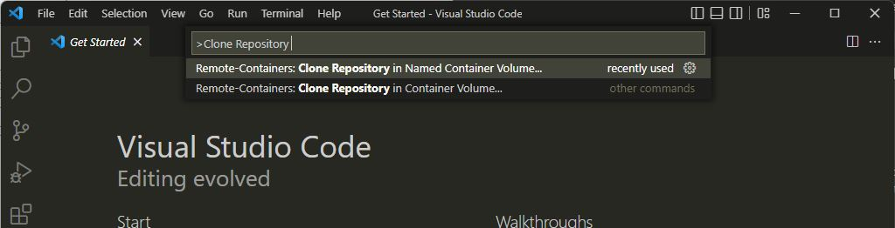
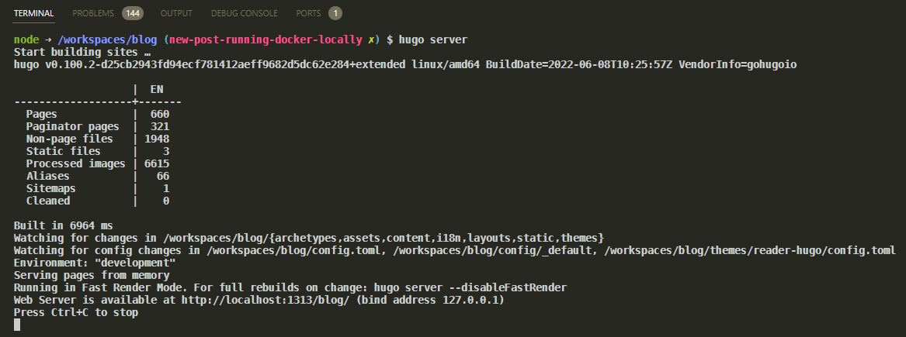

# How to run this blog locally


## 1. What is Hugo?

Hugo is a static site generator. If you're not familiar with the term: It's a tool that can generate a website by converting markdown files and combining them with a template. Using a static site generator means you don't need a Content Management System, a database or a webserver with all kinds of requirements. You can just write files in Markdown and host your files anywhere. Static sites load very fast, and providing you like Markdown, it's a great experience writing content.

Now Markdown looks nice, but you never know for sure how it will be transformed without seeing it for yourself. If you want to know, you need to install and run Hugo locally.

## 2. Installing Hugo on your PC

To install Hugo you can follow the guidance in the [Hugo docs](https://gohugo.io/getting-started/installing/#quick-install). There are a few things to take note of:

- **Hugo extended**: 
Make sure that you install _Hugo extended_. The PnP blog uses scss/css compilation, which is only available in extended. 

- **Hugo Version**:
It's also best if you align with the version of Hugo that we use on the PnP blog. You can find the current version in the `.devcontainer/devcontainer.json` file in the GitHub repository. (You'll find more info on the devcontainer further down this page.) At the time of writing we're at version `0.100.2`.

Taking the above into account, the following script can be used to install Hugo with PowerShell on Windows. (using the Chocolatey package manager)

```powershell
# Installs chocolatey if you don't have it
Set-ExecutionPolicy Bypass -Scope Process -Force; iex ((New-Object System.Net.WebClient).DownloadString('https://chocolatey.org/install.ps1'))

# Installs hugo
choco install hugo-extended --version=0.100.2
```

If you already have Hugo installed, you can check the version running `hugo version`. It should print something like this:

```sh
hugo v0.100.2-d25cb2943fd94ecf781412aeff9682d5dc62e284+extended linux/amd64 BuildDate=2022-06-08T10:25:57Z VendorInfo=gohugoio
```

This string contains the version number and whether you've got the extended version: (look for the `+extended` string) 

## 3. Using our devcontainer

Installing Hugo on your system is OK if you don't mind. But maybe you have your own Hugo development going on, with separate versions of Hugo. Or maybe you don't like to install more programs, cluttering your system. It is possible to separate your contributions from the other stuff going on in your PC. This can be done using Docker. Using Docker is like running a VM on your PC, and being able to clean it up instantly if you're done. It's an advanced subject, but for the matter at hand you need three things:

- [Docker](https://docs.docker.com/get-docker/)
- [VS Code](https://code.visualstudio.com/download)
- [VS Code Remote - Containers Extension](https://marketplace.visualstudio.com/items?itemName=ms-vscode-remote.remote-containers)

Once you have them all installed and Docker running, open a new VS Code window, open the Command Palette using `Ctrl + Shift + P` and search for the command _Clone repository in Container Volume_:



The command will ask for a git URL, and you can copy/paste our git url there: `https://github.com/pnp/blog.git`. Following the prompts and hitting enter will start cloning the repository on your machine in a completely separated docker volume. It will also install Hugo, so you'll not need to do anything else after.

This is a VERY condensed way to explain it. If you're interested in finding out a bit more, you can [read up on remote containers](https://code.visualstudio.com/docs/remote/containers) or follow the [tutorial](https://code.visualstudio.com/docs/remote/containers-tutorial).

## 4. Running Hugo locally

If you've installed Hugo, running it is simple. Just open a terminal in the root directory of your blog and run the following command:

```sh
hugo server
```

What this will do is build the site and start a server that will allow you to view the site using the URL `http://localhost:1313/blog/`. It will also configure a watcher, so any changes you make to md-files are instantly compiled. No need to hit F5 after, your browser window will be refreshed for you as well.



## Need help? Have questions?

Contact us! We'll help in any way we can.

_Sharing is Caring_ 
