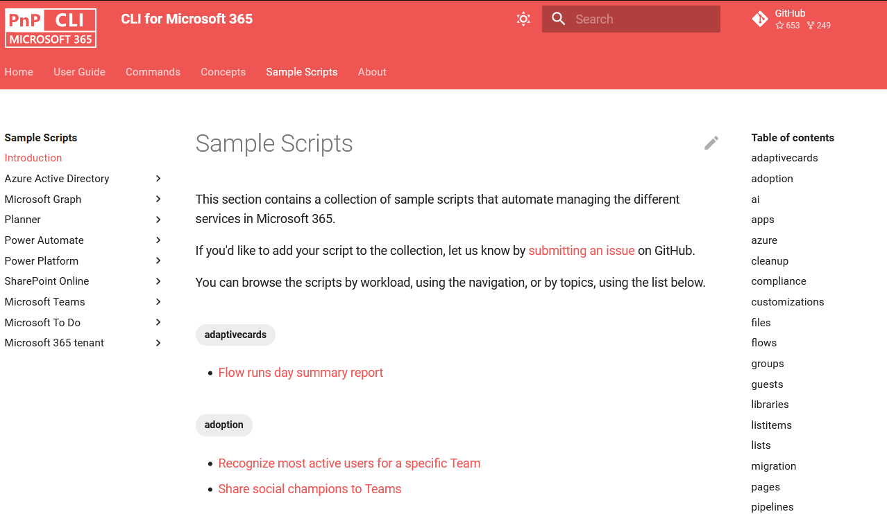
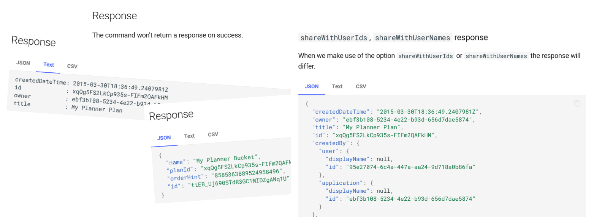

We've just published a new minor version of the CLI for Microsoft 365 with new commands for working with and managing Microsoft 365 and SharePoint Framework projects on any platform.

## Manage Microsoft 365 and SharePoint Framework projects on any platform

CLI for Microsoft 365 is a cross-platform CLI that allows you to manage various configuration settings of Microsoft 365 and SharePoint Framework projects no matter which operating system or shell you use.

While building solutions for Microsoft 365 expands beyond the Windows operating system, managing many platform settings is possible only through PowerShell on Windows. As more and more users work on non-Windows machines, it's inconvenient for them to use a Windows virtual machine to configure their tenants. With the CLI for Microsoft 365, you can configure your tenant no matter which operating system you use. Additionally, using CLI for Microsoft 365, you can manage your SharePoint Framework projects.

## New version of CLI for Microsoft 365 – v5.9

Following our monthly release cadence, we've released a new version of the CLI for Microsoft 365 with some new capabilities. The month of October was no exception. We had a ton of improvements and new commands. Here are a few of the most noteworthy additions.

> For the complete list of what's new and changed, see the [release notes](https://pnp.github.io/cli-microsoft365/about/release-notes/#v590).

### Get information about the Power Platform cards

Just started playing around with the preview of Power Apps cards and you want to do some more automation? No worries, CLI for Microsoft 365 has got you covered. We stay up to date with the latest tools and added news commands to fetch your Power Apps cards information.

Get a Power Platform card in a specific environment based on name.

```sh
m365 pp card get --environment "Default-d87a7535-dd31-4437-bfe1-95340acd55c5" --name "CLI 365 Card"
```

List the Power Platform cards in a specific environment as admin.

```sh
m365 pp card list --environment "Default-d87a7535-dd31-4437-bfe1-95340acd55c5" --asAdmin
```

For more information, see the [pp card get](https://pnp.github.io/cli-microsoft365/cmd/pp/card/card-get/) and the [pp card list](https://pnp.github.io/cli-microsoft365/cmd/pp/card/card-list/) commands documentation.

### Improved managing permissions in SharePoint Online

In our previous release we already introduced several new commands to permissions in SharePoint Online. We felt the need to add more, more and more permission commands. The new release allows you to easily manage file role assignments, file role inheritance, folder role assignments, folder role inheritance, and last but not least listitem role assignments.

Remove a role assignment by upn from a file by url.

```sh
m365 spo file roleassignment remove --webUrl "https://contoso.sharepoint.com/sites/contoso-sales" --fileUrl "/sites/contoso-sales/documents/Test1.docx" --upn "user1@contoso.onmicrosoft.com"
```

Reset inheritance of file by id.

```sh
m365 spo file roleinheritance reset --webUrl "https://contoso.sharepoint.com/sites/project-x" --fileId "b2307a39-e878-458b-bc90-03bc578531d6"
```

Remove a role assignment from a folder based on the group name.

```sh
m365 spo folder roleassignment remove --webUrl "https://contoso.sharepoint.com/sites/contoso-sales" --folderUrl  "/Shared Documents/FolderPermission" --groupName "saleGroup"
```

For more information, see the [spo file roleassignment remove](https://pnp.github.io/cli-microsoft365/cmd/spo/file/file-roleassignment-remove/), [spo file roleinheritance reset](https://pnp.github.io/cli-microsoft365/cmd/spo/file/file-roleinheritance-reset/), [spo folder roleassignment remove](https://pnp.github.io/cli-microsoft365/cmd/spo/folder/folder-roleassignment-remove/) and many more permission commands which you can find in the [release note](https://pnp.github.io/cli-microsoft365/about/release-notes/#v590).

### Lots of improvements to the documentation

This release also includes several improvements and new features to the CLI for Microsoft 365 documentation site. A whole of bunch of typos have been exterminated from existence, several headers have been correct to be more aligned with all the other headers and much more. Like mentioned, there are also a few new features added.

Are all the samples a bit overwhelming and is a bit confusing to find the correct one for you? The samples have been updated with tags to make it much easier to find. A modification has been made on the introduction page to showcase all the available tags.



Another improvement is the start of something great. We will be updating all our command documentation to include the response output. A few commands have been updated to include the response but their is still a lot of work for all our other commands. This is where we need **your help**. We created a whole lot of issues to include the response output for several commands. If you feel like writing some documentation be sure to take a look at [issue #3754](https://github.com/pnp/cli-microsoft365/issues/3754).



Many more improvements have been made. Check out the [release notes](https://pnp.github.io/cli-microsoft365/about/release-notes/#changes) to get more insight.

### Sending attachments with outlook

Another notable change is the update to the outlook mail send command. This allows you to add multiple attachments to the command. 

Send an email with multiple attachments.

```sh
m365 outlook mail send --to chris@contoso.com --subject "Monthly reports" --bodyContents "Here are the reports of this month." --attachment "C:/Reports/File1.jpg" --attachment "C:/Reports/File2.docx" --attachment "C:/Reports/File3.xlsx"
```

For more information, see the [outlook mail send](https://pnp.github.io/cli-microsoft365/cmd/outlook/mail/mail-send/) command documentation.

### Hacktoberfest, what a success!

Hacktoberfest was a great success! Thanks so much to all our active and new contributors for your hard work and to all the maintainers for creating so many good first issues. 

### What else

These features are just the tip of the ice berg of what we've shipped in this version. The code base of the CLI for Microsoft 365 has received a huge update as well, making it easier for maintainers and contributors to create new functionality. And so many other fixes.
Check out the [release notes](https://pnp.github.io/cli-microsoft365/about/release-notes/#v590) for the complete list of what's new and improved.

## Contributors

This release wouldn't be possible without the help of (in alphabetical order):

- [Adam Wójcik](https://github.com/Adam-it)
- [Albert-Jan Schot](https://github.com/appieschot)
- [Arjun Menon](https://github.com/arjunumenon)
- [Jasey Waegebaert](https://github.com/Jwaegebaert)
- [Martin Lingstuyl](https://github.com/martinlingstuyl)
- [Mathijs Verbeeck](https://github.com/MathijsVerbeeck)
- [Milan Holemans](https://github.com/milanholemans)
- [Nanddeep Nachan](https://github.com/nanddeepn)
- [Paolo Pialorsi](https://github.com/PaoloPia)
- [Patrick Lamber](https://github.com/plamber)
- [Reshmee Auckloo](https://github.com/reshmee011)
- [Smita Nachan](https://github.com/SmitaNachan)
- [Waldek Mastykarz](https://github.com/waldekmastykarz)

### New contributors

A warm welcome to all our new contributors! (in alphabetical order):

- [Conor O'Callaghan](https://github.com/Conor0Callaghan)
- [Daniaal Nadir](https://github.com/daniaalnadir)
- [Dushyant Sharma](https://github.com/techsnap)
- [Gaston Flores](https://github.com/gaston-flores)
- [Hüseyin Saatçi](https://github.com/huseyinsaatci)
- [Karnail Singh Choudhary](https://github.com/nightfury-crypto)
- [Nico De Cleyre](https://github.com/nicodecleyre)
- [Priyanshu Ahlawat](https://github.com/PriyanshuAhlawat)
- [Raghwendra Rishabh](https://github.com/Rishabhraghwendra18)
- [Riccardo Solazzi](https://github.com/TheZal)
- [Tanmay Rathi](https://github.com/Tanmay-21)
- [Vividh Pandey](https://github.com/VividhPandey003)

Thank you all for the time you chose to spend on CLI for Microsoft 365 and for your help to advance it!

## Work in progress

Here are some things that we're currently working on.

### Include response output in the docs

We're actively working on improving our documentation and adding response output to all our commands. This is a lot of work because we have a ton of commands. A few commands are already done to show an example of what we are trying to do but we are definitely looking for contributors to help us. If you feel like writing some documentation be sure to take a look at [issue #3754](https://github.com/pnp/cli-microsoft365/issues/3754).

### New Teams commands to work with meetings

We're working on a series of new commands to allow you to work with teams meetings. There's a lot of work to be done here, so if you like to join in, you're very welcome to checkout our [Teams meetings epic issue](https://github.com/pnp/cli-microsoft365/issues/3788). 

### Discussions 

CLI for Microsoft 365 is constantly growing and evolving. We're always looking for ways to improve. There are still many areas not covered by the CLI as well as many amazing ideas for unique features the tool might provide. Currently we are considering adding support with commands which will allow you to manage file versioning or document sets in SharePoint Online. Your feedback will help us make the right decisions in which areas we should focus on. If you want to help out please do join the currently open [discussions](https://github.com/pnp/cli-microsoft365/discussions)

What else could we simplify? Let us know what you think by helping out with one of our [open issues](https://github.com/pnp/cli-microsoft365/issues) or chime in on our [discussions](https://github.com/pnp/cli-microsoft365/discussions)!

## Try it today

Get the latest release of CLI for Microsoft 365 from npm by executing:

```bash
npm i -g @pnp/cli-microsoft365
```

Alternatively, you can get the latest release from Docker by executing:

```bash
docker run --rm -it m365pnp/cli-microsoft365:latest
```

If you need more help getting started or want more details about the commands, architecture, or project, go to [aka.ms/cli-m365](https://aka.ms/cli-m365). And if you see any room for improvement, please, don't hesitate to reach out to us either on [GitHub](https://github.com/pnp/cli-microsoft365/discussions), [Discord](https://discord.com/invite/7rfW4kg6B5), or [Twitter](https://twitter.com/climicrosoft365).