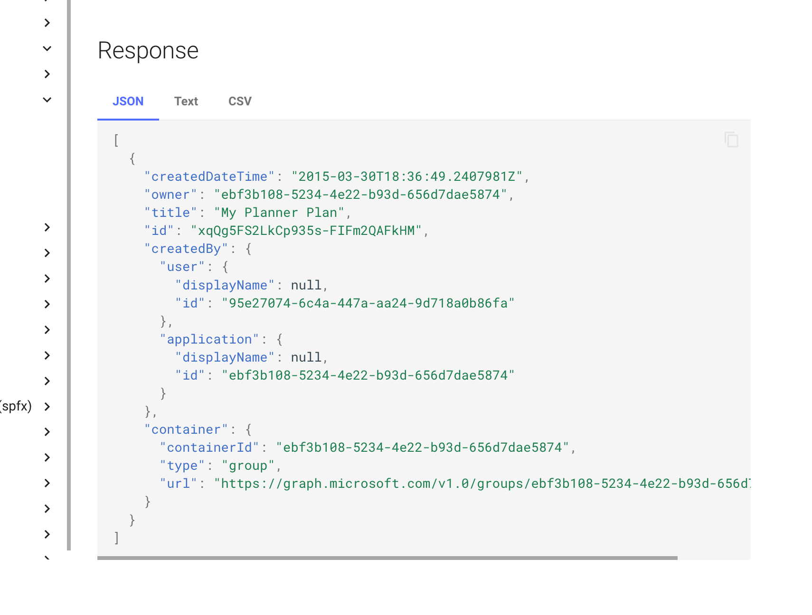

We've just published a new major version of the CLI for Microsoft 365 with new commands for working with and managing Microsoft 365 and SharePoint Framework projects on any platform.

## Manage Microsoft 365 and SharePoint Framework projects on any platform

CLI for Microsoft 365 is a cross-platform CLI that allows you to manage various configuration settings of Microsoft 365 and SharePoint Framework projects no matter which operating system or shell you use.

While building solutions for Microsoft 365 expands beyond the Windows operating system, managing many platform settings is possible only through PowerShell on Windows. As more and more users work on non-Windows machines, it's inconvenient for them to use a Windows virtual machine to configure their tenants. With the CLI for Microsoft 365, you can configure your tenant no matter which operating system you use. Additionally, using CLI for Microsoft 365, you can manage your SharePoint Framework projects.

## New major version of CLI for Microsoft 365 – v6

As we keep adding new commands to CLI for Microsoft 365, we noticed several areas that we should improve, to make using the CLI more intuitive and consistent. While our major releases are evolutionary in nature, we've also added some new commands and improvements to the CLI.

> To help you upgrade to v6, we prepared a summary of breaking changes and the recommended actions. For more information see the [v6 Upgrade Guidance](https://pnp.github.io/cli-microsoft365/v6-upgrade-guidance/) in our docs.

Following is an overview of the most noteworthy changes in v6.

> For the complete list of what's new and changed, see the [release notes](https://pnp.github.io/cli-microsoft365/about/release-notes/#v600).

### Streamlined commands and options

Once a year we take the opportunity to look at all of the functionality that we have in the CLI, and see how we can make it more consistent and intuitive. Typically, this leads to breaking changes. We've done our best to minimize the impact of these changes, but we still recommend that you review the [v6 Upgrade Guidance](https://pnp.github.io/cli-microsoft365/v6-upgrade-guidance/) in our docs to verify if you're affected by any of these changes before you upgrade to v6.

### Added support for upgrading SPFx projects to v1.16.0

SharePoint Framework (SPFx) allows you to build solutions for Microsoft Teams, Microsoft Viva, Outlook, the Microsoft 365 app and SharePoint. v1.16.0 of SPFx introduced several new features including using v3 of the Microsoft Graph JavaScript SDK, and exposing Teams tabs in Outlook and the Microsoft 365 app.

To benefit from these, and other improvements introduced in SPFx v1.16.0, upgrade your existing projects using the CLI for Microsoft 365.

> Important: CLI for Microsoft 365 won't upgrade your project. Instead, it will provide you with a report that you can use to upgrade your project yourself.

To upgrade your SPFx projects to v1.16.0, run the following command:

```sh
m365 spfx project upgrade --toVersion 1.16.0 --output md > report.md
```

You can also request a more interactive report built on top of the [VSCode CodeTour extension](https://marketplace.visualstudio.com/items?itemName=vsls-contrib.codetour), by running:

```sh
m365 spfx project upgrade --toVersion 1.16.0 --output tour
```

We've also updated other SPFx-related commands to support SPFx v1.16.0.

### Extended documentation with commands' output

As more and more people use CLI for Microsoft 365 in scripts, we realized that we can improve the experience, by including in the documentation sample output of each command. This way, you can easily see what to expect from the command and how to parse the output, without having to run the command yourself first.



For each command we included response in the JSON, text and CSV format supported by the CLI.

As of publishing this article, we're half way through the process of adding the output to all commands. We'd appreciate your help in [adding the output to the remaining commands](https://github.com/pnp/cli-microsoft365/issues/3754). Also, we'd love to hear from you what you think of this addition.

### Extended support for managing Power Platform

In v6 of CLI, we continued to extend the support for managing Power Platform. We added commands for managing Power Platform cards, Dataverse tables, solutions and publishers.

#### Manage Power Platform cards

Recently, Microsoft introduced Power Platform cards: "micro-apps with enterprise data and workflows and interactive, lightweight UI elements that other applications can use as content".

In this version of the CLI, we extended the support for cards with cloning and removing.

To clone an existing card, run the following command:

```sh
m365 pp card clone --environment "Default-d87a7535-dd31-4437-bfe1-95340acd55c5" --name "CLI 365 Card" --newName "CLI 365 new Card"
```

To remove a card, run the following command:

```sh
m365 pp card remove --environment Default-d87a7535-dd31-4437-bfe1-95340acd55c5 --name "Card Name"
```

To learn more about managing Power Platform cards, see the [Power Platform card commands](https://pnp.github.io/cli-microsoft365/cmd/pp/card/card-clone/) in our docs.

#### Manage Dataverse tables

Power Platform gains popularity and more organizations use it to build solutions every day. To help you manage your Dataverse tables, we extended the support for managing Dataverse tables with retrieving information about a specific table and removing tables.

To get information about a specific table, run the following command:

```sh
m365 pp dataverse table get --environment "Default-2ca3eaa5-140f-4175-8261-3272edf9f339" --name "aaduser"
```

To remove a table, run the following command:

```sh
m365 pp dataverse table remove --environment "Default-2ca3eaa5-140f-4175-8261-3272edf9f339" --name "aaduser"
```

To learn more about managing Dataverse tables, see the [Dataverse table commands](https://pnp.github.io/cli-microsoft365/cmd/pp/dataverse/dataverse-table-get/) in our docs.

#### Manage Power Platform solutions and publishers

To support reusing and managing apps, Power Platform introduces the concept of solutions. To help you manage your solutions, we extended the support for managing Power Platform solutions with removing solutions and retrieving information about solution publishers.

To remove a solution, run the following command:

```sh
m365 pp solution remove --environment Default-d87a7535-dd31-4437-bfe1-95340acd55c5 --name "Solution Name"
```

To get information about publishers, run the following command:

```sh
m365 pp solution publisher list --environment "Default-2ca3eaa5-140f-4175-8261-3272edf9f339"
```

To get information about a specific publisher, run the following command:

```sh
m365 pp solution publisher get --environment "Default-2ca3eaa5-140f-4175-8261-3272edf9f339" --name "MicrosoftCorporation"
```

Finally, to remove a publisher, run the following command:

```sh
m365 pp solution publisher remove --environment Default-d87a7535-dd31-4437-bfe1-95340acd55c5 --name "Publisher Name"
```

To learn more about managing Power Platform solutions, see the [Power Platform solution commands](https://pnp.github.io/cli-microsoft365/cmd/pp/solution/solution-get/) in our docs.

### Manage versions of files stored in SharePoint

One of the key areas of SharePoint is content management. As people in the organization collaborate, they create and share files. To help you automate managing versions of files stored in SharePoint, we extended support for managing file versions with support for retrieving information about a specific version, restoring a version and removing all file versions.

To get information about a specific file version, run the following command:

```sh
m365 spo file version get --webUrl https://contoso.sharepoint.com --label "1.0" --fileUrl '/Shared Documents/Document.docx'
```

To restore a file version, run the following command:

```sh
m365 spo file version restore --webUrl https://contoso.sharepoint.com --label "1.0" --fileUrl '/Shared Documents/Document.docx'
```

To remove all file versions, run the following command:

```sh
m365 spo file version clear --webUrl https://contoso.sharepoint.com --fileUrl '/Shared Documents/Document.docx'
```

To learn more about managing file versions, see the [file version commands](https://pnp.github.io/cli-microsoft365/cmd/spo/file/file-version-clear/) in our docs.

### Configure how you want to display commands' help

As we keep extending our documentation, we heard your feedback, that in most cases, you don't need to see it all. Depending on how familiar you are with using the CLI, you might need to see only the options section of the documentation.

To allow you to use CLI for Microsoft 365 on your terms, we introduce the ability to specify which section of the command's help you want to see. For example, to see only the options section, run the following command:

```sh
m365 spo site list --help options
```

You can also configure the CLI to always show only the options section:

```sh
m365 cli config set --key helpMode --value options
```

After configuring this setting, when you use the `--help` option without any value, you'll see only the options section of the command's help.

To see the full help file, run the following command:

```sh
m365 spo site list --help full
```

We hope you'll like this improvement, and we'd love to hear your feedback.

### What's next

Here are some things that we are currently working on.

#### Markdown output

CLI for Microsoft 365 is a great tool for automating managing your Microsoft 365 tenant and SharePoint Framework projects. We've heard some of you say, that you'd also like to be able to use it for reporting. To make it easier for you, we are working on adding support for generating reports in Markdown format. [Here is what we've got planned](https://github.com/pnp/cli-microsoft365/issues/2908), and we'd appreciate your feedback if you have other ideas as well.

#### Manage retention labels

An important part of content management is applying retention labels to your content. Retention labels define how content should be managed and which policies apply to it.

To help you automate working with retention labels, we're working on adding a set of [related commands](https://github.com/pnp/cli-microsoft365/issues/4145). We'd appreciate your feedback if this is an area you're working with.

#### Use context information to simplify using CLI's commands

If you use CLI a lot, you might find it tedious to have to repeat some options like the URL of the site or a list you want to work with.

To help you save time, we're working on adding the concept of context to CLI for Microsoft 365. Using the context, you will be able to store in a folder default values for specific options. When you run a command that has a context value defined, and you haven't specified the option explicitly yourself, CLI for Microsoft 365 will automatically use the value from the context saving you work and typing! For more information about what we've got planned, see the [related issue](https://github.com/pnp/cli-microsoft365/issues/3896).

## Contributors

This release wouldn't be possible without the help of (in alphabetical order):

- [Abderahman Moujahid](https://github.com/Abderahman88)
- [Adam Wójcik](https://github.com/Adam-it)
- [Arjun Menon](https://github.com/arjunumenon)
- [Daniel Greuel](https://github.com/dgreuel)
- [Geoffrey Hunt](https://github.com/runningdeveloper)
- [Jasey Waegebaert](https://github.com/Jwaegebaert)
- [Martin Lingstuyl](https://github.com/martinlingstuyl)
- [Mathijs Verbeeck](https://github.com/MathijsVerbeeck)
- [Milan Holemans](https://github.com/milanholemans)
- [Nanddeep Nachan](https://github.com/nanddeepn)
- [Nico De Cleyre](https://github.com/nicodecleyre)
- [Patrick Lamber](https://github.com/plamber)
- [Reshmee Auckloo](https://github.com/reshmee011)
- [Siddhart Vaghasia](https://github.com/siddharth-vaghasia)
- [Smita Nachan](https://github.com/SmitaNachan)
- [Stijn Haerkens](https://github.com/stijnhaerkenss)
- [Waldek Mastykarz](https://github.com/waldekmastykarz)

### New contributors

A warm welcome to this month's new contributors! (in alphabetical order):

- [Daniel Greuel](https://github.com/dgreuel)
- [Geoffrey Hunt](https://github.com/runningdeveloper)
- [Stijn Haerkens](https://github.com/stijnhaerkenss)

Thank you all for the time you chose to spend on CLI for Microsoft 365 and for your help to advance it!

### High fives

CLI for Microsoft 365 wouldn't be where it is today if it weren't for our users who provide us with feedback. High fives to the following people who took the time to share their feedback and ideas for improvement with us (in alphabetical order):

- [Abderahman Moujahid](https://github.com/Abderahman88)
- [Alex Pawlak](https://github.com/AlexJPawlak)
- [Daniel Westerdale](https://github.com/westerdaled)
- [Kurt Opel](https://github.com/knaopel)
- [Mathijs Verbeeck](https://github.com/MathijsVerbeeck)
- [Nico De Cleyre](https://github.com/nicodecleyre)

### Discussions

CLI for Microsoft 365 is constantly growing and evolving. We're always looking for ways to improve. There are still many areas not covered by the CLI as well as many amazing ideas for unique features the tool might provide. Your feedback will help us make the right decisions in which areas we should focus on. If you want to help out please do join the currently open [discussions](https://github.com/pnp/cli-microsoft365/discussions)

What else could we simplify? Let us know what you think by helping out with one of our [open issues](https://github.com/pnp/cli-microsoft365/issues) or chime in on our [discussions](https://github.com/pnp/cli-microsoft365/discussions)!

## Try it today

Get the latest release of CLI for Microsoft 365 from npm by executing:

```bash
npm i -g @pnp/cli-microsoft365
```

Alternatively, you can get the latest release from Docker by executing:

```bash
docker run --rm -it m365pnp/cli-microsoft365:latest
```

If you need more help getting started or want more details about the commands, architecture, or project, go to [aka.ms/cli-m365](https://aka.ms/cli-m365). If you see any room for improvement, please, don't hesitate to reach out to us either on [GitHub](https://github.com/pnp/cli-microsoft365/discussions), [Discord](https://discord.com/invite/7rfW4kg6B5), or [Twitter](https://twitter.com/climicrosoft365).
