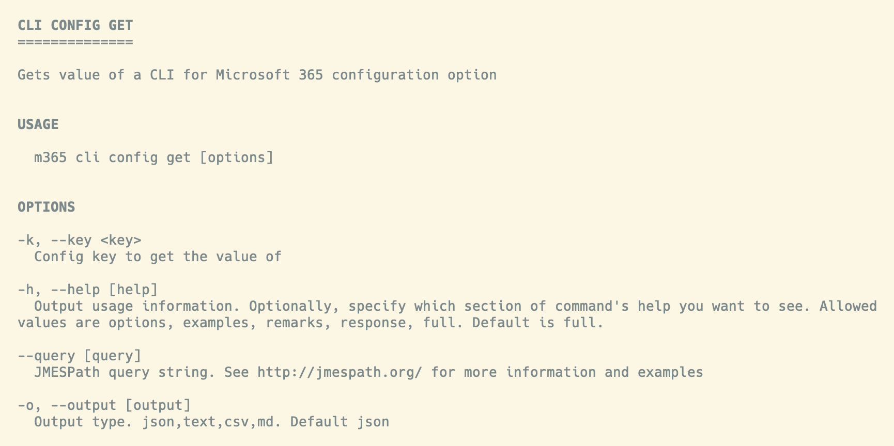

We've published a new minor version of CLI for Microsoft 365. 

[CLI for Microsoft 365](https://aka.ms/cli-m365) is a cross-platform tool. It helps you manage your Microsoft 365 tenant and SharePoint Framework projects. No matter which operating system or shell you use.

> Read the [release notes](https://aka.ms/cli-m365/notes) in full for all new features and improvements.
 
## What's new

Our latest release is jam-packed with a whole bunch of fresh new commands that are sure to take your experience to the next level. And the best part? You don't have to dig through mountains of code to find out about them. Let me give you the lowdown on some of the most exciting new commands in this section.

### Export a specific Power App

If you're struggling to export your Power App and share it with others, we've got you covered. Behold, the magic command that will transform your app into a convenient ZIP file that can be easily shared with anyone. Just take a look at this example to see how to achieve this incredible feat. Say goodbye to tedious sharing methods and hello to seamless sharing with just a few clicks.

```sh
m365 pa app export --environment Default-d87a7535-dd31-4437-bfe1-95340acd55c5 --id 3989cb59-ce1a-4a5c-bb78-257c5c39381d 
```

- [pa app export](https://pnp.github.io/cli-microsoft365/cmd/pa/app/app-export/)

### Get a Microsoft Purview threat assessment

Have you ever wondered how to get a Microsoft Purview threat assessment? Look no further, because We've got an example command that will show you just that! With this simple command, you can easily access the results of your Purview threat assessment. Check out the example below to see how it's done.

```sh
m365 purview threatassessment get --id c37d695e-d581-4ae9-82a0-9364eba4291e --includeResults
```

- [purview threatassessment get](https://pnp.github.io/cli-microsoft365/cmd/purview/threatassessment/threatassessment-get/)

### List SharePoint Online Application Customizers

If you're a SharePoint user who's eager to obtain a complete list of application customizers added to your site, you're in luck! Thanks to this new command we're about to share with you, the process is now easier than ever. By following the straightforward example below, you'll be able to retrieve all the details about the application customizers that have been added to your SharePoint site. 

```sh
m365 spo applicationcustomizer list --webUrl https://contoso.sharepoint.com/sites/sales
```

- [spo applicationcustomizer list](https://pnp.github.io/cli-microsoft365/cmd/spo/applicationcustomizer/applicationcustomizer-list/)

## What's changed

Exciting news for all command-line aficionados out there! We've just rolled out a fresh set of updates to some of our existing commands, and they're chock-full of new, improved functionality. We can't wait to share with you all the incredible features that these updates bring to the table. So, without further ado, let's take a quick peek at what's in store for you with this latest update! Check out the overview below for all the juicy details.

### **MAJOR:** Upgrade SharePoint Framework projects to **v1.17.0**

We've got some fantastic news for you. Our latest release includes an update to the `spfx project upgrade` command, and it's a game-changer. With this upgrade, you can now easily take your projects to the latest public version `1.17.0` of SharePoint Framework. That's right - all the cutting-edge features and enhancements are now at your fingertips. Don't miss out on this opportunity to give your projects a boost and stay ahead of the curve. So, what are you waiting for? Upgrade your SPFx projects today with just a simple command!

```sh
m365 spfx project upgrade --output md
```

- [spfx project upgrade](https://pnp.github.io/cli-microsoft365/cmd/spfx/project/project-upgrade/)

### Doctor commands upgraded to support SPFx **v1.17.0**

We're thrilled to announce the latest update to our `spfx doctor` and `spfx project doctor` commands, which are now fully equipped to validate your projects and environment that use the latest public version `1.17.0` of the SharePoint Framework. With this update, you can quickly and easily detect any potential issues and take corrective action. So, whether you're a seasoned SharePoint developer or just getting started, our updated commands will ensure that your projects and environment are in tip-top shape.

```sh
m365 spfx doctor --output text
```

```sh
m365 spfx project doctor --output md
```

- [spfx doctor](https://pnp.github.io/cli-microsoft365/cmd/spfx/spfx-doctor/)
- [spfx project doctor](https://pnp.github.io/cli-microsoft365/cmd/spfx/project/project-doctor/)

### Enhancing the User Experience, One Step at a Time

We're always looking for ways to make your experience even better. That's why we're thrilled to announce our latest initiative to enhance the user experience, starting with an update to our help headings. 

We know that when it comes to navigating commands, every little detail counts. That's why we've taken the first step in our journey to improve UX by formatting all help headings as bold and uppercase in the terminal. Here is a preview of what this change looks like:



This update will not only make it easier to read and find the information you need, but it will also add a touch of style to your terminal window. So, whether you're a power user or a beginner, you can now enjoy an even more seamless and visually appealing experience when using our commands. Keep an eye out for more UX enhancements on the horizon - we're just getting started!

### Revamped output types for a more dynamic experience

We've revamped the `csv` and `markdown (md)` output types to give you even more control over your command results. 

With the extended `csv` output mode, you can now view more properties than ever before, making it easier to analyze your data and draw insights. But that's not all - we've also introduced a new default behavior for nested objects. 

Now, nested objects are excluded by default for both `csv` and `markdown (md)` outputs. However, if you need to retrieve specific properties from nested objects, you can use the `--query` JMESPath option to force a selection of properties. This update ensures that you get exactly what you need from your command results, without the clutter.

### And much **MUCH** more ...

We've enhanced a bunch of commands and squashed a bunch of pesky bugs to bring you a more dynamic and seamless experience than ever before. 

But don't just take our word for it - check out the release notes below to see the full list of enhancements and bug fixes. From added options to enhanced commands, our latest release has it all.

- [Changelog v6.5.0](https://pnp.github.io/cli-microsoft365/about/release-notes/#v650)

## What's next

Here are some things that we are currently working on.

### More commands

We are always looking to add more commands to CLI for Microsoft 365. 

We are busy implementing commands across several Microsoft 365 services, such as Power Platform, SharePoint Online, and Microsoft Purview.

If you have any ideas or suggestions for new commands, please let us know by creating a [new issue](https://github.com/pnp/cli-microsoft365/issues/new?assignees=&labels=&template=new-command.yml&title=New+command%3A+%3Cshort+description%3E) in the GitHub Issues list, or reaching out to us on our [community Discord server](https://aka.ms/cli-m365/discord) to discuss.

## Contributors

This release wouldn't be possible without the help of (in alphabetical order):

- [Adam Wójcik](https://github.com/Adam-it)
- [Arjun Menon](https://github.com/arjunumenon)
- [Ganesh Sanap](https://github.com/ganesh-sanap)
- [Jasey Waegebaert](https://github.com/Jwaegebaert)
- [Martin Lingstuyl](https://github.com/martinlingstuyl)
- [Mathijs Verbeeck](https://github.com/MathijsVerbeeck)
- [Milan Holemans](https://github.com/milanholemans)
- [Nanddeep Nachan](https://github.com/nanddeepn)
- [Nico De Cleyre](https://github.com/nicodecleyre)
- [Waldek Mastykarz](https://github.com/waldekmastykarz)

Thank you all for the time you chose to spend on CLI for Microsoft 365 and for your help to advance it!

### High fives

CLI for Microsoft 365 wouldn't be where it is today if it weren't for our users who provide us with feedback. High fives to the following people who took the time to share their feedback and ideas for improvement with us (in alphabetical order):

- [Daniel Mills](https://github.com/evilhamsterman)

## Try it today!

Get the latest release of CLI for Microsoft 365 from npm by executing:

```bash
npm i -g @pnp/cli-microsoft365
```

Or, you can get the latest release from Docker by executing:

```bash
docker run --rm -it m365pnp/cli-microsoft365:latest
```

## Need more info?

If you need more help getting started or want more details about the commands, architecture, or project, go to [aka.ms/cli-m365](https://aka.ms/cli-m365).

## Get in touch!

If you see any room for improvement, please, don't hesitate to reach out to us either on [GitHub](https://github.com/pnp/cli-microsoft365/issues), [Discord](https://discord.com/invite/7rfW4kg6B5), or [Twitter](https://twitter.com/climicrosoft365).
