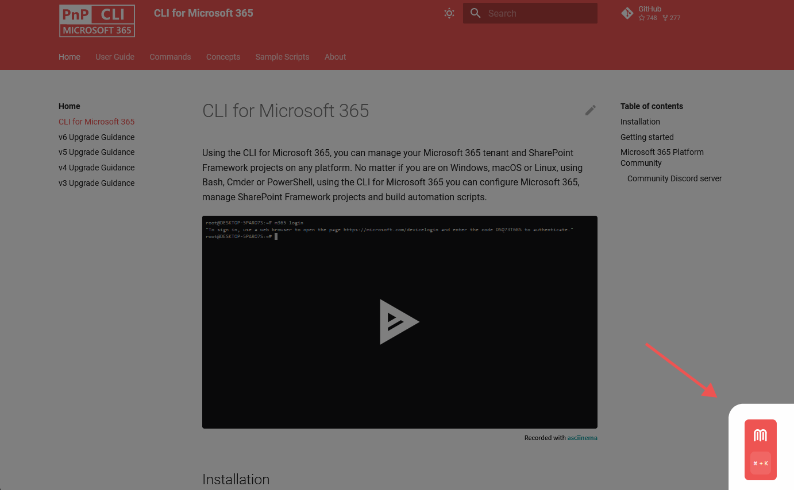

We've published a new minor version of CLI for Microsoft 365. 

[CLI for Microsoft 365](https://aka.ms/cli-m365) is a cross-platform tool. It helps you manage your Microsoft 365 tenant and SharePoint Framework projects. No matter which operating system or shell you use.

> Read the [release notes](https://aka.ms/cli-m365/notes) in full for all new features and improvements.
 
## What's new

We're pumped to announce our newest release, hot off the press! It's got a super cool command that's guaranteed to elevate your user experience to new heights. And guess what? You won't have to sift through endless lines of code to find out about it. Here's the scoop on some of the incredible features of this bad boy.

### Rev up your Power Platform with global configuration settings

Looking to supercharge your Power Platform game? Check out this exciting new command that's taking the tech world by storm! With this nifty command, you can now easily update the global configuration settings of your tenant, all from a single command. Say goodbye to manual configurations and hello to seamless automation. Whether you're looking to optimize your workflow or simply fine-tune your Power Platform experience, this command has got you covered. Check out the example below to see how you can disable guided experience, survey feedback, and newsletter.

```sh
m365 pp tenant settings set --walkMeOptOut true --disableNewsletterSendout true --disableSurveyFeedback true
```

- [pp tenant settings set](https://pnp.github.io/cli-microsoft365/cmd/pp/tenant/tenant-settings-set/)

## What's changed

Get ready to geek out because we've got some seriously cool news for you. This latest version of our product is jam-packed with some seriously awesome new features that'll take your experience to a whole new level! From improved functionality to fresh, funky additions, this update has it all. And we're not just talking about small tweaks here and there - we're talking about game-changing updates that'll revolutionize the way you work. So don't wait - take a quick peek at the overview below to see what all the fuss is about!

### **MAJOR:** Support for SharePoint Framework projects **v1.17.1**

Attention all SharePoint Framework fans! We've got some exciting news that's sure to make your day. Our latest update now includes support for SPFx `v1.17.1` across three of our most popular commands - `spfx project upgrade`, `spfx project doctor`, and `spfx doctor`. 

That's right - you can now take advantage of all the latest and greatest features of the SharePoint Framework with just a few clicks. So why wait? Upgrade your projects and elevate your workflow to the next level today!

```sh
m365 spfx project upgrade --output md
```

```sh
m365 spfx doctor --output text
```

```sh
m365 spfx project doctor --output md
```

- [spfx project upgrade](https://pnp.github.io/cli-microsoft365/cmd/spfx/project/project-upgrade/)
- [spfx doctor](https://pnp.github.io/cli-microsoft365/cmd/spfx/spfx-doctor/)
- [spfx project doctor](https://pnp.github.io/cli-microsoft365/cmd/spfx/project/project-doctor/)

### **MAJOR:** Experience the magic of **Mendable**

Big news, folks! We've just integrated **Mendable** with our docs, and it's about to blow your mind. 

For those who don't know, Mendable is a chat-based search tool that's all about seamless integration - making it the perfect solution for developer-facing companies. With its advanced components, Mendable delivers detailed, accurate, and contextually relevant answers to all your burning questions. 

And the best part? You can test it out right now, live on our docs! Just ask it anything you need to know about CLI for Microsoft 365, sit back, and watch it work its magic. It's like having your very own personal assistant - but better. So what are you waiting for? Give it a spin and see for yourself!

- [CLI for Microsoft 365 documentation](https://pnp.github.io/cli-microsoft365/)



On behalf of our team, we want to extend a **huge thank you** to the Mendable team for their collaboration and support during this integration process. We couldn't have done it without you, and we're excited to see how this partnership will continue to benefit our users moving forward. Thank you for all your hard work and dedication to making our platform the best it can be!

- [Check out **Mendable**](https://www.mendable.ai/)

### Say goodbye to pesky bugs

We've been working tirelessly to squash those pesky bugs and bring you a more dynamic and seamless experience than ever before. But don't just take our word for it - the proof is in the pudding. 

Take a look at our release notes below for the full rundown of all the bugs we've fixed. So what are you waiting for? Check it out and start enjoying a smoother experience today

- [Changelog v6.6.0](https://pnp.github.io/cli-microsoft365/about/release-notes/#v660)

## What's next

Here are some things that we are currently working on.

### More commands

We are always looking to add more commands to CLI for Microsoft 365. 

We are busy implementing commands across several Microsoft 365 services, such as Power Platform, SharePoint Online, and Microsoft Purview.

If you have any ideas or suggestions for new commands, please let us know by creating a [new issue](https://github.com/pnp/cli-microsoft365/issues/new?assignees=&labels=&template=new-command.yml&title=New+command%3A+%3Cshort+description%3E) in the GitHub Issues list, or reaching out to us on our [community Discord server](https://aka.ms/cli-m365/discord) to discuss.

## Contributors

This release wouldn't be possible without the help of (in alphabetical order):

- [Garry Trinder](https://github.com/garrytrinder)
- [Martin Lingstuyl](https://github.com/martinlingstuyl)
- [Milan Holemans](https://github.com/milanholemans)
- [Nico De Cleyre](https://github.com/nicodecleyre)
- [Nicolas](https://github.com/nickscamara)
- [Trygvi Zachariassen Laksafoss](https://github.com/rygviZL)
- [Waldek Mastykarz](https://github.com/waldekmastykarz)

Thank you all for the time you chose to spend on CLI for Microsoft 365 and for your help to advance it!

### High fives

CLI for Microsoft 365 wouldn't be where it is today if it weren't for our users who provide us with feedback. High fives to the following people who took the time to share their feedback and ideas for improvement with us (in alphabetical order):

- [Siddharth Vaghasia](https://github.com/siddharth-vaghasia)

## Try it today!

Get the latest release of CLI for Microsoft 365 from npm by executing:

```bash
npm i -g @pnp/cli-microsoft365
```

Or, you can get the latest release from Docker by executing:

```bash
docker run --rm -it m365pnp/cli-microsoft365:latest
```

## Need more info?

If you need more help getting started or want more details about the commands, architecture, or project, go to [aka.ms/cli-m365](https://aka.ms/cli-m365).

## Get in touch!

If you see any room for improvement, please, don't hesitate to reach out to us either on [GitHub](https://github.com/pnp/cli-microsoft365/issues), [Discord](https://aka.ms/cli-m365/discord), or [Twitter](https://twitter.com/climicrosoft365).
