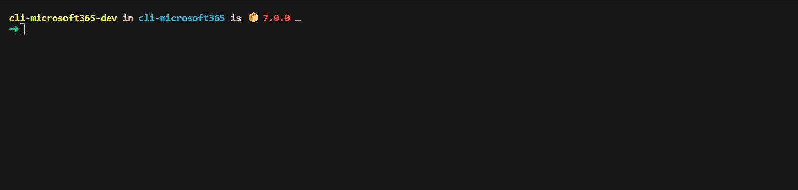

We've just published a new major version of the CLI for Microsoft 365 with new commands for working with and managing Microsoft 365 and SharePoint Framework projects on any platform.

## Manage Microsoft 365 and SharePoint Framework projects on any platform

[CLI for Microsoft 365](https://aka.ms/cli-m365) is a cross-platform command line tool based on Node.js that helps you manage many things around Microsoft 365 and your SPFx project. You may manage OneDrive, Planner, Power Apps and Automate, Teams, Viva Engage (Yammer), SharePoint (of course), and many many more. The list keeps on growing and growing.

## New major version of CLI for Microsoft 365 – v7

As we keep adding new commands to CLI for Microsoft 365, we noticed several areas that we should improve, to make using the CLI more intuitive and consistent. While our major releases are evolutionary in nature, we've also added some new commands and improvements to the CLI.

> To help you upgrade to v7, we prepared a summary of breaking changes and the recommended actions. For more information see the [v7 Upgrade Guidance](https://pnp.github.io/cli-microsoft365/v7-upgrade-guidance/) in our docs.

Following is an overview of the most noteworthy changes in v7.

> For the complete list of what's new and changed, see the [release notes](https://pnp.github.io/cli-microsoft365/about/release-notes/#v700).

### Streamlined commands and options

Once a year we take the opportunity to look at all of the functionality that we have in the CLI, and see how we can make it more consistent and intuitive. Typically, this leads to breaking changes. We've done our best to minimize the impact of these changes, but we still recommend that you review the [v7 Upgrade Guidance](https://pnp.github.io/cli-microsoft365/v7-upgrade-guidance/) in our docs to verify if you're affected by any of these changes before you upgrade to v7.

One example of this is the following. When doing destructive things like deleting a site, CLI for Microsoft 365 asks you to confirm your intention. In version 7 of the CLI for Microsoft 365, we have renamed the option `--confirm` to `--force` in all commands. This change aims to be more consistent with other CLI tools where `--force` is used to suppress prompts.

### Added support for upgrading SPFx projects to v1.18.0

SharePoint Framework (SPFx) allows you to build solutions for Microsoft Teams, Microsoft Viva, Outlook, the Microsoft 365 app and SharePoint. v1.18.0 of SPFx introduced several new features including designing Viva Connections custom cards for your dashboard. Aside from that, developers may now use Node.JS 18 to work with SPFx.

To benefit from these, and other improvements introduced in SPFx v1.18.0, upgrade your existing projects using the CLI for Microsoft 365.

> Important: CLI for Microsoft 365 won't upgrade your project. Instead, it will provide you with a report that you can use to upgrade your project yourself.

To upgrade your SPFx projects to v1.18.0, run the following command:

```sh
m365 spfx project upgrade --toVersion 1.18.0 --output md > report.md
```

You can also request a more interactive report built on top of the [VSCode CodeTour extension](https://marketplace.visualstudio.com/items?itemName=vsls-contrib.codetour), by running:

```sh
m365 spfx project upgrade --toVersion 1.18.0 --output tour
```

We've also updated other SPFx-related commands to support SPFx v1.18.0.

### Improved interactivity using the CLI for Microsoft 365

In our search for an even better user experience, we've had a good look at interactivity in the CLI for Microsoft 365. We've done a lot of work on it, and we're proud to finally present the results of those efforts! In the new version, the CLI for Microsoft 365 will (by default) prompt the user to select or enter extra information that's necessary for the command to run. This includes prompts for required options that the user forgot and requests to select an item from a result set, for example if the CLI for Microsoft 365 found multiple items with the same name.

Toggling this behavior on or off can be done as follows:

```sh
m365 cli config set --key prompt --value true
``` 

The following example shows how the CLI for Microsoft 365 prompts the user to select and fill in a required property and select one of the found applications:



To learn more about configuring the CLI for Microsoft 365, also take a look at our [m365 setup command](https://pnp.github.io/cli-microsoft365/cmd/setup), which makes it easy to configure the CLI to work best in your specific scenario. 

### Manage list item attachments stored in SharePoint

Lists are one of the most powerful features of SharePoint, providing a flexible and customizable way to store and manage data. Whether you need to track tasks, manage contacts, or store documents, lists can help you do it all. 
A part of working with lists is the ability to add attachments to list items, making it easy to keep all relevant information in one place. In this release we bring support for managing list attachments using the CLI for Microsoft 365. 

To add a new attachment to a list item from a local file, run:

```sh
m365 spo listitem attachment add --webUrl https://contoso.sharepoint.com/sites/project-x --listTitle "DemoList" --listItemId 147 --filePath "C:/Reports/File1.jpg"
```

To get information about a list item attachment, run:

```sh
m365 spo listitem attachment get --webUrl https://contoso.sharepoint.com/sites/project-x --listTitle "Demo List" --listItemId 147 --fileName "File1.jpg"
```

To update an attachment, run:

```sh
m365 spo listitem attachment set --webUrl https://contoso.sharepoint.com/sites/project-x --listTitle "Demo List" --listItemId 147 --fileName "File1.jpg" --filePath "C:/Reports/File2.jpg"
```

To remove an attachment from a list item, run:

```sh
m365 spo listitem attachment remove --webUrl https://contoso.sharepoint.com/sites/project-x --listTitle "Demo List" --listItemId 147 --fileName "File1.jpg"
```

To learn more about managing list item attachments, see the [list item attachment commands](https://pnp.github.io/cli-microsoft365/cmd/spo/listitem/listitem-attachment-list) in our docs.

### Removing an Entra ID / Azure AD Group

Using the CLI for Microsoft 365 it's already possible to remove Microsoft 365 groups. We've now added a new command to remove other types of Entra ID Groups.

To remove an Entra ID Group by display name, run:

```sh
m365 aad group remove --displayName Developers
``` 

To learn more about managing Entra ID Groups, see the [aad group commands](https://pnp.github.io/cli-microsoft365/cmd/aad/group/group-remove) in our docs.

### Retrieving information about any tenant

As more and more organizations embrace collaboration through Microsoft 365, guest access has become an important feature of company systems. Cross-tenant access allows users from different organizations to access and collaborate on shared resources, such as documents and lists. This can help streamline business processes and improve overall productivity. To set up cross-tenant access confidently, it's important to get basic tenant information in a secure way. Using the new command `tenant info get` it's now super easy to search for tenant information by entering the domain name.

To get tenant information for the Contoso tenant, run:

```sh
m365 tenant info get --domainName contoso.com
```

To learn more, see the [tenant info get](https://pnp.github.io/cli-microsoft365/cmd/tenant/info/info-get/) command documentation.

### Updates to our codebase

Version 7 also brings a lot of internal changes to our codebase. One important part of that is that we've moved to using ECMAScript Modules (ESM) instead of CommonJS modules. This may not seem directly relevant. But ESM is the standard module format for JavaScript, and offers a number of advantages over CommonJS, including better performance, improved debugging capabilities, and better support for tree-shaking and other optimization techniques. All this will improve the general experience of using the CLI for Microsoft 365. 

### What's next

Here are some things that we are currently working on.

#### Advanced integration with PowerShell

The CLI for Microsoft 365 is a cross platform / cross shell tool. This has always been an important feature. However, many of our users are familiar and use PowerShell in their everyday life. To make the end-to-end experience for these users even better, we're working on some interesting ideas to allow the CLI for Microsoft 365 to work even better when used with PowerShell.

We're currently [working this out](https://github.com/pnp/cli-microsoft365/issues/5470). We'd appreciate your feedback if this is of interest to your area.

#### Even more commands...

We're also implementing even more commands to work with Entra ID / Azure AD Groups, the tenant recycle bin, files and loads of further changes and enhancements.

## Contributors

This release wouldn't be possible without the help of (in alphabetical order):

- [Adam Wójcik](https://github.com/Adam-it)
- [dojcsakj](https://github.com/dojcsakj)
- [Ganesh Sanap](https://github.com/ganesh-sanap)
- [Jasey Waegebaert](https://github.com/Jwaegebaert)
- [Martin Lingstuyl](https://github.com/martinlingstuyl)
- [Mathijs Verbeeck](https://github.com/MathijsVerbeeck)
- [Michał Kornet](https://github.com/mkm17)
- [Michael Milton](https://github.com/multimeric)
- [Milan Holemans](https://github.com/milanholemans)
- [Nanddeep Nachan](https://github.com/nanddeepn)
- [Nico De Cleyre](https://github.com/nicodecleyre)
- [Saurabh Tripathi](https://github.com/Saurabh7019)
- [Smita Nachan](https://github.com/SmitaNachan)
- [Waldek Mastykarz](https://github.com/waldekmastykarz)

### New contributors

A warm welcome to this month's new contributors! (in alphabetical order):

- [dojcsakj](https://github.com/dojcsakj)
- [Michał Kornet](https://github.com/mkm17)

Thank you all for the time you chose to spend on CLI for Microsoft 365 and for your help to advance it!

### High fives

CLI for Microsoft 365 wouldn't be where it is today if it weren't for our users who provide us with feedback. High fives to the following people who took the time to share their feedback and ideas for improvement with us (in alphabetical order):

- [dojcsakj](https://github.com/dojcsakj)
- [kanandb](https://github.com/kanandb)
- [mmcveigh80](https://github.com/mmcveigh80)
- [tohsumi-bebio](https://github.com/tohsumi-bebio)
- [Kunj Balkrishna Sangani](https://github.com/kunj-sangani)

### Discussions

CLI for Microsoft 365 is constantly growing and evolving. We're always looking for ways to improve. There are still many areas not covered by the CLI as well as many amazing ideas for unique features the tool might provide. Your feedback will help us make the right decisions in which areas we should focus on. If you want to help out please do join the currently open [discussions](https://github.com/pnp/cli-microsoft365/discussions)

What else could we simplify? Let us know what you think by helping out with one of our [open issues](https://github.com/pnp/cli-microsoft365/issues) or chime in on our [discussions](https://github.com/pnp/cli-microsoft365/discussions)!

## Try it today

Get the latest release of CLI for Microsoft 365 from npm by executing:

```bash
npm i -g @pnp/cli-microsoft365
```

Alternatively, you can get the latest release from Docker by executing:

```bash
docker run --rm -it m365pnp/cli-microsoft365:latest
```

If you need more help getting started or want more details about the commands, architecture, or project, go to [aka.ms/cli-m365](https://aka.ms/cli-m365). If you see any room for improvement, please, don't hesitate to reach out to us either on [GitHub](https://github.com/pnp/cli-microsoft365/discussions), [Discord](https://discord.com/invite/7rfW4kg6B5), or [Twitter](https://twitter.com/climicrosoft365).
