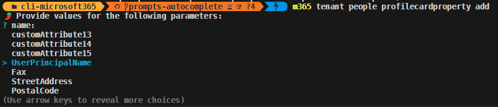

Introducing the latest release of CLI for Microsoft 365

[CLI for Microsoft 365](https://aka.ms/cli-m365) is a cross-platform command-line tool that allows you to manage your Microsoft 365 tenant and SharePoint Framework projects. This minor release introduces a number of new administrative commands as well as a ton of awesome improvements.

> Explore the [release notes](https://aka.ms/cli-m365/notes) to discover an array of exciting features and improvements that will revolutionize your Microsoft 365 journey. 
 
## What's new

### Microsoft Entra

With this release, we've introduced a new group of commands that allows you to manage administrative units. An administrative unit is a Microsoft Entra resource that can be a container for other Microsoft Entra resources. It may contain only users, groups, or devices.

To retrieve a list of administrative units

```sh
m365 aad administrativeunit list
```

To create an administrative unit with a specific display name

```sh
m365 aad administrativeunit add --displayName 'Marketing Division'
```

To get information about the administrative unit by its display name

```sh
m365 aad administrativeunit get --displayName 'Marketing Division'
```

To remove an administrative unit by it display name

```sh
m365 aad administrativeunit remove --displayName 'Marketing Division'
```

For more information check the following resources:
- [m365 aad administrativeunit list](https://pnp.github.io/cli-microsoft365/cmd/aad/administrativeunit/administrativeunit-list)
- [m365 aad administrativeunit add](https://pnp.github.io/cli-microsoft365/cmd/aad/administrativeunit/administrativeunit-add)
- [m365 aad administrativeunit get](https://pnp.github.io/cli-microsoft365/cmd/aad/administrativeunit/administrativeunit-get)
- [m365 aad administrativeunit remove](https://pnp.github.io/cli-microsoft365/cmd/aad/administrativeunit/administrativeunit-remove)

### Customize profile card

Thanks to a recent adjustment to MS Graph you may now use the profileCardProperty resource to show additional properties from Microsoft Entra ID on the profile card for a user either by: making additional attributes visible or adding custom attributes. In this minor release, we introduced all commands that will allow you to manage profile card properties.

To list all profile card properties

```sh
m365 tenant people profilecardproperty list
```

To add a custom extension attribute Cost Center as a profile property to the profile cards properties

```sh
m365 tenant people profilecardproperty add --name customAttribute1 --displayName 'Cost Center'
```

To retrieve information about a specific profile card property

```sh
m365 tenant people profilecardproperty get --name customAttribute1
```

To update a custom extension attribute with translations

```sh
m365 tenant people profilecardproperty set --name customAttribute1 --displayName "Cost Center" --displayName-nl-NL "Kostencentrum" --displayName-de "Kostenstelle"
```

To remove the UPN as a profile property from the profile cards

```sh
m365 tenant people profilecardproperty remove --name UserPrincipalName
```

For more information check the following resources:
- [m365 tenant people profilecardproperty list](https://pnp.github.io/cli-microsoft365/cmd/tenant/people/people-profilecardproperty-list)
- [m365 tenant people profilecardproperty add](https://pnp.github.io/cli-microsoft365/cmd/tenant/people/people-profilecardproperty-add)
- [m365 tenant people profilecardproperty get](https://pnp.github.io/cli-microsoft365/cmd/tenant/people/people-profilecardproperty-get)
- [m365 tenant people profilecardproperty set](https://pnp.github.io/cli-microsoft365/cmd/tenant/people/people-profilecardproperty-set)
- [m365 tenant people profilecardproperty remove](https://pnp.github.io/cli-microsoft365/cmd/tenant/people/people-profilecardproperty-remove)

## What's changed

### Added support for upgrading SPFx projects to v1.18.2

SharePoint Framework (SPFx) allows you to build solutions for Microsoft Teams, Microsoft Viva, Outlook, the Microsoft 365 app and SharePoint. v1.18.2 of SPFx introduced a minor improvement that allows you to use the latest version of yeoman.

To benefit from this you may upgrade your existing projects using the CLI for Microsoft 365.

> Important: CLI for Microsoft 365 won't upgrade your project. Instead, it will provide you with a report that you can use to upgrade your project yourself.

To upgrade your SPFx projects to v1.18.2, run the following command:

```sh
m365 spfx project upgrade --toVersion 1.18.2 --output md > report.md
```

You can also request a more interactive report built on top of the [VSCode CodeTour extension](https://marketplace.visualstudio.com/items?itemName=vsls-contrib.codetour), by running:

```sh
m365 spfx project upgrade --toVersion 1.18.2 --output tour
```

We've also updated other SPFx-related commands to support SPFx v1.18.2 like the `doctor` command which allows you to validate the correctness of a SharePoint Framework project.

To validate if your project is correctly set up and save the findings in a Markdown file

```sh
m365 spfx project doctor --output md > "doctor-report.md"
```

### Enhancements to interactive mode

CLI for Microsoft 365 is interactive by default. This means that you only need to type the command, hit enter and CLI will do the rest. It will ask for a minimal set of required information to execute the command. It will even help you determine the correct result from a list of found items. Now we extended this behavior with an additional improvement. Till now you always needed to type the option value even if some only allowed specific values from a list of possible options. Now CLI will present you a list of possible choices for you to select the wanted option. This means less typing and fewer mistakes. 



### And more...

If you are eager to go over all of the details and improvements added in this release, do not hesitate to check out the [release notes](https://pnp.github.io/cli-microsoft365/about/release-notes#v720) to find out more.

## Upcoming changes

Curious about what lies ahead? We're excited to share some of our ongoing projects and initiatives.

Right now, there are over 90 issues that are actively being developed and 61 issues that are up for grabs. We're working hard to bring you even more exciting features and improvements in the next release. 

But we don't stop there. We value your input and ideas. If you have any suggestions for new commands, don't hesitate to share them with us. Create a [new issue](https://github.com/pnp/cli-microsoft365/issues/new?assignees=&labels=&template=new-command.yml&title=New+command%3A+%3Cshort+description%3E) on our GitHub Issues list or join our vibrant [community Discord server](https://aka.ms/cli-m365/discord) to engage in discussions.

Together, let's shape the future of CLI for Microsoft 365 and unlock even greater possibilities.

## Contributors

We want to extend our heartfelt appreciation to the incredible individuals who have made this release possible. Without their valuable contributions and dedication, CLI for Microsoft 365 wouldn't be where it is today. Let's give a round of applause to the following contributors (in alphabetical order):

- [Aaron Junker](https://github.com/Aaron-Junker)
- [Adam Wójcik](https://github.com/Adam-it)
- [Jasey Waegebaert](https://github.com/Jwaegebaert)
- [Joel Rodrigues](https://github.com/joelfmrodrigues)
- [Martin Lingstuyl](https://github.com/martinlingstuyl)
- [Martin Machacek](https://github.com/MartinM85)
- [Milan Holemans](https://github.com/milanholemans)
- [Nanddeep Nachan](https://github.com/nanddeepn)
- [Nico De Cleyre](https://github.com/nicodecleyre)
- [Reshmee Auckloo](https://github.com/reshmee011)
- [Saurabh Tripathi](https://github.com/Saurabh7019)
- [Tobias Maestrini](https://github.com/tmaestrini)
- [Waldek Mastykarz](https://github.com/waldekmastykarz)

We express our deepest gratitude for the time and effort you have invested in CLI for Microsoft 365, improving its progress and enriching its capabilities. Your contributions have played a significant role in advancing this project and empowering users worldwide. Thank you for your commitment and valuable assistance!

### High fives

We would like to give a big shoutout and high fives to the amazing individuals who have shared their invaluable feedback and ideas for improving CLI for Microsoft 365. We greatly appreciate your engagement and contribution to the growth of our platform. Let's celebrate the following users (in alphabetical order) for taking the time to provide us with their insights:

- //TODO

## Get Started Today!

Experience the power of CLI for Microsoft 365 by getting the latest release from npm:

```bash
npm i -g @pnp/cli-microsoft365
```

Alternatively, you can access the latest release from Docker:

```bash
docker run --rm -it m365pnp/cli-microsoft365:latest
```

## Need More Information?

For additional guidance on getting started or to explore detailed information about commands, architecture, or the project itself, visit [aka.ms/cli-m365](https://aka.ms/cli-m365).

## Stay Connected!

We value your feedback and are eager to hear from you. If you have any suggestions for improvement or want to engage with our community, you can reach out to us on [GitHub](https://github.com/pnp/cli-microsoft365/issues), [Discord](https://aka.ms/cli-m365/discord), or [X](https://x.com/climicrosoft365). Don't hesitate to connect with us. Your input plays a vital role in shaping the future of CLI for Microsoft 365.
