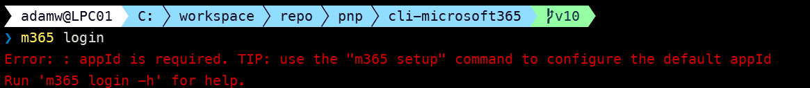
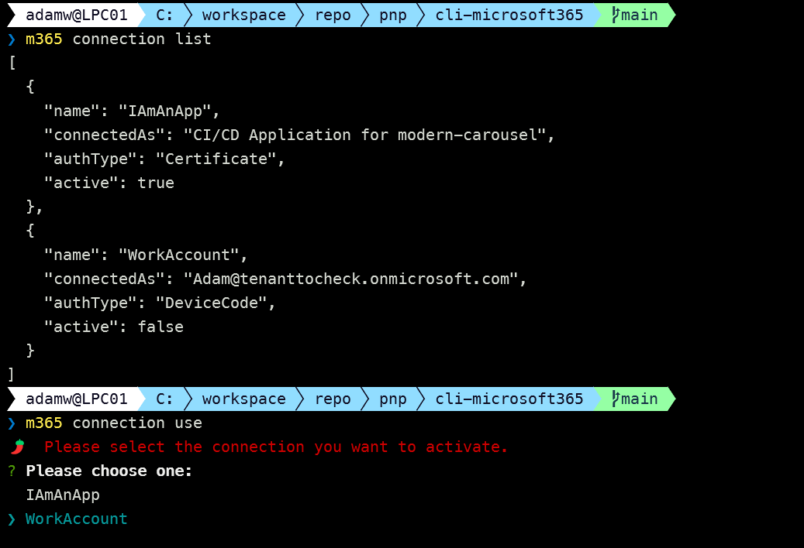

We have just published a new major version of CLI for Microsoft 365 v9. [CLI for Microsoft 365](https://aka.ms/cli-m365) is a cross-platform command-line tool that allows you to manage your Microsoft 365 tenant and SharePoint Framework projects. This major release introduces several new commands that will enhance the quality of your Microsoft 365 experience as well as a breaking change in the default login expiriance.

> Explore the [release notes](https://aka.ms/cli-m365/notes) to discover an array of exciting features and improvements that will revolutionize your Microsoft 365 journey. 
 
## The new major version of CLI for Microsoft 365 – v9

This major release is a reaction to an announcement that the PnP Management Shell multi-tenant app will be removed on September 9. Previously you were able to use this app to grant the needed permissions for your scripts or standard usage of CLI for Microsoft 365. Till now it was even used as the default login method. As mentioned at the beginning this multi-tenant app registration will be however deleted on September 9, 2024 which might have an impact on your existing scripts. Check the following [recording for more details](https://www.youtube.com/watch?v=VNgc4k_gCT0) on this announcement. Although using the PnP Management Shell was very convenient it wasn't the best approach that should be picked especially when running automated scripts on your tenant. This option will now go away to help customers to improve their security posture by encouraging the use of single-tenant app and just the scopes and permissions that are needed. CLI for Microsoft 365 already supports login over your own Entra app registration and we already have [guidance that will guide you through the process](https://pnp.github.io/cli-microsoft365/user-guide/using-own-identity). In this release, we introduced some features that might prove very helpful in adapting to this change.

The most important change that had to be done was the way CLI for Microsoft 365 will perfomr default login. When running `m365 login` CLI will first check if you defined the `appId` which is now required to your own single tenant Entra app registration. 

This may be either passed as the option like 

```sh
m365 login --appId 31359c7f-bd7e-475c-86db-fdb8c937548c --tenant 31359c7f-bd7e-475c-86db-fdb8c937548a
```

Or you may also define it as a CLI for Microsoft 365 config using the following command by running

```sh
m365 cli config set --key 'clientId' --value '31359c7f-bd7e-475c-86db-fdb8c937548e'
```

You may also define it as an environment variable `CLIMICROSOFT365_ENTRAAPPID` and you may find more details regarding this option in our [guide](https://pnp.github.io/cli-microsoft365/user-guide/using-own-identity#create-environment-variables). 

This means that you will now need to set up your own Entra app registration before performing the initial login. You may do that in several ways. Either by doing it manually and we also included detailed [step by step documentation for that](https://pnp.github.io/cli-microsoft365/user-guide/using-own-identity#register-microsoft-entra-application-in-your-tenant) or you may use our new `setup` experience which will make this process effortless. 
By the way, this tip you may also find when running the `m365 login` command without specifing the `appId`. 



The m365 setup command is a wizard that helps you configure the CLI for Microsoft 365 for your needs. It will ask you a series of questions and based on your answers, it will configure the CLI for Microsoft 365 for you and now it will also help you create your own Entra app registration in a matter of seconds.

When running:

```sh
m365 setup
```

CLI will now ask you an additional question:

- CLI for Microsoft 365 requires a Microsoft Entra app. Do you want to create a new app registration or use an existing one?

You can choose between using an existing Entra app or creating a new one. If you choose to create a new app, the CLI will ask you to choose between a minimal and a full set of permissions. 
A minimal set of permissions will create a new Entra app registration with only `User.Read` scope. This is a perfect starting point to have a ready to use app that then you may manually modify to add only the needed scopes for your script. 
Full set of permissions, on the other hand, will create an Entra app registration with all the scopes currently required to run all commands CLI for Microsoft 365 has. This is very convenient and is the easiest thing to pick to get unblocked with all CLI functionalities.
Whats important to now is that the `setup` command signs in as Azure CLI to your tenant to create a new app registration, and stores its information in the CLI configuration so that then you don't need to specify them yourself in the `login` command. Check out how easy and convenient it is in this short demo:


> To help you upgrade to v9, we prepared a summary of the breaking change and the recommended actions. For more information see the [v9 Upgrade Guidance](https://pnp.github.io/cli-microsoft365/v9-upgrade-guidance/) in our docs.

Following is an overview of the most noteworthy changes in v9.

> For the complete list of what's new and changed, see the [release notes](https://pnp.github.io/cli-microsoft365/about/release-notes/#v900).

## What else is new

### New command to remove Entra enterprise application

We already have commands that allow you to query and even add a new Entra enterprise application. Now, we have extended this area with a brand new command that will allow you to clean up by removing the unneeded enterprise application. It is extra convenient to use.

To delete an enterprise application by display name run:

```sh
m365 entra enterpriseapp remove --displayName "Contoso app"
```

You may also do the same either by specifying application ID:

```sh
m365 entra enterpriseapp remove --id b2307a39-e878-458b-bc90-03bc578531d6
```

Or object ID: 

```sh
m365 entra enterpriseapp remove --objectId b2307a39-e878-458b-bc90-03bc578531dd
```

For more information check the following resources:
- [m365 entra enterpriseapp remove](https://pnp.github.io/cli-microsoft365/cmd/entra/enterpriseapp/enterpriseapp-remove)

### New command to modify an Entra group

In this release, we introduced a new way that will allow you to modify the: name, description, visibility, group owners and even members, and a lot more of an Entra group all wrapped in an easy-to-use single command.

To update the display name of a group specified by the display name, simply run:

```sh
m365 entra group set --displayName Devs --newDisplayName Developers
```

To set the owners of a group to the specified people run:

```sh
m365 entra group set --id 57fd6b33-54eb-42b0-9ea0-8a9ac04eab7d --ownerUserNames "john.doe@contoso.com,adele.vance@contoso.com"
```

For more information check the following resources:
- [m365 entra group set](https://pnp.github.io/cli-microsoft365/cmd/entra/group/group-set/)

### Extended SharePoint Embedded capabilities

This time we also introduced a new command to the SPE (SharePoint Embedded) area that will allow you to list all Container Types.

You may do that by running:

```sh
m365 spe containertype list
```

For more information check the following resources:
- [m365 spe containertype list](https://pnp.github.io/cli-microsoft365/cmd/spe/containertype/containertype-list/)

### More entra multitenant commands

We continue to invest in the Entra multitenant commands by extending this area with three new commands that will allow you to creates and remove multitenant organization or update its properties.

To create a new multitenant organization with a display name only, run the following:

```sh
m365 entra multitenant add --displayName 'Contoso organization'
```

To remove the multitenant organization, simply do:

```sh
m365 entra multitenant remove
```

To update the multitenant organization display name and description, simply run:

```sh
m365 entra multitenant set --displayName 'Fabrikam organization' --description 'Multitenant organization between Fabrikam and Contoso'
```

For more information check the following resources:
- [m365 entra multitenant add](https://pnp.github.io/cli-microsoft365/cmd/entra/multitenant/multitenant-add/)
- [m365 entra multitenant remove](https://pnp.github.io/cli-microsoft365/cmd/entra/multitenant/multitenant-remove/)
- [m365 entra multitenant set](https://pnp.github.io/cli-microsoft365/cmd/entra/multitenant/multitenant-set/)

### Restore a deleted message from a channel in a Team with ease

Teams commands were always an important part of CLI for Microsoft 365 and in this release, we added a brand new command that will allow you to restore a deleted message from a channel.

You may do that either by specifying everything by IDs:

```sh
m365 teams message restore --teamId 5f5d7b71-1161-44d8-bcc1-3da710eb4171 --channelId 19:4a95f7d8db4c4e7fae857bcebe0623e6@thread.tacv2 --id 1540747442203
```

Or use team and channel display names for readability:

```sh
m365 teams message restore --teamName Marketing --channelName Branding --id 1540747442203
```

For more information check the following resources:
- [m365 teams message restore](https://pnp.github.io/cli-microsoft365/cmd/teams/message/message-restore/)

### Create a new OneNote notebook

Everybody need some place for notes and OneNote is one of the best tools for that. In this release we give you a brand new command that will allow you to automate creating OneNote notebooks either for a single user or for a group.

To create a Microsoft OneNote notebook for the currently logged in user run:

```sh
m365 onenote notebook add --name "Private Notebook"
```

Or to create a Microsoft OneNote notebook in a group specified by displayName run:

```sh
m365 onenote notebook add --name "Private Notebook" --groupName "MyGroup"
```

For more information check the following resources:
- [m365 onenote notebook add](https://pnp.github.io/cli-microsoft365/cmd/onenote/notebook/notebook-add/)

### Query folder sharing link

This release also introduced two new commands that will allow you to get the folder sharing links and their details.

To list all sharing links of a folder by URL, run:

```sh
m365 spo folder sharinglink list --webUrl https://contoso.sharepoint.com/sites/demo --folderUrl "/sites/demo/shared documents/folder"
```

And to get a specific sharing link of a folder by URL, run:

```sh
m365 spo folder sharinglink get --webUrl https://contoso.sharepoint.com/sites/demo --id 45fa6aed-362f-48b1-b04e-6da85a526506 --folderUrl "/sites/demo/shared documents/folder"
```

For more information check the following resources:
- [m365 spo folder sharinglink list](https://pnp.github.io/cli-microsoft365/cmd/spo/folder/folder-sharinglink-list/)
- [m365 spo folder sharinglink get](https://pnp.github.io/cli-microsoft365/cmd/spo/folder/folder-sharinglink-get/)

## What's changed

Besides all these new commands, we've also made some changes to some existing commands. A few bugs have been fixed and the codebase has been polished. Changes include an enhancement to the way we may [activate the specified Microsoft 365 tenant connection](#Enhacemenets-to-connection-use-command).

### Enhancements to connection use command

One of the biggest advantages of the CLI for Microsoft 365 is that it is able to connect to multiple accounts (tenants) and switch connections when needed instead of having to log in and out every time. In this release, we enhanced the `connection use` command in a way that it will present you a prompt with a list of all your connections so it is super easy to just pick the correct one and perform the switch. 



- [m365 connection use](https://pnp.github.io/cli-microsoft365/cmd/connection/connection-use/)

## Upcoming changes

Curious about what lies ahead? We are excited to share some of our ongoing projects and initiatives.

Right now, there are over 40 opened PRs with new awesome features that will soon be added to CLI for Microsoft 365, and [93 issues that are up for grabs](https://github.com/pnp/cli-microsoft365/issues?q=is%3Aissue+is%3Aopen+label%3A%22help+wanted%22). We're working hard to bring you even more exciting features and improvements in the next release. 

But we don't stop there. We value your input and ideas. If you have any suggestions for new commands, don't hesitate to share them with us. Create a [new issue](https://github.com/pnp/cli-microsoft365/issues/new/choose) on our GitHub Issues list or join our vibrant [community Discord server](https://aka.ms/cli-m365/discord) to engage in discussions.

Sharing is Caring!

## Contributors

We want to extend our heartfelt appreciation to the incredible individuals who have made this release possible. Without their valuable contributions and dedication, CLI for Microsoft 365 wouldn't be where it is today. Let's give a round of applause to the following contributors (in alphabetical order):

- [Adam Wójcik](https://github.com/Adam-it)
- [Arjun Menon](https://github.com/arjunumenon)
- [Jasey Waegebaert](https://github.com/Jwaegebaert)
- [Martin Lingstuyl](https://github.com/martinlingstuyl)
- [Martin Machacek](https://github.com/MartinM85)
- [Mathijs Verbeeck](https://github.com/MathijsVerbeeck)
- [Milan Holemans](https://github.com/milanholemans)
- [Nanddeep Nachan](https://github.com/nanddeepn)
- [Nico De Cleyre](https://github.com/nicodecleyre)
- [Reshmee Auckloo](https://github.com/reshmee011)
- [Saurabh Tripathi](https://github.com/Saurabh7019)
- [Waldek Mastykarz](https://github.com/waldekmastykarz)

### High fives

We would like to give a big shoutout and high fives to the amazing individuals who have shared their invaluable feedback and ideas for improving CLI for Microsoft 365. We greatly appreciate your engagement and contribution to the growth of our platform. Let's celebrate the following users (in alphabetical order) for taking the time to provide us with their insights:

- [Albert-Jan Schot](https://github.com/appieschot)
- [Gustavo Velez](https://github.com/gavdgavd)
- [hsantens](https://github.com/hsantens)
- [Janne Holm](https://github.com/jhholm)
- [louderthanloud123](https://github.com/louderthanloud123)
- [Michał Kornet](https://github.com/mkm17)
- [MOMED2023](https://github.com/MOMED2023)
- [NGseb](https://github.com/NGseb)
- [Priya Ananthasankar](https://github.com/priyaananthasankar)
- [tor-axbit](https://github.com/tor-axbit)

## Get started today!

Experience the power of the CLI for Microsoft 365 by getting the latest release from npm:

```bash
npm i -g @pnp/cli-microsoft365
```

Alternatively, you can access the latest release from Docker:

```bash
docker run --rm -it m365pnp/cli-microsoft365:latest
```

## Need more information?

For additional guidance on getting started or to explore detailed information about commands, architecture, or the project itself, visit [aka.ms/cli-m365](https://aka.ms/cli-m365).

## Stay connected!

We value your feedback and are eager to hear from you. If you have any suggestions for improvement or want to engage with our community, you can reach out to us on [GitHub](https://github.com/pnp/cli-microsoft365/issues), [Discord](https://aka.ms/cli-m365/discord), or [X](https://x.com/climicrosoft365). Don't hesitate to connect with us. Your input plays a vital role in shaping the future of CLI for Microsoft 365.
