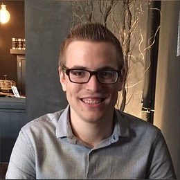

We're excited to announce that Mathijs Verbeeck is joining CLI for Microsoft 365 as maintainer!

## CLI for Microsoft 365 - more than just a tool

We've been working on CLI for Microsoft 365 for almost 7 years now, making it the one tool to manage Microsoft 365 and SharePoint Framework projects. We've been consistently evolving it with new commands and features to make it easier for you to work with Microsoft 365.

We wouldn't have been here without everyone's help, and we appreciate it very much. We have many ideas for making the CLI even better, not to mention that Microsoft 365 keeps evolving as well, and we want to ensure that CLI for Microsoft 365 offers you everything that you might need to manage your Microsoft 365 tenant and apps.

To be sure, that we can timely respond to all your questions and process all incoming pull requests to ship new features, we've asked Mathijs Verbeeck to join us as maintainer.

## Mathijs in his own words

Hello! I'm a SharePoint developer with expertise in both On-Premise and Online environments since 2016. When I'm not busy working with code and mastering SharePoint's quirks, you'll find me on the badminton court, enjoying a good game or training youth players at our club. I also love to watch and sometimes play football, this however only recreational. 

I have been working on the CLI for Microsoft 365 product ever since May 2022 and have since then tried to enrich the product with my contributions, and I am very proud to have been given the opportunity to join the Maintainer Team.

## Achieve more together

Mathijs has been working together with us on CLI for Microsoft 365 for a while now. He's been contributing new features, and improvements, helping unblock others, and sharing ideas for how we could improve the CLI. We're excited to have him on the team, and are looking forward to working together with him even more closely.
