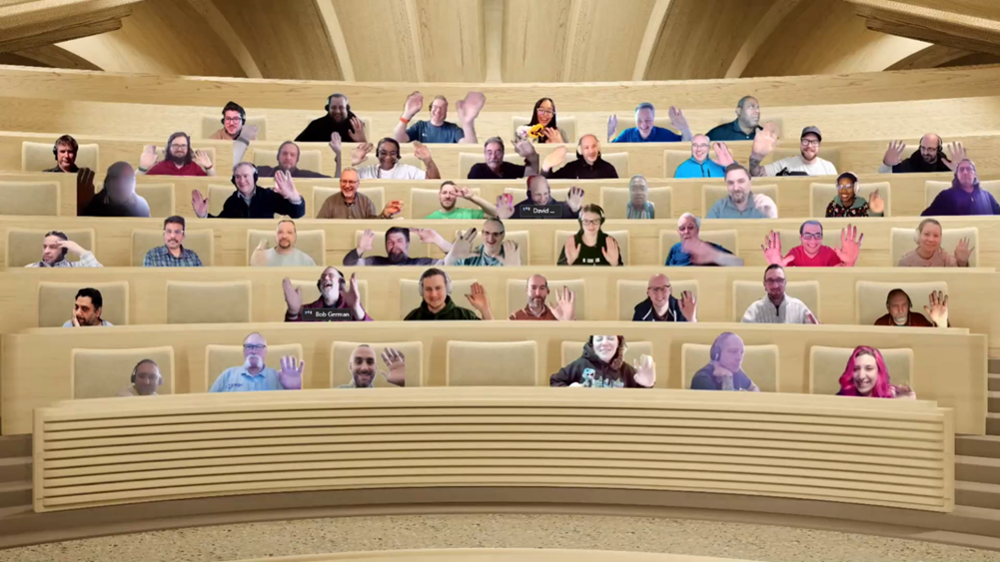

## Call summary

Welcome to the bi-weekly call focused on Microsoft 365 platform development topics. In this call, we focus on Microsoft Teams, Microsoft Graph, Power Platform, SharePoint, Microsoft Lists with topics ranging from development tools to list and column formatting, to site design and provisioning, and more.

### New this week

* Announcements
    * Agenda set for next [Microsoft 365 & Power Platform weekly call](https://aka.ms/m365-dev-call) - Tuesday, April 4th, 8:00 am PT.
        * Latest news from Microsoft engineering on Microsoft 365 topics
        * **Bob German** – Build a Teams Meeting app with Live Share SDK - Who's Next sample
        * **Rajdeep Chanda, Harshit Kumar** and **Mahesh Singhania** – Latest on the Microsoft Graph Connectors
        * **To be announced** – Microsoft Graph Hackathon - Winner demo \#1
    * ISV’S BUILDING MONETIZED TEAMS APPS - The ecosystem team wants to support you! \| aka.ms/TeamsApp/Support
    * Community Calls Conversations - Chime into a Community Calls Conversation – chat about demos anytime. Links and QR Codes associated to every demo – see in call deck and in demo summaries.
    * Community updates in LinkedIn - aka.ms/community/li
* Project releases
    * PnP .NET Libraries - [PnP Framework](https://github.com/pnp/pnpframework) – v1.12.0 (GA)
    * PnP .NET Libraries - [PnP Core SDK](https://github.com/pnp/pnpcore/tree/dev) – v1.9.0 (GA)
    * [PnP PowerShell](https://github.com/pnp/PnP-PowerShell) – v2.0.0 (preview)
* Power Platform - [Independent Publisher Connectors](https://github.com/microsoft/PowerPlatformConnectors/tree/dev/independent-publisher-connectors) submissions
    * Worldwide Bank Holidays
    * Webex Integration
    * Cohere
    * Exact Time & Billing
    * [Pushover](https://github.com/microsoft/PowerPlatformConnectors/tree/dev/independent-publisher-connectors/Pushover) - [Glen Hutson](https://github.com/glenhutson)
    * [Top Connector Asks](https://github.com/microsoft/PowerPlatformConnectors/wiki/Top-Connector-Asks)
    * Good Flow story? Tell us. [FlowOfTheWeek](https://aka.ms/FlowOfTheWeekForm) – aka.ms/FlowOfTheWeekForm
* [Script samples](https://pnp.github.io/script-samples/)
    * New – PnP PowerShell – [Change SharePoint Online List URL](https://pnp.github.io/script-samples/spo-change-list-url/README.html?tabs=pnpps) - [Ganesh Sanap](https://twitter.com/GaneshSanap20) \| @GaneshSanap20
    * New – PnP PowerShell – [Disable SharePoint List Commenting at list level](https://pnp.github.io/script-samples/spo-disable-list-comments/README.html?tabs=pnpps) - [Ganesh Sanap](https://twitter.com/GaneshSanap20) \| @GaneshSanap20
    * New – PnP PowerShell – [Export User Profiles to CSV](https://pnp.github.io/script-samples/spo-export-upa-accounts/README.html?tabs=pnpps) - [Kasper Bo Larsen](http://twitter.com/kasperbolarsen) \| @kasperbolarsen
    * Updated – CLI for Microsoft 365 – [Export User Profiles to CSV](https://pnp.github.io/script-samples/spo-export-upa-accounts/README.html?tabs=pnpps) - [Valeras Narbutas](http://twitter.com/ValerasNarbutas) (Macaw) \| @ValerasNarbutas
    * Updated – PnP PowerShell – [Add/Update Image in SharePoint Image column](https://pnp.github.io/script-samples/spo-add-update-image-column/README.html?tabs=pnpps) - [Matt Jimison](https://twitter.com/mjimison) \| @mjimison
    * [Good first issue asks](https://github.com/pnp/script-samples)
    * Power Platform Integrations / Connectors LABs Participant Calls. [Complete this form](https://forms.office.com/pages/responsepage.aspx?id=v4j5cvGGr0GRqy180BHbR0BHMrjhL0hDmckROosW6AFUOUVHNTlRRlAxQUI5S0hJNFdIWkZBRzlaTy4u)
* [Microsoft Teams samples](https://pnp.github.io/teams-dev-samples/) – Featured Teams App Samples with Full Tutorials
    * [Card Bot - Bot showcasing the Adaptive Card Universal Action Model in Node/TypeScript](https://github.com/pnp/teams-dev-samples/tree/main/samples/bot-uam-cardbot) - [Rabia Williams](https://twitter.com/williamsrabia) (Microsoft) \| @williamsrabia \| aka.ms/bot-uam-cardbot
    * ISV’S BUILDING MONETIZED TEAMS APPS - The ecosystem team wants to support you! \| aka.ms/TeamsApp/Support
    * Wanted – Updated Microsoft Teams JavaScript samples using Teams SDK v2 \| [Microsoft Teams Development Samples](https://pnp.github.io/teams-dev-samples/) \| aka.ms/Teams-Samples
* [Power Platform Samples](https://pnp.github.io/powerplatform-samples/) & [Power Apps Samples](https://github.com/pnp/powerapps-samples)
    * New Power App - [Quality Assurance Assessment Solution](https://github.com/NatiTurts/PowerApps_Quality_Assurance_Assessment) - [Nati Turtledove](https://twitter.com/NatiTurts) \| @NatiTurts
    * New Power App - [Power Happening](https://github.com/pnp/powerapps-samples/pull/188) - [Wilmer Alcivar](https://github.com/walcivar) & [Ben den Blanken](https://twitter.com/BenDenBlanken) \| @BenDenBlanken
    * Updated Power App - [Name Pronunciation Recorder](https://github.com/pnp/powerapps-samples/tree/main/samples/name-pronunciation-recorder) - [Lindsay Shelton](https://twitter.com/lshelton_tech) \| @lshelton_tech
* [Conversations](https://aka.ms/pnpweekly)
    * Microsoft 365 PnP Weekly – Episode 203 with by Germany-based Microsoft MVP, Developer, Consultant - [Luise Freese](https://twitter.com/LuiseFreese) \| @LuiseFreese (March 27th) \| [video](https://pnp.github.io/blog/microsoft-365-pnp-weekly/episode-203/) \| [podcast](https://www.podbean.com/eas/pb-e56dm-13ca5ec)
    * Microsoft 365 Developer Podcast – User Interfaces and Accessibility with Stefan Bauer (March 21st ) \| [podcast](https://m365devpodcast.com/e/user-interfaces-and-accessibility-with-stefan-bauer/)
    * Power Platform Connections - Power Platform Connections Ep 6 - Shane Young (March 24th) \| [video](https://www.youtube.com/watch?v=v6mifi35_SQ)

### Demos

* **Have fun with DALL-E generated art in your Teams conversations** – review OpenAI - DALL-E, then proceed to implement an AI scenario using a Teams Message Extension and an Azure Bot. Request an AI generated image based on a simple text description, receive back an image rendered in an Adaptive Card leveraging the Bot Framework to execute the transaction and accessing an Open AI API. A thoroughly educational code walk-through. Sample available. Discussion at [aka.ms/Mar30-Demo1](https://aka.ms/Mar30-Demo1)
* **List Formatting - Convert data into graphical information** – inspired by static graphics used in PPT, here are ways to enliven data points stored in your SharePoint list. Samples covered include process arrows, lifecycle, content circular, content pyramid, matrix, content box, timelapse, and welcome message. Samples shown are presently or soon will be available in the PnP Samples repository. All samples render well in desktop and mobile views. Discussion at [aka.ms/Mar30-Demo2](https://aka.ms/Mar30-Demo2)
* **Companies House Independent Publisher Connector - How API integration adds value** – for developers. Evaluate pros/cons of using HTTP Action in Cloud flow, custom connector, and Independent Publisher Connector to bring data/value into your Power Automate flows/apps. See how a flow invokes a Companies House connector action that calls the Companies House’s API and brings back data for report. Advantages of Independent Publisher Connectors include - used across flows and apps, DLP governed, worldwide usage, centrally updated. Discussion at [aka.ms/Mar30-Demo3](https://aka.ms/Mar30-Demo3)

The host of this call was [David Warner II](http://twitter.com/DavidWarnerII) (Microsoft) \| @DavidWarnerII. Q&A takes place in chat throughout the call.



## Agenda items

[00:00](https://youtu.be/2XlwO6tqAm0?t=0) – Intro - [David Warner II](http://twitter.com/DavidWarnerII) (Microsoft) \| @DavidWarnerII

[06:20](https://youtu.be/2XlwO6tqAm0?t=380) – PnP .NET library updates - [Bert Jansen](http://twitter.com/O365bert) (Microsoft) @O365bert

[07:10](https://youtu.be/2XlwO6tqAm0?t=430) – PnP PowerShell updates - [Gautam Sheth](http://twitter.com/gautamdsheth) (Valo Intranet) \| @gautamdsheth

[09:00](https://youtu.be/2XlwO6tqAm0?t=540) – yo Teams updates - [David Warner II](http://twitter.com/DavidWarnerII) (Microsoft) \| @DavidWarnerII

[09:52](https://youtu.be/2XlwO6tqAm0?t=592) – Microsoft Teams Toolkit updates - [John Miller](https://twitter.com/jmillerdev) (Microsoft) \| @jmillerdev

[10:47](https://youtu.be/2XlwO6tqAm0?t=647) – Microsoft Graph Toolkit updates - [David Warner II](http://twitter.com/DavidWarnerII) (Microsoft) \| @DavidWarnerII

[11:21](https://youtu.be/2XlwO6tqAm0?t=681) – Independent Publisher Connectors - [Jocelyn Panchal](https://twitter.com/JocelynP_PM) (Microsoft) \| @JocelynP_PM

[12:51](https://youtu.be/2XlwO6tqAm0?t=771) – Microsoft Script Samples - [Paul Bullock](http://twitter.com/pkbullock) \| @pkbullock

[14:27](https://youtu.be/2XlwO6tqAm0?t=867) – Microsoft Teams Samples - [David Warner II](http://twitter.com/DavidWarnerII) (Microsoft) \| @DavidWarnerII

[16:17](https://youtu.be/2XlwO6tqAm0?t=977) – Microsoft Power Platform Samples - [Hugo Bernier](https://twitter.com/bernierh) (Microsoft) \| @bernierh

[17:15](https://youtu.be/2XlwO6tqAm0?t=1035) – Together mode picture

[18:21](https://youtu.be/2XlwO6tqAm0?t=1101) – Demo - Have fun with DALL-E generated art in your Teams conversations – [Lee Ford](https://twitter.com/lee_ford)​ (Symity) \| @lee_ford

[31:48](https://youtu.be/2XlwO6tqAm0?t=1908) – Demo - List Formatting - Convert data into graphical information – [André Lage](https://twitter.com/aaclage)​ (Datalynx AG) \| @aaclage

[46:06](https://youtu.be/2XlwO6tqAm0?t=2766) – Demo - Companies House Independent Publisher Connector - How API integration adds value – [Matt Collins-Jones](https://twitter.com/D365Geek) (Capgemini) \| @D365Geek

[55:09](https://youtu.be/2XlwO6tqAm0?t=3309) – Closing

## Together Mode

What a great call today. How about those demos!  Thank you for your participation in chat and in this photo op. Next stop - April. Hope to see you again soon.

## Actions

* [Give us feedback about the calls](https://forms.office.com/pages/responsepage.aspx?id=v4j5cvGGr0GRqy180BHbR02h_1H9_XFFp4etSzu5JxFUOEc5UkxDN0dGMUgyOTBDVklBREJPRVI1Qi4u) – rate the call content and provide input on how we can improve - aka.ms/community/calls/feedback
* [Request to Present a demo](https://aka.ms/community/request/demo) during Microsoft 365 & Power Platform community calls - aka.ms/community/request/demo
* Chime into a Community Calls Conversation – chat about demos anytime. Links and QR Codes associated to every demo – see in call deck and in demo summaries.
* Opt into the [PnP Recognition Program](https://aka.ms/m365pnp-recognition) \| [aka.ms/m365pnp-recognition](https://aka.ms/m365pnp-recognition)
* Register for upcoming [Sharing is Caring](https://pnp.github.io/sharing-is-caring/) events:
    * Power Platform Samples Contributor \| Monday, April 10th, 11:00am PT \| 2:00pm ET - [Register](https://forms.office.com/pages/responsepage.aspx?id=KtIy2vgLW0SOgZbwvQuRaXDXyCl9DkBHq4A2OG7uLpdUN0hMNTRPWVVWTkhFTk9QQzhFSTRIS1JLSC4u)
    * Maturity Model Practitioners \| Tuesday, April 18th, 7am PST – [Download reoccurring invite](https://aka.ms/mm4m365/invite)
    * PnP Office Hours – 1:1 session \| [Register](https://outlook.office365.com/owa/calendar/PnPSharingisCaring@warner.digital/bookings/)
    * PnP Buddy System \| [Request a Buddy](https://forms.office.com/Pages/ResponsePage.aspx?id=KtIy2vgLW0SOgZbwvQuRaXDXyCl9DkBHq4A2OG7uLpdUMjRRUVg4NElZUUJLTEY1TVVSVDJFRFpLRS4u)
* Join the next monthly Power Platform Integrations / Connectors LABs Participant call. [Complete this form](https://forms.office.com/pages/responsepage.aspx?id=v4j5cvGGr0GRqy180BHbR0BHMrjhL0hDmckROosW6AFUOUVHNTlRRlAxQUI5S0hJNFdIWkZBRzlaTy4u).
* What key scenarios are missing from the PnP Core SDK? Let us know and/or view the latest changes at [PnP Core SDK Changelog](https://github.com/pnp/pnpcore/blob/dev/src/sdk/CHANGELOG.md).
* Ideas for Microsoft Lists? aka.ms/Feedback/Lists
* Suggestions for yo teams? [Discussions](https://github.com/pnp/generator-teams/discussions)
* Create a connector – [Top Power Platform Independent Publisher Connector Asks](https://github.com/microsoft/PowerPlatformConnectors/wiki/Top-Connector-Asks)
* Register for the [Microsoft 365 Developer Program](https://aka.ms/m365/devprogram) and get a free developer tenant
* ISV’S BUILDING MONETIZED TEAMS APPS - The ecosystem team wants to support you! \| aka.ms/TeamsApp/Support
* Get started with [free training modules](https://aka.ms/m365/dev/learn) covering Microsoft 365 platform capabilities.
* Visit the [Microsoft 365 Unified Sample Solution Gallery](https://adoption.microsoft.com/sample-solution-gallery) with more than 1500 samples from Microsoft and community.
* Download the recurrent invite for this call – <http://aka.ms/spdev-sig-call>

## Demo references

* **Have fun with DALL-E generated art in your Teams conversations**
    * Sample - [Teams DALL·E 2 Messaging Extension](https://github.com/pnp/teams-dev-samples/tree/main/samples/msgext-dalle) \| aka.ms/msgext-dalle
    * Article - [How to use AI image prompts to generate art using DALL‑E](https://create.microsoft.com/learn/articles/how-to-image-prompts-dall-e-ai)
* **List Formatting - Convert data into graphical information**
    * Sample - [Person circle Header](https://github.com/pnp/List-Formatting/tree/master/form-samples/person-circle-header)
    * Samples – [SharePoint List Formatting Samples](https://github.com/pnp/List-Formatting)
* **Companies House Independent Publisher Connector - How API integration adds value**
    * Repo - [Microsoft Power Platform Connectors](https://github.com/microsoft/PowerPlatformConnectors)
    * Connector - [Companies House (Independent Publisher)](https://learn.microsoft.com/connectors/companieshouseip/)

Thank you for your great work. Samples are often showcased in Demos. Request a Demo spot on the call [https://aka.ms/m365pnp/request/demo](https://aka.ms/m365pnp/request/demo)

## Open-source project status

**Project**|**Current Version**|**Release/Status**
---|---|---
PnP .NET Libraries - [PnP Framework](https://github.com/pnp/pnpframework)|v1.12.0 GA
PnP .NET Libraries - [PnP Core SDK](https://github.com/pnp/pnpcore/tree/dev)|v1.9.0 GA
[Microsoft 365 Assessment tool](https://learn.microsoft.com/assessments/)|v1.0.0 (SharePoint Syntex Assessment)|Successor to the Modernization Scanner tool
[PnP PowerShell](https://github.com/pnp/PnP-PowerShell)|v1.12.0 GA, v2.0.0 preview|Nightly builds
[Yo teams - generator-teams](https://github.com/pnp/generator-teams/tree/master/packages/generator-teams)|v4.1.0 GA, v4.1.1-preview.2
[Yo teams - yoteams-build-core](https://github.com/pnp/generator-teams/tree/master/packages/yoteams-build-core)|v1.8.0 GA, v1.8.1-preview
[Yo teams – yoteams-deploy](https://github.com/pnp/generator-teams/tree/master/packages/yoteams-deploy)|v1.2.0 GA, v1.4.1-preview
[Yo teams - msteams-react-base-component](https://github.com/wictorwilen/msteams-react-base-component)|v3.1.1 GA
[Microsoft Teams Toolkit](https://github.com/OfficeDev/TeamsFx)|v4.2.4 GA (VS Code), v5.0 Pre-Release (VS Code), v17.4 (VS), v17.5-preview-2 (VS)|New builds daily
[Microsoft Graph Toolkit (MGT)](https://github.com/microsoftgraph/microsoft-graph-toolkit)|v2.9.2 GA, v3.0 preview.1

## General resources

*   Script Samples - [Getting started with PnP Script Samples](https://aka.ms/script-samples/getting-started) – aka.ms/script-samples/getting-started
*   Samples - [Power Platform Samples](https://aka.ms/powerplatform-samples) | [aka.ms/](https://aka.ms/powerplatform-samples)[powerplatform](https://aka.ms/powerplatform-samples)[\-samples](https://aka.ms/powerplatform-samples)
*   Microsoft 365 tenant – [Script Samples Gallery](https://aka.ms/script-samples) | aka.ms/script-samples
*   [Microsoft Teams Samples Gallery](https://pnp.github.io/teams-dev-samples/) | aka.ms/teams-samples
*   [Microsoft 365 Extensibility look book gallery](https://adoption.microsoft.com/extensibility-look-book?WT.mc_id=m365-24198-cxa) | aka.ms/m365/extensibility
*   Archives - Microsoft 365 PnP Weekly - [Videos](https://www.youtube.com/playlist?list=PLR9nK3mnD-OVYI-St_CBiFfuL4CZbBpkC), [Podcasts](https://pnpweekly.podbean.com/)
*   PnP Teams Quickstart | [aka.ms/pnp-teams-quickstart](https://aka.ms/pnp-teams-quickstart)
*   Microsoft Teams Toolkit v3.x | [https://aka.ms/teams-toolkit](https://aka.ms/teams-toolkit)
*   [Microsoft 365 and Power Platform Community Blog](https://pnp.github.io/blog) | aka.ms/m365pnp/blog
*   Microsoft Graph Toolkit in Microsoft Learn | [https://aka.ms/learn-mgt](https://aka.ms/learn-mgt)
*   Viva Connections [https://aka.ms/VivaConnections](https://aka.ms/VivaConnections)
*   [SharePoint look book](https://lookbook.microsoft.com/?WT.mc_id=m365-24198-cxa)
*   [Yo Teams video training package](https://aka.ms/yoteams-training)
*   [.NET Standard 2.0 version of SharePoint Online CSOM API](https://developer.microsoft.com/microsoft-365/blogs/net-standard-version-of-sharepoint-online-csom-apis?WT.mc_id=m365-24198-cxa)
*   [Microsoft 365 community (PnP) videos](https://aka.ms/m365pnp-videos) | aka.ms/m365pnp-videos
*   [Microsoft Teams Toolkit for Visual Studio Code](https://marketplace.visualstudio.com/items?itemName=TeamsDevApp.ms-teams-vscode-extension)
*   [yo Teams](https://aka.ms/yoteams) | aka.ms/yoteams
*   Video - [Getting started using yo Teams](https://youtu.be/w0OrFkzNC10) | [Wictor Wilén](https://twitter.com/wictor) (Microsoft)| @wictor
*   [Build a crisis management site to connect people and information](https://techcommunity.microsoft.com/t5/microsoft-sharepoint-blog/build-a-crisis-management-site-to-connect-people-and-information/ba-p/1216791?WT.mc_id=m365-24198-cxa)
*   [Developer documentation](https://aka.ms/spdev-docs) | [https://aka.ms/spdev-docs](https://aka.ms/spdev-docs)
*   [PnP Power Shell](https://aka.ms/sppnp-powershell)
*   [SharePoint Modernization Partner Guidance](https://aka.ms/sppnp-modernization-partnerguidance) \- Feedback welcome
*   Solution - [Building a modern search experiences with SharePoint Framework web parts](https://aka.ms/pnp-modern-search)
*   [Page transformation guidance](https://aka.ms/sppnp-pagetransformation)
*   [Page transformation videos](https://aka.ms/sppnp-pagetransformationvideos)
*   [Modernization scanner](https://aka.ms/sppnp-modernizationscanner)
*   [Microsoft 365 developer program site](https://developer.microsoft.com/office/dev-program?WT.mc_id=m365-24198-cxa) \- Need to become a Tenant Admin to test look book capabilities? Get a Microsoft 365 E5 developer subscription (free tenant for 90 days)
*   [SharePoint Page Transformation webcast series](https://developer.microsoft.com/sharepoint/blogs/sharepoint-page-transformation-webcast-series?WT.mc_id=m365-24198-cxa)
*   [PnP PowerShell](https://aka.ms/sppnp-powershell)
*   [SharePoint Modernization Tools](https://github.com/SharePoint/sp-dev-modernization/tree/dev/Tools)

## Upcoming calls | Recurrent invites

* Microsoft 365 platform call \| Tuesday, April 4, 8:00 am PT – <https://aka.ms/m365-dev-call> (weekly)
* Viva Connections & SharePoint Framework call \| Thursday, April 6, 7:00 am PT - <https://aka.ms/spdev-spfx-call> (bi-weekly)
* Office add-in monthly call \| Wednesday, April 12, 8:00 am PT - <https://aka.ms/officeaddinscall> (monthly)
* Microsoft 365 & Power Platform Dev call \| Thursday, April 13, 7:00 am PT - <https://aka.ms/m365-dev-sig> (bi-weekly)
* Power Platform monthly call \| Wednesday, April 19, 8:00 am PT - <https://aka.ms/PowerAppsMonthlyCall> (monthly)
* Microsoft Identity Platform call \| Thursday, April 20, 9:00 am PT - <https://aka.ms/IDDevCommunityCalendar> (monthly)

## About

Microsoft 365 Development Community bi-weekly calls are targeted at anyone who's interested in the general Microsoft 365 development topics. This includes Microsoft Teams, Bots, Microsoft Graph, CSOM, REST, site provisioning, PnP PowerShell, PnP Sites Core, Site Designs, Power Automate, Power Apps, Column Formatting, List formatting, etc. topics. More details on the Microsoft 365 community from [https://aka.ms/m365pnp](https://aka.ms/sppnp). We also welcome community demos, if you are interested in doing a live demo in these calls!

You can download recurrent invite from [https://aka.ms/m365-dev-sig](https://aka.ms/m365-dev-sig). Welcome and join in the discussion. If you have any questions, comments, or feedback, feel free to provide your input as comments below this post as well. More details on the Microsoft 365 community and options to get involved are available from [https://aka.ms/m365pnp](https://aka.ms/m365pnp).

*“Sharing is caring”*

*Microsoft 365 Community (PnP) team, Microsoft - 30th of March 2023*


