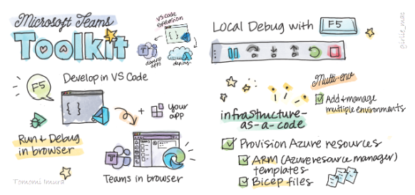

As Microsoft Teams becomes increasingly popular as a collaboration platform, demand for developers who can build apps for Teams has skyrocketed. Learning how to build apps for Teams can open up new career opportunities for you as a developer.

If you are looking for a beginner course to learn how to build apps for Teams, look no further. We have a new [learning path](aka.ms/learn/teamstoolkit) which will take you on a journey to build apps for Teams.

[Teams Toolkit](https://marketplace.visualstudio.com/items?itemName=TeamsDevApp.ms-teams-vscode-extension), an extension for Visual Studio Code, will be used in the exercises, to help you create, test, and deploy Microsoft Teams apps with ease.

So, what are you waiting for? Go to [aka.ms/learn/teamstoolkit](aka.ms/learn/teamstoolkit) and complete the learning path.

### Resources

📖 [Read more about the learn path here](https://devblogs.microsoft.com/microsoft365dev/learn-how-to-develop-apps-for-microsoft-teams-using-teams-toolkit-in-visual-studio-code/)

👀[Watch our video to get an overview of the learning path](https://www.youtube.com/watch?v=vzmpJKMBOKk0)
