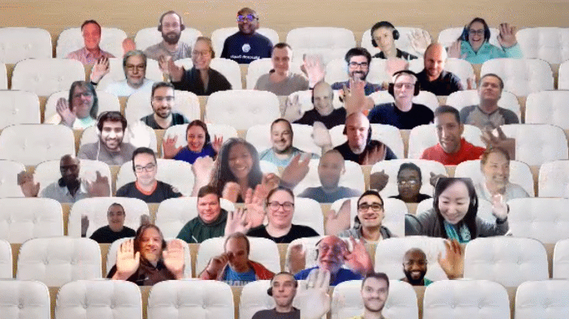

## Call summary

Welcome to the weekly call focused on capabilities of the Microsoft 365 platform.  In this call, we highlight recently announced and key existing developer resources, news, community events and three demos.

### New this week

* Events
    * Microsoft Ignite starts Wednesday, October 12, 2022. Register at <https://ignite.microsoft.com>.
    * App Camp Online training event on October 20th - Register at <https://aka.ms/TeamsAppCamp>
* News
    * Article – [Beginners’ crash course to build apps for Teams using Teams Toolkit for Visual Studio Code](https://devblogs.microsoft.com/microsoft365dev/beginners-crash-course-to-build-apps-for-teams-using-teams-toolkit-for-visual-studio-code/) - [Rabia Williams](https://twitter.com/williamsrabia) (Microsoft) \| @williamsrabia and [Zhidi Shang](https://twitter.com/shangzd) (Microsoft) \| @shangzd
    * Article – [Join us at Microsoft Teams App Camp on October 20, 2022](https://devblogs.microsoft.com/microsoft365dev/join-us-at-microsoft-teams-app-camp-on-october-20-2022/) – [Bob German](https://twitter.com/Bob1German) (Microsoft) \| @Bob1German
    * Article – [Link unfurling public preview in Outlook](https://devblogs.microsoft.com/microsoft365dev/link-unfurling-public-preview-in-outlook/) - Namrata Khubchandani (Microsoft)
    * Article – [Upgrade Skype for Business Online (3PIP) phones to Microsoft Teams using SIP Gateway](https://techcommunity.microsoft.com/t5/microsoft-teams-blog/upgrade-skype-for-business-online-3pip-phones-to-microsoft-teams/ba-p/3645957) - Pete Daderko (Microsoft)
    * Article – [Your Guide to Microsoft Teams at Microsoft Ignite 2022](https://techcommunity.microsoft.com/t5/microsoft-teams-blog/your-guide-to-microsoft-teams-at-microsoft-ignite-2022/ba-p/3614153) - Maria Figueroa (Microsoft)
    * Article – [Modern Work Superheroes Qu ick Tip \| How to Use Presenter Mode in Microsoft Teams](https://techcommunity.microsoft.com/t5/microsoft-teams-blog/modern-work-superheroes-quick-tip-how-to-use-presenter-mode-in/ba-p/3644302) - [Kellen Winters](https://twitter.com/kellenwinters) (Microsoft) \| @kellenwinters
    * Article – [More options coming soon for the Viva Connections desktop experience](https://techcommunity.microsoft.com/t5/microsoft-viva-blog/more-options-coming-soon-for-the-viva-connections-desktop/ba-p/3644419) - Ling Ma (Microsoft)
    * Article – [Most used SharePoint Framework solutions from the Store - September 2022](https://techcommunity.microsoft.com/t5/microsoft-sharepoint-blog/most-used-sharepoint-framework-solutions-from-the-store/ba-p/3648907) – [Vesa Juvonen](https://twitter.com/vesajuvonen) (Microsoft) \| @vesajuvonen
    * Article – [SharePoint Roadmap Pitstop: September 2022](https://techcommunity.microsoft.com/t5/microsoft-sharepoint-blog/sharepoint-roadmap-pitstop-september-2022/ba-p/3644614) - [Mark Kashman](https://twitter.com/mkashman) (Microsoft) \| @mkashman
* Conversations
    * Microsoft 365 PnP Weekly – Episode 182 (October 10th) with Netherlands based Microsoft 365 Architect [Martin Lingstuyl](https://twitter.com/martinlingstuyl) (I4-YOU Business Solutions) \| @martinlingstuyl \| [video](https://pnp.github.io/blog/microsoft-365-pnp-weekly/episode-182/) \| [podcast](https://www.podbean.com/media/share/pb-6kawv-12e502f)

### Demos

* **Introduction to Records Management APIs on Microsoft Graph** – automating Security, Compliance, Identity and Management (SCIM) with new Microsoft Graph APIs focusing on Records Management (RM), specifically Retention Labels, Events, and Event Types. Records Management and Data Lifecycle Management (DLM) helps organizations manage retention and deletion of data throughout its entire lifecycle. Use cases covered – events-based retention and label management for managing retention schedules. See sample queries in Postman. APIs currently in beta.
* **Build your first Command bot for Microsoft Teams with Teams Toolkit for Visual Studio Code** – Command bots automate repetitive tasks through a conversational interface, Teams Toolkit expedites the creation of command bots, and TeamsFX provides a layer of abstraction that simplifies working with bot framework. Create a command bot using Teams Toolkit, look at what was scaffolded, see Adaptive Cards in UI and then go deep into the code to understand implementation. Add command bots to a team, chat or meeting.

The host of this call was [Fabian Williams](https://twitter.com/fabianwilliams) (Microsoft) \| @fabianwilliams. Q&A takes place in chat throughout the call.



## Agenda items

* Latest updates and news on the Microsoft 365 platform – [Fabian Williams](https://twitter.com/fabianwilliams) (Microsoft) \| @fabianwilliams – [7:37](https://youtu.be/9VcJNSOAOjU?t=457)
* Demo - Introduction to Records Management APIs on Microsoft Graph – Samriddhi Seth (Microsoft) and Cameron Parker (Microsoft) – [11:25](https://youtu.be/9VcJNSOAOjU?t=685)
* Demo - Build your first Command bot for Microsoft Teams with Teams Toolkit for Visual Studio Code – [Garry Trinder](https://twitter.com/garrytrinder) (Microsoft) \| @garrytrinder – [24:39](https://youtu.be/9VcJNSOAOjU?t=1479)

Thank you for your creativity and work execution. Samples are often showcased in Demos.

## Together Mode

Thank you for taking the time to attend today’s call. Please keep the feedback coming because all the services we build, we build for you.

## Actions

* [Register](https://ignite.microsoft.com) for Microsoft Ignite – October 12-14, 2022. Attendance options: Online, in-person in Redmond and selected geographies (local language) as well.
* [Register](https://aka.ms/TeamsAppCamp) for Teams App Camp Online event – October 20th - Register at aka.ms/TeamsAppCamp
* Check out Microsoft Teams App Camp – aka.ms/app-camp
* Opt into PnP Recognition Program – aka.ms/m365pnp-recognition
* Please provide us input around your current experiences on **Microsoft Teams development** - aka.ms/TeamsDevSurvey2022
* Register for upcoming [Sharing is Caring](https://pnp.github.io/sharing-is-caring/) events:
    * Maturity Model Practitioners \| Tuesday, October 18th, 7am PST – [Download reoccurring invite](https://aka.ms/mm4m365/invite).
    * PnP Office Hours – 1:1 session \| [Register](https://outlook.office365.com/owa/calendar/PnPSharingisCaring@warner.digital/bookings/)
    * PnP Buddy System \| [Request a Buddy](https://forms.office.com/Pages/ResponsePage.aspx?id=KtIy2vgLW0SOgZbwvQuRaXDXyCl9DkBHq4A2OG7uLpdUMjRRUVg4NElZUUJLTEY1TVVSVDJFRFpLRS4u)
* Register for the [Microsoft 365 Developer Program](https://aka.ms/m365/devprogram) and get a free developer tenant
* Get started with [free training modules](https://aka.ms/m365/dev/learn) covering Microsoft 365 platform capabilities.
* Visit the [Microsoft 365 Unified Sample Solution Gallery](https://adoption.microsoft.com/sample-solution-gallery) with more than 1100 samples from Microsoft and community.
* Sign up to [Share your story](https://aka.ms/share-your-story) in the [Learn from the community](https://aka.ms/LearnFromTheCommunity/ThisWeek) series.
* Request a Demo spot on the call – aka.ms/m365pnp/request/demo
* Download the recurrent invite for this call – aka.ms/m365-dev-call

## Demo references

* **Introduction to Records Management APIs on Microsoft Graph**
    * Documentation – [Create retentionEvent](https://docs.microsoft.com/graph/api/security-retentionevent-post?view=graph-rest-beta)
    * Documentation – [retentionLabel resource type](https://docs.microsoft.com/graph/api/resources/security-retentionlabel?view=graph-rest-beta)
    * Documentation - [Use Postman with the Microsoft Graph API](https://learn.microsoft.com/graph/use-postman) \| aka.ms/GraphPostman
    * Licensing – [Microsoft Purview Data Lifecycle Management & Microsoft Purview Records Management](https://learn.microsoft.com/office365/servicedescriptions/microsoft-365-service-descriptions/microsoft-365-tenantlevel-services-licensing-guidance/microsoft-365-security-compliance-licensing-guidance#microsoft-purview-data-lifecycle-management--microsoft-purview-records-management) \| aka.ms/DLM/licensing
    * Documentation – [Permissions for retention policies and retention labels](https://learn.microsoft.com/microsoft-365/compliance/get-started-with-data-lifecycle-management#permissions-for-retention-policies-and-retention-labels)
    * Tools – [Microsoft 365Developer Program](https://developer.microsoft.com/microsoft-365/dev-program) \| aka.ms/M365DevProgram
    * Documentation - [Use the Microsoft Graph records management APIs](https://learn.microsoft.com/graph/api/resources/security-recordsmanagement-overview?view=graph-rest-beta) \| aka.ms/DLM/API
    * Documentation – [Effective permissions](https://learn.microsoft.com/graph/auth/auth-concepts#effective-permissions)
    * Documentation – [Start retention when an event occurs](https://learn.microsoft.com/microsoft-365/compliance/event-driven-retention)
    * Feedback - [Data Lifecycle and Records Management](https://feedbackportal.microsoft.com/feedback/forum/dcf82771-eafe-ec11-82e5-000d3a1fa0e3) \| aka.ms/DLM/Feedback
    * Demo - [Taking advantage of the Microsoft Graph Postman collections](https://youtu.be/DlGcsPu9XfA) - [Rabeb Othmani](https://twitter.com/Rabeb_Othmani) (Microsoft) \| @Rabeb_Othmani
    * Demo - [Introduction to Microsoft Graph Postman collection](https://youtu.be/ymAPHTuUCM4) - [Sébastien Levert](https://twitter.com/sebastienlevert) (Microsoft) \| @sebastienlevert
    * Related SCIM API demo
        * Demo - [Introduction to Privacy APIs on Microsoft Graph](https://youtu.be/X3spdOS4jOk?t=394) – [Brian T. Jackett](https://twitter.com/BrianTJackett) (Microsoft) \| @BrianTJackett and Cameron Parker (Microsoft)
* **Build your first Command bot for Microsoft Teams with Teams Toolkit for Visual Studio Code**
    * Documentation - [Teams Toolkit Overview](https://learn.microsoft.com/microsoftteams/platform/toolkit/teams-toolkit-fundamentals?pivots=visual-studio-code)
    * Documentation - [Create a new Teams project](https://learn.microsoft.com/microsoftteams/platform/toolkit/create-new-project?pivots=visual-studio-code)
    * Documentation - [TeamsFx SDK](https://learn.microsoft.com/microsoftteams/platform/toolkit/teamsfx-sdk)
    * Repo - [Microsoft Teams Toolkit](https://github.com/OfficeDev/TeamsFx)
    * Related demos from Garry Trinder
        * Demo - [Getting started with Teams Toolkit for Visual Studio](https://youtu.be/qFxLUagga80?t=1310)
        * Demo - [Build your first Notification bot for Microsoft Teams with Teams Toolkit for Visual Studio Code](https://youtu.be/X3spdOS4jOk?t=1203)

## General resources

* Archives - Microsoft 365 PnP Weekly - [Videos](https://www.youtube.com/playlist?list=PLR9nK3mnD-OVYI-St_CBiFfuL4CZbBpkC), [Podcasts](https://pnpweekly.podbean.com/)
* Microsoft Teams Toolkit | [https://aka.ms/teams-toolkit](https://aka.ms/teams-toolkit)
* Microsoft Graph Toolkit in Microsoft Learn | [https://aka.ms/learn-mgt](https://aka.ms/learn-mgt)
* Viva Connections [https://aka.ms/VivaConnections](https://aka.ms/VivaConnections)
* [SharePoint look book](https://lookbook.microsoft.com/?WT.mc_id=m365-24198-cxa)
* [Yo Teams video training package](https://aka.ms/yoteams-training)
* [.NET Standard 2.0 version of SharePoint Online CSOM API](https://developer.microsoft.com/microsoft-365/blogs/net-standard-version-of-sharepoint-online-csom-apis?WT.mc_id=m365-24198-cxa)
* [Microsoft 365 Platform Community (PnP) videos](https://aka.ms/m365/videos) | aka.ms/m365/videos
* [Microsoft Teams Toolkit for Visual Studio Code](https://marketplace.visualstudio.com/items?itemName=TeamsDevApp.ms-teams-vscode-extension)
* [yo Teams](https://aka.ms/yoteams) | aka.ms/yoteams
* [SPFx Developer documentation](https://aka.ms/spfx) | <https://aka.ms/spfx>
* [Microsoft 365 developer program site](https://developer.microsoft.com/office/dev-program?WT.mc_id=m365-24198-cxa) - Need to become a Tenant Admin to test look book capabilities? Get a Microsoft 365 E5 developer subscription - free tenant for 90 days with automatic renewal if used for dev purposes

## Upcoming Calls | Recurrent Invites

* Office add-in monthly call \| Wednesday, October 12, 8:00 am PT - <https://aka.ms/officeaddinscall> (monthly)
* Microsoft 365 General Dev call \| Thursday, October 13, 7:00 am PT - <https://aka.ms/m365-dev-sig> (bi-weekly)
* Adaptive Cards monthly call \| Thursday, October 13, 9:00 am PT - <https://aka.ms/adaptivecardscommunitycall> (monthly)
* Microsoft 365 platform call \| Tuesday, October 18, 8:00 am PT – <https://aka.ms/m365-dev-call> (weekly)
* Power Platform monthly call \| Wednesday, October 19, 8:00 am PT - <https://aka.ms/PowerAppsMonthlyCall> (monthly)
* Viva Connections & SharePoint Framework call \| Thursday, October 20, 7:00 am PT - <https://aka.ms/spdev-spfx-call> (bi-weekly)
* Microsoft Identity Platform call \| Thursday, October 20, 9:00 am PT - <https://aka.ms/IDDevCommunityCalendar> (monthly)

Microsoft 365 Platform community call focuses on latest Microsoft 365 Platform updates and demos delivered by Microsoft presenters and takes place weekly on Tuesday.  The alternating Special Interest Group community calls each Thursday focus on SharePoint Framework (client-side development/implementation) and Microsoft 365 Platform (includes Microsoft Teams, Bots, Microsoft Graph, CSOM, REST, site provisioning, PnP PowerShell, PnP Sites Core, Site Designs, Power Automate, PowerApps, Column Formatting, list formatting, etc. topics.) with demos commonly delivered by community members.

More details on the Microsoft 365 community from [https://aka.ms/m365pnp](https://aka.ms/sppnp).

You can download recurrent invite for this call from [https://aka.ms/m365-dev-call](https://aka.ms/m365-dev-call).  Welcome and join in the discussion. If you have any questions, comments, or feedback, feel free to provide your input as comments to this post as well. More details on the Microsoft 365 community and options to get involved are available from [https://aka.ms/m365pnp](https://aka.ms/sppnp).

&quot;_Sharing is caring&quot;_

_Microsoft 365 Platform Community team, Microsoft - 11th of October 2022_


