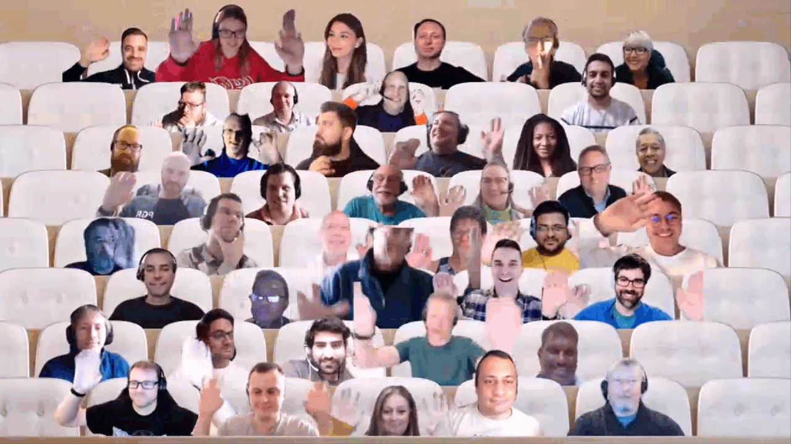

## Call summary

Welcome to the weekly call focused on capabilities of the Microsoft 365 platform.  In this call, we highlight recently announced and key existing developer resources, news, community events and three demos.

### New this week

* Events
    * App Camp Online training event on October 20th - Register at <https://aka.ms/TeamsAppCamp>
* News
    * Article – [Join the 30 Days of Microsoft Graph Challenge](https://devblogs.microsoft.com/microsoft365dev/announcement-30-days-of-microsoft-graph-challenge/) \| [Ayça Baş](https://twitter.com/aycabs) (Microsoft) \| @aycabs
    * Article – [Ignite 2022: Transforming collaboration with low and pro code dev tools](https://devblogs.microsoft.com/microsoft365dev/ignite-2022-transforming-collaboration-with-low-and-pro-code-dev-tools/) \| [Ben Summers](https://twitter.com/bensum365) (Microsoft) \| @bensum365
    * Article – [Want to embed Microsoft Teams in your app? Here’s how](https://devblogs.microsoft.com/microsoft365dev/want-to-embed-microsoft-teams-in-your-app-heres-how/) – Tomas Chladek (Microsoft) & Daniel Carrasco (Microsoft)
    * Article – [Scale access to Microsoft 365 data with Microsoft Graph Data Connect](https://devblogs.microsoft.com/microsoft365dev/scale-access-to-microsoft-365-data-with-microsoft-graph-data-connect/) – Philip Li[ (Microsoft)
    * Article – [Boost your Microsoft Teams app experience with new link unfurling capabilities](https://devblogs.microsoft.com/microsoft365dev/boost-your-microsoft-teams-app-experience-with-new-link-unfurling-capabilities/) - Sukhmani Lamba (Microsoft) & Daniel Carrasco (Microsoft)
    * Article – [App Compliance Automation Tool for Microsoft 365 launching in public preview](https://devblogs.microsoft.com/microsoft365dev/app-compliance-automation-tool-for-microsoft-365-launching-in-public-preview/) - Sreekanth Thirthala Venkata (Microsoft)
    * Article – [Announcing updates to Microsoft Teams API in Microsoft Graph](https://devblogs.microsoft.com/microsoft365dev/announcing-updates-to-microsoft-teams-api-in-microsoft-graph/) - Nick Kramer (Microsoft)
    * Article – [What’s new for Office Add-ins at Ignite 2022](https://devblogs.microsoft.com/microsoft365dev/whats-new-for-office-add-ins-at-ignite-2022/) - Office Add-ins team
    * Article – [Announcing updates to the Planner API in Microsoft Graph](https://devblogs.microsoft.com/microsoft365dev/announcing-updates-to-the-planner-api-in-microsoft-graph/) – Brijesh Bharadwaj (Microsoft), Andrew Friedman (Microsoft) & Tarkan Sevilmis (Microsoft)
    * 8 Articles – [Microsoft Teams Blog](https://techcommunity.microsoft.com/t5/microsoft-teams-blog/bg-p/MicrosoftTeamsBlog) \| aka.ms/teams/blog
    * 8 Articles – [Microsoft Viva Blog](https://techcommunity.microsoft.com/t5/microsoft-viva-blog/bg-p/MicrosoftVivaBlog) \| aka.ms/microsoftviva/blog
    * 4 Articles – [SharePoint Blog](https://techcommunity.microsoft.com/t5/microsoft-sharepoint-blog/bg-p/SPBlog) \| aka.ms/sp-blog
    * Microsoft Teams Platform Updates
        * Documentation – [Live Share canvas overview](https://learn.microsoft.com/microsoftteams/platform/apps-in-teams-meetings/teams-live-share-canvas)
        * Documentation – [Apps for Teams meetings and calls](https://learn.microsoft.com/microsoftteams/platform/apps-in-teams-meetings/teams-apps-in-meetings)
* Conversations
    * Microsoft 365 PnP Weekly – Episode 183 (October 17th) with Italy based Solution Architect [Paolo Pialorsi](https://twitter.com/paolopia) (PiaSys) \| @paolopia \| [video](https://pnp.github.io/blog/microsoft-365-pnp-weekly/episode-183/) \| [podcast](https://www.podbean.com/media/share/pb-xzpj6-12ee995)
    * Microsoft 365 Developer Podcast (October 17th) - Viva Connections with [Anoop Tatti](https://twitter.com/anooptells) (Content and Code) \| @anooptells \| [podcast](https://www.m365devpodcast.com/e/viva-connections-with-anoop-tatti/)

### Demos

* **Introduction to Microsoft Graph Search API** – overview of, what’s new with, and syntax (search request/response) for Graph search APIs. Follow along and open Graph Explorer or Graph Postman Collection and go deep on 3 new search queries - Teams Message Search, XRANK, and Answers (type bookmarks and acronyms). Microsoft Graph Search APIs sit on Microsoft Graph and deliver a single search end-point for searching all Microsoft 365 workloads.
* **Build your first Command bot in C\# for Microsoft Teams with Teams Toolkit for Visual Studio** – install Visual Studio 2022 and Teams Toolkit, launch Visual Studio and create new command bot project. Follow Quick Start configuration instructions installed with Toolkit and then add bot to your Teams chat. Type “helloWorld” to trigger initial response from your bot! Deep dive into the provisioned code and see places for potential modification. Use command bot with QnA Maker to deliver large Q&A solution quickly.

The host of this call was [Vesa Juvonen](https://twitter.com/vesajuvonen) (Microsoft) \| @vesajuvonen. Q&A takes place in chat throughout the call.



## Agenda items

* Latest updates and news on the Microsoft 365 platform – [Vesa Juvonen](https://twitter.com/vesajuvonen) (Microsoft) \| @vesajuvonen – [7:34](https://youtu.be/xdWryGag9c0?t=454)
* Updates on Microsoft Teams documentation – [Wajeed Shaikh](https://twitter.com/Wajeed_Shaikh) (Microsoft) \| @Wajeed_Shaikh – [8:46](https://youtu.be/xdWryGag9c0?t=526)
* Demo - Introduction to Microsoft Graph Search API – [Njeri Grievous](https://www.linkedin.com/in/njerigrevious/) (Microsoft) – [12:58](https://youtu.be/xdWryGag9c0?t=778)
* Demo - Build your first Command bot in C\# for Microsoft Teams with Teams Toolkit for Visual Studio – [Ayça Baş](https://twitter.com/aycabs) (Microsoft) \| @aycabs – [31:52](https://youtu.be/xdWryGag9c0?t=1912)

Thank you for your creativity and work execution. Samples are often showcased in Demos.

## Together Mode

Thank you for joining the call today, awesome to see you here. Looking forward to possibly seeing you at an in-person experience in the future as well.

## Actions

* [Register](https://aka.ms/TeamsAppCamp) for Teams App Camp Online event – October 20th - Register at aka.ms/TeamsAppCamp
* Opt into PnP Recognition Program – aka.ms/m365pnp-recognition
* Please provide us input around your current experiences on **Microsoft Teams development** - aka.ms/TeamsDevSurvey2022
* Register for upcoming [Sharing is Caring](https://pnp.github.io/sharing-is-caring/) events:
    * Maturity Model Practitioners \| Tuesday, November 15th, 7am PST – [Download reoccurring invite](https://aka.ms/mm4m365/invite).
    * PnP Office Hours – 1:1 session \| [Register](https://outlook.office365.com/owa/calendar/PnPSharingisCaring@warner.digital/bookings/)
    * PnP Buddy System \| [Request a Buddy](https://forms.office.com/Pages/ResponsePage.aspx?id=KtIy2vgLW0SOgZbwvQuRaXDXyCl9DkBHq4A2OG7uLpdUMjRRUVg4NElZUUJLTEY1TVVSVDJFRFpLRS4u)
* Register for the [Microsoft 365 Developer Program](https://aka.ms/m365/devprogram) and get a free developer tenant
* Get started with [free training modules](https://aka.ms/m365/dev/learn) covering Microsoft 365 platform capabilities.
* Visit the [Microsoft 365 Unified Sample Solution Gallery](https://adoption.microsoft.com/sample-solution-gallery) with more than 1100 samples from Microsoft and community.
* Sign up to [Share your story](https://aka.ms/share-your-story) in the [Learn from the community](https://aka.ms/LearnFromTheCommunity/ThisWeek) series.
* Request a Demo spot on the call – aka.ms/m365pnp/request/demo
* Download the recurrent invite for this call – aka.ms/m365-dev-call

## Demo references

* **Introduction to Microsoft Graph Search API**
    * Documentation – [Overview of the Microsoft Search API in Microsoft Graph](https://learn.microsoft.com/graph/search-concept-overview) \| aka.ms/GraphSearchQuery
    * Documentation – [2.1.10 XRANK Operator](https://learn.microsoft.com/openspecs/sharepoint_protocols/ms-kql/36b3c22e-2f24-4096-99df-919f40d16864)
    * Documentation – [Use the Microsoft Search API to search Teams messages](https://learn.microsoft.com/graph/search-concept-chat-messages)
    * Documentation – [Use the Microsoft Search API to xrank search results](https://learn.microsoft.com/graph/search-concept-xrank)
    * Documentation – [bookmark resource type](https://learn.microsoft.com/graph/api/resources/search-bookmark?view=graph-rest-beta)
    * Documentation – [acronym resource type](https://learn.microsoft.com/graph/api/resources/search-acronym?view=graph-rest-beta)
    * Tool – [Graph Explorer](https://developer.microsoft.com/graph/graph-explorer)
    * Documentation – [Use Postman with the Microsoft Graph API](https://learn.microsoft.com/graph/use-postman)
* **Build your first Command bot in C\# for Microsoft Teams with Teams Toolkit for Visual Studio**
    * Documentation – [Teams Toolkit Overview](https://learn.microsoft.com/microsoftteams/platform/toolkit/teams-toolkit-fundamentals?pivots=visual-studio)
    * Documentation – [Install Teams Toolkit](https://learn.microsoft.com/microsoftteams/platform/toolkit/install-teams-toolkit?tabs=vscode&pivots=visual-studio)
    * Documentation – [Create a new Teams project](https://learn.microsoft.com/microsoftteams/platform/toolkit/create-new-project?pivots=visual-studio)
    * Documentation – [FAQ for Teams Toolkit](https://learn.microsoft.com/microsoftteams/platform/toolkit/faq)
    * Tool - [Join the Microsoft 365 Developer Program today!](https://developer.microsoft.com/microsoft-365/dev-program) \| aka.ms/m365/devprogram
    * Related demos
        * Demo - [Build your first Command bot for Microsoft Teams with Teams Toolkit for Visual Studio Code](https://youtu.be/9VcJNSOAOjU?t=1479) – [Garry Trinder](https://twitter.com/garrytrinder) (Microsoft) \| @garrytrinder

## General resources

* Archives - Microsoft 365 PnP Weekly - [Videos](https://www.youtube.com/playlist?list=PLR9nK3mnD-OVYI-St_CBiFfuL4CZbBpkC), [Podcasts](https://pnpweekly.podbean.com/)
* Microsoft Teams Toolkit | [https://aka.ms/teams-toolkit](https://aka.ms/teams-toolkit)
* Microsoft Graph Toolkit in Microsoft Learn | [https://aka.ms/learn-mgt](https://aka.ms/learn-mgt)
* Viva Connections [https://aka.ms/VivaConnections](https://aka.ms/VivaConnections)
* [SharePoint look book](https://lookbook.microsoft.com/?WT.mc_id=m365-24198-cxa)
* [Yo Teams video training package](https://aka.ms/yoteams-training)
* [.NET Standard 2.0 version of SharePoint Online CSOM API](https://developer.microsoft.com/microsoft-365/blogs/net-standard-version-of-sharepoint-online-csom-apis?WT.mc_id=m365-24198-cxa)
* [Microsoft 365 Platform Community (PnP) videos](https://aka.ms/m365/videos) | aka.ms/m365/videos
* [Microsoft Teams Toolkit for Visual Studio Code](https://marketplace.visualstudio.com/items?itemName=TeamsDevApp.ms-teams-vscode-extension)
* [yo Teams](https://aka.ms/yoteams) | aka.ms/yoteams
* [SPFx Developer documentation](https://aka.ms/spfx) | <https://aka.ms/spfx>
* [Microsoft 365 developer program site](https://developer.microsoft.com/office/dev-program?WT.mc_id=m365-24198-cxa) - Need to become a Tenant Admin to test look book capabilities? Get a Microsoft 365 E5 developer subscription - free tenant for 90 days with automatic renewal if used for dev purposes

## Upcoming Calls | Recurrent Invites

* Power Platform monthly call \| Wednesday, October 19, 8:00 am PT - <https://aka.ms/PowerAppsMonthlyCall> (monthly)
* Viva Connections & SharePoint Framework call \| Thursday, October 20, 7:00 am PT - <https://aka.ms/spdev-spfx-call> (bi-weekly)
* Microsoft Identity Platform call \| Thursday, October 20, 9:00 am PT - <https://aka.ms/IDDevCommunityCalendar> (monthly)
* Microsoft 365 platform call \| Tuesday, October 25, 8:00 am PT – <https://aka.ms/m365-dev-call> (weekly)
* Microsoft 365 General Dev call \| Thursday, October 27, 7:00 am PT - <https://aka.ms/m365-dev-sig> (bi-weekly)
* Office add-in monthly call \| Wednesday, November 9, 8:00 am PT - <https://aka.ms/officeaddinscall> (monthly)
* Adaptive Cards monthly call \| Thursday, November 10, 9:00 am PT - <https://aka.ms/adaptivecardscommunitycall> (monthly)

Microsoft 365 Platform community call focuses on latest Microsoft 365 Platform updates and demos delivered by Microsoft presenters and takes place weekly on Tuesday.  The alternating Special Interest Group community calls each Thursday focus on SharePoint Framework (client-side development/implementation) and Microsoft 365 Platform (includes Microsoft Teams, Bots, Microsoft Graph, CSOM, REST, site provisioning, PnP PowerShell, PnP Sites Core, Site Designs, Power Automate, PowerApps, Column Formatting, list formatting, etc. topics.) with demos commonly delivered by community members.

More details on the Microsoft 365 community from [https://aka.ms/m365pnp](https://aka.ms/sppnp).

You can download recurrent invite for this call from [https://aka.ms/m365-dev-call](https://aka.ms/m365-dev-call).  Welcome and join in the discussion. If you have any questions, comments, or feedback, feel free to provide your input as comments to this post as well. More details on the Microsoft 365 community and options to get involved are available from [https://aka.ms/m365pnp](https://aka.ms/sppnp).

&quot;_Sharing is caring&quot;_

_Microsoft 365 Platform Community team, Microsoft - 18th of October 2022_


