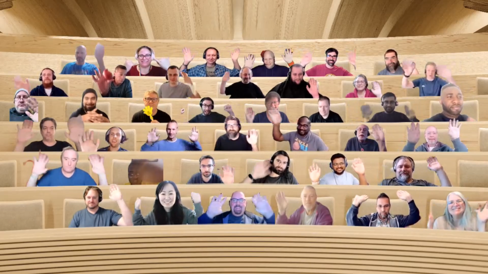

## Call summary

Welcome to the weekly call focused on capabilities of the Microsoft 365 platform.  In this call, we highlight recently announced and key existing developer resources, news, community events and three demos.

### New this week

* Events
    * [Registration open](https://aka.ms/30DaysOfMSGraph/Register) for: **30 Days of Microsoft Graph Challenge**. Learning curriculum for beginners, students, fresh graduates. Challenge runs from November 1-30, 2022. aka.ms/30DaysOfMSGraph/Register
* News
    * Samples – [Microsoft 365 Unified Sample Solution Gallery](https://adoption.microsoft.com/sample-solution-gallery) - aka.ms/m365/samples now with more than 1400 samples from Microsoft and community.
    * Article – [5 ways to boost your collaborative app development](https://devblogs.microsoft.com/microsoft365dev/5-ways-to-boost-your-collaborative-app-development/) - [Daniel Carrasco](https://twitter.com/danielserver) (Microsoft) \| @danielserver
    * Article – [Removal of SPHome APIs from SharePoint Online](https://devblogs.microsoft.com/microsoft365dev/removal-of-sphome-apis-from-sharepoint-online/) - Microsoft
    * Article – [Prevent throttling in your application by using RateLimit headers in SharePoint Online](https://devblogs.microsoft.com/microsoft365dev/prevent-throttling-in-your-application-by-using-ratelimit-headers-in-sharepoint-online/) - Microsoft
    * Article – [Microsoft 365 Developer Program instant sandbox update](https://devblogs.microsoft.com/microsoft365dev/microsoft-365-developer-program-instant-sandbox-update/) - Microsoft
    * Article – [Ignite 2022: Highlights for Microsoft Teams app builders](https://devblogs.microsoft.com/microsoft365dev/ignite-2022-highlights-for-microsoft-teams-app-builders/) - [Rabia Williams](https://twitter.com/williamsrabia) (Microsoft) \| @williamsrabia
    * Article – [Register for the Future of Employee Learning webinar](https://techcommunity.microsoft.com/t5/microsoft-viva-blog/register-for-the-future-of-employee-learning-webinar/ba-p/3658085) - Andrea Lum (Microsoft)
    * Article – [How I did it: 4 real world tips from OKR Champions to drive long term success](https://techcommunity.microsoft.com/t5/microsoft-viva-blog/how-i-did-it-4-real-world-tips-from-okr-champions-to-drive-long/ba-p/3656003) - Jim Hopkinson (Microsoft)
    * Article – [Your guide to the magic of the European SharePoint Conference (ESPC22)](https://techcommunity.microsoft.com/t5/microsoft-sharepoint-blog/your-guide-to-the-magic-of-the-european-sharepoint-conference/ba-p/3657274) - [Mark Kashman](https://twitter.com/mkashman) (Microsoft) \| @mkashman
* Microsoft Teams Platform Updates
    * Documentation – [Configure and add multiple actions in NavBar](https://learn.microsoft.com/microsoftteams/platform/concepts/design/personal-apps#configure-and-add-multiple-actions-in-navbar)
    * Documentation – [Generate a deep link to share content to stage in meetings](https://learn.microsoft.com/microsoftteams/platform/apps-in-teams-meetings/build-apps-for-teams-meeting-stage#generate-a-deep-link-to-share-content-to-stage-in-meetings)
* Conversations
    * Microsoft 365 PnP Weekly – Episode 184 (October 24th) with UK based Microsoft MVP and Power Platform Technical Architect - [Kristine Kolodziejski](https://twitter.com/@kristinekk94) (Computacenter) \| @kristinekk94. \| [video](https://pnp.github.io/blog/microsoft-365-pnp-weekly/episode-184/) \| [podcast](https://www.podbean.com/media/share/pb-brv6e-12f7bd6)
    * Microsoft 365 Developer Podcast (October 24th) - Ignite 2022 Microsoft 365 Developer platform announcements – interview with [Ben Summers](https://twitter.com/bensum365) \| @bensum365 \| [podcast](https://www.m365devpodcast.com/e/ignite-2022-microsoft-365-developer-platform-announcements/)

### Demos

* **Extend Microsoft Teams apps to Office and Outlook Mobile** – start with an overview of the Office mobile app, current beta program and release roadmap. Then configure your developer tenant so you can build a custom app and have it surface in an Android Office app. Tips on configuring dev and debug environment. Scaffold a project, use Android Studio, run virtual version of Android phone, see simple app on mobile and how to provide feedback.
* **General Availability of Power Pages - Getting started** – extending the reach of the Power Platform outside the organization via a data connected website that is publicly accessible, either anonymous or authenticated. Step through a host of features in the reimagined Design Studio (Pages, Styling, Data and Setup workspaces) delivering a WYSIWYG experience for makers. IT Pros will appreciate the go live checklist and pro developers the ability to edit/customize in Microsoft Visual Studio.
* **Using your SPFx solutions also in Microsoft Teams, Outlook and in the Microsoft 365 app** – in other words, now you can host Teams personal apps (developed with SPFx v1.16) in Outlook and in Microsoft 365 app (previously known as office.com). The same code in SharePoint, Teams, Viva, Viva Connections, Outlook and Microsoft 365 app. You will need to create a custom manifest.json file shown in demo. In the next SPFx v1.16 beta release, the typings are changing to teams-js-v2.

The host of this call was [Vesa Juvonen](https://twitter.com/vesajuvonen) (Microsoft) \| @vesajuvonen. Q&A takes place in chat throughout the call.



## Agenda items

* Latest updates and news on the Microsoft 365 platform – [Vesa Juvonen](https://twitter.com/vesajuvonen) (Microsoft) \| @vesajuvonen – [7:46](https://youtu.be/EszUm_bufBA?t=466)
* Updates on Microsoft Teams documentation – [Wajeed Shaikh](https://twitter.com/Wajeed_Shaikh) (Microsoft) \| @Wajeed_Shaikh – [9:53](https://youtu.be/EszUm_bufBA?t=593)
* Demo - Extend Microsoft Teams apps to Office and Outlook Mobile – Sheena Makker (Microsoft) & [Garry Trinder](https://twitter.com/garrytrinder) (Microsoft) \| @garrytrinder – [13:07](https://youtu.be/EszUm_bufBA?t=787)
* Demo - General Availability of Power Pages - Getting started – [Hugo Bernier](https://twitter.com/bernierh) (Microsoft) \| @bernierh – [26:26](https://youtu.be/EszUm_bufBA?t=1586)
* Demo - Using your SPFx solutions also in Microsoft Teams, Outlook and in the Microsoft 365 app – [Alex Terentiev](https://twitter.com/alexaterentiev) (Microsoft) \| @alexaterentiev & [Vesa Juvonen](https://twitter.com/vesajuvonen) (Microsoft) \| @vesajuvonen – [44:06](https://youtu.be/EszUm_bufBA?t=2646)

Thank you for your creativity and work execution. Samples are often showcased in Demos.

## Together Mode

Thank you for joining the call today and for participating in this near in-person together mode experience! Really awesome to see again, this many people on the community call.

## Actions

* [Register](https://aka.ms/30DaysOfMSGraph/Register) today for 30 Days of Microsoft Graph Challenge, November 1 – 30. starting - <https://aka.ms/30DaysOfMSGraph/Register>
* Share feedback on Microsoft Teams App now available on Office Mobile - <https://forms.office.com/r/gt2bxerykr>
* Opt into PnP Recognition Program – aka.ms/m365pnp-recognition
* Please provide us input around your current experiences on Microsoft Teams development - aka.ms/TeamsDevSurvey2022
* Register for upcoming [Sharing is Caring](https://pnp.github.io/sharing-is-caring/) events:
    * Maturity Model Practitioners \| Tuesday, November 15th, 7am PST – [Download reoccurring invite](https://aka.ms/mm4m365/invite).
    * PnP Office Hours – 1:1 session \| [Register](https://outlook.office365.com/owa/calendar/PnPSharingisCaring@warner.digital/bookings/)
    * PnP Buddy System \| [Request a Buddy](https://forms.office.com/Pages/ResponsePage.aspx?id=KtIy2vgLW0SOgZbwvQuRaXDXyCl9DkBHq4A2OG7uLpdUMjRRUVg4NElZUUJLTEY1TVVSVDJFRFpLRS4u)
* Register for the [Microsoft 365 Developer Program](https://aka.ms/m365/devprogram) and get a free developer tenant
* Get started with [free training modules](https://aka.ms/m365/dev/learn) covering Microsoft 365 platform capabilities.
* Visit the [Microsoft 365 Unified Sample Solution Gallery](https://adoption.microsoft.com/sample-solution-gallery) with more than 1400 samples from Microsoft and community.
* Sign up to [Share your story](https://aka.ms/share-your-story) in the [Learn from the community](https://aka.ms/LearnFromTheCommunity/ThisWeek) series.
* Request a Demo spot on the call – aka.ms/m365pnp/request/demo
* Download the recurrent invite for this call – aka.ms/m365-dev-call

## Demo references

* **Extend Microsoft Teams apps to Office and Outlook Mobile**
    * Documentation – [Build tabs for Teams](https://learn.microsoft.com/microsoftteams/platform/tabs/what-are-tabs)
    * Documentation – [Teams JavaScript client SDK](https://learn.microsoft.com/microsoftteams/platform/tabs/how-to/using-teams-client-sdk?tabs=javascript%2Cmanifest-teams-toolkit)
    * Documentation – [App manifest schema for Teams](https://learn.microsoft.com/microsoftteams/platform/resources/schema/manifest-schema)
    * Pilot survey – [Microsoft Teams App now available on Office Mobile](https://forms.office.com/r/gt2bxerykr)
    * Tools – [android studio](https://developer.android.com/studio)
* **General Availability of Power Pages - Getting started**
    * Demo - [Power Pages General Availability](https://youtu.be/MqAmuF8yA48?t=2646) – [Hugo Bernier](https://twitter.com/bernierh) (Microsoft) \| @bernierh
    * Blog - [Microsoft Power Pages Now in General Availability!](https://powerusers.microsoft.com/t5/Power-Apps-Community-Blog/Microsoft-Power-Pages-Now-in-General-Availability/ba-p/1814780)
    * Article - [Microsoft Power Pages is now generally available](https://powerpages.microsoft.com/blog/microsoft-power-pages-is-now-generally-available/)
    * Licensing - [Power Pages available to purchase on November 1](https://www.microsoft.com/licensing/news/power_pages_general_availability)
    * Documentation - [Plan and prepare for Power Pages in 2022 release wave 2](https://learn.microsoft.com/power-platform-release-plan/2022wave2/power-pages/)
    * Documentation - [What is Power Pages?](https://learn.microsoft.com/power-pages/introduction)
    * Animations – [animista](https://animista.net)
    * Documentation - [Overview of Progressive Web Apps (PWAs)](https://learn.microsoft.com/microsoft-edge/progressive-web-apps-chromium/)
* **Using your SPFx solutions also in Microsoft Teams, Outlook and in the Microsoft 365 app**
    * Coming soon

## General resources

* Archives - Microsoft 365 PnP Weekly - [Videos](https://www.youtube.com/playlist?list=PLR9nK3mnD-OVYI-St_CBiFfuL4CZbBpkC), [Podcasts](https://pnpweekly.podbean.com/)
* Microsoft Teams Toolkit | [https://aka.ms/teams-toolkit](https://aka.ms/teams-toolkit)
* Microsoft Graph Toolkit in Microsoft Learn | [https://aka.ms/learn-mgt](https://aka.ms/learn-mgt)
* Viva Connections [https://aka.ms/VivaConnections](https://aka.ms/VivaConnections)
* [SharePoint look book](https://lookbook.microsoft.com/?WT.mc_id=m365-24198-cxa)
* [Yo Teams video training package](https://aka.ms/yoteams-training)
* [.NET Standard 2.0 version of SharePoint Online CSOM API](https://developer.microsoft.com/microsoft-365/blogs/net-standard-version-of-sharepoint-online-csom-apis?WT.mc_id=m365-24198-cxa)
* [Microsoft 365 Platform Community (PnP) videos](https://aka.ms/m365/videos) | aka.ms/m365/videos
* [Microsoft Teams Toolkit for Visual Studio Code](https://marketplace.visualstudio.com/items?itemName=TeamsDevApp.ms-teams-vscode-extension)
* [yo Teams](https://aka.ms/yoteams) | aka.ms/yoteams
* [SPFx Developer documentation](https://aka.ms/spfx) | <https://aka.ms/spfx>
* [Microsoft 365 developer program site](https://developer.microsoft.com/office/dev-program?WT.mc_id=m365-24198-cxa) - Need to become a Tenant Admin to test look book capabilities? Get a Microsoft 365 E5 developer subscription - free tenant for 90 days with automatic renewal if used for dev purposes

## Upcoming Calls | Recurrent Invites

* Microsoft 365 General Dev call \| Thursday, October 27, 7:00 am PT - <https://aka.ms/m365-dev-sig> (bi-weekly)
* Microsoft 365 platform call \| Tuesday, November 1, 8:00 am PT – <https://aka.ms/m365-dev-call> (weekly)
* Viva Connections & SharePoint Framework call \| Thursday, November 3, 7:00 am PT - <https://aka.ms/spdev-spfx-call> (bi-weekly)
* Office add-in monthly call \| Wednesday, November 9, 8:00 am PT - <https://aka.ms/officeaddinscall> (monthly)
* Adaptive Cards monthly call \| Thursday, November 10, 9:00 am PT - <https://aka.ms/adaptivecardscommunitycall> (monthly)
* Power Platform monthly call \| Wednesday, November 16, 8:00 am PT - <https://aka.ms/PowerAppsMonthlyCall> (monthly)
* Microsoft Identity Platform call \| Thursday, November 17, 9:00 am PT - <https://aka.ms/IDDevCommunityCalendar> (monthly)

Microsoft 365 Platform community call focuses on latest Microsoft 365 Platform updates and demos delivered by Microsoft presenters and takes place weekly on Tuesday.  The alternating Special Interest Group community calls each Thursday focus on SharePoint Framework (client-side development/implementation) and Microsoft 365 Platform (includes Microsoft Teams, Bots, Microsoft Graph, CSOM, REST, site provisioning, PnP PowerShell, PnP Sites Core, Site Designs, Power Automate, PowerApps, Column Formatting, list formatting, etc. topics.) with demos commonly delivered by community members.

More details on the Microsoft 365 community from [https://aka.ms/m365pnp](https://aka.ms/sppnp).

You can download recurrent invite for this call from [https://aka.ms/m365-dev-call](https://aka.ms/m365-dev-call).  Welcome and join in the discussion. If you have any questions, comments, or feedback, feel free to provide your input as comments to this post as well. More details on the Microsoft 365 community and options to get involved are available from [https://aka.ms/m365pnp](https://aka.ms/sppnp).

&quot;_Sharing is caring&quot;_

_Microsoft 365 Platform Community team, Microsoft - 25th of October 2022_


