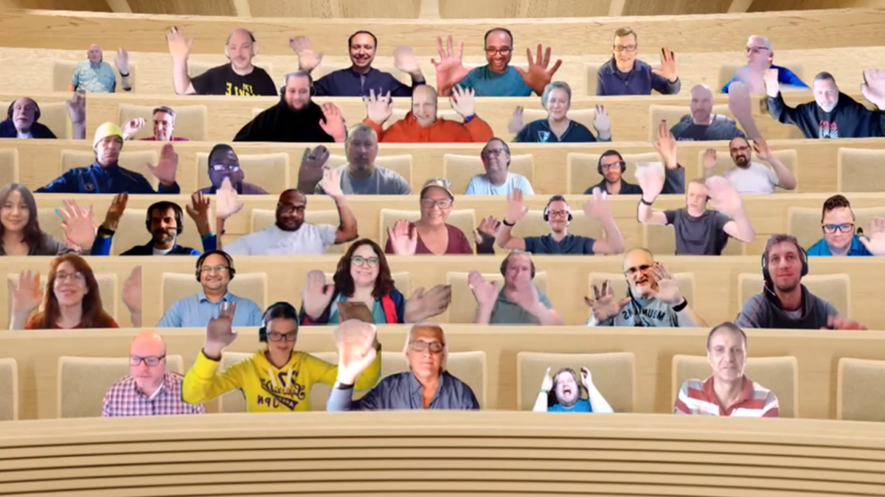

## Call summary

Welcome to the weekly call focused on capabilities of the Microsoft 365 platform.  In this call, we highlight recently announced and key existing developer resources, news, community events and three demos.

### New this week

* News
    * Samples – [Microsoft 365 Unified Sample Solution Gallery](https://adoption.microsoft.com/sample-solution-gallery) - aka.ms/m365/samples now with more than 1400 samples from Microsoft and community.
    * Article – [Announcing the new SharePoint Pages API in Microsoft Graph](https://devblogs.microsoft.com/microsoft365dev/announcing-the-new-sharepoint-pages-api-in-microsoft-graph/) – [DC Padur](https://twitter.com/dcpadur) (Microsoft) \| @dcpadur
    * Article – [Updated preview of the SharePoint Framework 1.16](https://devblogs.microsoft.com/microsoft365dev/updated-preview-of-the-sharepoint-framework-1-16/) – Microsoft 365 Platform team
    * Article – [Roll A Dice! Building a command bot for Microsoft Teams using Teams Toolkit with Visual Studio Code](https://devblogs.microsoft.com/microsoft365dev/roll-a-dice-building-a-command-bot-for-microsoft-teams-using-teams-toolkit-with-visual-studio-code/) - [Tomomi Imura](https://twitter.com/girlie_mac) (Microsoft) \| @girlie_mac
    * Article – [What’s New in Microsoft Teams \| October 2022](https://techcommunity.microsoft.com/t5/microsoft-teams-blog/what-s-new-in-microsoft-teams-october-2022/ba-p/3666435) - [Holly Lehman](https://twitter.com/lehman__holly) (Microsoft) \| @Lehman__Holly
    * Article – [Microsoft Viva Topics at KMWorld November 7-10, 2022](https://techcommunity.microsoft.com/t5/microsoft-viva-blog/microsoft-viva-topics-at-kmworld-november-7-10-2022/ba-p/3663155) - Tehzeeb Versey-Patel (Microsoft)
* Conversations
    * Microsoft 365 PnP Weekly – Episode 185 (October 31st) with Belgium based Microsoft 365 Development MVP and Consultant - Jasey Waegebaert (GMI group) \| @jwaegebaert. \| [video](https://pnp.github.io/blog/microsoft-365-pnp-weekly/episode-185/)
    * Microsoft 365 Developer Podcast (October 31st) - Building Soundbite.ai with [Erik Ralston](https://twitter.com/ErikRalston) (Soundbite)\| @ErikRalston \| [podcast](https://www.m365devpodcast.com/e/building-soundbiteai-with-erik-ralston/)

### Demos

* **Find meeting times for multiple people on Microsoft 365** – by adding very little code to your application. The simple capability allows schedulers to select attendees, meeting duration, and returns times all participants are available. Select a time, meeting subject and location. Press the Schedule meeting button, done. Same experience as in Outlook, but in your own app! Step through the code from Microsoft Graph Toolkit and Graph JavaScript SDK that enables this capability.
* **Introduction to new SharePoint Pages Microsoft Graph API** – new Microsoft Graph APIs to get, create and manage SharePoint pages (and news posts). Demos showing getting content from specific page, creating page, publishing page as news post, and deleting page. Target use cases, not in scope APIs, and roadmap for PnP/Graph SharePoint APIs called out. Beta API due out at end of November. Please Sign up to test the beta release.
* **Getting started with styling your Power Pages** – is a snap for Makers who can select colors, background images, layouts, etc. in the Pages workspace and choose themes (color palates), fonts, buttons, etc. in the Styling workspace. Makers can do all changes, no CSS, JavaScript or HTML. Developers may upload Bootstrap style sheets, apply styles across the board, apply brand colors directly, etc. working in CSS, JavaScript or HTML files in Visual Studio Code.

The host of this call was [Vesa Juvonen](https://twitter.com/vesajuvonen) (Microsoft) \| @vesajuvonen. Q&A takes place in chat throughout the call.



## Agenda items

* Latest updates and news on the Microsoft 365 platform – [Vesa Juvonen](https://twitter.com/vesajuvonen) (Microsoft) \| @vesajuvonen – [5:29](https://youtu.be/0cilY7Ouu9E?t=329)
* Demo - Find meeting times for multiple people on Microsoft 365 – [Waldek Mastykarz](https://twitter.com/waldekm) (Microsoft) \| @waldekm – [8:37](https://youtu.be/0cilY7Ouu9E?t=517)
* Demo - Introduction to new SharePoint Pages Microsoft Graph API – [DC Padur](https://twitter.com/dcpadur) (Microsoft) \| @dcpadur – [21:50](https://youtu.be/0cilY7Ouu9E?t=1310)
* Demo - Getting started with styling your Power Pages – [Hugo Bernier](https://twitter.com/bernierh) (Microsoft) \| @bernierh – [34:19](https://youtu.be/0cilY7Ouu9E?t=2059)

Thank you for your creativity and work execution. Samples are often showcased in Demos.

## Together Mode

The House is full yet again today! Really awesome to see many familiar faces. Thank you everybody for joining today’s call. Please keep the feedback coming.

## Actions

* Share feedback on Microsoft Teams App now available on Office Mobile - <https://forms.office.com/r/gt2bxerykr>
* Opt into PnP Recognition Program – aka.ms/m365pnp-recognition
* Register for upcoming [Sharing is Caring](https://pnp.github.io/sharing-is-caring/) events:
    * Maturity Model Practitioners \| Tuesday, November 15th, 7am PST – [Download reoccurring invite](https://aka.ms/mm4m365/invite)
    * Power Platform Samples Contributor \| Monday, November 28th, 11:30am PST - [Register](https://forms.office.com/pages/responsepage.aspx?id=KtIy2vgLW0SOgZbwvQuRaXDXyCl9DkBHq4A2OG7uLpdUN0hMNTRPWVVWTkhFTk9QQzhFSTRIS1JLSC4u)
    * PnP Office Hours – 1:1 session \| [Register](https://outlook.office365.com/owa/calendar/PnPSharingisCaring@warner.digital/bookings/)
    * PnP Buddy System \| [Request a Buddy](https://forms.office.com/Pages/ResponsePage.aspx?id=KtIy2vgLW0SOgZbwvQuRaXDXyCl9DkBHq4A2OG7uLpdUMjRRUVg4NElZUUJLTEY1TVVSVDJFRFpLRS4u)
* Register for the [Microsoft 365 Developer Program](https://aka.ms/m365/devprogram) and get a free developer tenant
* Get started with [free training modules](https://aka.ms/m365/dev/learn) covering Microsoft 365 platform capabilities.
* Visit the [Microsoft 365 Unified Sample Solution Gallery](https://adoption.microsoft.com/sample-solution-gallery) with more than 1400 samples from Microsoft and community.
* Sign up to [Share your story](https://aka.ms/share-your-story) in the [Learn from the community](https://aka.ms/LearnFromTheCommunity/ThisWeek) series.
* Request a Demo spot on the call – aka.ms/m365pnp/request/demo
* Download the recurrent invite for this call – aka.ms/m365-dev-call

## Demo references

* **Find meeting times for multiple people on Microsoft 365**
    * Documentation - [Microsoft Graph Toolkit overview](https://learn.microsoft.com/graph/toolkit/overview)
    * Repo - [Microsoft Graph Toolkit](https://github.com/microsoftgraph/microsoft-graph-toolkit)
    * Documentation - [Get started with Microsoft Graph Toolkit](https://learn.microsoft.com/graph/toolkit/get-started/overview)
    * Documentation - [Microsoft Graph SDK overview](https://learn.microsoft.com/graph/sdks/sdks-overview)
    * Repo - [Microsoft Graph JavaScript Client Library](https://github.com/microsoftgraph/msgraph-sdk-javascript)
    * Blog post - [Find a meeting time and schedule a meeting on Microsoft 365](https://blog.mastykarz.nl/find-meeting-time-schedule-meeting-microsoft-365/)
* **Introduction to new SharePoint Pages Microsoft Graph API**
    * Article - [Announcing the new SharePoint Pages API in Microsoft Graph](https://devblogs.microsoft.com/microsoft365dev/announcing-the-new-sharepoint-pages-api-in-microsoft-graph/) \| aka.ms/PagesAPI
    * Beta Testers - [SharePoint Pages graph API beta release testers sign up](https://forms.office.com/r/ZgNEgPa54g)
* **Getting started with styling your Power Pages**
    * Blog - [Microsoft Power Pages Now in General Availability!](https://powerusers.microsoft.com/t5/Power-Apps-Community-Blog/Microsoft-Power-Pages-Now-in-General-Availability/ba-p/1814780)
    * Documentation - [Plan and prepare for Power Pages in 2022 release wave 2](https://learn.microsoft.com/power-platform-release-plan/2022wave2/power-pages/)
    * Documentation - [What is Power Pages?](https://learn.microsoft.com/power-pages/introduction)
    * Themewagon template - HostPro – [Free HTML5 Hosting Website Template](https://themewagon.com/themes/free-html5-hosting-website-template-hostpro/)
    * Documentation - [How to use the learning hub](https://learn.microsoft.com/power-pages/getting-started/use-learnhub)
    * Previous topic related demos from Hugo
        * Demo - [Power Pages General Availability](https://youtu.be/MqAmuF8yA48?t=2646)
        * Demo - [General Availability of Power Pages - Getting started](https://youtu.be/EszUm_bufBA?t=1586)

## General resources

* Archives - Microsoft 365 PnP Weekly - [Videos](https://www.youtube.com/playlist?list=PLR9nK3mnD-OVYI-St_CBiFfuL4CZbBpkC), [Podcasts](https://pnpweekly.podbean.com/)
* Microsoft Teams Toolkit | [https://aka.ms/teams-toolkit](https://aka.ms/teams-toolkit)
* Microsoft Graph Toolkit in Microsoft Learn | [https://aka.ms/learn-mgt](https://aka.ms/learn-mgt)
* Viva Connections [https://aka.ms/VivaConnections](https://aka.ms/VivaConnections)
* [SharePoint look book](https://lookbook.microsoft.com/?WT.mc_id=m365-24198-cxa)
* [Yo Teams video training package](https://aka.ms/yoteams-training)
* [.NET Standard 2.0 version of SharePoint Online CSOM API](https://developer.microsoft.com/microsoft-365/blogs/net-standard-version-of-sharepoint-online-csom-apis?WT.mc_id=m365-24198-cxa)
* [Microsoft 365 Platform Community (PnP) videos](https://aka.ms/m365/videos) | aka.ms/m365/videos
* [Microsoft Teams Toolkit for Visual Studio Code](https://marketplace.visualstudio.com/items?itemName=TeamsDevApp.ms-teams-vscode-extension)
* [yo Teams](https://aka.ms/yoteams) | aka.ms/yoteams
* [SPFx Developer documentation](https://aka.ms/spfx) | <https://aka.ms/spfx>
* [Microsoft 365 developer program site](https://developer.microsoft.com/office/dev-program?WT.mc_id=m365-24198-cxa) - Need to become a Tenant Admin to test look book capabilities? Get a Microsoft 365 E5 developer subscription - free tenant for 90 days with automatic renewal if used for dev purposes

## Upcoming Calls | Recurrent Invites

* Viva Connections & SharePoint Framework call \| Thursday, November 3, 7:00 am PT - <https://aka.ms/spdev-spfx-call> (bi-weekly)
* Microsoft 365 platform call \| Tuesday, November 8, 8:00 am PT – <https://aka.ms/m365-dev-call> (weekly)
* Office add-in monthly call \| Wednesday, November 9, 8:00 am PT - <https://aka.ms/officeaddinscall> (monthly)
* Microsoft 365 General Dev call \| Thursday, November 10, 7:00 am PT - <https://aka.ms/m365-dev-sig> (bi-weekly)
* Adaptive Cards monthly call \| Thursday, November 10, 9:00 am PT - <https://aka.ms/adaptivecardscommunitycall> (monthly)
* Power Platform monthly call \| Wednesday, November 16, 8:00 am PT - <https://aka.ms/PowerAppsMonthlyCall> (monthly)
* Microsoft Identity Platform call \| Thursday, November 17, 9:00 am PT - <https://aka.ms/IDDevCommunityCalendar> (monthly)

Microsoft 365 Platform community call focuses on latest Microsoft 365 Platform updates and demos delivered by Microsoft presenters and takes place weekly on Tuesday.  The alternating Special Interest Group community calls each Thursday focus on SharePoint Framework (client-side development/implementation) and Microsoft 365 Platform (includes Microsoft Teams, Bots, Microsoft Graph, CSOM, REST, site provisioning, PnP PowerShell, PnP Sites Core, Site Designs, Power Automate, PowerApps, Column Formatting, list formatting, etc. topics.) with demos commonly delivered by community members.

More details on the Microsoft 365 community from [https://aka.ms/m365pnp](https://aka.ms/sppnp).

You can download recurrent invite for this call from [https://aka.ms/m365-dev-call](https://aka.ms/m365-dev-call).  Welcome and join in the discussion. If you have any questions, comments, or feedback, feel free to provide your input as comments to this post as well. More details on the Microsoft 365 community and options to get involved are available from [https://aka.ms/m365pnp](https://aka.ms/sppnp).

&quot;_Sharing is caring&quot;_

_Microsoft 365 Platform Community team, Microsoft - 1st of November 2022_


