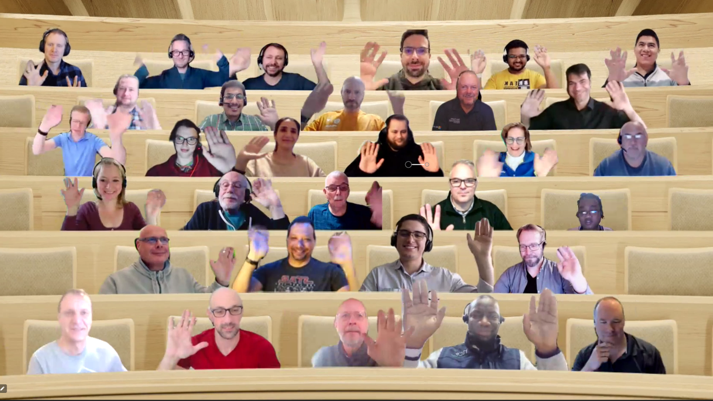

## Call summary

Welcome to the weekly call focused on capabilities of the Microsoft 365 platform.  In this call, we highlight recently announced and key existing developer resources, news, community events and demos.

### New this week

* Announced
    * More than 1300 Samples – [Microsoft 365 Unified Sample Solution Gallery](https://adoption.microsoft.com/sample-solution-gallery) - aka.ms/m365/samples
    * Training date - PnP SPFx Samples w/ NVM \| Wednesday, January 25th, 9am PT \| 12pm ET - [Register](https://forms.office.com/pages/responsepage.aspx?id=KtIy2vgLW0SOgZbwvQuRaXDXyCl9DkBHq4A2OG7uLpdUNEE2SUdTOU1UOEtCTFU3MlM1SERDMlNVNi4u)
    * During the holiday season (December 20 – January 3), we will transform the calls to be as coffee & tea meetings with the community – without specific demos.
    * Microsoft Graph Satisfaction Survey **-** aka.ms/graph-satisfaction-survey
* News
    * Article – [Principles for monetizing selected Microsoft 365 APIs](https://devblogs.microsoft.com/microsoft365dev/principles-for-monetizing-selected-microsoft-365-apis/) – Microsoft Graph team
    * Article – [Introducing the Microsoft Graph Developer Proxy community preview](https://devblogs.microsoft.com/microsoft365dev/introducing-the-microsoft-graph-developer-proxy-community-preview/) - [Sébastien Levert](https://twitter.com/sebastienlevert) (Microsoft) \| @sebastienlevert & [Waldek Mastykarz](https://twitter.com/waldekm) (Microsoft) \| @waldekm
    * Article – [New SharePoint Framework version 1.16.1 is now available](https://devblogs.microsoft.com/microsoft365dev/new-sharepoint-framework-version-1-16-1-is-available/) - Microsoft 365 Platform team
    * Article – [Adobe Acrobat streamlines the PDF experience in Microsoft Teams](https://techcommunity.microsoft.com/t5/microsoft-teams-blog/adobe-acrobat-streamlines-the-pdf-experience-in-microsoft-teams/ba-p/3677184) - Evan Westenberger (Microsoft)
    * Article – [What’s New in Microsoft Teams \| November 2022](https://techcommunity.microsoft.com/t5/microsoft-teams-blog/what-s-new-in-microsoft-teams-november-2022/ba-p/3686698) - [Holly Lehman](https://twitter.com/Lehman__Holly) (Microsoft) \| @Lehman__Holly
    * Article – [SharePoint Roadmap Pitstop: November 2022](https://techcommunity.microsoft.com/t5/microsoft-sharepoint-blog/sharepoint-roadmap-pitstop-november-2022/ba-p/3683723) - [Mark Kashman](https://twitter.com/mkashman) (Microsoft) \| @mkashman
* Microsoft Teams Platform Updates
    * Documentation – [Share in meeting](https://learn.microsoft.com/microsoftteams/platform/concepts/build-and-test/share-in-meeting?tabs=method-1) (Developer Preview)
    * Samples - [Try it yourself - experience the Apps in your Microsoft Teams client (Ready to Try app Manifests)](https://github.com/OfficeDev/microsoft-teams-samples#try-it-yourself---experience-the-apps-in-your-microsoft-teams-client)
* Conversations
    * Microsoft 365 PnP Weekly – Episode 190 (December 5th) with Germany based developer, architect, business owner, Microsoft MVP, and regional conference event coordinator Adis Jugo \| @adisjugo \| [video](https://pnp.github.io/blog/microsoft-365-pnp-weekly/episode-190/) \| [podcast](https://www.podbean.com/media/share/pb-bfn9g-1330430)

### Demos

**Introduction to Microsoft Viva Toolkit to kickstart your Microsoft Viva extensibility** – synergies between Viva Toolkit & SharePoint Framework (SPFx) - Pro-code developer tooling to simplify development, validation, and publishing of custom Microsoft Viva experiences. Capabilities and features in the Viva Toolkit - connection between Visual Studio Code and tenant, environment validation, installation of technical dependencies, solution update with CLI for Microsoft 365, start from scenario or sample, CodeTour, and works on any SPFx project. Teams Toolkit alignment.

The host of this call was [Vesa Juvonen](http://twitter.com/vesajuvonen) (Microsoft) \| @vesajuvonen. Q&A takes place in chat throughout the call.



## Agenda items

* Latest updates and news on the Microsoft 365 platform – [Vesa Juvonen](http://twitter.com/vesajuvonen) (Microsoft) \| @vesajuvonen – [6:21](https://youtu.be/fDLm2xXpExY?t=381)
* Microsoft Teams Platform updates – [Wajeed Shaikh](https://twitter.com/Wajeed_Shaikh) (Microsoft) \| @Wajeed_Shaikh – [9:01](https://youtu.be/fDLm2xXpExY?t=541)
* Demo\* - Microsoft Graph Python SDK (public preview) Update – Isaac Vargas Chacon (Microsoft) & Samwel Kanda (Microsoft)
* Demo\* - Building One Productivity Hub with SPFx for Teams, Microsoft 365 app, Outlook & SharePoint – [Waldek Mastykarz](https://twitter.com/waldekm) (Microsoft) \| @waldekm
* Demo - Introduction to Microsoft Viva Toolkit to kickstart your Microsoft Viva extensibility – [Vesa Juvonen](https://twitter.com/vesajuvonen) (Microsoft) \| @vesajuvonen – [11:54](https://youtu.be/fDLm2xXpExY?t=714)

**\*Note:** The session recording did not capture the first 2 demos. The demos will be re-recorded, and their release will be announced. All community demos are found at aka.ms/m365/videos.

Thank you for your creativity and work execution. Samples are often showcased in Demos.

## Together Mode

There are many many familiar faces in the room, great to see you once again.  Thanks for joining on the call today.

## Actions

* Complete the **Microsoft Graph Satisfaction Survey -** aka.ms/graph-satisfaction-survey
* Opt into PnP Recognition Program – aka.ms/m365pnp-recognition
    * Register for upcoming [Sharing is Caring](https://pnp.github.io/sharing-is-caring/) events:
    * Maturity Model Practitioners \| Tuesday, December 20th, 7am PST – [Download reoccurring invite](https://aka.ms/mm4m365/invite)
    * Power Platform Samples Contributor \| Tuesday, January 10th, 10:30am PST \| [Register](https://forms.office.com/pages/responsepage.aspx?id=KtIy2vgLW0SOgZbwvQuRaXDXyCl9DkBHq4A2OG7uLpdUN0hMNTRPWVVWTkhFTk9QQzhFSTRIS1JLSC4u)
    * First Time Contributor \| Thursday, January 12th, 10am PT \| 1pm ET \| 7pm CET – [Register](https://forms.office.com/pages/responsepage.aspx?id=KtIy2vgLW0SOgZbwvQuRaXDXyCl9DkBHq4A2OG7uLpdUNjAwRVNETlA1MkxIR1MyTEs5STZFVVRJMC4u)
    * Writing for the Web \| Monday, January 23rd, 10am PT \| 1pm ET \| 7:00pm CET - [Register](https://forms.office.com/pages/responsepage.aspx?id=KtIy2vgLW0SOgZbwvQuRaXDXyCl9DkBHq4A2OG7uLpdUMFNPNFMyUk9CNFROUjJWTFFGSzdJV0czVC4u)
    * PnP SPFx Samples w/ NVM \| Wednesday, January 25th, 9am PT \| 12pm ET - [Register](https://forms.office.com/pages/responsepage.aspx?id=KtIy2vgLW0SOgZbwvQuRaXDXyCl9DkBHq4A2OG7uLpdUNEE2SUdTOU1UOEtCTFU3MlM1SERDMlNVNi4u)
    * PnP Office Hours – 1:1 session \| [Register](https://outlook.office365.com/owa/calendar/PnPSharingisCaring@warner.digital/bookings/)
    * PnP Buddy System \| [Request a Buddy](https://forms.office.com/Pages/ResponsePage.aspx?id=KtIy2vgLW0SOgZbwvQuRaXDXyCl9DkBHq4A2OG7uLpdUMjRRUVg4NElZUUJLTEY1TVVSVDJFRFpLRS4u)
* Register for the [Microsoft 365 Developer Program](https://aka.ms/m365/devprogram) and get a free developer tenant
* Get started with [free training modules](https://aka.ms/m365/dev/learn) covering Microsoft 365 platform capabilities.
* Visit the [Microsoft 365 Unified Sample Solution Gallery](https://adoption.microsoft.com/sample-solution-gallery) with more than 1300 samples from Microsoft and community.
* Request a Demo spot on the call – aka.ms/m365pnp/request/demo
* Download the recurrent invite for this call – aka.ms/m365-dev-call

## Demo references

* **Introduction to Microsoft Viva Toolkit to kickstart your Microsoft Viva extensibility**
    * Marketplace - [Viva Connections Toolkit (Preview)](https://marketplace.visualstudio.com/items?itemName=m365pnp.viva-connections-toolkit) \| aka.ms/viva/code
    * Repo - [Viva Connections Toolkit for Visual Studio Code](https://github.com/pnp/vscode-viva)
    * Feedback – [vscode-viva/issues](https://github.com/pnp/vscode-viva/issues)

## General resources

* Archives - Microsoft 365 PnP Weekly - [Videos](https://www.youtube.com/playlist?list=PLR9nK3mnD-OVYI-St_CBiFfuL4CZbBpkC), [Podcasts](https://pnpweekly.podbean.com/)
* Microsoft Teams Toolkit | [https://aka.ms/teams-toolkit](https://aka.ms/teams-toolkit)
* Microsoft Graph Toolkit in Microsoft Learn | [https://aka.ms/learn-mgt](https://aka.ms/learn-mgt)
* Viva Connections [https://aka.ms/VivaConnections](https://aka.ms/VivaConnections)
* [SharePoint look book](https://lookbook.microsoft.com/?WT.mc_id=m365-24198-cxa)
* [Yo Teams video training package](https://aka.ms/yoteams-training)
* [.NET Standard 2.0 version of SharePoint Online CSOM API](https://developer.microsoft.com/microsoft-365/blogs/net-standard-version-of-sharepoint-online-csom-apis?WT.mc_id=m365-24198-cxa)
* [Microsoft 365 Platform Community (PnP) videos](https://aka.ms/m365/videos) | aka.ms/m365/videos
* [Microsoft Teams Toolkit for Visual Studio Code](https://marketplace.visualstudio.com/items?itemName=TeamsDevApp.ms-teams-vscode-extension)
* [yo Teams](https://aka.ms/yoteams) | aka.ms/yoteams
* [SPFx Developer documentation](https://aka.ms/spfx) | <https://aka.ms/spfx>
* [Microsoft 365 developer program site](https://developer.microsoft.com/office/dev-program?WT.mc_id=m365-24198-cxa) - Need to become a Tenant Admin to test look book capabilities? Get a Microsoft 365 E5 developer subscription - free tenant for 90 days with automatic renewal if used for dev purposes

## Upcoming Calls | Recurrent Invites

* Microsoft 365 General Dev call \| Thursday, December 8, 7:00 am PT - <https://aka.ms/m365-dev-sig> (bi-weekly)
* Microsoft 365 platform call \| Tuesday, December 13, 8:00 am PT – <https://aka.ms/m365-dev-call> (weekly)
* Office add-in monthly call \| Wednesday, December 14, 8:00 am PT - <https://aka.ms/officeaddinscall> (monthly)
* Viva Connections & SharePoint Framework call \| Thursday, December 15, 7:00 am PT - <https://aka.ms/spdev-spfx-call> (bi-weekly)
* Microsoft Identity Platform call \| Thursday, December 15, 9:00 am PT - <https://aka.ms/IDDevCommunityCalendar> (monthly)
* Power Platform monthly call \| Wednesday, December 21, 8:00 am PT - <https://aka.ms/PowerAppsMonthlyCall> (monthly)

Microsoft 365 Platform community call focuses on latest Microsoft 365 Platform updates and demos delivered by Microsoft presenters and takes place weekly on Tuesday.  The alternating Special Interest Group community calls each Thursday focus on SharePoint Framework (client-side development/implementation) and Microsoft 365 Platform (includes Microsoft Teams, Bots, Microsoft Graph, CSOM, REST, site provisioning, PnP PowerShell, PnP Sites Core, Site Designs, Power Automate, PowerApps, Column Formatting, list formatting, etc. topics.) with demos commonly delivered by community members.

More details on the Microsoft 365 community from [https://aka.ms/m365pnp](https://aka.ms/sppnp).

You can download recurrent invite for this call from [https://aka.ms/m365-dev-call](https://aka.ms/m365-dev-call).  Welcome and join in the discussion. If you have any questions, comments, or feedback, feel free to provide your input as comments to this post as well. More details on the Microsoft 365 community and options to get involved are available from [https://aka.ms/m365pnp](https://aka.ms/sppnp).

&quot;_Sharing is caring&quot;_

_Microsoft 365 Platform Community team, Microsoft - 6th of December 2022_


