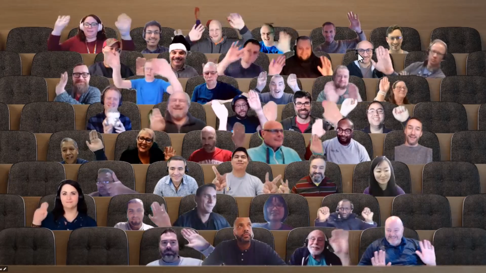

## Call summary

Welcome to the weekly call focused on capabilities of the Microsoft 365 platform.  In this call, we highlight recently announced and key existing developer resources, news, community events and three demos.

### New this week

* Announcements
    * This Microsoft 365 Platform call will take place each week during the holidays. The call is transforming to a coffee and chat format - Q&A and discussions for the next 3 weeks – December 20th, December 27th and January 3rd. Please join as you are able. Happy holidays.
    * Samples – [Microsoft 365 Unified Sample Solution Gallery](https://adoption.microsoft.com/sample-solution-gallery) - aka.ms/m365/samples now with more than 1350 samples from Microsoft and community.
    * Microsoft Graph Satisfaction Survey - aka.ms/graph-satisfaction-survey
* News
    * Article – [Modern Work Superheroes \| December News You Can Use](https://techcommunity.microsoft.com/t5/microsoft-teams-blog/modern-work-superheroes-december-news-you-can-use/ba-p/3692073) - Kellen Winters (Microsoft)
    * Article – [Frontline workers using shared devices can now use Edge and Yammer apps on Android alongside Teams](https://techcommunity.microsoft.com/t5/microsoft-teams-blog/frontline-workers-using-shared-devices-can-now-use-edge-and/ba-p/3690960) - Christina Wu (Microsoft)
* Microsoft Teams Platform Updates
    * Documentation – [Plan analytics for your Teams app – Overview](https://learn.microsoft.com/microsoftteams/platform/concepts/design/overview-analytics)
* Conversations
    * Microsoft 365 PnP Weekly – Episode 191 (December 12th) with Microsoft Redmond based Visual Studio Development Program Manager - [Julia Kasper](https://twitter.com/Jujujuliakasper) \| @Jujujuliakasper \| [video](https://pnp.github.io/blog/microsoft-365-pnp-weekly/episode-191/) \| [podcast](https://www.podbean.com/media/share/pb-vp8k5-1338aee)

### Demos

* **Using dynamic SVG images with Viva ACEs for business charts** – here is a technique for generating/adding dynamic SVGs (interactive images) to Adaptive Card Extensions in a way that fits into the Adaptive Card mind-set (small, dynamic, performant). Run through code for adding a simple mathematically derived geometric graphic to a CardView and a more complex bar chart sample (image graphic bound to data) in a QuickView card. Follow this approach to create your own SVG generation functions.
* **Introduction to Microsoft Graph Developer Proxy** – a load test simulation tool in preview for Pro Developers building apps on top of Microsoft Graph. Learn what is the Microsoft Graph Developer Proxy, install and see it in action. The Dev Proxy generates issues/errors so you can see how your app that’s making requests to the Graph API reacts under load, with and without the Graph SDK. Please use the tool and provide feedback.
* **Introduction to Microsoft 365 App Compliance Automation Tool** – a service in Azure portal that simplifies the process of demonstrating security and compliance for applications published on Microsoft 365 by automating many (40%) of the validation processes, i.e., collecting and analyzing compliance data, generating compliance reports with prescriptive guidance. The compliance report integrates seamlessly into the Microsoft 365 Certification process in Partner Center. See creation of report in Azure portal, remediation, and integration in Partner Center.

The host of this call was [Vesa Juvonen](http://twitter.com/vesajuvonen) (Microsoft) \| @vesajuvonen. Q&A takes place in chat throughout the call.



## Agenda items

* [09:21](https://youtu.be/F5c4Y3PkiEc?t=561) – Latest updates and news on the Microsoft 365 platform – [Vesa Juvonen](http://twitter.com/vesajuvonen) (Microsoft) \| @vesajuvonen
* [10:19](https://youtu.be/F5c4Y3PkiEc?t=619) – Microsoft Teams Platform updates – Surbhi Gupta (Microsoft)
* [11:29](https://youtu.be/F5c4Y3PkiEc?t=689) – Together mode picture
* [12:45](https://youtu.be/F5c4Y3PkiEc?t=765) – Demo - Using dynamic SVG images with Viva ACEs for business charts – [Patrick Rodgers](https://twitter.com/mediocrebowler) (Microsoft) \| @mediocrebowler
* [22:37](https://youtu.be/F5c4Y3PkiEc?t=1357) – Introduction to Microsoft Graph Developer Proxy – [Sébastien Levert](https://twitter.com/sebastienlevert) (Microsoft) \| @sebastienlevert
* [37:01](https://youtu.be/F5c4Y3PkiEc?t=2221) – Introduction to Microsoft 365 App Compliance Automation tool – [Sreekanth Thirthala](https://www.linkedin.com/in/sreekanththirthala/) (Microsoft)

Thank you for your creativity and work execution. Samples are often showcased in Demos.

## Together Mode

Thank you for joining once again on the call. Wait, is that a squirrel in the mid row? Happy holidays to all, from the many gathered here.

## Actions

* Please complete the **Microsoft Graph Satisfaction Survey -** aka.ms/graph-satisfaction-survey
* Opt into PnP Recognition Program – aka.ms/m365pnp-recognition
    * Register for upcoming [Sharing Is Caring](https://pnp.github.io/sharing-is-caring/) events:
    * Maturity Model Practitioners \| Tuesday, December 20th, 7am PST – [Download reoccurring invite](https://aka.ms/mm4m365/invite)
    * Power Platform Samples Contributor \| Tuesday, January 10th, 10:30am PST \| [Register](https://forms.office.com/pages/responsepage.aspx?id=KtIy2vgLW0SOgZbwvQuRaXDXyCl9DkBHq4A2OG7uLpdUN0hMNTRPWVVWTkhFTk9QQzhFSTRIS1JLSC4u)
    * First Time Contributor \| Thursday, January 12th, 10am PT \| 1pm ET \| 7pm CET – [Register](https://forms.office.com/pages/responsepage.aspx?id=KtIy2vgLW0SOgZbwvQuRaXDXyCl9DkBHq4A2OG7uLpdUNjAwRVNETlA1MkxIR1MyTEs5STZFVVRJMC4u)
    * Writing for the Web \| Monday, January 23rd, 10am PT \| 1pm ET \| 7:00pm CET - [Register](https://forms.office.com/pages/responsepage.aspx?id=KtIy2vgLW0SOgZbwvQuRaXDXyCl9DkBHq4A2OG7uLpdUMFNPNFMyUk9CNFROUjJWTFFGSzdJV0czVC4u)
    * PnP SPFx Samples w/ NVM \| Wednesday, January 25th, 9am PT \| 12pm ET - [Register](https://forms.office.com/pages/responsepage.aspx?id=KtIy2vgLW0SOgZbwvQuRaXDXyCl9DkBHq4A2OG7uLpdUNEE2SUdTOU1UOEtCTFU3MlM1SERDMlNVNi4u)
    * PnP Office Hours – 1:1 session \| [Register](https://outlook.office365.com/owa/calendar/PnPSharingisCaring@warner.digital/bookings/)
    * PnP Buddy System \| [Request a Buddy](https://forms.office.com/Pages/ResponsePage.aspx?id=KtIy2vgLW0SOgZbwvQuRaXDXyCl9DkBHq4A2OG7uLpdUMjRRUVg4NElZUUJLTEY1TVVSVDJFRFpLRS4u)
* Register for the [Microsoft 365 Developer Program](https://aka.ms/m365/devprogram) and get a free developer tenant
* Get started with [free training modules](https://aka.ms/m365/dev/learn) covering Microsoft 365 platform capabilities.
* Visit the [Microsoft 365 Unified Sample Solution Gallery](https://adoption.microsoft.com/sample-solution-gallery) with more than 1400 samples from Microsoft and community.
* Request a Demo spot on the call – aka.ms/m365pnp/request/demo
* Download the recurrent invite for this call – aka.ms/m365-dev-call

## Demo references

* **Using dynamic SVG images with Viva ACEs for business charts**
    * Sample - [ace-chart](https://github.com/pnp/spfx-reference-scenarios/tree/main/samples/ace-chart)
    * Article - [What Is an SVG File? SVG Image and Tags Explained](https://www.freecodecamp.org/news/svg-basics-what-are-scalable-vector-graphics-and-how-do-you-use-them)
    * Article - [Everything You Need To Know About SVG](https://css-tricks.com/lodge/svg/)
* **Introduction to Microsoft Graph Developer Proxy**
    * Repo - [Microsoft Graph Developer Proxy](https://github.com/microsoftgraph/msgraph-developer-proxy) \| aka.ms/graph/proxy
    * Article - [Introducing the Microsoft Graph Developer Proxy community preview](https://devblogs.microsoft.com/microsoft365dev/introducing-the-microsoft-graph-developer-proxy-community-preview/) \| aka.ms/graph/proxy/launch
* **Introduction to Microsoft 365 App Compliance Automation tool**
    * Documentation - [App Compliance Automation Tool for Microsoft 365](https://learn.microsoft.com/microsoft-365-app-certification/docs/acat-overview) \| aka.ms/acat

## General resources

* Archives - Microsoft 365 PnP Weekly - [Videos](https://www.youtube.com/playlist?list=PLR9nK3mnD-OVYI-St_CBiFfuL4CZbBpkC), [Podcasts](https://pnpweekly.podbean.com/)
* Microsoft Teams Toolkit | [https://aka.ms/teams-toolkit](https://aka.ms/teams-toolkit)
* Microsoft Graph Toolkit in Microsoft Learn | [https://aka.ms/learn-mgt](https://aka.ms/learn-mgt)
* Viva Connections [https://aka.ms/VivaConnections](https://aka.ms/VivaConnections)
* [SharePoint look book](https://lookbook.microsoft.com/?WT.mc_id=m365-24198-cxa)
* [Yo Teams video training package](https://aka.ms/yoteams-training)
* [.NET Standard 2.0 version of SharePoint Online CSOM API](https://developer.microsoft.com/microsoft-365/blogs/net-standard-version-of-sharepoint-online-csom-apis?WT.mc_id=m365-24198-cxa)
* [Microsoft 365 Platform Community (PnP) videos](https://aka.ms/m365/videos) | aka.ms/m365/videos
* [Microsoft Teams Toolkit for Visual Studio Code](https://marketplace.visualstudio.com/items?itemName=TeamsDevApp.ms-teams-vscode-extension)
* [yo Teams](https://aka.ms/yoteams) | aka.ms/yoteams
* [SPFx Developer documentation](https://aka.ms/spfx) | <https://aka.ms/spfx>
* [Microsoft 365 developer program site](https://developer.microsoft.com/office/dev-program?WT.mc_id=m365-24198-cxa) - Need to become a Tenant Admin to test look book capabilities? Get a Microsoft 365 E5 developer subscription - free tenant for 90 days with automatic renewal if used for dev purposes

## Upcoming Calls | Recurrent Invites

* Office add-in monthly call \| Wednesday, December 14, 8:00 am PT - <https://aka.ms/officeaddinscall> (monthly)
* Viva Connections & SharePoint Framework call \| Thursday, December 15, 7:00 am PT - <https://aka.ms/spdev-spfx-call> (bi-weekly)
* Microsoft Identity Platform call \| Thursday, December 15, 9:00 am PT - <https://aka.ms/IDDevCommunityCalendar> (monthly)
* Microsoft 365 platform call - **(Coffee & chat with Community)** \| Tuesday, December 20, 8:00 am PT – <https://aka.ms/m365-dev-call> (weekly)
* Power Platform monthly call \| Wednesday, December 21, 8:00 am PT - <https://aka.ms/PowerAppsMonthlyCall> (monthly)
* Microsoft 365 General Dev call \| Thursday, December 22, 7:00 am PT - <https://aka.ms/m365-dev-sig> (bi-weekly)

Microsoft 365 Platform community call focuses on latest Microsoft 365 Platform updates and demos delivered by Microsoft presenters and takes place weekly on Tuesday.  The alternating Special Interest Group community calls each Thursday focus on SharePoint Framework (client-side development/implementation) and Microsoft 365 Platform (includes Microsoft Teams, Bots, Microsoft Graph, CSOM, REST, site provisioning, PnP PowerShell, PnP Sites Core, Site Designs, Power Automate, PowerApps, Column Formatting, list formatting, etc. topics.) with demos commonly delivered by community members.

More details on the Microsoft 365 community from [https://aka.ms/m365pnp](https://aka.ms/sppnp).

You can download recurrent invite for this call from [https://aka.ms/m365-dev-call](https://aka.ms/m365-dev-call).  Welcome and join in the discussion. If you have any questions, comments, or feedback, feel free to provide your input as comments to this post as well. More details on the Microsoft 365 community and options to get involved are available from [https://aka.ms/m365pnp](https://aka.ms/sppnp).

&quot;_Sharing is caring&quot;_

_Microsoft 365 Platform Community team, Microsoft - 13th of December 2022_


