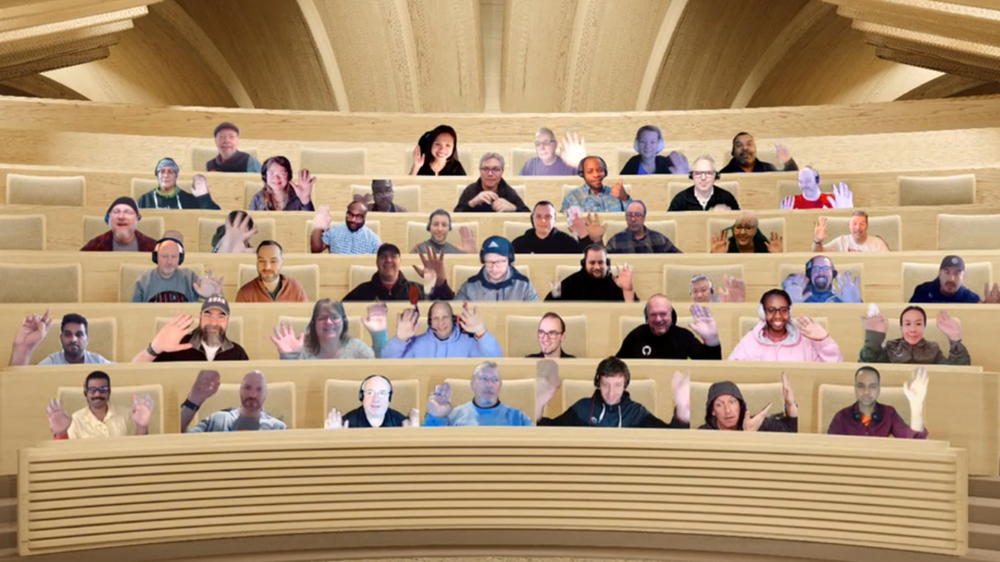

## Call summary

Welcome to the weekly call focused on capabilities of the Microsoft 365 platform.  In this call, we highlight recently announced and key existing developer resources, news, community events and two demos.

### New this week

* Announcements
    * Samples – [Microsoft 365 Unified Sample Solution Gallery](https://adoption.microsoft.com/sample-solution-gallery) - aka.ms/m365/samples now with more than 1460 samples from Microsoft and community.
    * Viva Home experiences start to rollout to “Targeted Release Tenants” today.
* News
    * Article – [Learn how to create Adaptive Card Extensions (ACEs) for Microsoft Viva Connections and Viva Home](https://devblogs.microsoft.com/microsoft365dev/learn-how-to-create-adaptive-card-extensions-aces-for-microsoft-viva-connections-and-viva-home/) - [Vesa Juvonen](https://twitter.com/vesajuvonen) (Microsoft) \| @vesajuvonen
    * Article – [Modern Work Superheroes \| January News You Can Use](https://techcommunity.microsoft.com/t5/microsoft-teams-blog/modern-work-superheroes-january-news-you-can-use/ba-p/3713852) - [Kellen Winters](https://twitter.com/kellenwinters) (Microsoft) \| @kellenwinters
    * Article – [“Fast Fridays with Jeff Teper” 🎙 – The Intrazone podcast](https://techcommunity.microsoft.com/t5/microsoft-sharepoint-blog/fast-fridays-with-jeff-teper-the-intrazone-podcast/ba-p/3707656) - [Mark Kashman](https://twitter.com/mkashman) (Microsoft) \| @mkashman
    * Article – [Make Your Goals a Reality with OKRs and New Capabilities from Microsoft Viva Goals](https://techcommunity.microsoft.com/t5/microsoft-viva-blog/make-your-goals-a-reality-with-okrs-and-new-capabilities-from/ba-p/3711899) - Nirja Trivedi (Microsoft)
    * Article – [Reach your learning goals with learning paths and collections](https://techcommunity.microsoft.com/t5/microsoft-viva-blog/reach-your-learning-goals-with-learning-paths-and-collections/ba-p/3710763) - Andrea Lum (Microsoft)
* Conversations
    * Microsoft 365 PnP Weekly – Episode 193 (January 16th) with UK-based M365 Consultant, Content AI Specialist and Microsoft MVP (M365 Apps & Services) - [Leon Armston](https://twitter.com/LeonArmston) (Intelogy) \| @LeonArmston \| [video](https://pnp.github.io/blog/microsoft-365-pnp-weekly/episode-193/) \| [podcast](https://www.podbean.com/eas/pb-z33y6-1365f69)

### Demos

* **Building Metaverse experiences using Teams LiveShare SDK** – (preview) for building collaborative meeting extensions. Secure real-time collaboration for Teams. Low-friction dev - web-based SDK, fast integration time, robust distributed data structures, free fully managed service, regional scaling, local browser testing. Demo, how to get started, sample and resources. Uses Fluid Framework and the LivePresence data structure (component). Package simulated environment as a Teams app that’s seen by all meeting participants.
* **Create an SPFx Image Card ACE displaying image carousel - ACE learning module** – opens with basics on ACEs and underlaying SPFx and Adaptive Cards technologies for building experiences in Microsoft Viva. Demo geared for people with SPFx, but no experience building Adaptive Card Extensions. See UI for card that displays dynamic images from an external service, namely NASA. Configure Property pane for the ACEImageViewer component, look at the code for this web part.

The host of this call was [Vesa Juvonen](http://twitter.com/vesajuvonen) (Microsoft) \| @vesajuvonen. Q&A takes place in chat throughout the call.



## Agenda items

[00:00](https://youtu.be/_Y1brrudYxE?t=0) – Intro

[08:06](https://youtu.be/_Y1brrudYxE?t=486) – Latest updates and news on the Microsoft 365 platform – [Vesa Juvonen](http://twitter.com/vesajuvonen) (Microsoft) \| @vesajuvonen

[09:44](https://youtu.be/_Y1brrudYxE?t=584) – Together mode picture

[10:56](https://youtu.be/_Y1brrudYxE?t=656) – Demo - Building Metaverse experiences using Teams LiveShare SDK – [David Rousset](https://twitter.com/davrous) (Microsoft) \| @davrous

[31:11](https://youtu.be/_Y1brrudYxE?t=1871) – Demo - Create an SPFx Image Card ACE displaying image carousel - ACE learning module – [Vesa Juvonen](https://twitter.com/vesajuvonen) (Microsoft) \| @vesajuvonen & [Andrew Connell](https://twitter.com/andrewconnell) (Voitanos) @andrewconnell

[53:09](https://youtu.be/_Y1brrudYxE?t=3189) – Closing

Thank you for your creativity and work execution. Samples are often showcased in Demos.

## Together Mode

Thank you for joining the call today and for being part of this great Community.  Please keep the feedback coming.

## Actions

* Opt into PnP Recognition Program – aka.ms/m365pnp-recognition
* Register for upcoming [Sharing Is Caring](https://pnp.github.io/sharing-is-caring/) events:
    * Writing for the Web \| Monday, January 23rd, 10am PT \| 1pm ET \| 7:00pm CET - [Register](https://forms.office.com/pages/responsepage.aspx?id=KtIy2vgLW0SOgZbwvQuRaXDXyCl9DkBHq4A2OG7uLpdUMFNPNFMyUk9CNFROUjJWTFFGSzdJV0czVC4u)
    * PnP SPFx Samples w/NVM \| Wednesday, January 25th, 9am PT \| 12pm ET - [Register](https://forms.office.com/pages/responsepage.aspx?id=KtIy2vgLW0SOgZbwvQuRaXDXyCl9DkBHq4A2OG7uLpdUNEE2SUdTOU1UOEtCTFU3MlM1SERDMlNVNi4u)
    * Maturity Model Practitioners \| Tuesday, February 21st, 7am PST – [Download reoccurring invite](https://aka.ms/mm4m365/invite)
    * PnP Office Hours – 1:1 session \| [Register](https://outlook.office365.com/owa/calendar/PnPSharingisCaring@warner.digital/bookings/)
    * PnP Buddy System \| [Request a Buddy](https://forms.office.com/Pages/ResponsePage.aspx?id=KtIy2vgLW0SOgZbwvQuRaXDXyCl9DkBHq4A2OG7uLpdUMjRRUVg4NElZUUJLTEY1TVVSVDJFRFpLRS4u)
* Register for the [Microsoft 365 Developer Program](https://aka.ms/m365/devprogram) and get a free developer tenant
* Get started with [free training modules](https://aka.ms/m365/dev/learn) covering Microsoft 365 platform capabilities.
* Visit the [Microsoft 365 Unified Sample Solution Gallery](https://adoption.microsoft.com/sample-solution-gallery) with more than 1400 samples from Microsoft and community.
* Request a Demo spot on the call – aka.ms/m365pnp/request/demo
* Download the recurrent invite for this call – aka.ms/m365-dev-call

## Demo references

* **Building Metaverse experiences using Teams LiveShare SDK**
    * Sample - [Metaverse Collaborative Virtual Visit - Live Share sample](https://github.com/davrous/metaverseliveshare)
    * Documentation – [Live Share SDK](https://learn.microsoft.com/microsoftteams/platform/apps-in-teams-meetings/teams-live-share-overview) \| aka.ms/TeamsLiveShare
    * Documentation – [Live Share media capabilities](https://learn.microsoft.com/microsoftteams/platform/apps-in-teams-meetings/teams-live-share-media-capabilities) \| aka.ms/TeamsLiveShareMedia
    * SDK – [Live Share SDK](https://github.com/microsoft/live-share-sdk)
    * Samples – [live-share-sdk](https://github.com/microsoft/live-share-sdk/tree/main/samples)/samples \| aka.ms/LiveShareSamples
    * FAQ – [Live Share SDK FAQ](https://learn.microsoft.com/microsoftteams/platform/apps-in-teams-meetings/teams-live-share-faq) \| aka.ms/LiveShareFAQ
    * Preview – [Public developer preview for Teams](https://learn.microsoft.com/microsoftteams/platform/resources/dev-preview/developer-preview-intro) \| aka.ms/AAgxxj5
    * 2022 Build Session – [Make your meetings more interactive! Learn how to build engaging synchronous experiences your users will love](https://mybuild.microsoft.com/en-US/sessions/d70a4676-b170-4f4b-aba4-24e9037f8667?source=sessions) \| aka.ms/teamsliveshare/build22deepdive
    * 2022 Build Session – [Build collaborative apps with Microsoft Teams and Microsoft 365 services](https://mybuild.microsoft.com/en-US/sessions/5ff4ebc7-c631-4a67-9a47-279539b07d09?source=sessions) \| aka.ms/teamsliveshare/build22collabapps
    * Game Engine – [babalon.js](https://www.babylonjs.com/)
* **Create an SPFx Image Card ACE displaying image carousel - ACE learning module**
    * Learn Module - [Create Adaptive Card Extensions (ACE) for Microsoft Viva Connections](https://learn.microsoft.com/training/modules/sharepoint-spfx-adaptive-card-extension-card-types/) \| aka.ms/viva/ace/learn
    * Learn Basics - [Basics of ACEs: card templates, CardViews, properties, and states](https://learn.microsoft.com/training/modules/sharepoint-spfx-adaptive-card-extension-card-types/2-adaptive-card-extension-basics)
    * Learn Exercise - [Exercise - Create an SPFx Image Card ACE displaying image carousel](https://learn.microsoft.com/training/modules/sharepoint-spfx-adaptive-card-extension-card-types/5-exercise-ace-image-card)
    * Demo (\#1 in this series) - [Introduction to Microsoft Viva ACE development learn module - Getting started](https://youtu.be/vCFnqq690p8?t=2200) – [Vesa Juvonen](https://twitter.com/vesajuvonen) (Microsoft) \| @vesajuvonen & [Andrew Connell](https://twitter.com/andrewconnell) (Voitanos) \| @andrewconnell

## General resources

* Archives - Microsoft 365 PnP Weekly - [Videos](https://www.youtube.com/playlist?list=PLR9nK3mnD-OVYI-St_CBiFfuL4CZbBpkC), [Podcasts](https://pnpweekly.podbean.com/)
* Microsoft Teams Toolkit | [https://aka.ms/teams-toolkit](https://aka.ms/teams-toolkit)
* Microsoft Graph Toolkit in Microsoft Learn | [https://aka.ms/learn-mgt](https://aka.ms/learn-mgt)
* Viva Connections [https://aka.ms/VivaConnections](https://aka.ms/VivaConnections)
* [SharePoint look book](https://lookbook.microsoft.com/?WT.mc_id=m365-24198-cxa)
* [Yo Teams video training package](https://aka.ms/yoteams-training)
* [.NET Standard 2.0 version of SharePoint Online CSOM API](https://developer.microsoft.com/microsoft-365/blogs/net-standard-version-of-sharepoint-online-csom-apis?WT.mc_id=m365-24198-cxa)
* [Microsoft 365 Platform Community (PnP) videos](https://aka.ms/m365/videos) | aka.ms/m365/videos
* [Microsoft Teams Toolkit for Visual Studio Code](https://marketplace.visualstudio.com/items?itemName=TeamsDevApp.ms-teams-vscode-extension)
* [yo Teams](https://aka.ms/yoteams) | aka.ms/yoteams
* [SPFx Developer documentation](https://aka.ms/spfx) | <https://aka.ms/spfx>
* [Microsoft 365 developer program site](https://developer.microsoft.com/office/dev-program?WT.mc_id=m365-24198-cxa) - Need to become a Tenant Admin to test look book capabilities? Get a Microsoft 365 E5 developer subscription - free tenant for 90 days with automatic renewal if used for dev purposes

## Upcoming Calls | Recurrent Invites

* Power Platform monthly call \| Wednesday, January 18, 8:00 am PT - <https://aka.ms/PowerAppsMonthlyCall> (monthly)
* Microsoft 365 General Dev call \| Thursday, January 19, 7:00 am PT - <https://aka.ms/m365-dev-sig> (bi-weekly)
* Microsoft Identity Platform call \| Thursday, January 19, 9:00 am PT - <https://aka.ms/IDDevCommunityCalendar> (monthly)
* Microsoft 365 platform call \| Tuesday, January 24, 8:00 am PT – <https://aka.ms/m365-dev-call> (weekly)
* Viva Connections & SharePoint Framework call \| Thursday, January 26, 7:00 am PT - <https://aka.ms/spdev-spfx-call> (bi-weekly)
* Office add-in monthly call \| Wednesday, February 8, 8:00 am PT - <https://aka.ms/officeaddinscall> (monthly)

Microsoft 365 Platform community call focuses on latest Microsoft 365 Platform updates and demos delivered by Microsoft presenters and takes place weekly on Tuesday.  The alternating Special Interest Group community calls each Thursday focus on SharePoint Framework (client-side development/implementation) and Microsoft 365 Platform (includes Microsoft Teams, Bots, Microsoft Graph, CSOM, REST, site provisioning, PnP PowerShell, PnP Sites Core, Site Designs, Power Automate, PowerApps, Column Formatting, list formatting, etc. topics.) with demos commonly delivered by community members.

More details on the Microsoft 365 community from [https://aka.ms/m365pnp](https://aka.ms/sppnp).

You can download recurrent invite for this call from [https://aka.ms/m365-dev-call](https://aka.ms/m365-dev-call).  Welcome and join in the discussion. If you have any questions, comments, or feedback, feel free to provide your input as comments to this post as well. More details on the Microsoft 365 community and options to get involved are available from [https://aka.ms/m365pnp](https://aka.ms/sppnp).

&quot;_Sharing is caring&quot;_

_Microsoft 365 Platform Community team, Microsoft - 17th of January 2023_


