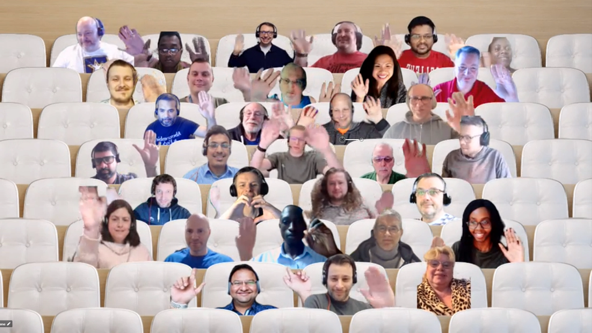

## Call summary

Welcome to the weekly call focused on capabilities of the Microsoft 365 platform.  In this call, we highlight recently announced and key existing developer resources, news, community events and two demos.

### New this week

* Announcements
    * Samples – [Microsoft 365 Unified Sample Solution Gallery](https://adoption.microsoft.com/sample-solution-gallery) - aka.ms/m365/samples now with more than 1470 samples from Microsoft and community.
    * Agenda set for next [Microsoft 365 platform call](https://aka.ms/m365-dev-call) - Tuesday, February 7th, 8:00 am PT.
        * Latest news from Microsoft engineering on Microsoft 365 topics
        * Demos
            * **Ayca Bas** & **Dan Wahlin** – Getting Started with Azure Communication Services, Microsoft Graph, and Microsoft Teams
            * **Garry Trinder** – Turn text to images in Microsoft Teams using OpenAI DALL-E 2 and Teams Toolkit for Visual Studio Code
            * **Pranita Padalwar** - Power Pages Data workspace is now solution aware
    * Help shape the Microsoft Community Advisory Board priorities for the next six months by completing survey - Microsoft Community Insights - January 2023 \| aka.ms/CommunityInsightsJan23
* News
    * Article – [From zero to hero: Build a meetings app with Azure Communication Services and Microsoft Teams – Part 1](https://devblogs.microsoft.com/microsoft365dev/build-a-meetings-app-with-azure-communication-services-and-microsoft-teams-part-1/) – [Dan Wahlin](https://twitter.com/DanWahlin) (Microsoft) \| @DanWahlin and [Ayça Baş](https://twitter.com/aycabs) (Microsoft) \| @aycabs
    * Article – [Microsoft Graph Developer Proxy v0.4 with improved output, more guidance, and plugins](https://devblogs.microsoft.com/microsoft365dev/microsoft-graph-developer-proxy-v0-4-with-improved-output-more-guidance-and-plugins/) – [Waldek Mastykarz](https://twitter.com/waldekm) (Microsoft) \| @waldekm and [Garry Trinder](https://twitter.com/garrytrinder) (Microsoft) \| @garrytrinder
    * Article – [Maximizing organizational performance with GainX Artificial Intelligence and Microsoft Graph Data Connect](https://devblogs.microsoft.com/microsoft365dev/maximizing-organizational-performance-with-gainx-artificial-intelligence-and-microsoft-graph-data-connect/) - [Amit Panchal](https://www.linkedin.com/in/amitpnyc/) (Microsoft)
    * Article – [What’s New in Microsoft Teams \| January 2023](https://techcommunity.microsoft.com/t5/microsoft-teams-blog/what-s-new-in-microsoft-teams-january-2023/ba-p/3728104) - [Holly Lehman](https://twitter.com/lehman__holly) (Microsoft) \| @Lehman__Holly
    * Article – [A new look for Microsoft Teams Rooms on Windows](https://techcommunity.microsoft.com/t5/microsoft-teams-blog/a-new-look-for-microsoft-teams-rooms-on-windows/ba-p/3726040) – Matt Taylor (Microsoft)
    * Article – [Microsoft Teams Phone makes on-the-go easier](https://techcommunity.microsoft.com/t5/microsoft-teams-blog/microsoft-teams-phone-makes-on-the-go-easier/ba-p/3725151) - Pete Daderko (Microsoft)
    * Article – [Do More with Less with Microsoft Viva](https://techcommunity.microsoft.com/t5/microsoft-viva-blog/do-more-with-less-with-microsoft-viva/ba-p/3728344) - Laura Becker (Microsoft)
    * Article – [SharePoint Roadmap Pitstop: January 2023](https://techcommunity.microsoft.com/t5/microsoft-sharepoint-blog/sharepoint-roadmap-pitstop-january-2023/ba-p/3727711) - [Mark Kashman](https://twitter.com/mkashman) (Microsoft) \| @mkashman
* Teams Platform updates
    * App caching
        * Documentation - [App caching](https://learn.microsoft.com/microsoftteams/platform/apps-in-teams-meetings/build-tabs-for-meeting?tabs=desktop%2Cmeeting-chat-view-desktop%2Cmeeting-stage-view-desktop%2Cchannel-meeting-desktop#app-caching)
        * Sample - [App Caching In Meetings](https://github.com/OfficeDev/Microsoft-Teams-Samples/tree/main/samples/app-cache-meetings/nodejs)
    * Update message
        * Documentation - [Update message](https://learn.microsoft.com/microsoftteams/platform/bots/how-to/conversations/conversation-messages?tabs=dotnet1%2Cdotnet2%2Ccsharp3%2Ccsharp4%2Ccsharp5%2Cdotnet#update-message)
        * Documentation - [Soft delete message](https://learn.microsoft.com/microsoftteams/platform/bots/how-to/conversations/conversation-messages?tabs=dotnet1%2Cdotnet2%2Ccsharp3%2Ccsharp4%2Ccsharp5%2Cdotnet#soft-delete-message)
        * Sample – [Bot conversation](https://github.com/OfficeDev/Microsoft-Teams-Samples/tree/main/samples/bot-conversation)
* Conversations
    * Microsoft 365 Developer Podcast – Partner Showcase: Kudzu with Rob D’Oria (January 29th) \| [podcast](https://m365devpodcast.com/e/partner-showcase-kudzu-with-rob-d-oria/)
    * Microsoft 365 PnP Weekly – Episode 195 (January 30th) with US-based Microsoft MVP and MCT, CEO/Owner of SharePlicity - [Liam Cleary](https://twitter.com/helloitsliam) \|@helloitsliam \| [video](https://pnp.github.io/blog/microsoft-365-pnp-weekly/episode-195/) \| [podcast](https://www.podbean.com/eas/pb-r56f6-1379bd4)

### Demos

* **Introduction to Microsoft Viva Home experience** – latest details for Viva Connections on desktop Viva Home, in targeted release. Broad overview on current Viva Connections experience – app in Teams with mobile and desktop experiences. Updated Connections desktop with new default home experience. Deep-dive into Viva Home – Desktop and Mobile. See branding, feeds, card templates. Easy for Admins to maintain and create content. Extensibility options and resources. Start with Dashboard and optionally add homesite.
* **Introduction to Azure Communication Services** – today’s focus: Build a custom app to chat and call with people in Microsoft Teams meeting. Tools to integrate communication – Microsoft Graph API, Azure Communications Services (ACS) and Microsoft Teams. Overview on ACS services for communicating with any product. Demo – load ACS in Azure Portal, create/configure a new resource that enables authorized user to initiate call, and finally join the meeting.

The host of this call was [Vesa Juvonen](https://twitter.com/vesajuvonen) (Microsoft) \| @vesajuvonen. Q&A takes place in chat throughout the call.



## Agenda items

[00:00](https://youtu.be/fHy1K0MRUiY?t=0) – Intro

[07:35](https://youtu.be/fHy1K0MRUiY?t=455) – Latest updates and news on the Microsoft 365 platform – [Vesa Juvonen](https://twitter.com/vesajuvonen) (Microsoft) \| @vesajuvonen

[08:39](https://youtu.be/fHy1K0MRUiY?t=519) – Microsoft Teams Platform updates – [Wajeed Shaikh](https://twitter.com/Wajeed_Shaikh) (Microsoft) \| @Wajeed_Shaikh

[10:08](https://youtu.be/fHy1K0MRUiY?t=608) – Together mode picture

[11:31](https://youtu.be/fHy1K0MRUiY?t=691) – Demo - Introduction to Microsoft Viva Home experience – [Tejas Mehta](https://twitter.com/tpmehta) (Microsoft) \| @tpmehta, [Anshuman Gaur](https://twitter.com/_AnshumanGaur) (Microsoft) \| @_AnshumanGaur & [Luca Bandinelli](https://www.linkedin.com/in/luca-bandinelli-37b209/) (Microsoft)

[33:21](https://youtu.be/fHy1K0MRUiY?t=2001) – Demo - Introduction to Azure Communication Services – [Tomas Chladek](https://twitter.com/tomaschladek2) (Microsoft) \| @tomaschladek2

[46:36](https://youtu.be/fHy1K0MRUiY?t=2796) – Closing

Thank you for your creativity and work execution. Samples are often showcased in Demos.

## Together Mode

A lot of familiar faces on the screen. Thanks everybody for joining, really cool to have you on the call today.

## Actions

* Help shape the Microsoft Community Advisory Board priorities for the next six months by completing survey - [Microsoft Community Insights - January 2023](https://aka.ms/CommunityInsightsJan23) \| aka.ms/CommunityInsightsJan23
* Opt into PnP Recognition Program – aka.ms/m365pnp-recognition
* Register for upcoming [Sharing Is Caring](https://pnp.github.io/sharing-is-caring/) events:
    * Maturity Model Practitioners \| Tuesday, February 21st, 7am PST – [Download reoccurring invite](https://aka.ms/mm4m365/invite)
    * Power Platform Samples Contributor \| Thursday, February 23rd, 9:00am PT \| 12:00pm ET - [Register](https://forms.office.com/pages/responsepage.aspx?id=KtIy2vgLW0SOgZbwvQuRaXDXyCl9DkBHq4A2OG7uLpdUN0hMNTRPWVVWTkhFTk9QQzhFSTRIS1JLSC4u)
    * PnP Office Hours – 1:1 session \| [Register](https://outlook.office365.com/owa/calendar/PnPSharingisCaring@warner.digital/bookings/)
    * PnP Buddy System \| [Request a Buddy](https://forms.office.com/Pages/ResponsePage.aspx?id=KtIy2vgLW0SOgZbwvQuRaXDXyCl9DkBHq4A2OG7uLpdUMjRRUVg4NElZUUJLTEY1TVVSVDJFRFpLRS4u)
* Register for the [Microsoft 365 Developer Program](https://aka.ms/m365/devprogram) and get a free developer tenant
* Get started with [free training modules](https://aka.ms/m365/dev/learn) covering Microsoft 365 platform capabilities.
* Visit the [Microsoft 365 Unified Sample Solution Gallery](https://adoption.microsoft.com/sample-solution-gallery) with more than 1400 samples from Microsoft and community.
* Request a Demo spot on the call – aka.ms/m365pnp/request/demo
* Download the recurrent invite for this call – aka.ms/m365-dev-call

## Demo references

* **Introduction to Microsoft Viva Home experience**
    * Article - [More options coming soon for the Viva Connections desktop experience](https://techcommunity.microsoft.com/t5/microsoft-viva-blog/more-options-coming-soon-for-the-viva-connections-desktop/ba-p/3644419)
    * Sample - [Adaptive Card Extension Design Gallery](https://appsource.microsoft.com/product/office/WA200003929) \| aka.ms/viva/ace/design/gallery/sample
    * Repo - [ace-designtemplate-gallery](https://github.com/pnp/spfx-reference-scenarios/tree/main/samples/ace-designtemplate-gallery)
    * Learn - [Create Adaptive Card Extensions (ACE) for Microsoft Viva Connections](https://learn.microsoft.com/training/modules/sharepoint-spfx-adaptive-card-extension-card-types) \| aka.ms/viva/ace/learn
    * Documentation - [Customize and edit the Viva Connections home experience](https://learn.microsoft.com/viva/connections/edit-viva-home)
    * Article - [See what you can do in the Viva Connections desktop experience](https://support.microsoft.com/office/see-what-you-can-do-in-the-viva-connections-desktop-experience-e1f53887-f3cc-4ec4-bdbd-2e2f673089b6)
    * Documentation - [Overview of Viva Connections](https://learn.microsoft.com/viva/connections/viva-connections-overview)
    * Documentation - [Choose the default landing experience for Viva Connections desktop](https://learn.microsoft.com/viva/connections/edit-viva-home#choose-the-default-landing-experience-for-viva-connections-desktop)
* **Introduction to Azure Communication Services**
    * Demo - [Join your calling app to a Microsoft Teams meeting with Azure Communication Services](https://www.youtube.com/watch?v=FF1LS516Bjw) – [Dan Wahlin](https://twitter.com/DanWahlin) (Microsoft) \| @DanWahlin
    * Library - [Azure Communication Services UI Library](https://azure.github.io/communication-ui-library)
    * Documentation - [Virtual appointments](https://learn.microsoft.com/azure/communication-services/tutorials/virtual-visits) \| aka.ms/virtual-visits
    * Resources - [Azure Communication Services](https://learn.microsoft.com/azure/communication-services/) \| aka.ms/acsdocs
    * Support - [Customer engagement Team](mailto:acs-ce-internal@microsoft.com)

## General resources

* Archives - Microsoft 365 PnP Weekly - [Videos](https://www.youtube.com/playlist?list=PLR9nK3mnD-OVYI-St_CBiFfuL4CZbBpkC), [Podcasts](https://pnpweekly.podbean.com/)
* Microsoft Teams Toolkit | [https://aka.ms/teams-toolkit](https://aka.ms/teams-toolkit)
* Microsoft Graph Toolkit in Microsoft Learn | [https://aka.ms/learn-mgt](https://aka.ms/learn-mgt)
* Viva Connections [https://aka.ms/VivaConnections](https://aka.ms/VivaConnections)
* [SharePoint look book](https://lookbook.microsoft.com/?WT.mc_id=m365-24198-cxa)
* [Yo Teams video training package](https://aka.ms/yoteams-training)
* [.NET Standard 2.0 version of SharePoint Online CSOM API](https://developer.microsoft.com/microsoft-365/blogs/net-standard-version-of-sharepoint-online-csom-apis?WT.mc_id=m365-24198-cxa)
* [Microsoft 365 Platform Community (PnP) videos](https://aka.ms/m365/videos) | aka.ms/m365/videos
* [Microsoft Teams Toolkit for Visual Studio Code](https://marketplace.visualstudio.com/items?itemName=TeamsDevApp.ms-teams-vscode-extension)
* [yo Teams](https://aka.ms/yoteams) | aka.ms/yoteams
* [SPFx Developer documentation](https://aka.ms/spfx) | <https://aka.ms/spfx>
* [Microsoft 365 developer program site](https://developer.microsoft.com/office/dev-program?WT.mc_id=m365-24198-cxa) - Need to become a Tenant Admin to test look book capabilities? Get a Microsoft 365 E5 developer subscription - free tenant for 90 days with automatic renewal if used for dev purposes

## Upcoming Calls | Recurrent Invites

* Microsoft 365 General Dev call \| Thursday, February 2, 7:00 am PT - <https://aka.ms/m365-dev-sig> (bi-weekly)
* Microsoft 365 platform call \| Tuesday, February 7, 8:00 am PT – <https://aka.ms/m365-dev-call> (weekly)
* Office add-in monthly call \| Wednesday, February 8, 8:00 am PT - <https://aka.ms/officeaddinscall> (monthly)
* Viva Connections & SharePoint Framework call \| Thursday, February 9, 7:00 am PT - <https://aka.ms/spdev-spfx-call> (bi-weekly)
* Power Platform monthly call \| Wednesday, February 15, 8:00 am PT - <https://aka.ms/PowerAppsMonthlyCall> (monthly)
* Microsoft Identity Platform call \| Thursday, February 16, 9:00 am PT - <https://aka.ms/IDDevCommunityCalendar> (monthly)

Microsoft 365 Platform community call focuses on latest Microsoft 365 Platform updates and demos delivered by Microsoft presenters and takes place weekly on Tuesday.  The alternating Special Interest Group community calls each Thursday focus on SharePoint Framework (client-side development/implementation) and Microsoft 365 Platform (includes Microsoft Teams, Bots, Microsoft Graph, CSOM, REST, site provisioning, PnP PowerShell, PnP Sites Core, Site Designs, Power Automate, PowerApps, Column Formatting, list formatting, etc. topics.) with demos commonly delivered by community members.

More details on the Microsoft 365 community from [https://aka.ms/m365pnp](https://aka.ms/sppnp).

You can download recurrent invite for this call from [https://aka.ms/m365-dev-call](https://aka.ms/m365-dev-call).  Welcome and join in the discussion. If you have any questions, comments, or feedback, feel free to provide your input as comments to this post as well. More details on the Microsoft 365 community and options to get involved are available from [https://aka.ms/m365pnp](https://aka.ms/sppnp).

&quot;_Sharing is caring&quot;_

_Microsoft 365 Platform Community team, Microsoft - 31st of January 2023_


