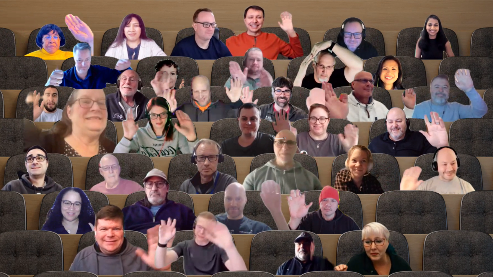

## Call summary

Welcome to the weekly call focused on capabilities of the Microsoft 365 platform.  In this call, we highlight recently announced and key existing developer resources, news, community events and three demos. 

### New this week

* Announcements
    * Samples – [Microsoft 365 Unified Sample Solution Gallery](https://adoption.microsoft.com/sample-solution-gallery) - aka.ms/m365/samples now with more than 1485 samples from Microsoft and community.
    * Agenda set for next [Microsoft 365 platform call](https://aka.ms/m365-dev-call) - Tuesday, February 14th, 8:00 am PT.
        * Latest news from Microsoft engineering on Microsoft 365 topics
        * Demo - **Dan Wahlin** – Create an Azure Communication Services Resource, Microsoft Graph, and Microsoft Teams
        * Demo - **Sébastien Levert** & **Gavin Barron** – What's next for the Microsoft Graph Toolkit!
    * Help shape the Microsoft Community Advisory Board priorities for the next six months by completing survey - Microsoft Community Insights - January 2023 \| aka.ms/CommunityInsightsJan23
* News
    * Article – [Learn how to develop apps for Microsoft Teams using Teams Toolkit in Visual Studio Code](https://devblogs.microsoft.com/microsoft365dev/learn-how-to-develop-apps-for-microsoft-teams-using-teams-toolkit-in-visual-studio-code/) - [Rabia Williams](https://twitter.com/williamsrabia) (Microsoft) \| @williamsrabia
    * Article – [Do more with less in Microsoft 365 using SharePoint Framework (SPFx)](https://devblogs.microsoft.com/microsoft365dev/do-more-with-less-in-microsoft-365-by-using-spfx/) – [Vesa Juvonen](https://twitter.com/vesajuvonen) (Microsoft) \| @vesajuvonen
    * Article – [From zero to hero: Build a meetings app with Azure Communication Services and Microsoft Teams - Part 1](https://devblogs.microsoft.com/microsoft365dev/build-a-meetings-app-with-azure-communication-services-and-microsoft-teams-part-1/) – [Dan Wahlin](https://twitter.com/DanWahlin) (Microsoft \| @DanWahlin & [Ayça Baş](https://twitter.com/aycabs) (Microsoft) \| @aycabs
    * Article – [Four habits from the Microsoft Teams team to boost productivity](https://techcommunity.microsoft.com/t5/microsoft-teams-blog/four-habits-from-the-microsoft-teams-team-to-boost-productivity/ba-p/3732181) – Jennie Cady (Microsoft)
    * Article – [Delivering new webinar experiences with Microsoft Teams](https://techcommunity.microsoft.com/t5/microsoft-teams-blog/delivering-new-webinar-experiences-with-microsoft-teams/ba-p/3725145) - Amber Waisanen (Microsoft)
    * Article – [What’s New in Viva Sales – January 2023](https://techcommunity.microsoft.com/t5/microsoft-viva-blog/what-s-new-in-viva-sales-january-2023/ba-p/3726801) - David Shin (Microsoft)
    * Article – [Viva Sales customization is here!](https://techcommunity.microsoft.com/t5/microsoft-viva-blog/viva-sales-customization-is-here/ba-p/3726837) - Eran Manor (Microsoft)
    * Article – [“Templates, templates, templates” 🎙 – The Intrazone podcast](https://techcommunity.microsoft.com/t5/microsoft-sharepoint-blog/templates-templates-templates-the-intrazone-podcast/ba-p/3734404) – [Cathy Dew](https://twitter.com/catpaint1) (Microsoft) \| @catpaint1, [Peter Larsen](https://twitter.com/PointworkPeter) (Pointwork) \| @PointworkPeter, and [Lars Kristensen](https://twitter.com/Hejnzzz) (Pointwork) \| @Hejnzzz
    * Article – [Create a list across Microsoft 365](https://techcommunity.microsoft.com/t5/microsoft-sharepoint-blog/create-a-list-across-microsoft-365/ba-p/3730138) - [Mark Kashman](https://twitter.com/mkashman) (Microsoft) \| @mkashman
* Teams Platform updates
    * Targeted in-meeting notification
        * Documentation - [Targeted in-meeting notification](https://learn.microsoft.com/microsoftteams/platform/apps-in-teams-meetings/in-meeting-notification-for-meeting?tabs=desktop#targeted-in-meeting-notification)
        * Sample – [meetings-notification](https://github.com/OfficeDev/Microsoft-Teams-Samples/tree/main/samples/meetings-notification)
* Conversations
    * Microsoft 365 Developer Podcast – Graph Developer Proxy with [Waldek Mastykarz](https://twitter.com/waldekm) and [Sebastien Levert](https://twitter.com/sebastienlevert) (February 5th) \| [podcast](https://m365devpodcast.com/e/graph-developer-proxy-with-waldek-mastykarz-and-sebastien-levert/)
    * Microsoft 365 PnP Weekly – Episode 196 (February 6th) with Austria-based Microsoft AI & M365 Development MVP and Technical Project Lead at Solvion - [Stephan Bisser](https://twitter.com/stephanbisser) \| @stephanbisser \| [video](https://pnp.github.io/blog/microsoft-365-pnp-weekly/episode-196/) \| [podcast](https://www.podbean.com/eas/pb-3nrjj-1383b9a)

### Demos

* **Getting Started with Azure Communication Services, Microsoft Graph, and Microsoft Teams** – kicking off a 6-session series (aligned to a 6-chapter tutorial) focused on Integrating services across the Microsoft Cloud to enhance user collaboration and specifically adding audio/video capabilities into your custom apps. Series overview, technologies used in series - React (front-end), Azure Communication Services, Azure functions, Microsoft Graph, Azure AD and Microsoft Teams (Microsoft 365 products). Quick live demo (run locally) and architectural representation of functionality.
* **Turn text to images in Microsoft Teams using OpenAI DALL-E 2 and Teams Toolkit for Visual Studio Code** – build a personal app (DALL-E 2 Image Generator) with a workflow bot that returns images based on text entries. Toolkit orchestrates creation of welcome message, activity and message handlers, dialog menus, Adaptive Cards, conversation states, querying OpenAI service for images, task modules, publishing to organization’s App Catalog and Azure integration - authentication, provisioning Azure storage, etc. Demo functionality, code walkthrough and sample available.
* **Power Pages Data workspace is now solution aware** – overview of Power Pages and 4 Design Studio workspaces. This demo is focused on the now solution aware Data workspace in which Makers create/modify tables, forms and views stored in Dataverse. Now when one creates a table, table column, etc., it is aligned to the solution name (prefix) that’s automatically appended to table, etc. names. Simplifies moving site from Dev to Prod following [(ALM)](https://learn.microsoft.com/power-platform/alm/) best practices.

The host of this call was [Vesa Juvonen](http://twitter.com/vesajuvonen) (Microsoft) \| @vesajuvonen. Q&A takes place in chat throughout the call.



## Agenda items

[00:00](https://youtu.be/xDXS9muZ0DI?t=0) – Intro

[08:46](https://youtu.be/xDXS9muZ0DI?t=526) – Latest updates and news on the Microsoft 365 platform – [Vesa Juvonen](http://twitter.com/vesajuvonen) (Microsoft) \| @vesajuvonen

[09:56](https://youtu.be/xDXS9muZ0DI?t=596) – Microsoft Teams Platform updates – Surbhi Gupta (Microsoft)

[10:49](https://youtu.be/xDXS9muZ0DI?t=649)<https://youtu.be/fHy1K0MRUiY?t=608> – Together mode picture

[11:58](https://youtu.be/xDXS9muZ0DI?t=718) – Demo – Getting Started with Azure Communication Services, Microsoft Graph, and Microsoft Teams – [Dan Wahlin](https://twitter.com/DanWahlin) (Microsoft) \| @DanWahlin

[26:35](https://youtu.be/xDXS9muZ0DI?t=1595) – Demo – Turn text to images in Microsoft Teams using OpenAI DALL-E 2 and Teams Toolkit for Visual Studio Code – [Garry Trinder](https://twitter.com/garrytrinder) (Microsoft) \| @garrytrinder

[43:52](https://youtu.be/xDXS9muZ0DI?t=2632) – Demo – Power Pages Data workspace is now solution aware – [Pranita Padalwar](https://linkedin.com/in/pranita225) (Microsoft)

[52:56](https://youtu.be/xDXS9muZ0DI?t=3176) – Closing

Thank you for your creativity and work execution. Samples are often showcased in Demos.

## Together Mode

Awesome to see you on the call today. There are new faces and many familiar faces. Good to have the versatility in the room. See you again soon.

## Actions

* Help shape the Microsoft Community Advisory Board priorities for the next six months by completing survey - Microsoft Community Insights - January 2023 \| aka.ms/CommunityInsightsJan23
* Opt into PnP Recognition Program – aka.ms/m365pnp-recognition
* Register for upcoming [Sharing Is Caring](https://pnp.github.io/sharing-is-caring/) events:
    * Maturity Model Practitioners \| Tuesday, February 21st, 7am PST – [Download reoccurring invite](https://aka.ms/mm4m365/invite)
    * Power Platform Samples Contributor \| Thursday, February 23rd, 9:00am PT \| 12:00pm ET - [Register](https://forms.office.com/pages/responsepage.aspx?id=KtIy2vgLW0SOgZbwvQuRaXDXyCl9DkBHq4A2OG7uLpdUN0hMNTRPWVVWTkhFTk9QQzhFSTRIS1JLSC4u)
    * PnP Office Hours – 1:1 session \| [Register](https://outlook.office365.com/owa/calendar/PnPSharingisCaring@warner.digital/bookings/)
    * PnP Buddy System \| [Request a Buddy](https://forms.office.com/Pages/ResponsePage.aspx?id=KtIy2vgLW0SOgZbwvQuRaXDXyCl9DkBHq4A2OG7uLpdUMjRRUVg4NElZUUJLTEY1TVVSVDJFRFpLRS4u)
* Register for the [Microsoft 365 Developer Program](https://aka.ms/m365/devprogram) and get a free developer tenant
* Get started with [free training modules](https://aka.ms/m365/dev/learn) covering Microsoft 365 platform capabilities.
* Visit the [Microsoft 365 Unified Sample Solution Gallery](https://adoption.microsoft.com/sample-solution-gallery) with more than 1400 samples from Microsoft and community.
* Request a Demo spot on the call – aka.ms/m365pnp/request/demo
* Download the recurrent invite for this call – aka.ms/m365-dev-call

## Demo references

* **Getting Started with Azure Communication Services, Microsoft Graph, and Microsoft Teams**
    * App Camp - [Microsoft Cloud Integration Scenarios](https://microsoft.github.io/MicrosoftCloud/?WT.mc_id=m365-80533-dwahlin) \| aka.ms/microsoft-cloud
    * Tutorial - [Audio/Video Calling from a Custom App into a Teams Meeting](https://microsoft.github.io/MicrosoftCloud/tutorials/docs/ACS-to-Teams-Meeting/) \| aka.ms/mscloud-acs-teams-tutorial
    * Repo - [Microsoft Cloud Integrations (code samples, videos, documentation)](https://github.com/microsoft/microsoftcloud)
    * Demo - [Introduction to Azure Communication Services](https://youtu.be/fHy1K0MRUiY?t=2001) – [Tomas Chladek](https://twitter.com/tomaschladek2) (Microsoft) \| @tomaschladek2
* **Turn text to images in Microsoft Teams using OpenAI DALL-E 2 and Teams Toolkit for Visual Studio Code**
    * Website – [OpenAI](https://openai.com/)
    * Tools - [Microsoft Teams Toolkit](https://github.com/OfficeDev/TeamsFx) \| aka.ms/ttk
    * Repo - [DALL-E 2 Image Generator Bot for Microsoft Teams](https://github.com/garrytrinder/msteams-dalle-2-image-generator-bot)
    * Contributor – [Garry Trinder](https://github.com/garrytrinder)
* **Power Pages Data workspace is now solution aware**
    * Try it – [Power Pages](https://make.powerpages.microsoft.com/)
    * Documentation - [Microsoft Dataverse](https://learn.microsoft.com/connectors/commondataserviceforapps/)
    * Article - [Power Pages Data workspace is now solution aware](https://powerpages.microsoft.com/blog/power-pages-data-workspace-is-now-solution-aware/)

## General resources

* Archives - Microsoft 365 PnP Weekly - [Videos](https://www.youtube.com/playlist?list=PLR9nK3mnD-OVYI-St_CBiFfuL4CZbBpkC), [Podcasts](https://pnpweekly.podbean.com/)
* Microsoft Teams Toolkit | [https://aka.ms/teams-toolkit](https://aka.ms/teams-toolkit)
* Microsoft Graph Toolkit in Microsoft Learn | [https://aka.ms/learn-mgt](https://aka.ms/learn-mgt)
* Viva Connections [https://aka.ms/VivaConnections](https://aka.ms/VivaConnections)
* [SharePoint look book](https://lookbook.microsoft.com/?WT.mc_id=m365-24198-cxa)
* [Yo Teams video training package](https://aka.ms/yoteams-training)
* [.NET Standard 2.0 version of SharePoint Online CSOM API](https://developer.microsoft.com/microsoft-365/blogs/net-standard-version-of-sharepoint-online-csom-apis?WT.mc_id=m365-24198-cxa)
* [Microsoft 365 Platform Community (PnP) videos](https://aka.ms/m365/videos) | aka.ms/m365/videos
* [Microsoft Teams Toolkit for Visual Studio Code](https://marketplace.visualstudio.com/items?itemName=TeamsDevApp.ms-teams-vscode-extension)
* [yo Teams](https://aka.ms/yoteams) | aka.ms/yoteams
* [SPFx Developer documentation](https://aka.ms/spfx) | <https://aka.ms/spfx>
* [Microsoft 365 developer program site](https://developer.microsoft.com/office/dev-program?WT.mc_id=m365-24198-cxa) - Need to become a Tenant Admin to test look book capabilities? Get a Microsoft 365 E5 developer subscription - free tenant for 90 days with automatic renewal if used for dev purposes

## Upcoming Calls | Recurrent Invites

* Office add-in monthly call \| Wednesday, February 8, 8:00 am PT - <https://aka.ms/officeaddinscall> (monthly)
* Viva Connections & SharePoint Framework call \| Thursday, February 9, 7:00 am PT - <https://aka.ms/spdev-spfx-call> (bi-weekly)
* Microsoft 365 platform call \| Tuesday, February 14, 8:00 am PT – <https://aka.ms/m365-dev-call> (weekly)
* Power Platform monthly call \| Wednesday, February 15, 8:00 am PT - <https://aka.ms/PowerAppsMonthlyCall> (monthly)
* Microsoft 365 General Dev call \| Thursday, February 16, 7:00 am PT - <https://aka.ms/m365-dev-sig> (bi-weekly)
* Microsoft Identity Platform call \| Thursday, February 16, 9:00 am PT - <https://aka.ms/IDDevCommunityCalendar> (monthly)

Microsoft 365 Platform community call focuses on latest Microsoft 365 Platform updates and demos delivered by Microsoft presenters and takes place weekly on Tuesday.  The alternating Special Interest Group community calls each Thursday focus on SharePoint Framework (client-side development/implementation) and Microsoft 365 Platform (includes Microsoft Teams, Bots, Microsoft Graph, CSOM, REST, site provisioning, PnP PowerShell, PnP Sites Core, Site Designs, Power Automate, PowerApps, Column Formatting, list formatting, etc. topics.) with demos commonly delivered by community members.

More details on the Microsoft 365 community from [https://aka.ms/m365pnp](https://aka.ms/sppnp).

You can download recurrent invite for this call from [https://aka.ms/m365-dev-call](https://aka.ms/m365-dev-call).  Welcome and join in the discussion. If you have any questions, comments, or feedback, feel free to provide your input as comments to this post as well. More details on the Microsoft 365 community and options to get involved are available from [https://aka.ms/m365pnp](https://aka.ms/sppnp).

&quot;_Sharing is caring&quot;_

_Microsoft 365 Platform Community team, Microsoft - 7th of February 2023_


