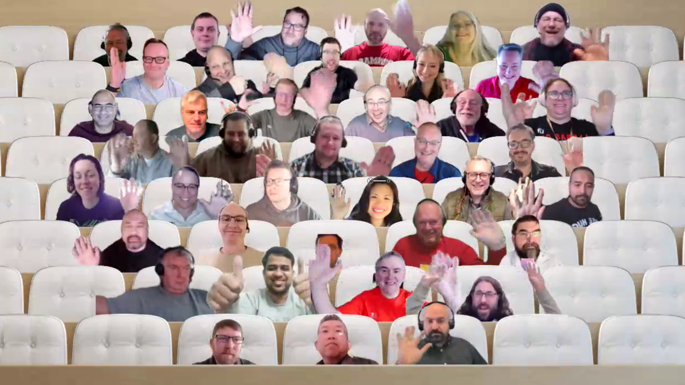

## Call summary

Welcome to the weekly call focused on capabilities of the Microsoft 365 platform.  In this call, we highlight recently announced and key existing developer resources, news, community events and two demos. 

### New this week

* Announcements
    * Samples – [Microsoft 365 Unified Sample Solution Gallery](https://adoption.microsoft.com/sample-solution-gallery) - aka.ms/m365/samples now with more than 1485 samples from Microsoft and community.
    * Agenda set for next [Microsoft 365 platform call](https://aka.ms/m365-dev-call) - Tuesday, February 21st, 8:00 am PT.
        * Latest news from Microsoft engineering on Microsoft 365 topics
        * Demo - **Dan Wahlin** – Integrate Azure Communication Services Calling into a React App
        * Demo - **Garry Trinder** – Teams Toolkit Learn Path – Get started building apps for Microsoft Teams using Teams Toolkit for Visual Studio Code
    * Article – [Write simpler code with the new Microsoft Graph .NET SDK v5](https://devblogs.microsoft.com/microsoft365dev/write-simpler-code-with-the-new-microsoft-graph-net-sdk-v5/) – [Maisa Rissi](https://twitter.com/maisarissi_msft) (Microsoft) \| @maisarissi_msft
    * Article – [From zero to hero: Build a meetings app with Azure Communication Services and Microsoft Teams – Part 2](https://devblogs.microsoft.com/microsoft365dev/from-zero-to-hero-build-a-meetings-app-with-azure-communication-services-and-microsoft-teams-part-2/) – [Dan Wahlin](https://twitter.com/DanWahlin) (Microsoft) \| @DanWahlin & [Ayça Baş](https://twitter.com/aycabs) (Microsoft) \| @aycabs
    * Article – [New Leadership, Analytics, and Knowledge Experiences for Viva Engage are now rolling out](https://techcommunity.microsoft.com/t5/microsoft-viva-blog/new-leadership-analytics-and-knowledge-experiences-for-viva/ba-p/3738818) - [Michael Holste](https://twitter.com/mike_holste) (Microsoft) \| @Mike_Holste
    * Article – [New experiences for Viva Connections are now rolling out](https://techcommunity.microsoft.com/t5/microsoft-viva-blog/new-experiences-for-viva-connections-are-now-rolling-out/ba-p/3729071) - Scott Smith (Microsoft)
    * Article – [“Viva Engage has the answer” 🎙 – The Intrazone podcast](https://techcommunity.microsoft.com/t5/microsoft-sharepoint-blog/viva-engage-has-the-answer-the-intrazone-podcast/ba-p/3739563) - [Mark Kashman](https://twitter.com/mkashman) (Microsoft) \| @mkashman
    * Article – [Building beautiful sites with purpose: Part 1](https://techcommunity.microsoft.com/t5/microsoft-sharepoint-blog/building-beautiful-sites-with-purpose-part-1/ba-p/3735360) – [Cathy Dew](https://twitter.com/catpaint1) (Microsoft) \| @catpaint1
    * Article – [“Templates, templates, templates” 🎙 – The Intrazone podcast](https://techcommunity.microsoft.com/t5/microsoft-sharepoint-blog/templates-templates-templates-the-intrazone-podcast/ba-p/3734404) – [Cathy Dew](https://twitter.com/catpaint1) (Microsoft) \| @catpaint1, [Peter Larsen](https://twitter.com/PointworkPeter) (Pointwork) \| @PointworkPeter, and [Lars Kristensen](https://twitter.com/Hejnzzz) (Pointwork) \| @Hejnzzz
* Conversations
    * Microsoft 365 Developer Podcast – Partner showcase: ShareGate with Louis Beaudoin-Allaire (February 13th) \| [podcast](https://m365devpodcast.com/e/partner-showcase-sharegate-with-louis-beaudoin-alliare/)
    * Microsoft 365 PnP Weekly – Episode 197 (February 13th) with Belgium-based Senior Software Engineer on the ODSP team at Microsoft - [Bert Jansen](https://twitter.com/O365Bert) (Microsoft) \| @O365Bert \| [video](https://pnp.github.io/blog/microsoft-365-pnp-weekly/episode-197/) \| [podcast](https://www.podbean.com/eas/pb-jpx9m-138e49f)

### Demos

* **Create an Azure Communication Services Resource** – part 2 in series. Create an ACS resource, then select CallComposute template (from ACS UI Library) to Join Existing (Teams) Call. Set up Teams call, paste meeting link into template. In Azure, generate a User Access token and Identity and paste into template. Start call – make camera and sound selections. Try this no code (controls abstract the API surface) solution. Next week – custom React apps.
* **What's next for the Microsoft Graph Toolkit!** – a show and tell session - what’s new for v3.0? Refreshed components with Fluent UI, multi-account support, generic picker control, disambiguation built-in, support for Graph JS SDK v3.0, support for sovereign clouds, support for node 14-16. Then what? Conversation component in collaboration with the ACS UI Library - scope is 1:1 and 1:m conversations. Finally, MGT v3.1 and beyond – enhanced File List experience and Search Component.

The host of this call was [Vesa Juvonen](http://twitter.com/vesajuvonen) (Microsoft) \| @vesajuvonen. Q&A takes place in chat throughout the call.



## Agenda items

[00:00](https://youtu.be/NC1bGG_gUPE?t=0) – Intro

[09:56](https://youtu.be/NC1bGG_gUPE?t=596) – Latest updates and news on the Microsoft 365 platform – [Vesa Juvonen](http://twitter.com/vesajuvonen) (Microsoft) \| @vesajuvonen

[11:39](https://youtu.be/NC1bGG_gUPE?t=699) – Together mode picture

[12:46](https://youtu.be/NC1bGG_gUPE?t=766) – Demo – Create an Azure Communication Services Resource – [Dan Wahlin](https://twitter.com/DanWahlin) (Microsoft) \| @DanWahlin

[32:59](https://youtu.be/NC1bGG_gUPE?t=1979) – Demo – What's next for the Microsoft Graph Toolkit! – [Sébastien Levert](https://twitter.com/sebastienlevert) \| @sebastienlevert (Microsoft) & [Gavin Barron](https://twitter.com/gavinbarron) (Microsoft) \| @gavinbarron

[55:12](https://youtu.be/NC1bGG_gUPE?t=3312) – Closing

Thank you for your creativity and work execution. Samples are often showcased in Demos.

## Together Mode

Thank you for joining today. Really cool to see your faces and hopefully we will meet at an in-person conference later this year.

## Actions

* [Register](http://www.communitydays.org) for an Upcoming Event around Microsoft 365 and Power Platform.
* Help shape the Microsoft Community Advisory Board priorities for the next six months by completing survey - Microsoft Community Insights - January 2023 \| aka.ms/CommunityInsightsJan23
* Opt into PnP Recognition Program – aka.ms/m365pnp-recognition
* Register for upcoming [Sharing Is Caring](https://pnp.github.io/sharing-is-caring/) events:
    * Maturity Model Practitioners \| Tuesday, February 21st, 7am PST – [Download reoccurring invite](https://aka.ms/mm4m365/invite)
    * Power Platform Samples Contributor \| Thursday, February 23rd, 9:00am PT \| 12:00pm ET - [Register](https://forms.office.com/pages/responsepage.aspx?id=KtIy2vgLW0SOgZbwvQuRaXDXyCl9DkBHq4A2OG7uLpdUN0hMNTRPWVVWTkhFTk9QQzhFSTRIS1JLSC4u)
    * PnP Office Hours – 1:1 session \| [Register](https://outlook.office365.com/owa/calendar/PnPSharingisCaring@warner.digital/bookings/)
    * PnP Buddy System \| [Request a Buddy](https://forms.office.com/Pages/ResponsePage.aspx?id=KtIy2vgLW0SOgZbwvQuRaXDXyCl9DkBHq4A2OG7uLpdUMjRRUVg4NElZUUJLTEY1TVVSVDJFRFpLRS4u)
* Register for the [Microsoft 365 Developer Program](https://aka.ms/m365/devprogram) and get a free developer tenant
* Get started with [free training modules](https://aka.ms/m365/dev/learn) covering Microsoft 365 platform capabilities.
* Visit the [Microsoft 365 Unified Sample Solution Gallery](https://adoption.microsoft.com/sample-solution-gallery) with more than 1400 samples from Microsoft and community.
* Request a Demo spot on the call – aka.ms/m365pnp/request/demo
* Download the recurrent invite for this call – aka.ms/m365-dev-call

## Demo references

* **Create an Azure Communication Services Resource**
    * Documentation - [What is Azure Communication Services?](https://learn.microsoft.com/azure/communication-services/overview)
    * Tutorial - [Audio/Video Calling from a Custom App into a Teams Meeting](https://microsoft.github.io/MicrosoftCloud/tutorials/docs/ACS-to-Teams-Meeting/) \| aka.ms/mscloud-acs-teams-tutorial
    * Tools – [Azure Communication Services UI Library](https://azure.github.io/communication-ui-library/) \| aka.ms/acs-ui-library
    * Repo - [Microsoft Cloud Integrations (code samples, videos, documentation)](https://github.com/microsoft/microsoftcloud)
    * App Camp - [Microsoft Cloud Integration Scenarios](https://microsoft.github.io/MicrosoftCloud/?WT.mc_id=m365-80533-dwahlin) \| aka.ms/microsoft-cloud
    * Demo \#1 – [Getting Started with Azure Communication Services, Microsoft Graph, and Microsoft Teams](https://youtu.be/xDXS9muZ0DI?t=718) – [Dan Wahlin](https://twitter.com/DanWahlin) (Microsoft) \| @DanWahlin
* **What's next for the Microsoft Graph Toolkit!**
    * Tools - [Microsoft Graph Toolkit](https://github.com/microsoftgraph/microsoft-graph-toolkit) \| aka.ms/mgt
    * Playground - [Microsoft Graph Toolkit: UI Components and Authentication Providers for Microsoft Graph – next-v3.0](https://mgt.dev/next/v3/?path=/story/overview--page)

## General resources

* Archives - Microsoft 365 PnP Weekly - [Videos](https://www.youtube.com/playlist?list=PLR9nK3mnD-OVYI-St_CBiFfuL4CZbBpkC), [Podcasts](https://pnpweekly.podbean.com/)
* Microsoft Teams Toolkit | [https://aka.ms/teams-toolkit](https://aka.ms/teams-toolkit)
* Microsoft Graph Toolkit in Microsoft Learn | [https://aka.ms/learn-mgt](https://aka.ms/learn-mgt)
* Viva Connections [https://aka.ms/VivaConnections](https://aka.ms/VivaConnections)
* [SharePoint look book](https://lookbook.microsoft.com/?WT.mc_id=m365-24198-cxa)
* [Yo Teams video training package](https://aka.ms/yoteams-training)
* [.NET Standard 2.0 version of SharePoint Online CSOM API](https://developer.microsoft.com/microsoft-365/blogs/net-standard-version-of-sharepoint-online-csom-apis?WT.mc_id=m365-24198-cxa)
* [Microsoft 365 Platform Community (PnP) videos](https://aka.ms/m365/videos) | aka.ms/m365/videos
* [Microsoft Teams Toolkit for Visual Studio Code](https://marketplace.visualstudio.com/items?itemName=TeamsDevApp.ms-teams-vscode-extension)
* [yo Teams](https://aka.ms/yoteams) | aka.ms/yoteams
* [SPFx Developer documentation](https://aka.ms/spfx) | <https://aka.ms/spfx>
* [Microsoft 365 developer program site](https://developer.microsoft.com/office/dev-program?WT.mc_id=m365-24198-cxa) - Need to become a Tenant Admin to test look book capabilities? Get a Microsoft 365 E5 developer subscription - free tenant for 90 days with automatic renewal if used for dev purposes

## Upcoming Calls | Recurrent Invites

* Power Platform monthly call \| Wednesday, February 15, 8:00 am PT - <https://aka.ms/PowerAppsMonthlyCall> (monthly)
* Microsoft 365 General Dev call \| Thursday, February 16, 7:00 am PT - <https://aka.ms/m365-dev-sig> (bi-weekly)
* Microsoft Identity Platform call \| Thursday, February 16, 9:00 am PT - <https://aka.ms/IDDevCommunityCalendar> (monthly)
* Microsoft 365 platform call \| Tuesday, February 21, 8:00 am PT – <https://aka.ms/m365-dev-call> (weekly)
* Viva Connections & SharePoint Framework call \| Thursday, February 23, 7:00 am PT - <https://aka.ms/spdev-spfx-call> (bi-weekly)
* Office add-in monthly call \| Wednesday, March 8, 8:00 am PT - <https://aka.ms/officeaddinscall> (monthly)

Microsoft 365 Platform community call focuses on latest Microsoft 365 Platform updates and demos delivered by Microsoft presenters and takes place weekly on Tuesday.  The alternating Special Interest Group community calls each Thursday focus on SharePoint Framework (client-side development/implementation) and Microsoft 365 Platform (includes Microsoft Teams, Bots, Microsoft Graph, CSOM, REST, site provisioning, PnP PowerShell, PnP Sites Core, Site Designs, Power Automate, PowerApps, Column Formatting, list formatting, etc. topics.) with demos commonly delivered by community members.

More details on the Microsoft 365 community from [https://aka.ms/m365pnp](https://aka.ms/sppnp).

You can download recurrent invite for this call from [https://aka.ms/m365-dev-call](https://aka.ms/m365-dev-call).  Welcome and join in the discussion. If you have any questions, comments, or feedback, feel free to provide your input as comments to this post as well. More details on the Microsoft 365 community and options to get involved are available from [https://aka.ms/m365pnp](https://aka.ms/sppnp).

&quot;_Sharing is caring&quot;_

_Microsoft 365 Platform Community team, Microsoft - 14th of February 2023_


