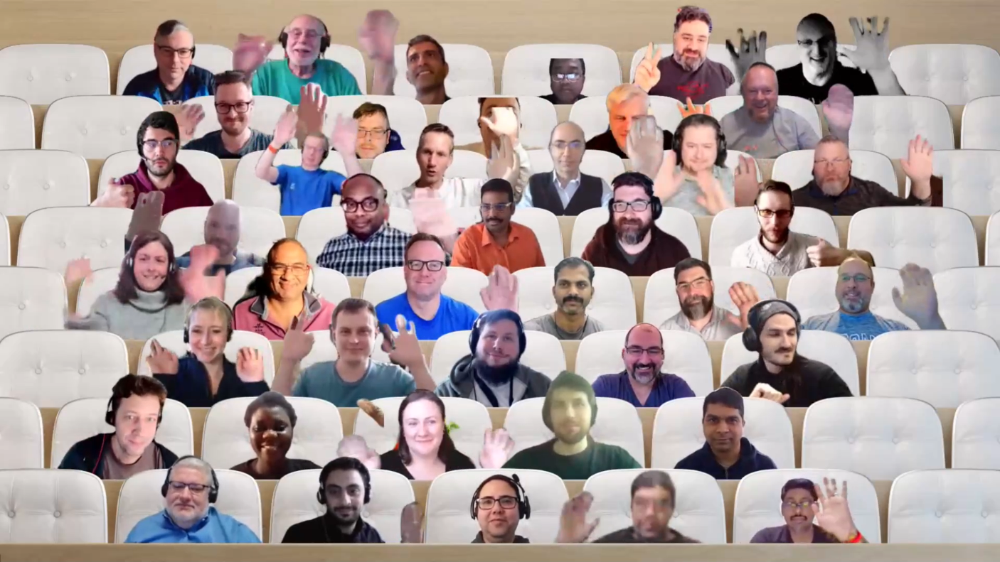

## Call summary

Welcome to the weekly call focused on capabilities of the Microsoft 365 and Power Platform.  In this call, we highlight recently announced and key existing developer resources, news, community events and two demos. 

### New this week

* Announcements
    * **March 15th is the last day** to submit a Hack for Microsoft Graph and .NET – March Hack Together - aka.ms/hack-together - [Register](https://forms.office.com/Pages/ResponsePage.aspx?id=v4j5cvGGr0GRqy180BHbR0ktYAUCTtVIvJkJdFsfkalUMlM0SVBXRjIyTEFJQVFYOUMzTDE2SEY1WS4u)
    * Agenda set for next [Microsoft 365 & Power Platform weekly call](https://aka.ms/m365-dev-call) - Tuesday, March 21st, 8:00 am PT.
        * Latest news from Microsoft engineering on Microsoft 365 topics
        * Demo - **Tomas Chladek** – Additional Azure Communication Services Features for your solutions
        * Demo -**Gary Pretty** – Power Virtual Agents – latest features and capabilities
        * Demo -**Garry Trinder** - Teams Toolkit Learn Path - Deploy a Microsoft Teams app to Azure using Teams Toolkit for Visual Studio Code
    * Article – [Hack Together: Microsoft Graph and .NET week 2 recap and final week overview](https://devblogs.microsoft.com/microsoft365dev/hack-together-microsoft-graph-and-net-week-2-recap-and-final-week-overview/) - [Ayça Baş](https://twitter.com/aycabs) (Microsoft) \| @aycabs
    * Article – [Announcing Microsoft Graph Toolkit v3.0 preview-1](https://devblogs.microsoft.com/microsoft365dev/microsoft-graph-toolkit-v3-0-preview-1/) - [Sébastien Levert](https://twitter.com/sebastienlevert) (Microsoft) \| @sebastienlevert
    * Article – [Microsoft Graph .NET SDK v5 is now generally available](https://devblogs.microsoft.com/microsoft365dev/microsoft-graph-net-sdk-v5-is-now-generally-available/) - [Maisa Rissi](https://twitter.com/maisarissi_msft) (Microsoft) \| @maisarissi_msft
    * Article – [Introducing Video Filters in Microsoft Teams Meetings](https://techcommunity.microsoft.com/t5/microsoft-teams-blog/introducing-video-filters-in-microsoft-teams-meetings/ba-p/3764187) - Alexis Johnston (Microsoft)
    * [Microsoft 365 Sample Solution Gallery](https://adoption.microsoft.com/sample-solution-gallery/) has 1520 samples now! aka.ms/m365/samples
* Shows and Events
    * Microsoft 365 Conference – May 2 – 4. 2023, Las Vegas – m365Con.com - [Register](https://m365conf.com/)
    * European Collaboration Summit 2023 – May 24 – 26, 2023 – Düsseldorf – collabsummit.eu – [Register](https://www.collabsummit.eu/)
    * ACT NOW – save €300 on tickets for the [European Power Platform Conference](https://www.sharepointeurope.com/european-power-platform-conference) – Dublin, 20-23 June
    * 365 EduCon - Use promo code “Community” to save 25% off any pass type.
        * [Washington DC](http://www.365educon.com/dc) – June 12-16, 2023
        * [Seattle](http://www.365educon.com/seattle) – August 21-25, 2023 & PWR EduCon
        * [Chicago](http://www.365educon.com/chicago) – October 30 – November 3, 2023
    * Upcoming [Community Days](https://communitydays.org/) Events - aka.ms/communitydays
* Conversations
    * Microsoft 365 PnP Weekly – Episode 201 (March 13tht) with US-based Microsoft MVP, Microsoft RD and CPO of PixelMill, Cloudspark, and Creospark - [Eric Overfield](https://twitter.com/EricOverfield) \| @EricOverfield \| [video](https://pnp.github.io/blog/microsoft-365-pnp-weekly/episode-201/) \| [podcast](https://www.podbean.com/eas/pb-6vf3z-13b6d1d)
    * Microsoft 365 Developer Podcast – Partner showcase: OnePlace Solutions with Cameron Dwyer (March 12th) \| [podcast](https://m365devpodcast.com/e/partner-showcase-oneplace-solutions-with-cameron-dwyer/)
    * Power Platform Connections - Power Platform Connections Ep 4 - Nathalie Leenders (March 9th) \| [video](https://www.youtube.com/watch?v=L4c3ZFpo8dY)

### Demos

* **Microsoft Graph Hackathon – Recap on the second week** – you have until end of day, March 15th to submit your app. This is all about using Microsoft Graph in .NET apps (web, console, desktop). Use the Microsoft Graph .NET SDK to accelerate your coding effort. You and/or your team (up to 4 persons total) are invited to participate, win prizes and a Credly badge. Hurry, happy coding and good luck!
* **Boost your conversations in Microsoft Teams with Chat GPT AI and Power Virtual Agents** – by creating responses in real time with GPT and without needing to author content in the bot. Control GPT experience by limiting the content accessed (corporate approved), by the Power Virtual Agent (PVT). Generated responses include short answer and links to supporting content. Capability included in the Public Preview delivers a new paradigm for how topics will be created and managed for conversational agents.
* **Deploying the Azure Communications Services Application to Azure** – many deployment options, in this demo we will use Azure Static Web Apps. Set up a GitHub Repo using the GitHub command line tool. Insert your ACS React app in Repo. Go to Azure Portal and create a Static Web App, point to your app in Repo. Pass in environment variables and click to deploy app and APIs. Part 6 – final in series.

The host of this call was [Vesa Juvonen](http://twitter.com/vesajuvonen) (Microsoft) \| @vesajuvonen. Q&A takes place in chat throughout the call.



## Agenda items

[00:00](https://youtu.be/0m2f8gP57u8?t=0) – Intro

[10:11](https://youtu.be/0m2f8gP57u8?t=611) – Latest updates – news across the Microsoft blogs – [Vesa Juvonen](http://twitter.com/vesajuvonen) (Microsoft) \| @vesajuvonen

[11:14](https://youtu.be/0m2f8gP57u8?t=674) – Together mode picture

[12:49](https://youtu.be/0m2f8gP57u8?t=769) – Recap – Microsoft Graph Hackathon – Recap on the second week - [Waldek Mastykarz](https://twitter.com/waldekm) (Microsoft) \| @waldekm

[15:14](https://youtu.be/0m2f8gP57u8?t=914) – Demo – Boost your conversations in Microsoft Teams with Chat GPT AI and Power Virtual Agents – [Dewain Robinson](https://twitter.com/Dewain76) (Microsoft) \| @Dewain76

[24:55](https://youtu.be/0m2f8gP57u8?t=1495) – Demo – Deploying the Azure Communications Services Application to Azure – [Dan Wahlin](https://twitter.com/DanWahlin) (Microsoft) \| @DanWahlin

[49:25](https://youtu.be/0m2f8gP57u8?t=2965) – Closing

Thank you for your creativity and work execution. Samples are often showcased in Demos.

## Together Mode

Thanks everyone for joining the call once again today. Hope to see you in some of the upcoming in-person events later this Spring.

## Actions

* [Request to Present a demo](https://aka.ms/community/request/demo) during Microsoft 365 & Power Platform community calls - aka.ms/community/request/demo
* [Register](http://www.communitydays.org) for an Upcoming Event around Microsoft 365 and Power Platform.
* Community call agendas are published each week at aka.ms/community/meetup
* Opt into PnP Recognition Program – aka.ms/m365pnp-recognition
* Register for upcoming [Sharing Is Caring](https://pnp.github.io/sharing-is-caring/) events:
    * Power Platform Samples Contributor \| Wednesday, March 15th, 10:00am PT \| 1:00pm ET - [Register](https://forms.office.com/pages/responsepage.aspx?id=KtIy2vgLW0SOgZbwvQuRaXDXyCl9DkBHq4A2OG7uLpdUN0hMNTRPWVVWTkhFTk9QQzhFSTRIS1JLSC4u)
    * Maturity Model Practitioners \| Tuesday, March 21st, 7am PST – [Download reoccurring invite](https://aka.ms/mm4m365/invite)
    * PnP Office Hours – 1:1 session \| [Register](https://outlook.office365.com/owa/calendar/PnPSharingisCaring@warner.digital/bookings/)
    * PnP Buddy System \| [Request a Buddy](https://forms.office.com/Pages/ResponsePage.aspx?id=KtIy2vgLW0SOgZbwvQuRaXDXyCl9DkBHq4A2OG7uLpdUMjRRUVg4NElZUUJLTEY1TVVSVDJFRFpLRS4u)
* Register for the [Microsoft 365 Developer Program](https://aka.ms/m365/devprogram) and get a free developer tenant
* Get started with [free training modules](https://aka.ms/m365/dev/learn) covering Microsoft 365 platform capabilities.
* Visit the [Microsoft 365 Unified Sample Solution Gallery](https://adoption.microsoft.com/sample-solution-gallery) with more than 1400 samples from Microsoft and community.
* Download the recurrent invite for this call – aka.ms/m365-dev-call

## Demo references

* **Microsoft Graph Hackathon – Recap of the first week**
    * Repo - [Hack Together: Microsoft Graph and .NET](https://github.com/microsoft/hack-together) \| aka.ms/hack-together
    * Credly - [MS Graph - Hack Together - Microsoft 365 & Power Platform Community 2023](https://www.credly.com/org/m365pnp/badge/ms-graph-hack-together-microsoft-365-power-platform)
    * Register - [Hack Together: Microsoft Graph and .NET](https://forms.office.com/Pages/ResponsePage.aspx?id=v4j5cvGGr0GRqy180BHbR0ktYAUCTtVIvJkJdFsfkalUMlM0SVBXRjIyTEFJQVFYOUMzTDE2SEY1WS4u)
    * Article – [Hack Together: Microsoft Graph and .NET week 2 recap and final week overview](https://devblogs.microsoft.com/microsoft365dev/hack-together-microsoft-graph-and-net-week-2-recap-and-final-week-overview/) - [Ayça Baş](https://twitter.com/aycabs) (Microsoft) \| @aycabs
    * Article – [Hack Together: Microsoft Graph and .NET week 1 recap and what’s coming](https://devblogs.microsoft.com/microsoft365dev/hack-together-microsoft-graph-and-dotnet-week-1-recap/) - [Waldek Mastykarz](https://twitter.com/waldekm) (Microsoft) \| @waldekm
* **Boost your conversations in Microsoft Teams with Chat GPT AI and Power Virtual Agents**
    * Documentation - [AI-based boosted conversations overview (preview)](https://learn.microsoft.com/power-virtual-agents/nlu-gpt-overview)
    * Website - [Empower everyone to easily create conversational bots.](https://powervirtualagents.microsoft.com/) \| aka.ms/trypva
    * Video training - [Boost Conversations using GPT with Power Virtual Agents](https://www.youtube.com/watch?v=b29v49l2Am8)
    * Article - [Now in Public Preview: Power Virtual Agents’ new advanced authoring canvas](https://powervirtualagents.microsoft.com/blog/now-in-public-preview-power-virtual-agents-new-advanced-authoring-canvas/)
* **Deploying the Azure Communications Services Application to Azure**
    * GitHub CLI – [Take GitHub to the command line](https://cli.github.com/)
    * Repo - [Microsoft Cloud Integration Scenarios](https://microsoft.github.io/MicrosoftCloud/?WT.mc_id=m365-80533-dwahlin) \| aka.ms/microsoft-cloud
    * Tutorial - [Audio/Video Calling from a Custom App into a Teams Meeting](https://microsoft.github.io/MicrosoftCloud/tutorials/docs/ACS-to-Teams-Meeting/) \| aka.ms/mscloud-acs-teams-tutorial
    * Repo - [Microsoft Cloud Integrations (code samples, videos, documentation)](https://github.com/microsoft/microsoftcloud)
    * Tools – [Azure Communication Services UI Library](https://azure.github.io/communication-ui-library/) \| aka.ms/acs-ui-library
    * Tool – [Graph Explorer](https://developer.microsoft.com/graph/graph-explorer) \| aka.ms/ge
    * Training - [Azure Static Web Apps](https://learn.microsoft.com/training/paths/azure-static-web-apps/?WT.mc_id=m365-00000-dwahlin) \| aka.ms/swa-training
    * Documentation - [What is Azure Communication Services?](https://learn.microsoft.com/azure/communication-services/overview)
    * Previous demos in this series:
        * Demo 5 - [Dynamically Create an Azure Communication Services Identity and Token](https://youtu.be/ZkD768EM-J4?t=993) - [Ayça Baş](https://twitter.com/aycabs) (Microsoft) \| @aycabs - (3/7)
        * Demo 4 – [Dynamically Create a Microsoft Teams Meeting using Microsoft Graph](https://youtu.be/77u73mD9MKE?t=1711) - [Ayça Baş](https://twitter.com/aycabs) (Microsoft) \| @aycabs - (2/28)
        * Demo 3 – [Integrate Azure Communication Services Calling into a React App](https://youtu.be/yIm_rsKt4kE?t=844) - [Dan Wahlin](https://twitter.com/DanWahlin) (Microsoft) \| @DanWahlin – (2/21)
        * Demo 2 – [Create an Azure Communication Services Resource](https://www.youtube.com/watch?v=NC1bGG_gUPE&t=766) – [Dan Wahlin](https://twitter.com/DanWahlin) (Microsoft) \| @DanWahlin (2/14)
        * Demo 1 – [Getting Started with Azure Communication Services, Microsoft Graph, and Microsoft Teams](https://www.youtube.com/watch?v=xDXS9muZ0DI&t=718) – [Dan Wahlin](https://twitter.com/DanWahlin) (Microsoft) \| @DanWahlin (2/7)
        * Demo 0 – [Introduction to Azure Communication Services](https://www.youtube.com/watch?v=fHy1K0MRUiY&t=2001) – [Tomas Chladek](https://twitter.com/tomaschladek2) (Microsoft) \| @tomaschladek2 (1/31)

## General resources

* Archives - Microsoft 365 PnP Weekly - [Videos](https://www.youtube.com/playlist?list=PLR9nK3mnD-OVYI-St_CBiFfuL4CZbBpkC), [Podcasts](https://pnpweekly.podbean.com/)
* Microsoft Teams Toolkit | [https://aka.ms/teams-toolkit](https://aka.ms/teams-toolkit)
* Microsoft Graph Toolkit in Microsoft Learn | [https://aka.ms/learn-mgt](https://aka.ms/learn-mgt)
* Viva Connections [https://aka.ms/VivaConnections](https://aka.ms/VivaConnections)
* [SharePoint look book](https://lookbook.microsoft.com/?WT.mc_id=m365-24198-cxa)
* [Yo Teams video training package](https://aka.ms/yoteams-training)
* [.NET Standard 2.0 version of SharePoint Online CSOM API](https://developer.microsoft.com/microsoft-365/blogs/net-standard-version-of-sharepoint-online-csom-apis?WT.mc_id=m365-24198-cxa)
* [Microsoft 365 Platform Community (PnP) videos](https://aka.ms/m365/videos) | aka.ms/m365/videos
* [Microsoft Teams Toolkit for Visual Studio Code](https://marketplace.visualstudio.com/items?itemName=TeamsDevApp.ms-teams-vscode-extension)
* [yo Teams](https://aka.ms/yoteams) | aka.ms/yoteams
* [SPFx Developer documentation](https://aka.ms/spfx) | <https://aka.ms/spfx>
* [Microsoft 365 developer program site](https://developer.microsoft.com/office/dev-program?WT.mc_id=m365-24198-cxa) - Need to become a Tenant Admin to test look book capabilities? Get a Microsoft 365 E5 developer subscription - free tenant for 90 days with automatic renewal if used for dev purposes

## Upcoming Calls | Recurrent Invites

* Power Platform monthly call \| Wednesday, March 15, 8:00 am PT - <https://aka.ms/PowerAppsMonthlyCall> (monthly)
* Microsoft 365 General Dev call \| Thursday, March 16, 7:00 am PT - <https://aka.ms/m365-dev-sig> (bi-weekly)
* Microsoft Identity Platform call \| Thursday, March 16, 9:00 am PT - <https://aka.ms/IDDevCommunityCalendar> (monthly)
* Microsoft 365 platform call \| Tuesday, March 21, 8:00 am PT – <https://aka.ms/m365-dev-call> (weekly)
* Viva Connections & SharePoint Framework call \| Thursday, March 23, 7:00 am PT - <https://aka.ms/spdev-spfx-call> (bi-weekly)
* Office add-in monthly call \| Wednesday, April 12, 8:00 am PT - <https://aka.ms/officeaddinscall> (monthly)

Microsoft 365 Platform community call focuses on latest Microsoft 365 Platform updates and demos delivered by Microsoft presenters and takes place weekly on Tuesday.  The alternating Special Interest Group community calls each Thursday focus on SharePoint Framework (client-side development/implementation) and Microsoft 365 Platform (includes Microsoft Teams, Bots, Microsoft Graph, CSOM, REST, site provisioning, PnP PowerShell, PnP Sites Core, Site Designs, Power Automate, PowerApps, Column Formatting, list formatting, etc. topics.) with demos commonly delivered by community members.

More details on the Microsoft 365 community from [https://aka.ms/m365pnp](https://aka.ms/sppnp).

You can download recurrent invite for this call from [https://aka.ms/m365-dev-call](https://aka.ms/m365-dev-call).  Welcome and join in the discussion. If you have any questions, comments, or feedback, feel free to provide your input as comments to this post as well. More details on the Microsoft 365 community and options to get involved are available from [https://aka.ms/m365pnp](https://aka.ms/sppnp).

&quot;_Sharing is caring&quot;_

_Microsoft 365 Platform Community team, Microsoft - 14th of March 2023_


