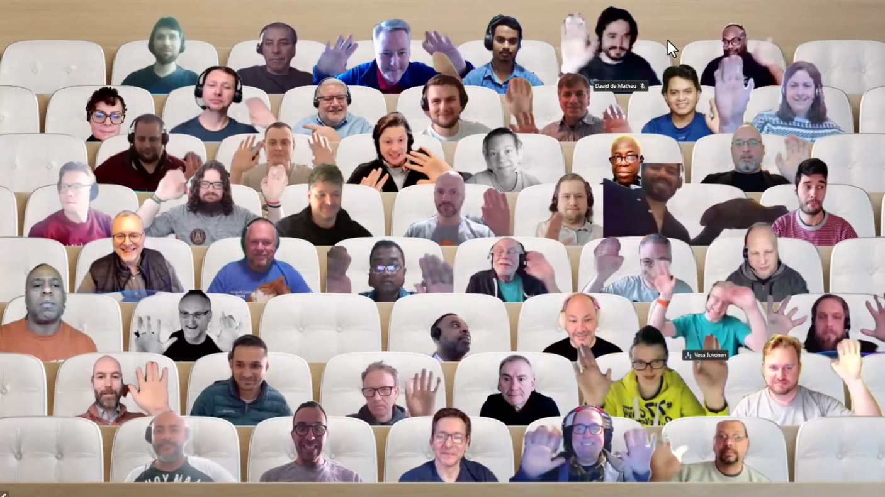

## Call summary

Welcome to the weekly call focused on capabilities of the Microsoft 365 and Power Platform.  In this call, we highlight recently announced and key existing developer resources, news, community events and three demos.

### New this week

* Announcements
    * Agenda set for next [Microsoft 365 & Power Platform weekly call](https://aka.ms/m365-dev-call) - Tuesday, March 28st, 8:00 am PT.
        * Latest news from Microsoft engineering on Microsoft 365 topics
        * **Luca Bandinelli, John Nguyen, Alex Terentiev** – SPFx v1.17 release - what's new and what's there
        * **Rabeb Othmani** – Kiota SDK generator is now available - What you need to know!
        * **Garry Trinder** - Deploy a Microsoft Teams app to Azure using Teams Toolkit for Visual Studio Code
    * Article – [Updated public preview of SharePoint Framework 1.17 – Preview on upcoming features](https://devblogs.microsoft.com/microsoft365dev/updated-public-preview-of-sharepoint-framework-1-17-preview-on-upcoming-features/) - [Vesa Juvonen](https://twitter.com/vesajuvonen) (Microsoft) \| @vesajuvonen
    * Article – [Tailored SDK experiences via Kiota now generally available](https://devblogs.microsoft.com/microsoft365dev/tailored-sdk-experiences-via-kiota-now-generally-available/) - [Rabeb Othmani](https://twitter.com/Rabeb_Othmani) (Microsoft) \| @Rabeb_Othmani & [Sébastien Levert](https://twitter.com/sebastienlevert) (Microsoft) \| @sebastienlevert
    * Article – [Microsoft Teams App Camp in a Box is now available](https://devblogs.microsoft.com/microsoft365dev/microsoft-teams-app-camp-in-a-box-is-now-available/) - [Bob German](https://twitter.com/Bob1German) (Microsoft) @Bob1German
    * Article – [Recent changes to data visibility for Microsoft Graph callRecords APIs](https://devblogs.microsoft.com/microsoft365dev/recent-changes-to-data-visibility-for-microsoft-graph-callrecords-apis/) - Microsoft
    * Article – [Viva Connections Toolkit for Visual Studio Code now in preview](https://devblogs.microsoft.com/microsoft365dev/preview-of-viva-connections-toolkit-for-vs-code/) - [Vesa Juvonen](https://twitter.com/vesajuvonen) (Microsoft) \| @vesajuvonen
    * Article – [Tips for using Teams chat to stay organized, engaged, and have fun](https://techcommunity.microsoft.com/t5/microsoft-teams-blog/tips-for-using-teams-chat-to-stay-organized-engaged-and-have-fun/ba-p/3766735) - Noga Ronen (Microsoft)
    * Article – [Announcing Copilot in Viva Engage](https://techcommunity.microsoft.com/t5/microsoft-viva-blog/announcing-copilot-in-viva-engage/ba-p/3771323) - Jason Mayans (Microsoft)
    * Article – “[Topics is Engaged” 🎙 – The Intrazone podcast](https://techcommunity.microsoft.com/t5/microsoft-sharepoint-blog/topics-is-engaged-the-intrazone-podcast/ba-p/3772368) - [Mark Kashman](https://twitter.com/mkashman) (Microsoft) \| @mkashman
    * Article – [What's new for SharePoint Server Subscription Edition - March 2023](https://techcommunity.microsoft.com/t5/microsoft-sharepoint-blog/what-s-new-for-sharepoint-server-subscription-edition-march-2023/ba-p/3768752) - [Bill Bär](https://twitter.com/williambaer) \| @williambaer
    * [Microsoft 365 Sample Solution Gallery](https://adoption.microsoft.com/sample-solution-gallery/) has 1527 samples now! aka.ms/m365/samples
* Teams Platform updates
    * Bots and message extensions are available in DOD
        * Documentation - [Build bots for Teams](https://learn.microsoft.com/microsoftteams/platform/bots/what-are-bots)
        * Documentation - [Message extensions](https://learn.microsoft.com/microsoftteams/platform/messaging-extensions/what-are-messaging-extensions?tabs=dotnet)
* Shows and Events
    * Build once, deploy efficiently, connect across Microsoft 365 – Virtual event. March 29, 2023, 9:00AM PST. [Register](https://aka.ms/BuildwithTeams)
    * Microsoft 365 Conference – May 2 – 4. 2023, Las Vegas – m365Con.com - [Register](https://m365conf.com/)
    * European Collaboration Summit 2023 – May 24 – 26, 2023 – Düsseldorf – collabsummit.eu – [Register](https://www.collabsummit.eu/)
    * ACT NOW – save €300 on tickets for the [European Power Platform Conference](https://www.sharepointeurope.com/european-power-platform-conference) – Dublin, 20-23 June
    * 365 EduCon - Use promo code “Community” to save 25% off any pass type.
        * [Washington DC](https://techcon365.com/DC/) – June 12-16, 2023
        * [Seattle](https://techcon365.com/Seattle/) – August 21-25, 2023 & PWR EduCon
        * [Chicago](https://techcon365.com/Chicago/) – October 30 – November 3, 2023
    * Upcoming [Community Days](https://communitydays.org/) Events - aka.ms/communitydays
* Conversations
    * Microsoft 365 PnP Weekly – Episode 202 (March 20th) with US-based Microsoft MVP and Vice President of Engineering at tyGraph - [Corey Roth](https://twitter.com/coreyroth) \| @coreyroth \| [video](https://pnp.github.io/blog/microsoft-365-pnp-weekly/episode-202/) \| [podcast](https://www.podbean.com/eas/pb-gr6za-13c0bd8)
    * Power Platform Connections - Power Platform Connections Ep 5 - Stephen Siciliano (March 17th) \| [video](https://www.youtube.com/watch?v=sT0w0kX_Qj8)

### Demos

* **Introduction to the Copilot in Power Virtual Agents** – build and iterate a working topic for your Bot in minutes. Start with an out-of-the-box bot, then select to add a topic using Copilot. Enter a topic name and simple description and let Copilot generate trigger phrases, conditions, question nodes, message variations, output variables, and json for Adaptive Cards. Go try this in the unified authoring canvas preview today.
* **Azure Communication Services extensibility with APIs and with Power Platform connectors** – ACS enables virtual appointments, click-to-call, and product integrations. New Power Platform integrations – deliver omni channel communications - SMS, e-mail and chat using PCF components, connectors, actions, triggers. See UI of a sign-in app on desktop and on a mobile device. Then see the flows behind the scenes. The Omni channel flow takes care of notifications/messaging to 3 channels simply by using 3 connectors.
* **Add chat capability to Microsoft Teams app using Teams JavaScript client library** – see how the JS library can be used to add native Teams functionality into your applications. Install the library, note how APIs are grouped by capabilities that access functionality within Teams, initialize library, explore usage of capabilities – specifically context and chat. In demo, step through adding Teams chat to an app with a few lines of JS code. Fourth installment in a 5-part series.

The host of this call was [Vesa Juvonen](https://twitter.com/vesajuvonen) (Microsoft) \| @vesajuvonen. Q&A takes place in chat throughout the call.



## Agenda items

[00:00](https://youtu.be/FWRTaK_wAhs?t=0) – Intro

[07:44](https://youtu.be/FWRTaK_wAhs?t=464) – Latest updates – news across the Microsoft blogs – [Vesa Juvonen](https://twitter.com/vesajuvonen) (Microsoft) \| @vesajuvonen

[11:57](https://youtu.be/FWRTaK_wAhs?t=717) – Microsoft Teams Platform updates – Surbhi Gupta (Microsoft)

[12:31](https://youtu.be/FWRTaK_wAhs?t=751) – Together mode picture

[13:40](https://youtu.be/FWRTaK_wAhs?t=820) – Demo – Introduction to the Copilot in Power Virtual Agents – [Gary Pretty](https://twitter.com/GaryPretty) (Microsoft) \| @GaryPretty

[27:58](https://youtu.be/FWRTaK_wAhs?t=1678) – Demo – Azure Communication Services extensibility with APIs and with Power Platform connectors – Tomas Chladek (Microsoft) & [David de Matheu](https://twitter.com/ddematheu) (Microsoft) \| @ddematheu

[40:05](https://youtu.be/FWRTaK_wAhs?t=2405) – Demo – Add chat capability to Microsoft Teams app using Teams JavaScript client library – [Garry Trinder](https://twitter.com/garrytrinder) (Microsoft) \| @garrytrinder

[55:33](https://youtu.be/FWRTaK_wAhs?t=3333) – Closing

Thank you for your creativity and work execution. Samples are often showcased in Demos.

## Together Mode

Thanks to many and to one dog for joining the call today. Hope to see you in person later this Spring at one of the events called out during the call today.

## Actions

* [Register](https://aka.ms/BuildwithTeams) for Build once, deploy efficiently, connect across Microsoft 365 – Virtual event. March 29, 2023, 9:00AM PST.
* [Request to Present a demo](https://aka.ms/community/request/demo) during Microsoft 365 & Power Platform community calls - aka.ms/community/request/demo
* [Register](https://www.communitydays.org) for an Upcoming Event around Microsoft 365 and Power Platform advertised on the Community Days site.
* Community call agendas are published each week at aka.ms/community/meetup
* Opt into PnP Recognition Program – aka.ms/m365pnp-recognition
* Register for upcoming [Sharing Is Caring](https://pnp.github.io/sharing-is-caring/) events:
    * Power Platform Samples Contributor \| Monday, April 10th, 11:00am PT \| 2:00pm ET - [Register](https://forms.office.com/pages/responsepage.aspx?id=KtIy2vgLW0SOgZbwvQuRaXDXyCl9DkBHq4A2OG7uLpdUN0hMNTRPWVVWTkhFTk9QQzhFSTRIS1JLSC4u)
    * Maturity Model Practitioners \| Tuesday, April 18th, 7am PST – [Download reoccurring invite](https://aka.ms/mm4m365/invite)
    * PnP Office Hours – 1:1 session \| [Register](https://outlook.office365.com/owa/calendar/PnPSharingisCaring@warner.digital/bookings/)
    * PnP Buddy System \| [Request a Buddy](https://forms.office.com/Pages/ResponsePage.aspx?id=KtIy2vgLW0SOgZbwvQuRaXDXyCl9DkBHq4A2OG7uLpdUMjRRUVg4NElZUUJLTEY1TVVSVDJFRFpLRS4u)
* Register for the [Microsoft 365 Developer Program](https://aka.ms/m365/devprogram) and get a free developer tenant
* Get started with [free training modules](https://aka.ms/m365/dev/learn) covering Microsoft 365 platform capabilities.
* Visit the [Microsoft 365 Unified Sample Solution Gallery](https://adoption.microsoft.com/sample-solution-gallery) with more than 1400 samples from Microsoft and community.
* Download the recurrent invite for this call – aka.ms/m365-dev-call

## Demo references

* **Introduction to the Copilot in Power Virtual Agents**
    * Article - [Copilot in Power Virtual Agents: Next-generation AI assists bot building with natural language](https://powervirtualagents.microsoft.com/blog/copilot-in-power-virtual-agents-next-generation-ai-assists-bot-building-with-natural-language/)
    * Article - [Announcing Copilot in Power Virtual Agents!](https://powerusers.microsoft.com/t5/News-Announcements/Announcing-Copilot-in-Power-Virtual-Agents/td-p/2064331)
    * Demo – [Boost your conversations in Microsoft Teams with Chat GPT AI and Power Virtual Agents](https://youtu.be/0m2f8gP57u8?t=914) – [Dewain Robinson](https://twitter.com/Dewain76) (Microsoft) \| @Dewain76
    * Preview - [Create (and edit) with Copilot (preview)](https://learn.microsoft.com/power-virtual-agents/nlu-authoring)
* **Azure Communication Services extensibility with APIs and with Power Platform connectors**
    * Documentation - [Use code components in Power Pages](https://learn.microsoft.com/power-pages/configure/component-framework) Tutorial - [Audio/Video Calling from a Custom App into a Teams Meeting](https://microsoft.github.io/MicrosoftCloud/tutorials/docs/ACS-to-Teams-Meeting/) \| aka.ms/mscloud-acs-teams-tutorial
    * Documentation - [What is Azure Communication Services?](https://learn.microsoft.com/azure/communication-services/overview)
    * Previous demos in this series
        * Demo 6 - [Deploying the Azure Communications Services Application to Azure](https://youtu.be/0m2f8gP57u8?t=1495) – [Dan Wahlin](https://twitter.com/DanWahlin) (Microsoft) \| @DanWahlin – (3/14)
        * Demo 5 - [Dynamically Create an Azure Communication Services Identity and Token](https://youtu.be/ZkD768EM-J4?t=993) - [Ayça Baş](https://twitter.com/aycabs) (Microsoft) \| @aycabs - (3/7)
        * Demo 4 – [Dynamically Create a Microsoft Teams Meeting using Microsoft Graph](https://youtu.be/77u73mD9MKE?t=1711) - [Ayça Baş](https://twitter.com/aycabs) (Microsoft) \| @aycabs - (2/28)
        * Demo 3 – [Integrate Azure Communication Services Calling into a React App](https://youtu.be/yIm_rsKt4kE?t=844) - [Dan Wahlin](https://twitter.com/DanWahlin) (Microsoft) \| @DanWahlin – (2/21)
        * Demo 2 – [Create an Azure Communication Services Resource](https://www.youtube.com/watch?v=NC1bGG_gUPE&t=766) – [Dan Wahlin](https://twitter.com/DanWahlin) (Microsoft) \| @DanWahlin (2/14)
        * Demo 1 – [Getting Started with Azure Communication Services, Microsoft Graph, and Microsoft Teams](https://www.youtube.com/watch?v=xDXS9muZ0DI&t=718) – [Dan Wahlin](https://twitter.com/DanWahlin) (Microsoft) \| @DanWahlin (2/7)
        * Demo 0 – [Introduction to Azure Communication Services](https://www.youtube.com/watch?v=fHy1K0MRUiY&t=2001) – [Tomas Chladek](https://twitter.com/tomaschladek2) (Microsoft) \| @tomaschladek2 (1/31)
* **Add chat capability to Microsoft Teams app using Teams JavaScript client library**
    * Training - [Build and deploy apps for Microsoft Teams using Teams Toolkit for Visual Studio Code](https://learn.microsoft.com/training/paths/m365-teams-toolkit-vsc/) \|aka.ms/learn/teamstoolkit
    * Documentation – [Teams Toolkit Overview](https://learn.microsoft.com/microsoftteams/platform/toolkit/teams-toolkit-fundamentals?pivots=visual-studio-code)
    * Documentation – [Teams JavaScript client library](https://learn.microsoft.com/microsoftteams/platform/tabs/how-to/using-teams-client-library)
    * Documentation - [people module](https://learn.microsoft.com/javascript/api/@microsoft/teams-js/people)
    * Documentation - [chat module](https://learn.microsoft.com/javascript/api/@microsoft/teams-js/chat)
    * Previous demos in this series
        * Demo 3 - [Teams Toolkit Learn Path - Build a Microsoft Teams tab app using Teams Toolkit for Visual Studio Code](https://youtu.be/ZkD768EM-J4?t=1646) – [Garry Trinder](https://twitter.com/garrytrinder) (Microsoft) \| @garrytrinder (3/7)
        * Demo 2 – [Teams Toolkit Learn Path - Build a bot using Teams Toolkit for Visual Studio Code](https://youtu.be/77u73mD9MKE?t=1711) - [Garry Trinder](https://twitter.com/garrytrinder) (Microsoft) \| @garrytrinder - (2/28)
        * Demo 1 – [Teams Toolkit Learn Path – Get started building apps for Microsoft Teams using Teams Toolkit for Visual Studio Code](https://youtu.be/yIm_rsKt4kE?t=1864) - [Garry Trinder](https://twitter.com/garrytrinder) (Microsoft) \| @garrytrinder – (2/21)

## General resources

* Archives - Microsoft 365 PnP Weekly - [Videos](https://www.youtube.com/playlist?list=PLR9nK3mnD-OVYI-St_CBiFfuL4CZbBpkC), [Podcasts](https://pnpweekly.podbean.com/)
* Microsoft Teams Toolkit | [https://aka.ms/teams-toolkit](https://aka.ms/teams-toolkit)
* Microsoft Graph Toolkit in Microsoft Learn | [https://aka.ms/learn-mgt](https://aka.ms/learn-mgt)
* Viva Connections [https://aka.ms/VivaConnections](https://aka.ms/VivaConnections)
* [SharePoint look book](https://lookbook.microsoft.com/?WT.mc_id=m365-24198-cxa)
* [Yo Teams video training package](https://aka.ms/yoteams-training)
* [.NET Standard 2.0 version of SharePoint Online CSOM API](https://developer.microsoft.com/microsoft-365/blogs/net-standard-version-of-sharepoint-online-csom-apis?WT.mc_id=m365-24198-cxa)
* [Microsoft 365 Platform Community (PnP) videos](https://aka.ms/m365/videos) | aka.ms/m365/videos
* [Microsoft Teams Toolkit for Visual Studio Code](https://marketplace.visualstudio.com/items?itemName=TeamsDevApp.ms-teams-vscode-extension)
* [yo Teams](https://aka.ms/yoteams) | aka.ms/yoteams
* [SPFx Developer documentation](https://aka.ms/spfx) | <https://aka.ms/spfx>
* [Microsoft 365 developer program site](https://developer.microsoft.com/office/dev-program?WT.mc_id=m365-24198-cxa) - Need to become a Tenant Admin to test look book capabilities? Get a Microsoft 365 E5 developer subscription - free tenant for 90 days with automatic renewal if used for dev purposes

## Upcoming Calls | Recurrent Invites

* Viva Connections & SharePoint Framework call \| Thursday, March 23, 7:00 am PT - <https://aka.ms/spdev-spfx-call> (bi-weekly)
* Microsoft 365 platform call \| Tuesday, March 28, 8:00 am PT – <https://aka.ms/m365-dev-call> (weekly)
* Microsoft 365 & Power Platform Dev call \| Thursday, March 30, 7:00 am PT - <https://aka.ms/m365-dev-sig> (bi-weekly)
* Office add-in monthly call \| Wednesday, April 12, 8:00 am PT - <https://aka.ms/officeaddinscall> (monthly)
* Power Platform monthly call \| Wednesday, April 19, 8:00 am PT - <https://aka.ms/PowerAppsMonthlyCall> (monthly)
* Microsoft Identity Platform call \| Thursday, April 20, 9:00 am PT - <https://aka.ms/IDDevCommunityCalendar> (monthly)

Microsoft 365 Platform community call focuses on latest Microsoft 365 Platform updates and demos delivered by Microsoft presenters and takes place weekly on Tuesday.  The alternating Special Interest Group community calls each Thursday focus on SharePoint Framework (client-side development/implementation) and Microsoft 365 Platform (includes Microsoft Teams, Bots, Microsoft Graph, CSOM, REST, site provisioning, PnP PowerShell, PnP Sites Core, Site Designs, Power Automate, PowerApps, Column Formatting, list formatting, etc. topics.) with demos commonly delivered by community members.

More details on the Microsoft 365 community from [https://aka.ms/m365pnp](https://aka.ms/sppnp).

You can download recurrent invite for this call from [https://aka.ms/m365-dev-call](https://aka.ms/m365-dev-call).  Welcome and join in the discussion. If you have any questions, comments, or feedback, feel free to provide your input as comments to this post as well. More details on the Microsoft 365 community and options to get involved are available from [https://aka.ms/m365pnp](https://aka.ms/sppnp).

&quot;_Sharing is caring&quot;_

_Microsoft 365 Platform Community team, Microsoft - 21st of March 2023_


