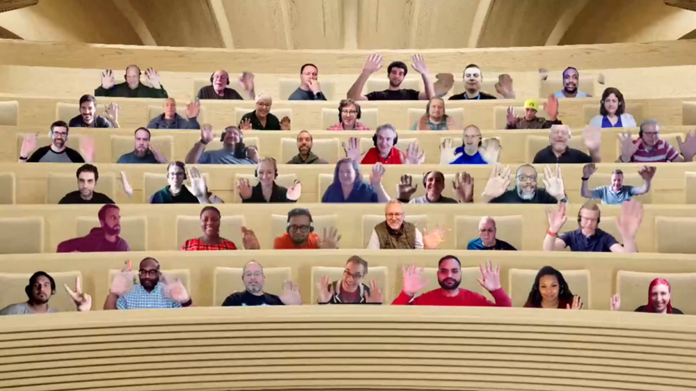

## Call summary

Welcome to the weekly call focused on capabilities of the Microsoft 365 and Power Platform.  In this call, we highlight recently announced and key existing developer resources, news, community events and three demos.

### New this week

* Announcements
    * **Last day to enter!** Microsoft Teams Toolkit Cloud Skills Challenge, April 12th – 26th
    * Agenda set for next [Microsoft 365 & Power Platform weekly call](https://aka.ms/m365-dev-call) - Tuesday, May 2nd, 8:00 am PT.
        * Latest news from Microsoft engineering on Microsoft 365 topics
        * **Marcus Castro** – Power Platform Solutions in Microsoft Teams – Example scenario deep dive
        * **Ayça Baş** – Build Outlook Add-ins using Teams Toolkit for Visual Studio Code
* News
    * Article – [Supercharge your Teams app development: New integration for Teams Toolkit & Developer Portal](https://devblogs.microsoft.com/microsoft365dev/supercharge-your-teams-app-development-new-integration-for-teams-toolkit-developer-portal/) – Ji Dong (Microsoft)
    * Article – [New Azure AD app name for Microsoft Graph PowerShell SDK and CLI](https://devblogs.microsoft.com/microsoft365dev/new-azure-ad-app-name-for-microsoft-graph-powershell-sdk-and-cli/) - Carol Mbasinge Kigoonya (Microsoft)
    * Article – [Teams Toolkit for Visual Studio Code Update – April 2023](https://devblogs.microsoft.com/microsoft365dev/teams-toolkit-for-visual-studio-code-update-april-2023/) – [Junjie Li](https://twitter.com/MuyangAmigo) (Microsoft) \| @MuyangAmigo
    * Article – [OData property changes to callRecords change notifications in Microsoft Graph](https://devblogs.microsoft.com/microsoft365dev/odata-property-changes-to-callrecords-change-notifications-in-microsoft-graph/) – Matthew McGrath (Microsoft)
    * Article – [What’s new for security in the new Microsoft Teams?](https://techcommunity.microsoft.com/t5/microsoft-teams-blog/what-s-new-for-security-in-the-new-microsoft-teams/ba-p/3804261) - Andrey Belenko (Microsoft)
    * Article – [Celebrate success using Together Emojis in Microsoft Teams](https://techcommunity.microsoft.com/t5/microsoft-teams-blog/celebrate-success-using-together-emojis-in-microsoft-teams/ba-p/3797936) – Sam Cundall (Microsoft)
    * Article – [Unblock Viva deployment and adoption in your organization](https://techcommunity.microsoft.com/t5/microsoft-viva-blog/unblock-viva-deployment-and-adoption-in-your-organization/ba-p/3801774) – NachoMSFT (Microsoft)
    * Article – [Join 300+ Viva customers and impact Viva engineering!](https://techcommunity.microsoft.com/t5/microsoft-viva-blog/join-300-viva-customers-and-impact-viva-engineering/ba-p/3793057) - NachoMSFT (Microsoft)
    * [Microsoft 365 Sample Solution Gallery](https://adoption.microsoft.com/sample-solution-gallery/) has 1550 samples now! aka.ms/m365/samples
* Teams Platform updates
    * Documentation - [Develop your apps with Teams Toolkit](https://learn.microsoft.com/microsoftteams/platform/concepts/build-and-test/develop-your-apps-with-teams-toolkit)
    * Documentation - [Upload your app in Teams](https://learn.microsoft.com/microsoftteams/platform/concepts/deploy-and-publish/apps-upload)
* Shows and Events
    * Microsoft 365 Conference – May 2 – 4. 2023, Las Vegas – m365Con.com - [Register](https://m365conf.com/)
    * European Collaboration Summit 2023 – May 24 – 26, 2023 – Düsseldorf – collabsummit.eu – [Register](https://www.collabsummit.eu/)
    * ACT NOW – save €300 on tickets for the [European Power Platform Conference](https://www.sharepointeurope.com/european-power-platform-conference) – Dublin, 20-23 June
    * 365 EduCon - Use promo code “Community” to save 25% off any pass type.
        * [Washington DC](https://techcon365.com/DC/) – June 12-16, 2023
        * [Seattle](https://techcon365.com/Seattle/) – August 21-25, 2023 & PWR EduCon
        * [Chicago](https://techcon365.com/Chicago/) – October 30 – November 3, 2023
    * Upcoming [Community Days](https://communitydays.org/) Events - aka.ms/communitydays
* Conversations
    * Microsoft 365 PnP Weekly – Episode 207 (April 24th) with India-based Cloud Consultant and Microsoft 365 Developer MVP - [Chandani Prajapati](https://twitter.com/Chandani_SPD) (Rapid Circle) \| @Chandani_SPD \| [video](https://pnp.github.io/blog/microsoft-365-pnp-weekly/episode-207/) \| [podcast](https://www.podbean.com/eas/pb-7pw9n-13ef317)
    * Power Platform Connections - Power Platform Connections Ep 10 - Vivian Voss (April 21st) \| [video](https://www.youtube.com/watch?v=3qc18mvb22c)

### Demos

* **Why build Power Platform Solutions in Microsoft Teams?** – Microsoft Teams is built for hybrid collaboration and delivers contextual information, automations and actions. Power Platform delivers bespoke functionality, connection to data and workflows. Microsoft is focused on bringing elements of Teams and Power Platform Suite together. Hear about app integration in Fabrikam Airport work shift management example and how to identify Power platform apps ripe for Teamifying. Preview 3 app integration features, deep dive next week.
* **Bring your existing projects to Teams Toolkit for Visual Studio Code** – covers several new features in Teams Toolkit v5.0 that make it much easier to migrate what you have to Teams. To create/deploy Teams app today is a lot of work. The task is simplified. Key v5.0 features reviewed – project files, pre-defined actions, and Visual Studio Dev Tunnels. Inspect differences in code walk through as migrate existing Teams Conversation Bot SSO quick-start sample into a Teams Toolkit project.
* **Building a Magic Note app to plan the day efficiently with AI & Microsoft Graph** – introducing the first-place winner of Hack Together. Magic Note is an AI-powered application that’s your daily minder/assistant. App captures your randomly organized activities list. Uses AI and Microsoft Graph to organize and build your daily schedule. Edit/approve entries after which app updates m365 connected resources (events, meetings, to-do tasks, etc.). The Windows 10/11 app uses Microsoft Graph, Azure conversational language understanding cognitive service and .NET.

The host of this call was [Vesa Juvonen](http://twitter.com/vesajuvonen) (Microsoft) \| @vesajuvonen. Q&A takes place in chat throughout the call.



## Agenda items

[00:00](https://youtu.be/-1PsPpidDgA?t=0) – Intro

[08:56](https://youtu.be/-1PsPpidDgA?t=536) – Latest updates – news across the Microsoft blogs – [Vesa Juvonen](http://twitter.com/vesajuvonen) (Microsoft) \| @vesajuvonen

[10:28](https://youtu.be/-1PsPpidDgA?t=628) – Microsoft Teams Platform updates – Surbhi Gupta (Microsoft)

[11:32](https://youtu.be/-1PsPpidDgA?t=692) – Announcement - Microsoft Teams toolkit cloud skill challenge – Garry Trinder (Microsoft) \| @garrytrinder

[12:10](https://youtu.be/-1PsPpidDgA?t=730) – Together mode picture

[12:59](https://youtu.be/-1PsPpidDgA?t=779) – Demo – Why build Power Platform Solutions in Microsoft Teams? – Stuart McCarthy (Microsoft) & Marcus Castro (Microsoft)

[28:20](https://youtu.be/-1PsPpidDgA?t=1700) – Demo – Bring your existing projects to Teams Toolkit for Visual Studio Code – [Garry Trinder](https://twitter.com/garrytrinder) (Microsoft) \| @garrytrinder

[45:00](https://youtu.be/-1PsPpidDgA?t=2700) – Demo – Building a Magic Note app to plan the day efficiently with AI & Microsoft Graph – [Ahmad Mozaffar](https://twitter.com/AhmadMozaffar99) (ContraForce) \| @AhmadMozaffar99

[57:06](https://youtu.be/-1PsPpidDgA?t=3426) – Closing

Thank you for your creativity and work execution. Samples are often showcased in Demos.

## Together Mode

Thank you for joining the call. A packed house today. Looking forward to seeing many of you in-person soon at a conference near or not so near to you.

## Actions

* [Register](https://learn.microsoft.com/training/challenges?id=131a4a86-7d76-4ead-891f-aeaf5b7d32df) for the Microsoft Teams Toolkit Cloud Skills Challenge, April 12th – 26th. \| aka.ms/LearnTeamsToolkit
* [Rate this call](https://forms.office.com/pages/responsepage.aspx?id=v4j5cvGGr0GRqy180BHbR02h_1H9_XFFp4etSzu5JxFUOEc5UkxDN0dGMUgyOTBDVklBREJPRVI1Qi4u)’s content and let us know how we can improve \| aka.ms/community/calls/feedback Thanks!
* [Request to Present a demo](https://aka.ms/community/request/demo) during Microsoft 365 & Power Platform community calls - aka.ms/community/request/demo
* [Register](http://www.communitydays.org) for an Upcoming Event around Microsoft 365 and Power Platform advertised on the Community Days site.
* Community call agendas are published each week at aka.ms/community/meetup
* Opt into PnP Recognition Program – aka.ms/m365pnp-recognition
* Register for upcoming [Sharing Is Caring](https://pnp.github.io/sharing-is-caring/) events:
    * Maturity Model Practitioners \| Tuesday, May 16th, 7am PST – [Download reoccurring invite](https://aka.ms/mm4m365/invite)
    * PnP Office Hours – 1:1 session \| [Register](https://outlook.office365.com/owa/calendar/PnPSharingisCaring@warner.digital/bookings/)
    * PnP Buddy System \| [Request a Buddy](https://forms.office.com/Pages/ResponsePage.aspx?id=KtIy2vgLW0SOgZbwvQuRaXDXyCl9DkBHq4A2OG7uLpdUMjRRUVg4NElZUUJLTEY1TVVSVDJFRFpLRS4u)
* Register for the [Microsoft 365 Developer Program](https://aka.ms/m365/devprogram) and get a free developer tenant
* Get started with [free training modules](https://aka.ms/m365/dev/learn) covering Microsoft 365 platform capabilities.
* Visit the [Microsoft 365 Unified Sample Solution Gallery](https://adoption.microsoft.com/sample-solution-gallery) with more than 1400 samples from Microsoft and community.
* Download the recurrent invite for this call – aka.ms/m365-dev-call

## Demo references

* **Why build Power Platform Solutions in Microsoft Teams?**
    * Documentation - [Create apps in Microsoft Teams by using Power Apps](https://learn.microsoft.com/power-apps/teams/create-apps-overview)
    * Documentation - [Create low-code custom apps for Teams](https://learn.microsoft.com/microsoftteams/platform/samples/teams-low-code-solutions)
* **Bring your existing projects to Teams Toolkit for Visual Studio Code**
    * Documentation - [Available actions in Teams Toolkit](https://github.com/OfficeDev/TeamsFx/wiki/Available-actions-in-Teams-Toolkit) \| aka.ms/teamsfx-actions
    * Sample - [Teams Conversation Bot SSO quick-start](https://adoption.microsoft.com/sample-solution-gallery/sample/officedev-microsoft-teams-samples-bot-conversation-sso-quickstart-js/)
    * General Samples – [Teams Samples](https://adoption.microsoft.com/sample-solution-gallery/) \| aka.ms/community/samples
    * Repo - Migrated Project using - [Teams Toolkit v5.0 Pre-release](https://github.com/garrytrinder/msteams-bot-sso)
    * Demo – [Introduction to Microsoft Teams Toolkit v5 - New features and capabilities](https://youtu.be/ax3Zu-DItLE?t=964) – [John Miller](https://twitter.com/jmillerdev) (Microsoft) \| @jmillerdev
    * Documentation - [Teams Toolkit Visual Studio Code v5.0 Prerelease Guide](https://github.com/OfficeDev/TeamsFx/wiki/Teams-Toolkit-Visual-Studio-Code-v5.0-Prerelease-Guide) \| aka.ms/teamsfx-v5.0-guide
* **Building a Magic Note app to plan the day efficiently with AI & Microsoft Graph**
    * Repo - [Magic Note - \#Hack_Together](https://github.com/aksoftware98/hack-together23)
    * Repo - [Hack Together: Microsoft Graph and .NET](https://github.com/microsoft/hack-together) \| aka.ms/hack-together
    * Documentation - [What is conversational language understanding?](https://learn.microsoft.com/azure/cognitive-services/language-service/conversational-language-understanding/overview)

## Links in this call

Microsoft 365 & Power Platform community videos - aka.ms/community/videos

* LinkedIn group for discussions and updates - aka.ms/community/Li
* Open-source assets –
    * github.com/pnp
    * github.com/officedev
    * github.com/sharepoint
    * github.com/microsoftgraph
* Unified Sample gallery - aka.ms/community/samples
* Product sample galleries
    * aka.ms/teams-samples
    * aka.ms/spfx-webparts
    * aka.ms/spfx-extensions
    * aka.ms/powerplatform-samples
    * aka.ms/list-formatting
* One place for Open-source initiatives and samples - aka.ms/community/home
* Microsoft 365 & Power Platform community calls - aka.ms/community/calls
* Community call agendas - aka.ms/community/meetup
* Request to Present - aka.ms/community/request/demo
* Free E5 developer tenant - aka.ms/m365/devprogram
* Learn training modules - aka.ms/m365/dev/learn
* Conversations - Microsoft 365 Developer Podcast – m365devpodcast.com
* Conversations - Microsoft 365 PnP Weekly
    * Video - aka.ms/pnpweekly
    * Podcast - pnpweekly.podbean.com
* Conversations - Power Platform Connections – aka.ms/powerplatform-connections
* Microsoft 365 & Power Platform sample gallery - aka.ms/community/samples
* Learn how to get started in the open-source PnP community! – aka.ms/sharing-is-caring
* Event – Microsoft 365 Conference – Las Vegas, May 2-4
* Event – European Collaboration Summit 2023, Düsseldorf. May 24-26
* Event – Microsoft 365 EduCon conferences – DC, Seattle, Chicago
* Event – European Power Platform Conference, Dublin, June 20-22
* Upcoming Community Events - communitydays.org
* News – Microsoft 365 Developer Blog - aka.ms/m365dev/blog
* News – Teams Blog - aka.ms/teams/blog
* News – Microsoft Viva Blog - aka.ms/microsoftviva/blog
* News – Microsoft SharePoint Blog - aka.ms/sp-blog
* Teams Platform Updates - aka.ms/TeamsPlatformUpdates
* Teams Toolkit Cloud Skills Challenge – aka.ms/LearnTeamsToolkit
* Teams Documents – aka.ms/TeamsDevDocs
* Teams Samples – aka.ms/TeamsSamples
* Teams Feedback – aka.ms/TeamsPlatformFeedback
* Invite (ics) for the weekly Microsoft 365 & Power Platform call - aka.ms/community/ms-speakers-call-invite
* Feedback on this call - aka.ms/community/calls/feedback

## General resources

* Archives - Microsoft 365 PnP Weekly - [Videos](https://www.youtube.com/playlist?list=PLR9nK3mnD-OVYI-St_CBiFfuL4CZbBpkC), [Podcasts](https://pnpweekly.podbean.com/)
* Microsoft Teams Toolkit | [https://aka.ms/teams-toolkit](https://aka.ms/teams-toolkit)
* Microsoft Graph Toolkit in Microsoft Learn | [https://aka.ms/learn-mgt](https://aka.ms/learn-mgt)
* Viva Connections [https://aka.ms/VivaConnections](https://aka.ms/VivaConnections)
* [SharePoint look book](https://lookbook.microsoft.com/?WT.mc_id=m365-24198-cxa)
* [Yo Teams video training package](https://aka.ms/yoteams-training)
* [.NET Standard 2.0 version of SharePoint Online CSOM API](https://developer.microsoft.com/microsoft-365/blogs/net-standard-version-of-sharepoint-online-csom-apis?WT.mc_id=m365-24198-cxa)
* [Microsoft 365 Platform Community (PnP) videos](https://aka.ms/m365/videos) | aka.ms/m365/videos
* [Microsoft Teams Toolkit for Visual Studio Code](https://marketplace.visualstudio.com/items?itemName=TeamsDevApp.ms-teams-vscode-extension)
* [yo Teams](https://aka.ms/yoteams) | aka.ms/yoteams
* [SPFx Developer documentation](https://aka.ms/spfx) | <https://aka.ms/spfx>
* [Microsoft 365 developer program site](https://developer.microsoft.com/office/dev-program?WT.mc_id=m365-24198-cxa) - Need to become a Tenant Admin to test look book capabilities? Get a Microsoft 365 E5 developer subscription - free tenant for 90 days with automatic renewal if used for dev purposes

## Upcoming Calls | Recurrent Invites

* Microsoft 365 & Power Platform Dev call \| Thursday, April 27, 7:00 am PT - <https://aka.ms/m365-dev-sig> (bi-weekly)
* Microsoft 365 platform call \| Tuesday, May 2, 8:00 am PT – <https://aka.ms/m365-dev-call> (weekly)
* Viva Connections & SharePoint Framework call \| Thursday, May 4, 7:00 am PT - <https://aka.ms/spdev-spfx-call> (bi-weekly)
* Office add-in monthly call \| Wednesday, May 10, 8:00 am PT - <https://aka.ms/officeaddinscall> (monthly)
* Power Platform monthly call \| Wednesday, May 17, 8:00 am PT - <https://aka.ms/PowerAppsMonthlyCall> (monthly)
* Microsoft Identity Platform call \| Thursday, May 18, 9:00 am PT - <https://aka.ms/IDDevCommunityCalendar> (monthly)

Microsoft 365 Platform community call focuses on latest Microsoft 365 Platform updates and demos delivered by Microsoft presenters and takes place weekly on Tuesday.  The alternating Special Interest Group community calls each Thursday focus on SharePoint Framework (client-side development/implementation) and Microsoft 365 Platform (includes Microsoft Teams, Bots, Microsoft Graph, CSOM, REST, site provisioning, PnP PowerShell, PnP Sites Core, Site Designs, Power Automate, PowerApps, Column Formatting, list formatting, etc. topics.) with demos commonly delivered by community members.

More details on the Microsoft 365 community from [https://aka.ms/m365pnp](https://aka.ms/sppnp).

You can download recurrent invite for this call from [https://aka.ms/m365-dev-call](https://aka.ms/m365-dev-call).  Welcome and join in the discussion. If you have any questions, comments, or feedback, feel free to provide your input as comments to this post as well. More details on the Microsoft 365 community and options to get involved are available from [https://aka.ms/m365pnp](https://aka.ms/sppnp).

&quot;_Sharing is caring&quot;_

_Microsoft 365 Platform Community team, Microsoft - 25th of April 2023_
