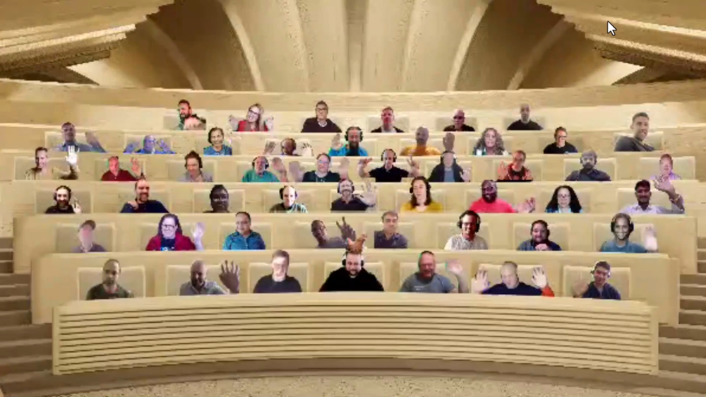

## Call summary

Welcome to the weekly call focused on capabilities of the Microsoft 365 and Power Platform.  In this call, we highlight recently announced and key existing developer resources, news, community events and three demos. 

### New this week

* Announcements
    * Agenda set for next [Microsoft 365 & Power Platform weekly call](https://aka.ms/m365-dev-call) - Tuesday, May 23rd, 8:00 am PT.
        * Latest news from Microsoft engineering on Microsoft 365 topics
        * **DC Padur** & **Hanbing Wang** – Updates to the Microsoft Graph beta API for SharePoint Pages
        * **Diksha Upadhyay** – Multi-geo support for site discovery with Microsoft Graph
    * [Monday’s @ Microsoft](https://www.linkedin.com/company/microsoft-community/) – Premier Episode (Mon, May 15th , 8:00 am PT)
    * Event - [HackTogether: The Microsoft Teams Global Hack](https://github.com/microsoft/hack-together-teams) (June 1 – 15, 2023) \| aka.ms/hack-together-teams
* News
    * Article – [OneNote Webhooks API deprecation](https://devblogs.microsoft.com/microsoft365dev/onenote-webhooks-api-deprecation/) - Bea Villanueva (Microsoft) & Zack Runner (Microsoft)
    * Article – [Join us for HackTogether: The Microsoft Teams Global Hack](https://devblogs.microsoft.com/microsoft365dev/join-us-for-hacktogether-the-microsoft-teams-global-hack/) - [Garry Trinder](https://twitter.com/garrytrinder) (Microsoft) \| @garrytrinder & [Waldek Mastykarz](https://twitter.com/waldekm) (Microsoft) \| @waldekm
    * Article – [Building Go applications with the Microsoft Graph Go SDK, now generally available](https://devblogs.microsoft.com/microsoft365dev/building-go-applications-with-the-microsoft-graph-go-sdk/) - [Maisa Rissi](https://twitter.com/maisarissi_msft) (Microsoft) \| @maisarissi_msft
    * Article – [Microsoft Teams apps now available in public preview in the Microsoft 365 iOS app](https://devblogs.microsoft.com/microsoft365dev/microsoft-teams-apps-now-available-in-public-preview-in-the-microsoft-365-ios-app/) - Sheena Makker (Microsoft)
    * Article – [Establish seamless and secure collaboration across organizations with Microsoft Teams](https://techcommunity.microsoft.com/t5/microsoft-teams-blog/establish-seamless-and-secure-collaboration-across-organizations/ba-p/3815593) - Microsoft
    * Article – [“Jeff Teper is your Copilot” 🎙 – The Intrazone podcast](https://techcommunity.microsoft.com/t5/microsoft-sharepoint-blog/jeff-teper-is-your-copilot-the-intrazone-podcast/ba-p/3815807) – [Mark Kashman](https://twitter.com/mkashman) (Microsoft) \| @mkashman
    * Article – [How Copilot in Microsoft Dynamics 365 and Power Platform delivers enterprise-ready AI built for security and privacy](https://cloudblogs.microsoft.com/dynamics365/bdm/2023/05/12/how-copilot-in-microsoft-dynamics-365-and-power-platform-delivers-enterprise-ready-ai-built-for-security-and-privacy/) - Walter Sun (Microsoft)
    * Article – [Microsoft Power Platform celebrates 1,000 certified connectors](https://cloudblogs.microsoft.com/powerplatform/2023/05/11/microsoft-power-platform-celebrates-1000-certified-connectors/) - Nirav Shah (Microsoft)
    * [Microsoft 365 Sample Solution Gallery](https://adoption.microsoft.com/sample-solution-gallery/) has 1567+ samples now! aka.ms/m365/samples
* Shows and Events
    * European Collaboration Summit 2023 – May 24 – 26, 2023 – Düsseldorf – collabsummit.eu – [Register](https://www.collabsummit.eu/)
    * ACT NOW – save €300 on tickets for the [European Power Platform Conference](https://www.sharepointeurope.com/european-power-platform-conference) – Dublin, 20-23 June
    * 365 EduCon - Use promo code “Community” to save 25% off any pass type.
        * [Washington DC](http://www.365educon.com/dc) – June 12-16, 2023
        * [Seattle](http://www.365educon.com/seattle) – August 21-25, 2023 & PWR EduCon
        * [Chicago](http://www.365educon.com/chicago) – October 30 – November 3, 2023
    * Upcoming [Community Days](https://communitydays.org/) Events - aka.ms/communitydays
* Conversations
    * Microsoft 365 PnP Weekly – Episode 210 (May 15th) with UK-based Cloud Developer Advocate at Microsoft - Garry Trinder \| @garrytrinder \| [video](https://pnp.github.io/blog/microsoft-365-pnp-weekly/episode-210/) \| [podcast](ttps://www.podbean.com/eas/pb-gxea7-140c76c)
    * David Warner - Power Platform Connections Ep 13 (May 12th) \| [video](https://www.youtube.com/watch?v=Gn1mP04t1SY)
    * Microsoft 365 Developer Podcast – Partner showcase: Omnia Intranet with Johan Schedin Jigland (May 15th) \| [podcast](https://m365devpodcast.com/e/partner-showcase-omnia-intranet-with-johan-schedin-jigland/)
    * [Monday’s @ Microsoft](https://www.linkedin.com/company/microsoft-community/) – Premier Episode (Mon, May 15th , 8:00 am PT)

### Demos

* **Building a Microsoft Teams Call queue scheduler solution with Power Platform** – showcasing an open-source App provided by Microsoft Teams that simplifies the management of separate Teams call queues and individuals with a connected and capable supervisor UI. Manage call queues, upload schedules (CSV), view schedules, manually update schedules. Queue coordination delivered by Power Apps to Power Automate via custom connector to Azure function, which runs Power Shell using a service account with credentials stored in Key Vault.
* **Introduction to Live Share SDK for Microsoft Teams apps** – with Live Share, users co-watch, co-create, and co-edit what’s on screen during meetings. Meeting participants can annotate, manipulate, activate, edit the same object shown on all participants screens in real time. Learn about 3 SDK packages (groups of capabilities) – Live Share core, Live Share media, and Live Share canvas. Short demo shows complete interactivity now available across mobile and desktop devices.
* **Latest on building Microsoft Viva extensibility with SharePoint Framework** – overviews on SharePoint Framework and Microsoft Viva - Viva home (desktop) experience and Viva Connections (mobile) experience. Cover off on segments - We’ve built a Teams app, what’s next? Quick operations using the ACE Quick View, Expanding from Teams to Teams+Viva, New partner opportunity – Viva apps in the Microsoft Store, and Future - ACEs, templates, card sizes, and UX capabilities.

The host of this call was [Vesa Juvonen](http://twitter.com/vesajuvonen) (Microsoft) \| @vesajuvonen. Q&A takes place in chat throughout the call.



## Agenda items

[00:00](https://youtu.be/p2DZnli5w5Q?t=0) – Intro

[11:32](https://youtu.be/p2DZnli5w5Q?t=692) – Latest updates – news across the Microsoft blogs – [Vesa Juvonen](https://twitter.com/vesajuvonen) (Microsoft) \| @vesajuvonen

[13:21](https://youtu.be/p2DZnli5w5Q?t=801) – Together mode picture

[14:56](https://youtu.be/p2DZnli5w5Q?t=896) – Demo - Building a Microsoft Teams Call queue scheduler solution with Power Platform – [Srinivas Varukala](https://twitter.com/svarukala) (Microsoft) \| @svarukala & Rick Shire (Microsoft)

[29:06](https://youtu.be/p2DZnli5w5Q?t=1746) – Demo - Introduction to Live Share SDK for Microsoft Teams apps – Supriti Bhan (Microsoft)

[41:42](https://youtu.be/p2DZnli5w5Q?t=2502) – Demo - Latest on building Microsoft Viva extensibility with SharePoint Framework – [Vesa Juvonen](https://twitter.com/vesajuvonen) (Microsoft) \| @vesajuvonen

[54:29](https://youtu.be/p2DZnli5w5Q?t=3269) – Closing

Thank you for your creativity and work execution. Samples are often showcased in Demos.

## Together Mode

Really great seeing everyone in the packed virtual room today during the call.

## Actions

* Register for [HackTogether: The Microsoft Teams Global Hack](https://github.com/microsoft/hack-together-teams) (June 1 – 15, 2023) \| aka.ms/hack-together-teams
* [Rate this call](https://forms.office.com/pages/responsepage.aspx?id=v4j5cvGGr0GRqy180BHbR02h_1H9_XFFp4etSzu5JxFUOEc5UkxDN0dGMUgyOTBDVklBREJPRVI1Qi4u)’s content and let us know how we can improve \| aka.ms/community/calls/feedback Thanks!
* [Request to Present a demo](https://aka.ms/community/request/demo) during Microsoft 365 & Power Platform community calls - aka.ms/community/request/demo
* [Register](http://www.communitydays.org) for an Upcoming Event around Microsoft 365 and Power Platform advertised on the Community Days site.
* Community call agendas are published each week at aka.ms/community/meetup
* Opt into PnP Recognition Program – aka.ms/m365pnp-recognition
* Register for upcoming [Sharing Is Caring](https://pnp.github.io/sharing-is-caring/) events:
    * Maturity Model Practitioners \| Tuesday, June 20th, 7am PST - [Register](https://forms.office.com/Pages/ResponsePage.aspx?id=KtIy2vgLW0SOgZbwvQuRaXDXyCl9DkBHq4A2OG7uLpdUODY3NVRFQ0E4SFg5WlI1TU83WFJQRklZSy4u)
    * PnP Office Hours – 1:1 session \| [Register](https://outlook.office365.com/owa/calendar/PnPSharingisCaring@warner.digital/bookings/)
    * PnP Buddy System \| [Request a Buddy](https://forms.office.com/Pages/ResponsePage.aspx?id=KtIy2vgLW0SOgZbwvQuRaXDXyCl9DkBHq4A2OG7uLpdUMjRRUVg4NElZUUJLTEY1TVVSVDJFRFpLRS4u)
* Register for the [Microsoft 365 Developer Program](https://aka.ms/m365/devprogram) and get a free developer tenant
* Get started with [free training modules](https://aka.ms/m365/dev/learn) covering Microsoft 365 platform capabilities.
* Visit the [Microsoft 365 Unified Sample Solution Gallery](https://adoption.microsoft.com/sample-solution-gallery) with more than 1570+ samples from Microsoft and community.
* Download the recurrent invite for this call – aka.ms/m365-dev-call

## Demo references

* **Building a Microsoft Teams Call queue scheduler solution with Power Platform**
    * App - [Microsoft Teams Call Queue Scheduler](https://github.com/OfficeDev/microsoft-teams-apps-call-queue-scheduler) \| aka.ms/CallQueueScheduler
* **Introduction to Live Share SDK for Microsoft Teams apps**
    * Documentation - [Live Share SDK](https://learn.microsoft.com/microsoftteams/platform/apps-in-teams-meetings/teams-live-share-overview)
* **Latest on building Microsoft Viva extensibility with SharePoint Framework**
    * Article - [New experiences for Viva Connections are now rolling out](https://techcommunity.microsoft.com/t5/viva-connections-blog/new-experiences-for-viva-connections-are-now-rolling-out/ba-p/3729071)
    * AppSource – [Microsoft Viva](https://appsource.microsoft.com/marketplace/apps?exp=ubp8&product=office%3Bviva&page=1) \| aka.ms/viva/store
    * **All Developers**
        * Documentation - [Start using Viva Connections](https://learn.microsoft.com/viva/connections/viva-connections-overview) \| aka.ms/Viva/Connections/GettingStarted
        * Documentation - [Start a Solution](https://learn.microsoft.com/sharepoint/dev/spfx/viva/overview-viva-connections) \| aka.ms/Viva/Connections/Platform
        * Documentation - [Design Guidelines](https://learn.microsoft.com/sharepoint/dev/spfx/viva/design/designing-card) \| aka.ms/Viva/Connections/DesignGuidelines
    * **Teams Developers**
        * Documentation - [Enable SSO for your Teams App](https://learn.microsoft.com/microsoftteams/platform/concepts/authentication/authentication) \| aka.ms/Viva/Connections/Teams/SSO
        * Documentation - [Enable deep linking](https://learn.microsoft.com/microsoftteams/platform/concepts/build-and-test/deep-links) \| aka.ms/Viva/Connections/Teams/DeepLinks
        * Documentation - [Consider Message Extensions](https://learn.microsoft.com/microsoftteams/platform/messaging-extensions/what-are-messaging-extensions?tabs=dotnet)
        * \| aka.ms/Viva/Connections/Teams/MessagingExtensions
        * Documentation - [Consider Stage View](https://learn.microsoft.com/microsoftteams/platform/tabs/tabs-link-unfurling) \| aka.ms/Viva/Connections/Teams/StageView
    * **Jump Start Development**
        * Documentation - [Training](https://learn.microsoft.com/training/paths/m365-extend-viva-connections/) \| aka.ms/Viva/Connections/Platform/Training
        * Documentation - [OSS Samples](https://adoption.microsoft.com/sample-solution-gallery/?page=1&keyword=viva&sortby=creationDateTime-true&product=Viva) \| aka.ms/Viva/Connections/Samples
        * Documentation - [Plug into Community](https://pnp.github.io/) \| aka.ms/community/home

## Links in this call

* Microsoft 365 & Power Platform community videos - aka.ms/community/videos
* LinkedIn group for discussions and updates - aka.ms/community/Li
* Open-source assets –
    * github.com/pnp
    * github.com/officedev
    * github.com/sharepoint
    * github.com/microsoftgraph
* Unified Sample gallery - aka.ms/community/samples
* Product sample galleries
    * aka.ms/teams-samples
    * aka.ms/spfx-webparts
    * aka.ms/spfx-extensions
    * aka.ms/powerplatform-samples
    * aka.ms/list-formatting
* One place for Open-source initiatives and samples - aka.ms/community/home
* Microsoft 365 & Power Platform community calls - aka.ms/community/calls
* Community call agendas - aka.ms/community/meetup
* Request to Present - aka.ms/community/request/demo
* Free E5 developer tenant - aka.ms/m365/devprogram
* Learn training modules - aka.ms/m365/dev/learn
* Conversations - Microsoft 365 Developer Podcast – m365devpodcast.com
* Conversations - Microsoft 365 PnP Weekly
    * Video - aka.ms/pnpweekly
    * Podcast - pnpweekly.podbean.com
* Conversations - Power Platform Connections – aka.ms/powerplatform-connections
* Microsoft 365 & Power Platform sample gallery - aka.ms/community/samples
* Learn how to get started in the open-source PnP community! – aka.ms/sharing-is-caring
* Event – Microsoft 365 Conference – Las Vegas, May 2-4
* Event – European Collaboration Summit 2023, Düsseldorf. May 24-26
* Event – Microsoft 365 EduCon conferences – DC, Seattle, Chicago
* Event – European Power Platform Conference, Dublin, June 20-22
* Upcoming Community Events - communitydays.org
* News – Microsoft 365 Developer Blog - aka.ms/m365dev/blog
* News – Teams Blog - aka.ms/teams/blog
* News – Microsoft Viva Blog - aka.ms/microsoftviva/blog
* News – Microsoft SharePoint Blog - aka.ms/sp-blog
* Teams Platform Updates - aka.ms/TeamsPlatformUpdates
* Teams Toolkit Cloud Skills Challenge – aka.ms/LearnTeamsToolkit
* Teams Documents – aka.ms/TeamsDevDocs
* Teams Samples – aka.ms/TeamsSamples
* Teams Feedback – aka.ms/TeamsPlatformFeedback
* Invite (ics) for the weekly Microsoft 365 & Power Platform call - aka.ms/community/ms-speakers-call-invite
* Feedback on this call - aka.ms/community/calls/feedback

## General resources

* Archives - Microsoft 365 PnP Weekly - [Videos](https://www.youtube.com/playlist?list=PLR9nK3mnD-OVYI-St_CBiFfuL4CZbBpkC), [Podcasts](https://pnpweekly.podbean.com/)
* Microsoft Teams Toolkit | [https://aka.ms/teams-toolkit](https://aka.ms/teams-toolkit)
* Microsoft Graph Toolkit in Microsoft Learn | [https://aka.ms/learn-mgt](https://aka.ms/learn-mgt)
* Viva Connections [https://aka.ms/VivaConnections](https://aka.ms/VivaConnections)
* [SharePoint look book](https://lookbook.microsoft.com/?WT.mc_id=m365-24198-cxa)
* [Yo Teams video training package](https://aka.ms/yoteams-training)
* [.NET Standard 2.0 version of SharePoint Online CSOM API](https://developer.microsoft.com/microsoft-365/blogs/net-standard-version-of-sharepoint-online-csom-apis?WT.mc_id=m365-24198-cxa)
* [Microsoft 365 Platform Community (PnP) videos](https://aka.ms/m365/videos) | aka.ms/m365/videos
* [Microsoft Teams Toolkit for Visual Studio Code](https://marketplace.visualstudio.com/items?itemName=TeamsDevApp.ms-teams-vscode-extension)
* [yo Teams](https://aka.ms/yoteams) | aka.ms/yoteams
* [SPFx Developer documentation](https://aka.ms/spfx) | <https://aka.ms/spfx>
* [Microsoft 365 developer program site](https://developer.microsoft.com/office/dev-program?WT.mc_id=m365-24198-cxa) - Need to become a Tenant Admin to test look book capabilities? Get a Microsoft 365 E5 developer subscription - free tenant for 90 days with automatic renewal if used for dev purposes

## Upcoming Calls | Recurrent Invites

* Power Platform monthly call \| Wednesday, May 17, 8:00 am PT - <https://aka.ms/PowerAppsMonthlyCall> (monthly)
* Viva Connections & SharePoint Framework call \| Thursday, May 18, 7:00 am PT - <https://aka.ms/spdev-spfx-call> (bi-weekly)
* Microsoft Identity Platform call \| Thursday, May 18, 9:00 am PT - <https://aka.ms/IDDevCommunityCalendar> (monthly)
* Microsoft 365 platform call \| Tuesday, May 23, 8:00 am PT - <https://aka.ms/m365-dev-call> (weekly)
* Microsoft 365 & Power Platform Dev call \| Thursday, May 25, 7:00 am PT - <https://aka.ms/m365-dev-sig> (bi-weekly)
* Office add-in monthly call \| Wednesday, June 14, 8:00 am PT - <https://aka.ms/officeaddinscall> (monthly)

Microsoft 365 Platform community call focuses on latest Microsoft 365 Platform updates and demos delivered by Microsoft presenters and takes place weekly on Tuesday.  The alternating Special Interest Group community calls each Thursday focus on SharePoint Framework (client-side development/implementation) and Microsoft 365 Platform (includes Microsoft Teams, Bots, Microsoft Graph, CSOM, REST, site provisioning, PnP PowerShell, PnP Sites Core, Site Designs, Power Automate, PowerApps, Column Formatting, list formatting, etc. topics.) with demos commonly delivered by community members.

More details on the Microsoft 365 community from [https://aka.ms/m365pnp](https://aka.ms/sppnp).

You can download recurrent invite for this call from [https://aka.ms/m365-dev-call](https://aka.ms/m365-dev-call).  Welcome and join in the discussion. If you have any questions, comments, or feedback, feel free to provide your input as comments to this post as well. More details on the Microsoft 365 community and options to get involved are available from [https://aka.ms/m365pnp](https://aka.ms/sppnp).

&quot;_Sharing is caring&quot;_

_Microsoft 365 Platform Community team, Microsoft - 16th of May 2023_
