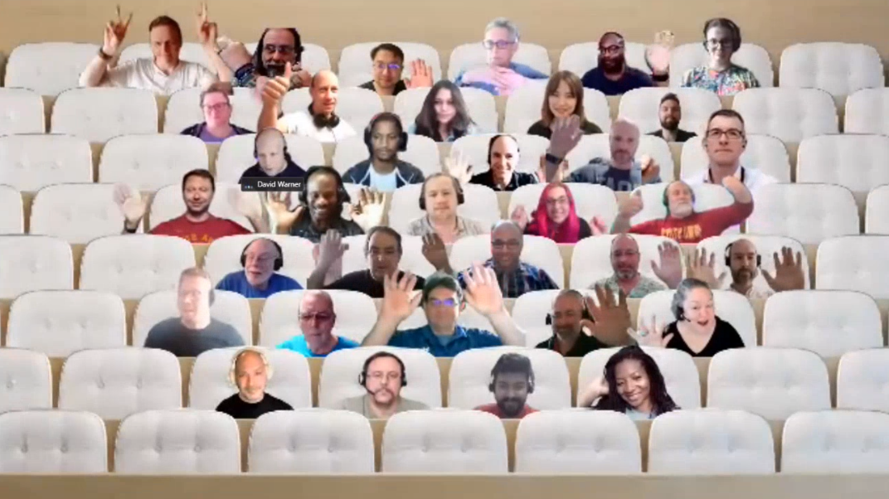

## Call summary

Welcome to the weekly call focused on capabilities of the Microsoft 365 and Power Platform.  In this call, we highlight recently announced and key existing developer resources, news, community events and three demos. 

### New this week

* Announcements
    * Agenda set for next [Microsoft 365 & Power Platform weekly call](https://aka.ms/m365-dev-call) - Tuesday, May 30th, 8:00 am PT.
        * Latest news from Microsoft engineering on Microsoft 365 topics
        * **Marc Windl** – Introduction to Repository As A Service (RaaS) feature
        * **Jethro Seghers** – Introducing Microsoft Viva Connections for Education
        * **Vesa Juvonen** - Latest on using SPFx on building extensibility for SharePoint
    * Event - [HackTogether: The Microsoft Teams Global Hack](https://github.com/microsoft/hack-together-teams) (June 1 – 15, 2023) \| aka.ms/hack-together-teams
* News
    * [Microsoft 365 Sample Solution Gallery](https://adoption.microsoft.com/sample-solution-gallery/) has 1570+ samples now! aka.ms/m365/samples
* Shows and Events
    * ACT NOW – save €300 on tickets for the [European Power Platform Conference](https://www.sharepointeurope.com/european-power-platform-conference) – Dublin, 20-23 June
    * 365 EduCon - Use promo code “Community” to save 25% off any pass type.
        * [Washington DC](http://www.365educon.com/dc) – June 12-16, 2023
        * [Seattle](http://www.365educon.com/seattle) – August 21-25, 2023 & PWR EduCon
        * [Chicago](http://www.365educon.com/chicago) – October 30 – November 3, 2023
    * Upcoming [Community Days](https://communitydays.org/) Events - aka.ms/communitydays
* Conversations
    * Microsoft 365 PnP Weekly – Episode 211 (May 22nd) with Belgium-based consultant - [Elio Struyf](https://twitter.com/eliostruyf) (Struyf Consulting) \| @eliostruyf \| [video](https://pnp.github.io/blog/microsoft-365-pnp-weekly/episode-211/) \| [podcast](https://www.podbean.com/eas/pb-2uy4b-141643c)
    * Jocelyn Panchal - Power Platform Connections Ep 14 (May 19th) \| [video](https://www.youtube.com/watch?v=zFFTeYiKFTw)
    * Microsoft 365 Developer Podcast – Open AI Chat GPT, Azure Communication Services and Microsoft Graph with Dan Wahlin (May 22nd) \| [podcast](https://m365devpodcast.com/e/open-ai-chat-gpt-azure-communication-services-and-microsoft-graph-with-dan-wahlin/)
    * [Monday’s @ Microsoft](https://www.linkedin.com/company/microsoft-community/) – Premier Episode (Mon, May 15th , 8:00 am PT)

### Demos

* **Updates to the Microsoft Graph beta API for SharePoint Pages** – manage SharePoint pages through Pages Graph APIs. Capabilities rolled out earlier this year - Get page, Create page, Delete page, List pages, Update page, Publish page/news post. Capabilities rolling out in July 2023 shown today include Data model change and Add/Edit/Delete sections and web parts within the page. Reviewed use scenarios – publish existing pages to different tenants, get list of all pages in tenant to manage.
* **Multi-geo support for site discovery with Microsoft Graph** – a new Microsoft Graph API that will help you discover and fetch all sites across a geo for a particular tenant with a single Graph API call! Review existing Sites API then see live demo of the new multi-geo site discovery API. Similar experience to using Sites API, but with expanded scope. Supports OData query parameters. What do you think? Please let us know.
* **Reach millions of mobile users by extending your Teams app to Microsoft 365 (Office) app on Android and iOS** – this presentation opens with quick overview of the Microsoft 365 Mobile app. You are able to run Teams Personal Tab apps on the Microsoft 365 mobile app, on Android and on iOS (Testflight). Specifically, Teams Tab apps built using Microsoft Teams JS v2 and Teams App manifest v1.13. Microsoft 365 app is available to WW enterprise audience on Android and on 1OS (Testflight).

The host of this call was [David Warner II](https://twitter.com/DavidWarnerII) (Microsoft) @DavidWarnerII. Q&A takes place in chat throughout the call.



## Agenda items

[00:00](https://youtu.be/sozlgcqDQps?t=0) – Intro - [David Warner II](https://twitter.com/DavidWarnerII) (Microsoft) @DavidWarnerII

[01:17](https://youtu.be/sozlgcqDQps?t=77) – Review resources and events supporting the Community - [David Warner II](https://twitter.com/DavidWarnerII) (Microsoft) @DavidWarnerII

[09:37](https://youtu.be/sozlgcqDQps?t=577) – Together mode picture

[10:39](https://youtu.be/sozlgcqDQps?t=639) – Demo - Updates to the Microsoft Graph beta API for SharePoint Pages – [DC Padur](https://twitter.com/dcpadur) (Microsoft) \| @dcpadur & [Hanbing Wang](https://www.linkedin.com/in/hanbingwang/) (Microsoft)

[25:54](https://youtu.be/sozlgcqDQps?t=1554) – Demo - Multi-geo support for site discovery with Microsoft Graph – [Diksha Upadhyay](https://www.linkedin.com/in/dikshaup/) (Microsoft)

[34:28](https://youtu.be/sozlgcqDQps?t=2068) – Demo - Reach millions of mobile users by extending your Teams app to Microsoft 365 (Office) app on Android and iOS – Sheena Makker (Microsoft)

[40:26](https://youtu.be/sozlgcqDQps?t=2426) – Closing

Thank you for your creativity and work execution. Samples are often showcased in Demos.

## Together Mode

It’s conference time so it is appropriate to gather in the V-conf room for our photo today. Thank you for joining the call and for participating in conferences.

## Actions

* Register for [HackTogether: The Microsoft Teams Global Hack](https://github.com/microsoft/hack-together-teams) (June 1 – 15, 2023) \| aka.ms/hack-together-teams
* [Rate this call](https://forms.office.com/pages/responsepage.aspx?id=v4j5cvGGr0GRqy180BHbR02h_1H9_XFFp4etSzu5JxFUOEc5UkxDN0dGMUgyOTBDVklBREJPRVI1Qi4u)’s content and let us know how we can improve \| aka.ms/community/calls/feedback Thanks!
* [Request to Present a demo](https://aka.ms/community/request/demo) during Microsoft 365 & Power Platform community calls - aka.ms/community/request/demo
* [Register](http://www.communitydays.org) for an Upcoming Event around Microsoft 365 and Power Platform advertised on the Community Days site.
* Community call agendas are published each week at aka.ms/community/meetup
* Opt into PnP Recognition Program – aka.ms/m365pnp-recognition
* Register for upcoming [Sharing Is Caring](https://pnp.github.io/sharing-is-caring/) events:
    * Maturity Model Practitioners \| Tuesday, June 20th, 7am PST - [Register](https://forms.office.com/Pages/ResponsePage.aspx?id=KtIy2vgLW0SOgZbwvQuRaXDXyCl9DkBHq4A2OG7uLpdUODY3NVRFQ0E4SFg5WlI1TU83WFJQRklZSy4u)
    * PnP Office Hours – 1:1 session \| [Register](https://outlook.office365.com/owa/calendar/PnPSharingisCaring@warner.digital/bookings/)
    * PnP Buddy System \| [Request a Buddy](https://forms.office.com/Pages/ResponsePage.aspx?id=KtIy2vgLW0SOgZbwvQuRaXDXyCl9DkBHq4A2OG7uLpdUMjRRUVg4NElZUUJLTEY1TVVSVDJFRFpLRS4u)
* Register for the [Microsoft 365 Developer Program](https://aka.ms/m365/devprogram) and get a free developer tenant
* Get started with [free training modules](https://aka.ms/m365/dev/learn) covering Microsoft 365 platform capabilities.
* Visit the [Microsoft 365 Unified Sample Solution Gallery](https://adoption.microsoft.com/sample-solution-gallery) with more than 1570+ samples from Microsoft and community.
* Download the recurrent invite for this call – aka.ms/m365-dev-call

## Demo references

* **Updates to the Microsoft Graph beta API for SharePoint Pages**
    * Article - [SharePoint Pages Microsoft Graph API is now available for public preview](https://devblogs.microsoft.com/microsoft365dev/sharepoint-pages-microsoft-graph-api-is-now-available-for-public-preview/) \| aka.ms/pagesapi
* **Multi-geo support for site discovery with Microsoft Graph**
    * Documentation - [sites: getAllSites](https://learn.microsoft.com/graph/api/site-getallsites?view=graph-rest-1.0&tabs=http) \| aka.ms/GraphGetAllSitesApi
* **Reach millions of mobile users by extending your Teams app to Microsoft 365 (Office) app on Android and iOS**
    * Documentation - [Build tabs for Teams](https://learn.microsoft.com/microsoftteams/platform/tabs/what-are-tabs?tabs=desktop)
    * Article - [Join our Beta program](https://devblogs.microsoft.com/microsoft365dev/microsoft-teams-apps-now-available-in-public-preview-in-the-microsoft-365-ios-app/#join-our-beta-program) (Microsoft Teams apps now available in public preview in the Microsoft 365 iOS app)
    * Sample - [Extend Teams app to other M365 host apps like Outlook, Office.com](https://github.com/microsoft/app-camp/tree/main/experimental/ExtendTeamsforM365)
    * Documentation - [App manifest schema for Teams](https://learn.microsoft.com/microsoftteams/platform/resources/schema/manifest-schema)
    * Feedback - [Teams App now available in Microsoft 365 app (office.com)](https://forms.office.com/pages/responsepage.aspx?id=v4j5cvGGr0GRqy180BHbR8Ui9WZwaVlCj6Azal95z3FUNVJMODAwREhKWldXOEFOM0EyMU5OTDlRVi4u)

## Links in this call

* Microsoft 365 & Power Platform community videos - aka.ms/community/videos
* LinkedIn group for discussions and updates - aka.ms/community/Li
* Open-source assets –
    * github.com/pnp
    * github.com/officedev
    * github.com/sharepoint
    * github.com/microsoftgraph
* Unified Sample gallery - aka.ms/community/samples
* Product sample galleries
    * aka.ms/teams-samples
    * aka.ms/spfx-webparts
    * aka.ms/spfx-extensions
    * aka.ms/powerplatform-samples
    * aka.ms/list-formatting
* One place for Open-source initiatives and samples - aka.ms/community/home
* Microsoft 365 & Power Platform community calls - aka.ms/community/calls
* Community call agendas - aka.ms/community/meetup
* Request to Present - aka.ms/community/request/demo
* Free E5 developer tenant - aka.ms/m365/devprogram
* Learn training modules - aka.ms/m365/dev/learn
* Conversations - Microsoft 365 Developer Podcast – m365devpodcast.com
* Conversations - Microsoft 365 PnP Weekly
    * Video - aka.ms/pnpweekly
    * Podcast - pnpweekly.podbean.com
* Conversations - Power Platform Connections – aka.ms/powerplatform-connections
* Microsoft 365 & Power Platform sample gallery - aka.ms/community/samples
* Learn how to get started in the open-source PnP community! – aka.ms/sharing-is-caring
* Event – Microsoft 365 Conference – Las Vegas, May 2-4
* Event – European Collaboration Summit 2023, Düsseldorf. May 24-26
* Event – Microsoft 365 EduCon conferences – DC, Seattle, Chicago
* Event – European Power Platform Conference, Dublin, June 20-22
* Upcoming Community Events - communitydays.org
* News – Microsoft 365 Developer Blog - aka.ms/m365dev/blog
* News – Teams Blog - aka.ms/teams/blog
* News – Microsoft Viva Blog - aka.ms/microsoftviva/blog
* News – Microsoft SharePoint Blog - aka.ms/sp-blog
* Teams Platform Updates - aka.ms/TeamsPlatformUpdates
* Teams Toolkit Cloud Skills Challenge – aka.ms/LearnTeamsToolkit
* Teams Documents – aka.ms/TeamsDevDocs
* Teams Samples – aka.ms/TeamsSamples
* Teams Feedback – aka.ms/TeamsPlatformFeedback
* Invite (ics) for the weekly Microsoft 365 & Power Platform call - aka.ms/community/ms-speakers-call-invite
* Feedback on this call - aka.ms/community/calls/feedback

## General resources

* Archives - Microsoft 365 PnP Weekly - [Videos](https://www.youtube.com/playlist?list=PLR9nK3mnD-OVYI-St_CBiFfuL4CZbBpkC), [Podcasts](https://pnpweekly.podbean.com/)
* Microsoft Teams Toolkit | [https://aka.ms/teams-toolkit](https://aka.ms/teams-toolkit)
* Microsoft Graph Toolkit in Microsoft Learn | [https://aka.ms/learn-mgt](https://aka.ms/learn-mgt)
* Viva Connections [https://aka.ms/VivaConnections](https://aka.ms/VivaConnections)
* [SharePoint look book](https://lookbook.microsoft.com/?WT.mc_id=m365-24198-cxa)
* [Yo Teams video training package](https://aka.ms/yoteams-training)
* [.NET Standard 2.0 version of SharePoint Online CSOM API](https://developer.microsoft.com/microsoft-365/blogs/net-standard-version-of-sharepoint-online-csom-apis?WT.mc_id=m365-24198-cxa)
* [Microsoft 365 Platform Community (PnP) videos](https://aka.ms/m365/videos) | aka.ms/m365/videos
* [Microsoft Teams Toolkit for Visual Studio Code](https://marketplace.visualstudio.com/items?itemName=TeamsDevApp.ms-teams-vscode-extension)
* [yo Teams](https://aka.ms/yoteams) | aka.ms/yoteams
* [SPFx Developer documentation](https://aka.ms/spfx) | <https://aka.ms/spfx>
* [Microsoft 365 developer program site](https://developer.microsoft.com/office/dev-program?WT.mc_id=m365-24198-cxa) - Need to become a Tenant Admin to test look book capabilities? Get a Microsoft 365 E5 developer subscription - free tenant for 90 days with automatic renewal if used for dev purposes

## Upcoming Calls | Recurrent Invites

* Microsoft 365 & Power Platform Dev call \| Thursday, May 25, 7:00 am PT - <https://aka.ms/m365-dev-sig> (bi-weekly)
* Microsoft 365 platform call \| Tuesday, May 30, 8:00 am PT - <https://aka.ms/m365-dev-call> (weekly)
* Viva Connections & SharePoint Framework call \| Thursday, June 1, 7:00 am PT - <https://aka.ms/spdev-spfx-call> (bi-weekly)
* Office add-in monthly call \| Wednesday, June 14, 8:00 am PT - <https://aka.ms/officeaddinscall> (monthly)
* Microsoft Identity Platform call \| Thursday, June 15, 9:00 am PT - <https://aka.ms/IDDevCommunityCalendar> (monthly)
* Power Platform monthly call \| Wednesday, June 21, 8:00 am PT - <https://aka.ms/PowerAppsMonthlyCall> (monthly)

Microsoft 365 Platform community call focuses on latest Microsoft 365 Platform updates and demos delivered by Microsoft presenters and takes place weekly on Tuesday.  The alternating Special Interest Group community calls each Thursday focus on SharePoint Framework (client-side development/implementation) and Microsoft 365 Platform (includes Microsoft Teams, Bots, Microsoft Graph, CSOM, REST, site provisioning, PnP PowerShell, PnP Sites Core, Site Designs, Power Automate, PowerApps, Column Formatting, list formatting, etc. topics.) with demos commonly delivered by community members.

More details on the Microsoft 365 community from [https://aka.ms/m365pnp](https://aka.ms/sppnp).

You can download recurrent invite for this call from [https://aka.ms/m365-dev-call](https://aka.ms/m365-dev-call).  Welcome and join in the discussion. If you have any questions, comments, or feedback, feel free to provide your input as comments to this post as well. More details on the Microsoft 365 community and options to get involved are available from [https://aka.ms/m365pnp](https://aka.ms/sppnp).

&quot;_Sharing is caring&quot;_

_Microsoft 365 Platform Community team, Microsoft - 23rd of May 2023_
