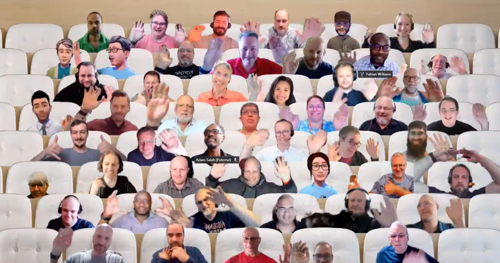

## Call summary

Welcome to the weekly call focused on capabilities of the Microsoft 365 and Power Platform.  In this call, we highlight recently announced and key existing developer resources, news, community events and three demos.

### Latest updates

Announcements

* Announcements
    * Summer schedule for this call only. This call will not take place from July 4th through
        August 15th. The weekly call will resume on August 22nd.
* News
    * Article - [HackTogether: the Microsoft Teams Global Hack week 1 recap and what’s next](https://devblogs.microsoft.com/microsoft365dev/hacktogether-the-microsoft-teams-global-hack-week-1-recap-and-whats-next/) - [Waldek Mastykarz](https://twitter.com/waldekm) (Microsoft) \| @waldekm, [Ayca Bas](https://twitter.com/aycabs) (Microsoft) \| @aycabs
    * Article - [Announcing Teams App Camp: New Adventure](https://devblogs.microsoft.com/microsoft365dev/announcing-teams-app-camp-new-adventure/) – [Bob German](https://twitter.com/Bob1German) (Microsoft) \| @Bob1German
    * Article - [How ISVs are driving customer retention by enabling unique experiences in Microsoft Teams](https://techcommunity.microsoft.com/t5/microsoft-teams-blog/how-isvs-are-driving-customer-retention-by-enabling-unique/ba-p/3842419) - [Evan Westenberger](https://techcommunity.microsoft.com/t5/user/viewprofilepage/user-id/259780) (Microsoft)
    * Article - [From Good to Great: Get the Most Out of Your Hybrid Meeting](https://techcommunity.microsoft.com/t5/microsoft-teams-blog/from-good-to-great-get-the-most-out-of-your-hybrid-meeting/ba-p/3835872) - Alexis Johnston (Microsoft)
* Conversations
    * Microsoft 365 PnP Weekly – Episode 214 (June 12th) with India-based Microsoft 365 Consultant and MVP - [Smita Nachan](https://twitter.com/SmitaNachan) \| @SmitaNachan \| [video](https://pnp.github.io/blog/microsoft-365-pnp-weekly/episode-214/) \| [podcast](https://www.podbean.com/eas/pb-b4sx3-1430cf4)
    * Power Platform Connections - Lewis Baybutt \| Power Platform Connections Ep 15 (June 2nd) \| [video](https://www.youtube.com/watch?v=BOwTYzfxZvo&t=1650s)
    * Microsoft 365 Developer Podcast – Microsoft Graph Toolkit with Gavin Barron (June 12th) \| [podcast](https://m365devpodcast.com/e/microsoft-graph-toolkit-with-gavin-barron/)

### Demos

* **Exposing Microsoft Teams apps in Microsoft Viva with SPFx cards** – review elements of cards and rendering devices. QuickView and CardView cards (ACEs) can be created with no-code (configurable), low-code (designable) or pro code (customizable). Step through ACE creation using yeoman generator, creating a CardView card with specific elements (images, text, buttons). Scaffold and explore the code. Discuss getting data from external sources, data binding, deep linking, and usage of secured Azure Functions in back-end.
* **ntroduction to Power Automate Copilot** – was released 3 weeks ago at Build along with the modern cloud flows designer tool that helps Makers build cloud flows. Live demo showing end-to-end build experience. Express your intent in natural language, designer creates the automation for you. Review suggested flow logic, update logic in real-time, then generate actual flow, ask Copilot to explain flow to you. Powered by GPT in the back-end.
* **How Microsoft Syntex Repository Services powers Microsoft Loop** – this is the 3nd installment in the Introductory series. Quick recap on Syntex Repository Services. Now learn how Syntex powers the Microsoft Loop app. Start with Loop/Syntex architecture, then create a workspace (repository services storage container) and related web page (fluid-based loop file) in the workspace. Now collaborate. Register for the Preview today.

The host of this call was [Fabian Williams](https://twitter.com/fabianwilliams) (Microsoft) \| @fabianwilliams. Q&A takes place in chat throughout the call.



## Agenda items

[00:00](https://youtu.be/lF8IXbV0ijM?t=0) – Intro

[10:47](https://youtu.be/lF8IXbV0ijM?t=647) – Latest updates – news across the Microsoft blogs – Fabian Williams (Microsoft) \| @fabianwilliams

[11:23](https://youtu.be/lF8IXbV0ijM?t=683) – Together mode picture

[12:41](https://youtu.be/lF8IXbV0ijM?t=761) – Demo - Exposing Microsoft Teams apps in Microsoft Viva with SPFx cards – [Paolo Pialorsi](https://twitter.com/PaoloPia) (PiaSys) \| @PaoloPia

[29:24](https://youtu.be/lF8IXbV0ijM?t=1764) – Demo - Introduction to Power Automate Copilot – Lan Li (Microsoft) & Kishor Subedi (Microsoft)

[45:52](https://youtu.be/lF8IXbV0ijM?t=2752) – Demo - How Microsoft Syntex Repository Services powers Microsoft Loop – Marc Windle (Microsoft)

[54:22](https://youtu.be/lF8IXbV0ijM?t=3262) – Closing

Thank you for your creativity and work execution. Samples are often showcased in Demos.

## Together Mode

Thank you for participating in the handwaving portion of the show today. Great to see everybody. There’s not an empty seat in the house!

## Activities & Actions

* Agenda set for next [Microsoft 365 & Power Platform weekly call](https://aka.ms/m365-dev-call) - Tuesday, June 20th, 8:00 am PT.
    * Latest news from Microsoft engineering on Microsoft 365 topics
    * **Lan Li & Kishor Subedi** – Deep dive into science behind Power Automate Copilot
    * **Sébastien Levert** – Introduction to Microsoft Graph Toolkit v3
* Event - [HackTogether: The Microsoft Teams Global Hack](https://github.com/microsoft/hack-together-teams) (June 1 – 15, 2023) \| aka.ms/hack-together-teams
* ACT NOW – save €300 on tickets for the [European Power Platform Conference](https://www.sharepointeurope.com/european-power-platform-conference) – Dublin, 20-23 June
* 365 EduCon - Use promo code “Community” to save 25% off any pass type.
    * [Washington DC](https://techcon365.com/DC/) – June 12-16, 2023
    * [Seattle](https://techcon365.com/Seattle/) – August 21-25, 2023 & PWR EduCon
    * [Chicago](https://techcon365.com/Chicago/) – October 30 – November 3, 2023
* Upcoming [Community Days](https://communitydays.org/) Events - aka.ms/communitydays
* [Rate this call](https://forms.office.com/pages/responsepage.aspx?id=v4j5cvGGr0GRqy180BHbR02h_1H9_XFFp4etSzu5JxFUOEc5UkxDN0dGMUgyOTBDVklBREJPRVI1Qi4u)’s content and let us know how we can improve \| aka.ms/community/calls/feedback Thanks!
* Request a Demo spot on the call \| <https://aka.ms/community/request/demo>
* Opt into the [PnP Recognition Program](https://aka.ms/m365pnp-recognition) \| aka.ms/m365pnp-recognition
* Community call agendas are published each week at aka.ms/community/meetup
* Register for upcoming [Sharing is Caring](https://pnp.github.io/sharing-is-caring/) events:
    * Maturity Model Practitioners \| *monthly* – 3rd Tuesday, 7am PST - [Register](https://forms.office.com/Pages/ResponsePage.aspx?id=KtIy2vgLW0SOgZbwvQuRaXDXyCl9DkBHq4A2OG7uLpdUODY3NVRFQ0E4SFg5WlI1TU83WFJQRklZSy4u)
    * PnP Office Hours – 1:1 session \| [Register](https://outlook.office365.com/owa/calendar/PnPSharingisCaring@warner.digital/bookings/)
    * PnP Buddy System \| [Request a Buddy](https://forms.office.com/Pages/ResponsePage.aspx?id=KtIy2vgLW0SOgZbwvQuRaXDXyCl9DkBHq4A2OG7uLpdUMjRRUVg4NElZUUJLTEY1TVVSVDJFRFpLRS4u)
* Register for the [Microsoft 365 Developer Program](https://aka.ms/m365/devprogram) and get a free developer tenant
* Get started with [free training modules](https://aka.ms/m365/dev/learn) covering Microsoft 365 platform capabilities.
* Visit the [Microsoft 365 Unified Sample Solution Gallery](https://adoption.microsoft.com/sample-solution-gallery) with more than 1570+ samples from Microsoft and community.
* Download the recurrent invite for this call – aka.ms/m365-dev-call

## Demo references

* **Exposing Microsoft Teams apps in Microsoft Viva with SPFx cards**
    * Sample - [Contoso Retail Dashboard](https://adoption.microsoft.com/sample-solution-gallery/sample/pnp-spfx-reference-scenarios-samples-react-retail-dashboard/)
    * Documentation - [Build your first SharePoint Adaptive Card Extension](https://learn.microsoft.com/sharepoint/dev/spfx/viva/get-started/build-first-sharepoint-adaptive-card-extension)
    * Demo - [Extend SPFx apps across Microsoft 365 - Contoso Retail scenario](https://youtu.be/7cxrkGD2UL8?t=2341) (2023-06-06) – [Paolo Pialorsi](https://twitter.com/PaoloPia) (PiaSys) \| @PaoloPia
* **Introduction to Power Automate Copilot**
    * Article - [Introducing Copilot in Power Automate & NEW Cloud Flow Designer](https://powerusers.microsoft.com/t5/Webinars-and-Video-Gallery/Introducing-Copilot-in-Power-Automate-amp-NEW-Cloud-Flow/td-p/2167565) - [Reza Dorrani](https://twitter.com/rezadorrani) (Microsoft) \| @rezadorrani
* **How Microsoft Syntex Repository Services powers Microsoft Loop**
    * Preview - [Register for more details about Microsoft Syntex](https://adoption.microsoft.com/syntex/register/) \| aka.ms/RepositoryPreview
    * Demo - [Introduction to Microsoft Syntex Repository Services](https://youtu.be/7cxrkGD2UL8?t=853) (Live Demo) – Marc Windle (Microsoft) (2023-06-06)
    * Demo - [Introduction to Microsoft Syntex Repository Services](https://youtu.be/sjCCdHxf8Vk?t=770) – Marc Windl (Microsoft) (2023-05-30)
    * Article - [Introducing Syntex repository services: Microsoft 365 superpowers for your app](https://devblogs.microsoft.com/microsoft365dev/introducing-syntex-repository-services-microsoft-365-superpowers-for-your-app/) \| aka.ms/syntex/repositorybuild23
    * Preview - [Register for more details about Microsoft Syntex](https://adoption.microsoft.com/syntex/register/?interest=repositoryServices) \| aka.ms/repositorypreview
    * Loop – [Microsoft Loop](https://microsoft.com/microsoft-loop) app

## General resources

* Archives - Microsoft 365 PnP Weekly - [Videos](https://www.youtube.com/playlist?list=PLR9nK3mnD-OVYI-St_CBiFfuL4CZbBpkC), [Podcasts](https://pnpweekly.podbean.com/)
* Microsoft Teams Toolkit | [https://aka.ms/teams-toolkit](https://aka.ms/teams-toolkit)
* Microsoft Graph Toolkit in Microsoft Learn | [https://aka.ms/learn-mgt](https://aka.ms/learn-mgt)
* Viva Connections [https://aka.ms/VivaConnections](https://aka.ms/VivaConnections)
* [SharePoint look book](https://lookbook.microsoft.com/?WT.mc_id=m365-24198-cxa)
* [Yo Teams video training package](https://aka.ms/yoteams-training)
* [.NET Standard 2.0 version of SharePoint Online CSOM API](https://developer.microsoft.com/microsoft-365/blogs/net-standard-version-of-sharepoint-online-csom-apis?WT.mc_id=m365-24198-cxa)
* [Microsoft 365 Platform Community (PnP) videos](https://aka.ms/m365/videos) | aka.ms/m365/videos
* [Microsoft Teams Toolkit for Visual Studio Code](https://marketplace.visualstudio.com/items?itemName=TeamsDevApp.ms-teams-vscode-extension)
* [yo Teams](https://aka.ms/yoteams) | aka.ms/yoteams
* [SPFx Developer documentation](https://aka.ms/spfx) | <https://aka.ms/spfx>
* [Microsoft 365 developer program site](https://developer.microsoft.com/office/dev-program?WT.mc_id=m365-24198-cxa) - Need to become a Tenant Admin to test look book capabilities? Get a Microsoft 365 E5 developer subscription - free tenant for 90 days with automatic renewal if used for dev purposes

## Recurrent call invites

* Microsoft 365 platform call \| *weekly* - Tuesday, 8:00 am PT – <https://aka.ms/m365-dev-call> (**Note:** This call will be on holiday from Tuesday July 4th through Tuesday August 15th)
* Microsoft 365 & Power Platform Dev call \| *bi-weekly* - Thursday, 7:00 am PT - <https://aka.ms/m365-dev-sig>
* Viva Connections & SharePoint Framework call \| *bi-weekly* - Thursday, 7:00 am PT - <https://aka.ms/spdev-spfx-call>
* Office add-in call \| *monthly* - 2nd Wednesday, 8:00 am PT - <https://aka.ms/officeaddinscall>
* Power Platform call \| *monthly* - 3rd Wednesday, 8:00 am PT - <https://aka.ms/PowerAppsMonthlyCall>

Microsoft 365 Platform community call focuses on latest Microsoft 365 Platform updates and demos delivered by Microsoft presenters and takes place weekly on Tuesday.  The alternating Special Interest Group community calls each Thursday focus on SharePoint Framework (client-side development/implementation) and Microsoft 365 Platform (includes Microsoft Teams, Bots, Microsoft Graph, CSOM, REST, site provisioning, PnP PowerShell, PnP Sites Core, Site Designs, Power Automate, PowerApps, Column Formatting, list formatting, etc. topics.) with demos commonly delivered by community members.

More details on the Microsoft 365 community from [https://aka.ms/m365pnp](https://aka.ms/sppnp).

You can download recurrent invite for this call from [https://aka.ms/m365-dev-call](https://aka.ms/m365-dev-call).  Welcome and join in the discussion. If you have any questions, comments, or feedback, feel free to provide your input as comments to this post as well. More details on the Microsoft 365 community and options to get involved are available from [https://aka.ms/m365pnp](https://aka.ms/sppnp).

&quot;*Sharing is caring&quot;*

*Microsoft 365 Platform Community team, Microsoft - 13th of June 2023*
