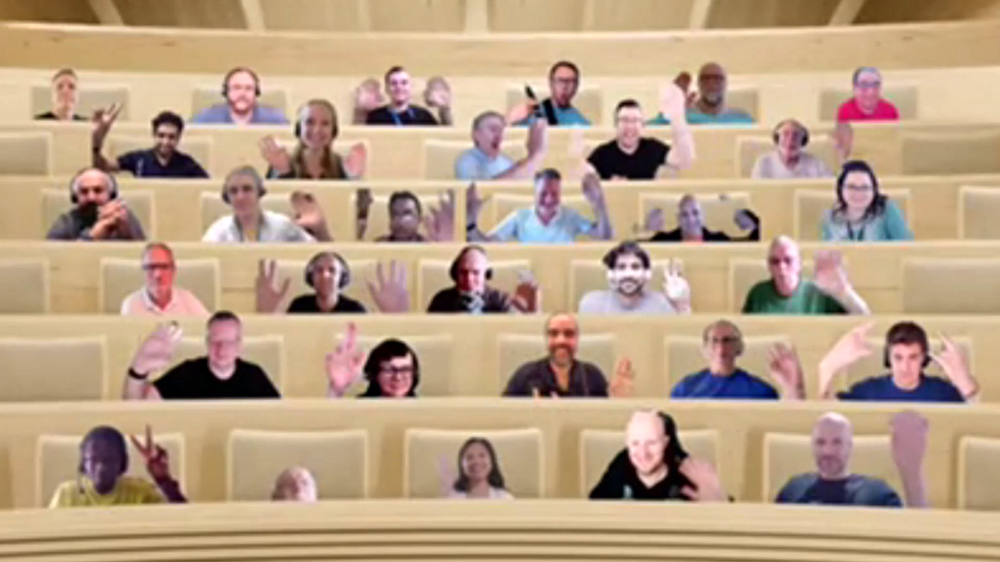

## Call summary

Welcome to the weekly call focused on capabilities of the Microsoft 365 and Power Platform.  In this call, we highlight recently announced and key existing developer resources, news, community events and one demo.

### Latest updates

* Announcements
    * Last call before summer break (for this call series only). This call will not take place from July 4th through August 15th. The weekly call will resume on August 22nd.
* News
    * Article - [New Microsoft Graph APIs for managing Microsoft Teams webinars](https://devblogs.microsoft.com/microsoft365dev/new-microsoft-graph-apis-for-managing-microsoft-teams-webinars/)
    * Article - [HackTogether: the Microsoft Teams Global Hack ends, but the developer journey continues!](https://devblogs.microsoft.com/microsoft365dev/hacktogether-the-microsoft-teams-global-hack-ends-but-the-developer-journey-continues/)
    * Article - [Fluid Framework 2.0 Alpha is now available](https://devblogs.microsoft.com/microsoft365dev/fluid-framework-2-0-alpha-is-now-available/)
    * Article - [Announcing Microsoft Graph Toolkit v3.0 release candidate](https://devblogs.microsoft.com/microsoft365dev/announcing-microsoft-graph-toolkit-v3-0-release-candidate/)
    * Article - [What’s new for Office Add-ins: Announcements from Build 2023](https://devblogs.microsoft.com/microsoft365dev/whats-new-for-office-add-ins-announcements-from-build-2023/)
    * Article - [Now in public preview: Collaborative notes in Microsoft Teams Meetings](https://techcommunity.microsoft.com/t5/microsoft-teams-blog/now-in-public-preview-collaborative-notes-in-microsoft-teams/ba-p/3848533)
    * Article - [What’s New for Microsoft Teams Rooms and Teams Meetings at InfoComm 2023](https://techcommunity.microsoft.com/t5/microsoft-teams-blog/what-s-new-for-microsoft-teams-rooms-and-teams-meetings-at/ba-p/3843949)
    * Article - [Microsoft Viva Pulse available for public preview](https://techcommunity.microsoft.com/t5/microsoft-viva-blog/microsoft-viva-pulse-available-for-public-preview/ba-p/3838338)
    * Article - [“The SharePoint experience” 🎙 – The Intrazone podcast](https://techcommunity.microsoft.com/t5/microsoft-sharepoint-blog/the-sharepoint-experience-the-intrazone-podcast/ba-p/3848507)
    * Article - [Experience the refreshed Power Automate mobile app for iOS – now generally available!](https://powerautomate.microsoft.com/blog/experience-the-refreshed-power-automate-mobile-app-for-ios-now-generally-available/)
    * Article - [Enhanced component properties](https://powerapps.microsoft.com/blog/enhanced-component-properties/)
* Conversations
    * Microsoft 365 PnP Weekly – Episode 215 (June 19th) with London-based Europe Workplace Value Realization Lead and Microsoft MVP - [Zoe Wilson](https://twitter.com/SharePoint_Zoe) (Avanade) \| @SharePoint_Zoe \| [video](https://pnp.github.io/blog/microsoft-365-pnp-weekly/episode-215/) \| [podcast](https://www.podbean.com/eas/pb-x9kti-14397ae)
    * Power Platform Connections - Angeliki Patsiavou Ep 16 (June 16th) \| [video](https://www.youtube.com/watch?v=XZLOECXotPE)
    * Microsoft 365 Developer Podcast – Syntex repository services with Reid Carlberg & Marc Windle (June 19th) \| [podcast](https://m365devpodcast.com/e/syntex-repository-services-with-reid-carlberg-marc-windle/)

### Demo

* **Introduction to Microsoft Graph Toolkit v3** – you may ask, so what’s new in v3.0.0-RC.3? Check out these infrastructure updates (support for Graph JS SDK v3.0, sovereign clouds and Node 14-16), styling updates (refreshed 100% components with Fluent UI), improved SPFx development (built-in disambiguation), new scenarios (theme toggle support, generic picker component, taxonomy picker, search box and search components), and improved scenarios (multi-account support, in-context (person card) sending messages).

The host of this call was [Vesa Juvonen](http://twitter.com/vesajuvonen) (Microsoft) \| @vesajuvonen. Q&A takes place in chat throughout the call.



## Agenda items

[00:00](https://youtu.be/LlFWaLTQ_II?t=0) – Intro

[08:49](https://youtu.be/LlFWaLTQ_II?t=529) – Latest updates – news across the Microsoft blogs – Fabian Williams (Microsoft) \| @fabianwilliams

[09:40](https://youtu.be/LlFWaLTQ_II?t=580) – Together mode picture

[11:30](https://youtu.be/LlFWaLTQ_II?t=690) – Demo - Introduction to Microsoft Graph Toolkit v3 – [Sébastien Levert](https://twitter.com/sebastienlevert) (Microsoft) \| @sebastienlevert

[44:15](https://youtu.be/LlFWaLTQ_II?t=2655) – Closing

Thank you for your creativity and work execution. Samples are often showcased in Demos.

## Together Mode

It’s pixilated photo day today! Thank you for participating in the call and having fun in the v-torium.

## Activities & Actions

* Agenda set for next [Microsoft 365 & Power Platform weekly call](https://aka.ms/m365-dev-call) - Tuesday, June 27th, 8:00 am PT.
    * Latest news from Microsoft engineering on Microsoft 365 topics
    * **Bob German** – Microsoft Teams App Camp New Adventure!
    * **Sébastien Levert** - Introduction to new Microsoft Graph Toolkit Search Components
    * **Paolo Pialorsi** - Securely consuming Azure Functions from Microsoft 365 solutions powered by SPFx
* ACT NOW – save €300 on tickets for the [European Power Platform Conference](https://www.sharepointeurope.com/european-power-platform-conference) – Dublin, 20-23 June
* 365 EduCon - Use promo code “Community” to save 25% off any pass type.
    * [Seattle](https://techcon365.com/Seattle/) – August 21-25, 2023 & PWR EduCon
    * [Chicago](https://techcon365.com/Chicago/) – October 30 – November 3, 2023
* Upcoming [Community Days](https://communitydays.org/) Events - aka.ms/communitydays
* [Rate this call](https://forms.office.com/pages/responsepage.aspx?id=v4j5cvGGr0GRqy180BHbR02h_1H9_XFFp4etSzu5JxFUOEc5UkxDN0dGMUgyOTBDVklBREJPRVI1Qi4u)’s content and let us know how we can improve \| aka.ms/community/calls/feedback Thanks!
* Request a Demo spot on the call \| <https://aka.ms/community/request/demo>
* Opt into the [PnP Recognition Program](https://aka.ms/m365pnp-recognition) \| aka.ms/m365pnp-recognition
* Community call agendas are published each week at aka.ms/community/meetup
* Register for upcoming [Sharing is Caring](https://pnp.github.io/sharing-is-caring/) events:
    * Maturity Model Practitioners \| *monthly* – 3rd Tuesday, 7am PST - [Register](https://forms.office.com/Pages/ResponsePage.aspx?id=KtIy2vgLW0SOgZbwvQuRaXDXyCl9DkBHq4A2OG7uLpdUODY3NVRFQ0E4SFg5WlI1TU83WFJQRklZSy4u)
    * PnP Office Hours – 1:1 session \| [Register](https://outlook.office365.com/owa/calendar/PnPSharingisCaring@warner.digital/bookings/)
    * PnP Buddy System \| [Request a Buddy](https://forms.office.com/Pages/ResponsePage.aspx?id=KtIy2vgLW0SOgZbwvQuRaXDXyCl9DkBHq4A2OG7uLpdUMjRRUVg4NElZUUJLTEY1TVVSVDJFRFpLRS4u)
* Register for the [Microsoft 365 Developer Program](https://aka.ms/m365/devprogram) and get a free developer tenant
* Get started with [free training modules](https://aka.ms/m365/dev/learn) covering Microsoft 365 platform capabilities.
* Visit the [Microsoft 365 Unified Sample Solution Gallery](https://adoption.microsoft.com/sample-solution-gallery) with more than 1600 + samples from Microsoft and community.
* Download the recurrent invite for this call – aka.ms/m365-dev-call

## Demo references

* **Introduction to Microsoft Graph Toolkit v3**
    * Tool - [Microsoft Graph Toolkit Playground – v3](https://mgt.dev)
    * Toolkit - aka.ms/mgt/ (click the Latest button under Releases in Right sidebar).

## General resources

* Archives - Microsoft 365 PnP Weekly - [Videos](https://www.youtube.com/playlist?list=PLR9nK3mnD-OVYI-St_CBiFfuL4CZbBpkC), [Podcasts](https://pnpweekly.podbean.com/)
* Microsoft Teams Toolkit | [https://aka.ms/teams-toolkit](https://aka.ms/teams-toolkit)
* Microsoft Graph Toolkit in Microsoft Learn | [https://aka.ms/learn-mgt](https://aka.ms/learn-mgt)
* Viva Connections [https://aka.ms/VivaConnections](https://aka.ms/VivaConnections)
* [SharePoint look book](https://lookbook.microsoft.com/?WT.mc_id=m365-24198-cxa)
* [Yo Teams video training package](https://aka.ms/yoteams-training)
* [.NET Standard 2.0 version of SharePoint Online CSOM API](https://developer.microsoft.com/microsoft-365/blogs/net-standard-version-of-sharepoint-online-csom-apis?WT.mc_id=m365-24198-cxa)
* [Microsoft 365 Platform Community (PnP) videos](https://aka.ms/m365/videos) | aka.ms/m365/videos
* [Microsoft Teams Toolkit for Visual Studio Code](https://marketplace.visualstudio.com/items?itemName=TeamsDevApp.ms-teams-vscode-extension)
* [yo Teams](https://aka.ms/yoteams) | aka.ms/yoteams
* [SPFx Developer documentation](https://aka.ms/spfx) | <https://aka.ms/spfx>
* [Microsoft 365 developer program site](https://developer.microsoft.com/office/dev-program?WT.mc_id=m365-24198-cxa) - Need to become a Tenant Admin to test look book capabilities? Get a Microsoft 365 E5 developer subscription - free tenant for 90 days with automatic renewal if used for dev purposes

## Recurrent call invites

* Microsoft 365 platform call \| *weekly* - Tuesday, 8:00 am PT – <https://aka.ms/m365-dev-call> (**Note:** This call will be on holiday from Tuesday July 4th through Tuesday August 15th) Back on August 22nd
* Microsoft 365 & Power Platform Dev call \| *bi-weekly* - Thursday, 7:00 am PT - <https://aka.ms/m365-dev-sig>
* Viva Connections & SharePoint Framework call \| *bi-weekly* - Thursday, 7:00 am PT - <https://aka.ms/spdev-spfx-call>
* Office add-in call \| *monthly* - 2nd Wednesday, 8:00 am PT - <https://aka.ms/officeaddinscall>
* Power Platform call \| *monthly* - 3rd Wednesday, 8:00 am PT - <https://aka.ms/PowerAppsMonthlyCall>

Microsoft 365 Platform community call focuses on latest Microsoft 365 Platform updates and demos delivered by Microsoft presenters and takes place weekly on Tuesday.  The alternating Special Interest Group community calls each Thursday focus on SharePoint Framework (client-side development/implementation) and Microsoft 365 Platform (includes Microsoft Teams, Bots, Microsoft Graph, CSOM, REST, site provisioning, PnP PowerShell, PnP Sites Core, Site Designs, Power Automate, PowerApps, Column Formatting, list formatting, etc. topics.) with demos commonly delivered by community members.

More details on the Microsoft 365 community from [https://aka.ms/m365pnp](https://aka.ms/sppnp).

You can download recurrent invite for this call from [https://aka.ms/m365-dev-call](https://aka.ms/m365-dev-call).  Welcome and join in the discussion. If you have any questions, comments, or feedback, feel free to provide your input as comments to this post as well. More details on the Microsoft 365 community and options to get involved are available from [https://aka.ms/m365pnp](https://aka.ms/sppnp).

&quot;*Sharing is caring&quot;*

*Microsoft 365 Platform Community team, Microsoft - 20th of June 2023*
