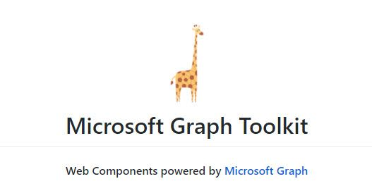

Microsoft 365 Patterns and Practices (PnP) Community March 2021 update
is out with a summary of the latest guidance, samples, and solutions
from Microsoft or from the community for the community. This article is
a summary of all the different areas and topics around the community
work we do around Microsoft 365 ecosystem during the past month. Thank
you for being part of this success. *Sharing is caring!*

## What is Microsoft 365 Community (PnP) 

[Microsoft 365 PnP](https://aka.ms/m365pnp) is a nick-name for Microsoft
365 Community activities coordinated by numerous teams inside of the
Microsoft 365 engineering organizations. PnP is a community-driven open
source initiative where Microsoft and external community members are
sharing their learning's around implementation practices for Microsoft
365. Topics vary from Microsoft Graph, Microsoft Teams, OneDrive and
SharePoint. Active development and contributions happen in GitHub by
providing contributions to the samples, reusable components, and
documentation for different areas. PnP is owned and coordinated by
Microsoft engineering, but this is work done by the community for the
community.

-   See more details from [New Microsoft 365 Patterns and Practices
    (PnP) team model with new community
    leads](https://developer.microsoft.com/microsoft-365/blogs/new-microsoft-365-patterns-and-practices-pnp-team-model-with-new-community-leads/)
The initiative is facilitated by Microsoft, but we have multiple
community members as part of the PnP team (see team details in end of
the article) and we are always looking to extend the PnP team with more
community members. Notice that since this is open source community
initiative, so there's no SLAs for the support for the samples provided
through GitHub. Obviously, all officially released components and
libraries are under official support from Microsoft.
Some key statistics around [Microsoft 365 PnP
initiative](https://aka.ms/m365pnp) from February 2021:
-   Unique visitors during the past 2 weeks in
    [PnP](https://github.com/pnp),
    [OneDrive](https://github.com/onedrive),
    [Microsoft-Search](https://github.com/microsoft-search),
    [OfficeDev](https://github.com/officedev) and [SharePoint GitHub
    organization](http://github.com/sharepoint) repositories - 71,936
-   Overall unique contributors in the [PnP](https://github.com/pnp),
    [OneDrive](https://github.com/onedrive),
    [Microsoft-Search](https://github.com/microsoft-search),
    [OfficeDev](https://github.com/officedev) and
    [SharePoint](https://github.com/sharepoint) GitHub organizations -
    1,782
-   Merged pull requests across [PnP](https://github.com/pnp),
    [OneDrive](https://github.com/onedrive),
    [Microsoft-Search](https://github.com/microsoft-search),
    [OfficeDev](https://github.com/officedev) and
    [SharePoint](https://github.com/sharepoint) repositories
    (cumulative) - 20,423
-   Closed issues and enhancements ideas cross
    [PnP](https://github.com/pnp),
    [OneDrive](https://github.com/onedrive), [Microsoft-Search](https://github.com/microsoft-search),
    [OfficeDev](https://github.com/officedev) and
    [SharePoint](https://github.com/sharepoint) repositories
    (cumulative) - 20,724
-   [Microsoft 365 Community (PnP) YouTube
    channel](https://aka.ms/sppnp-videos) had 79,339 views with 6,165
    hours of watch time and 20,921 subscribers
-   [Microsoft 365 Developer YouTube
    channel](https://www.youtube.com/channel/UCV_6HOhwxYLXAGd-JOqKPoQ)
    had 38,802 views with 3,006 hours of watch time and 12,671
    subscribers
Most viewed videos in the [Microsoft 365 Community (PnP) YouTube
channel](https://aka.ms/m365pnp-videos) during February 2021:

1.  [Getting started with Site Designs in SharePoint
    Online](https://www.youtube.com/watch?v=ZjTnlbMJZfY) - [Laura
    Kokkarinen](https://twitter.com/laurakokkarinen) (Sulava) | 3,845
2.  [Working with Microsoft Lists
    (webinar)](https://www.youtube.com/watch?v=HyBD_SOt_BQ) - Harini
    Saladi, [Miceile Barrett](https://twitter.com/MSFTMiceile),
    [Chakkaradeep Chandran](https://twitter.com/chakkaradeep) and [Mark
    Kashman](https://twitter.com/mkashman) | 3,631
3.  [Architecting Your
    Intranet](https://www.youtube.com/watch?v=8jPzjNlf3bM) | [Melissa
    Torres](https://twitter.com/Meltorac) (Microsoft) | 2,278
4.  [SharePoint Monthly Community Call - February
    2021](https://www.youtube.com/watch?v=TQ9WhueZI-w) | 1,795
5.  [SharePoint Framework Tutorial 1 - HelloWorld
    WebPart](https://www.youtube.com/watch?v=_O2Re5uRLoo) | 1,764
6.  [SharePoint App Bar - Global navigation and
    wayfinding](https://www.youtube.com/watch?v=fz7PK3ufFJM) | [Melissa
    Torres](https://twitter.com/Meltorac) (Microsoft) | 1,706
7.  [Configure list custom header, footer and the form body with
    JSON](https://www.youtube.com/watch?v=RDapqO4opbI) | [Chris
    Kent](https://twitter.com/theChrisKent) (DMI) | 1,588
8.  [Introducing: New Employee Onboarding - a Microsoft Teams app
    template](https://www.youtube.com/watch?v=-S_lHXWEobk) | [Nidhi
    Sharma](https://twitter.com/nidsonbirdie) (Microsoft) | 1,585
9.  [Migration to SharePoint, OneDrive, and Microsoft Teams in Microsoft
    365, free and easy](https://www.youtube.com/watch?v=Tf3Yp2megmA) -
    [Hani Loza](https://twitter.com/HaniLoza) (Microsoft) & [Eric
    Warnke](https://twitter.com/EricWarnke) (Microsoft) | 1,578
10. [Latest on Power Automate integration within SharePoint
    Online](https://www.youtube.com/watch?v=AaWB3xlhJdc) |
    [Chakkaradeep Chandran](https://twitter.com/chakkaradeep)
    (Microsoft) | 1,534
Most viewed videos in the [Microsoft 365 Developer YouTube
channel](https://www.youtube.com/channel/UCV_6HOhwxYLXAGd-JOqKPoQ)
during February 2021:

1.[Authenticate and connect with Microsoft Graph - June
    2019](https://www.youtube.com/watch?v=xWhyG-SuyQM) | 1,299
2.  [Build Outlook Add-ins that integrate your solution seamlessly into
    your users' Outlook
    experience](https://www.youtube.com/watch?v=Dd4SOA5dUmw)​ | Juan
    Balmori, Hitesh Manwar - 1,213
3.  [An introduction to Microsoft Graph for developers - Part I -
    Getting started - October
    2019](https://www.youtube.com/watch?v=EBbnpFdB92A) | 1,044
4.  [Getting Started with Microsoft Graph and Application
    Registration](https://www.youtube.com/watch?v=93j0MmRruFo) | 896
5.  [Build and Office add-in using modern JavaScript tools and
    technologies](https://www.youtube.com/watch?v=Aszwh_h5MtM) | 838
6.  [Create interactive conversational bots for Microsoft
    Teams](https://www.youtube.com/watch?v=zSIysk0yL0Q) | 828
7.  [Develop multi-tenant applications with Microsoft Identity
    Platform - April 2020](https://www.youtube.com/watch?v=B416AxHoMJ4)
    | 763
8.  [SharePoint Site Collection Level
    Permissions](https://www.youtube.com/watch?v=wcJRQDsXMQ8) | 657
9.  [Microsoft identity platform: Getting Started with Microsoft
    identity](https://www.youtube.com/watch?v=3VgHZtjFSPk) | 644
10. [Getting Started with Microsoft
    Graph](https://www.youtube.com/watch?v=PI9NO5rayiY) | 644
Main resources around Microsoft 365 Community:

-   Microsoft 365 Community -
    [https://aka.ms/m365pnp](https://aka.ms/sppnp) - One location for all
    the resources and news around PnP
-   Microsoft 365 community blog - 
    <https://aka.ms/m365pnp/community/blog>
-   Microsoft 365 development blog -  <https://aka.ms/m365pnp-blog>
-   Microsoft 365 Community Channel on YouTube -
    [https://aka.ms/m365pnp-videos](https://aka.ms/m365pnp-Videos)
-   Microsoft 365 Developer YouTube channel -
    <https://aka.ms/M365DevYouTube>

## Latest Dev Blog posts 

Here are the latest blog posts and announcements around Microsoft 365
development topics from
<https://developer.microsoft.com/microsoft-365/blogs>.

-   8th of March - [Microsoft Graph Toolkit adds a new Electron Provider
    plus enhanced
    capabilities](https://developer.microsoft.com/microsoft-365/blogs/microsoft-graph-toolkit-adds-a-new-electron-provider-plus-enhanced-capabilities/)
-   4th of March - [What's new for Excel add-ins developers in
    2021](https://developer.microsoft.com/microsoft-365/blogs/whats-new-for-excel-add-ins-developers-in-2021/) 
-   4th of March - [Office Add-ins partner Sheetgo integrates Excel's
    extensibility
    features](https://developer.microsoft.com/microsoft-365/blogs/sheetgo-excel-add-in/)
-   2nd of March - [What's new for Microsoft 365 and Teams Platform @
    Ignite
    2021](https://developer.microsoft.com/microsoft-365/blogs/whats-new-for-microsoft-365-and-teams-platform-ignite-2021/)
-   23rd of February - [Microsoft Graph Mailbag -- Intro to Microsoft
    Graph and Top 5 API
    Requests](https://developer.microsoft.com/microsoft-365/blogs/microsoft-graph-mailbag-intro-to-microsoft-graph-and-top-5-api-requests/)
-   11th of February - [Controlling app access on a specific SharePoint
    site collections is now available in Microsoft
    Graph](https://developer.microsoft.com/microsoft-365/blogs/controlling-app-access-on-specific-sharepoint-site-collections/)
-   11th of February - [Announcing Microsoft Teams App Generator (Yo
    Teams) version
    3](https://developer.microsoft.com/microsoft-365/blogs/announcing-microsoft-teams-app-generator-yo-teams-version-3/)
-   9th of February - [Microsoft Graph Mailbag -- Blazor Web Assembly
    and Microsoft Graph with Azure
    Functions](https://developer.microsoft.com/microsoft-365/blogs/microsoft-graph-mailbag-blazor-web-assembly-and-microsoft-graph-with-azure-functions/)
-   9th of February - [Microsoft 365 Community (PnP) -- February 2021
    update](https://developer.microsoft.com/microsoft-365/blogs/microsoft-365-community-pnp-february-2021-update/)
-   5th of February - [Basic Authentication and Exchange Online --
    February 2021
    Update ](https://developer.microsoft.com/microsoft-365/blogs/basic-authentication-and-exchange-online-february-2021-update/)
-   5th of February - [Application Access Policy Support Added to
    Exchange Web Services in Exchange
    Online](https://developer.microsoft.com/microsoft-365/blogs/application-access-policy-support-added-to-exchange-web-services/)
-   5th of February - [Use the shared JavaScript runtime to improve the
    UI experience of your Office
    Add-in](https://developer.microsoft.com/microsoft-365/blogs/use-the-shared-javascript-runtime-to-improve-the-ui-experience-of-your-office-add-in/)
-   5th of February - [Basic Authentication and Exchange Online --
    February 2021
    Update ](https://developer.microsoft.com/microsoft-365/blogs/basic-authentication-and-exchange-online-february-2021-update/)
-   5th of February - [Application Access Policy Support Added to
    Exchange Web Services in Exchange
    Online](https://developer.microsoft.com/microsoft-365/blogs/application-access-policy-support-added-to-exchange-web-services/)
-   5th of February - [Use the shared JavaScript runtime to improve the
    UI experience of your Office
    Add-in](https://developer.microsoft.com/microsoft-365/blogs/use-the-shared-javascript-runtime-to-improve-the-ui-experience-of-your-office-add-in/)
-   5th of February - [Announcing the public preview of Microsoft Graph
    Java SDK
    v3](https://developer.microsoft.com/microsoft-365/blogs/announcing-the-public-preview-of-microsoft-graph-java-sdk-v3/)
-   4th of February - [Use UI Automation custom properties to customize
    your assistive technologies to Office
    applications](https://developer.microsoft.com/microsoft-365/blogs/use-ui-automation-custom-properties-to-customize-your-assistive-technologies-to-office-applications/)
-   4th of February - [New Microsoft 365 Patterns and Practices (PnP)
    team members -- February
    2021](https://developer.microsoft.com/microsoft-365/blogs/new-microsoft-365-patterns-and-practices-pnp-team-members-february-2021/)
-   2nd of February - [Best practices and updates for bot lifecycle
    events in Microsoft
    Teams](https://developer.microsoft.com/microsoft-365/blogs/best-practices-and-updates-for-bot-lifecycle-events-in-microsoft-teams/)
-   2nd of February - [General Availability of the new PnP Framework
    library for automating SharePoint Online
    operations](https://developer.microsoft.com/microsoft-365/blogs/general-availability-of-the-new-pnp-framework-library-for-automating-sharepoint-online-operations/)
Community call recording blog posts:
-   4th of March - [Microsoft 365 PnP -- General Developer SIG recording
    -- 4th of March,
    2021](https://developer.microsoft.com/microsoft-365/blogs/microsoft-365-pnp-general-developer-sig-recording-4th-of-march-2021/)
-   25th of February - [SharePoint Framework Community Call Recording --
    25th of February,
    2021](https://developer.microsoft.com/microsoft-365/blogs/sharepoint-framework-community-call-recording-25th-of-february-2021/)
-   25th of February - [Office Add-ins community call--February 10,
    2021](https://developer.microsoft.com/microsoft-365/blogs/office-add-ins-community-call-february-10-2021/)
-   19th of February - [Microsoft Teams community call-January 19,
    2021](https://developer.microsoft.com/microsoft-365/blogs/microsoft-teams-community-call-january-19-2020/) 
-   18th of February - [Microsoft 365 PnP -- General Developer SIG
    recording -- 18th of February,
    2021](https://developer.microsoft.com/microsoft-365/blogs/microsoft-365-pnp-general-developer-sig-recording-18th-of-february-2021/)
-   11th of February - [SharePoint Framework Community Call Recording --
    11th of February,
    2021](https://developer.microsoft.com/microsoft-365/blogs/sharepoint-framework-community-call-recording-11th-of-february-2021/)
-   9th of February - [SharePoint monthly community call -- February 9,
    2021](https://developer.microsoft.com/microsoft-365/blogs/sharepoint-monthly-community-call-february-9-2021/)
-   5th of February - [Microsoft Graph community call-February 2,
    2021](https://developer.microsoft.com/microsoft-365/blogs/microsoft-graph-community-call-february-2-2021/)
-   5th of February - [Microsoft 365 PnP -- General Developer SIG
    recording -- 4th of February,
    2021](https://developer.microsoft.com/microsoft-365/blogs/microsoft-365-pnp-general-developer-sig-recording-4th-of-february-2021/)
PnP Weekly video blog / podcast shows:
-   9th of March - [Microsoft 365 PnP Weekly -- Episode
    117](https://techcommunity.microsoft.com/t5/microsoft-365-pnp-blog/microsoft-365-pnp-weekly-episode-117/ba-p/2193707)
-   2nd of March - [Microsoft 365 PnP Weekly -- Episode
    116](https://pnp.github.io/blog/microsoft-365-pnp-weekly/episode-116/)
-   23rd of February - [Microsoft 365 PnP Weekly -- Episode
    115](https://pnp.github.io/blog/microsoft-365-pnp-weekly/episode-115/)
-   16th of February - [Microsoft 365 PnP Weekly -- Episode
    114](https://pnp.github.io/blog/microsoft-365-pnp-weekly/episode-114/)
-   8th of February - [Microsoft 365 PnP Weekly -- Episode
    113](https://pnp.github.io/blog/microsoft-365-pnp-weekly/episode-113/) 
-   2nd of February - [Microsoft 365 PnP Weekly -- Episode
    112](https://pnp.github.io/blog/microsoft-365-pnp-weekly/microsoft-365-pnp-weekly-episode-112/)
We highly recommend also subscribing on the [Microsoft 365 Developer
Podcast show](https://www.m365devpodcast.com/), which is a great show
covering also latest development in the Microsoft 365 platform from
developer and extensibility perspective.

## Community Calls 

There are numerous different community calls on different areas. All
calls are being recorded and published either from [Microsoft 365
Developer](https://www.youtube.com/channel/UCV_6HOhwxYLXAGd-JOqKPoQ) or
[Microsoft 365 Community (PnP)
YouTube](https://www.youtube.com/channel/UC_mKdhw-V6CeCM7gTo_Iy7w)
channels. Recordings are typically released within the following 24
hours after the call. You can find a detailed agenda and links to
specific covered topics on blog post articles at the [Microsoft 365
developer blog](https://aka.ms/spdev-blog) when the videos are published.

-   Adaptive Cards  <https://aka.ms/adaptivecardscommunitycall> -
    Updates and news around Adaptive Cards with live demos
-   Microsoft Graph  <https://aka.ms/microsoftgraphcall> - Updates and
    news from Microsoft Graph with live demos
-   Microsoft identity platform 
    <https://aka.ms/IDDevCommunityCalendar> - Latest on the identity
    side
-   Microsoft Teams  <https://aka.ms/microsoftteamscommunitycall> -
    Microsoft Teams monthly update with live demos
-   Office Add-ins  <https://aka.ms/officeaddinscommunitycall> - News
    and community work around Office add-ins with live demos
-   Power Apps   <https://aka.ms/PowerAppsMonthlyCall> - Monthly summary
    on Power Apps community with live demos
-   SharePoint   <https://aka.ms/spdev-call> - Consists of the latest
    news, providing credits for all community contributors and live
    demos typically by SharePoint engineering.
-   M365 General Dev SIG    <https://aka.ms/spdev-sig-call>  -
    Bi-weekly - General topics on Microsoft 365 Dev from various
    aspects - Microsoft Teams, Microsoft Graph Toolkit, Provisioning,
    Automation, Scripting, Power Automate, Solution design
-   SharePoint Framework SIG  <https://aka.ms/spdev-spfx-call> -
    Bi-weekly - Consists of topics around SharePoint Framework and
    JavaScript-based development in the Microsoft Teams and in
    SharePoint platform.
If you are interested in doing a live demo of your solution or sample in
these calls, please do reach out to the PnP  Team members (contacts
later in this post) and they are able to help with the right setup.
These are great opportunities to gain visibility for example for
existing MVPs, for community members who would like to be MVPs in the
future or any community member who'd like to share some of their
learnings.

## Microsoft 365 Community (PnP) Ecosystem in GitHub 

Most of the community driven repositories are in the [PnP GitHub
organization](https://github.com/pnp) as samples are not product
specifics as they can contain numerous different solutions or the
solution works in multiple different applications.

-   [PnPjs](https://github.com/pnp/pnpjs) - PnPjs Framework repository
-   [CLI Microsoft
    365](https://pnp.github.io/cli-microsoft365/) - Cross-OS command
    line interface to manage Office 365 tenant settings
-   [generator-spfx](https://github.com/pnp/generator-spfx) -
    Open-source Yeoman generator which extends the out-of-the-box Yeoman
    generator for SharePoint with additional capabilities
-   [generator-teams](https://github.com/pnp/generator-teams) -
    Open-source Microsoft Teams Yeoman generator - Bots, Messaging
    Extensions, Tabs, Connectors, Outgoing Web hooks and more
-   [teams-dev-samples](https://github.com/pnp/teams-dev-samples/) -
    Microsoft Teams targeted samples from community and Microsoft
    engineering
-   [Sharing is Caring](https://github.com/pnp/sharing-is-caring) -
    Getting started on learning how to contribute and be active on the
    community from GitHub perspective.
-   [pnpcore](https://github.com/pnp/pnpcore) - The PnP Core SDK is an
    SDK designed to work against Microsoft 365 with Microsoft Graph API
    first approach
-   [powershell](https://github.com/pnp/powershell) -  PnP PowerShell
    module which is PowerShell Core module targeted for Microsoft 365
-   [pnpframework](https://github.com/pnp/pnpframework) - PnP Framework
    is a .Net Standard 2.0 library targeting Microsoft 365 containing
    the PnP Provisioning engine and a ton of other useful extensions
-   <https://github.com/pnp/teams-dev-samples> - Samples around the
    Microsoft Teams development models from Microsoft and from the
    community
-   [sp-dev-fx-webparts](https://github.com/SharePoint/sp-dev-fx-webparts) -
    Client-side web part samples from community and Microsoft
    engineering
-   [sp-dev-fx-extensions](https://github.com/SharePoint/sp-dev-fx-extensions) -
    Samples and tutorial code around SharePoint Framework Extensions
-   [sp-dev-fx-library-components](https://github.com/SharePoint/sp-dev-fx-library-components) -
    Samples and tutorial code around the SharePoint Framework library
    components
-   [sp-starter-kit](https://github.com/SharePoint/sp-starter-kit) -
    Starter kit solution for SharePoint modern experiences
-   [sp-dev-fx-vs-extension](https://github.com/SharePoint/sp-dev-fx-vs-extension) -
    Open source Visual Studio IDE extension for creating SharePoint
    Framework solutions in the Visual Studio 2015 or 2017
-   [sp-dev-build-extensions](https://github.com/SharePoint/sp-dev-build-extensions) - Different
    build extensions like gulp tasks and gulp plugins from the community
    and engineering around SharePoint development
-   [sp-dev-solutions](https://github.com/SharePoint/sp-dev-solutions) -
    Repository for more polished and fine-tuned reusable solutions build
    with SharePoint Framework
-   [sp-dev-samples](https://github.com/SharePoint/sp-dev-samples) -
    Repository for other samples related on the SharePoint development
    topics - WebHooks etc.
-   [sp-dev-fx-controls-react](https://github.com/SharePoint/sp-dev-fx-controls-react) - Reusable
    content controls for SharePoint Framework solutions build with React
-   [sp-dev-fx-property-controls](https://github.com/SharePoint/sp-dev-fx-property-controls) -
    Reusable property pane controls to be used in web parts
-   [sp-dev-list-formatting](https://github.com/SharePoint/sp-dev-column-formatting) -
    Open-source community-driven repository for the column and view
    formatting JSON definitions
-   [sp-dev-site-scripts](https://github.com/SharePoint/sp-dev-site-scripts) -
    Open-source community-driven repository for community Site Designs
    and Site Scripts
-   [sp-dev-modernization](https://github.com/SharePoint/sp-dev-modernization) -
    Tooling and guidance around modernizing SharePoint from classic to
    modern
-   [sp-power-platform-solutions](https://github.com/SharePoint/sp-power-platform-solutions) -
    Solution and sample code for SharePoint Power Platform solutions
-   [powerfx-samples](https://github.com/pnp/powerfx-samples) - Samples
    that demonstrate different usage patterns for the Power Fx low-code
    programming language\
All SharePoint specific repositories or services supported directly by
Microsoft are located in the SharePoint GitHub organization\
\

-   [sp-dev-docs](https://github.com/SharePoint/sp-dev-docs) - Source
    for new SharePoint dev center documentation exposed from
    [http://docs.microsoft.com/sharepoint/dev](http://docs.microsoft.com/sharepoint/dev/)
-   [sp-dev-provisioning-templates](https://github.com/SharePoint/sp-dev-provisioning-templates) -
    Open-source templates used by the [SharePoint Look Book
    site](https://lookbook.microsoft.com/)
-   [sp-provisioning-service](https://github.com/SharePoint/sp-provisioning-service) -
    Source code of the [SharePoint look book
    site](https://lookbook.microsoft.com/)
PnP specific repositories - solution designs and tooling
-   [PnP](https://github.com/sharepoint/pnp) - Main repository for SP
    add-in, Microsoft Graph etc. samples
-   [PnP-Sites-Core](https://github.com/sharepoint/PnP-Sites-Core) -
    Office Dev PnP Core component
-   [PnP-PowerShell](https://github.com/sharepoint/PnP-PowerShell) -
    Office Dev PnP PowerShell Cmdlets
-   [PnP-Tools](https://github.com/sharepoint/PnP-Tools) - Tools and
    scripts targeted more for IT Pro's and for on-premises for SP2013
    and SP2016
-   [PnP-Provisioning-Schema](https://github.com/sharepoint/PnP-provisioning-schema) -
    PnP Provisioning engine schema repository
-   [PnP-IdentityModel](https://github.com/SharePoint/PnP-IdentityModel) -
    Open source replacement of Microsoft.IdentityModel.Extensions.dll
Repositories in the GitHub [Microsoft
Search](https://github.com/microsoft-search) organization controlled by
the PnP initiative
-   [pnp-modern-search](https://github.com/microsoft-search/pnp-modern-search)
    -  Home of PnP Modern Search solutions, see more from the
    [documentation](https://microsoft-search.github.io/pnp-modern-search/)
Other related resources from GitHub
-   [Microsoft Graph
    Toolkit](https://github.com/microsoftgraph/microsoft-graph-toolkit)
    in GitHub - Community contributions welcome!
-   [Office add-in Patterns and Practices in
    GitHub](https://github.com/OfficeDev/PnP-OfficeAddins) - Community
    contributions welcome!
-   [Microsoft Graph](https://github.com/microsoftgraph) GitHub
    organization
-   [OfficeDev GitHub organization](https://github.com/officedev) -
    Includes all Microsoft Teams samples from Microsoft\
    \

## What's supportability story around PnP material? 

Following statements apply across all of the community lead and
contributed samples and solutions, including samples, core component(s)
and solutions, like [SharePoint Starter
Kit](https://github.com/SharePoint/sp-starter-kit) or [PnP
PowerShell](https://docs.microsoft.com/powershell/sharepoint/sharepoint-pnp/sharepoint-pnp-cmdlets?view=sharepoint-ps).
All Microsoft released SDKs and tools are supported based on the
specific tool policies

-   PnP guidance and samples are created by Microsoft & by the Community
-   PnP guidance and samples are maintained by Microsoft & community
-   PnP uses supported and recommended techniques
-   PnP is an open-source initiative by the community -- people who work
    on the initiative for the benefit of others, have their normal day
    job as well
-   PnP is NOT a product and therefore it's not supported by Premier
    Support or other official support channels
-   PnP is supported in similar ways as other open source projects done
    by Microsoft with support from the community by the community
-   There are numerous partners that utilize PnP within their solutions
    for customers. Support for this is provided by the Partner. When PnP
    material is used in deployments, we recommend being clear with your
    customer/deployment owner on the support model
Please see the specifics on the supportability on the tool, SDK or 
component repository or download page.

## Microsoft 365 PnP team model 

In April 2020 we announced our new [Microsoft 365 PnP team
model](https://developer.microsoft.com/microsoft-365/blogs/new-microsoft-365-patterns-and-practices-pnp-team-model-with-new-community-leads/)
and grew the MVP team quite significantly. PnP model exists for having
more efficient engagement between Microsoft engineering and community
members. Let's build things together. Your contributions and feedback
is always welcome! During August, we also crew the team with 5 new
members. PnP Team coordinates and leads the different open-source and
community efforts we execute in the Microsoft 365 platform.
We welcome all community members to get involved on the community and
open-source efforts. Your input do matter!

-   [New Microsoft 365 Patterns and Practices (PnP) team members -
    February
    2021](https://developer.microsoft.com/microsoft-365/blogs/new-microsoft-365-patterns-and-practices-pnp-team-members-february-2021/)
-   [New Microsoft 365 Patterns and Practices (PnP) team members -
    December
    2020](https://developer.microsoft.com/microsoft-365/blogs/new-microsoft-365-patterns-and-practices-pnp-team-members-2/)
-   [New Microsoft 365 Patterns and Practices (PnP) team members -
    August
    2020](https://developer.microsoft.com/microsoft-365/blogs/new-microsoft-365-patterns-and-practices-pnp-team-members/)
Got feedback, suggestions or ideas? - Please let us know. Everything we
do in this program is **for your benefit**. Feedback and ideas are more
than welcome so that we can adjust the process for benefitting you even
more.

## Area-specific updates 

These are different areas which are closely involved on the community
work across the PnP initiative. Some are lead and coordinated by
engineering organizations, some are coordinated by the community and
MVPs.

### Microsoft Graph Toolkit 

Microsoft Graph Toolkit is engineering lead initiative, which works
closely with the community on the open-source areas. The Microsoft Graph
Toolkit is a collection of reusable, framework-agnostic web components
and helpers for accessing and working with Microsoft Graph. The
components are fully functional right of out of the box, with built in
providers that authenticate with and fetch data from Microsoft Graph.

-   Latest version currently is 2.1. See the v2.1 announcement blog post
    for more details - [Microsoft Graph Toolkit adds a new Electron
    Provider plus enhanced
    capabilities](https://developer.microsoft.com/microsoft-365/blogs/microsoft-graph-toolkit-adds-a-new-electron-provider-plus-enhanced-capabilities/?_cache_bypass=1615242299)
-   [mgt.dev](https://mgt.dev/?path=/story/components-mgt-agenda--simple) -
    Microsoft Graph Toolkit Playground
-   [Getting started with Microsoft Graph Toolkit guidance
    video](https://www.youtube.com/watch?v=TbAZHvB5NEk) from developer
    community call by [Beth Pan](https://twitter.com/beth_panx)
    (Microsoft)
All the latest updates on the Microsoft Graph Toolkit is being presented
in our bi-weekly Microsoft 365 Generic Dev community call, including the
latest community contributors.

### Microsoft 365 Community docs 

Community docs model was announced in the April 2020 and it's great to
see the interest for community to help each other by providing new
guidance on the non-dev areas. See more on the announcement from the
SharePoint blog - [Announcing the Microsoft 365 Community
Docs](https://techcommunity.microsoft.com/t5/microsoft-sharepoint-blog/announcing-the-microsoft-365-community-docs/ba-p/1288203).
We do welcome contributions from the community - our objective is to
build a valuable location for articles from Microsoft and community
together.

Latest updates on this area as follows:

-   New article by [Waldek Mastykarz](https://blog.mastykarz.nl/)
    (Microsoft) - What kind of apps can you build on Microsoft 365?
-   New article by [Emily
    Mancini](https://www.linkedin.com/in/eemancini/) (Sympraxis
    Consulting) - Elevating Communication
-   New article by [Emily
    Mancini](https://www.linkedin.com/in/eemancini/) (Sympraxis
    Consulting) - How can I use Learning Pathways in my organization?
-   Updated article by [Ganesh
    Sanap](https://www.linkedin.com/in/ganeshsanap/) and [Christophe
    Humbert](https://www.linkedin.com/in/pathtosharepoint/) - [Follow
    Microsoft 365 on Social
    Media](https://github.com/MicrosoftDocs/microsoft-365-community/blob/master/Community/microsoft-365-on-social-media.md "https://github.com/microsoftdocs/microsoft-365-community/blob/master/community/microsoft-365-on-social-media.md")
-   Updated article by Luise Freese - [Should everyone create Teams? A
    Low Code Provisioning
    solution](https://github.com/MicrosoftDocs/microsoft-365-community/blob/master/Community/should-everyone-create-teams.md "https://github.com/microsoftdocs/microsoft-365-community/blob/master/community/should-everyone-create-teams.md")
-   Updated article by Marc Anderson (Sympraxis Consulting) - [Maturity
    Model for Microsoft 365 -
    Introduction](https://github.com/MicrosoftDocs/microsoft-365-community/blob/master/Community/microsoft365-maturity-model--intro.md "https://github.com/microsoftdocs/microsoft-365-community/blob/master/community/microsoft365-maturity-model--intro.md")
Have ideas for articles or want to contribute yourself? - Get involved!
Here are also some additional resources explaining the model more
detailed.

-   [Updates on the Microsoft 365 Community Docs - June
    2020](https://techcommunity.microsoft.com/t5/microsoft-sharepoint-blog/updates-on-the-microsoft-365-community-docs-june-2020/ba-p/1488693)
-   YouTube - [Introducing Microsoft 365 Community
    Docs](https://www.youtube.com/watch?v=HTbgjWvsh3k)
-   [GitHub issue
    list](https://github.com/MicrosoftDocs/microsoft-365-community/issues)
    with articles ideas

### SharePoint Framework development samples

These are the updated SharePoint Framework samples which are available
from the the different repositories.

-   New
    sample r[eact-list-search](https://github.com/pnp/sp-dev-fx-webparts/tree/master/samples/react-list-search)
    by [Alberto Gutiérrez](https://twitter.com/albertogperez) (Minsait)
    to show data from lists and to search information in the lists
-   New sample
    [react-staffdirectory](https://github.com/pnp/sp-dev-fx-webparts/tree/master/samples/react-staffdirectory)
    by [João Mendes](https://twitter.com/joaojmendes) (Storm
    Technology) shows the current user's colleagues, and allows the
    user to search AD directory.
-   New
    sample [react-datatable](https://github.com/pnp/sp-dev-fx-webparts/tree/master/samples/react-datatable)
    by [Chandani Prajapati](https://twitter.com/Chandani_SPD) as a web
    part that provides easy way to render SharePoint custom list in
    datatable view with all the necessary features
-   New
    sample [react-command-demote-news](https://github.com/pnp/sp-dev-fx-extensions/tree/master/samples/react-command-demote-news)
    by [Mikael Svenson](https://twitter.com/mikaelsvenson) (Microsoft)
    as SharePoint Framework list view command set extension to demote a
    previously promoted News page
-   New
    sample [react-command-convert-to-pdf](https://github.com/pnp/sp-dev-fx-extensions/tree/master/samples/react-command-convert-to-pdf)
    by [Mikael Svenson](https://twitter.com/mikaelsvenson) (Microsoft)
    that allows to convert one or more document in-place to PDF or
    download documents as PDF.
-   New sample
    r[eact-teams-message-user](https://github.com/pnp/sp-dev-fx-webparts/tree/master/samples/react-teams-message-user)
    by [David Ramalho](https://twitter.com/davRamalho) (Storm
    Technology) on sending a message to Microsoft Teams using a
    SharePoint framework solution using Microsoft Graph
-   Updates to numerous SPFx web part and extension samples by our
    awesome community memebers!
How to find what's relevant for you? Take advantage of our SharePoint
Framework web part and extension sample galleries - includes also
solutions which work in Microsoft Teams
-   Web Part sample gallery - <https://aka.ms/spfx-webparts>
-   Extensions sample gallery - <https://aka.ms/spfx-extensions>

### Microsoft Teams community samples

These are samples which have been contributed on the community samples
since last summary. We do welcome all Microsoft Teams samples to this
gallery. They can be implemented using in any technology.

-   New
    [sample bot-b2c-chat-bot](https://github.com/pnp/teams-dev-samples/tree/master/samples/bot-b2c-chat-bot)
    by Abtin Amini, Sathya Raveendran, Saikrishna Neeli and Arun Kumar
    Anaparthi on building a Business to Citizen Consumer Communication
    Bot
-   Updates
    to [tab-sso](https://github.com/pnp/teams-dev-samples/tree/master/samples/tab-sso/src/nodejs)
    to by [Doğan Erişen](https://github.com/derisen) to add MSAL.js
    support for signle sign on experience 
If you are interested on Microsoft Teams samples, we have just released
also new [Microsoft Teams sample gallery](https://aka.ms/teams-samples).
Contributions to [Microsoft Teams
samples](https://github.com/pnp/teams-dev-samples) is also more than
welcome. This gallery already surfaces all Microsoft samples, [Microsoft
Teams app
templates](https://docs.microsoft.com/microsoftteams/platform/samples/app-templates)
and community samples.

### Sharing is Caring initiative 

The "Sharing Is Caring" imitative is targeted for learning the basics
around making changes in Microsoft Docs, in GitHub, submitting pull
requests to the PnP repositories and in GitHub in general. Take
advantage of this instructor lead training for learning how to
contribute to docs or to open-source solutions. Everyone is welcome to
learn how to get started on contributing to open-source docs or code!

-   See more from the [guidance
    documentation](https://aka.ms/sharing-is-caring) - including all
    upcoming instructor lead sessions which you can participate!

### Different Microsoft 365 related open-source initiatives build together with the community 

See exact details on the latest updates from the specific open-source
project release notes. You can also follow up on the project updates
from our community calls. There are numerous active projects which are
releasing new versions with the community even on weekly basis. Get
involved!

-   **Microsoft Look Book** - Discover the modern experiences you can
    build with SharePoint in Microsoft 365. Look book provides design
    examples for SharePoint Online which can be automatically
    provisioned to any tenant in the world. See more from
    <https://lookbook.microsoft.com>. This service is also provided as
    open-source solution sample from
    [GitHub](https://github.com/SharePoint/sp-provisioning-service).
-   **yo teams** - Open-source Yeoman generator for Microsoft Teams
    extensibility. Supports creation of bots, messaging extensions, tabs
    (with SSO), connectors and outgoing Webhooks. See more from
    <https://aka.ms/yoteams>.
-   **PnP Framework** - .NET Standard 2.0 SDK containing the classic PnP
    Sites Core features for SharePoint Online. More around this package
    from [GitHub](https://github.com/pnp/pnpframework).
-   **PnP Core SDK** - The PnP Core SDK is an SDK designed to work for
    Microsoft 365 with Graph API first approach. It provides a unified
    object model for working with SharePoint Online and Teams which is
    agnostic to the underlying API's being called. See more around the
    SDK from [documentation](https://aka.ms/pnp/coresdk/docs).
-   **PnP PowerShell** - PnP PowerShell is a .NET Core 3.1 / .NET
    Framework 4.6.1 based PowerShell Module providing over 400 cmdlets
    that work with Microsoft 365 environments and more specifically
    SharePoint Online and Microsoft Teams. See more details from
    [documentation](https://pnp.github.io/powershell/).
-   **Reusable SharePoint Framework controls** - Reusable controls for
    SharePoint Framework web part and extension development. Separate
    projects for [React content
    controls](https://pnp.github.io/sp-dev-fx-controls-react/) and
    [Property Pane controls for web
    parts](https://github.com/pnp/sp-dev-fx-property-controls). These
    controls are using Office UI Fabric React controls under the covers
    and they are SharePoint aware to increase the productivity of
    developers.
-   **CLI for Microsoft 365** - Using the CLI for Microsoft 365, you can manage your
    Microsoft Office 365 tenant and SharePoint Framework projects on any
    platform. See [release
    notes](https://pnp.github.io/cli-microsoft365/about/release-notes/) for
    the latest updates.
-   **PnPJs** - PnPJs encapsulates SharePoint REST APIs and provides a
    fluent and easily usable interface for querying data from SharePoint
    sites. It's a replacement of already deprecated pnp-js-core
    library. See
    [changelog](https://github.com/pnp/pnpjs/blob/main/CHANGELOG.md) for
    the latest updates.
-   **PnP Provisioning Engine and PnP CSOM Core** - PnP provisioning
    engine is part of the PnP CSOM extension. They encapsulate complex
    business driven operations behind easily usable API surface, which
    extends out-of-the-box CSOM NuGet packages. See
    [changelog](https://github.com/SharePoint/PnP-Sites-Core/blob/master/CHANGELOG.md)
    for the latest updates.
-   **PnP PowerShell** - PnP PowerShell cmdlets are open-source
    complement for the SharePoint Online cmdlets. There are more than
    300 different cmdlets to use and you can use them to manage tenant
    settings or to manipulate actual SharePoint sites. They See
    [changelog](https://github.com/SharePoint/PnP-PowerShell/blob/master/CHANGELOG.md)
    for the latest updates.
-   **PnP Modern Search solution** - The PnP 'Modern Search' solution
    is a set of SharePoint Online modern Web Parts allowing SharePoint
    super users, webmasters and developers to create highly flexible and
    personalized search based experiences in minutes. See more details
    on the different supported capabilities from
    <https://aka.ms/pnp-search>.
-   **Modernization tooling** - All tools and guidance on helping you to
    transform you SharePoint to modern experiences from
    <https://aka.ms/sppnp-modernize>.
-   **SharePoint Starter Kit v2** - Building modern experiences with
    Microsoft Teams flavors for SharePoint Online and SharePoint 2019 -
    reference solution in
    [GitHub](https://github.com/SharePoint/sp-starter-kit).
-   **List formatting definitions** - Community contributed samples
    around the column and view formatting in
    [GitHub](https://github.com/SharePoint/sp-dev-list-formatting).
-   **Site Designs and Site Scripts** - Community contributed samples
    around SharePoint Site Designs and Site Scripts in
    [GitHub](https://github.com/SharePoint/sp-dev-site-scripts).
-   **DevOps tooling and scripts **- Community contributed scripts and
    tooling automation around DevOps topics (CI/CD) in
    [GitHub](https://github.com/SharePoint/sp-dev-build-extensions).
-   **Teams provisioning solution** - Set of open-source Azure Functions
    for Microsoft Teams provisioning. See more details from
    [GitHub](https://github.com/pnp/OrchestratedProvisioning).

### Documentation updates 

Please see all the Microsoft 365 development documentation updates from
the related documentation sets and repositories as listed below:

-   Microsoft Teams platform documentation - [Microsoft
    Docs](https://docs.microsoft.com/microsoftteams/platform/) |
    [GitHub](https://github.com/MicrosoftDocs/msteams-docs)
-   SharePoint Developer documentation - [Microsoft
    Docs](https://docs.microsoft.com/sharepoint/dev/) |
    [GitHub](https://github.com/SharePoint/sp-dev-docs)
-   Microsoft Graph documentation - [Microsoft
    Docs](https://docs.microsoft.com/graph) |
    [GitHub](https://github.com/microsoftgraph/microsoft-graph-docs)
-   Office add-in documentation - [Microsoft
    Docs](https://docs.microsoft.com/office/dev/add-ins/) |
    [GitHub](https://github.com/OfficeDev/office-js-docs-pr)

### Microsoft 365 Dev and Microsoft 365 Community (PnP) YouTube video channels 

You can find all Microsoft 365 related videos on our YouTube Channel at
<https://aka.ms/m365pnp-videos> or at [Microsoft 365
Dev](https://www.youtube.com/channel/UCV_6HOhwxYLXAGd-JOqKPoQ). These
channels contains already a significant amount of detailed training
material, demo videos, and community call recordings.
Here are the new Microsoft demo or guidance videos released since the
last monthly summary:

-   [What is Azure Communication Services and how to get
    started?](https://www.youtube.com/watch?v=gQdO3hJ2z0Y) - [Dan
    Wahlin](https://twitter.com/DanWahlin) (Microsoft) | @DanWahli
-   [Build your Microsoft Graph powered electron apps with Microsoft
    Graph Toolkit](https://www.youtube.com/watch?v=gvW5j7Rbb4U)
    - Amrutha Srinivasan (Microsoft)
-   [Preview of the Ask Away v2 -- Microsoft Teams app
    template](https://www.youtube.com/watch?v=D5F0L27q0-k) - [Kiran
    Thomas](https://twitter.com/NotKiran) (Microsoft) | @NotKiran
-   [SharePoint App Bar - Global navigation and
    wayfinding](https://www.youtube.com/watch?v=fz7PK3ufFJM) - [Melissa
    Torres](https://twitter.com/Meltorac) (Microsoft) | @Meltorac
-   [Build Bots using Microsoft Teams
    Toolkit](https://www.youtube.com/watch?v=ATBQX4Gj8m0) - [Ayca
    Bas](https://twitter.com/aycabs) (Microsoft) | @aycabs
-   [Introduction to Timesheet Microsoft Teams app
    template](https://www.youtube.com/watch?v=FowJ1pIx3lc) - [Nidhi
    Sharma](https://twitter.com/nidsonbirdie) (Microsoft) |
    @nidsonbirdie
-   [Microsoft Lists: Edit in grid
    view](https://www.youtube.com/watch?v=dkooWDpDkPk) - [Miceile
    Barrett](https://twitter.com/MSFTMiceile) (Microsoft)
    | @MSFTMiceile
-   [Microsoft Teams and Power Platform drive low code digital
    transformation](https://www.youtube.com/watch?v=GwtVSYMMcl0) -
    Microsoft
-   [Using Microsoft Teams apps for
    meetings](https://www.youtube.com/watch?v=nKAy5rNDus4) - Microsoft
-   [Share and have your PVA chatbots approved in Microsoft
    Teams](https://www.youtube.com/watch?v=bhp_5AkA8E4) - Microsoft
-   [Create chatbots with Power Virtual
    Agents](https://www.youtube.com/watch?v=A_dIcaAco4w) - Microsoft
-   [Streamline processes in Microsoft Teams with Power
    Automate](https://www.youtube.com/watch?v=VVtgdT9RAPY) - Microsoft
-   [New MSAL for React,
    Angular](https://www.youtube.com/watch?v=RVQEOb1121o) - James Mantu
    (Microsoft)
-   [New PowerPoint JavaScript
    APIs](https://www.youtube.com/watch?v=qwyhK7qzSk0) - Aishwarya Iyer
    (Microsoft)
-   [Contextual tabs in Microsoft
    Excel](https://www.youtube.com/watch?v=9tLfm4boQIo) - [David
    Chesnut](https://twitter.com/davidchesnut) (Microsoft)
    | @davidchesnut
-   [Community Sample Showcase: Virtual Event
    Manager](https://www.youtube.com/watch?v=PDY7l5YhMe8) - Sathya
    Raveendran (Microsoft) & Arun Kumar Anaparthi (Microsoft)
-   [Introduction to Power BI layout
    containers](https://www.youtube.com/watch?v=tGx_ZIydFds) - [Charles
    Sterling](https://twitter.com/chass) (Microsoft)
    | @Chas
Community demos as following:
-   [Streamline SPFx development in Microsoft Teams with easy debugging
    and reusable controls](https://www.youtube.com/watch?v=HSqlxROsJ8w)
    - [Marcin Wojciechowski](https://twitter.com/mgwojciech) (Valo
    Intranet) | @mgwojciech
-   [Run CLI for Microsoft 365 in Docker
    container](https://www.youtube.com/watch?v=XpJjAsMEPdE) - [Garry
    Trinder](https://twitter.com/garrytrinder) (CPS) |
    [garrytrinder](https://github.com/garrytrinder)
-   [React web part to group documents based on
    metadata](https://www.youtube.com/watch?v=6vqjRTcWd4M) - [Hugo
    Bernier](https://twitter.com/bernierh) (Tahoe Ninjas) |
    @bernierh, [João Mendes](https://twitter.com/joaojmendes) (Storm
    Technology) |
    [joaojmendes](https://github.com/joaojmendes)
-   [Using Aurelia in SharePoint
    Framework](https://www.youtube.com/watch?v=dfcXouI6jqE) - [Magnus
    Danielson](https://twitter.com/MagnusDanielson) (Dunite) |
    @MagnusDanielson
-   [Building generic feedback form with SPFx, with panel and email
    sending capabilities](https://www.youtube.com/watch?v=mCf6A5SsJM4)
    - Perry Kankam (ThreeWill)
-   [SP Formatter - Enhanced SharePoint List Column
    formatting](https://www.youtube.com/watch?v=D55spKSCNv8) - [Sergei
    Sergeev](https://twitter.com/sergeev_srg) (Mastaq) | @sergeev_srg 
-   [Building Microsoft Teams Apps with
    Blazor](https://www.youtube.com/watch?v=ubFFN055O-g) - [Mika
    Berglund](https://twitter.com/MikaBerglund) (Valtti) |
    @MikaBerglund
-   [Building personal events web part with SPFx and Microsoft Graph
    Toolkit](https://www.youtube.com/watch?v=St9QvaK_HUU) - [Hugo
    Bernier](https://twitter.com/bernierh) (Tahoe Ninjas) |
    @bernierh, [João Mendes](https://twitter.com/joaojmendes) (Storm
    Technology) |
    [joaojmendes](https://github.com/joaojmendes)
-   [Connecting to external APIs in SPFx -- case Soccer
    Highlights](https://www.youtube.com/watch?v=LZcFEVV7J94) - [Jerry
    Yasir](https://twitter.com/jerryyasir) (DXC Technology) |
    @jerryyasir
-   [Send Notifications to Microsoft Teams from SPFx solution using
    Microsoft Graph](https://www.youtube.com/watch?v=3MCAKzHkdWU)
    - [Luis Mañez](https://twitter.com/luismanez) (ClearPeople) |
    @luismanez
-   [Getting started on using CLI for Microsoft
    365](https://www.youtube.com/watch?v=cRYmlkxOPP8) - [Albert-Jan
    Schot](https://twitter.com/appieschot) (Portiva) | @appieschot
-   [Building a SharePoint Migration Dashboard with SharePoint
    Framework](https://www.youtube.com/watch?v=6FwCIA-aaPM) - [Denis
    Molodtsov](https://twitter.com/Zerg00s) (CleverPoint) | @Zerg00s
-   [Auto refresh BI visuals in Power Apps using the new Power BI
    connector](https://www.youtube.com/watch?v=VF5fvcVw-Uk) - [Daniel
    Christian](https://twitter.com/dchristian19) (Wells Fargo)
    | @dchristian19
-   [Drive Approvals with Adaptive Cards in Microsoft Teams and
    Outlook](https://www.youtube.com/watch?v=Qb6ll0TwGyU) - [Tomasz
    Poszytek](https://twitter.com/TomaszPoszytek) (Konsultanci Digital
    Workplace)
[PnP Weekly
sessions](https://www.youtube.com/playlist?list=PLR9nK3mnD-OVYI-St_CBiFfuL4CZbBpkC) -
Community visitors and latest articles from Microsoft and community on
Microsoft 365 topics.
-   [Microsoft 365 PnP Weekly - Episode
    116](https://www.youtube.com/watch?v=y1Xdo40kYRA) - [João
    Mendes](https://twitter.com/joaojmendes) (Storm Technology)
-   [Microsoft 365 PnP Weekly - Episode
    115](https://www.youtube.com/watch?v=2446arMYATM) - [Jarbas
    Horst](https://twitter.com/devjhorst) (Valo Intranet)
-   [Microsoft 365 PnP Weekly - Episode
    114](https://www.youtube.com/watch?v=Ghul8r1XjwU) - [Bill
    Ayers](https://twitter.com/SPDoctor) (Flow Simulation Ltd) 
-   [Microsoft 365 PnP Weekly - Episode
    113](https://www.youtube.com/watch?v=UfTfmwTkwUM) - [Tom
    Morgan](https://twitter.com/tomorgan) (Modality Systems)
-   [Microsoft 365 PnP Weekly - Episode
    112](https://www.youtube.com/watch?v=UYg-adKY9bU) - [Ed
    Everett](https://twitter.com/Ed_Averett) (Microsoft)

## Key contributors to the March 2021 update 

Here's the list of active contributors (in alphabetical order) since
last release details in GitHub repositories or community channels. PnP
is really about building tooling and knowledge together with the
community for the community, so your contributions are highly valued
across the Microsoft 365 customers, partners and obviously also at
Microsoft.
**Thank you for your assistance and contributions on behalf of the
community. You are truly making a difference!** If we missed someone,
please let us know.

-   Abderahman Moujahid -
    [Abderahman88](https://github.com/Abderahman88)

-   Albert-Jan Schot (Portiva) -
    [@appieschot](https://twitter.com/appieschot)

-   Alberto Gutierrez (Minsait)
    - [@albertogperez](https://twitter.com/albertogperez)

-   Alex Terentiev (SharePointalist) -
    [@alexaterentiev](https://twitter.com/alexaterentiev)

-   Allan Hvam (Delegate A/S)
    - [allanhvam](https://github.com/allanhvam)

-   Alok Kumar Gupta (Netwoven Inc) -
    [alokegupta](https://github.com/alokegupta)

-   Andrew Burns (AmSty) -
    [@SharePointRox](https://twitter.com/SharePointRox)

-   Andres Ibarra (CloudIgnite) -
    [@Riftsan](https://twitter.com/Riftsan){.Link--primary}

-   Andrew Benson (InElec) -
    [@ViewPorter](https://twitter.com/ViewPorter)

-   Andrew Connell (Voitanos) -
    [@andrewconnell](https://twitter.com/andrewconnell)

-   Andrew Koltyakov (ARVO Systems) -
    [@andrewkoltyakov](https://twitter.com/andrewkoltyakov)

-   Andy Dawson (Black Marble) - [@W4050](https://twitter.com/W4050)

-   Anthony Kauenhowen (Cognizant) -
    [@akauenhowen](https://twitter.com/akauenhowen)

-   Arjun Menon (Mindtree) -
    [@arjunumenon](https://twitter.com/arjunumenon)

-   Ari Gunawan (DevStack) -
    [@kuboconcept](https://twitter.com/kuboconcept)

-   Ashok Gopalan (IBM) - [ashokgop](https://github.com/ashokgop)

-   Baldo Martínez (Ahead) - [Baldj](https://github.com/Baldj)

-   Bassem Khalil - [BassemNKhalil](https://github.com/BassemNKhalil)

-   Beau Cameron (Aerie Consulting) -
    [@Beau\_\_Cameron](https://twitter.com/Beau__Cameron)

-   Bill Ayers (Flow Simulation Ltd)
    - [@SPDoctor](https://twitter.com/SPDoctor)

-   Brad Chaney (SPR)
    - [@bradleechaney](https://twitter.com/bradleechaney)

-   Brent Ely (NTT Data) - [gitbrent](https://github.com/gitbrent)

-   Carl Abrahamson (Entegris)
    - [@TheCarl](https://twitter.com/TheCarl)

-   Chandani Prajapati -
    [@Chandani_SPD](https://twitter.com/Chandani_SPD)

-   Chandra Sekhar Malla (Royalgroup)
    - [@OfficialartistC](https://twitter.com/OfficialartistC)

-   Charles Emmanuel Saturnin Ndiaye (Netexio)
    - [@manusquall](https://twitter.com/manusquall)

-   Charles Ndiaye (Netexio)
    - [@manusquall](https://twitter.com/manusquall)

-   Chris Kent (DMI) -
    [@theChrisKent](https://twitter.com/theChrisKent)

-   Christian Zuellig (Monday Coffee) --
    [@ChristianZuell1](https://twitter.com/ChristianZuell1)

-   Christophe Humbert
    - [@Path2SharePoint](https://twitter.com/Path2SharePoint)

-   Collin Argo - [SCollinA](https://github.com/SCollinA)

-   Cornelius J. van Dyk (Crayveon)
    - [cjvandyk](https://github.com/cjvandyk)

-   Cory Roberts (University of Charleston)
    - [CoryRobertsDev](https://github.com/CoryRobertsDev)

-   Craig Hunter (AT&T)
    - [CraigHunter](https://www.linkedin.com/in/craig-hunter-23971415/)

-   Cristian Civera
    - [@CristianCivera](https://twitter.com/CristianCivera)

-   Dan Bennett - [@nonodename](https://twitter.com/nonodename)

-   Daniel Christian (Wells Fargo)
    | [@dchristian1](https://twitter.com/dchristian19)

-   Dattatray Patil
    - [dattatray-patil](https://github.com/dattatray-patil)

-   David Ramalho (Storm Technology)
    - [@DavRamalho](https://twitter.com/DavRamalho)

-   David Warner II (Catapult) -
    [@DavidWarnerII](https://twitter.com/DavidWarnerII)

-   Declan Turner (Ombudsman Services)
    - [DTGitRepository](https://github.com/DTGitRepository)

-   Denis Molodtsov (CleverPoint) |
    [@Zerg00](https://twitter.com/Zerg00s)

-   Dinesh Bhat (Cognizant)
    - [techbvdinesh](https://github.com/techbvdinesh)

-   Don Kirkham (Probitas Data Solutions) -
    [@DonKirkham](https://twitter.com/DonKirkham)

-   Eli H. Schei (Point Taken AS)
    - [@acupof_dev](https://twitter.com/acupof_dev)

-   Elio Struyf - [@eliostruyf](https://twitter.com/eliostruyf)

-   Emily Mancini (Sympraxis Consulting) -
    [@EEMancini](https://twitter.com/EEMancini)

-   Eric Overfield (PixelMill) -
    [@EricOverfield](https://twitter.com/EricOverfield)

-   Erik van Seters (Macaw)
    - [ErikVanSeters](https://github.com/ErikVanSeters)

-   Erwin van Hunen (Valo Intranet) -
    [@erwinvanhunen](https://twitter.com/erwinvanhunen)

-   evlo - [evlo](https://github.com/evlo)

-   Faizal Khatri - [fz8975](https://github.com/fz8975)

-   Franck Catinot (Abalon Consulting)
    - [fcatinot](https://github.com/fcatinot)

-   Flavia Gomes (FunctionOne)
    - [FunctionOne](https://github.com/FunctionOne)

-   Frank Cornu (aequos) -
    [@FranckCornu](https://twitter.com/FranckCornu)

-   Fredrik Ekström
    - [FredrikEkstroem](https://github.com/FredrikEkstroem)

-   Fredrik Thorild (Sogeti Sweden)
    - [@taxonomythorild](https://twitter.com/taxonomythorild)

-   Ganesh Sanap - [@ganeshsanap20](https://twitter.com/ganeshsanap20)

-   Garry Trinder (CPS) -
    [@garrytrinder](https://twitter.com/garrytrinder)

-   Gautam Sheth (Valo Intranet) -
    [@gautamdsheth](https://twitter.com/gautamdsheth)

-   Geetha Sivasaiam - [GSiVed](https://github.com/GSiVed)

-   gdk-max - [gdk-max](https://github.com/gdk-max)

-   Giacomo Pozzoni (DQC Sverige Ab) -
    [@PozzoniGiacomo](https://twitter.com/PozzoniGiacomo)

-   Hardy - [HardySch](https://github.com/HardySch)

-   Hiroaki Nagao -
    [@mofumofu_dance](https://twitter.com/mofumofu_dance)

-   Hugo Bernier - [bernierh](https://twitter.com/bernierh)

-   Imke Feldmann - [ImkeF](https://github.com/ImkeF)

-   Jake Stanger (ADM Computing)
    - [JakeStanger](https://github.com/JakeStanger)

-   Jarbas Horst (Valo Intranet) -
    [@devjhorst](https://twitter.com/devjhorst)

-   Jeff Thorpe (3M) - [jathorpe](https://github.com/jathorpe)

-   Jenna Eagleson
    - [@JennaEagleson](https://twitter.com/JennaEagleson)

-   Jerry Yasir (DXC Technology) -
    [@jerryyasir](https://twitter.com/jerryyasir)

-   Jim Duncan (ShareSquared)
    - [@sparchitect](https://twitter.com/sparchitect)

-   Jim Love (ID Live Ltd) - [@jimmywim](https://twitter.com/jimmywim)

-   João Mendes - [@joaojmendes](https://twitter.com/joaojmendes)

-   Joel Rodrigues (Storm Technology) -
    [@JoelFMRodrigues](https://twitter.com/JoelFMRodrigues)

-   John Bontjer - [JohnBontjer](https://github.com/JohnBontjer)

-   John Rafael (100Devs)
    - [@rafaelcad\_](https://twitter.com/rafaelcad_)

-   John VanDaele - [oxyd5000](https://github.com/oxyd5000)

-   Jonathan Cardy - [johnnycardy](https://github.com/johnnycardy)

-   Joseph Velliah
    - [@JosephVelliah](https://twitter.com/JosephVelliah)

-   Julie Turner (Sympraxis Consulting) -
    [@jfj1997](https://twitter.com/jfj1997)

-   Kathy Boilek (Alakaina Foundation)
    - [@kaboilek](https://twitter.com/kaboilek)

-   Kaylee Goss - [@kaylee_goose](https://twitter.com/kaylee_goose)

-   Kman1131 - [Kman1131](https://github.com/Kman1131)

-   Krutika Brahmbhatt
    - [krutikabrahmbhatt](https://github.com/krutikabrahmbhatt)

-   Laura Kokkarinen (Sulava) -
    [@LauraKokkarinen](https://twitter.com/LauraKokkarinen)

-   Leon Armston (Intelogy Ltd) -
    [@LeonArmston](https://twitter.com/LeonArmston)

-   Lindsay Shelton (Smarter Consulting)
    - [@lshelton_tech](https://twitter.com/lshelton_tech)

-   Luis Arraiz - [@larraiz](https://twitter.com/larraiz)

-   Luis Mañes (ClearPeople) -
    [@luismanez](https://twitter.com/luismanez)

-   Luise Freese (Luise Freese M365 Princess) -
    [@LuiseFreese](https://twitter.com/LuiseFreese)

-   Maarten van Stam (Deloitte Nederland)
    - [@aafvstam](https://twitter.com/aafvstam)

-   Mahesh Chintha - [chinthamahesh](https://github.com/chinthamahesh)

-   Manjunath Puttaswamy (Momentive Performance Material India Pvt
    Ltd) - [@ManjunathPutta3](https://twitter.com/ManjunathPutta3)

-   Marc D Anderson (Sympraxis Consulting) -
    [@sympmarc](https://twitter.com/sympmarc)

-   Marcin Wojciechowski (Valo Intranet) -
    [@mgwojciech](https://twitter.com/mgwojciech)

-   Markus Hanisch (DAS Environmental) -
    [Markus-Hanisch](https://github.com/Markus-Hanisch)

-   Matthew Devaney - [@mattbdevaney](https://twitter.com/mattbdevaney)

-   Matthew Stark (Making Things Work)
    - [@thastark](https://twitter.com/thastark)

-   Mike Honey (Manga Solutions)
    - [@Mike_Honey\_](https://twitter.com/Mike_Honey_){.Link--primary}

-   Marco von Hagen (Bright Skies GmbH)
    - [M2vH](https://github.com/M2vH)

-   Mark Cho (LA Metro) - [metro-mark](https://github.com/metro-mark)

-   Mika Berglund (Valtti) -
    [@MikaBerglund](https://twitter.com/MikaBerglund) 

-   Mike Ott (Dewberry)
    - [@enemykilowatt](https://twitter.com/enemykilowatt)

-   Mike Zimmerman (Autoliv) - [mikezimm](https://github.com/mikezimm)

-   Mohammad Amer (Atea Global Service)
    - [@Mohammad3mer](https://twitter.com/Mohammad3mer)

-   Mohamed Derhalli - [derhallim](https://github.com/derhallim)

-   Monty Evans (Idaho Department of Labor)
    - [iamnitewalker](https://github.com/iamnitewalker)

-   Nanddeep Nachan --
    [@NanddeepNachan](https://twitter.com/NanddeepNachan)

-   Natalie Harzic (Dulwich College)
    - [harzicn](https://github.com/harzicn)

-   Nick Brown (Cardiff University) -
    [@techienickb](https://twitter.com/techienickb)

-   Paolo Pialorsi (PiaSys.com) -
    [@PaoloPia](https://twitter.com/PaoloPia)

-   Patrick Galloway - [BammaSlim](https://github.com/BammaSlim)

-   Patrik Hellgren (Sherpas Group) -
    [@patrikhellgren](https://twitter.com/patrikhellgren)

-   Patrick Lamber (Expertsinside AG) -
    [@patricklamber](https://twitter.com/patricklamber)

-   Paul Bullock (CaPa Creative Ltd) -
    [@pkbullock](https://twitter.com/pkbullock)

-   Paul Schaeflein (AddIn365) -
    [@paulschaeflein](https://twitter.com/paulschaeflein)

-   Perry Kankam (ThreeWill) - [perr12Thre4](https://github.com/perr124)

-   Peter Paul Kirschner (cubido business solutions GmbH)
    - [@petkir_at](https://twitter.com/petkir_at){.Link--primary}

-   Ravi Chandra (Netwoven) - [Ravikadri](https://github.com/Ravikadri)

-   Reidar Husmo (PointTaken)
    - [reidarhusmo](https://github.com/reidarhusmo)

-   Robert Navarrette (Koniag)
    - [@RobNavarrette](https://twitter.com/RobNavarrette)

-   Russell Gove - [russgove](https://github.com/russgove)

-   Ryan Starno (Washington State University)
    - [CodeRedJack](https://github.com/CodeRedJack)

-   Sai Nikhitha (Sacha Engineering)
    - [@Handle](https://twitter.com/EEMancini)

-   Sergei Sergeev (Mastaq) -
    [@sergeev_srg](https://twitter.com/sergeev_srg)

-   Shannon Lindsay (Microsoft)
    - [@shan_gsd](https://twitter.com/shan_gsd)

-   Sincere Ng - [sincereng](https://github.com/sincereng)

-   Smita Nachan - [@smitanachan](https://twitter.com/smitanachan)

-   Spencer Harbar (Triumph Media Limited) -
    [@harbars](https://twitter.com/harbars)

-   Stefan Bauer (n8d) - [@StfBauer](https://twitter.com/StfBauer)

-   Sudharsan Kesavanarayanan (NTT Digital Business Solutions)
    - [@sudharsank](https://twitter.com/sudharsank){.Link--primary}

-   Tetsuya Kawahara - [@techsn_k](https://twitter.com/techsn_k)

-   TimOdell - [Chiliyago](https://github.com/Chiliyago)

-   Theresa Lubelski -
    [@SharePointMadam](https://twitter.com/SharePointMadam)

-   Todd Baginski (Canviz) -
    [@toddbaginski](https://twitter.com/toddbaginski)

-   Todd Klindt (Sympraxis Consulting) -
    [@ToddKlindt](https://twitter.com/ToddKlindt)

-   Tom Laciano - [@tomllcskid](https://twitter.com/tomllcskid)

-   Tom Morgan (Modality Systems) -
    [@tomorgan](https://twitter.com/tomorgan)

-   Tomasz Poszytek -
    [@TomaszPoszytek](https://twitter.com/TomaszPoszytek)

-   Tomi Tavela (RND Works) -
    [@tavikukko](https://twitter.com/tavikukko)

-   Tracy Chesson - [chesson25](https://github.com/chesson25)

-   Wictor Wilen (Avanade) - [@wictor](https://twitter.com/wictor)

-   Velin Georgiev (Pramerica) --
    [@velingeorgiev](https://twitter.com/velingeorgiev)

-   Veronique Lengelle (CPS) -
    [@veronicageek](https://twitter.com/veronicageek)

-   victorbutuza - [victorbutuza](https://github.com/victorbutuza)

-   vin-ol - [vin-ol](https://github.com/vin-ol)

-   Vineet Desai - [vineet2907](https://github.com/vineet2907)

-   Yannick Plenevaux (PVX Solutions) -
    [@yp_code](https://twitter.com/yp_code)

-   Yannick Reekmans (Qubix) -
    [@YannickReekmans](https://twitter.com/YannickReekmans)
**Companies:** Here's the companies, which provided support for PnP
initiative for this month by allowing their employees working for the
benefit of others in the community. There were also people who
contributed from other companies during last month, but we did not get
their logos and approval to show them in time for these communications.
If you still want your logo for this month's release, please let us
know and share the logo with us. Thx.

**Microsoft people:** Here's the list of Microsoft people who have been
closely involved with the PnP work during last month.

-   Allen Snow - [@asnow003](https://twitter.com/asnow003)
-   April Dunnam - [@aprildunnam](https://twitter.com/aprildunnam)
-   Arun Kumar Anaparthi - [arun-msft](https://github.com/arun-msft)
-   Ayca Bas - [@aycabs](https://twitter.com/aycabs)
-   Bert Jansen - [@O365Bert](https://twitter.com/O365Bert)
-   Beth Pan - [@beth_panx](https://twitter.com/beth_panx)
-   Bob German - [@Bob1German](https://twitter.com/Bob1German)
-   Brad Schlintz - [@bschlintz](https://twitter.com/bschlintz)
-   Callum Crowley
    - [@CallumNCrowley](https://twitter.com/CallumNCrowley)
-   Chakkaradeep (Chaks) CC -
    [@chakkaradeep](https://twitter.com/chakkaradeep)
-   Charles Sterling - [@chass](https://twitter.com/chass)
-   Dan Wahlin - [@DanWahlin](https://twitter.com/DanWahlin)
-   David Chesnut - [davidchesnut](https://github.com/davidchesnut)
-   Doğan Erişen - [derisen](https://github.com/derisen)
-   Elise Yang - [@elisenyang](https://twitter.com/elisenyang)
-   Jason Johnston - [jasonjoh](https://github.com/jasonjoh)
-   Jeremy Kelley - [@Fizzlenik](https://twitter.com/Fizzlenik)
-   Joanne Hendrickson -
    [JoanneHendrickson](https://github.com/JoanneHendrickson)
-   John Nguyen - [johnguy0](https://github.com/johnguy0)
-   John Sudds - [jsuddsjr](https://github.com/jsuddsjr)
-   Karthig Balendran -
    [@KarthigBalendr1](https://twitter.com/KarthigBalendr1)
-   Kevin Coughlin -
    [@kevintcoughlin](https://twitter.com/kevintcoughlin)
-   Kiran Thomas - [@notkiran](https://twitter.com/notkiran)
-   Koen Zomers - [@koenzomers](https://twitter.com/koenzomers)
-   Laura Graham - [Lauragra](https://github.com/Lauragra)
-   Linda Lu Cannon - [lindalu-MSFT](https://github.com/lindalu-MSFT)
-   Loki Meyburg - [@lokimeyburg](https://twitter.com/lokimeyburg)
-   Luca Bandinelli - [lucaband](https://github.com/lucaband)
-   Matt Wolodarsky - [@mwolodarsky](https://twitter.com/mwolodarsky)
-   Melissa Torres - [@Meltorac](https://twitter.com/Meltorac)
-   Miceile Barrett (Microsoft)
    - [@MSFTMiceile](https://twitter.com/MSFTMiceile)
-   Mikael Svenson
    - [@mikaelsvenson](https://twitter.com/mikaelsvenson)
-   Nik Charlebois -
    [@NikCharlebois](https://twitter.com/NikCharlebois)
-   Nick Kramer - [nkramer](https://github.com/nkramer)
-   Nicolas Vogt - [vogtn](https://github.com/vogtn)
-   Nidhi Sharma - [@nidsonbirdie](https://twitter.com/nidsonbirdie)
-   Nikola Metulev - [@metulev](https://twitter.com/metulev)
-   Pam Green (Microsoft) -
    [@contextuallib](https://twitter.com/contextuallib)
-   Pat Miller - [@PatMill_MSFT](https://twitter.com/PatMill_MSFT)
-   Patrick Rodgers
    - [@mediocrebowler](https://twitter.com/mediocrebowler)
-   Rabia Williams -
    [@williamsrabia](https://twitter.com/williamsrabia)
-   Saikrishna-MSFT -
    [Saikrishna-MSFT](https://github.com/Saikrishna-MSFT)
-   Shane Weaver - [shweaver-MSFT](https://github.com/shweaver-MSFT)
-   Sébastien Levert -
    [@sebastienlevert](https://twitter.com/sebastienlevert)
-   Steven Jia - [Steven-Jia](https://github.com/Steven-Jia)
-   Tomomi Imura - [@girlie_mac](https://twitter.com/girlie_mac)
-   Vesa Juvonen - [@vesajuvonen](https://twitter.com/vesajuvonen)
-   Waldek Mastykarz - [@waldekm](https://twitter.com/waldekm)

## PnP Team 

PnP Team manages the PnP community work in the GitHub and also
coordinates different open-source projects around Microsoft 365 topics.
PnP Team members have a significant impact on driving adoption of
Microsoft 365  topics. They have shown their commitment to the
open-source and community-driven work by constantly contributing to the
benefit of the others in the community.
Thank you for all that you do!

-   Albert-Jan Schot (Portiva) -
    [@appieschot](https://twitter.com/appieschot)
-   Alex Terentiev (SharePointalist) -
    [@alexaterentiev](https://twitter.com/alexaterentiev)
-   Andrew Connell
    (Voitanos) -- [@andrewconnell](https://twitter.com/andrewconnell)
-   Andrew Koltyakov (ARVO
    Systems) -- [@andrewkoltyakov](https://twitter.com/andrewkoltyakov)
-   Beau Cameron (Aerie Consulting)
    - [@Beau\_\_Cameron](https://twitter.com/Beau__Cameron)
-   Chris Kent
    (DMI) -- [@theChrisKent](https://twitter.com/theChrisKent)
-   David Warner II (Catapult)
    - [@DavidWarnerII](https://twitter.com/DavidWarnerII)
-   Elio Struyf (Valo
    Intranet) -- [@eliostruyf](https://twitter.com/eliostruyf)
-   Emily Mancini (Sympraxis Consulting) -
    [@EEMancini](https://twitter.com/EEMancini)
-   Eric Overfield (PixelMill) -
    [@EricOverfield](https://twitter.com/EricOverfield)
-   Erwin van Hunen (Valo
    Intranet) -- [@erwinvanhunen](https://twitter.com/erwinvanhunen)
-   Frank Cornu (aequos) -
    [@FranckCornu](https://twitter.com/FranckCornu)
-   Garry Trinder (CPS Solutions) -
    [@garrytrinder](https://twitter.com/garrytrinder)
-   Hugo Bernier (Point Alliance) -
    [bernierh](https://twitter.com/bernierh)
-   Julie Turner (Sympraxis Consulting)
    - [@jfj1997](https://twitter.com/jfj1997)
-   Laura Kokkarinen (Sulava) -
    [@LauraKokkarinen](https://twitter.com/LauraKokkarinen)
-   Luise Freese - [@LuiseFreese](https://twitter.com/LuiseFreese)
-   Marc D Anderson (Sympraxis Consulting)
    - [@sympmarc](https://twitter.com/sympmarc)
-   Paolo Pialorsi
    (Piasys.com) -- [@PaoloPia](https://twitter.com/PaoloPia)
-   Paul Bullock (CaPa Creative Ltd) -
    [@pkbullock](https://twitter.com/pkbullock)
-   Rabia Williams (Engage Squared) -
    [@williamsrabia](https://twitter.com/williamsrabia)
-   Stefan Bauer (n8d) -- [@StfBauer](https://twitter.com/StfBauer)
-   Velin Georgiev (Pramerica)
    -- [@velingeorgiev](https://twitter.com/velingeorgiev)
-   Veronique Lengelle (CPS) -
    [@veronicageek](https://twitter.com/veronicageek)
-   Wictor Wilen (Avanade) - [@wictor](https://twitter.com/wictor)
-   Yannick Plenevaux (PVX Solutions) -
    [@yp_code](https://twitter.com/yp_code)
Here are the Microsoft Internal PnP Core team members:
-   April Dunnam - [@aprildunnam](https://twitter.com/aprildunnam)
-   Bert Jansen -- [@O365Bert](https://twitter.com/O365Bert)
-   Bob German - [@Bob1German](https://twitter.com/Bob1German)
-   Koen Zomers - [@koenzomers](https://twitter.com/koenzomers)
-   Mikael Svenson
    -- [@mikaelsvenson](https://twitter.com/mikaelsvenson)
-   Patrick
    Rodgers -- [@mediocrebowler](https://twitter.com/mediocrebowler)
-   Rabia Williams -
    [@williamsrabia](https://twitter.com/williamsrabia)
-   Sébastien Levert -
    [@sebastienlevert](https://twitter.com/sebastienlevert)
-   Vesa Juvonen -- [@vesajuvonen](https://twitter.com/vesajuvonen)
-   Waldek Mastykarz -- [@waldekm](https://twitter.com/waldekm)
    

## Next steps 

See all of the available community calls, tools, components and other
assets from <https://aka.ms/m365pnp>. Get involved!
Got ideas or feedback on the topics to cover, additional partnerships,
product feature capabilities? - let us know. Your input is important for
us, so that we can support your journey in Microsoft 365.
*"Sharing is caring"*

Microsoft 365 Community (PnP) -- March 9th 2021
