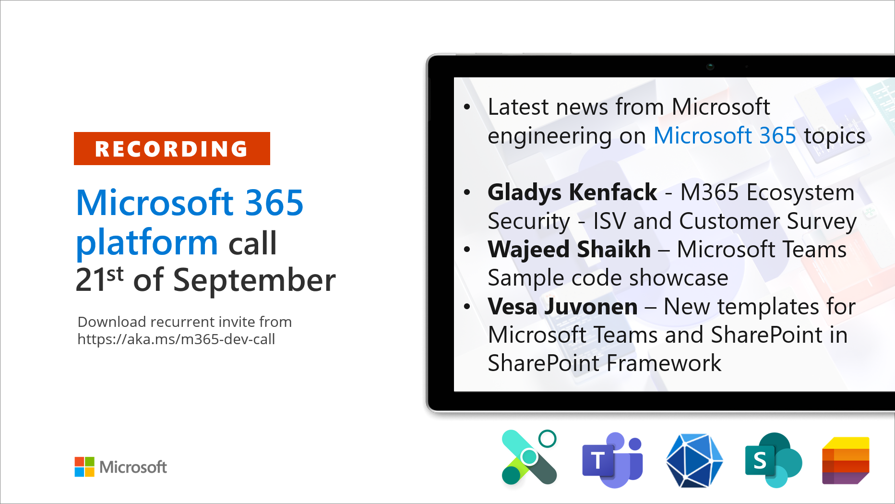

---
title: "Microsoft 365 Platform Call -- 21st of September, 2021"
date: 2021-09-22T08:54:00-04:00
author: "Vesa Juvonen"
githubname: VesaJuvonen
categories: ["Microsoft 365 platform call"]
images:
- images/recording-21st-sep.png
type: "regular"
--- 

 

Microsoft 365 Platform Community Call - weekly community call recording
from September 21st, is now available from the Microsoft 365 Community
YouTube channel
at [https://aka.ms/m365pnp/videos](https://aka.ms/m365pnp-videos). 

## Call summary

Welcome to the weekly call focused on capabilities of the Microsoft 365
platform.   New to Microsoft 365 Platform development?  You are
encouraged to register at [Microsoft 365 Developer
Program](https://aka.ms/m365/devprogram) for free E5 developer tenant
and other assets.   Hear about the upcoming M365 Ecosystem Security -
ISV and Customer Surveys.  Access the latest [free training
modules](https://aka.ms/m365/dev/learn) to accelerate learning Microsoft
365 platform capabilities.  Visit the new [Microsoft 365 sample
gallery](https://aka.ms/m365/samples) with more than 500 samples from
Microsoft and community.  Sign up and attend one of a growing list of
events hosted by [Sharing is
Caring](https://pnp.github.io/sharing-is-caring/) in September.  Tune
into the weekly [Microsoft 365 Developer
Podcast](https://m365devpodcast.com) focused exclusively on Microsoft
365 dev topics -- hosted by Jeremy Thake (Microsoft) and Paul Schaeflein
(Addin365).   [Registration for Microsoft
Ignite](https://ignite.microsoft.com/) (Digital event) -- November 2-4
is now open.  The host of this call was [Brian T.
Jackett](https://twitter.com/BrianTJackett) (Microsoft)
*| *@BrianTJackett.   Q&A
takes place in chat throughout the call.

**Microsoft 365 Platform News Flash**

-   [Changes to the Microsoft 365 advanced eDiscovery create case API
    (beta)](https://developer.microsoft.com/microsoft-365/blogs/changes-to-the-microsoft-365-advanced-ediscovery-create-case-api-beta/)
-   [Bringing large groups and communities together in
    Teams](https://techcommunity.microsoft.com/t5/microsoft-teams-blog/bringing-large-groups-and-communities-together-in-teams/ba-p/2758095)
-   [Multi-tenant architecture for SaaS
    apps](https://developer.microsoft.com/microsoft-365/blogs/multi-tenant-architecture-for-saas-apps/)

## Actions

-   Register for Microsoft Ignite (Digital event) - November 2-4, 2021-
    <https://ignite.microsoft.com>
-   Register for Sharing is Caring Events:
    -   First Time Contributor Session -- TBS (EMEA, APAC & US friendly
        times available)
    -   Community Docs Session -- [October
        5th](https://forms.office.com/Pages/ResponsePage.aspx?id=KtIy2vgLW0SOgZbwvQuRaXDXyCl9DkBHq4A2OG7uLpdUOUdFR0U1STdGS0lXUDA2Sk1YSE1WMEtHSy4u) 
    -   PnP -- SPFx Developer Workstation Setup -- TBS
    -   PnP SPFx Samples -- Solving SPFx version differences using Node
        Version Manager -- [September
        28th](https://forms.office.com/Pages/ResponsePage.aspx?id=KtIy2vgLW0SOgZbwvQuRaXDXyCl9DkBHq4A2OG7uLpdUMDdKSjQxRDhKVzhCVUQ4VDdIQVZRVTZOSi4u) 
    -   Ask Me Anything (AMA) -- Power Platform Development & Samples --
        [September
        28th](https://forms.office.com/Pages/ResponsePage.aspx?id=KtIy2vgLW0SOgZbwvQuRaXDXyCl9DkBHq4A2OG7uLpdUNFJZNThMWFk0QlEzWFJNVE5aNVMzM1UwUi4u)
    -   Ask Me Anything (AMA) -- List Formatting -- [October
        5th](https://forms.office.com/Pages/ResponsePage.aspx?id=KtIy2vgLW0SOgZbwvQuRaXDXyCl9DkBHq4A2OG7uLpdUNTVHSFFMRDdDSjA0MklUSUtTQ0IxMFpPNS4u)
    -   First Time Presenter -- [October
        12th](https://forms.office.com/Pages/ResponsePage.aspx?id=KtIy2vgLW0SOgZbwvQuRaXDXyCl9DkBHq4A2OG7uLpdUNDJOOU5JREc2TUhCVzNGTTJFUldSUUNUSy4u)
    -   More than Code with VSCode -- TBS 
    -   Maturity Model Practitioners -- October 19th  (every 3rd
        Tuesday of month, 7:00am PT)
    -   PnP Office Hours -- 1:1 session --
        [Register](https://outlook.office365.com/owa/calendar/PnPSharingisCaring@warner.digital/bookings/)
    -   PnP Buddy System -- [Request a
        Buddy](https://forms.office.com/Pages/ResponsePage.aspx?id=KtIy2vgLW0SOgZbwvQuRaXDXyCl9DkBHq4A2OG7uLpdUMjRRUVg4NElZUUJLTEY1TVVSVDJFRFpLRS4u)
-   Request a Demo spot on the call --
    <https://aka.ms/m365pnp/request/demo>
-   Download the recurrent invite for this call
    -- [https://aka.ms/m365-dev-call](https://aka.ms/m365-dev-call%C2%A0)
-   Call attention to your great work by using
    the [#PnPWeekly](https://twitter.com/hashtag/PnPWeekly?src=hashtag_click) on
    Twitter.

**Program:**

-   **M365 Ecosystem Security -- ISV and Customer Survey --** walk
    through 2 new surveys targeted to Customer and to Developer/ISV. 
    Objective is to understand from customers their top concerns when
    adopting and configuring third party applications that meet
    compliance needs.  And from a partner perspective, to understand
    what Microsoft can do as a platform provider to help you build
    secure applications and drive customer adoption.   Surveys are being
    sent out this week. 

## Demos

Demos delivered in this session

-   **Microsoft Teams Sample code showcase** -- 4 Microsoft produced
    Teams samples - Build tabs with Adaptive Cards (build Teams tabs
    with Adaptive Cards using Node or C#), Receive all channel messages
    with RSC (Preview) (bot receives all channel messages with RSC
    without @mention), Real-time Teams meeting events (bot receives
    real-time meeting events), and SSO for Tabs + Bots + Messaging
    Exchange (ME) (combined SSO for Bots, Tabs & ME).   Discussion on
    Resource-specific consent (RSC) for granular consent.

-   **Preview on new templates for Microsoft Teams and SharePoint in
    SharePoint Framework** -- resetting design and default experiences
    by modernizing default SPFx web part templates.  UX updates - fully
    sectioned, color aware, detects if in SharePoint or Teams
    environment, on page guidance for page creators, theme aware. 
    Changes included in SPFx v1.14 rolling out this Fall.   Thoughts on
    UX?  Join the discussions in SP Dev docs.  Q&A and bonus - glimpse
    the Viva Dashboard (web part) in Teams.

Thank you for your work. Samples are often showcased in Demos.

## Topics

Topics covered in this call

-   Latest updates and news on the Microsoft 365 platform -- [Brian T.
    Jackett](https://twitter.com/BrianTJackett) (Microsoft)
    *| *@BrianTJackett
-   The M365 Ecosystem Security - ISV and Customer Surveys -- Gladys
    Kenfack (Microsoft) -- [8:53](https://youtu.be/GF0hfnYCy8M?t=533)
-   **D1:**  Microsoft Teams Sample code showcase -- Wajeed Shaikh
    (Microsoft) -- [16:55](https://youtu.be/GF0hfnYCy8M?t=1015)
-   **D2:**  Preview on new templates for Microsoft Teams and SharePoint
    in SharePoint Framework -- [Vesa
    Juvonen](https://twitter.com/vesajuvonen) (Microsoft) |
    [@vesajuvonen](https://twitter.com/vesajuvonen%20) --
    [16:55](https://youtu.be/GF0hfnYCy8M?t=1874)

## Resources

Additional resources around the covered topics and links from the
slides.

-   Customer Survey - [Microsoft 365 -- Security/Privacy/Compliance
    Customer Survey](https://forms.office.com/r/ZswHVU7ZfC) 

-   Developer survey - [Microsoft 365 -- Security/Privacy/Compliance
    Developer Survey](https://forms.office.com/r/CkB7gbR5bu) 

-   D1: Samples - [Microsoft Teams
    Samples](https://github.com/OfficeDev/microsoft-teams-samples) 

-   D1: Support and Feedback - [Microsoft Teams developer community
    channels](https://docs.microsoft.com/microsoftteams/platform/feedback) 

-   D1: Documentation - [Designing Adaptive Cards for your Microsoft
    Teams
    app](https://docs.microsoft.com/microsoftteams/platform/task-modules-and-cards/cards/design-effective-cards) 

-   D1: Documentation - [Update your Teams app
    manifest](https://docs.microsoft.com/microsoftteams/platform/graph-api/rsc/resource-specific-consent#update-your-teams-app-manifest) 

-   D1: Documentation - [Receive all channel messages with
    RSC](https://docs.microsoft.com/microsoftteams/platform/bots/how-to/conversations/channel-messages-with-rsc) 

-   D1: Documentation - [Resource-specific
    consent](https://docs.microsoft.com/microsoftteams/platform/graph-api/rsc/resource-specific-consent)

-   D2: Discussions - [SharePoint/sp-dev-docs
    (github.com)](https://github.com/SharePoint/sp-dev-docs/discussions)

-   **PnP Weekly -- Episode 134** (September 13th) with Boston-based MVP
    and founder of Sympraxis Consulting - [Marc D
    Anderson](https://twitter.com/sympmarc) | @sympmarc
    | [video](https://techcommunity.microsoft.com/t5/microsoft-365-pnp-blog/microsoft-365-pnp-weekly-episode-134-marc-d-anderson-sympraxis/ba-p/2746312) |  [podcast](https://pnpweekly.podbean.com/e/microsoft-365-pnp-weekly-episode-134-%e2%80%93-13th-of-september-2021/)

-   [Microsoft 365 Developer
    Podcast](https://m365devpodcast.com/) focused  exclusively on
    Microsoft 365 dev topics -- hosted by [Jeremy
    Thake](https://twitter.com/jthake) (Microsoft) |

    @jthake and [Paul
    Schaeflein](https://twitter.com/paulschaeflein) (Addin365)
    | [pschaeflein](https://github.com/pschaeflein)

## General resources

-   Archives - Microsoft 365 PnP Weekly
    - [Videos](https://www.youtube.com/playlist?list=PLR9nK3mnD-OVYI-St_CBiFfuL4CZbBpkC), [Podcasts](https://pnpweekly.podbean.com/)  
-   PnP Teams Quickstart
    | [aka.ms/pnp-teams-quickstart](https://aka.ms/pnp-teams-quickstart)
-   Microsoft Teams Toolkit v2.2 | <https://aka.ms/teams-toolkit>
-   [Microsoft 365 PnP Community
    hub](https://techcommunity.microsoft.com/t5/microsoft-365-pnp/ct-p/Microsoft365PnP) |
    aka.ms/m365pnp/community 
-   Microsoft Graph Toolkit in Microsoft Learn
    | <https://aka.ms/learn-mgt>
-   Viva Connections <https://aka.ms/VivaConnections>
-   [SharePoint look
    book](https://lookbook.microsoft.com/?WT.mc_id=m365-24198-cxa)
-   [Yo Teams video training package](https://aka.ms/yoteams-training)
-   [.NET Standard 2.0 version of SharePoint Online CSOM
    API](https://developer.microsoft.com/microsoft-365/blogs/net-standard-version-of-sharepoint-online-csom-apis?WT.mc_id=m365-24198-cxa)
-   [Microsoft 365 community (PnP)
    videos](https://aka.ms/m365pnp-videos) | aka.ms/m365pnp-videos
-   [Microsoft Teams Toolkit for Visual Studio
    Code](https://marketplace.visualstudio.com/items?itemName=TeamsDevApp.ms-teams-vscode-extension)
-   [yo Teams](https://aka.ms/yoteams) | aka.ms/yoteams
-   Video - [Getting started using yo
    Teams](https://youtu.be/w0OrFkzNC10) | [Wictor
    Wilén](https://twitter.com/wictor) (Avanade)| @wictor
-   [Build a crisis management site to connect people and
    information](https://techcommunity.microsoft.com/t5/microsoft-sharepoint-blog/build-a-crisis-management-site-to-connect-people-and-information/ba-p/1216791?WT.mc_id=m365-24198-cxa)
-   [Developer
    documentation](https://aka.ms/spdev-docs) | <https://aka.ms/spdev-docs>
-   [PnP Power Shell](https://aka.ms/sppnp-powershell)
-   [SharePoint Modernization Partner
    Guidance](https://aka.ms/sppnp-modernization-partnerguidance) -
    Feedback welcome
-   Solution - [Building a modern search experiences with SharePoint
    Framework web parts](https://aka.ms/pnp-modern-search)
-   [Page transformation
    guidance](https://aka.ms/sppnp-pagetransformation)
-   [Page transformation
    videos](https://aka.ms/sppnp-pagetransformationvideos)
-   [Modernization scanner](https://aka.ms/sppnp-modernizationscanner)
-   [Microsoft 365 developer program
    site](https://developer.microsoft.com/office/dev-program?WT.mc_id=m365-24198-cxa) -
    Need to become a Tenant Admin to test look book capabilities? Get a
    Microsoft 365 E5 developer subscription (free tenant for 90 days)
-   [SharePoint Provisioning
    Service ](https://lookbook.microsoft.com/)- Easily provision
    look book designs to any tenant in the world
-   [SharePoint Provisioning templates on
    GitHub](https://github.com/SharePoint/sp-dev-provisioning-templates)
-   [PnP Provisioning Tenant Templates
    documentation](https://docs.microsoft.com/sharepoint/dev/solution-guidance/pnp-provisioning-tenant-templates?WT.mc_id=m365-24198-cxa)
-   [SharePoint Page Transformation webcast
    series](https://developer.microsoft.com/sharepoint/blogs/sharepoint-page-transformation-webcast-series?WT.mc_id=m365-24198-cxa)
-   [PnP Power Shell](https://aka.ms/sppnp-powershell)
-   [SharePoint Modernization
    Tools](https://github.com/SharePoint/sp-dev-modernization/tree/dev/Tools)

## Upcoming Calls | Recurrent Invites

-   **SharePoint Framework call** -- September 23rd at 7:00 am PDT
    | <https://aka.ms/spdev-spfx-call>
-   **Microsoft 365 platform call** -- September 28th at 8:00 am
    PDT | <https://aka.ms/m365-dev-call>
-   **M365 General Dev call** -- September 30th at 7:00 am PDT
    | <https://aka.ms/m365-dev-sig>
-   **Office add-in monthly call** -- October 13th at 8:00 am PDT
    | <https://aka.ms/officeaddinscall>
-   **Adaptive Cards monthly call** --October14th at 9:00 am PDT
| <https://aka.ms/adaptivecardscommunitycall>

-   **Power Apps monthly call**-- October 20th at 8:00 am PDT
    | <https://aka.ms/PowerAppsMonthlyCall>
-   **Microsoft Identity Platform call** -- October 21st at 9:00 am
    PDT | <https://aka.ms/IDDevCommunityCalendar>

Microsoft 365 Platform community call focuses on latest Microsoft 365
Platform updates and demos delivered by Microsoft presenters and takes
place weekly on Tuesday.  The alternating Special Interest Group
community calls each Thursday focus on SharePoint Framework (client-side
development/implementation) and Microsoft 365 Platform (includes
Microsoft Teams, Bots, Microsoft Graph, CSOM, REST, site provisioning,
PnP PowerShell, PnP Sites Core, Site Designs, Power Automate, PowerApps,
Column Formatting, list formatting, etc. topics.) with demos commonly
delivered by community members. 

 More details on the Microsoft 365
community from [https://aka.ms/m365pnp](https://aka.ms/sppnp). 
You can download recurrent invite for this call
from <https://aka.ms/m365-dev-call>.  

Welcome and join in the
discussion. If you have any questions, comments, or feedback, feel free
to provide your input as comments to this post as well. More details on
the Microsoft 365 community and options to get involved are available
from [https://aka.ms/m365pnp](https://aka.ms/sppnp).

*"Sharing is caring"*

------------------------------------------------------------------------

*Microsoft 365 PnP team, Microsoft - 22nd of September 2021*
