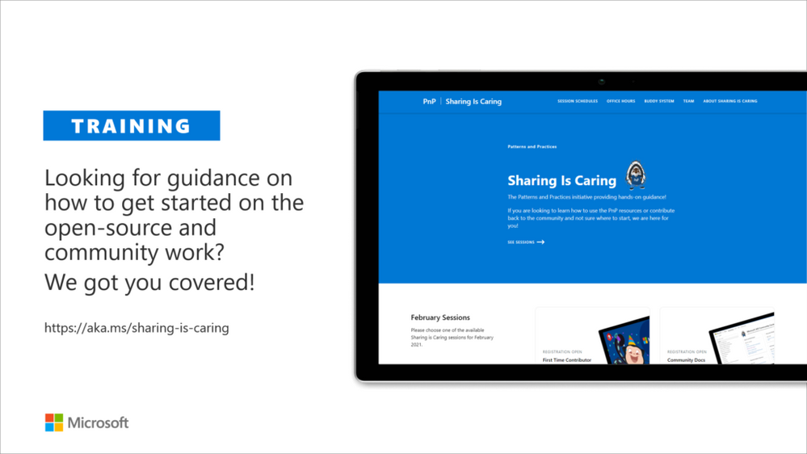

Microsoft 365 Platform Community (PnP) May 2022 update is out with a summary of the latest guidance, samples, and solutions from Microsoft or from the community for the community. This article is a summary of all the different areas and topics around the community work we do around Microsoft 365 ecosystem during the past month. Thank you for being part of this success.

_We are committed on building the best tech community in the world where everyone feels welcome and we help to empower each and every community member to achieve more._

## What is Microsoft 365 Platform Community

Microsoft 365 Platform Community is community activities coordinated by numerous teams inside of the Microsoft 365 engineering organizations. This is a community-driven open-source initiative where Microsoft and external community members are sharing their learning's around implementation practices for Microsoft 365.

Topics vary from Microsoft Viva, Microsoft Graph, Microsoft Teams, Power Platform, OneDrive and SharePoint. Active development and contributions happen in GitHub by providing contributions to the samples, reusable components, and documentation for different areas. PnP is owned and coordinated by Microsoft engineering, but this is work done by the community for the community.

See more details from New Microsoft 365 Platform (PnP) team model with new community leads

The initiative is facilitated by Microsoft, but we have multiple community members as part of the platform community team (see team details in end of the article) and we are always looking to extend the Platform Community team with more community members. Notice that since this is open-source community initiative, so there’s no SLAs for the support for the samples provided through GitHub. Obviously, all officially released components and libraries are under official support from Microsoft.

### Main resources around Microsoft 365 Community

*   Microsoft 365 Platform Community - [https://aka.ms/m365pnp](https://aka.ms/m365pnp) - One location for all the resources and news around Microsoft 365 platform
*   Microsoft 365 community blog - [https://aka.ms/m365pnp/blog](https://aka.ms/m365pnp/blog)
*   Microsoft 365 development blog - [https://aka.ms/m365pnp-blog](https://aka.ms/m365pnp-blog)
*   Microsoft 365 Community Channel on YouTube - [https://aka.ms/m365pnp-videos](https://aka.ms/m365pnp-videos)
*   Microsoft 365 Developer YouTube channel - [https://aka.ms/M365DevYouTube](https://aka.ms/M365DevYouTube)

## ✍ Latest Dev Blog posts

### Microsoft 365 Developer Blog

Here are the latest blog posts and announcements around Microsoft 365 development topics from [https://developer.microsoft.com/microsoft-365/blogs](https://developer.microsoft.com/microsoft-365/blogs)

* 9th of May - [Building real-time collaborative apps with Microsoft 365, Azure and Power Platform](https://devblogs.microsoft.com/microsoft365dev/building-real-time-collaborative-apps-with-microsoft-365-azure-and-power-platform/) by [Ayca Bas](https://twitter.com/aycabs) (Microsoft) | @Aycabs
* 19th of April - [Updated preview of SharePoint Framework 1.15 – New release of the upcoming features](https://devblogs.microsoft.com/microsoft365dev/updated-preview-of-sharepoint-framework-1-15-new-release-of-the-upcoming-features/) - [Vesa Juvonen](https://twitter.com/vesajuvonen) (Microsoft) | @vesajuvonen

### Microsoft 365 and Power Platform Community Blog

Latest community posts at [https://aka.ms/m365pnp/community/blog](https://aka.ms/m365pnp/community/blog)

* 3rd of May - [Luise Freese](https://twitter.com/LuiseFreese) | @LuiseFreese - [How to contribute to this blog ](https://pnp.github.io/blog/post/contribute-blog/)
* 1st of May - [Jasey Waegebaert](https://github.com/Jwaegebaert) (MI group) | Jwaegebaert - [Style your command bar with formatting magic](https://pnp.github.io/blog/post/style-command-bar-with-formatting-magic/)
* 29th of April - [Waldek Mastykarz](https://twitter.com/waldekm) (Microsoft) | @Waldekm - [CLI for Microsoft 365 v5.2](https://pnp.github.io/blog/cli-for-microsoft-365/cli-for-microsoft-365-v5-2/)
* 27th of April - [Luise Freese](https://twitter.com/LuiseFreese) | @LuiseFreese  - [How to rename files in SharePoint with Power Automate](https://pnp.github.io/blog/post/how-to-rename-files-in-sharepoint-with-power-automate/)
* 25th of April - [Luise Freese](https://twitter.com/LuiseFreese) | @LuiseFreese - [New Microsoft 365 and Power Platform Community Blog](https://pnp.github.io/blog/post/new-community-blog-platform/)
* 19th of April - [Gautam Sheth](https://twitter.com/gautamdsheth) (Valo Solutions) | @Gautamdsheth - [PnP PowerShell v1.10](https://pnp.github.io/blog/pnp-powershell/pnp-powershell-v1-10/)

### Community call recording blog posts

* 6th of May - [Viva Connections & SharePoint Framework Community Call – 5th of May, 2022](https://pnp.github.io/blog/microsoft-viva-and-spfx-community-call/2022-05-05/)
* 4th of May - [Microsoft 365 Platform Community Call - 3rd of May, 2022](https://pnp.github.io/blog/microsoft-365-platform-community-call/2022-05-03/)
* 28th of April - [Microsoft 365 & Power Platform Development Community call - 28th of April, 2022](https://pnp.github.io/blog/microsoft-365-and-power-platform-development-community-call/2022-04-28/)
* 27th of April - [Microsoft 365 Platform Community Call - 26th of April, 2022](https://pnp.github.io/blog/microsoft-365-platform-community-call/2022-04-26/)
* 21st of April - [Viva Connections & SharePoint Framework Community Call – 21st of March, 2022](https://pnp.github.io/blog/microsoft-viva-and-spfx-community-call/2022-04-21/)
* 20th of April - [Power Platform Community Call – April 2022](https://pnp.github.io/blog/power-platform-community-call/power-apps-community-call-april-2022/)
* 19th of April - [Microsoft 365 Platform Community Call - 19th of April, 2022](https://pnp.github.io/blog/microsoft-365-platform-community-call/2022-04-19/)

## Microsoft 365 Developer Podcasts

### Microsoft 365 Developer Podcast

In the Microsoft 365 Developer Podcast, Jeremy Thake and Paul Schaeflein talk Microsoft 365 with fellow industry experts. The show formerly known as Office 365 Podcast is back!

* 26th of April - [M365 Dev Podcast - Bookings API with Altamish Ahmad](https://www.m365devpodcast.com/e/Bookings-API-with-Altamish-Ahmad)
* 20th of April - [M365 Dev Podcast - Extensibility discussion with Ed Averett](https://www.m365devpodcast.com/e/extensibility-discussion-with-ed-averett)

### Microsoft 365 PnP Weekly Podcasts and vlogs

PnP Weekly is a recurrent podcast with visitors where Vesa and Waldek talk about the latest news and announcements in Microsoft 365 and SharePoint areas.

* 3rd of May - [Microsoft 365 PnP Weekly - Episode 164 - Elio Stryf](https://pnp.github.io/blog/microsoft-365-pnp-weekly/episode-164/)
* 26th of April - [Microsoft 365 PnP Weekly - Episode 163 - Mikael Svenson](https://pnp.github.io/blog/microsoft-365-pnp-weekly/episode-163/)
* 19th of April - [Microsoft 365 PnP Weekly - Episode 162 - Wictor Wilén ](https://pnp.github.io/blog/microsoft-365-pnp-weekly/episode-162/)

## Community calls

There are numerous different community calls on different areas. All calls are being recorded and published either from Microsoft 365 Developer or Microsoft 365 Community (PnP) YouTube channels. Recordings are typically released within the following 24 hours after the call. You can find a detailed agenda and links to specific covered topics on blog post articles at the Microsoft 365 developer blog when the videos are published.

*   Microsoft 365 Platform Call - [https://aka.ms/m365-dev-call](https://aka.ms/m365-dev-call) - Updates and demos from Microsoft as weekly call on Tuesdays - topics vary from Microsoft Teams, Microsoft Graph, Power Platform, SharePoint, OneDrive and more
*   Adaptive Cards [https://aka.ms/adaptivecardscommunitycall](https://aka.ms/adaptivecardscommunitycall) - Updates and news around Adaptive Cards with live demos
*   Microsoft identity platform [https://aka.ms/IDDevCommunityCalendar](https://aka.ms/IDDevCommunityCalendar) - Latest on the identity side
*   Office Add-ins [https://aka.ms/officeaddinscommunitycall](https://aka.ms/officeaddinscommunitycall) - News and community work around Office add-ins with live demos
*   Power Platform community call [https://aka.ms/PowerAppsMonthlyCall](https://aka.ms/PowerAppsMonthlyCall) - Monthly summary on Power Platform community with live demos
*   M365 Community Call [https://aka.ms/spdev-sig-call](https://aka.ms/spdev-sig-call) - Bi-weekly - General topics on Microsoft 365 Dev from various aspects - Microsoft Teams, Microsoft Graph Toolkit, Provisioning, Automation, Scripting, Power Automate, Solution design
*   Viva Connections & SharePoint Framework Community call [https://aka.ms/spdev-spfx-call](https://aka.ms/spdev-spfx-call) - Bi-weekly - Consists of topics around SharePoint Framework and JavaScript-based development in the Microsoft Teams and in SharePoint platform.

If you are interested in doing a live demo of your solution or sample in these calls, please do reach out to the Microsoft 376 Platform Community Team members (contacts later in this post) and they are able to help with the right setup. These are great opportunities to gain visibility for example for existing MVPs, for community members who would like to be MVPs in the future or any community member who'd like to share some of their learnings.

## Microsoft 365 Platform Community Ecosystem in GitHub

Most of the community driven repositories are in the PnP GitHub organization as samples are not product specifics as they can contain numerous different solutions or the solution works in multiple different applications.

*   [Microsoft Graph Toolkit](https://github.com/microsoftgraph/microsoft-graph-toolkit) - Repository and project on Microsoft Graph Toolkit controls - welcomes community contributors
*   [PnPjs](https://github.com/pnp/pnpjs) - PnPjs Framework repository
*   [CLI Microsoft 365](https://pnp.github.io/cli-microsoft365/) - Cross-OS command line interface to manage Office 365 tenant settings
*   [generator-spfx](https://github.com/pnp/generator-spfx) - Open-source Yeoman generator which extends the out-of-the-box Yeoman generator for \* SharePoint with additional capabilities
*   [generator-teams](https://github.com/pnp/generator-teams) - Open-source Microsoft Teams Yeoman generator - Bots, Messaging Extensions, Tabs, Connectors, Outgoing Web hooks and more
*   [teams-dev-samples](https://github.com/pnp/teams-dev-samples/) - Microsoft Teams targeted samples from community and Microsoft engineering
*   [script-samples](https://github.com/pnp/script-samples) - Scripting samples for automating operations in Microsoft 365 with PowerShell modules or CLIs
*   [Sharing is Caring](https://github.com/pnp/sharing-is-caring) - Getting started on learning how to contribute and be active on the community from GitHub perspective.
*   [pnpcore](https://github.com/pnp/pnpcore) - The PnP Core SDK is an SDK designed to work against Microsoft 365 with Microsoft Graph API first approach
*   [powershell](https://github.com/pnp/powershell) - PnP PowerShell module which is PowerShell Core module targeted for Microsoft 365
*   [pnpframework](https://github.com/pnp/pnpframework) - PnP Framework is a .Net Standard 2.0 library targeting Microsoft 365 containing the PnP Provisioning engine and a ton of other useful extensions
*   [spfx-reference-scenarios](https://github.com/pnp/spfx-reference-scenarios) - Samples for the Microsoft Teams and Viva Connections, implemented using SharePoint Framework
*   [sp-dev-fx-aces](https://github.com/pnp/sp-dev-fx-aces) - Samples on the Adaptive Card Extensions for Microsoft Viva
*   [sp-dev-fx-webparts](https://github.com/pnp/sp-dev-fx-webparts) - Client-side web part samples from community and Microsoft engineering
*   [sp-dev-fx-extensions](https://github.com/pnp/sp-dev-fx-extensions) - Samples and tutorial code around SharePoint Framework Extensions
*   [sp-dev-fx-library-components](https://github.com/pnp/sp-dev-fx-library-components) - Samples and tutorial code around the SharePoint Framework library components
*   [sp-starter-kit](https://github.com/pnp/sp-starter-kit) - Starter kit solution for SharePoint modern experiences
*   [sp-dev-build-extensions](https://github.com/pnp/sp-dev-build-extensions) - Different build extensions like gulp tasks and gulp plugins from the community and engineering around SharePoint development
*   [sp-dev-solutions](https://github.com/pnp/sp-dev-solutions) - Repository for more polished and fine-tuned reusable solutions build with SharePoint Framework
*   [sp-dev-samples](https://github.com/pnp/sp-dev-samples) - Repository for other samples related on the SharePoint development topics - WebHooks etc.
*   [sp-dev-fx-controls-react](https://github.com/pnp/sp-dev-fx-controls-react) - Reusable content controls for SharePoint Framework solutions build with React
*   [sp-dev-fx-property-controls](https://github.com/pnp/sp-dev-fx-property-controls) - Reusable property pane controls to be used in web part
*   [list-formatting](https://github.com/SharePoint/sp-dev-column-formatting) - Open-source community-driven repository for the column and view formatting JSON definitions
*   [sp-dev-site-scripts](https://github.com/pnp/sp-dev-site-scripts) - Open-source community-driven repository for community Site Designs and Site Scripts
*   [sp-dev-modernization](https://github.com/pnp/modernization) - Tooling and guidance around modernizing SharePoint from classic to modern
*   [sp-power-platform-solutions](https://github.com/pnp/sp-power-platform-solutions) - Solution and sample code for SharePoint Power Platform solutions
*   [powerfx-samples](https://github.com/pnp/powerfx-samples) - Samples that demonstrate different usage patterns for the Power Fx low-code programming language
*   [powerapps-samples](https://github.com/pnp/powerapps-samples) - Samples that demonstrate different usage patterns for Power Apps
*   [powerautomate-samples](https://github.com/pnp/powerautomate-samples) - Samples that demonstrate different usage patterns for Power Automate
*   [powerva-samples](https://github.com/pnp/powerva-samples) - Samples that demonstrate different usage patterns for Power Virtual Agents
*   [AdaptiveCards-Templates](https://github.com/pnp/AdaptiveCards-Templates) - Samples on showcasing the art of possible with Adaptive cards

All SharePoint specific repositories or services supported directly by Microsoft are located in the SharePoint GitHub organization

*   [sp-dev-docs](https://github.com/SharePoint/sp-dev-docs) - Source for new SharePoint dev center documentation exposed from [https://learn.microsoft.com/sharepoint/dev](https://learn.microsoft.com/sharepoint/dev)
*   [sp-dev-provisioning-templates](https://github.com/SharePoint/sp-dev-provisioning-templates) - Open-source templates used by the [SharePoint Look Book site](https://lookbook.microsoft.com/)
*   [sp-provisioning-service](https://github.com/SharePoint/sp-provisioning-service) - Source code of the [SharePoint look book site](https://lookbook.microsoft.com/)

Classic PnP named repositories - older tooling

*   [PnP-Tools](https://github.com/pnp/PnP-Tools) - Tools and scripts targeted more for IT Pro's and for on-premises for SP2013 and SP2016
*   [PnP-Provisioning-Schema](https://github.com/pnp/PnP-Provisioning-Schema) - PnP Provisioning engine schema repository

Repositories in the GitHub [Microsoft Search](https://github.com/microsoft-search) organization controlled by the PnP initiative

*   [pnp-modern-search](https://github.com/microsoft-search/pnp-modern-search) - Home of PnP Modern Search solutions, see more from the [documentation](https://microsoft-search.github.io/pnp-modern-search/)

Other related resources from GitHub

*   [Office add-in Patterns and Practices](https://github.com/OfficeDev/Office-Add-in-samples) in GitHub - Community contributions welcome!
*   [Microsoft Graph](https://github.com/microsoftgraph) GitHub organization
*   [OfficeDev](https://github.com/officedev) GitHub organization - Includes all Microsoft Teams samples from Microsoft

## What's supportability story around the community tooling and assets?

Following statements apply across all of the community lead and contributed samples and solutions, including samples, core component(s) and solutions, like SharePoint Starter Kit, yo teams or PnP PowerShell. All Microsoft released SDKs and tools are supported based on the specific tool policies.

*   PnP guidance and samples are created by Microsoft & by the Community
*   PnP guidance and samples are maintained by Microsoft & community
*   PnP uses supported and recommended techniques
*   PnP is an open-source initiative by the community – people who work on the initiative for the benefit of others, have their normal day job as well
*   PnP is NOT a product and therefore it’s not supported by Premier Support or other official support channels
*   PnP is supported in similar ways as other open source projects done by Microsoft with support from the community by the community
*   There are numerous partners that utilize PnP within their solutions for customers. Support for this is provided by the Partner. When PnP material is used in deployments, we recommend being clear with your customer/deployment owner on the support model

Please see the specifics on the supportability on the tool, SDK or component repository or download page.

## Microsoft 365 Platform Community team model

In April 2020 we announced our new [Microsoft 365 PnP team model](https://devblogs.microsoft.com/microsoft365dev/new-microsoft-365-patterns-and-practices-pnp-team-model-with-new-community-leads/) and grew the MVP team quite significantly. PnP model exists for having more efficient engagement between Microsoft engineering and community members. Let's build things together. Your contributions and feedback is always welcome! During August, we also crew the team with 5 new members. PnP Team coordinates and leads the different open-source and community efforts we execute in the Microsoft 365 platform.

We welcome all community members to get involved on the community and open-source efforts. Your input do matter!

*   New Microsoft 365 Platform (PnP) team members - March 2022
    *   [Chandani Prajapati](https://twitter.com/Chandani_SPD) (Rapid Circle) | @Chandani\_SPD
    *   [Arjun Menon](https://twitter.com/arjunumenon) (Tata Consulting Services) | @Arjunumenon
    *   [Sergei Sergeev](https://twitter.com/sergeev_srg) | @Sergeev\_srg

*   [New Microsoft 365 Patterns and Practices (PnP) team members – November 2021](https://pnp.github.io/blog/post/new-microsoft-365-patterns-and-practices-pnp-team-members)

    *   [Geetha Sivasailam](https://twitter.com/gsived) (Artis Consulting) | @GSiVed,
    *   [Natalie Pienkowska](https://twitter.com/NataliePienkow1) (Microsoft) | @NataliePienkow1,
    *   [Derek Cash-Peterson](https://twitter.com/spdcp) (Sympraxis Consulting) | @Spdcp,
    *   [João J. Mendes](https://twitter.com/joaojmendes) (Valo) | @Joaojmendes,
    *   [Joel Rodrigues](https://twitter.com/JoelFMRodrigues) (Storm Technology) | @JoelFMRodrigues,
    *   [Rick Van Rousselt](https://twitter.com/RickVanRousselt) (Advantive) | @RickVanRousselt
    *   [Stephan Bisser](https://twitter.com/stephanbisser) (Solvion) | @Stephanbisser,
    *   [Tetsuya Kawahara](https://twitter.com/techan_k) | @Techan\_k,
    *   [Thomas Gölles](https://twitter.com/thomyg) (Solvion) | @Thomyg

*   [New Microsoft 365 Patterns and Practices (PnP) team members - May 2021](https://pnp.github.io/blog/post/new-microsoft-365-patterns-and-practices-pnp-team-members-may)

    *   [Gautam Sheth](https://twitter.com/gautamdsheth) (Valo),
    *   [Patrick Lamber](https://github.com/plamber) (Experts Inside AG)

*   [New Microsoft 365 Patterns and Practices (PnP) team members - February 2021](https://devblogs.microsoft.com/microsoft365dev/new-microsoft-365-patterns-and-practices-pnp-team-members-february-2021/)
    *   [April Dunnam](https://twitter.com/aprildunnam) (Microsoft),
    *   [Emily Mancini](https://twitter.com/EEMancini) (Sympraxis Consulting),
    *   [Veronique Lengelle](https://twitter.com/veronicageek) (CPS)

*   [New Microsoft 365 Patterns and Practices (PnP) team members - December 2020](https://devblogs.microsoft.com/microsoft365dev/new-microsoft-365-patterns-and-practices-pnp-team-members-2/)
    *   [Luise Freese](https://twitter.com/LuiseFreese)
    *   [Sébastien Levert](https://twitter.com/sebastienlevert/) (Microsoft)

*   [New Microsoft 365 Patterns and Practices (PnP) team members - August 2020](https://devblogs.microsoft.com/microsoft365dev/new-microsoft-365-patterns-and-practices-pnp-team-members/) -
    *   [Albert-Jan Schot](https://twitter.com/appieschot) (BLIS Digital),
    *   [Koen Zomers](https://twitter.com/koenzomers) (Microsoft),
    *   [Paul Bullock](https://twitter.com/pkbullock) (Avanade),
    *   [Rabia Williams](https://twitter.com/williamsrabia) (Microsoft),
    *   [Yannick Plenevaux](https://twitter.com/yp_code) (PVX Solutions)

Got feedback, suggestions or ideas? - Please let us know. Everything we do in this program is for your benefit. Feedback and ideas are more than welcome so that we can adjust the process for benefitting you even more.

## Microsoft 365 PnP Recognition Program

We are excited to announce new community contributor program for all the active community members. Through this program you can get officially acknowledged with the a [Credly badge](https://www.credly.com/org/m365pnp/badge/community-contributor-2021) around your work on our open-source and community channels. See more from

[https://pnp.github.io/recognitionprogram/](https://pnp.github.io/recognitionprogram/). Thank you for being part of this journey with us.

## ⚙ Area-specific updates

These are different areas which are closely involved on the community work across the PnP initiative. Some are lead and coordinated by engineering organizations, some are coordinated by the community and MVPs.

### Microsoft Graph Toolkit

Microsoft Graph Toolkit is engineering lead initiative, which works closely with the community on the open-source areas. The Microsoft Graph Toolkit is a collection of reusable, framework-agnostic web components and helpers for accessing and working with Microsoft Graph. The components are fully functional right of out of the box, with built in providers that authenticate with and fetch data from Microsoft Graph.

*   Latest version currently is 2.4
*   [mgt.dev](https://mgt.dev/?path=/story/components-mgt-agenda--simple) - Microsoft Graph Toolkit Playground
*   [Getting started with Microsoft Graph Toolkit guidance video](https://www.youtube.com/watch?v=TbAZHvB5NEk) from developer community call by [Beth Pan](https://twitter.com/beth_panx) (Microsoft)
*   Latest code and preview versions from [https://aka.ms/mgt](https://github.com/microsoftgraph/microsoft-graph-toolkit)

All the latest updates on the Microsoft Graph Toolkit is being presented in our bi-weekly Microsoft 365 Generic Dev community call, including the latest community contributors.

### Microsoft 365 Community Docs

Community Docs model was announced in the April 2020 and it's great to see the interest for community to help each other by providing new guidance on the non-dev areas. See more on the announcement from the SharePoint blog - [Announcing the Microsoft 365 Community Docs](https://techcommunity.microsoft.com/t5/microsoft-sharepoint-blog/announcing-the-microsoft-365-community-docs/ba-p/1288203). We do welcome contributions from the community - our objective is to build a valuable location for articles from Microsoft and community together.

#### New articles

This time no new articles.

#### Updated articles

* Updated article - [Content Type Propagation](https://learn.microsoft.com/en-us/microsoft-365/community/content-type-propagation) - by [Daisy Feller](https://www.linkedin.com/in/daisy-feller/) (Microsoft)

Have ideas for articles or want to contribute yourself? - Get involved! Here are also some additional resources explaining the model more detailed.

*   YouTube - [Introducing Microsoft 365 Community Docs](https://www.youtube.com/watch?v=HTbgjWvsh3k)
*   [GitHub issue list](https://github.com/MicrosoftDocs/microsoft-365-community/issues) with articles ideas

### SharePoint Framework development samples

These are the updated SharePoint Framework samples which are available from the different repositories.

* Updated sample [react-birthdays](https://github.com/pnp/sp-dev-fx-webparts/tree/main/samples/react-birthdays) by Milan Holemans | milanholemans
* Updated sample [js-propertycontrols-svg](https://github.com/pnp/sp-dev-fx-webparts/tree/main/samples/js-propertycontrols-svg) by [Nader Hadjebi](https://twitter.com/nader2015) | @nader2015
* Updated sample [react-tour-pnpjs](https://github.com/pnp/sp-dev-fx-webparts/tree/main/samples/react-tour-pnpjs) by [Mike Homol](https://twitter.com/homol) | @homol
* Updated sample [vuejs-todo-single-file-component](https://github.com/pnp/sp-dev-fx-webparts/tree/main/samples/vuejs-todo-single-file-component) by LOLCATATONIA
* Updated sample [react-display-hierarchy](https://github.com/pnp/sp-dev-fx-webparts/tree/main/samples/react-display-hierarchy) by [Nick Brown](https://twitter.com/techienickb)  (JISC) | @techieni

How to find what's relevant for you? Take advantage of our SharePoint Framework web part and extension sample galleries - also includes solutions which work in Microsoft Teams

*   Web Part sample gallery - [https://aka.ms/spfx-webparts](https://aka.ms/spfx-webparts)
*   Extensions sample gallery - [https://aka.ms/spfx-extensions](https://aka.ms/spfx-extensions)
*   Viva Connections Adaptive Card samples - [https://aka.ms/spfx-aces](https://aka.ms/spfx-aces)
*   Microsoft Teams samples build with SharePoint Framework - [https://github.com/pnp/spfx-reference-scenarios](https://github.com/pnp/spfx-reference-scenarios)

### Microsoft Teams community samples

These are samples which have been contributed on the community samples since last summary. We do welcome all Microsoft Teams samples to this gallery. They can be implemented using in any technology.

If you are interested on Microsoft Teams samples, we have just released also new [Microsoft Teams sample gallery](https://pnp.github.io/teams-dev-samples/). Contributions to [Microsoft Teams samples](https://github.com/pnp/teams-dev-samples) is also more than welcome. This gallery already surfaces all Microsoft samples, [Microsoft Teams app templates](https://learn.microsoft.com/microsoftteams/platform/samples/app-templates) and community samples.

### Power Platform samples

* New Power Apps sample [US-Map-with-SVG-Images](https://github.com/pnp/powerapps-samples/tree/main/samples/US-Map-with-SVG-Images) by Krishna Rachakonda (Catapult) | rsk2013
* New Power Apps sample [power-wordle-game](https://github.com/pnp/powerapps-samples/tree/main/samples/power-wordle-game) by [April Dunnam](https://twitter.com/aprildunnam) (Microsoft) | @Aprildunnam
* New Power Apps sample [Office 365 Network (Skills Matrix)](https://github.com/pnp/powerapps-samples/tree/main/samples/skills-matrix) by Jennifer McGee | RainWatcher
* New Power Automate sample [Pattern: new-employee-tip-of-the-day](https://github.com/pnp/powerautomate-samples/tree/main/samples/new-employee-tip-of-the-day) by [Adam Wójcik](https://twitter.com/Adam25858782) (Hitachi Energy) | @Adam25858782
* Updated Power Automate sample [notify-on-last-working-day](https://github.com/pnp/powerautomate-samples/tree/main/samples/notify-on-last-working-day) by [Michal Ziemba](https://twitter.com/Michal_Ziemba) | @Michal_Ziemba

There were also numerous smaller updates on the different Power Platforms samples. See more details on available samples from following location

Power Platform sample gallery - [https://aka.ms/powerplatform-samples](https://pnp.github.io/powerplatform-samples/)

If you have any existing samples which you'd be willing to share with others - please submit a pull request or contact the PnP team members to get started on getting more closely involved on this initiative. Here to help.

### Microsoft 365 Script Samples

We welcome all scripts on Microsoft 365 automation to this centralized repository, targeted to help to manage and automate day-to-day operations.

Here are the latest updates on the Script Samples:

* Updated [Export a csv report on all Whiteboards](https://pnp.github.io/script-samples/whiteboard-report-usage/README.html) by [Nanddeep Nachan](https://twitter.com/NanddeepNachan)  | @NanddeepNachan
* New [Export OneDrive Admins](https://pnp.github.io/script-samples/onedrive-export-admins/README.html) by Matt Maher
* Updated [List guests within Teams in a tenant](https://pnp.github.io/script-samples/teams-list-guestusers/README.html) by [Jasey Waegebaert](https://twitter.com/Jwaegebaert)  | @Jwaegebaert
* New [Get Hub Sites Details And Export It To CSV](https://pnp.github.io/script-samples/spo-export-hub-sites-details-to-csv/README.html) by [Chandani Prajapati](https://twitter.com/Chandani_SPD)  (Rapid Circle) | @Chandani_SPD
* Updated [Get Hub Sites Information And Export It To CSV](https://pnp.github.io/script-samples/spo-export-hub-sites-details-to-csv/README.html) by [Jasey Waegebaert](https://twitter.com/Jwaegebaert)  | @Jwaegebaert
* Updated [Get Hub Sites Information And Export It To CSV](https://pnp.github.io/script-samples/spo-export-hub-sites-details-to-csv/README.html) by [Chandani Prajapati](https://twitter.com/Chandani_SPD)  (Rapid Circle) | @Chandani_SPD
* Updated [Update User Profile Properties](https://pnp.github.io/script-samples/spo-update-user-profile-properties/README.html) by [Jasey Waegebaert](https://twitter.com/Jwaegebaert)  | @Jwaegebaert

If you have any existing scripts which you'd be willing to share with others - please submit a pull request or contact the PnP team members to get started on getting more closely involved on this initiative.

Microsoft 365 Script Samples - [https://aka.ms/script-samples](https://aka.ms/script-samples)

### Independent Connectors Program

Microsoft Power Platform comes with a huge variety of already built-in connectors and also provides you with the ability of creating your own custom connectors. As of July 2021, anyone can submit the connectors they built to Microsoft Power Platform so that they can be used by others as well. Previously, only API owners could publish their connectors. The Independent Publisher Connector Program's mission is to bring the best together: the best people, connecting great ideas to data, apps, and flows. We want to make it easier for connector developers to collaborate on connectors.

For more information, you can watch this video on [Publish a connector to the Publish a connector to the Power Platform with Independent Publisher Conn...](https://www.youtube.com/watch?v=ulTBvCHw8MU) and check out [Microsoft Power Platform Connectors](https://github.com/microsoft/PowerPlatformConnectors) on GitHub

#### These are the latest connectors

* Advanced Scraper - [Troy Taylor](https://twitter.com/troystaylor) (Hitachi Solutions) | @Troystaylor
* Ambee- [Troy Taylor](https://twitter.com/troystaylor) (Hitachi Solutions) | @Troystaylor
* AMEE Open Company - [Troy Taylor](https://twitter.com/troystaylor) (Hitachi Solutions) | @Troystaylor
* Aviationstack- [Troy Taylor](https://twitter.com/troystaylor) (Hitachi Solutions) | @Troystaylor
* Do Not Call Reported Calls - [Troy Taylor](https://twitter.com/troystaylor) (Hitachi Solutions) | @Troystaylor
* Finnish BIS - [Timo Pertilä](https://twitter.com/timopertila) (Forward Forever) | @timopertila
* Finnish Railway Traffic - [Timo Pertilä](https://twitter.com/timopertila) (Forward Forever) | @timopertila
* Lit Ipsum - [Troy Taylor](https://twitter.com/troystaylor) (Hitachi Solutions) | @Troystaylor
* NIST NVD - [Paul Culmsee](https://twitter.com/paulculmsee) (Seven Sigma) | @Paulculmsee
* OpenAI - [Robin Rosengrün](https://twitter.com/power_r2) (EnBW)| @power_r2
* ProPublica Congress - [Troy Taylor](https://twitter.com/troystaylor) (Hitachi Solutions) | @Troystaylor
* ProPublica Nonprofit Explorer - [Troy Taylor](https://twitter.com/troystaylor) (Hitachi Solutions) | @Troystaylor
* Reachability - [Troy Taylor](https://twitter.com/troystaylor) (Hitachi Solutions) | @Troystaylor
* Rebrandly - [Vivek Bavishi](https://twitter.com/that_api_guy) | @That\_API\_guy
* Robohash - [Troy Taylor](https://twitter.com/troystaylor) (Hitachi Solutions) | @Troystaylor
* Storm Glass - [Paul Culmsee](https://twitter.com/paulculmsee) (Seven Sigma) | @Paulculmsee
* Udemy - [Nanddeep Nachan](https://twitter.com/NanddeepNachan) | @nanddeepNachan

### Sharing is Caring initiative

The "Sharing Is Caring" initiative is targeted for learning the basics around making changes in Microsoft Docs, in GitHub, submitting pull requests to the PnP repositories and in GitHub in general. Take advantage of this instructor lead training for learning how to contribute to docs or to open-source solutions. Everyone is welcome to learn how to get started on contributing to open-source docs or code!

See more from the [guidance documentation](https://pnp.github.io/sharing-is-caring/) - including all upcoming instructor lead sessions which you can participate!

## ✍ Different Microsoft 365 related open-source initiatives build together with the community

*   **Microsoft Look Book** - Discover the modern experiences you can build with SharePoint in Microsoft 365. Look book provides design examples for SharePoint Online which can be automatically provisioned to any tenant in the world. See more from [https://lookbook.microsoft.com](https://lookbook.microsoft.com/). This service is also provided as open-source solution sample from [GitHub](https://github.com/SharePoint/sp-provisioning-service).
*   **yo teams** - Open-source Yeoman generator for Microsoft Teams extensibility. Supports creation of bots, messaging extensions, tabs (with SSO), connectors and outgoing Webhooks. See more from [https://aka.ms/yoteams](https://github.com/pnp/generator-teams).
*   **PnP Framework** - .NET Standard 2.0 SDK containing the classic PnP Sites Core features for SharePoint Online. More around this package from GitHub.
*   **PnP Core SDK** - The PnP Core SDK is an SDK designed to work for Microsoft 365 with Graph API first approach. It provides a unified object model for working with SharePoint Online and Teams which is agnostic to the underlying API's being called. See more around the SDK from [documentation](https://pnp.github.io/pnpcore/).
*   **PnP PowerShell** - PnP PowerShell is a .NET Core 3.1 / .NET Framework 4.6.1 based PowerShell Module providing over 400 cmdlets that work with Microsoft 365 environments and more specifically SharePoint Online and Microsoft Teams. See more details from [documentation](https://pnp.github.io/powershell/).
*   **Reusable SharePoint Framework controls** - Reusable controls for SharePoint Framework web part and extension development. Separate projects for [React content controls](https://pnp.github.io/sp-dev-fx-controls-react/) and [Property Pane controls for web parts](https://github.com/pnp/sp-dev-fx-property-controls). These controls are using Office UI Fabric React controls under the covers and they are SharePoint aware to increase the productivity of developers.
*   **CLI for Microsoft 365** - Cross-OS command line interface to manage Office 365 tenant settings. See [release notes](https://pnp.github.io/cli-microsoft365/about/release-notes/) for latest updates.
*   **PnPJs** - PnPJs encapsulates SharePoint REST APIs and provides a fluent and easily usable interface for querying data from SharePoint sites. It's a replacement of already deprecated pnp-js-core library. See [changelog](https://github.com/pnp/pnpjs/blob/version-3/CHANGELOG.md) for the latest updates.
*   **PnP Provisioning Engine and PnP CSOM Core** - PnP provisioning engine is part of the PnP CSOM extension. They encapsulate complex business driven operations behind easily usable API surface, which extends out-of-the-box CSOM NuGet packages. See [changelog](https://github.com/pnp/PnP-Sites-Core/blob/master/CHANGELOG.md) for the latest updates.
*   **PnP PowerShell** - PnP PowerShell cmdlets are open-source complement for the SharePoint Online cmdlets. There are more than 300 different cmdlets to use and you can use them to manage tenant settings or to manipulate actual SharePoint sites. See [changelog](https://github.com/pnp/PnP-PowerShell/blob/master/CHANGELOG.md) for the latest updates.
*   **PnP Modern Search solution** - The PnP 'Modern Search' solution is a set of SharePoint Online modern Web Parts allowing SharePoint super users, webmasters and developers to create highly flexible and personalized search based experiences in minutes. See more details on the different supported capabilities from [https://aka.ms/pnp-search](https://microsoft-search.github.io/pnp-modern-search/).
*   **Modernization tooling** - All tools and guidance on helping you to transform you SharePoint to modern experiences from [https://aka.ms/sppnp-modernize](https://learn.microsoft.com/sharepoint/dev/transform/modernize-classic-sites).
*   **SharePoint Starter Kit v2** - Building modern experiences with Microsoft Teams flavors for SharePoint Online and SharePoint 2019 - reference solution in [GitHub](https://github.com/pnp/sp-starter-kit).
*   **List formatting definitions** - Community contributed samples around the column and view formatting in [GitHub](https://github.com/pnp/List-Formatting).
*   **Site Designs and Site Scripts** - Community contributed samples around \* SharePoint Site Designs and Site Scripts in [GitHub](https://github.com/pnp/sp-dev-site-scripts).
*   **DevOps tooling and scripts** - Community contributed scripts and tooling automation around DevOps topics (CI/CD) in [GitHub](https://github.com/pnp/sp-dev-build-extensions).
*   **Teams provisioning solution** - Set of open-source Azure Functions for Microsoft Teams provisioning. See more details from [GitHub](https://github.com/pnp/OrchestratedProvisioning).

### ✍ Documentation updates

*   Microsoft Teams platform documentation - [Microsoft Docs](https://learn.microsoft.com/microsoftteams/platform/) | [GitHub](https://github.com/MicrosoftDocs/msteams-docs)
*   SharePoint Developer documentation - [Microsoft Docs](https://learn.microsoft.com/sharepoint/dev/) | [GitHub](https://github.com/SharePoint/sp-dev-docs)
*   Microsoft Graph documentation - [Microsoft Docs](https://learn.microsoft.com/graph/) | [GitHub](https://github.com/microsoftgraph/microsoft-graph-docs)
*   Office add-in documentation - [Microsoft Docs](https://learn.microsoft.com/office/dev/add-ins/) | [GitHub](https://github.com/OfficeDev/office-js-docs-pr)

## Microsoft 365 Developer and Microsoft 365 Community YouTube video channels

You can find all Microsoft 365 related videos on our YouTube Channel at [https://aka.ms/m365pnp/videos](https://www.youtube.com/channel/UC_mKdhw-V6CeCM7gTo_Iy7w) or at [Microsoft 365 Dev](https://www.youtube.com/channel/UCV_6HOhwxYLXAGd-JOqKPoQ). These channels contains already a significant amount of detailed training material, demo videos, and community call recordings.

### Microsoft demo videos

Here are the new Microsoft demo or guidance videos released since the last monthly summary:

*  [Publish your app in the Microsoft Teams App Store](https://www.youtube.com/watch?v=IQf2Zs9Mob8) by Natalia Kats (Microsoft)
*  [Dynamic User Scope in Microsoft Graph Data Connect](https://www.youtube.com/watch?v=TMRrDUsqcYo&t=34s) by Nik Charlebois (Microsoft) | @NikCharlebois

### Community demo videos

* [PowerPoint selection APIs](https://www.youtube.com/watch?v=Pl3OcUXnIeo) by Onur Onder (Microsoft) and Camille Birch (Microsoft)
* [Building a wellbeing solution with Teams and Viva Connections](https://www.youtube.com/watch?v=87HCKNs6KzI) by [Waldek Mastykarz](https://twitter.com/waldekm) (Microsoft) | @Waldekm and [Anoop Tatti](https://twitter.com/anooptells) (Content+Cloud) | @Anooptells
* [Getting started with Microsoft Teams Private Channels](https://www.youtube.com/watch?v=oK_JKmG1wvs) by [Veronique Lengelle](https://twitter.com/veronicageek) (CPS) | @Veronicageek
* [Controlling list toolbar with JSON using commandBarProps option](https://www.youtube.com/watch?v=P7HoSUnhmOE) by [Chris Kent](https://twitter.com/theChrisKent) (DMI) | @TheChrisKent
* [Building in-meeting document signing app for Microsoft Teams](https://www.youtube.com/watch?v=6cwj_UmNrlQ) by SaiBhavya Reddy (Microsoft) and Eoin O'Brien (Microsoft)
* [Getting started with Branching in Microsoft Forms](https://www.youtube.com/watch?v=Pf8un8IZ4Tw) by [Chris Kent](https://twitter.com/theChrisKent) (DMI) | @TheChrisKent
* [Ribbon API updates with Office Add-ins](https://www.youtube.com/watch?v=SGQ5ccfQI_g) by Abid Rahman (Microsoft) and Preethika Kiruveedula (Microsoft)
* [Getting started with PnPjs 3.0 JavaScript library](https://www.youtube.com/watch?v=Fxh6ha6UWmM&t=3s) by [Julie Turner](https://twitter.com/jfj1997) (Sympraxis Consulting) | @Jfj1997 and [Patrick Rodgers](https://twitter.com/mediocrebowler) (Microsoft) | @Mediocrebowler
* [ACE with a card view and multiple quick views to display Microsoft 365 (Unified) groups in a tenant](https://www.youtube.com/watch?v=XyEGLeToeOU) by [Nanddeep Nachan](https://twitter.com/NanddeepNachan) | @nanddeepNachan
* [Enabling any control to be used in the SPFx property pane with a custom solution](https://www.youtube.com/watch?v=kSjaiwJFtUw) by [Christophe Humbert](https://twitter.com/Path2SharePoint) | @Path2SharePoint
* [Getting started with Teams Toolkit .NET](https://www.youtube.com/watch?v=yqP5-m2BCGc) by [Thomas Gölles](https://twitter.com/thomyg) (Solvion) | @Thomyg
* [Microsoft Graph API support for new content type sync enhancements](https://www.youtube.com/watch?v=6X-bope9cKg) by Shreya Ganguly (Microsoft) and Swapnil Shrivastava (Microsoft)
* [Microsoft Lists for Android - demo tour](https://www.youtube.com/watch?v=Cq7mKp_lY6k) by Join Sahil Baid (Microsoft)
* [The future of self-serve Microsoft Graph SDKs](https://www.youtube.com/watch?v=ADteVNa8Yyw) by Rabeb Othmani (Microsoft)
* [Managing State Across Viva Connections ACE components](https://www.youtube.com/watch?v=mv_V8kqhmec) by [Patrick Rodgers](https://twitter.com/mediocrebowler) (Microsoft) | @Mediocrebowler]
* [Getting started with Microsoft Forms](https://www.youtube.com/watch?v=DtwFMLu3TJU) by [Chris Kent](https://twitter.com/theChrisKent) (DMI) | @TheChrisKent
* Use [CLI for Microsoft 365 to get HaveIBeenPwned status](https://www.youtube.com/watch?v=cuPq3CYJ1Ac) by [Albert-Jan Schot](https://twitter.com/appieschot) (BLIS Digital) | @Appieschot
* [SharePoint Syntex - Content Assembly (Modern Mail Merge)](https://www.youtube.com/watch?v=fx4oV-qu7c8) by [Leon Armston](https://twitter.com/LeonArmston) (Intelogy) | @LeonArmston
* [Introduction on the new Microsoft Graph Toolkit sample gallery](https://www.youtube.com/watch?v=QsLgkPmDYeU) by [Sébastien Levert](https://twitter.com/sebastienlevert) (Microsoft) | @Sebastienlevert
* [Using 3rd Party APIs in Viva Connections ACEs](https://www.youtube.com/watch?v=YPTic0ZOO-M) by [Paolo Pialorsi](https://twitter.com/PaoloPia) (PiaSys.com) | @PaoloPia
* [Updates on Independent Publisher Connectors & Miro Connector Demo](https://www.youtube.com/watch?v=iUzykwMCOGI) by [Natalie Pienkowska](https://twitter.com/NataliePienkow1) (Microsoft) | @nataliePienkow1 and [Michał Romiszewski](https://twitter.com/romiszewski) | @romiszewski
* [Securing your Java Web Apps and APIs with Microsoft Identity – April 2022](https://www.youtube.com/watch?v=a4vH9fKG8cs) by Didun Ayodeji (Microsoft)
* [Microsoft 365 Maturity Model - April 2022](https://www.youtube.com/watch?v=72cHzMdPdus) by [David Warner II](https://twitter.com/DavidWarnerII) (Microsoft) | @DavidWarnerII, [Marc Anderson](https://twitter.com/sympmarc) (Sympraxis Consulting) | @Sympmarc, [Emily Mancini](https://twitter.com/EEMancini) (Sympraxis Consulting) | @EEMancini, [Simon Doy](https://www.twitter.com/simondoy) (iThink 365) | @Simondoy, [Simon Hudson](https://www.twitter.com/simonjhudson) (Novia Works) | @Simonjhudson, [Sharon Weaver](https://www.twitter.com/sharoneweaver) (Smarter Consulting) | @Sharoneweaver
* [Creating a workflow engine within SharePoint Framework and Azure](https://www.youtube.com/watch?v=ZL6V0jgotuM) by Greg Hitchon | Greg-Hitchon
* [Docker Loves SharePoint Framework (SPFx)](https://www.youtube.com/watch?v=7wTWj7sbswg) by Aleksandr Sapozhkov | shurick81
* [Making SharePoint Syntex testing easy – new templates in look book service](https://www.youtube.com/watch?v=MEqd1pfV9aw) by [Sean Squires](https://twitter.com/iamseansquires) (Microsoft) | @iamseansquires
* [Getting started on using Power Automate in Microsoft Lists](https://www.youtube.com/watch?v=jJVAh77cYmQ) by [Luise Freese](https://twitter.com/LuiseFreese) | @LuiseFreese
* [Microsoft Teams Meeting app sample with link unfurling](https://www.youtube.com/watch?v=zkd5_zMXokM) by Anuj Gupta (Microsoft)
* [Building Microsoft Graph Toolkit apps with Microsoft Teams](https://www.youtube.com/watch?v=AAKxbKDptwo) by [Sébastien Levert](https://twitter.com/sebastienlevert) (Microsoft) | @Sebastienlevert
* [Upgrade Web Parts using CLI for Microsoft 365](https://www.youtube.com/watch?v=NGYGJG4VNHs&t=27s) by [Hugo Bernier](https://twitter.com/bernierh) | @Bernierh
* [Latest on Microsoft Graph connectors SDK](https://www.youtube.com/watch?v=rRLRXWjY11k) by Rajdeep Chandra
* [Preview on upcoming list extensibility options with SPFx v1.15](https://www.youtube.com/watch?v=90DWB9hjo-k) by [Vesa Juvonen](https://twitter.com/vesajuvonen) (Microsoft) | @Vesajuvonen
* [Getting started with using CLI for Microsoft 365](https://www.youtube.com/watch?v=xycWw4A_RyQ&t=2s) by [Luise Freese](https://twitter.com/LuiseFreese) | @LuiseFreese
* [Updates on Independent Publisher Connectors & Infura Ethereum Connector Demo](https://www.youtube.com/watch?v=V2PMQrpbX1E) by [Natalie Pienkowska](https://twitter.com/NataliePienkow1) (Microsoft) | @nataliePienkow1 and [Sebastian Zolg](https://twitter.com/sebastianzolg) (Swisscom) | @sebastianzolg
* [Installing PnP PowerShell](https://www.youtube.com/watch?v=bDAeJgwkHH4) by [Veronique Lengelle](https://twitter.com/veronicageek) (CPS) | @Veronicageek

## Key contributors to the May 2022 update

Here’s the list of active contributors (in alphabetical order) since last release details in GitHub repositories or community channels. PnP is really about building tooling and knowledge together with the community for the community, so your contributions are highly valued across the Microsoft 365 customers, partners and obviously also at Microsoft.

Thank you for your assistance and contributions on behalf of the community. You are truly making a difference! If we missed someone, please let us know.

### Community people

*   [Abderahman Moujahid](https://github.com/Abderahman88) (iThink365) | Abderahman88
*   [Adam Wójcik](https://twitter.com/Adam25858782) (Hitachi Energy) | @Adam2585878
*   [Ademosu Ayodele](https://github.com/aaademosu) | aaademosu
*   [Aimery Thomas](https://www.twitter.com/aimery_thomas) | @aimery\_thomas
*   [Albert-Jan Schot](https://twitter.com/appieschot) (BLIS Digital) | @Appieschot
*   [Alex Gonsales](https://www.github.com/MrDrSushi) (Intergen) | MrDrSushi
*   Alexander Ernon (Amplexor)
*   Aleksandr Sapozhkov | shurick81
*   [Alexis CONIA](https://www.twitter.com/alexis_conia) (Kickle) | @Alexis\_conia
*   [Alienson](https://github.com/Alienson) | @Alienson
*   [Alistair Pugin](https://www.twitter.com/alistairpugin) (Tangent Solutions) | @Alistairpugin
*   [Akash Karda](https://twitter.com/akkikarda) | @akkikarda
*   [André Lage](https://twitter.com/aaclage) (Datalynx AG) | @aaclage
*   Andreas Omayrat | andreasomayrat
*   [Andrea Mondello](https://www.twitter.com/mondello_power) (Withum Smith + Brown) | @Mondello\_power
*   [Andrew Burns](https://www.twitter.com/SharePointRox) (AmSty) | @SharePointRox
*   [Andrew Connell](https://twitter.com/andrewconnell) (Voitanos) | @Andrewconnell
*   [Andrew Pilcher](https://www.github.com/andrewpilcher) (CSULB) | andrewpilcher
*   [Andy Harmon](https://www.twitter.com/andygharmon) (Oldham Metropolitan Borough Council) | @Andygharmon
*   [Anjaneyulu Yarlagadda](https://www.github.com/yarlagaddaanji) | yarlagaddaanji
*   Annie Torres (Coppin State University)
*   [Anoop Tatti](https://twitter.com/anooptells) (Content+Cloud) | @Anooptells
*   [Antti Pajunen](https://www.twitter.com/anttipajunen) (Forward Forever) | @Anttipajunen
*   [Aric Bost](https://www.twitter.com/1CyberState) (North Carolina Housing Finance Agency) | @1CyberState
*   [Arjan Cornelissen](https://twitter.com/arjancornelis) | @arjancornelis
*   [Arjun Menon](https://twitter.com/arjunumenon) (Tata Consulting Services) | @Arjunumenon
*   [Arleta Wanat](https://github.com/PowershellScripts) | PowershellScripts
*   Art Pagano (University of Texas San Antonio)
*   [Artur Posluszny](https://www.github.com/aposl1) | aposl1
*   [Asad Refai](https://www.twitter.com/asadrefai) (Intelogy) | @AsadRefai
*   [Ashwani Kumar](https://www.twitter.com/ashwanidv100) (Walmart Global Tech) | @Ashwanidv100
*   [Bartolomeo Sorrentino](https://twitter.com/bsorrentinoJ) (soulsoftware) | @BsorrentinoJ
*   [Beau Cameron](https://twitter.com/Beau__Cameron) (Aerie Consulting) | @Beau\_\_Cameron
*   Bianca W | bianca-git
*   Bob Morris (ThreeWill)
*   [Brian McCullough](https://twitter.com/bpmccullough) | @bpmccullough
*   [Carianne Wong](https://www.twitter.com/cw_marie) (Majesco) | @CW\_marie
*   [Carike Blignaut-Staden](https://www.twitter.com/CarikeBStaden) | @CarikeBStaden
*   [Carl Joakim Damsleth](https://twitter.com/kimzter) | @kimzter
*   [Catherine Thenault](https://www.twitter.com/o365techcat) (AIPSO) | @O365techcat
*   [Chanaka Palliyaguru](https://twitter.com/chanakavp) (Fortude) | @Chanakavp
*   [Chandani Prajapati](https://twitter.com/Chandani_SPD) (Rapid Circle) | @Chandani\_SPD
*   [Chandra Sekhar Malla](https://twitter.com/ChandraSMalla) (Royal Group LLC) | @ChandraSMall
*   [Chris Kent](https://twitter.com/theChrisKent) (DMI) | @TheChrisKent
*   Chris Sparrow (PA Consulting)
*   [Christian Zuellig](https://github.com/czullu) (MondayCoffee) | czullu
*   [Christophe Humbert](https://twitter.com/Path2SharePoint) | @Path2SharePoint
*   [Christopher Graves](https://www.twitter.com/Christo48927551) (Arvato) | @Christo48927551
*   [Chuck Piotrowski](https://www.twitter.com/chuckpiot) (PIOT) | @chuckpiot
*   [Clavin Fernandes](https://www.twitter.com/clavinfernandes) (Rapid Circle) | @Clavinfernandes
*   [Clement Olivier](https://twitter.com/Clement0livier) | @Clement0livier
*   Cynthia Tiwana (city of sammamish) | ctiwana
*   [Damien Bird](https://www.twitter.com/damobird365) | @DamoBird365
*   [Daniel Laskewitz](https://twitter.com/laskewitz) (Sogeti) | @Laskewitz
*   [Daniel Westerdale](https://www.twitter.com/westerdaled) (Westerdale Solutions Ltd) | @Westerdaled
*   [Danish Shafi](https://twitter.com/builtbydan) | @Builtbydan
*   Darren Brown (Node4)
*   [Dave Young](https://www.twitter.com/klarkykhat) | @Klarkykhat
*   David Gray (Visa)
*   [David Pileggi](https://www.twitter.com/https:/twitter.com/DavidPileggi) (Staples) | DavidPileggi
*   [David Ramalho](https://github.com/DRamalho92) | @DRamalho92
*   [Dean Gross](https://www.twitter.com/dean144) (Insight) | @Dean144
*   [Dennis Goedegebuure](https://twitter.com/expiscornovus) (Ultima Business Solutions) | Expiscornovus
*   [Derek Cash Peterson](https://www.twitter.com/spdcp) (Sympraxis Consulting) | @Spdcp
*   Dennis van Niel | dennisvanniel
*   [Dipen Shah](https://www.twitter.com/Dips_365) (Rapid Circle) | @Dips\_365
*   [Don Kirkham](https://www.twitter.com/DonKirkham) (DMI, Inc) | @DonKirkham
*   [Dr Adrian Colquhoun](https://www.github.com/iddycol) (Strategik) | iddycol
*   Edmund David (Insentra)
*   [Edris Kakembo](https://www.twitter.com/kaxeddie) (WFP) | @Kaxeddie
*   [Eduardo Cáceres](https://github.com/eduherminio) | eduherminio
*   [Ejaz Hussain](https://twitter.com/EjazHussain_) (Content and Cloud) | @EjazHussain
*   [Elio Struyf](https://twitter.com/eliostruyf) (Struyf Consulting) | @Eliostruyf
*   [Elise Yang](https://github.com/elisenyang) (Shopify) | elisenyang
*   [Elka Dunnette](https://www.twitter.com/ElkaD_YYC) | @ElkaD\_YYC
*   [Emily Mancini](https://twitter.com/EEMancini) (Sympraxis Consulting) | @EEMancini
*   [Eric Overfield](https://twitter.com/EricOverfield) (PixelMill) | @EricOverfield
*   [Erwin van Hunen](https://twitter.com/erwinvanhunen) (Valo Intranet) | @Erwinvanhunen
*   Florian Zink | fzbm
*   [Franck Cornu](https://twitter.com/FranckCornu) | @FranckCornu
*   [Ganesh R](https://twitter.com/geekwhocodes) (RapidCircle) | @Geekwhocodes
*   [Ganesh Sanap](https://www.twitter.com/GaneshSanap20) (Globant) | @GaneshSanap20
*   [Garrick George](https://www.twitter.com/kod3m0ng3r) (City of Thornton) | @Kod3m0ng3r
*   [Gaurav Mahajan](https://twitter.com/mahajang) | @Mahajang
*   [Gautam Sheth](https://twitter.com/gautamdsheth) (Valo Solutions) | @Gautamdsheth
*   [Geert de Kooter](https://twitter.com/gdekooter) | @gdekooter
*   [Geetha Sivasailam](https://twitter.com/gsived) (Artis Consulting) | @GSiVed
*   [Giacomo Pozzoni](https://github.com/jackpoz) (Fellowmind) | jackpoz
*   [Giuliano De Luca](https://twitter.com/delucagiulian) | @delucagiulian
*   [Greg Hitchon](https://github.com/Greg-Hitchon) | Greg-Hitchon
*   Haritha Sama (Intouch Solutions)
*   [Harry Jones](https://www.twitter.com/hejones50) (Civica) | @Hejones50
*   Harsh S (SRK Consulting)
*   [Harsh Samdani](https://www.github.com/hsamdani12) | hsamdani12
*   [Harshini Varma](https://twitter.com/HarshiniVarmaa) (Capgemini) | @HarshiniVarmaa
*   [HEMANT RISBUD](https://www.github.com/HemantR) (SRK Consultants) | Hemant Risbud
*   [Henrik Yllemo](https://www.twitter.com/yllemo) (Ylltec Sweden AB) | @Yllemo
*   Inez Jacobs (Amplexor)
*   Isolde Kanikani (SoftwareONE)
*   [Jacob Warrington](https://www.twitter.com/jjhwarrington) (Catapult Systems) | @Jjhwarrington
*   Jake Stanger | JakeStanger
*   James May | fowl2
*   [Jan Bakker](https://twitter.com/janbakker_) | @JanBacker\_
*   [Jasey Waegebaert](https://github.com/Jwaegebaert) (GMI Group) | Jwaegebaert
*   [Javier Hualpa](https://www.github.com/jhualpa) | jhualpa
*   [Jeffin Jacob](https://www.github.com/jeffinjacob) | jeffinjacob
*   Jennifer Davison (Akron Children's Hospital)
*   [Jennifer Erzen](https://www.twitter.com/jennifererzen) (SUNY Upstate Medical University) | @Jennifererzen
*   Jennifer McGee | RainWatcher
*   [Jerker Vallbo](https://github.com/jerval53) | jerval53
*   [Jhan Zaib](https://www.github.com/jhan-zaib) (Ascertia) | jhan-zaib
*   [Jim Duncan](https://www.twitter.com/sparchitect) (ShareSquared) | @Sparchitect
*   [Jinlong Wang](https://www.github.com/apzl808) | apzl808
*   [Jiten Parmar](https://www.twitter.com/Jitenpa44241205) (Rapid Circle) | @Jitenpa44241205
*   [João Ferreira](https://twitter.com/Joao12Ferreira) | @Joaoferreira
*   [João J. Mendes](https://twitter.com/joaojmendes) (Valo Solutions) | @Joaojmendes
*   [Joel Rodrigues](https://twitter.com/JoelFMRodrigues) (Storm Technology) | @JoelFMRodrigues
*   [Jonas Björkander](https://www.twitter.com/jonasbjor) (Heimstaden) | @Jonasbjor
*   Jonathan Hinchliffe (Imperial War Museums)
*   [Jonathan Weaver](https://www.twitter.com/j_weaver74) (WaterOne) | @J\_weaver74
*   [Jono Duncan](https://www.twitter.com/SuaveJono) (JourneyTEAM) | @SuaveJono
*   [Julie Turner](https://twitter.com/jfj1997) (Sympraxis Consulting) | @Jfj1997
*   [Kasper Bo Larsen](https://twitter.com/sperbolarsen) (Fellowmind) | @Kasperbolarsen
*   [Kathleen Boilek](https://www.twitter.com/kaboilek) (Alaka'ina Foundation) | @Kaboilek
*   [Katleen Van Trier](https://www.twitter.com/kvantrier) (Inetum-Realdolmen) | @Kvantrier
*   Katrin Rannaste
*   [Kevin McDonnell](https://twitter.com/kevmcdonk) (CPS) | @Kevmcdonk
*   [Kim Kiefer](https://www.twitter.com/kkkiefe) (GenTech Associates) | @Kkkiefe
*   Krishna Rachakonda (Catapult) | rsk2013
*   [Kunj Balkrishna Sangani](https://www.twitter.com/sanganikunj) | @Sanganikunj
*   [Kyle Bigelow](https://www.github.com/hazondata) | hazondata
*   [Lance Yoder](https://www.twitter.com/lyoder) (Cerner) | @Lyoder
*   [Laura Kokkarinen](https://twitter.com/LauraKokkarinen) (Sulava) | @LauraKokkarinen
*   [Laurent Egbakou](https://twitter.com/lioncoding) | @Lioncoding
*   [Lee Ford](https://twitter.com/lee_ford) ( Symity) | @Lee\_Ford
*   [Leon Armston](https://twitter.com/LeonArmston) (Intelogy) | @LeonArmston
*   [Lindsay Shelton](https://www.twitter.com/lshelton_tech) (Stowers Institute for Medical Research) | @Lshelton\_tech
*   [Loïc Cimon](https://twitter.com/LoicCimon) (Sogeti) | @LoicCimon
*   [Luise Freese](https://twitter.com/LuiseFreese) (M365Princess) | @LuiseFreese
*   Manickam Sethuramalingam (microland)
*   [Manjunath Puttaswamy](https://www.twitter.com/ManjunathPutta3) (Momentive Performance Materials India Private Limited) | @ManjunathPutta3
*   [Marc Anderson](https://twitter.com/sympmarc) (Sympraxis Consulting) | @Sympmarc
*   [Markus Joschko](https://github.com/jocsch) | jocsch
*   [Markus Möller](https://twitter.com/Moeller2_0) (Avanade) | @Moeller2\_0
*   [Martin Lingstuyl](https://twitter.com/martinlingstuyl) | @Martinlingstuy
*   [Mathijs Verbeeck](https://github.com/MathijsVerbeeck) | MathijsVerbeeck
*   [Matt Beard](https://twitter.com/mattybeard) (Data8) | @Mattybeard
*   [Matt Collins-Jones](https://www.twitter.com/D365Geek) | @D365Geek
*   [Michael Blumenthal](https://www.twitter.com/MichaelBL) (M365chicago.com) | @MichaelBL
*   [Michaël Maillot](https://twitter.com/michael_maillot) ( OnePoint) | @michael_maillot
*   [Michael Roth](https://twitter.com/michaelroth42) ( ITP) | @MichaelRoth42
*   [Michal Guzowski](https://twitter.com/abcguzowksi) (Developico) | @Abcguzowski
*   [Michal Romiszewski](https://twitter.com/romiszewski) | @Romiszewski
*   [Michal Ziemba](https://www.twitter.com/Michal_Ziemba) (Flugger) | @Michal\_Ziemba
*   [Michel Mendes](https://twitter.com/michelcarlo) | @Michelcarlo
*   Michelle Heisler (Hennepin County)
*   [Miguel Angel García](https://twitter.com/miangama) | @Miangama
*   Milan Holemans | milanholemans
*   [Mike Duffy](https://www.twitter.com/mike_duffy) (Boardwalk Pipelines) | @Mike\_duffy
*   [Mike Dumka](https://www.twitter.com/mikedumka) (Habanero Consulting) | @Mikedumka
*   [Mike Homol](https://twitter.com/homol) (ThreeWill) | @homol
*   [Mike Zimm](https://github.com/mikezimm) | mikezimm
*   [Mohammad Amer](https://twitter.com/Mohammad3mer) (Atea Global Services) | @Mohammad3mer
*   [Nader Hadjebi](https://twitter.com/nader2015) | @nader2015
*   [Nanddeep Nachan](https://twitter.com/NanddeepNachan) | @nanddeepNachan
*   [Nathan Zipf](https://github.com/NathZ1) | NathZ1
*   [Naveen Karla](https://www.twitter.com/naveen67) | @naveen67
*   Nicole Fleming (Sherwin Williams)
*   [Nikki Chapple](https://www.twitter.com/chapplenikki) (Cloudway) | @Chapplenikki
*   [Nizar Grindi](https://www.twitter.com/nizar_grindi) (Avanade) | @nizar\_grindi
*   [Norm Young](https://www.twitter.com/stormin_30) (UnlimitedViz) | @Stormin\_30
*   [Omar Stewart](https://www.twitter.com/OmarStewey) | @OmarStewey
*   [Paolo Pialorsi](https://twitter.com/PaoloPia) (PiaSys.com) | @PaoloPia
*   [Patrick de Lanoy](https://www.twitter.com/empowerpatrick)(EmpowerTech) | @EmpowerPatrick
*   [Patrick Doran](https://twitter.com/swearpointjs) (NCDIT) | @Swearpointjs
*   [Patrick Galloway](https://www.github.com/BammaSlim) | BammaSlim
*   [Patrick Lamber](https://twitter.com/patricklamber) (ExpertsInside AG) | @Patricklamber
*   [Patrik Hellgren](https://twitter.com/patrikhellgren) (Sherpas Group) | @Patrikhellgren 
*   [Paul Bullock](https://twitter.com/pkbullock) (Avanade) | @Pkbullock
*   [Paul Culmsee](https://twitter.com/paulculmsee) (Seven Sigma) | @Paulculmsee
*   [Paul McManus](https://twitter.com/PaulMcManus23) | @PaulMcManus23
*   [Paul Schaeflein](https://twitter.com/paulschaeflein) (AddIn365) | @Paulschaeflein
*   [Pedro Monte](https://github.com/PedroMordeP) (BindTuning) | PedroMordeP
*   [Pete Simpkins](https://www.twitter.com/simpkinspete) (Fluid Interiors) | @Simpkinspete
*   [Pete Skelly](https://twitter.com/pskelly) (ThreeWill) | @Pskelly
*   [Phil McNiven](https://www.github.com/phil0074) | phil0074
*   [Pierre Geraud](https://www.github.com/pedrion) (Bluekango) | pedrion
*   [Prafull Kotecha](https://www.twitter.com/prafull) | @Prafull
*   [Ralph Rivas](https://www.twitter.com/bigpix2000) (Sogeti) | @Bigpix2000
*   [Rentu](https://github.com/SLdragon) | SLdragon
*   [Reshmee Auckloo](https://www.twitter.com/ReshmeeAuckloo) (Pension Protection Fund) | @ReshmeeAuckloo
*   Rico van de Ven | RicoNL
*   [Rick Van Rousselt](https://twitter.com/RickVanRousselt) (Advantive) | @RickVanRousselt
*   [r-markus](https://github.com/r-markus) | r-markus
*   Rob Bell (Kizan technologies)
*   Rob Ellis | ee61re
*   [Rob Ireland](https://www.twitter.com/RobIreland68) (Oast House Ltd) | @RobIreland68
*   [Robert Copelan](https://www.twitter.com/rcopelan) (ZF Friedrichshafen AG) | @Rcopelan
*   [Robert Dyjas](https://twitter.com/robdyy) (EQTek) | @Robdy
*   Robert Lindström | robert-lindstrom
*   [Robin Rosengrün](https://twitter.com/power_r2) (EnBW) | @power_r2
*   [Rodrigo Pinto](https://twitter.com/ScoutmanPt) (Storm Technology) | @ScoutmanPt
*   Rohit S Patil (C3it)
*   [Russell Gove](https://www.twitter.com/russgove) (tronox) | @Russgove
*   [Ruth Shyer](https://www.twitter.com/rshyer) (SuMMit Consulting, LLC) | @Rshyer
*   [Ryan Healy](https://www.twitter.com/Ryan365Apps) (365Apps) | @Ryan365Apps
*   Sabrina Faragoza (Cognizant's Microsoft Business Group)
*   [Sachchin Annam](https://www.twitter.com/Sachchinn) (Freelancer) | @Sachchinn
*   [Sam Bridegroom](https://www.twitter.com/sambridegroom) (Allied Solutions) | @Sambridegroom
*   Sami Nieminen | stniemin
*   [Sebastian Zolg](https://twitter.com/sebastianzolg) (Swisscom) | @sebastianzolg
*   [Sekar Thangavel](https://github.com/SekarThangavel) (IBM) | SekarThangavel
*   [Sergei Sergeev](https://twitter.com/sergeev_srg) | @Sergeev\_srg
*   [Sharon Weaver](https://www.twitter.com/sharoneweaver) (Smarter Consulting) | @Sharoneweaver
*   [Shishir](https://www.github.com/skky05) | skky05
*   Shrushti Shah (Rapid Circle)
*   [Siddharth Vaghasia](https://twitter.com/siddh_me) | @Siddh\_me
*   [Simon Ågren](https://www.twitter.com/Agrenpoint) | @AgrenPoint
*   [Simon Doy](https://www.twitter.com/simondoy) (iThink 365) | @Simondoy
*   [Simon Hudson](https://www.twitter.com/simonjhudson) (Novia Works) | @Simonjhudson
*   [Smita Nachan](https://twitter.com/smitanachan) | @SmitaNachan
*   [Someleze Diko](https://twitter.com/DikoSomeleze) | DikoSomeleze
*   Sorina Becheru (abtis GmbH)
*   [Soumit Mukherjee](https://twitter.com/msoumit) | @Msoumit
*   [Soumyadeep Mukherjee](https://github.com/soumyadeep2207) | soumyadeep2207
*   [Sourav Paul](https://twitter.com/spsouravp) | @Spsouravp
*   [Stefan Bauer](https://twitter.com/StfBauer) (n8d) | @StfBauer
*   [Stephan Bisser](https://twitter.com/stephanbisser) (Solvion) | @Stephanbisser
*   Stephen Peters | StephenBrentPeters
*   [Steven Reid](https://www.twitter.com/steven_reid) (FTZ) | @Steven\_reid
*   [Sujith Pasupuleti](https://twitter.com/sujith1907) (NRF) | @Sujith1907
*   [Sumit Jadon](https://www.twitter.com/CoolJadon) (Avanade) | @CoolJadon
*   [Sunish](https://www.twitter.com/sunish) (SACHA Solutions) | @Sunish
*   [Takashi Shinohara](https://twitter.com/karamem0) | @Karamem0
*   Tammy Dupuy (CSULB)
*   [Tetsuya Kawahara](https://twitter.com/techan_k) | @Techan\_k
*   [Thomas Gölles](https://twitter.com/thomyg) (Solvion) | @Thomyg
*   [Tim Balk](https://www.twitter.com/tlbalk) (Wellmark) | @Tlbalk
*   [Tim Cadenbach](https://twitter.com/timcadenbach) (Maximago) | @TimCadenbach
*   [Timo Pertilä](https://twitter.com/timopertila) (Forward Forever) | @timopertila
*   Tod Beane
*   Todd Alexander (Island Way Technology)
*   [Todd Baginski](https://twitter.com/toddbaginski) (Canviz) | @Toddbaginski
*   [Tom Morgan](https://twitter.com/tomorgan) (Modality Systems) | @tomorgan
*   [Tomasz Poszytek](https://twitter.com/TomaszPoszytek) | @TomaszPoszytek
*   [Tony Derricott](https://www.twitter.com/computx) (BYUI) | @Computx
*   [Troy Taylor](https://twitter.com/troystaylor) (Hitachi Solutions) | @Troystaylor
*   [Twan van Beers](https://twitter.com/NeroBlancoIT) (Nero Blanco) | @neroBlancoIT
*   [Vardhaman Deshpande](https://twitter.com/vrdmn) (Valo Solutions) | @vrdmn
*   [Veronique Lengelle](https://twitter.com/veronicageek) (CPS) | @Veronicageek
*   [Victor Ezeliorah](https://www.twitter.com/vezeliora) (Intels Nigeria Limited) | @Vezeliora
*   [Vijay Sisodia](https://twitter.com/ec0321)(Accenture) | @ec0321
*   [Vipul Kelkar](https://twitter.com/vipulkelkar) (Rapid Circle) | @Vipulkelkar
*   [Vivek Bavishi](https://twitter.com/that_api_guy) | @That\_API\_guy
*   [wuxiaojun514](https://github.com/wuxiaojun514) | wuxiaojun514
*   [Yannick Plenevaux](https://twitter.com/yp_code) (PVX Solutions) | @Yp\_code
*   Youssef Moumen
*   [Yves Habersaat](https://twitter.com/yhabersaat) (Sword Group) | @Yhabersaat
*   [Zach Roberts](https://twitter.com/ZachSPODev) | @ZachSPODev

### Companies

Here's the companies, which provided support the community initiative for this month by allowing their employees working for the benefit of others in the community. There were also people who contributed from other companies during last month, but we did not get their logos and approval to show them in time for these communications. If you still want your logo for this month's release, please let us know and share the logo with us. Thx.

<!-- TODO insert correct image -->

*   [Addin365](https://www.addin365.com/)
*   [Arvo Systems](https://www.arvosys.com/)
*   [BLIS Digital](https://blisdigital.com/en/)
*   [Canviz Solutions](https://canviz.com/)
*   [Catapult Systems](https://www.catapultsystems.com/)
*   [CPS](https://www.cps.co.uk/)
*   [Content+Cloud](https://contentandcloud.com/)
*   [DMI](https://dminc.com/)
*   [Fellowmind](https://www.fellowmindcompany.com/)
*   [Intelogy](https://www.intelogy.co.uk/)
*   [iThink 365](https://www.ithink365.co.uk/)
*   [MondayCoffee](https://mondaycoffee.com/-home)
*   [N8D - Stefan Bauer - Innovation and Design Agency](https://n8d.at/)
*   [Piasys](https://piasys.com/)
*   [PixelMill](https://pixelmill.com/)
*   [PVX Solutions](https://www.pvx-solutions.com/)
*   [Rapid Circle](https://en.rapidcircle.com/)
*   [Sherpas](https://www.sherpas.se/)
*   [Solvion](https://www.solvion.net/)
*   [Sogeti](https://www.sogeti.com/)
*   [Storm Technology](https://www.storm.ie/)
*   [Struyf Consulting](https://www.eliostruyf.com/)
*   [Sulava](https://sulava.com/en/home/)
*   [Sympraxis Consulting](https://sympraxisconsulting.com/)
*   [ThreeWill](https://threewill.com/)
*   [Ultima Business Solutions](https://www.ultima.com/)
*   [Valo](https://www.valointranet.com/)
*   [Voitanos](https://www.voitanos.io/)

### Microsoft people

Here’s the list of Microsoft people who have been closely involved with the Microsoft 365 Platform community work during last month.

*   [Aakash Bhardwaj](https://twitter.com/aakash_316) (Microsoft) | @Aakash\_316
*   Abid Rahman (Microsoft)
*   [Alex Clark](https://twitter.com/sharepointalex) (Microsoft) | @Sharepointalex
*   [Alex Terentiev](https://twitter.com/alexaterentiev) (Microsoft) | @Alexaterentiev
*   [Aline Tognini](https://github.com/alinefmr) (Microsoft) | alinefmr
*   [Allen Snow](https://twitter.com/asnow003) (Microsoft) | @Asnow003
*   Altamish Ahmad (Microsoft)
*   Andrey Esipov (Microsoft)
*   Anuj Gupta (Microsoft)
*   [April Dunnam](https://twitter.com/aprildunnam) (Microsoft) | @Aprildunnam
*   [Arijit Mondal](https://www.github.com/ArijitCloud) (Microsoft)
*   Arvind Ravi (Microsoft)
*   Ashima Mathur (Microsoft)
*   [Ayca Bas](https://twitter.com/aycabs) (Microsoft) | @Aycabs
*   [Bert Jansen](https://twitter.com/O365Bert) (Microsoft) | @O365Bert
*   [Beverly Kim](https://github.com/bvandaal) (Microsoft) | bvandaal
*   [Bob German](https://twitter.com/Bob1German) (Microsoft) | @Bob1German
*   [Brian Dang](https://twitter.com/mrdang) (Microsoft) | @Mrdang
*   [Brian Jackett](https://twitter.com/BrianTJackett) (Microsoft) | BrianTJackett
*   [Bryan Petersen](https://github.com/bpeterse03) (Microsoft) | bpeterse03
*   Camille Birch (Microsoft)
*   [Cathy Dew](https://twitter.com/catpaint1) (Microsoft) | @Catpaint
*   [Charles Sterling](https://twitter.com/chass) (Microsoft) | @Chass
*   Christer Ljung (Microsoft)
*   [Christos Matskas](https://twitter.com/ChristosMatskas) (Microsoft) | @ChristosMatska
*   [Dan Wahlin](https://twitter.com/DanWahlin) (Microsoft) | @DanWahlin
*   [Dave Randall](https://github.com/triplanedave) (Microsoft) | triplanedave
*   [David Chesnut](https://twitter.com/davidchesnut) (Microsoft) | @Davidchesnut
*   [David Warner II](https://twitter.com/DavidWarnerII) (Microsoft) | @DavidWarnerII
*   Didun Ayodeji (Microsoft)
*   [Doğan Erişen](https://github.com/derisen) (Microsoft) | derisen
*   [Dragan Panjkov](https://twitter.com/panjkov) (Microsoft) | @Panjkov
*   [Ed Averett](https://twitter.com/Ed_Averett) (Microsoft) | Ed\_Everett
*   Emily Lynam (Microsoft)
*   Eoin O'Brien
*   Elizabeth Samuel (Microsoft)
*   Emma Cooper (Microsoft)
*   [Garry Trinder](https://twitter.com/garrytrinder) (Microsoft) | @Garrytrinder
*   [Haimantika Mitra](https://twitter.com/HaimantikaM) (Microsoft) | @HaimantikaM>
*   [Holger Lutz](https://github.com/HolgerLutz) (Microsoft) | HolgerLutz
*   [Hugo Bernier](https://twitter.com/bernierh) (Microsoft) | @Bernierh
*   Igor Ribeiro (Microsoft)
*   [James Eccles](https://github.com/jameseccles) (Microsoft) jameseccles
*   [James Skay](https://twitter.com/JamesSkay) (Microsoft) | @JamesSka
*   [Japhlet Nwamu](https://twitter.com/japhletnwamu) (Microsoft) | @Japhletnwamu
*   [Jasmine Hoegh](https://www.twitter.com/sbjishu) (Microsoft) | @Sbjishu
*   Jason Johnston (Microsoft) | jasonjoh
*   Jay Hangan (Microsoft)
*   Joanne Hendrickson (Microsoft) | JoanneHendrickson
*   John Nguyen (Microsoft) | johnguy0
*   [John Sudds](https://twitter.com/jsuddsjr) (Microsoft) | @Jsuddsjr
*   Join Sahil Baid (Microsoft)
*   [Jos Verlinde](https://github.com/Josverl) (Microsoft) Josverl
*   Jyoti Pal (Microsoft)
*   Kavishi Agarwal (Microsoft)
*   [Kevin Coughlin](https://twitter.com/kevintcoughlin) (Microsoft) | @Kevintcoughlin
*   Keyur Patelsdata (Microsoft)
*   [Koen Zomers](https://twitter.com/koenzomers) (Microsoft) | @Koenzomers
*   Holland Kaviani (Microsoft)
*   [Laura Graham](https://github.com/Lauragra) (Microsoft) | Lauragra
*   Holland Kaviani (Microsoft)
*   [Lee Stott](https://twitter.com/lee_stott) (Microsoft) | @Lee\_Stott
*   \[Linda Delarvé (Microsoft)
*   [Linda Lu Cannon](https://github.com/lindalu-MSFT) - (Microsoft) | lindalu-MSFT
*   [Loki Meyburg](https://twitter.com/lokimeyburg) (Microsoft) (Microsoft) | @Lokimeyburg
*   [Luca Bandinelli](https://github.com/lucaband) (Microsoft) | lucaband
*   [Mansa MusaLe](https://twitter.com/m4musale) (Microsoft) | @M4musale
*   Mathangi Chakrapani (Microsoft)
*   [Matthijs Hoekstra](https://twitter.com/mahoekst) (Microsoft) | @Mahoekst
*   Max Kulakov (Microsoft)
*   Michael Aldridge (Microsoft)
*   [Mikael Svenson](https://twitter.com/mikaelsvenson)(Microsoft) | @Mikaelsvenson
*   [Mike Hollinshead](https://twitter.com/mahollinshead) (Microsoft) | @Mahollinshea
*   [Musale Martin](https://twitter.com/m4musale) (Microsoft) | m4musale
*   [Nancy Wang](https://twitter.com/nancyatMSFT) (Microsoft) | @nancyatMSFT
*   Natalia Kats (Microsoft)
*   [Natalie Pienkowska](https://twitter.com/NataliePienkow1) (Microsoft) | @nataliePienkow1
*   [Nathan Zipf](https://github.com/NathZ1) (Microsoft) | NathZ1
*   Nick Adman (Microsoft)
*   Nick Kramer (Microsoft)
*   [Nik Charlebois](https://twitter.com/NikCharlebois) (Microsoft) | @nikCharlebois
*   [Nicolas Vogt](https://github.com/vogtn) (Microsoft) | vogtn
*   [Nikolay Zainchkovskiy](https://github.com/NZainchkovskiy) (Microsoft) | NZainchkovskiy
*   [Nickii Miaro](https://github.com/Mnickii) (Microsoft) | Nickii Miaro
*   [Niko](https://github.com/NikoMix) (Microsoft) | NikoMix
*   [Nikola Metulev](https://twitter.com/metulev) (Microsoft) | @Metulev
*   Onur Onder (Microsoft)
*   Orion O'Malley (Microsoft)
*   [Pam Green](https://www.twitter.com/contextuallib) (Microsoft) | @Contextuallib
*   Parag Jain (Microsoft)
*   [Pat Miller](https://twitter.com/PatMill_MSFT) (Microsoft) | @PatMill\_MSFT
*   [Patrick Rodgers](https://twitter.com/mediocrebowler) (Microsoft) | @Mediocrebowler
*   Preethika Kiruveedula (Microsoft)
*   Rabeb Othmani (Microsoft)
*   [Rabia Williams](https://twitter.com/williamsrabia) (Microsoft) | @Williamsrabia
*   Rajdeep Chandra
*   [Ravichandran Krishnasamy](https://twitter.com/spfx_blog) (Microsoft) | @Spfx\_blog
*   [Richard Astbury](https://twitter.com/richorama) (Microsoft) | @Richorama
*   Rick Kirkham (Microsoft)
*   [Roel](https://github.com/RoelVB) (Microsoft) | RoelVB
*   [Roy Paar](https://www.linkedin.com/in/roypaar/)(Microsoft)
*   [Rui Santos](https://www.linkedin.com/in/ruisantosnor/) (Microsoft)
*   SaiBhavya Reddy (Microsoft)
*   [Sam Larson](https://github.com/salarson) (Microsoft) | salarson
*   [Shane Weaver](https://github.com/shweaver-MSFT) (Microsoft) | shweaver-MSFT
*   [Shreyansh Agrawal](https://github.com/shagra-ms) (Microsoft) | shagra-ms
*   [Sean Squires](https://twitter.com/iamseansquires) (Microsoft) | @iamseansquires
*   [Sébastien Levert](https://twitter.com/sebastienlevert) (Microsoft) | @Sebastienlevert
*   Shreya Ganguly (Microsoft)
*   Shubham Gatkal (Microsoft)
*   [Srinivas Varukala](https://twitter.com/svarukala) (Microsoft) | @Svarukala
*   [Steven Jia](https://github.com/Steven-Jia) (Microsoft) | Steven-Jia
*   Swapnil Shrivastava (Microsoft)
*   [Tejas Mehta](https://twitter.com/tpmehta) (Microsoft) | @Tpmehta
*   [Tim Mayo](https://www.twitter.com/timmayo) (Microsoft) | @Timmayo
*   [Tom Resing](https://twitter.com/resing) (Microsoft) | @Resing
*   [Tomomi Imura](https://twitter.com/girlie_mac) (Microsoft) | @Girlie\_mac
*   [Vesa Juvonen](https://twitter.com/vesajuvonen) (Microsoft) | @Vesajuvonen
*   Wajeed Shaikh | [Wajeed-msft](https://github.com/Wajeed-msft)
*   [Waldek Mastykarz](https://twitter.com/waldekm) (Microsoft) | @Waldekm
*   [Wictor Wilen](https://twitter.com/wictor)(Microsoft) | @Wictor
*   [Vincent Biret](https://twitter.com/baywet) (Microsoft) | @baywet
*   Zakiullah Khan (Microsoft)

### MVP Community team

MVP Community team manages the Microsoft 365 platform community work in the GitHub and also coordinates different open-source projects around Microsoft 365 topics. Platform Community Team members have a significant impact on driving adoption of Microsoft 365 topics. They have shown their commitment to the open-source and community-driven work by constantly contributing to the benefit of the others in the community.

Thank you for all that you do!

*   [Chandani Prajapati](https://twitter.com/Chandani_SPD) (Rapid Circle) | @Chandani\_SPD
*   [Emily Mancini](https://twitter.com/EEMancini) (Sympraxis Consulting) | @EEMancini
*   Geetha Sivasailam](<https://twitter.com/gsived>) (Artis Consulting) | [@gSiVed
*   [Julie Turner](https://twitter.com/jfj1997)(Sympraxis Consulting) | @Jfj1997
*   [Laura Kokkarinen](https://twitter.com/LauraKokkarinen) (Sulava) | @LauraKokkarinen
*   [Luise Freese](https://twitter.com/LuiseFreese) | @LuiseFreese
*   [Veronique Lengelle](https://twitter.com/veronicageek) (CPS) | @Veronicageek
*   [Albert-Jan Schot](https://twitter.com/appieschot) (BLIS Digital) | @Appieschot
*   [Andrew Connell](https://twitter.com/andrewconnell) (Voitanos) | @Andrewconnell
*   [Andrew Koltyakov](https://twitter.com/andrewkoltyakov) (ARVO Systems) | @Andrewkoltyakov
*   [Arjun Menon](https://twitter.com/arjunumenon) (Tata Consulting Services) | @arjunumenon
*   [Beau Cameron](https://twitter.com/Beau__Cameron) (Aerie Consulting) | @Beau\_\_Cameron
*   [Chris Kent](https://twitter.com/theChrisKent) (DMI) | @TheChrisKent
*   [David Warner II](https://twitter.com/DavidWarnerII) (Catapult) | @DavidWarnerII
*   [Derek Cash-Peterson](https://twitter.com/spdcp) (Sympraxis Consulting) | @Spdcp
*   [Elio Struyf](https://twitter.com/eliostruyf) (Struyf Consulting) | @Eliostruyf
*   [Eric Overfield](https://twitter.com/EricOverfield) (PixelMill) | @EricOverfield
*   [Erwin van Hunen](https://twitter.com/erwinvanhunen) (Valo Intranet) | @Erwinvanhunen
*   [Gautam Sheth](https://twitter.com/gautamdsheth) (Valo Solutions) | @Gautamdsheth
*   [João J. Mendes](https://twitter.com/joaojmendes) (Valo Solutions) | @Joaojmendes
*   [Joel Rodrigues](https://twitter.com/JoelFMRodrigues) (Storm Technology) | @JoelFMRodrigues
*   [Marc D Anderson](https://twitter.com/sympmarc) (Sympraxis Consulting) | @Sympmarc
*   [Paolo Pialorsi](https://twitter.com/PaoloPia) (Piasys.com) | @PaoloPia
*   [Patrick Lamber](https://twitter.com/patricklamber) (Expertsinside AG) | @Patricklamber
*   [Paul Bullock](https://twitter.com/pkbullock) (Avanade) | @Pkbullock
*   [Rick Van Rousselt](https://twitter.com/RickVanRousselt) (Advantive) | @RickVanRousselt
*   [Sergei Sergeev](https://twitter.com/sergeev_srg) | @sergeev\_srg
*   [Stefan Bauer](https://twitter.com/StfBauer) (n8d) | @StfBauer
*   [Stephan Bisser](https://twitter.com/stephanbisser) (Solvion) | @Stephanbisser
*   [Tetsuya Kawahara](https://twitter.com/techan_k) | @Techan\_k
*   [Thomas Gölles](https://twitter.com/thomyg) (Solvion) | @Thomyg
*   [Velin Georgiev](https://twitter.com/velingeorgiev) (Pramerica) | @Velingeorgiev
*   [Yannick Plenevaux](https://twitter.com/yp_code) (PVX Solutions) | @Yp\_code

### Microsoft Internal Platform community team members

Here are the Microsoft Internal Platform Community team members:

*   [April Dunnam](https://twitter.com/aprildunnam) | @Aprildunnam
*   [Natalie Pienkowska](https://twitter.com/NataliePienkow1) | @nataliePienkow1
*   [Rabia Williams](https://twitter.com/williamsrabia) | @Williamsrabia
*   [Alex Terentiev](https://twitter.com/alexaterentiev) | @Alexaterentiev
*   [Bert Jansen](https://twitter.com/O365Bert) | @O365Bert
*   [Bob German](https://twitter.com/Bob1German) | @Bob1German
*   [Garry Trinder](https://twitter.com/garrytrinder) | @Garrytrinder
*   [Hugo Bernier](https://twitter.com/bernierh) | @Bernierh
*   [Koen Zomers](https://twitter.com/koenzomers) | @Koenzomers
*   [Mikael Svenson](https://twitter.com/mikaelsvenson) | @MikaelSvenson
*   [Patrick Rodgers](https://twitter.com/mediocrebowler) | @Mediocrebowler
*   [Sébastien Levert](https://twitter.com/sebastienlevert) | @Sebastienlevert
*   [Vesa Juvonen](https://twitter.com/vesajuvonen) | @Vesajuvonen
*   [Waldek Mastykarz](https://twitter.com/waldekm) | @Waldekm
*   [Wictor Wilen](https://twitter.com/wictor) | @Wictor

## Next steps

See all of the available community calls, tools, components and other assets from [https://aka.ms/m365pnp](https://aka.ms/m365pnp). Get involved!

Got ideas or feedback on the topics to cover, additional partnerships, product feature capabilities? - let us know. Your input is important for us, so that we can support your journey in Microsoft 365. You can comment below this post 👇.

_Sharing Is Caring!_
