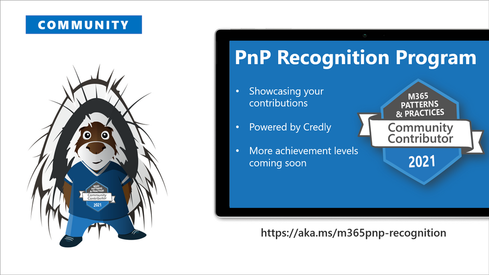

Microsoft 365 Platform Community (PnP) September 2022 update is out with a summary of the latest guidance, samples, and solutions from Microsoft or from the community for the community. This article is a summary of all the different areas and topics around the community work we do around Microsoft 365 ecosystem during the past month. Thank you for being part of this success.

_We are committed on building the best tech community in the world where everyone feels welcome and we help to empower each and every community member to achieve more._

## What is Microsoft 365 Platform Community

Microsoft 365 Platform Community is community activities coordinated by numerous teams inside of the Microsoft 365 engineering organizations. This is a community-driven open-source initiative where Microsoft and external community members are sharing their learning's around implementation practices for Microsoft 365.

Topics vary from Microsoft Viva, Microsoft Graph, Microsoft Teams, Power Platform, OneDrive and SharePoint. Active development and contributions happen in GitHub by providing contributions to the samples, reusable components, and documentation for various areas. PnP is owned and coordinated by Microsoft engineering, but this is work done by the community for the community.

The initiative is facilitated by Microsoft, but we have multiple community members as part of the platform community team (see team details in end of the article) and we are always looking to grow the Platform Community team with more community members. Notice that since this is open-source community initiative, so there’s no SLAs for the support for the samples provided through GitHub. Obviously, all officially released components and libraries are under official support from Microsoft.

### Main resources around Microsoft 365 Community

*   Microsoft 365 Platform Community - [https://aka.ms/m365pnp](https://aka.ms/m365pnp) - One location for all the resources and news around Microsoft 365 platform
*   Microsoft 365 community blog - [https://aka.ms/m365pnp/blog](https://aka.ms/m365pnp/blog)
*   Microsoft 365 development blog - [https://aka.ms/m365pnp-blog](https://aka.ms/m365pnp-blog)
*   Microsoft 365 Community Channel on YouTube - [https://aka.ms/m365pnp-videos](https://aka.ms/m365pnp-videos)
*   Microsoft 365 Developer YouTube channel - [https://aka.ms/M365DevYouTube](https://aka.ms/M365DevYouTube)

## ✍ Latest Dev Blog posts

### Microsoft 365 Developer Blog

Here are the latest blog posts and announcements around Microsoft 365 development topics from [https://developer.microsoft.com/microsoft-365/blogs](https://developer.microsoft.com/microsoft-365/blogs)

* 8th of September - [Start your journey to becoming a Microsoft 365 developer](https://devblogs.microsoft.com/microsoft365dev/start-your-journey-to-becoming-a-microsoft-365-developer/) by [Garry Trinder](https://twitter.com/garrytrinder) (Microsoft) | @Garrytrinder
* 31st of August - [Account linking with Microsoft Teams single sign-on](https://devblogs.microsoft.com/microsoft365dev/account-linking-with-microsoft-teams-single-sign-on/) by Aditya Challapally
* 30th of August - [Public preview of SharePoint Framework 1.16 – First release of upcoming features](https://devblogs.microsoft.com/microsoft365dev/public-preview-of-sharepoint-framework-1-16-first-release-of-upcoming-features/) by [Vesa Juvonen](https://twitter.com/vesajuvonen) (Microsoft) | @Vesajuvonen
* 30th of August - [Introducing Microsoft Teams App Camp](https://devblogs.microsoft.com/microsoft365dev/introducing-microsoft-teams-app-camp/) by [Bob German](https://twitter.com/Bob1German) (Microsoft) | @Bob1German
* 24th of August - [How Cloud Storage Partners integrate their services with Microsoft Teams and Office](https://devblogs.microsoft.com/microsoft365dev/how-cloud-storage-partners-integrate-their-services-with-microsoft-teams-and-office/) by Ben Summers (Microsoft)
* 23rd of August - [Build a productivity dashboard with Microsoft Teams Toolkit for Visual Studio](https://devblogs.microsoft.com/microsoft365dev/build-a-productivity-dashboard-with-microsoft-teams-toolkit-for-visual-studio/) by [Ayca Bas](https://twitter.com/aycabs) (Microsoft) | @Aycabs

### Microsoft 365 Platform Community Blog

Latest community posts at [https://aka.ms/m365pnp/community/blog](https://aka.ms/m365pnp/community/blog)

* 8th of September - [Patterns and Practices for SPFx Development](https://pnp.github.io/blog/post/patterns-and-practices-for-spfx-development/) by [Dipesh Bhanani](https://twitter.com/AskDipesh) | @AskDipesh
* 4th of September - [How do you monitor Azure resources with Power Platform](https://pnp.github.io/blog/post/how-to-monitor-azure-resources-with-power-platform/) by Duvan Baena | DuvanBaena 
* 4th of September - Series: [Build Power Apps that don't look like Power Apps - Material Design part 2](https://pnp.github.io/blog/post/build-powerapps-that-dont-look-like-powerapps-2/) by [Luise Freese](https://twitter.com/LuiseFreese) | @LuiseFreese
* 3rd of September - [Deploy static web sites with Power Platform](https://pnp.github.io/blog/post/deploy-static-web-sites-with-powerplatform/)  by Duvan Baena | DuvanBaena 
* 2nd of September -[ Sync Contacts to Outlook using Logic App and Graph extended property](https://pnp.github.io/blog/post/sync-contacts-with-outlook/) by Sohil Bhalla | sohilbhalla
* 25th of August - [Series: Build Power Apps that don't look like Power Apps - Material Design part 1](https://pnp.github.io/blog/post/build-powerapps-that-dont-look-like-powerapps-1/) by [Luise Freese](https://twitter.com/LuiseFreese) | @LuiseFreese

### Community call recording blog posts

* 6th of September - [Microsoft 365 Platform Community Call - 6th of September, 2022](https://pnp.github.io/blog/microsoft-365-platform-community-call/2022-09-06/)
* 1st of September - [Microsoft 365 & Power Platform Development Community call - 1st of September, 2022](https://pnp.github.io/blog/microsoft-365-developer-community-call/2022-09-01/)
* 25th of September - [Viva Connections & SharePoint Framework Community Call – 25th of August, 2022](https://pnp.github.io/blog/microsoft-viva-and-spfx-community-call/2022-08-25/)

## Microsoft 365 Developer Podcasts

### Microsoft 365 Developer Podcast

In the Microsoft 365 Developer Podcast, Jeremy Thake and Paul Schaeflein talk Microsoft 365 with fellow industry experts. The show formerly known as Office 365 Dev podcast is back. Soon new episodes to be published

* 1st of August - [TeamsJS SDK Update with Alicia Lu](https://www.m365devpodcast.com/e/teamsjs-sdk-update-with-alicia-liu/)

### Microsoft 365 PnP Weekly Podcasts and vlogs

PnP Weekly is a recurrent podcast with visitors where Vesa and Waldek talk about the latest news and announcements in Microsoft 365 and SharePoint areas.

* 5th of September - [Microsoft 365 PnP Weekly - Episode 177 - Kevin McDonnell](https://pnp.github.io/blog/microsoft-365-pnp-weekly/episode-177/)
* 30th of August - [Microsoft 365 PnP Weekly - Episode 176 - Daniel Laskewitz](https://pnp.github.io/blog/microsoft-365-pnp-weekly/episode-176/)
* 23rd of August - [Microsoft 365 PnP Weekly - Episode 175 - Gavin Barron](https://pnp.github.io/blog/microsoft-365-pnp-weekly/episode-175/)

## Community calls

There are numerous community calls on various areas. All calls are being recorded and published either from Microsoft 365 Developer or Microsoft 365 Community (PnP) YouTube channels. Recordings are typically released within the next 24 hours after the call. You can find a detailed agenda and links to specific covered topics on blog post articles at the Microsoft 365 developer blog when the videos are published.

*   Microsoft 365 Platform Call - [https://aka.ms/m365-dev-call](https://aka.ms/m365-dev-call) - Updates and demos from Microsoft as weekly call on Tuesdays - topics vary from Microsoft Teams, Microsoft Graph, Power Platform, SharePoint, OneDrive and more
*   Adaptive Cards [https://aka.ms/adaptivecardscommunitycall](https://aka.ms/adaptivecardscommunitycall) - Updates and news around Adaptive Cards with live demos
*   Microsoft identity platform [https://aka.ms/IDDevCommunityCalendar](https://aka.ms/IDDevCommunityCalendar) - Latest on the identity side
*   Office Add-ins [https://aka.ms/officeaddinscommunitycall](https://aka.ms/officeaddinscommunitycall) - News and community work around Office add-ins with live demos
*   Power Platform community call [https://aka.ms/PowerAppsMonthlyCall](https://aka.ms/PowerAppsMonthlyCall) - Monthly summary on Power Platform community with live demos
*   M365 Community Call [https://aka.ms/spdev-sig-call](https://aka.ms/spdev-sig-call) - Bi-weekly - General topics on Microsoft 365 Dev from various aspects - Microsoft Teams, Microsoft Graph Toolkit, Provisioning, Automation, Scripting, Power Automate, Solution design
*   Viva Connections & SharePoint Framework Community call [https://aka.ms/spdev-spfx-call](https://aka.ms/spdev-spfx-call) - Bi-weekly - Consists of topics around SharePoint Framework and JavaScript-based development in the Microsoft Teams and in SharePoint platform.

If you are interested in doing a live demo of your solution or sample in these calls, please do reach out to the Microsoft 376 Platform Community Team members (contacts later in this post) and they are able to help with the right setup. These are great opportunities to gain visibility for example for existing MVPs, for community members who would like to be MVPs in the future or any community member who'd like to share some of their learnings.

## Microsoft 365 Platform Community Ecosystem in GitHub

Most of the community driven repositories are in the PnP GitHub organization as samples are not product specifics as they can contain numerous different solutions or the solution works in multiple different applications.

*   [Microsoft Graph Toolkit](https://github.com/microsoftgraph/microsoft-graph-toolkit) - Repository and project on Microsoft Graph Toolkit controls - welcomes community contributors
*   [PnPjs](https://github.com/pnp/pnpjs) - PnPjs Framework repository
*   [CLI Microsoft 365](https://pnp.github.io/cli-microsoft365/) - Cross-OS command line interface to manage Office 365 tenant settings
*   [generator-spfx](https://github.com/pnp/generator-spfx) - Open-source Yeoman generator which extends the out-of-the-box Yeoman generator for \* SharePoint with additional capabilities
*   [generator-teams](https://github.com/pnp/generator-teams) - Open-source Microsoft Teams Yeoman generator - Bots, Messaging Extensions, Tabs, Connectors, Outgoing Web hooks and more
*   [teams-dev-samples](https://github.com/pnp/teams-dev-samples/) - Microsoft Teams targeted samples from community and Microsoft engineering
*   [script-samples](https://github.com/pnp/script-samples) - Scripting samples for automating operations in Microsoft 365 with PowerShell modules or CLIs
*   [Sharing is Caring](https://github.com/pnp/sharing-is-caring) - Getting started on learning how to contribute and be active on the community from GitHub perspective.
*   [pnpcore](https://github.com/pnp/pnpcore) - The PnP Core SDK is an SDK designed to work against Microsoft 365 with Microsoft Graph API first approach
*   [powershell](https://github.com/pnp/powershell) - PnP PowerShell module which is PowerShell Core module targeted for Microsoft 365
*   [pnpframework](https://github.com/pnp/pnpframework) - PnP Framework is a .Net Standard 2.0 library targeting Microsoft 365 containing the PnP Provisioning engine and a ton of other useful extensions
*   [spfx-reference-scenarios](https://github.com/pnp/spfx-reference-scenarios) - Samples for the Microsoft Teams and Viva Connections, implemented using SharePoint Framework
*   [sp-dev-fx-aces](https://github.com/pnp/sp-dev-fx-aces) - Samples on the Adaptive Card Extensions for Microsoft Viva
*   [sp-dev-fx-webparts](https://github.com/pnp/sp-dev-fx-webparts) - Client-side web part samples from community and Microsoft engineering
*   [sp-dev-fx-extensions](https://github.com/pnp/sp-dev-fx-extensions) - Samples and tutorial code around SharePoint Framework Extensions
*   [sp-dev-fx-library-components](https://github.com/pnp/sp-dev-fx-library-components) - Samples and tutorial code around the SharePoint Framework library components
*   [sp-starter-kit](https://github.com/pnp/sp-starter-kit) - Starter kit solution for SharePoint modern experiences
*   [sp-dev-build-extensions](https://github.com/pnp/sp-dev-build-extensions) - Different build extensions like gulp tasks and gulp plugins from the community and engineering around SharePoint development
*   [sp-dev-solutions](https://github.com/pnp/sp-dev-solutions) - Repository for more polished and fine-tuned reusable solutions build with SharePoint Framework
*   [sp-dev-samples](https://github.com/pnp/sp-dev-samples) - Repository for other samples related on the SharePoint development topics - WebHooks etc.
*   [sp-dev-fx-controls-react](https://github.com/pnp/sp-dev-fx-controls-react) - Reusable content controls for SharePoint Framework solutions build with React
*   [sp-dev-fx-property-controls](https://github.com/pnp/sp-dev-fx-property-controls) - Reusable property pane controls to be used in web part
*   [list-formatting](https://github.com/SharePoint/sp-dev-column-formatting) - Open-source community-driven repository for the column and view formatting JSON definitions
*   [sp-dev-site-scripts](https://github.com/pnp/sp-dev-site-scripts) - Open-source community-driven repository for community Site Designs and Site Scripts
*   [sp-dev-modernization](https://github.com/pnp/modernization) - Tooling and guidance around modernizing SharePoint from classic to modern
*   [sp-power-platform-solutions](https://github.com/pnp/sp-power-platform-solutions) - Solution and sample code for SharePoint Power Platform solutions
*   [powerfx-samples](https://github.com/pnp/powerfx-samples) - Samples that demonstrate different usage patterns for the Power Fx low-code programming language
*   [powerapps-samples](https://github.com/pnp/powerapps-samples) - Samples that demonstrate different usage patterns for Power Apps
*   [powerautomate-samples](https://github.com/pnp/powerautomate-samples) - Samples that demonstrate different usage patterns for Power Automate
*   [powerva-samples](https://github.com/pnp/powerva-samples) - Samples that demonstrate different usage patterns for Power Virtual Agents
*   [AdaptiveCards-Templates](https://github.com/pnp/AdaptiveCards-Templates) - Samples on showcasing the art of possible with Adaptive cards

All SharePoint specific repositories or services supported directly by Microsoft are located in the SharePoint GitHub organization

*   [sp-dev-docs](https://github.com/SharePoint/sp-dev-docs) - Source for new SharePoint dev center documentation exposed from [https://docs.microsoft.com/sharepoint/dev](https://docs.microsoft.com/sharepoint/dev)
*   [sp-dev-provisioning-templates](https://github.com/SharePoint/sp-dev-provisioning-templates) - Open-source templates used by the [SharePoint Look Book site](https://lookbook.microsoft.com/)
*   [sp-provisioning-service](https://github.com/SharePoint/sp-provisioning-service) - Source code of the [SharePoint look book site](https://lookbook.microsoft.com/)

Classic PnP named repositories - older tooling

*   [PnP-Tools](https://github.com/pnp/PnP-Tools) - Tools and scripts targeted more for IT Pro's and for on-premises for SP2013 and SP2016
*   [PnP-Provisioning-Schema](https://github.com/pnp/PnP-Provisioning-Schema) - PnP Provisioning engine schema repository

Repositories in the GitHub [Microsoft Search](https://github.com/microsoft-search) organization controlled by the PnP initiative

*   [pnp-modern-search](https://github.com/microsoft-search/pnp-modern-search) - Home of PnP Modern Search solutions, see more from the [documentation](https://microsoft-search.github.io/pnp-modern-search/)

Other related resources from GitHub

*   [Office add-in Patterns and Practices](https://github.com/OfficeDev/Office-Add-in-samples) in GitHub - Community contributions welcome!
*   [Microsoft Graph](https://github.com/microsoftgraph) GitHub organization
*   [OfficeDev](https://github.com/officedev) GitHub organization - Includes all Microsoft Teams samples from Microsoft

## What's supportability story around the community tooling and assets?

Following statements apply across all of the community lead and contributed samples and solutions, including samples, core component(s) and solutions, like SharePoint Starter Kit, yo teams or PnP PowerShell. All Microsoft released SDKs and tools are supported based on the specific tool policies.

*   PnP guidance and samples are created by Microsoft & by the Community
*   PnP guidance and samples are maintained by Microsoft & community
*   PnP uses supported and recommended techniques
*   PnP is an open-source initiative by the community – people who work on the initiative for the benefit of others, have their normal day job as well
*   PnP is NOT a product and therefore it’s not supported by Premier Support or other official support channels
*   PnP is supported in similar ways as other open source projects done by Microsoft with support from the community by the community
*   There are numerous partners that utilize PnP within their solutions for customers. Support for this is provided by the Partner. When PnP material is used in deployments, we recommend being clear with your customer/deployment owner on the support model

Please see the specifics on the supportability on the tool, SDK or component repository or download page.

## Microsoft 365 Platform Community team model

In April 2020 we announced our new [Microsoft 365 PnP team model](https://devblogs.microsoft.com/microsoft365dev/new-microsoft-365-patterns-and-practices-pnp-team-model-with-new-community-leads/) and grew the MVP team quite significantly. PnP model exists for having more efficient engagement between Microsoft engineering and community members. Let's build things together. Your contributions and feedback is always welcome! During August, we also crew the team with 5 new members. PnP Team coordinates and leads the different open-source and community efforts we execute in the Microsoft 365 platform.

We welcome all community members to get involved on the community and open-source efforts. Your input do matter!

* [New Microsoft 365 Platform (PnP) team members - June 2022](https://pnp.github.io/blog/post/new-pnp-team-members-june-2022/)
    * [Anoop Tatti](https://twitter.com/anooptells) (Content+Cloud) | @Anooptells
    * [Fabio Franzini](https://twitter.com/franzinifabio) (Apvee) | @franzinifabio

*   New Microsoft 365 Platform (PnP) team members - March 2022
    *   [Chandani Prajapati](https://twitter.com/Chandani_SPD) (Rapid Circle) | @Chandani_SPD
    *   [Arjun Menon](https://twitter.com/arjunumenon) (Tata Consulting Services) | @Arjunumenon
    *   [Sergei Sergeev](https://twitter.com/sergeev_srg) | @Sergeev\_srg

*   [New Microsoft 365 Patterns and Practices (PnP) team members – November 2021](https://pnp.github.io/blog/post/new-microsoft-365-patterns-and-practices-pnp-team-members)

    *   [Geetha Sivasailam](https://twitter.com/gsived) (Artis Consulting) | @GSiVed,
    *   [Natalie Pienkowska](https://twitter.com/NataliePienkow1) (Microsoft) | @NataliePienkow1,
    *   [Derek Cash-Peterson](https://twitter.com/spdcp) (Sympraxis Consulting) | @Spdcp,
    *   [João J. Mendes](https://twitter.com/joaojmendes) (Valo) | @Joaojmendes,
    *   [Joel Rodrigues](https://twitter.com/JoelFMRodrigues) (Storm Technology) | @JoelFMRodrigues,
    *   [Rick Van Rousselt](https://twitter.com/RickVanRousselt) (Advantive) | @RickVanRousselt
    *   [Stephan Bisser](https://twitter.com/stephanbisser) (Solvion) | @Stephanbisser,
    *   [Tetsuya Kawahara](https://twitter.com/techan_k) | @Techan\_k,
    *   [Thomas Gölles](https://twitter.com/thomyg) (Solvion) | @Thomyg

*   [New Microsoft 365 Patterns and Practices (PnP) team members - May 2021](https://pnp.github.io/blog/post/new-microsoft-365-patterns-and-practices-pnp-team-members-may)

    *   [Gautam Sheth](https://twitter.com/gautamdsheth) (Valo),
    *   [Patrick Lamber](https://github.com/plamber) (Experts Inside AG)

*   [New Microsoft 365 Patterns and Practices (PnP) team members - February 2021](https://devblogs.microsoft.com/microsoft365dev/new-microsoft-365-patterns-and-practices-pnp-team-members-february-2021/)
    *   [April Dunnam](https://twitter.com/aprildunnam) (Microsoft),
    *   [Emily Mancini](https://twitter.com/EEMancini) (Sympraxis Consulting),
    *   [Veronique Lengelle](https://twitter.com/veronicageek) (CPS)

*   [New Microsoft 365 Patterns and Practices (PnP) team members - December 2020](https://devblogs.microsoft.com/microsoft365dev/new-microsoft-365-patterns-and-practices-pnp-team-members-2/)
    *   [Luise Freese](https://twitter.com/LuiseFreese)
    *   [Sébastien Levert](https://twitter.com/sebastienlevert/) (Microsoft)

*   [New Microsoft 365 Patterns and Practices (PnP) team members - August 2020](https://devblogs.microsoft.com/microsoft365dev/new-microsoft-365-patterns-and-practices-pnp-team-members/) -
    *   [Albert-Jan Schot](https://twitter.com/appieschot) (BLIS Digital),
    *   [Koen Zomers](https://twitter.com/koenzomers) (Microsoft),
    *   [Paul Bullock](https://twitter.com/pkbullock) (Avanade),
    *   [Rabia Williams](https://twitter.com/williamsrabia) (Microsoft),
    *   [Yannick Plenevaux](https://twitter.com/yp_code) (PVX Solutions)

Got feedback, suggestions or ideas? - Please let us know. Everything we do in this program is for your benefit. Feedback and ideas are more than welcome so that we can adjust the process for benefitting you even more.

## Microsoft 365 PnP Recognition Program

We are excited to announce new community contributor program for all the active community members. Through this program you can get officially acknowledged with the a [Credly badge](https://www.credly.com/org/m365pnp/badge/community-contributor-2021) around your work on our open-source and community channels. See more from

[https://pnp.github.io/recognitionprogram/](https://pnp.github.io/recognitionprogram/). Thank you for being part of this journey with us.

## ⚙ Area-specific updates

These are different areas which are closely involved on the community work across the PnP initiative. Some are lead and coordinated by engineering organizations, some are coordinated by the community and MVPs.

### Microsoft Graph Toolkit

Microsoft Graph Toolkit is engineering lead initiative, which works closely with the community on the open-source areas. The Microsoft Graph Toolkit is a collection of reusable, framework-agnostic web components and helpers for accessing and working with Microsoft Graph. The components are fully functional right of out of the box, with built in providers that authenticate with and fetch data from Microsoft Graph.

*   Latest version currently is 2.6.1
*   [mgt.dev](https://mgt.dev/?path=/story/components-mgt-agenda--simple) - Microsoft Graph Toolkit Playground
*   [Getting started with Microsoft Graph Toolkit guidance video](https://www.youtube.com/watch?v=TbAZHvB5NEk) from developer community call by [Beth Pan](https://twitter.com/beth_panx) (Microsoft)
*   Latest code and preview versions from [https://aka.ms/mgt](https://github.com/microsoftgraph/microsoft-graph-toolkit)

All the latest updates on the Microsoft Graph Toolkit is being presented in our bi-weekly Microsoft 365 Generic Dev community call, including the latest community contributors.

### Microsoft 365 Community Docs

The Community Docs model was announced in April 2020 and it's great to see the interest for community to help each other by providing new guidance on non-dev areas. See more on the announcement from the SharePoint blog - [Announcing the Microsoft 365 Community Docs](https://techcommunity.microsoft.com/t5/microsoft-sharepoint-blog/announcing-the-microsoft-365-community-docs/ba-p/1288203). We welcome contributions from the community: our objective is to build a valuable location for articles from Microsoft and the community together.

Have ideas for articles or want to contribute yourself? - Get involved! Here are also some additional resources explaining the model in more detail.

*   YouTube - [Introducing Microsoft 365 Community Docs](https://www.youtube.com/watch?v=HTbgjWvsh3k)
*   [GitHub issue list](https://github.com/MicrosoftDocs/microsoft-365-community/issues) with articles ideas

### SharePoint Framework development samples

These are the updated SharePoint Framework samples which are available from the different repositories.

* New sample [react-copy-views](https://github.com/pnp/sp-dev-fx-webparts/tree/main/samples/react-copy-views) by  [Martin Lingstuyl](https://twitter.com/martinlingstuyl) (I4-YOU)| @Martinlingstuy
* New sampple [ImageCard-PublicHolidays](https://github.com/pnp/sp-dev-fx-aces/tree/main/samples/ImageCard-PublicHolidays) by [Nanddeep Nachan](https://twitter.com/NanddeepNachan) | @nanddeepNachan
* Updated sample [PrimaryTextCard-RecentFiles](https://github.com/pnp/sp-dev-fx-aces/tree/main/samples/PrimaryTextCard-RecentFiles) by Guido Zambarda (PiaSys) 

How to find what's relevant for you? Take advantage of our SharePoint Framework web part and extension sample galleries - also includes solutions which work in Microsoft Teams

*   Web Part sample gallery - [https://aka.ms/spfx-webparts](https://aka.ms/spfx-webparts)
*   Extensions sample gallery - [https://aka.ms/spfx-extensions](https://aka.ms/spfx-extensions)
*   Viva Connections Adaptive Card samples - [https://aka.ms/spfx-aces](https://aka.ms/spfx-aces)
*   Microsoft Teams samples built with SharePoint Framework - [https://github.com/pnp/spfx-reference-scenarios](https://github.com/pnp/spfx-reference-scenarios)

### Microsoft Teams community samples

These are samples which have been contributed on the community samples since last summary. We do welcome all Microsoft Teams samples to this gallery. They can be implemented using in any technology.

*   New sample [tab-meeting-details](https://github.com/pnp/teams-dev-samples/tree/main/samples/tab-meeting-details) by [Markus Möller](https://twitter.com/Moeller2_0) (Avanade) | @Moeller2\_0

### Power Platform samples

* New sample [TheSvgWorld-SVGexamples](https://github.com/pnp/powerapps-samples/tree/main/samples/TheSvgWorld-SVGexamples) by [Robin Rosengrün](https://twitter.com/power_r2) | @power_r2
* New sample [progress-bar](https://github.com/pnp/powerapps-samples/tree/main/samples/progress-bar) by [Luise Freese](https://twitter.com/LuiseFreese) (M365Princess) | @LuiseFreese
* New sample [accessibility-color-contrast-checker](https://github.com/pnp/powerapps-samples/tree/main/samples/accessibility-color-contrast-checker) by [Luise Freese](https://twitter.com/LuiseFreese) (M365Princess) | @LuiseFreese
* New sample [fluentui-for-teams-theme](https://github.com/pnp/powerapps-samples/tree/main/samples/fluentui-for-teams-theme) by [Luise Freese](https://twitter.com/LuiseFreese) (M365Princess) | @LuiseFreese
* New sample [timesheet-using-dataverse](https://github.com/pnp/powerapps-samples/tree/main/samples/timesheet-using-dataverse) by [Darren Lutchne](https://twitter.com/assist_365) | @assist_365
* New sample [sharepoint-get-terms-from-term-store](https://github.com/pnp/powerautomate-samples/tree/main/samples/sharepoint-get-terms-from-term-store) by [Ramin Ahmadi](https://twitter.com/raminahmadi1986) | @raminahmadi19
* New sample [sharepoint-set-item-level-permissions](https://github.com/pnp/powerautomate-samples/tree/main/samples/sharepoint-set-item-level-permissions) by [Ramin Ahmadi](https://twitter.com/raminahmadi1986) | @raminahmadi19
* New sample [sharepoint-group-creation-with-user-added](https://github.com/pnp/powerautomate-samples/tree/main/samples/sharepoint-group-creation-with-user-added) by [Django Lohn](https://www.twitter.com/LohnDjango) (InSpark) | @LohnDjango
* New sample [ProjectForTheWeb-Provisioning](https://github.com/pnp/powerautomate-samples/tree/main/samples/ProjectForTheWeb-Provisioning) by [Lenard Schockert](https://github.com/Lschockaert) | Lschockaert
There were also numerous smaller updates on the different Power Platforms samples. See more details on available samples from following location

Power Platform sample gallery - [https://aka.ms/powerplatform-samples](https://pnp.github.io/powerplatform-samples/)

If you have any existing samples which you'd be willing to share with others - please submit a pull request or contact the PnP team members to get started on getting more closely involved on this initiative. Here to help.

### Microsoft 365 Script Samples

We welcome all scripts on Microsoft 365 automation to this centralized repository, targeted to help to manage and automate day-to-day operations.

Here are the latest updates on the Script Samples:

<!-- Paul, your script samples go in here :-) -->

If you have any existing scripts which you'd be willing to share with others - please submit a pull request or contact the PnP team members to get started on getting more closely involved on this initiative.

Microsoft 365 Script Samples - [https://aka.ms/script-samples](https://aka.ms/script-samples)

### Independent Publisher Connectors Program

Microsoft Power Platform comes with a huge variety of already built-in connectors and also provides you with the ability of creating your own custom connectors. As of July 2021, anyone can submit the connectors they build to Microsoft Power Platform so that they can be used by others on Power Automate, Power Apps, and Azure Logic Apps. Previously, only API owners could publish their connectors. The Independent Publisher Connector Program's mission is to bring the best together: the best people, connecting great ideas to data, apps, and flows. We want to make it easier for connector developers to collaborate on connectors.

For more information, you can watch this video on [Publish a connector to the Publish a connector to the Power Platform with Independent Publisher Conn...](https://www.youtube.com/watch?v=ulTBvCHw8MU) and check out [Microsoft Power Platform Connectors](https://github.com/microsoft/PowerPlatformConnectors) on GitHub

#### These are the latest connectors

<!-- Natalie, the independent pubblisher connectors go in here :-) -->

* ConvertKit - [Troy Taylor](https://twitter.com/troystaylor) (Hitachi Solutions) | @Troystaylor
* Datamuse - [Troy Taylor](https://twitter.com/troystaylor) (Hitachi Solutions) | @Troystaylor
* Every - [Troy Taylor](https://twitter.com/troystaylor) (Hitachi Solutions) | @Troystaylor
* File.io - [Troy Taylor](https://twitter.com/troystaylor) (Hitachi Solutions) | @Troystaylor
* Microsoft Partner Center - Oleksii Skirko
* Moosend - [Troy Taylor](https://twitter.com/troystaylor) (Hitachi Solutions) | @Troystaylor
* RescueGroups.org - [Troy Taylor](https://twitter.com/troystaylor) (Hitachi Solutions) | @Troystaylor
* SchoolDigger - [Troy Taylor](https://twitter.com/troystaylor) (Hitachi Solutions) | @Troystaylor
* Shadify - [Troy Taylor](https://twitter.com/troystaylor) (Hitachi Solutions) | @Troystaylor
* SignUpGenius - [Troy Taylor](https://twitter.com/troystaylor) (Hitachi Solutions) | @Troystaylor
* Snowflake - [Rene Koch](https://github.com/rekodus)
* SOS Inventory - [Harold Anderson](https://github.com/Harold-Anderson)
* Zenler - [Troy Taylor](https://twitter.com/troystaylor) (Hitachi Solutions) | @Troystaylor

### 🧡 Sharing is Caring initiative

The "Sharing Is Caring" initiative is targeted for learning the basics around making changes in Microsoft Docs, in GitHub, submitting pull requests to the PnP repositories and in GitHub in general. Take advantage of this instructor lead training for learning how to contribute to docs or to open-source solutions. Everyone is welcome to learn how to get started on contributing to open-source docs or code!

See more from the [guidance documentation](https://pnp.github.io/sharing-is-caring/) - including all upcoming instructor lead sessions which you can participate!

## ✍ Different Microsoft 365 related open-source initiatives build together with the community

*   **Microsoft Look Book** - Discover the modern experiences you can build with SharePoint in Microsoft 365. Look book provides design examples for SharePoint Online which can be automatically provisioned to any tenant in the world. See more from [https://lookbook.microsoft.com](https://lookbook.microsoft.com/). This service is also provided as open-source solution sample from [GitHub](https://github.com/SharePoint/sp-provisioning-service).
*   **yo teams** - Open-source Yeoman generator for Microsoft Teams extensibility. Supports creation of bots, messaging extensions, tabs (with SSO), connectors and outgoing Webhooks. See more from [https://aka.ms/yoteams](https://github.com/pnp/generator-teams).
*   **PnP Framework** - .NET Standard 2.0 SDK containing the classic PnP Sites Core features for SharePoint Online. More around this package from GitHub.
*   **PnP Core SDK** - The PnP Core SDK is an SDK designed to work for Microsoft 365 with Graph API first approach. It provides a unified object model for working with SharePoint Online and Teams which is agnostic to the underlying API's being called. See more around the SDK from [documentation](https://pnp.github.io/pnpcore/).
*   **PnP PowerShell** - PnP PowerShell is a .NET Core 3.1 / .NET Framework 4.6.1 based PowerShell Module providing over 400 cmdlets that work with Microsoft 365 environments and more specifically SharePoint Online and Microsoft Teams. See more details from [documentation](https://pnp.github.io/powershell/).
*   **Reusable SharePoint Framework controls** - Reusable controls for SharePoint Framework web part and extension development. Separate projects for [React content controls](https://pnp.github.io/sp-dev-fx-controls-react/) and [Property Pane controls for web parts](https://github.com/pnp/sp-dev-fx-property-controls). These controls are using Office UI Fabric React controls under the covers and they are SharePoint aware to increase the productivity of developers.
*   **CLI for Microsoft 365** - Cross-OS command line interface to manage Office 365 tenant settings. See [release notes](https://pnp.github.io/cli-microsoft365/about/release-notes/) for latest updates.
*   **PnPJs** - PnPJs encapsulates SharePoint REST APIs and provides a fluent and easily usable interface for querying data from SharePoint sites. It's a replacement of already deprecated pnp-js-core library. See [changelog](https://github.com/pnp/pnpjs/blob/version-3/CHANGELOG.md) for the latest updates.
*   **PnP Provisioning Engine and PnP CSOM Core** - PnP provisioning engine is part of the PnP CSOM extension. They encapsulate complex business driven operations behind easily usable API surface, which extends out-of-the-box CSOM NuGet packages. See [changelog](https://github.com/pnp/PnP-Sites-Core/blob/master/CHANGELOG.md) for the latest updates.
*   **PnP PowerShell** - PnP PowerShell cmdlets are open-source complement for the SharePoint Online cmdlets. There are more than 300 different cmdlets to use and you can use them to manage tenant settings or to manipulate actual SharePoint sites. See [changelog](https://github.com/pnp/PnP-PowerShell/blob/master/CHANGELOG.md) for the latest updates.
*   **PnP Modern Search solution** - The PnP 'Modern Search' solution is a set of SharePoint Online modern Web Parts allowing SharePoint super users, webmasters and developers to create highly flexible and personalized search based experiences in minutes. See more details on the different supported capabilities from [https://aka.ms/pnp-search](https://microsoft-search.github.io/pnp-modern-search/).
*   **Modernization tooling** - All tools and guidance on helping you to transform you SharePoint to modern experiences from [https://aka.ms/sppnp-modernize](https://docs.microsoft.com/sharepoint/dev/transform/modernize-classic-sites).
*   **SharePoint Starter Kit v2** - Building modern experiences with Microsoft Teams flavors for SharePoint Online and SharePoint 2019 - reference solution in [GitHub](https://github.com/pnp/sp-starter-kit).
*   **List formatting definitions** - Community contributed samples around the column and view formatting in [GitHub](https://github.com/pnp/List-Formatting).
*   **Site Designs and Site Scripts** - Community contributed samples around \* SharePoint Site Designs and Site Scripts in [GitHub](https://github.com/pnp/sp-dev-site-scripts).
*   **DevOps tooling and scripts** - Community contributed scripts and tooling automation around DevOps topics (CI/CD) in [GitHub](https://github.com/pnp/sp-dev-build-extensions).
*   **Teams provisioning solution** - Set of open-source Azure Functions for Microsoft Teams provisioning. See more details from [GitHub](https://github.com/pnp/OrchestratedProvisioning).

### ✍ Documentation updates

*   Microsoft Teams platform documentation - [Microsoft Docs](https://docs.microsoft.com/microsoftteams/platform/) | [GitHub](https://github.com/MicrosoftDocs/msteams-docs)
*   SharePoint Developer documentation - [Microsoft Docs](https://docs.microsoft.com/sharepoint/dev/) | [GitHub](https://github.com/SharePoint/sp-dev-docs)
*   Microsoft Graph documentation - [Microsoft Docs](https://docs.microsoft.com/graph/) | [GitHub](https://github.com/microsoftgraph/microsoft-graph-docs)
*   Office add-in documentation - [Microsoft Docs](https://docs.microsoft.com/office/dev/add-ins/) | [GitHub](https://github.com/OfficeDev/office-js-docs-pr)

## Microsoft 365 Developer and Microsoft 365 Community YouTube video channels

You can find all Microsoft 365 related videos on our YouTube Channel at [https://aka.ms/m365pnp/videos](https://www.youtube.com/channel/UC_mKdhw-V6CeCM7gTo_Iy7w) or at [Microsoft 365 Dev](https://www.youtube.com/channel/UCV_6HOhwxYLXAGd-JOqKPoQ). These channels contains already a significant amount of detailed training material, demo videos, and community call recordings.

### Microsoft demo videos

Here are the new Microsoft demo or guidance videos released since the last monthly summary:

*  [Make an API call in less than one minute...](https://www.youtube.com/shorts/JG6S4DWsScI) by [Ayca Bas](https://twitter.com/aycabs) (Microsoft) | @Aycabs

### Community demo videos

* [Building a SharePoint Document Library Approvals System](https://www.youtube.com/watch?v=CHqQz9Azfm8) by [Lindsay Shelton](https://twitter.com/lshelton_tech) (Stowers Institute for Medical Research) | @lshelton_tech

## Key contributors to the September 2022 update

Here’s the list of active contributors (in alphabetical order) since last release details in GitHub repositories or community channels. PnP is really about building tooling and knowledge together with the community for the community, so your contributions are highly valued across the Microsoft 365 customers, partners and obviously also at Microsoft.

Thank you for your assistance and contributions on behalf of the community. You are truly making a difference! If we missed someone, please let us know.

### Community people

*   x[Aaron Bumberger](https://github.com/mackilroy007) | mackilroy007
*   x[Abdul Mughni Ansari](https://www.twitter.com/Ansarimughni) (Hexaware) | @Ansarimi
*   [Adam Wójcik](https://twitter.com/Adam25858782) (Hitachi Energy) | @Adam2585878
*   x[Ahmad](https://www.twitter.com/ahmadpirani) | @ahmadpirani
*   x[Aimery Thomas](https://twitter.com/aimery_thomas) | @aimery_thomas
*   [Albert-Jan Schot](https://twitter.com/appieschot) (BLIS Digital) | @Appieschot
*   x[Ali Robertson](@https://twitter.comalirobe) |@alirobe
*   x[Anand Vragav](https://twitter.com/anandVragav) | @anandVragav
*   Anders Roos | AndersSahlin
*   x[André Lage](https://twitter.com/aaclage) (Datalynx AG) | @aaclage
*   [Andrew Connell](https://twitter.com/andrewconnell) (Voitanos) | @Andrewconnell
*   x[Andrew Pilcher](https://www.github.com/andrewpilcher) (CSULB) | andrewpilcher
*   x[Andy](https://www.github.com/ITAndy) (white & Case) | ITAndy
*   [Anoop Tatti](https://twitter.com/anooptells) (Content+Cloud) | @Anooptells
*   x[Arash Aghajani](ps://twitter.com/AghajaniArash) | @AghajaniArash
*   [Arjun Menon](https://twitter.com/arjunumenon) (Tata Consulting Services) | @Arjunumenon
*   x[Arleta Wanat](https://github.com/PowershellScripts) | PowershellScripts
*   x[Arun Kumar Perumal](https://twitter.com/@arun_perumal16 ) | @arun_perumal16
*   x[Ashish Kumar Baranwal](https://www.twitter.com/ashish2baranwal) (Tata) | @ashish2baranwal
*   [Beau Cameron](https://twitter.com/Beau__Cameron) (Aerie Consulting) | @Beau\_\_Cameron
*   x[Ben Kereopa-Yorke](https://www.github.com/Benjamin-KY) (Telstra) | Benjamin-KY
*   x[Benny Killua](https://twitter.com/Bennykillua) | @Bennykill
*   x[Brenden Salter](https://www.twitter.com/GinjaCodeNinja) (Northern Computer) | @GinjaCodeNinja
*   x[Chris Aragao](https://www.twitter.com/aragaocb) | @aragaocb
*   [Chris Kent](https://twitter.com/theChrisKent) (DMI) | @TheChrisKent
*   x[Christian Zuellig](https://github.com/czullu) (MondayCoffee) | czullu
*   x[Christophe Humbert](https://twitter.com/Path2SharePoint) | @Path2SharePoint
*   [Chandani Prajapati](https://twitter.com/Chandani_SPD)  (Rapid Circle) | @Chandani_SPD
*   x[Clément Olivier](https://twitter.com/Clement0livier ) | @Clement0livier  
*   x[Craig Savel](https://www.github.com/csavel) (Population Council) | csavel
*   x[Daniel Watford](https://twitter.com/danwatford) | @danwatford
*   x[Dennis Goedegebuure](https://twitter.com/expiscornovus) (Ultima Business Solutions) | Expiscornovus
*   x[Darren Lutchne](https://twitter.com/assist_365) | @assist_365
*   [Derek Cash Peterson](https://www.twitter.com/spdcp) (Sympraxis Consulting) | @Spdcp
*   [Dipesh Bhanani](https://twitter.com/AskDipesh) | @AskDipesh
*   x[Divya Akula](https://www.twitter.com/_divyaakula) | @_divyaakula
*   x[Django Lohn](https://www.twitter.com/LohnDjango) (InSpark) | @LohnDjango
*   x[Don Kirkham](https://www.twitter.com/DonKirkham) (DMI, Inc) | @DonKirkham
*   [Duvan Baena](https://twitter.com/djb349) | @djb349
*   x[Eli Schei](https://twitter.com/acupof_dev) | @acupof_dev
*   xElinor | ElinorW
*   [Elio Struyf](https://twitter.com/eliostruyf) (Struyf Consulting) | @Eliostruyf
*   [Emily Mancini](https://twitter.com/EEMancini) (Sympraxis Consulting) | @EEMancini
*   x[Emanuele Bartolesi](https://twitter.com/kasuken) (SoftwareONE) | @kasuken  
*   x[Eric Overfield](https://twitter.com/EricOverfield) (PixelMill) | @EricOverfield
*   [Erwin van Hunen](https://twitter.com/erwinvanhunen) (Valo Intranet) | @Erwinvanhunen
*   [Fabio Franzini](https://twitter.com/franzinifabio) (Apvee) | franzinifabio
*   xFederico Sapia (ANPAL Servizi)
*   x[Felix Bohnacker](https://github.com/felixbohnacker) | felixbohnacker
*   x[Fenil Desai](https://www.twitter.com/fenildesai) (TCS) | @fenildesai
*   flowerbot | flowerbot
*   x[Franck Cornu](https://twitter.com/FranckCornu) | @FranckCornu
*   x[Frederik Bisback](https://www.twitter.com/bisbackFrederik) | @bisbackFrederik
*   [Gautam Sheth](https://twitter.com/gautamdsheth) (Valo Solutions) | @Gautamdsheth
*   [Geetha Sivasailam](https://twitter.com/gsived) (Artis Consulting) | @GSiVed
*   x[Giacomo Pozzoni](https://github.com/jackpoz) (Fellowmind) | jackpoz
*   Guido Zambarda (PiaSys)
*   x[Harold Anderson](https://github.com/Harold-Anderson)
*   xHilton Giesenow | HiltonGiesenow
*   x[Ivan Wilson](https://twitter.com/IvanWilson) | @IvanWilson
*   x[James May](https://twitter.com/fowl2) | @fowl2
*   Jarbas Horst | JarbasHorst
*   [Jasey Waegebaert](https://github.com/Jwaegebaert) (GMI Group) | Jwaegebaert
*   x[Jim Duncan](https://www.twitter.com/sparchitect) (ShareSquared) | @Sparchitect
*   x[Jimmy Hang](https://www.linkedin.com/in/jimmyhang/)
*   x[Jiten Palmer](https://twitter.com/Jitenpa44241205)  | @Jitenpa44241205
*   [João Ferreira](https://twitter.com/Joao12Ferreira) | @Joaoferreira
*   [João J. Mendes](https://twitter.com/joaojmendes) (Valo Solutions) | @Joaojmendes
*   [Joel Rodrigues](https://twitter.com/JoelFMRodrigues) (Storm Technology) | @JoelFMRodrigues
*   [Julie Turner](https://twitter.com/jfj1997) (Sympraxis Consulting) | @Jfj1997
*   [Laura Kokkarinen](https://twitter.com/LauraKokkarinen) (Sulava) | @LauraKokkarinen
*   [Lee Ford](https://twitter.com/lee_ford) (Symity) | @lee_ford
*   xLeif Fredriksen | Leif-Frederiksen
*   x[Lenard Schockert](https://github.com/Lschockaert) | Lschockaert
*   x[Leon Armston](https://twitter.com/LeonArmston) (Intelogy) | @LeonArmston
*   x[Lewis Baybutt](https://twitter.com/lowcodelewis) (HybrIT) |@lowcodelewis
*   x[Lindsay Shelton](https://twitter.com/lshelton_tech) (Stowers Institute for Medical Research) | @lshelton_tech
*   xLlewellyn Roos | Llewellyn Roos
*   [Luise Freese](https://twitter.com/LuiseFreese) (M365Princess) | @LuiseFreese
*   [Luis Mañez](https://twitter.com/luismanez) () | @luismanez
*   x[Maarten van Stam](https://twitter.com/aafvstam) | @aafvstam
*   [Marc D Anderson](https://twitter.com/sympmarc) (Sympraxis Consulting) | @Sympmarc
*   x[Marcin Wojciechowski](https://twitter.com/mgwojciech) (Valo) | @mgwojciech
*   x[Marcus Blennegård](https://twitter.com/mblennegard) (Sogeti)  | @mblennegard
*   x[Markus Möller](https://twitter.com/Moeller2_0) (Avanade) | @Moeller2\_0
*   [Martin Lingstuyl](https://twitter.com/martinlingstuyl) (I4-YOU)| @Martinlingstuy
*   x[Mathijs Verbeeck](https://github.com/MathijsVerbeeck) | MathijsVerbeeck
*   x[Matt Schuessler](https://www.twitter.com/MattSchues) | @MattSchues
*   x[Mai Mostafa](https://github.com/Maya-Mostafa) | Maya-Mostafa
*   x[Michaël Maillot](https://twitter.com/michael_maillot) (OnePoint) | @michael_maillot
*   x[Miguel Angel García](https://twitter.com/miangama) | @Miangama
*   xMiguel A. Tena | mikewar 
*   x[Miguel Verweij](https://twitter.com/miguelverweij) (Sogeti) | @MiguelVerweij
*   xMilan Holemans | milanholeman
*   xMorten Andersen | spcph
*   [Musale Martin](https://twitter.com/m4musale) | @m4musale
*   [Nanddeep Nachan](https://twitter.com/NanddeepNachan) | @nanddeepNachan
*   xOleksii Skirko
*   [Paolo Pialorsi](https://twitter.com/PaoloPia) (PiaSys.com) | @PaoloPia
*   [Patrick Lamber](https://twitter.com/patricklamber) (ExpertsInside AG) | @Patricklamber
*   [Paul Bullock](https://twitter.com/pkbullock) (Avanade) | @pkbullock
*   x[Paul Matthews](https://twitter.com/cann0nf0dder)  | @cann0nf0dder
*   [Paul Schaeflein](https://twitter.com/paulschaeflein) (AddIn365) | @Paulschaeflein
    x[Phil McNiven](https://www.github.com/phil0074) | phil0074
    x[Priscilla Panizza](https://www.twitter.com/ptpanizza) (Liberty Bank) | @ptpanizza
*   x[Rachel Irabor](https://www.twitter.com/Richie4love) | @Richie4l
*   x[Ramin Ahmadi](https://twitter.com/raminahmadi1986) (Content and Cloud) | @raminahmadi1986
*   x[Rene Koch](https://github.com/rekodus)
*   x[Rene Modery](https://twitter.com/modery) (WPP) | @modery 
*   xrentu | SLdragon
*   [Reshmee Auckloo](https://www.twitter.com/ReshmeeAuckloo) (Pension Protection Fund) | @ReshmeeAuckloo
*   [Rick Van Rousselt](https://twitter.com/RickVanRousselt) (Advantive) | @RickVanRousselt
*   xRob Ellis | ee61re
*   x[Robin Rosengrün](https://twitter.com/power_r2) | @power_r2
*   Rosa Alice | alicelupsan
*   x[Russell Gove](https://twitter.com/russgove)  (Tronox) | @russgove
*   salascz | salascz
    x[Sami Stephan](https://www.github.com/sstephan01) (SubCom, LLC) | sstephan01
*   [Sergei Sergeev](https://twitter.com/sergeev_srg) | @Sergeev\_srg
*   x[Sharon Weaver](https://www.twitter.com/sharoneweaver) (Smarter Consulting) | @Sharoneweaver
*   x[Siddharth Vaghasia](https://twitter.com/siddh_me) | @Siddh\_me
*   x[Simon Doy](https://www.twitter.com/simondoy) (iThink 365) | @Simondoy
*   x[Simon Hudson](https://www.twitter.com/simonjhudson) (Novia Works) | @Simonjhudson
    x[Sivam Pandey](https://www.twitter.com/sivamspandey) (HCL Technologies) | @sivamspandey
    SlowRobot | SlowRobot
*   x[Smita Nachan](https://twitter.com/smitanachan) | @SmitaNachan
*   Sohil Bhalla | sohilbhalla
*   [Stefan Bauer](https://twitter.com/StfBauer) (n8d) | @StfBauer
*   [Stephan Bisser](https://twitter.com/stephanbisser) (Solvion) | @Stephanbisser
*   x[Sudharsan Kesavanarayanan](https://twitter.com/sudharsank) (NTT Digital Business Solutions) | @sudharsank
    x[Sven Sieverding](https://www.twitter.com/365Knoten) (team neusta) | @365Knoten
*   [Tetsuya Kawahara](https://twitter.com/techan_k) | @Techan\_k
*   [Thomas Gölles](https://twitter.com/thomyg) (Solvion) | @Thomyg
*   x[Todd Baginski](https://twitter.com/toddbaginski) (Canviz) | @Toddbaginski
*   x[Todd Klindt](https://twitter.com/ToddKlindt)  (Sympraxis Consulting) | @ToddKlindt
*   x[Troy Taylor](https://twitter.com/troystaylor) (Hitachi Solutions) | @Troystaylor
*   [Veronique Lengelle](https://twitter.com/veronicageek) (CPS) | @Veronicageek
*   x[Zoe Wilson](https://twitter.com/SharePoint_Zoe) | @SharePoint_Zoe

### Companies

Here's the companies, which provided support the community initiative for this month by allowing their employees working for the benefit of others in the community. There were also people who contributed from other companies during last month, but we did not get their logos and approval to show them in time for these communications. If you still want your logo for this month's release, please let us know and share the logo with us. Thx.

*   [Addin365](https://www.addin365.com/)
*   [Arvo Systems](https://www.arvosys.com/)
*   [BLIS Digital](https://blisdigital.com/en/)
*   [Canviz Solutions](https://canviz.com/)
*   [CPS](https://www.cps.co.uk/)
*   [Content+Cloud](https://contentandcloud.com/)
*   [DMI](https://dminc.com/)
*   [Fellowmind](https://www.fellowmindcompany.com/)
*   [Intelogy](https://www.intelogy.co.uk/)
*   [iThink 365](https://www.ithink365.co.uk/)
*   [MondayCoffee](https://mondaycoffee.com/-home)
*   [N8D - Stefan Bauer - Innovation and Design Agency](https://n8d.at/)
*   [NTT Digital Business Solutions](https://www.global.ntt/)   
*   [onepoint](https://www.groupeonepoint.com/en/)
*   [Piasys](https://piasys.com/)
*   [PixelMill](https://pixelmill.com/)
*   [Rapid Circle](https://en.rapidcircle.com/)
*   [ShareSquared](https://www.sharesquared.com)
*   [Solvion](https://www.solvion.net/)
*   [Sogeti](https://www.sogeti.com/)
*   [Storm Technology](https://www.storm.ie/)
*   [Struyf Consulting](https://www.eliostruyf.com/)
*   [Sulava](https://sulava.com/en/home/)
*   [Sympraxis Consulting](https://sympraxisconsulting.com/)
*   [ThreeWill](https://threewill.com/)
*   [Ultima Business Solutions](https://www.ultima.com/)
*   [Valo](https://www.valointranet.com/)
*   [Voitanos](https://www.voitanos.io/)

### Microsoft people

Here’s the list of Microsoft people who have been closely involved with the Microsoft 365 Platform community work during last month.

*   xAbid Rahman  (Microsoft) 
*   Aditya Challapally (Microsoft)
*   xAlex Kwan (Microsoft)
*   x[Alex Terentiev](https://twitter.com/alexaterentiev) (Microsoft) | @Alexaterentiev
*   xAndrew Omondi (Microsoft)  
*   x[April Dunnam](https://twitter.com/aprildunnam) (Microsoft) | @Aprildunnam
*   x[Ayca Bas](https://twitter.com/aycabs) (Microsoft) | @Aycabs
*   xBen Olsen (Microsoft)
*   Ben Summers (Microsoft)
*   [Bert Jansen](https://twitter.com/O365Bert) (Microsoft) | @O365Bert
*   [Bob German](https://twitter.com/Bob1German) (Microsoft) | @Bob1German
*   x[Brian Jackett](https://twitter.com/BrianTJackett) (Microsoft) | BrianTJackett
*   x[Cathy Dew](https://twitter.com/catpaint1) (Microsoft) | @Catpaint
*   xChris Dietsch (Microsoft)
*   x[Dan Wahlin](https://twitter.com/DanWahlin) (Microsoft) | @DanWahlin
*   x[David Chesnut](https://twitter.com/davidchesnut) (Microsoft) | @Davidchesnut
*   x[David Rousset](https://twitter.com/davrous) (Microsoft) | @davrous
*   x[David Warner II](https://twitter.com/DavidWarnerII) (Microsoft) | @DavidWarnerII
*   x[Daniel Laskewitz](https://twitter.com/laskewitz) (Microsoft) | @Laskewitz
*   xDivyanka Malik (Microsoft)
*   x[Erin Bailie](https://twitter.com/EMBailie) (Microsoft) | @EMBailie
*   [Garry Trinder](https://twitter.com/garrytrinder) (Microsoft) | @Garrytrinder
*   [Gavin Barron](https://twitter.com/gavinbarron) (Microsoft) | @gavinbarron
*   xGloria Sánchez (Microsoft) 
*   x[Hugo Bernier](https://twitter.com/bernierh) (Microsoft) | @Bernierh
*   xIsaac Vargas Chacon (Microsoft)
*   x[John Miller](https://twitter.com/jmillerdev)  (Microsoft)| @jmillerdev
*   x[Jos Verlinde](https://github.com/Josverl) (Microsoft) Josverl
*   x[J.P. Roca](https://twitter.com/jpthepm ) (Microsoft) | @jpthepm 
*   x[Kevin McDonnell](https://twitter.com/kevmcdonk) (CPS) | @kevmcdonk
*   x[Koen Zomers](https://twitter.com/koenzomers) (Microsoft) | @Koenzomers
*   x[Laura Graham](https://github.com/Lauragra) (Microsoft) | Lauragra
*   x[Linda Lu Cannon](https://github.com/lindalu-MSFT) - (Microsoft) | lindalu-MSFT
*   x[Luca Bandinelli](https://github.com/lucaband) (Microsoft) | lucaband
*   xLuis Ramos Vea (Microsoft)
*   xMathangi Chakrapani ( Microsoft)
*   x[Mark Kashman](https://twitter.com/MKashman) (Microsoft) | @MKashman
*   xMarcus Blennegård | 
*   x[Martin Lingstuyl](gttps://twitter.com/martinlingstuyl) | @martinlingstuyl
*   x[Michelle Sanchez](https://www.twitter.com/TheLoadingPoint) (Microsoft) | @TheLoadingPoint
*   x[Mikael Svenson](https://twitter.com/mikaelsvenson) (Microsoft) | @Mikaelsvenson
*   x[Natalie Pienkowska](https://twitter.com/NataliePienkow1) (Microsoft) | @nataliePienkow1
*   x[Nik Charlebois](https://twitter.com/NikCharlebois) (Microsoft) | @nikCharlebois
*   x[Nicolas Vogt](https://github.com/vogtn) (Microsoft) | vogtn
*   [Nickii Miaro](https://github.com/Mnickii) (Microsoft) | Nickii Miaro
*   xNikita Mittal (Microsoft)
*   x[Pankaj Surti](https://twitter.com/pankajsurti ) (Microsoft) | @pankajsurti 
*   x[Pam Green](https://www.twitter.com/contextuallib) (Microsoft) | @Contextuallib
*   x[Patrick Rodgers](https://twitter.com/mediocrebowler) (Microsoft) | @Mediocrebowler
*   xPranshu Kumar (Microsoft)
*   x[Rabeb Othmani](https://twitter.com/Rabeb_Othmani) (Microsoft) | @Rabeb_Othmani
*   x[Rabia Williams](https://twitter.com/williamsrabia) (Microsoft) | @Williamsrabia
*   xSam Ramon (Microsoft)
*   x[Sébastien Levert](https://twitter.com/sebastienlevert) (Microsoft) | @Sebastienlevert
*   xTricia Van Hollebeke (Microsoft)
*   [Vesa Juvonen](https://twitter.com/vesajuvonen) (Microsoft) | @Vesajuvonen
*   xWajeed Shaikh | [Wajeed-msft](https://github.com/Wajeed-msft)
*   [Waldek Mastykarz](https://twitter.com/waldekm) (Microsoft) | @Waldekm
*   x[Wictor Wilen](https://twitter.com/wictor)(Microsoft) | @Wictor
*   x[Vincent Biret](https://twitter.com/baywet) (Microsoft) | @baywet
*   xVictoria Iannotti (Microsoft)
*   xZac Sun (Microsoft) 

### MVP Community team

MVP Community team manages the Microsoft 365 platform community work in the GitHub and also coordinates different open-source projects around Microsoft 365 topics. Platform Community Team members have a significant impact on driving adoption of Microsoft 365 topics. They have shown their commitment to the open-source and community-driven work by constantly contributing to the benefit of the others in the community.

Thank you for all that you do!

*   [Chandani Prajapati](https://twitter.com/Chandani_SPD) (Rapid Circle) | @Chandani\_SPD
*   [Emily Mancini](https://twitter.com/EEMancini) (Sympraxis Consulting) | @EEMancini
*   Geetha Sivasailam](<https://twitter.com/gsived>) (Artis Consulting) | [@gSiVed
*   [Julie Turner](https://twitter.com/jfj1997)(Sympraxis Consulting) | @Jfj1997
*   [Laura Kokkarinen](https://twitter.com/LauraKokkarinen) (Sulava) | @LauraKokkarinen
*   [Luise Freese](https://twitter.com/LuiseFreese) | @LuiseFreese
*   [Veronique Lengelle](https://twitter.com/veronicageek) (CPS) | @Veronicageek
*   [Albert-Jan Schot](https://twitter.com/appieschot) (BLIS Digital) | @Appieschot
*   [Andrew Connell](https://twitter.com/andrewconnell) (Voitanos) | @Andrewconnell
*   [Andrew Koltyakov](https://twitter.com/andrewkoltyakov) (ARVO Systems) | @Andrewkoltyakov
*   [Anoop Tatti](https://twitter.com/anooptells) (Content+Cloud) | @Anooptells
*   [Arjun Menon](https://twitter.com/arjunumenon) (Tata Consulting Services) | @arjunumenon
*   [Beau Cameron](https://twitter.com/Beau__Cameron) (Aerie Consulting) | @Beau\_\_Cameron
*   [Chris Kent](https://twitter.com/theChrisKent) (DMI) | @TheChrisKent
*   [David Warner II](https://twitter.com/DavidWarnerII) (Catapult) | @DavidWarnerII
*   [Derek Cash-Peterson](https://twitter.com/spdcp) (Sympraxis Consulting) | @Spdcp
*   [Elio Struyf](https://twitter.com/eliostruyf) (Struyf Consulting) | @Eliostruyf
*   [Eric Overfield](https://twitter.com/EricOverfield) (PixelMill) | @EricOverfield
*   [Erwin van Hunen](https://twitter.com/erwinvanhunen) (Valo Intranet) | @Erwinvanhunen
*   [Fabio Franzini](https://twitter.com/franzinifabio) (Apvee) | @franzinifabio
*   [Gautam Sheth](https://twitter.com/gautamdsheth) (Valo Solutions) | @Gautamdsheth
*   [João J. Mendes](https://twitter.com/joaojmendes) (Valo Solutions) | @Joaojmendes
*   [Joel Rodrigues](https://twitter.com/JoelFMRodrigues) (Storm Technology) | @JoelFMRodrigues
*   [Marc D Anderson](https://twitter.com/sympmarc) (Sympraxis Consulting) | @Sympmarc
*   [Paolo Pialorsi](https://twitter.com/PaoloPia) (Piasys.com) | @PaoloPia
*   [Patrick Lamber](https://twitter.com/patricklamber) (Expertsinside AG) | @Patricklamber
*   [Paul Bullock](https://twitter.com/pkbullock) (Avanade) | @Pkbullock
*   [Rick Van Rousselt](https://twitter.com/RickVanRousselt) (Advantive) | @RickVanRousselt
*   [Sergei Sergeev](https://twitter.com/sergeev_srg) | @sergeev\_srg
*   [Stefan Bauer](https://twitter.com/StfBauer) (n8d) | @StfBauer
*   [Stephan Bisser](https://twitter.com/stephanbisser) (Solvion) | @Stephanbisser
*   [Tetsuya Kawahara](https://twitter.com/techan_k) | @Techan\_k
*   [Thomas Gölles](https://twitter.com/thomyg) (Solvion) | @Thomyg

### Microsoft Internal Platform community team members

Here are the Microsoft Internal Platform Community team members:

*   [April Dunnam](https://twitter.com/aprildunnam) | @Aprildunnam
*   [Natalie Pienkowska](https://twitter.com/NataliePienkow1) | @nataliePienkow1
*   [Rabia Williams](https://twitter.com/williamsrabia) | @Williamsrabia
*   [Alex Terentiev](https://twitter.com/alexaterentiev) | @Alexaterentiev
*   [Bert Jansen](https://twitter.com/O365Bert) | @O365Bert
*   [Bob German](https://twitter.com/Bob1German) | @Bob1German
*   [Garry Trinder](https://twitter.com/garrytrinder) | @Garrytrinder
*   [Hugo Bernier](https://twitter.com/bernierh) | @Bernierh
*   [Koen Zomers](https://twitter.com/koenzomers) | @Koenzomers
*   [Mikael Svenson](https://twitter.com/mikaelsvenson) | @MikaelSvenson
*   [Patrick Rodgers](https://twitter.com/mediocrebowler) | @Mediocrebowler
*   [Sébastien Levert](https://twitter.com/sebastienlevert) | @Sebastienlevert
*   [Vesa Juvonen](https://twitter.com/vesajuvonen) | @Vesajuvonen
*   [Waldek Mastykarz](https://twitter.com/waldekm) | @Waldekm
*   [Wictor Wilen](https://twitter.com/wictor) | @Wictor

## Next steps

See all of the available community calls, tools, components and other assets from [https://aka.ms/m365pnp](https://aka.ms/m365pnp). Get involved!

Got ideas or feedback on the topics to cover, additional partnerships, product feature capabilities? - let us know. Your input is important for us, so that we can support your journey in Microsoft 365. You can comment below this post 👇.

_Sharing Is Caring!_
