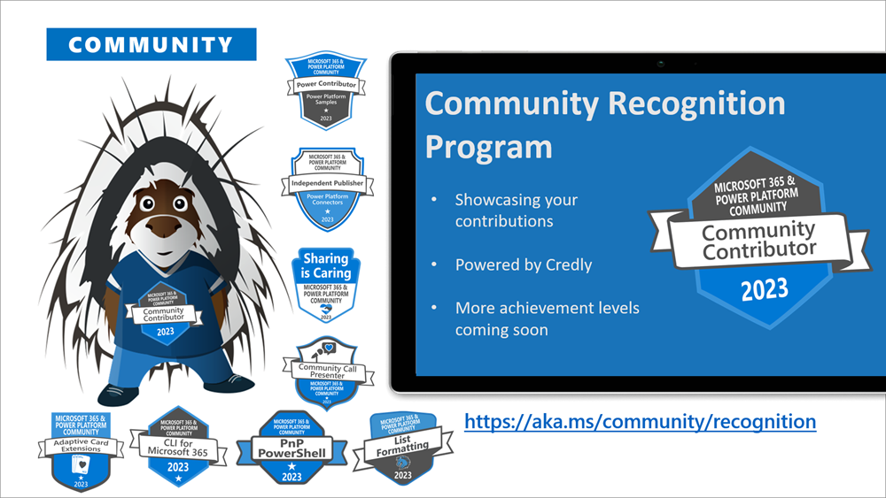
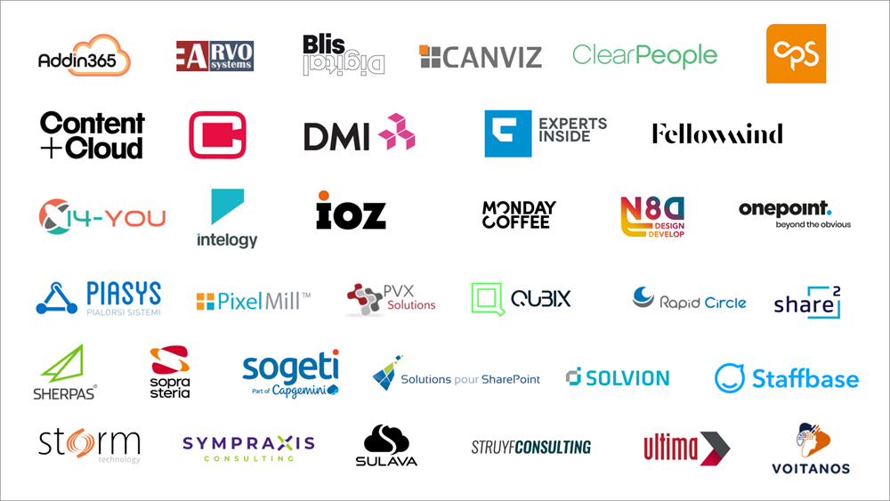

Microsoft 365 & Power Platform Community February 2023 update is out with a summary of the latest guidance, samples, and solutions from Microsoft or from the community for the community.

Starting from this update, we are a bit adjusting the format, so that we can focus more on the contributors across the different areas of the Microsoft 365 and Power Platform community. Time sequence for this summary is also longer than one month, but we will be aligning on the monthly updates again from this post forward.

>  *We are committed on building the best tech community in the world where everyone feels welcome and we help to empower each and every community member to achieve more.*

## Main resources around Microsoft 365 Platform Community

* Microsoft 365 & Power Platform Community - [https://aka.ms/community/home](https://aka.ms/community/home) - One location for all the resources and news around Microsoft 365 & Power Platform
* Microsoft 365 & Power Platform samples - [https://aka.ms/community/samples](https://aka.ms/community/samples)
* Microsoft 365 & Power Platform blog - [https://aka.ms/community/blog](https://aka.ms/community/blog)
* Microsoft 365 & Power Platform Channel on YouTube - [https://aka.ms/community/videos](https://aka.ms/community/videos)

Microsoft 365 Developer assets:

* Microsoft 365 development blog - [https://aka.ms/m365/dev/blog](https://aka.ms/m365/dev/blog)
* Microsoft 365 Developer YouTube channel - [https://aka.ms/m365/dev/videos](https://aka.ms/m365/dev/videos)

We also partnerly closely with other Power Platform topics, so let's not forget the following assets:

* [Power Platform Community - Be a part of something bigger](https://powerusers.microsoft.com/)
* [Power Platform YouTube channel](https://www.youtube.com/@mspowerplatform)

Do not also forget the awesome events which are being organized across the world. See more details from the CommunityDays web site.

* [Community Days - CommunityDays.org](https://www.communitydays.org/)

## Microsoft 365 & Power Platform Community Ecosystem in GitHub

Most of the community driven repositories are in the PnP GitHub organization as samples are not product specifics as they can contain numerous different solutions or the solution works in multiple different applications.

* [Microsoft 365 & Power Platform Community GitHub organization](https://github.com/pnp)
* [OfficeDev GitHub organization](https://github.com/officedev)
* [Microsoft Graph GitHup organization](https://github.com/microsoftgraph)
* [SharePoint GitHub organization](https://github.com/sharepoint)
* [Microsoft Search GitHub organization](https://github.com/microsoft-search)

## Microsoft 365 & Power Platform Community Recognition Program

We are excited to announce new community contributor program for all the active community members. Through this program you can get officially acknowledged with the a [Credly badge](https://www.credly.com/org/m365pnp/badge/community-contributor-2023) around your work on our open-source and community channels. See more from

[https://pnp.github.io/recognitionprogram/](https://pnp.github.io/recognitionprogram/). Thank you for being part of this journey with us.

## Microsoft 365 & Power Platform Unified Sample gallery

All of the cool samples for Microsoft 365 and Power Platform are listed in the unified sample gallery at [https://aka.ms/community/samples](https://aka.ms/community/samples). This is one centralized location to find samples from Microsoft and community.

> No reason to start from scratch - see what's available and take advantage of the contributions and samples from the community and Microsoft

## Key contributors to the February 2023 update

Here’s the list of active contributors (in alphabetical order) since last release details in GitHub repositories or community channels. Community is really about building tooling and knowledge together with the community for the community, so your contributions are highly valued across the Microsoft 365 & Power Platform customers, partners and obviously also at Microsoft.

Thank you for your assistance and contributions on behalf of the community. You are truly making a difference! If we missed someone, please let us know.

### Community people

* [AaronS16](https://github.com/AaronS16) | AaronS16
* [Abderahman Moujahid](https://github.com/Abderahman88) | Abderahman88
* [Adam Wójcik](https://twitter.com/Adam25858782) (Hitachi Energy) | @Adam2585878
* [Aimery Thomas](https://twitter.com/aimery_thomas) | @aimery_thomas
* [Albert-Jan Schot](https://twitter.com/appieschot) (BLIS Digital) | @Appieschot
* [Alex Grover](https://github.com/groveale) | groveale
* [Aleksandr SaPozhkov](https://github.com/shurick81) (Sopra Steria) | shurick81
* [Alessia De Martino](https://github.com/AlessiaDeMartino) | AlessiaDeMartino
* [Amartya Yadav](https://twitter.com/amartyadav) | @amartyadav
* [Anand Ragav](https://twitter.com/anandVragav) (Ericsson) | @anandVragav
* [András Fördős](https://linkedin.com/in/andrasfordos/) | andrasfordos
* [André Lage](https://twitter.com/aaclage) (Datalynx AG) | @aaclage
* Andrea Bellini
* [Andreas Markussen](https://twitter.com/andreasm_dk) | @andreasm_dk
* [Andrew Connell](https://twitter.com/andrewconnell) (Voitanos) | @Andrewconnell
* [Angelo Gulisano](https://twitter.com/angelog1908) (Npo Sistemi) | @angelog1908
* [Andrew Taylor](https://github.com/andrew-s-taylor) | andrew-s-taylor
* [Anoop Tatti](https://twitter.com/anooptells) (Content+Cloud) | @Anooptells
* [Anshuman Gaur](https://twitter.com/_AnshumanGaur) (Microsoft) | @_AnshumanGaur
* [Antti K. Koskela](https://twitter.com/koskila) (Precio Fishbone) | @koskila
* [Ari Gunawan](https://github.com/AriGunawan) | AriGunawan
* [Arjun Menon](https://twitter.com/arjunumenon) (Tata Consulting Services) | @Arjunumenon
* [Arleta Wanat](https://github.com/PowershellScripts) | PowershellScripts
* [Arnaud Rompen](https://twitter.com/arnaudrompen) | @arnaudrompen
* [Asad Refai](https://github.com/asadrefai) | asadrefai
* [Autophanous](https://github.com/Autophanous) | Autophanous
* [Beau Cameron](https://twitter.com/Beau__Cameron) (Aerie Consulting) | @Beau\_\_Cameron
* [Brian McCullough](https://twitter.com/bpmccullough) (Marsh & McLennan Companies) | @bpmccullough
* [Cameron Dwyer](https://twitter.com/CameronDwyer) (One Place Solutions) | @CameronDwyer
* [Chad Eiserloh](https://github.com/c-eiser13) (hubley) | c-eiser13
* [Carlos Marins Jr](https://github.com/kadu-jr) (Inpartec) | kadu-jr
* [Carlos Solís](https://twitter.com/CarlosBKSolis1) | @CarlosBKSolis1
* [Cat Schneider](https://twitter.com/YerAWizardCat) | @YerAWizardCat
* [Chandani Prajapati](https://twitter.com/Chandani_SPD)  (Rapid Circle) | @Chandani_SPD
* [Chandra Sekhar Malla](https://twitter.com/ChandraSMalla) | @ChandraSMalla
* [Charles Emmanuel S. Ndiaye](https://twitter.com/manusquall) | @manusquall
* [Chinu Anand](https://twitter.com/anand_chinu) | @anand_chinu
* [Chirag Patel](https://twitter.com/techChirag) (Patel Consulting) | @techChirag
* [Chris Kent](https://twitter.com/theChrisKent) (DMI) | @TheChrisKent
* [Chris Palmer](https://github.com/chris-p-source) | chris-p-source
* Chris Piasecki (CGI)
* [Christian McIntosh](https://twitter.com/_CMcIntosh) | @_CMcIntosh
* [Christian Zuellig](https://github.com/czullu) (MondayCoffee) | czullu
* [Christophe Humbert](https://twitter.com/Path2SharePoint) | @Path2SharePoint
* [Cornelius J. van Dyk](https://twitter.com/cjvandyk) (Crayveon) | @cjvandyk
* [Cyril C Kurian](https://github.com/cyrilckurian) | cyrilckurian
* [Dan Greuel](https://github.com/dgreuel) | dgreuel
* [Dan Toft](tanddant) (Evobis) | @tanddant
* [Daniaal Nadir](https://github.com/daniaalnadir) | daniaalnadir
* [Daniel Pastoor](https://github.com/danielpastoor) (Puur ICT) | danielpastoor
* [Dastan Banae](https://twitter.com/dastanbanae) (Southern New Hampshire University) | @dastanbanae
* [Dave Mehr](https://twitter.com/davemehr) (IOZ AG) | @davemehr
* [Dennis Goedegebuure](https://twitter.com/expiscornovus) (Ultima Business Solutions) | Expiscornovus
* [Darren Lutchner](https://twitter.com/assist_365) | @assist_365
* [Derek Cash Peterson](https://www.twitter.com/spdcp) (Sympraxis Consulting) | @Spdcp
* [Dian Taylor](https://twitter.com/D365Goddess) (RSM) | @D365Goddess
* [Divya Akula](https://github.com/divya-akula) (Tarento) | divya-akula
* [Dipesh Bhanani](https://twitter.com/AskDipesh) | @AskDipesh
* [Django Lohn](https://twitter.com/lohndjango) | @lohndjango
* [Don Kirkham](https://www.twitter.com/DonKirkham) (DMI, Inc) | @DonKirkham
* [Drew Russell](https://twitter.com/drusse11) (Rubrikinc) | @drusse11
* [Duvan Baena](https://twitter.com/djb349) | @djb349
* [Edin Kapic](https://twitter.com/ekapic) (Vista) | @ekapic
* [Eickhel Mendoza](https://twitter.com/eickhel) (Intelequia Technologies) | @eickhel
* [Ejaz Hussain](https://twitter.com/EjazHussain_) (Content & Cloud) | @EjazHussain_
* [Elio Struyf](https://twitter.com/eliostruyf) (Struyf Consulting) | @Eliostruyf
* [Emily Mancini](https://twitter.com/EEMancini) (Sympraxis Consulting) | @EEMancini
* [Emily Prindeville](https://github.com/v-emilypr) (Aquent) | v-emilypr
* [enthusol](https://github.com/enthusol) | enthusol
* [Erfan Darroudi](https://github.com/edarroudi) | edarroudi
* [Eric Legault](https://twitter.com/elegault) (Eric Legault Consulting) | @elegault
* [Eric Overfield](https://twitter.com/EricOverfield) (PixelMill) | @EricOverfield
* [Erwin van Hunen](https://twitter.com/erwinvanhunen) (Staffbase) | @Erwinvanhunen
* [Fabio Franzini](https://twitter.com/franzinifabio) (Apvee) | franzinifabio
* [Fai](https://github.com/faiyu0816) | faiyu0816
* [Federico Sapia](https://twitter.com/X365Fede) | @X365Fede
* [flowerbot](https://github.com/flowerbot) | flowerbot
* [Franck Cornu](https://twitter.com/FranckCornu) | @FranckCornu
* [Ganesh Sanap](https://twitter.com/ganeshsanap20) | @GaneshSanap20
* [Gaston Flores](https://github.com/gaston-flores) (Flybondi) | gaston-flores
* [Gautam Sheth](https://twitter.com/gautamdsheth) (Valo Solutions) | @Gautamdsheth
* [Geert de Kooter](https://twitter.com/gdekooter) | @gdekooter
* [Geetha Sivasailam](https://twitter.com/gsived) (Artis Consulting) | @GSiVed
* [Geoffrey Hunt](https://github.com/runningdeveloper) | runningdeveloper
* [Giacomo Pozzoni](https://github.com/jackpoz) (Fellowmind) | jackpoz
* [Giuliano De Luca](https://twitter.com/DeLucaGiulian) | @DeLucaGiulian
* [Gretchun Kim](https://github.com/gretchunkim) (Crowell & Moring LLP) | gretchunkim
* [Guido Zambarda](https://github.com/GuidoZam) (PiaSys) | GuidoZam
* [hakki-max](https://github.com/hakki-max) | hakki-max
* [Harminder Singh](https://twitter.com/Harminder_Sethi) | @Harminder_Sethi
* [Heidi Jordan](https://twitter.com/heidi_jordan14) (Avanade) | @heidi_jordan14
* [Heinrich Ulbricht](https://twitter.com/h_ulbricht) (Communardo Software GmbH) | @h_ulbricht
* [Hilton Giesenow](https://github.com/HiltonGiesenow) (Experts Inside) | @HiltonGiesenow
* [hofq](https://github.com/hofq) | hofq
* [Jake Stanger](https://twitter.com/cakestanger) | @cakestanger
* [James May](https://twitter.com/fowl2) | @fowl2
* [Jarbas Horst](https://twitter.com/devjhorst) (Staffbase) | @devjhorst
* [Jasey Waegebaert](https://github.com/Jwaegebaert) (GMI Group) | Jwaegebaert
* [Jean Netry-Valere](https://github.com/JeanNetryValere) | JeanNetryValere
* [Jim Duncan](https://www.twitter.com/sparchitect) (ShareSquared) | @Sparchitect
* [Jimmy Hang](https://twitter.com/Hang_Jimmy) | @Hang_Jimmy
* [Joanne Klein](https://twitter.com/JoanneCKlein) | @JoanneCKlein
* [João Ferreira](https://twitter.com/Joao12Ferreira) | @Joaoferreira
* [João J. Mendes](https://twitter.com/joaojmendes) (Staffbase) | @Joaojmendes
* [Joe Unwin](https://twitter.com/Flow_Joe_) (Hitachi Solutions) | @Flow_Joe_
* [Joey Bloom](https://github.com/JoeyBloom) | JoeyBloom
* [Joel Rodrigues](https://twitter.com/JoelFMRodrigues) (Storm Technology) | @JoelFMRodrigues
* [Josef Benda](https://github.com/SmarterJB) (Smarter Business Solutions GmbH) | SmarterJB
* [Julie Turner](https://twitter.com/jfj1997) (Sympraxis Consulting) | @Jfj1997
* [Kalpesh Vaghela](https://github.com/kavaghela) | kavaghela
* [Karnail Singh Choudhary](https://github.com/nightfury-crypto) | nightfury-crypto
* [Kasper Bo Larsen](https://twitter.com/kasperbolarsen) (Fellowmind Denmark) | @kasperbolarsen
* [Karoliina Kettukari](https://twitter.com/kettukari) (Meltlake) | @kettukari
* [Keith Craigo](https://twitter.com/KeithCraigo) | @KeithCraigo
* [Kevin McDonnell](https://twitter.com/kevmcdonk) (CPS) | @kevmcdonk
* [Kinga Kazala](https://twitter.com/kinga_kazala) (ETH) | @kinga_kazala
* [Kristine Kolodziejski](kristinekk94) (EY) | @kristinekk94
* [krishna-vijas](https://github.com/krishna-vijas) | krishna-vijas
* [Konrad Kolodziejak](https://github.com/wilecoyotegenius) (Capgemini) | wilecoyotegenius
* [kon-iro](https://twitter.com/kon_iro) | @kon_iro
* [Kunj Sangani](https://twitter.com/sanganikunj) | @sanganikunj
* [Lama](https://github.com/Lama-alluwaymi) | Lama-alluwaymi
* [Landon Petzoldt](https://github.com/clurdish) | clurdish
* [Laura Kokkarinen](https://twitter.com/LauraKokkarinen) (Sulava) | @LauraKokkarinen
* [Lee Ford](https://twitter.com/lee_ford) (Symity) | @lee_ford
* [Leon Armston](https://twitter.com/LeonArmston) (Intelogy) | @LeonArmston
* [Lindsay Shelton](https://twitter.com/lshelton_tech) (Stowers Institute for Medical Research) | @lshelton_tech
* [Llewellyn Roos](https://github.com/lroos) (Open Box Software) | lroos
* [Luise Freese](https://twitter.com/LuiseFreese) (M365Princess) | @LuiseFreese
* [Luis Mañez](https://twitter.com/luismanez) (ClearPeople) | @luismanez
* [Lou-i3](https://github.com/Lou-i3) | Lou-i3
* [Maarten van Stam](https://twitter.com/aafvstam) | @aafvstam
* [madsmai](https://github.com/madsmai) | madsmai
* [Marc D Anderson](https://twitter.com/sympmarc) (Sympraxis Consulting) | @Sympmarc
* [Marc Studer](https://github.com/Studermarc) | Studermarc
* [Marcin Wojciechowski](https://twitter.com/mgwojciech) (Staffbase) | @mgwojciech
* [Marco van Meurs](https://github.com/dutchdevil83) | dutchdevil83
* [Marijn Somers](https://twitter.com/marijnsomers) | @marijnsomers
* [Mark Bice](https://github.com/mbice) (Habanero) | mbice
* [Markus Hanisch](https://github.com/Markus-Hanisch) | Markus-Hanisch
* [Markus Möller](https://twitter.com/Moeller2_0) (Avanade) | @Moeller2\_0
* [martinewald](https://github.com/martinewald) | martinewald
* [Martin Dubec](https://github.com/cebud) (Merck & Co., Inc.) | cebud
* [Martin Lingstuyl](https://twitter.com/martinlingstuyl) (I4-YOU)| @Martinlingstuy
* [Martin Loitzl](https://twitter.com/mloitzl) (LiveTiles) | @mloitzl
* [Mary Myers](https://twitter.com/MaryMyers_WM) (WorldMax) | @MaryMyers_WM
* [Mathieu Rebuffet](https://twitter.com/rebuf) (One Place Solutions) | @rebuf
* [Mathijs Verbeeck](https://github.com/MathijsVerbeeck) | MathijsVerbeeck
* [Matt Schuessler](https://www.twitter.com/MattSchues) (Canviz) | @MattSchues
* [Matteo Serpi](https://github.com/srpmtt) | srpmtt
* [Michał Dzienisiewicz](https://github.com/Dzieni) | Dzieni
* [Michael Kriese](https://twitter.com/viceice_mk) | @viceice_mk
* [Michaël Maillot](https://twitter.com/michael_maillot) (OnePoint) | @michael_maillot
* [Michał Romiszewski](https://twitter.com/romiszewski) | @romiszewski
* [Michael Ramich](https://github.com/michael-ra) (metanoy) | michael-ra
* [Michel Mendes](https://twitter.com/michelcarlo) | @michelcarlo
* [Michele Catena](https://github.com/10xMike) | 10xMike
* [Miguel Angel García](https://twitter.com/miangama) | @Miangama
* [Miguel Verweij](https://twitter.com/miguelverweij) (Sogeti) | @MiguelVerweij
* [Milan Holemans](https://github.com/milanholemans) (VanRoey.be) | milanholeman
* [Mike Zimmerman](https://github.com/mikezimm) – mikezimm
* [Mitanshu Garg](https://twitter.com/mitanshu) (Schlumberger) | @mitanshu
* [Mohammed Amer](https://twitter.com/Mohammad3mer) (Atea Global Services) | @Mohammad3mer
* [Musale Martin](https://twitter.com/m4musale) | @m4musale
* [Nathalie Leenders](https://twitter.com/NathLeenders) (Chemours) | @NathLeenders
* [Nanddeep Nachan](https://twitter.com/NanddeepNachan) | @nanddeepNachan
* [Nello D'Andrea](https://twitter.com/NelloDAndrea) (Die Mobiliar) | @NelloDAndrea
* [Nick Hance](https://twitter.com/NHance) | @NHance
* [Nico De Cleyre](https://twitter.com/NicoDeCleyre) (Ordina Belgium) | NicoDeCleyre
* [Niklas Wilhelm](https://twitter.com/NiklasWilhelm4) (NetForce 365) | @NiklasWilhelm4
* [Nikolay Belykh](https://github.com/nbelyh) | nbelyh
* [Nick Brown](https://twitter.com/techienickb) (Jisc) | @techienickb
* [Nils Andresen](https://twitter.com/nils_andresen) (adesso SE) | @nils_andresen
* [Niklas Wilhelm](https://twitter.com/hubsite365) (NetForce365) | @hubsite365
* [Nishkalank Bezawada](https://github.com/NishkalankBezawada) (Fellowmind) | NishkalankBezawada
* [Nizar Grindi](https://twitter.com/nizar_grindi) (Avanade) | @nizar_grindi
* [Norm Young](https://twitter.com/stormin_30) | @stormin_30
* [Ole Rühaak](https://github.com/ohaak2) (novaCapta GmbH) | ohaak2
* [Otto](https://github.com/berot3) | berot3
* [Paolo Pialorsi](https://twitter.com/PaoloPia) (PiaSys.com) | @PaoloPia
* [Patrick Lamber](https://twitter.com/patricklamber) (ExpertsInside) | @Patricklamber
* [Paul Bullock](https://twitter.com/pkbullock) (Avanade) | @pkbullock
* [Paul Matthews](https://twitter.com/cann0nf0dder) (CF Code) | @cann0nf0dder
* [Paul Hunt](https://twitter.com/cimares) | @cimares
* [Paul Schaeflein](https://twitter.com/paulschaeflein) (AddIn365) | @Paulschaeflein
* [Patrick Doran](https://twitter.com/swearpointjs) (NCDIT) | @swearpointjs
* [Patrik Hellgren](https://twitter.com/patrikhellgren) (Sherpas Group) | @patrikhellgren
* [Peter Paul Kirschner](https://twitter.com/petkir_at) (cubido business solutions GmbH) | @petkir_at
* [Porantim](https://github.com/Porantim) | Porantim
* [Priyanshu Ahlawat](https://github.com/PriyanshuAhlawat) | PriyanshuAhlawat
* [Ramin Ahmadi](https://twitter.com/raminahmadi1986) (Content and Cloud) | @raminahmadi1986
* [Ravi Kulkarni](https://twitter.com/RaviKul16a87) | @RaviKul16a87
* [rentu](https://github.com/SLdragon) | SLdragon
* [reusto](https://github.com/reusto) | reusto
* [Renzy Ortega](https://github.com/ortegarenzy) | ortegarenzy
* [Reshmee Auckloo](https://www.twitter.com/ReshmeeAuckloo) (Pension Protection Fund) | @ReshmeeAuckloo
* [reusto](https://github.com/reusto) | reusto
* [Rick Van Rousselt](https://twitter.com/RickVanRousselt) (Advantive) | @RickVanRousselt
* [Rishabh Raghwendra](https://github.com/Rishabhraghwendra18) | Rishabhraghwendra18
* [Rob Lempens](https://github.com/RobLempens) | RobLempens
* [Rob Windsor](https://twitter.com/robwindsor) | @robwindsor
* [Robin Meure](https://github.com/robinmeure) | robinmeure
* [Robin Rosengrün](https://twitter.com/power_r2) (EnBw) | @power_r2
* [Rolf Isler](https://github.com/Tripplefix) | Tripplefix
* [Ronald Booden](https://github.com/rjbooden) | rjbooden
* [Rosa Alice (Ana Elisabeta)](https://github.com/alicelupsan) | alicelupsan
* [Russell Gove](https://twitter.com/russgove)  (Tronox) | @russgove
* [Sabbika Siddiq](https://linkedin.com/in/sabbikasiddiq) (AIS)
* [Sagar Vishwakarma](https://github.com/sagar7046) | sagar7046
* [Saintenr](https://github.com/Saintenr) | Saintenr
* [salascz](https://github.com/salascz) | salascz
* [Scott](https://github.com/lordneeko) | lordneeko
* [Scott Durow](https://twitter.com/ScottDurow) (Develop 1) | @ScottDurow
* [Seth Addo](https://twitter.com/set_addo) | @set_addo
* [Sergej Schwabauer](https://github.com/SPFxAppDev) (Aurum) | SPFxAppDev
* [Sergei Sergeev](https://twitter.com/sergeev_srg) | @Sergeev_srg
* [Sharon Weaver](https://www.twitter.com/sharoneweaver) (Smarter Consulting) | @Sharoneweaver
* [Sherman Ouko](https://github.com/SHERMANOUKO) | SHERMANOUKO
* [Siddharth Vaghasia](https://twitter.com/siddh_me) | @Siddh_me
* [Simone Lin](https://github.com/SimonL26) | SimonL26
* [SlowRobot](https://github.com/SlowRobot) | SlowRobot
* [Smita Nachan](https://twitter.com/smitanachan) | @SmitaNachan
* [soebje](https://github.com/soebje) | soebje
* [Sohil Bhalla](https://github.com/sohilbhalla/) | sohilbhalla
* [Stefan Bauer](https://twitter.com/StfBauer) (n8d) | @StfBauer
* [Stefan Schoof](https://github.com/StefanSchoof) | StefanSchoof
* [Stephan Bisser](https://twitter.com/stephanbisser) (Solvion) | @Stephanbisser
* [Steve Beaugé](https://github.com/stevebeauge) (Solutions pour SharePoint) | stevebeauge
* [Stijn Haerkens](https://github.com/stijnhaerkenss) | stijnhaerkenss
* [Sven Sieverding](https://twitter.com/365Knoten) @365Knoten
* [Takashi Shinohara](https://github.com/karamem0) (Avanade) | @karamem0
* [Taaqif Peck (Tye)](https://github.com/Taaqif) | Taaqif
* [techsnap](https://github.com/techsnap) | techsnap
* [Tetsuya Kawahara](https://twitter.com/techan_k) | @Techan_k
* [Thomas Barnekow](https://twitter.com/thbarnekow) (Analog Devices) | @thbarnekow
* [Thomas Gölles](https://twitter.com/thomyg) (Solvion) | @Thomyg
* [Tim van de Voorde](https://github.com/timdelavoorde) | timdelavoorde
* [Tomasz Poszytek](https://twitter.com/TomaszPoszytek) | @TomaszPoszytek
* [Todd Baginski](https://twitter.com/toddbaginski) (Canviz) | @Toddbaginski
* [Todd Klindt](https://twitter.com/ToddKlindt)  (Sympraxis Consulting) | @ToddKlindt
* [Tomi Tavela](https://twitter.com/tavikukko) (Staffbase) | @tavikukko
* [Tony Philips](https://twitter.com/TonyMSTeams) (Cloud Design Box) | @TonyMSTeams
* [Trevor Seward](https://twitter.com/NaupliusTrevor) | @NaupliusTrevor
* [Valeras Narbutas](https://twitter.com/ValerasNarbutas) | @ValerasNarbutas
* [Veronique Lengelle](https://twitter.com/veronicageek) (CPS) | @Veronicageek
* [Victor Romanov](https://github.com/VRomanovTau) (Taurus Quadra Ltd) | VRomanovTau
* [Vipul Kelkar](https://github.com/vipulkelkar) (Rapid Circle) | vipulkelkar
* [Vitalii Sorokin](https://twitter.com/Magpie_V) | @Magpie_V
* [Vivek Bavishi](https://twitter.com/that_API_guy) (Hitachi Solutions) | @that_API_guy
* [Vivian Voss](https://twitter.com/viviantiiman) | @VivianTiiman
* [Vividh Pandey](https://github.com/VividhPandey003) | VividhPandey003
* [Wes Preston](https://twitter.com/idubbs) | @idubbs
* [Yuning Chen](https://github.com/hnzkcyn) | hnzkcyn
* [Yannick Plenevaux](https://twitter.com/yp_code) (PVX Solutions) | @yp_code
* [Yannick Reekmans](https://twitter.com/yannickreekmans) (Qubix) | @yannickreekmans
* [Yves Habersaat](https://twitter.com/yhabersaat) | @yhabersaat

### Companies

Here are the companies, which provided support the community initiative for this month by allowing their employees working for the benefit of others in the community. There were also people who contributed from other companies during last month, but we did not get their logos and approval to show them in time for these communications.

> If you'd like to see your company logo here,  please let us know and share the logo with us. Thx.

* [Addin365](https://www.addin365.com/)
* [Arvo Systems](https://www.arvosys.com/)
* [BLIS Digital](https://blisdigital.com/en/)
* [Canviz Solutions](https://canviz.com/)
* [ClearPeople](https://www.clearpeople.com/)
* [CPS](https://www.cps.co.uk/)
* [Content+Cloud](https://contentandcloud.com/)
* [Cubido Business Solutions GmbH](http://www.cubido.at/)
* [DMI](https://dminc.com/)
* [Experts Inside GmbH](https://www.expertsinside.com/en/)
* [Fellowmind](https://www.fellowmindcompany.com/)
* [Intelogy](https://www.intelogy.co.uk/)
* [I4-YOU](https://i4-you.com/)
* [IOZ](https://www.ioz.ch/)
* [MondayCoffee](https://mondaycoffee.com/-home)
* [N8D - Innovation and Design Agency](https://n8d.at/)
* [onepoint](https://www.groupeonepoint.com/en/)
* [Piasys](https://piasys.com/)
* [PixelMill](https://pixelmill.com/)
* [PVX Solutions](https://www.pvx-solutions.com/)
* [Qubix](https://www.qubix.be/)
* [Rapid Circle](https://en.rapidcircle.com/)
* [ShareSquared](https://www.sharesquared.com)
* [Sherpas](https://www.sherpas.se/)
* [Sogeti](https://www.sogeti.com/)
* [Solvion](https://www.solvion.net/)
* [Solutions Pour SharePoint](https://sosp.fr/)
* [Sopra Steria](https://www.soprasteria.com/)
* [Staffbase GmbH](https://staffbase.com/en/)
* [Storm Technology](https://www.storm.ie/)
* [Struyf Consulting](https://www.eliostruyf.com/)
* [Sulava](https://sulava.com/en/home/)
* [Sympraxis Consulting](https://sympraxisconsulting.com/)
* [Ultima Business Solutions](https://www.ultima.com/)
* [Voitanos](https://www.voitanos.io/)

### Microsoft people

Here’s the list of Microsoft people who have been closely involved with the Microsoft 365 Platform community work during last month.

* [Adriana Wood](https://twitter.com/The_Adri_Wood) (Microsoft) | @The_Adri_Wood
* Aditya Challapally (Microsoft)
* [Alex Clark](https://twitter.com/sharepointalex) (Microsoft) | @sharepointalex
* [Alex Jerabek](https://github.com/AlexJerabek) (Microsoft) | AlexJerabek
* [Alex Terentiev](https://twitter.com/alexaterentiev) (Microsoft) | @Alexaterentiev
* [Alison McKay](https://github.com/alison-mk) (Microsoft) | alison-mk
* [Amjed Ayoub](https://linkedin.com/in/amjed-ayoub/) (Microsoft) | amjed-ayoub
* Ankit Rastogi (Microsoft)
* [Anshuman Gaur](https://twitter.com/_AnshumanGaur) (Microsoft) | @_AnshumanGaur
* [April Dunnam](https://twitter.com/aprildunnam) (Microsoft) | @Aprildunnam
* [Ayça Baş](https://twitter.com/aycabs) (Microsoft) | @Aycabs
* Ben Summers (Microsoft)
* [Bert Jansen](https://twitter.com/O365Bert) (Microsoft) | @O365Bert
* [Bill Baer](https://twitter.com/billbaer) (Microsoft) | @billbaer
* [Bob German](https://twitter.com/Bob1German) (Microsoft) | @Bob1German
* Bogdan Achim (Microsoft)
* [Brian Jackett](https://twitter.com/BrianTJackett) (Microsoft) | BrianTJackett
* Cameron Parker (Microsoft)
* [Cathy Dew](https://twitter.com/catpaint1) (Microsoft) | @Catpaint
* [Chuck Edmonson](https://github.com/chuckedmonson) (Microsoft) | chuckedmonson
* [Daniel Laskewitz](https://twitter.com/Laskewitz) (Microsoft) | @Laskewitz
* [Dan Wahlin](https://twitter.com/DanWahlin) (Microsoft) | @DanWahlin
* [David Chesnut](https://twitter.com/davidchesnut) (Microsoft) | @Davidchesnut
* [David Rousset](https://twitter.com/davrous) (Microsoft) | @davrous
* [David Warner II](https://twitter.com/DavidWarnerII) (Microsoft) | @DavidWarnerII
* [DC Padur](https://twitter.com/dcpadur) (Microsoft) | @cdpadur
* [Dona Sarkar](https://twitter.com/donasarkar) (Microsoft) | @DonaSarkar
* Elizabeth Samuel (Microsoft)
* [Eoin O'Brien](https://github.com/eoinobrien) (Microsoft) | eoinobrien
* [Erin Bailie](https://twitter.com/EMBailie) (Microsoft) | @EMBailie
* [Fabian Williams](https://twitter.com/fabianwilliams) (Microsoft) | @fabianwilliams
* [Frank Lan](https://linkedin.com/in/frankwlan/) (Microsoft) | frankwlan
* [Garry Trinder](https://twitter.com/garrytrinder) (Microsoft) | @Garrytrinder
* [Gavin Barron](https://twitter.com/gavinbarron (Microsoft) | @gavinbarron
* Gino Buzzelli (Microsoft)]
* Gloria Sánchez (Microsoft)
* Hanbing Wang (Microsoft)
* [Hugo Bernier](https://twitter.com/bernierh) (Microsoft) | @Bernierh
* Isaac Vargas Chacon (Microsoft)
* [James Eccles](https://github.com/jameseccles) (Microsoft) | jameseccles
* [Jason Baxter](https://github.com/jasonwbaxter) (Microsoft) | jasonwbaxter
* [Jason Johnston](https://twitter.com/JasonJohMSFT) (Microsoft) | @JasonJohMSFT
* [Jens Haile](https://twitter.com/hailender) (Microsoft) | @hailender
* Jitesh Nairh (Microsoft)
* [Juan Balmori](https://twitter.com/@juaneloBalmori) ( Microsoft) | @juaneloBalmori
* [John Miller](https://twitter.com/jmillerdev)  (Microsoft)| @jmillerdev
* John Nguyen (Microsoft)
* [Jose Barreto](https://twitter.com/josebarreto) (Microsoft) | @josebarreto
* [J.P. Roca](https://twitter.com/jpthepm ) (Microsoft) | @jpthepm
* [Kartik Kanakasabesan](https://twitter.com/kkanakas) (Microsoft) | @kkanakas
* [Koen Zomers](https://twitter.com/koenzomers) (Microsoft) | @Koenzomers
* Kyle Marsh (Microsoft)
* [Laura Graham](https://github.com/Lauragra) (Microsoft) | Lauragra
* [Linda Lu Cannon](https://github.com/lindalu-MSFT) - (Microsoft) | lindalu-MSFT
* [Luca Bandinelli](https://github.com/lucaband) (Microsoft) | lucaband
* [Maisa Rissi](https://twitter.com/maisarissi_msft) (Microsoft) | @maisarissi_msft
* [Manuela Pichler](https://twitter.com/ManuelaPichler_) (Microsoft) | @ManuelaPichler_
* [Marco Rocca](https://twitter.com/marco_r_73) (Microsoft) | @marco_r_73
* [Mark Kashman](https://twitter.com/MKashman) (Microsoft) | @MKashman
* Matt MacLaurin (Microsoft)
* [Merill Fernando](https://twitter.com/merill) (Microsoft) | @merill
* [Mikael Svenson](https://twitter.com/mikaelsvenson) (Microsoft) | @Mikaelsvenson
* [Musale Martin](https://twitter.com/m4musale) (Microsoft) | @m4musale
* Nancy Handa (Microsoft)
* [Natalie Pienkowska](https://twitter.com/NataliePienkow1) (Microsoft) | @nataliePienkow1
* [Nathan Helgren](https://linkedin.com/in/nhelgren) (Microsoft) | nhelgren
* Njeri Grievous (Microsoft)
* [Nick Kramer](https://github.com/nkramer) (Microsoft) | nkramer
* [Nik Charlebois](https://twitter.com/NikCharlebois) (Microsoft) | @nikCharlebois
* [Niklas Wilhelm](https://twitter.com/NiklasWilhelm4) (NetForce 365) | @NiklasWilhelm4
* [Nickii Miaro](https://github.com/Mnickii) (Microsoft) | Nickii Miaro
* Nikita Mittal (Microsoft)
* [Pam Green](https://www.twitter.com/contextuallib) (Microsoft) | @Contextuallib
* [Patrick Rodgers](https://twitter.com/mediocrebowler) (Microsoft) | @Mediocrebowler
* Peter Ombwa (Microsoft)
* Philip Li (Microsoft)
* [Philippe Signoret](https://twitter.com/psignoret) (Microsoft) | @psignoret
* Pramod HK (Microsoft)
* [Pranita Padalwar](https://www.linkedin.com/in/pranita-padalwar-46a01120/) (Microsoft)
* [Rabeb Othmani](https://twitter.com/Rabeb_Othmani) (Microsoft) | @Rabeb_Othmani
* [Rabia Williams](https://twitter.com/williamsrabia) (Microsoft) | @Williamsrabia
* [Richard A. Wilson](https://twitter.com/PowerAppsRAW) (Microsoft) | @PowerAppsRAW
* [Rick Kirkham](https://github.com/Rick-Kirkham) (Microsoft) | Rick-Kirkham
* [Sam Ramon](https://github.com/samantharamon) (Microsoft) | samantharamon
* Samriddhi Seth (Microsoft)
* [Sangle Wang](https://github.com/sangle7) (Microsoft) | sangle7
* Sara Cummings (Microsoft)
* [Sébastien Levert](https://twitter.com/sebastienlevert) (Microsoft) | @Sebastienlevert
* Sheena Makker (Microsoft)
* Sreekanth Thirthala (Microsoft)
* Sudha Padmanabhan (Microsoft)
* [Tee Earls](https://github.com/TeeEarls) (Microsoft) | @TeeEarls
* [Tejas Mehta](https://twitter.com/tpmehta) (Microsoft) | @tpmehta
* [Todd Anglin](https://twitter.com/ToddAnglin) (Microsoft) | @ToddAnglin
* [Tomas Chladek](https://twitter.com/tomaschladek2) (Microsoft) | @tomaschladek2
* Troy Starr (Microsoft) | TroyStarr
* [Vesa Juvonen](https://twitter.com/vesajuvonen) (Microsoft) | @Vesajuvonen
* Wajeed Shaikh | [Wajeed-msft](https://github.com/Wajeed-msft)
* [Waldek Mastykarz](https://twitter.com/waldekm) (Microsoft) | @Waldekm
* [Wictor Wilen](https://twitter.com/wictor)(Microsoft) | @Wictor
* [Vincent Biret](https://twitter.com/baywet) (Microsoft) | @baywet
* Yashvardhan Joshi (Microsoft)
* Yawei Zhu  (Microsoft)
* [Yina Arenas](https://twitter.com/yina_arenas) (Microsoft) | @yina_arenas
* Yun Wang (Microsoft)

### MVP Community team

MVP Community team manages the Microsoft 365 & Power Platform community work in the GitHub and also coordinates different open-source projects around Microsoft 365 & Power Platform topics. Platform Community Team members have a significant impact on driving adoption of Microsoft 365 & Power Platform areas. They have shown their commitment to the open-source and community-driven work by constantly contributing to the benefit of the others in the community.

Thank you for all that you do! 🧡

* [Chandani Prajapati](https://twitter.com/Chandani_SPD) (Rapid Circle) | @Chandani_SPD
* [Emily Mancini](https://twitter.com/EEMancini) (Sympraxis Consulting) | @EEMancini
* [Geetha Sivasailam](https://twitter.com/gsived) (Artis Consulting) | @gSiVed
* [Julie Turner](https://twitter.com/jfj1997)(Sympraxis Consulting) | @Jfj1997
* [Laura Kokkarinen](https://twitter.com/LauraKokkarinen) (Sulava) | @LauraKokkarinen
* [Luise Freese](https://twitter.com/LuiseFreese) | @LuiseFreese
* [Veronique Lengelle](https://twitter.com/veronicageek) (CPS) | @Veronicageek
* [Albert-Jan Schot](https://twitter.com/appieschot) (BLIS Digital) | @Appieschot
* [Andrew Connell](https://twitter.com/andrewconnell) (Voitanos) | @Andrewconnell
* [Andrew Koltyakov](https://twitter.com/andrewkoltyakov) (ARVO Systems) | @Andrewkoltyakov
* [Anoop Tatti](https://twitter.com/anooptells) (Content+Cloud) | @Anooptells
* [Arjun Menon](https://twitter.com/arjunumenon) (Tata Consulting Services) | @arjunumenon
* [Beau Cameron](https://twitter.com/Beau__Cameron) (Aerie Consulting) | @Beau__Cameron
* [Chris Kent](https://twitter.com/theChrisKent) (DMI) | @TheChrisKent
* [Derek Cash-Peterson](https://twitter.com/spdcp) (Sympraxis Consulting) | @Spdcp
* [Elio Struyf](https://twitter.com/eliostruyf) (Struyf Consulting) | @Eliostruyf
* [Eric Overfield](https://twitter.com/EricOverfield) (PixelMill) | @EricOverfield
* [Erwin van Hunen](https://twitter.com/erwinvanhunen) (Valo Intranet) | @Erwinvanhunen
* [Fabio Franzini](https://twitter.com/franzinifabio) (Apvee) | @franzinifabio
* [Gautam Sheth](https://twitter.com/gautamdsheth) (Valo Solutions) | @Gautamdsheth
* [João J. Mendes](https://twitter.com/joaojmendes) (Valo Solutions) | @Joaojmendes
* [Joel Rodrigues](https://twitter.com/JoelFMRodrigues) (Storm Technology) | @JoelFMRodrigues
* [Marc D Anderson](https://twitter.com/sympmarc) (Sympraxis Consulting) | @Sympmarc
* [Paolo Pialorsi](https://twitter.com/PaoloPia) (Piasys.com) | @PaoloPia
* [Patrick Lamber](https://twitter.com/patricklamber) (Expertsinside AG) | @Patricklamber
* [Paul Bullock](https://twitter.com/pkbullock) (Avanade) | @Pkbullock
* [Rick Van Rousselt](https://twitter.com/RickVanRousselt) (Advantive) | @RickVanRousselt
* [Sergei Sergeev](https://twitter.com/sergeev_srg) | @sergeev_srg
* [Stefan Bauer](https://twitter.com/StfBauer) (n8d) | @StfBauer
* [Stephan Bisser](https://twitter.com/stephanbisser) (Solvion) | @Stephanbisser
* [Tetsuya Kawahara](https://twitter.com/techan_k) | @Techan_k
* [Thomas Gölles](https://twitter.com/thomyg) (Solvion) | @Thomyg

### Microsoft Internal Platform community team members

Here are the Microsoft Internal Platform Community team members:

* [April Dunnam](https://twitter.com/aprildunnam) | @Aprildunnam
* [Rabia Williams](https://twitter.com/williamsrabia) | @Williamsrabia
* [Alex Terentiev](https://twitter.com/alexaterentiev) | @Alexaterentiev
* [Bert Jansen](https://twitter.com/O365Bert) | @O365Bert
* [Bob German](https://twitter.com/Bob1German) | @Bob1German
* [Garry Trinder](https://twitter.com/garrytrinder) | @Garrytrinder
* [Hugo Bernier](https://twitter.com/bernierh) | @Bernierh
* [Koen Zomers](https://twitter.com/koenzomers) | @Koenzomers
* [Mikael Svenson](https://twitter.com/mikaelsvenson) | @MikaelSvenson
* [Patrick Rodgers](https://twitter.com/mediocrebowler) | @Mediocrebowler
* [Sébastien Levert](https://twitter.com/sebastienlevert) | @Sebastienlevert
* [Vesa Juvonen](https://twitter.com/vesajuvonen) | @Vesajuvonen
* [Waldek Mastykarz](https://twitter.com/waldekm) | @Waldekm
* [Wictor Wilen](https://twitter.com/wictor) | @Wictor

## Next steps

See all of the available community calls, tools, components and other assets from [https://aka.ms/community/home](https://aka.ms/community/home). Get involved!

Got ideas or feedback on the topics to cover, additional partnerships, product feature capabilities? - let us know. Your input is important for us, so that we can support your journey in Microsoft 365 and in Power Platform (better together). You can comment below this post 👇.

*Sharing Is Caring!* 🧡
