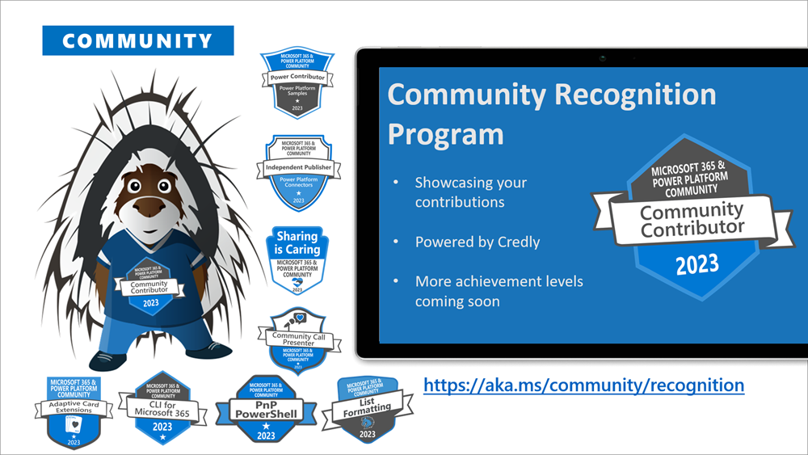
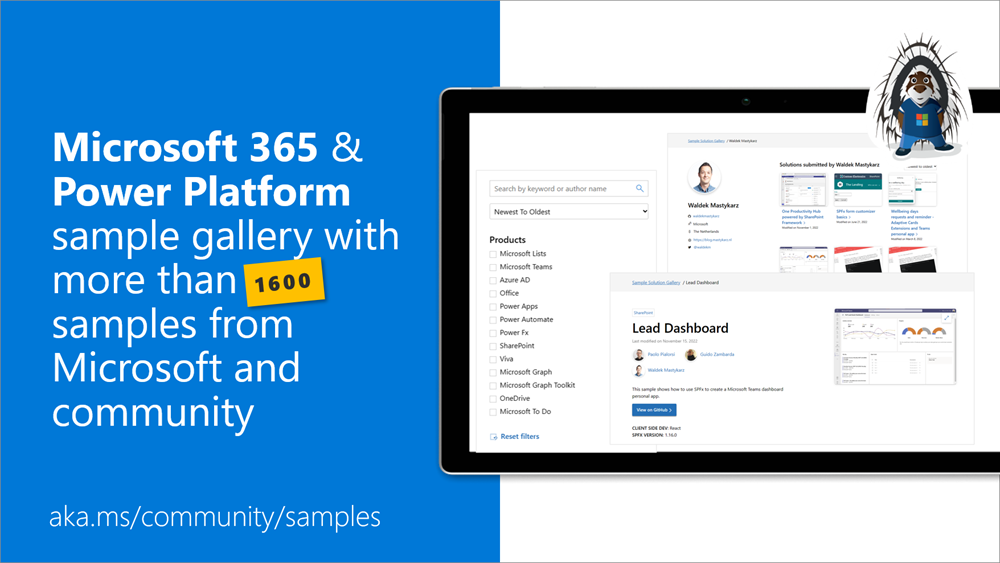
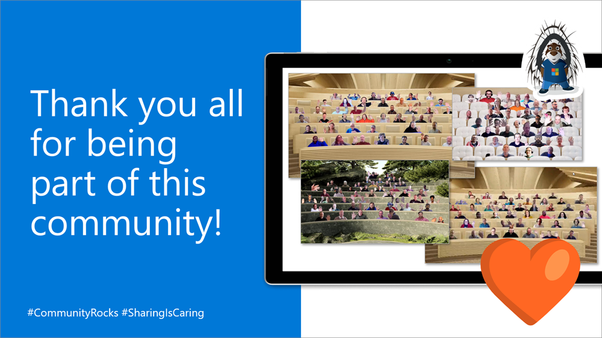
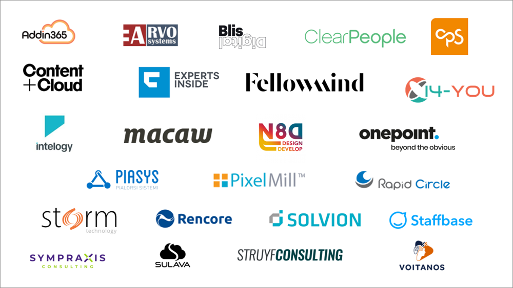

Microsoft 365 & Power Platform Community May 2023 update is out with a summary of the latest guidance, samples, and solutions from Microsoft or from the community for the community. 

Starting from this update, we are a bit adjusting the format, so that we can focus more on the contributors across the different areas of the Microsoft 365 and Power Platform community. Time sequence for this summary is also longer than one month, but we will be aligning on the monthly updates again from this post forward.

>  *We are committed on building the best tech community in the world where everyone feels welcome and we help to empower each and every community member to achieve more.*

## Main resources around Microsoft 365 Platform Community

* Microsoft 365 & Power Platform Community - [https://aka.ms/community/home](https://aka.ms/community/home) - One location for all the resources and news around Microsoft 365 & Power Platform
* Microsoft 365 & Power Platform samples - [https://aka.ms/community/samples](https://aka.ms/community/samples)
* Microsoft 365 & Power Platform blog - [https://aka.ms/community/blog](http://aka.ms/community/blog)
* Microsoft 365 & Power Platform Channel on YouTube - [https://aka.ms/community/videos](https://aka.ms/community/videos)

Microsoft 365 Developer assets:

* Microsoft 365 development blog - [https://aka.ms/m365/dev/blog](https://aka.ms/m365/dev/blog)
* Microsoft 365 Developer YouTube channel - [https://aka.ms/m365/dev/videos](https://aka.ms/m365/dev/videos)

We also partnerly closely with other Power Platform topics, so let's not forget the following assets:

* [Power Platform Community - Be a part of something bigger](https://powerusers.microsoft.com/)
* [Power Platform YouTube channel](https://www.youtube.com/@mspowerplatform)

Do not also forget the awesome events which are being organized across the world. See more details from the CommunityDays web site.

* [Community Days - CommunityDays.org](https://www.communitydays.org/)

## Microsoft 365 & Power Platform Community Ecosystem in GitHub

Most of the community driven repositories are in the PnP GitHub organization as samples are not product specifics as they can contain numerous different solutions or the solution works in multiple different applications.

* [Microsoft 365 & Power Platform Community GitHub organization](https://github.com/pnp)
* [OfficeDev GitHub organization](https://github.com/officedev)
* [Microsoft Graph GitHup organization](https://github.com/microsoftgraph)
* [SharePoint GitHub organization](https://github.com/sharepoint)
* [Microsoft Search GitHub organization](https://github.com/microsoft-search)

## Microsoft 365 & Power Platform Community Recognition Program

We are excited to announce new community contributor program for all the active community members. Through this program you can get officially acknowledged with the a [Credly badge](https://www.credly.com/org/m365pnp/badge/community-contributor-2023) around your work on our open-source and community channels. See more from

[https://pnp.github.io/recognitionprogram/](https://pnp.github.io/recognitionprogram/). Thank you for being part of this journey with us.

## Microsoft 365 & Power Platform Unified Sample gallery

All of the cool samples for Microsoft 365 and Power Platform are listed in the unified sample gallery at [https://aka.ms/community/samples](https://aka.ms/community/samples). This is one centralized location to find samples from Microsoft and community.

> No reason to start from scratch - see what's available and take advantage of the contributions and samples from the community and Microsoft

## Key contributors to the May 2023 update

Here’s the list of active contributors (in alphabetical order) since last release details in GitHub repositories or community channels. Community is really about building tooling and knowledge together with the community for the community, so your contributions are highly valued across the Microsoft 365 & Power Platform customers, partners and obviously also at Microsoft.

Thank you for your assistance and contributions on behalf of the community. You are truly making a difference! If we missed someone, please let us know. 


In this blog post we callout contributors in the Microsoft 365 & Power Platform community areas in the open-source projects, samples, videos, community calls etc. There are also countless fo awesome community members who are sharing their knowledge on daily basis in their own channels, which is a great option to contribute for others. Thank you all for that. Sharing is caring!


### Community people

* [Adam Wójcik](https://twitter.com/Adam25858782) (Hitachi Energy) | @Adam2585878
* [Aimery Thomas](https://twitter.com/aimery_thomas) | @aimery_thomas
* [Albert-Jan Schot](https://twitter.com/appieschot) (BLIS Digital) | @Appieschot
* [Aleksandr Sapozhkov](https://github.com/shurick81) (Rillion AB) | shurick81
* [Anand Ragav](https://twitter.com/anandVragav) (Ericsson) | @anandVragav
* [Andrew Benson](https://github.com/ViewPorter) | ViewPorter
* [Andrew Connell](https://twitter.com/andrewconnell) (Voitanos) | @Andrewconnell
* [Andrew Koltyakov](https://twitter.com/andrewkoltyakov) (ARVO Systems) | @Andrewkoltyakov
* [Anoop Tatti](https://twitter.com/anooptells) (Content+Cloud) | @Anooptells
* [Apola Kipso](https://github.com/apolakipso) | apolakipso
* [Arjun Menon](https://twitter.com/arjunumenon) (Tata Consulting Services) | @Arjunumenon
* Aziz Gassara 
* [Beau Cameron](https://twitter.com/Beau__Cameron) (DMI) | @Beau\_\_Cameron
* [Chandani Prajapati](https://twitter.com/Chandani_SPD)  (Rapid Circle) | @Chandani_SPD
* [Chris Kent](https://twitter.com/theChrisKent) (Takeda) | @TheChrisKent
* [Chris Lizon](https://github.com/ChrisLizon) | ChrisLizon
* [Christian Nesmark](https://github.com/cnesmark) | cnesmark
* [Dan Toft](tanddant) (Evobis) | @tanddant
* Daniel Turley (Avanade)
* [David Elsner](https://github.com/web265p3) (HF Mixing Group) | web265p3
* [Dayana Hristova](https://github.com/makarovv) (glueckkanja-gab) | makarovv
* [Derek Cash Peterson](https://www.twitter.com/spdcp) (Sympraxis Consulting) | @Spdcp
* [Diksha Bhura](https://twitter.com/BhuraDiksha) | @BhuraDiksha
* [Divya Akula](https://twitter.com/_divyaakula) | @_divyaakula
* [Ejaz Hussain](https://twitter.com/EjazHussain_) (Content & Cloud) | @EjazHussain_
* [Elio Struyf](https://twitter.com/eliostruyf) (Struyf Consulting) | @Eliostruyf
* [Eric Overfield](https://twitter.com/EricOverfield) (PixelMill) | @EricOverfield
* [Erwin van Hunen](https://twitter.com/erwinvanhunen) (Rencore) | @Erwinvanhunen
* [Eswar Prakash](https://twitter.com/eswaratwork) (Resonate) | @eswaratwork
* [Harminder Singh](https://twitter.com/Harminder_Sethi) | @Harminder_Sethi
* [Ganesh Sanap](https://twitter.com/ganeshsanap20) | @GaneshSanap20
* [Gautam Sheth](https://twitter.com/gautamdsheth) (Valo Solutions) | @Gautamdsheth
* [Geetha Sivasailam](https://twitter.com/gsived) (Artis Consulting) | @GSiVed
* [Giacomo Pozzoni](https://github.com/jackpoz) (Stena Group IT) | jackpoz
* [Gretchun Kim](https://github.com/gretchunkim) (Crowell & Moring LLP) | gretchunkim
* [Harminder Singh](https://twitter.com/Harminder_Sethi) | @Harminder_Sethi
* [Hilton Giesenow](https://github.com/HiltonGiesenow) | HiltonGiesenow
* Houssem Ayadi
* [James Eccles](https://github.com/jameseccles) | jameseccles
* [Jarbas Horst](https://github.com/JarbasHorst) | JarbasHorst
* [Jasey Waegebaert](https://github.com/Jwaegebaert) (GMI Group) | Jwaegebaert
* [João Ferreira](https://twitter.com/Joao12Ferreira) | @Joaoferreira
* [João J. Mendes](https://twitter.com/joaojmendes) (Staffbase) | @Joaojmendes
* [Joel Rodrigues](https://twitter.com/JoelFMRodrigues) (Storm Technology) | @JoelFMRodrigues
* [Jonathan Weaver](https://twitter.com/j_weaver74) (Smarter Consulting) | @j_weaver74 
* [Julie Turner](https://twitter.com/jfj1997) (Sympraxis Consulting) | @Jfj1997
* [Jürgen Rosenthal-Buroh](https://github.com/JuergenRB) | JuergenRB
* [Kasper Bo Larsen](https://twitter.com/kasperbolarsen) (Fellowmind Denmark) | @kasperbolarsen
* [Kalle Mansikkaniemi](https://github.com/djsladi) | djsladi
* [Katerina Chernevskaya](https://github.com/Katerina-Chernevskaya) | Katerina-Chernevskaya
* [Keith Atherton](https://twitter.com/MrKeithAtherton) | @MrKeithAtherton
* Kevin Dibb (Chemours)
* [Kinga Kazala](https://twitter.com/kinga_kazala) (ETH Zürich) | @kinga_kazala
* [Kunj Sangani](https://twitter.com/sanganikunj) | @sanganikunj
* [Larry Lau](https://github.com/larry-lau) (Habanero Consulting Groups) | larry-lau
* [Laura Kokkarinen](https://twitter.com/LauraKokkarinen) (Sulava) | @LauraKokkarinen
* [Lee Ford](https://twitter.com/lee_ford) (Symity) | @lee_ford
* [Leon Armston](https://twitter.com/LeonArmston) (Intelogy) | @LeonArmston
* [Leslie Crook](https://twitter.com/Lesley_wolan) (CloudWay) | @Lesley_wolan
* [Lotsamocha01](https://github.com/Lotsamocha01) | Lotsamocha01
* [Luise Freese](https://twitter.com/LuiseFreese) (M365Princess) | @LuiseFreese
* [Marc D Anderson](https://twitter.com/sympmarc) (Sympraxis Consulting) | @Sympmarc
* [Markus Langer](https://github.com/MarkusLanger) | MarkusLanger
* [Markus Möller](https://twitter.com/Moeller2_0) (Avanade) | @Moeller2_0
* [Martin Heusser](https://twitter.com/mozzeph) (Houlihan Lokey) | @mozzeph
* [Martin Loitzl](https://github.com/mloitzl) (Swiss Life) | mloitzl
* [Martin Lingstuyl](https://twitter.com/martinlingstuyl) (I4-YOU)| @Martinlingstuy
* [Mathijs Verbeeck](https://github.com/MathijsVerbeeck) | MathijsVerbeeck
* [Matt Beard](https://twiter.com/mattybeard) (Data8) | @MattyBeard 
* [Matt Collins-Jones](https://twitter.com/D365Geek) (Capgemini) \| @D365Geek
* [Matteo Serpi](https://github.com/srpmtt) (Avanade) | srpmtt
* [Michaël Maillot](https://twitter.com/michael_maillot) (OnePoint) | @michael_maillot
* [Michał Romiszewski](https://twitter.com/romiszewski) | @romiszewski
* [Milan Holemans](https://github.com/milanholemans) (VanRoey.be) | milanholeman
* [mikezimm](https://github.com/mikezimm) | mikezimm
* [Mohammed Amer](https://github.com/mohammadamer) (Atea Global Services) | mohammadamer
* [Mohammed Ashiq Faleel](https://twitter.com/AshiqFaleel) (Avanade) | @ashiqfaleel
* [Nathalie Leenders](https://twitter.com/NathLeenders) (Chemours) | @NathLeenders
* [Nanddeep Nachan](https://twitter.com/NanddeepNachan) | @nanddeepNachan
* [Nick Brown](https://twitter.com/techienickb) (JISC) | @techienickb
* [Nico De Cleyre](https://twitter.com/NicoDeCleyre) (Ordina Belgium) | NicoDeCleyre
* [Nicolai Lassesen](https://github.com/NicolaiLassesen) (Capital Four Management A/S) | NicolaiLassesen
* [Nishkalank Bezawada](https://github.com/NishkalankBezawada) (TietoEVRY) | NishkalankBezawada
* [Paolo Pialorsi](https://twitter.com/PaoloPia) (PiaSys.com) | @PaoloPia
* [Patrick Lamber](https://twitter.com/patricklamber) (ExpertsInside) | @Patricklamber
* [Paul Bullock](https://twitter.com/pkbullock) (Avanade) | @pkbullock
* [Paul Schaeflein](https://twitter.com/paulschaeflein) (AddIn365) | @Paulschaeflein
* Phiwayinkosi Khanya Dludlu
* [Prashant Boricha](https://twitter.com/prashantboricha) | @prashantboricha
* [Preethika Kiruveedula](https://github.com/preethikakiru) | preethikakiru
* [Reshmee Auckloo](https://www.twitter.com/ReshmeeAuckloo) (Pension Protection Fund) | @ReshmeeAuckloo
* [reusto](https://twitter.com/reusto) | @reusto
* [Rick Van Rousselt](https://twitter.com/RickVanRousselt) (Advantive) | @RickVanRousselt
* [Roberto Ramon](https://twitter.com/Rober_Ramon) (ClearPeople) | @Rober_Ramon
* [Robin Rosengrün](https://twitter.com/power_r2) (EnBw) | @power_r2
* [Rodrigo Pinto](https://github.com/ScoutmanPt) (Storm Technologies) | ScoutmanPt
* [Saurabh K. Tripathi](https://twitter.com/saurabh7019) (Avanade) | @saurabh7019
* [Sean Kelly](https://twitter.com/@SeanKe11y) (HCLTech) |@SeanKe11y
* [Sergei Sergeev](https://twitter.com/sergeev_srg) | @Sergeev_srg
* [Shane Young](https://twitter.com/ShanesCows) (PowerApps911) | @ShanesCows
* [Sharon Weaver](https://www.twitter.com/sharoneweaver) (Smarter Consulting) | @Sharoneweaver
* [Siddharth Vaghasia](https://twitter.com/siddh_me) | @Siddh_me
* [Smita Nachan](https://twitter.com/smitanachan) | @SmitaNachan
* [Stefan Bauer](https://twitter.com/StfBauer) (n8d) | @StfBauer
* [Stephan Bisser](https://twitter.com/stephanbisser) (Solvion) | @Stephanbisser
* [Stephan van Rooij](https://twitter.com/svrooij) | @svrooij
* [Stéphane Toubiana](https://github.com/stoubian) | stoubian
* [Sven Bru](https://twitter.com/svenbru) (B2Bru Bv) | @svenbru
* [Tetsuya Kawahara](https://twitter.com/techan_k) | @Techan_k
* [Thomas Gölles](https://twitter.com/thomyg) (Solvion) | @Thomyg
* [Tobias Blum](https://github.com/nmtoblum) (netmedianer GmbH) | nmtoblum
* [Tobias Fenster](https://twitter.com/tobiasfenster) (4PS Germany) | @tobiasfenster
* [Todd Klindt](https://twitter.com/toddklindt) | @ToddKlindt
* [Tomi Tavela](https://twitter.com/tavikukko) (Staffbase) | @tavikukko
* [Valeras Narbutas](https://twitter.com/ValerasNarbutas) (macaw) | @ValerasNarbutas
* [Veronique Lengelle](https://twitter.com/veronicageek) (CPS) | @Veronicageek
* [Will Cooper](https://github.com/wwcoop) | wwcoop
* [Yves Habersaat](https://twitter.com/yhabersaat) | @yhabersaat

### Companies

Here are the companies, which provided support the community initiative for this month by allowing their employees working for the benefit of others in the community. There were also people who contributed from other companies during last month, but we did not get their logos and approval to show them in time for these communications. 

> If you'd like to see your company logo here,  please let us know and share the logo with us. Thx.

* [Addin365](https://www.addin365.com/)
* [Arvo Systems](https://www.arvosys.com/)
* [BLIS Digital](https://blisdigital.com/en/)
* [CPS](https://www.cps.co.uk/)
* [ClearPeople](https://www.clearpeople.com/)
* [Content+Cloud](https://contentandcloud.com/)
* [DMI](https://dminc.com/)
* [Experts Inside GmbH](https://www.expertsinside.com/en/)
* [Fellowmind](https://www.fellowmindcompany.com/)
* [Intelogy](https://www.intelogy.co.uk/)
* [I4-YOU](https://i4-you.com/)
* [Macaw](https://www.macaw.net/eng/)
* [N8D - Innovation and Design Agency](https://n8d.at/)
* [onepoint](https://www.groupeonepoint.com/en/)
* [Piasys](https://piasys.com/)
* [PixelMill](https://pixelmill.com/)
* [Rapid Circle](https://en.rapidcircle.com/)
* [Rencore](https://rencore.com/)
* [Solvion](https://www.solvion.net/)
* [Staffbase GmbH](https://staffbase.com/en/)
* [Storm Technology](https://www.storm.ie/)
* [Struyf Consulting](https://www.eliostruyf.com/)
* [Sulava](https://sulava.com/en/home/)
* [Sympraxis Consulting](https://sympraxisconsulting.com/)
* [Voitanos](https://www.voitanos.io/)

### Microsoft people

Here’s the list of Microsoft people who have been closely involved with the Microsoft 365 Platform community work during last month.

* [Alex Terentiev](https://twitter.com/alexaterentiev) (Microsoft) | @Alexaterentiev
* [Ankit Govil](https://twitter.com/ankitgovil) (Microsoft) | @ankitgovil
* [April Dunnam](https://twitter.com/aprildunnam) (Microsoft) | @Aprildunnam
* [Ayça Baş](https://twitter.com/aycabs) (Microsoft) | @Aycabs
* [Barnam Bora](https://twitter.com/barnambora) (Microsoft) | @barnambora
* [Bert Jansen](https://twitter.com/O365Bert) (Microsoft) | @O365Bert
* [Bill Baer](https://twitter.com/billbaer) (Microsoft) | @billbaer
* [Bob German](https://twitter.com/Bob1German) (Microsoft) | @Bob1German
* [Brian Jackett](https://twitter.com/BrianTJackett) (Microsoft) | BrianTJackett
* [Cathy Dew](https://twitter.com/catpaint1) (Microsoft) | @Catpaint
* Chris Garty (Microsoft) 
* [Daniel Carrasco](https://twitter.com/danielserver) (Microsoft) | @danielserver
* [Daniel Laskewitz](https://twitter.com/Laskewitz) (Microsoft) | @Laskewitz
* [Dan Wahlin](https://twitter.com/DanWahlin) (Microsoft) | @DanWahlin
* [David Chesnut](https://twitter.com/davidchesnut) (Microsoft) | @Davidchesnut
* [Davide Mauri](https://twitter.com/mauridb) (Microsoft) | @mauridb
* [David de Matheu](https://twitter.com/ddematheu) (Microsoft) | @ddematheu
* [ddematheu2](https://github.com/ddematheu2) | ddematheu2
* [David Rousset](https://twitter.com/davrous) (Microsoft) | @davrous 
* [David Warner II](https://twitter.com/DavidWarnerII) (Microsoft) | @DavidWarnerII
* [DC Padur](https://twitter.com/dcpadur) (Microsoft) | @cdpadur
* Eric Scherlinger (Microsoft)
* [Fabian Williams](https://twitter.com/fabianwilliams) (Microsoft) | @fabianwilliams
* [Garry Trinder](https://twitter.com/garrytrinder) (Microsoft) | @Garrytrinder
* [Gary Pretty](https://twitter.com/GaryPretty) (Microsoft)
* [Gavin Barron](https://twitter.com/gavinbarron) (Microsoft) | @gavinbarron
* [Hugo Bernier](https://twitter.com/bernierh) (Microsoft) | @Bernierh
* [James Eccles](https://github.com/jameseccles) (Microsoft) | jameseccles
* [Jason Johnston](https://twitter.com/JasonJohMSFT) (Microsoft) | @JasonJohMSFT
* [Jethro Seghers](https://github.com/jesegher) (Microsoft) | jesegher
* Ji Dong (Microsoft)
* [Juan Balmori](https://twitter.com/@juaneloBalmori) ( Microsoft) | @juaneloBalmori
* [Jocelyn Panchal](https://twitter.com/JocelynP_PM) (Microsoft) | @JocelynP_PM
* [John Miller](https://twitter.com/jmillerdev)  (Microsoft)| @jmillerdev
* [Jose Barreto](https://twitter.com/josebarreto) (Microsoft) | @josebarreto
* Kelly Bowen-McCombs (Microsoft)
* Kristen Womack (Microsoft)
* [Koen Zomers](https://twitter.com/koenzomers) (Microsoft) | @Koenzomers
* [Laura Graham](https://github.com/Lauragra) (Microsoft) | Lauragra
* [Linda Lu Cannon](https://github.com/lindalu-MSFT) - (Microsoft) | lindalu-MSFT
* [Luca Bandinelli](https://github.com/lucaband) (Microsoft) | lucaband
* [Maisa Rissi](https://twitter.com/maisarissi_msft) (Microsoft) | @maisarissi_msft
* Marcus Carvalho (Microsoft)  
* [Marcus Vinicius Castro](https://github.com/marcus-castro-sp) (Microsoft) | marcus-castro-sp
* [Mark Kashman](https://twitter.com/MKashman) (Microsoft) | @MKashman
* Matt Townsend (Microsoft) 
* [Mikael Svenson](https://twitter.com/mikaelsvenson) (Microsoft) | @Mikaelsvenson
* [Patrick Rodgers](https://twitter.com/mediocrebowler) (Microsoft) | @Mediocrebowler
* [Phil Topness](https://twitter.com/topness) (Microsoft) | @topness
* [Rabeb Othmani](https://twitter.com/Rabeb_Othmani) (Microsoft) | @Rabeb_Othmani
* [Rabia Williams](https://twitter.com/williamsrabia) (Microsoft) | @Williamsrabia
* Rajdeep Chanda (Microsoft)
* [Rick Kirkham](https://github.com/Rick-Kirkham) (Microsoft) | Rick-Kirkham
* [Sam Ramon](https://github.com/samantharamon) (Microsoft) | samantharamon
* [Sanjay Joshi](https://twitter.com/sanjoshi) (Microsoft) | @sanjoshi
* [Sébastien Levert](https://twitter.com/sebastienlevert) (Microsoft) | @Sebastienlevert
* Sheena Makker (Microsoft)
* [Srinivas Varukala](https://twitter.com/svarukala) (Microsoft) | @svarukala
* Stuart McCarthy (Microsoft) 
* [Tomas Chladek](https://twitter.com/tomaschladek2) (Microsoft) | @tomaschladek2
* [Tomomi Imura](https://twitter.com/girlie_mac) (Microsot) | @girlie_mac
* [Vesa Juvonen](https://twitter.com/vesajuvonen) (Microsoft) | @Vesajuvonen
* [Wajeed Shaikh](https://github.com/Wajeed-msft) | Wajeed-msft
* [Waldek Mastykarz](https://twitter.com/waldekm) (Microsoft) | @Waldekm
* [Wictor Wilen](https://twitter.com/wictor)(Microsoft) | @Wictor
* [Vincent Biret](https://twitter.com/baywet) (Microsoft) | @baywet
* [Zach Rosenfield](https://twitter.com/Zrosenfield) (Microsoft) | @Zrosenfield
* Zack Runner (Microsoft)

### MVP Community team

MVP Community team manages the Microsoft 365 & Power Platform community work in the GitHub and also coordinates different open-source projects around Microsoft 365 & Power Platform topics. Platform Community Team members have a significant impact on driving adoption of Microsoft 365 & Power Platform areas. They have shown their commitment to the open-source and community-driven work by constantly contributing to the benefit of the others in the community.

Thank you for all that you do! 🧡

* [Chandani Prajapati](https://twitter.com/Chandani_SPD) (Rapid Circle) | @Chandani_SPD
* [Emily Mancini](https://twitter.com/EEMancini) (Sympraxis Consulting) | @EEMancini
* [Geetha Sivasailam](https://twitter.com/gsived) (Artis Consulting) | @gSiVed
* [Julie Turner](https://twitter.com/jfj1997)(Sympraxis Consulting) | @Jfj1997
* [Laura Kokkarinen](https://twitter.com/LauraKokkarinen) (Sulava) | @LauraKokkarinen
* [Luise Freese](https://twitter.com/LuiseFreese) | @LuiseFreese
* [Veronique Lengelle](https://twitter.com/veronicageek) (CPS) | @Veronicageek
* [Adam Wójcik](https://twitter.com/Adam25858782) (Hitachi Energy) | @Adam2585878
* [Albert-Jan Schot](https://twitter.com/appieschot) (BLIS Digital) | @Appieschot
* [Andrew Connell](https://twitter.com/andrewconnell) (Voitanos) | @Andrewconnell
* [Andrew Koltyakov](https://twitter.com/andrewkoltyakov) (ARVO Systems) | @Andrewkoltyakov
* [Anoop Tatti](https://twitter.com/anooptells) (Content+Cloud) | @Anooptells
* [Arjun Menon](https://twitter.com/arjunumenon) (Tata Consulting Services) | @arjunumenon
* [Beau Cameron](https://twitter.com/Beau__Cameron) (Aerie Consulting) | @Beau__Cameron
* [Chris Kent](https://twitter.com/theChrisKent) (Takeda) | @TheChrisKent
* [Derek Cash-Peterson](https://twitter.com/spdcp) (Sympraxis Consulting) | @Spdcp
* [Elio Struyf](https://twitter.com/eliostruyf) (Struyf Consulting) | @Eliostruyf
* [Eric Overfield](https://twitter.com/EricOverfield) (PixelMill) | @EricOverfield
* [Erwin van Hunen](https://twitter.com/erwinvanhunen) (Rencore) | @Erwinvanhunen
* [Fabio Franzini](https://twitter.com/franzinifabio) (Apvee) | @franzinifabio
* [Gautam Sheth](https://twitter.com/gautamdsheth) (Valo Solutions) | @Gautamdsheth
* [Jasey Waegebaert](https://github.com/Jwaegebaert) (GMI Group) | Jwaegebaert
* [João J. Mendes](https://twitter.com/joaojmendes) (Valo Solutions) | @Joaojmendes
* [Joel Rodrigues](https://twitter.com/JoelFMRodrigues) (Storm Technology) | @JoelFMRodrigues
* [Marc D Anderson](https://twitter.com/sympmarc) (Sympraxis Consulting) | @Sympmarc
* [Markus Möller](https://twitter.com/Moeller2_0) (Avanade) | @Moeller2_0
* [Martin Lingstuyl](https://twitter.com/martinlingstuyl) (I4-YOU)| @Martinlingstuy
* [Milan Holemans](https://github.com/milanholemans) (VanRoey.be) | milanholeman
* [Paolo Pialorsi](https://twitter.com/PaoloPia) (Piasys.com) | @PaoloPia
* [Patrick Lamber](https://twitter.com/patricklamber) (Expertsinside AG) | @Patricklamber
* [Paul Bullock](https://twitter.com/pkbullock) (Avanade) | @Pkbullock
* [Rick Van Rousselt](https://twitter.com/RickVanRousselt) (Advantive) | @RickVanRousselt
* [Sergei Sergeev](https://twitter.com/sergeev_srg) | @sergeev_srg
* [Stefan Bauer](https://twitter.com/StfBauer) (n8d) | @StfBauer
* [Stephan Bisser](https://twitter.com/stephanbisser) (Solvion) | @Stephanbisser
* [Tetsuya Kawahara](https://twitter.com/techan_k) | @Techan_k
* [Thomas Gölles](https://twitter.com/thomyg) (Solvion) | @Thomyg

### Microsoft Internal Platform community team members

Here are the Microsoft Internal Platform Community team members:

* [April Dunnam](https://twitter.com/aprildunnam) | @Aprildunnam
* [Rabia Williams](https://twitter.com/williamsrabia) | @Williamsrabia
* [Alex Terentiev](https://twitter.com/alexaterentiev) | @Alexaterentiev
* [Bert Jansen](https://twitter.com/O365Bert) | @O365Bert
* [Bob German](https://twitter.com/Bob1German) | @Bob1German
* [Daniel Laskewitz](https://twitter.com/laskewitz) | @laskewitz
* [Garry Trinder](https://twitter.com/garrytrinder) | @Garrytrinder
* [Hugo Bernier](https://twitter.com/bernierh) | @Bernierh
* [Koen Zomers](https://twitter.com/koenzomers) | @Koenzomers
* [Mikael Svenson](https://twitter.com/mikaelsvenson) | @MikaelSvenson
* [Patrick Rodgers](https://twitter.com/mediocrebowler) | @Mediocrebowler
* [Sébastien Levert](https://twitter.com/sebastienlevert) | @Sebastienlevert
* [Vesa Juvonen](https://twitter.com/vesajuvonen) | @Vesajuvonen
* [Waldek Mastykarz](https://twitter.com/waldekm) | @Waldekm
* [Wictor Wilen](https://twitter.com/wictor) | @Wictor

## Next steps

See all of the available community calls, tools, components and other assets from [https://aka.ms/community/home](https://aka.ms/community/home). Get involved!

Got ideas or feedback on the topics to cover, additional partnerships, product feature capabilities? - let us know. Your input is important for us, so that we can support your journey in Microsoft 365 and in Power Platform (better together). You can comment below this post 👇.

*Sharing Is Caring!* x🧡
