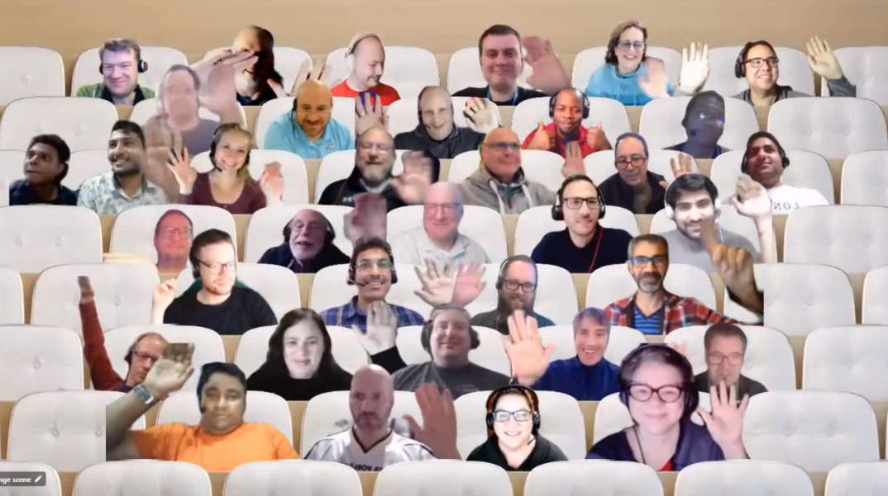

## Call summary

Welcome to the bi-weekly call focused on Microsoft 365 client-side development.  In this call, we focus on using Viva Connections and SharePoint Framework to build solutions for Microsoft Teams and SharePoint Online.

### New this week

* Agenda set for next [Microsoft 365 platform call](https://aka.ms/m365-dev-call) - Tuesday, December 6th 8:00 am PT.
    * Latest news from Microsoft engineering on Microsoft 365 topics
    * Monthly community contributors
    * Demos
        * **Isaac Vargas Chacon** – Python SDK (public preview) Update
        * **Waldek Mastykarz** – Building One Productivity Hub with SPFx for Teams, Microsoft 365 app, Outlook & SharePoint
        * **Vesa Juvonen** – Introduction to Microsoft Viva Toolkit to kickstart your Microsoft Viva extensibility
* Announcements
    * [SharePoint Framework v1.16.1 release notes](https://learn.microsoft.com/sharepoint/dev/spfx/release-1.16.1)
    * Registration open
        * Power Platform Samples Contributor \| Tuesday, January 10th, 10:30am PST \| [Register](https://forms.office.com/pages/responsepage.aspx?id=KtIy2vgLW0SOgZbwvQuRaXDXyCl9DkBHq4A2OG7uLpdUN0hMNTRPWVVWTkhFTk9QQzhFSTRIS1JLSC4u)
        * First Time Contributor \| Thursday, January 12th, 10am PT \| 1pm ET \| 7pm CET – [Register](https://forms.office.com/pages/responsepage.aspx?id=KtIy2vgLW0SOgZbwvQuRaXDXyCl9DkBHq4A2OG7uLpdUNjAwRVNETlA1MkxIR1MyTEs5STZFVVRJMC4u)
        * Writing for the Web \| Monday, January 23rd, 10am PT \| 1pm ET \| 7:00pm CET - [Register](https://forms.office.com/pages/responsepage.aspx?id=KtIy2vgLW0SOgZbwvQuRaXDXyCl9DkBHq4A2OG7uLpdUMFNPNFMyUk9CNFROUjJWTFFGSzdJV0czVC4u)
* Project releases
    * [SharePoint Framework (SPFx)](https://aka.ms/spfx) – v 1.16.1 (GA) \| aka.ms/SPFx/116
    * [PnP Modern Search](https://microsoft-search.github.io/pnp-modern-search/) – v 4.8 (GA)
* Conversations
    * Microsoft 365 PnP Weekly – Episode 189 (November 28th) with UK based Microsoft 365 Apps & Services MVP [Brett Lonsdale](https://twitter.com/brettlonsdale) (Lightning Tools) \| @brettlonsdale \| [video](https://pnp.github.io/blog/microsoft-365-pnp-weekly/episode-188/) \| [podcast](https://www.podbean.com/media/share/pb-y67zr-1327137)
    * Microsoft 365 PnP Weekly – Episode 188 (November 21st) with Finland based Modern Work Lead and Microsoft MVP Karoliina Kettukari (Meltlake) \| @kettukari \| [video](https://pnp.github.io/blog/microsoft-365-pnp-weekly/episode-188/) \| [podcast](https://www.podbean.com/media/share/pb-tkirn-131dfc0)

### Demos

* **Create a useful People Search with PnP Modern Search Web Parts** – description to be added week of December 5th
* **Building Flight tracker solution with SPFx for Microsoft Teams, Microsoft Viva and SharePoint** – description to be added week of December 5th

The host of this call is [David Warner II](https://twitter.com/DavidWarnerII) (Microsoft) @DavidWarnerII. Q&A takes place as always in chat throughout the call.



## Agenda items

* PnPjs Client-Side Libraries - [Julie Turner](https://twitter.com/jfj1997) (Sympraxis Consulting) \| @jfj1997 – [8:02](https://youtu.be/kFPvllcnzuo?t=482)
* CLI for Microsoft 365 - [David Warner II](https://twitter.com/DavidWarnerII) (Microsoft) \| @DavidWarnerII – [9:23](https://youtu.be/kFPvllcnzuo?t=563)
* PnP SPFx Controls [David Warner II](https://twitter.com/DavidWarnerII) (Microsoft) \| @DavidWarnerII – [10:12](https://youtu.be/kFPvllcnzuo?t=612)
* PnP Modern Search - [David Warner II](https://twitter.com/DavidWarnerII) (Microsoft) \| @DavidWarnerII – [10:55](https://youtu.be/kFPvllcnzuo?t=655)
* PnP Samples - [David Warner II](https://twitter.com/DavidWarnerII) (Microsoft) \| @DavidWarnerII – [11:40](https://youtu.be/kFPvllcnzuo?t=700)
* Demo – Create a useful People Search with PnP Modern Search Web Parts – [David Mehr](https://twitter.com/davemehr) (IOZ) \| @davemehr – (Link to demo to be inserted here the week of December 5th)
* Demo – Building Flight tracker solution with SPFx for Microsoft Teams, Microsoft Viva and SharePoint – [Hugo Bernier](https://twitter.com/bernierh) (Microsoft) \| @bernierh & [João Mendes](https://twitter.com/joaojmendes) \| @joaojmendes – (Link to demo to be inserted here the week of December 5th)

## Together Mode

Everybody’s looking great today. Love your smiles and waves. Thank you for joining this call and for being part of this community.

## Actions

* Opt into the [PnP Recognition Program](https://aka.ms/m365pnp-recognition) \| aka.ms/m365pnp-recognition
* Register for upcoming [Sharing is Caring](https://pnp.github.io/sharing-is-caring/) events:
    * Maturity Model Practitioners \| Tuesday, December 20th, 7am PST – [Download reoccurring invite](https://aka.ms/mm4m365/invite)
    * Power Platform Samples Contributor \| Tuesday, January 10th, 10:30am PST \| [Register](https://forms.office.com/pages/responsepage.aspx?id=KtIy2vgLW0SOgZbwvQuRaXDXyCl9DkBHq4A2OG7uLpdUN0hMNTRPWVVWTkhFTk9QQzhFSTRIS1JLSC4u)
    * First Time Contributor \| Thursday, January 12th, 10am PT \| 1pm ET \| 7pm CET – [Register](https://forms.office.com/pages/responsepage.aspx?id=KtIy2vgLW0SOgZbwvQuRaXDXyCl9DkBHq4A2OG7uLpdUNjAwRVNETlA1MkxIR1MyTEs5STZFVVRJMC4u)
    * Writing for the Web \| Monday, January 23rd, 10am PT \| 1pm ET \| 7:00pm CET - [Register](https://forms.office.com/pages/responsepage.aspx?id=KtIy2vgLW0SOgZbwvQuRaXDXyCl9DkBHq4A2OG7uLpdUMFNPNFMyUk9CNFROUjJWTFFGSzdJV0czVC4u)
    * PnP Office Hours – 1:1 session \| [Register](https://outlook.office365.com/owa/calendar/PnPSharingisCaring@warner.digital/bookings/)
    * PnP Buddy System \| [Request a Buddy](https://forms.office.com/Pages/ResponsePage.aspx?id=KtIy2vgLW0SOgZbwvQuRaXDXyCl9DkBHq4A2OG7uLpdUMjRRUVg4NElZUUJLTEY1TVVSVDJFRFpLRS4u)
* Register for the [Microsoft 365 Developer Program](https://aka.ms/m365/devprogram) and get a free developer tenant
* Get started with [free training modules](https://aka.ms/m365/dev/learn) covering Microsoft 365 platform capabilities.
* Visit the [Microsoft 365 Unified Sample Solution Gallery](https://adoption.microsoft.com/sample-solution-gallery) from Microsoft and community.
* Request a Demo spot on the call \| <https://aka.ms/m365pnp/request/demo>
* Download the recurrent invite for this call \| <https://aka.ms/spdev-spfx-call>

## Demo references

* **Create a useful People Search with PnP Modern Search Web Parts** – references to be added the week of December 5th
* **Building Flight tracker solution with SPFx for Microsoft Teams, Microsoft Viva and SharePoint** – references to be added the week of December 5th

Thank you for your great work. Samples are often showcased in Demos.

## Open-source project status

**PnP Project**|**Current version**|**Release/Status**
---|---|---
[SharePoint Framework (SPFx)](https://aka.ms/spfx)|v1.16.1 (GA)|v1.17 - Q1, 2023
[PnPjs Client-Side Libraries](https://pnp.github.io/pnpjs/)|v3.9 GA, v2.13 GA|Version 3.10 to be released Dec 9th
[CLI for Microsoft 365](https://pnp.github.io/cli-microsoft365/)|V6.0 (beta), v5.9.0 GA|v1.16.1 support coming 1st week December
[Reusable SPFx React Controls](https://github.com/pnp/sp-dev-fx-controls-react)|v3.12.0 (GA), v2.9.0|
[Reusable SPFx React Property Controls](https://github.com/pnp/sp-dev-fx-property-controls)|v3.11.0 (GA), v2.7.0|
[PnP SPFx Generator](https://github.com/pnp/generator-spfx)|v1.16.0|v1.17.0 on the way
[PnP Modern Search](https://microsoft-search.github.io/pnp-modern-search/)|v4.8.0 (GA), v4.8.0 (beta), v3.23.0 (GA)|

## General Resources

*   Viva Connections [https://aka.ms/VivaConnections](https://aka.ms/VivaConnections)
*   Archives - Microsoft 365 PnP Weekly - [Videos](https://www.youtube.com/playlist?list=PLR9nK3mnD-OVYI-St_CBiFfuL4CZbBpkC), [Podcasts](https://pnpweekly.podbean.com/)  
*   Tools - [Teams Toolkit (v2.2 Preview)](https://aka.ms/teams-toolkit) 
*   Tools - [Microsoft Teams Framework (TeamsFx)](https://github.com/officedev/teamsfx) 
*   Gallery - [Microsoft 365 Extensibility look book gallery](https://aka.ms/m365/extensibility)   
*   [Microsoft Build sessions guide](https://aka.ms/modernworkbuildsessions) (Modern Work Digital Brochure) - aka.ms/modernworkbuildsessions
*   SharePoint Framework - v1.12.1 npm install –g @microsoft/generator-sharepoint@next
*   [CLI for Microsoft 365 v3](https://developer.microsoft.com/office/blogs/cli-microsoft-365-3/)
*   [CodeTour](https://aka.ms/codetour)
*   [Sharing is Caring](https://aka.ms/sharing-is-caring) | aka.ms/sharing-is-caring
*   [Tools -](https://aka.ms/pnp-search) [PnP Modern Search v4](https://microsoft-search.github.io/pnp-modern-search/)  [|](https://aka.ms/pnp-search) [https://aka.ms/pnp-search](https://aka.ms/pnp-search)
*   [M365 PnP site](https://aka.ms/m365pnp) | aka.ms/m365pnp
*   [SharePoint Starter Kit v2](https://github.com/pnp/sp-starter-kit/tree/v2)
*   Blog: "[A Lap Around Microsoft Graph Toolkit" blog series](https://aka.ms/mgtLap)
*   [New Microsoft 365 Patterns and Practices (PnP) team model with new community leads](https://developer.microsoft.com/microsoft-365/blogs/new-microsoft-365-patterns-and-practices-pnp-team-model-with-new-community-leads/)
*   [Microsoft 365 Community Content](https://aka.ms/m365-community-docs) (non-Dev docs)
*   [PnP SPFx web part samples](https://aka.ms/spfx-webparts)
*   [PnP SPFx extension samples](https://aka.ms/spfx-extensions)
*   [GitHub PnPjs](https://github.com/pnp/pnpjs/)
*   Tutorials - [Getting started with SharePoint Framework v1.10 Tutorials](https://www.youtube.com/playlist?list=PLR9nK3mnD-OXvSWvS2zglCzz4iplhVrKq) (12 videos)
*   Tutorials - [Getting started with SharePoint Framework v1.10 Extensions](https://www.youtube.com/playlist?list=PLR9nK3mnD-OXtWO5AIIr7nCR3sWutACpV) (6 videos)
*   Docs - [Tutorials and training material for SharePoint Development](https://learn.microsoft.com/sharepoint/dev/training/training/?wt.mc_id=YT_CCrecording)
*   [SPFX Training Package](https://aka.ms/spfx-training)
*   [SPFx Web Parts](https://aka.ms/spfx-webparts)
*   [SPFx Extensions](https://aka.ms/spfx-extensions)
*   [SPFx Library Components](https://aka.ms/spfx-library-components)
*   Documentation - [PnPjs v2 documentation](https://pnp.github.io/pnpjs/)
*   Link - [Microsoft 365 developer training](https://aka.ms/M365DevTraining)
*   Link - [Office 365 Developer Program](https://aka.ms/O365DevProgram)
*   [Latest documentation on SharePoint Framework](https://aka.ms/spdev-docs)
*   Found an issue with SharePoint Dev? - please let us know at [https://aka.ms/spdev-issues](https://aka.ms/spdev-issues)
*   [Reusable web part property controls](https://sharepoint.github.io/sp-dev-fx-property-controls/)
*   [Reusable react controls for SharePoint Framework solutions](https://sharepoint.github.io/sp-dev-fx-controls-react/)
*   [Reusable controls webcast](https://devblogs.microsoft.com/microsoft365dev/webcast-reusable-controls-for-your-sharepoint-framework-solutions/)
*   [CLI for Microsoft 365](https://pnp.github.io/cli-microsoft365)
*   [PnP SPFx Yeoman Generator](https://github.com/pnp/generator-spfx) \- Extends the out-of-the-box experience with open-source community capabilities
*   [SharePoint Dev UserVoice](https://aka.ms/spdev-uservoice) \- for new feature requests

## Other mentioned topics

*   [SharePoint dev documentation](https://learn.microsoft.com/sharepoint/dev/)
*   [SharePoint dev issue list](https://github.com/SharePoint/sp-dev-docs/issues)

## Upcoming calls | Recurrent invites

* Microsoft 365 platform call \| Tuesday, December 6, 8:00 am PT – <https://aka.ms/m365-dev-call> (weekly)
* Microsoft 365 General Dev call \| Thursday, December 8, 7:00 am PT - <https://aka.ms/m365-dev-sig> (bi-weekly)
* Office add-in monthly call \| Wednesday, December 14, 8:00 am PT - <https://aka.ms/officeaddinscall> (monthly)
* Viva Connections & SharePoint Framework call \| Thursday, December 15, 7:00 am PT - <https://aka.ms/spdev-spfx-call> (bi-weekly)
* Microsoft Identity Platform call \| Thursday, December 15, 9:00 am PT - <https://aka.ms/IDDevCommunityCalendar> (monthly)
* Power Platform monthly call \| Wednesday, December 21, 8:00 am PT - <https://aka.ms/PowerAppsMonthlyCall> (monthly)

## About

Viva Connections & SharePoint Framework bi-weekly calls are targeted at anyone who is interested in the JavaScript-based development towards Microsoft Connections, Microsoft Teams, SharePoint Online, and also on-premises. Calls are used for the following objectives.

*   SharePoint Framework engineering update from Microsoft
*   Talk about PnP JavaScript Core libraries
*   CLI for Microsoft 365 Updates
*   SPFx reusable controls
*   PnP SPFx Yeoman generator
*   Share code samples and best practices
*   Possible engineering asks for the field - input, feedback, and suggestions
*   Cover any open questions on the client-side development
*   Demonstrate SharePoint Framework in practice in Microsoft Viva, Microsoft Teams or SharePoint context
*   You can download a recurrent invite from [https://aka.ms/spdev-spfx-call](https://aka.ms/spdev-spfx-call). Welcome and join the discussion!

*“Sharing is caring”*

* * *

*Microsoft 365 PnP team, Microsoft - 1st of December 2022*


