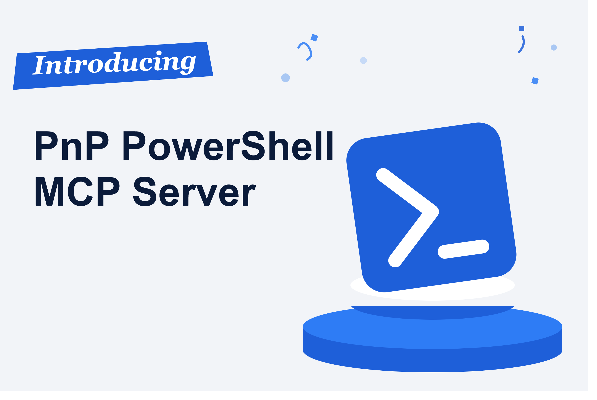
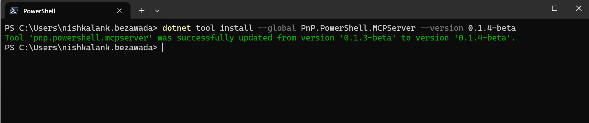
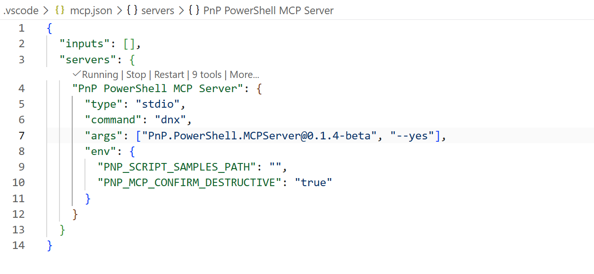
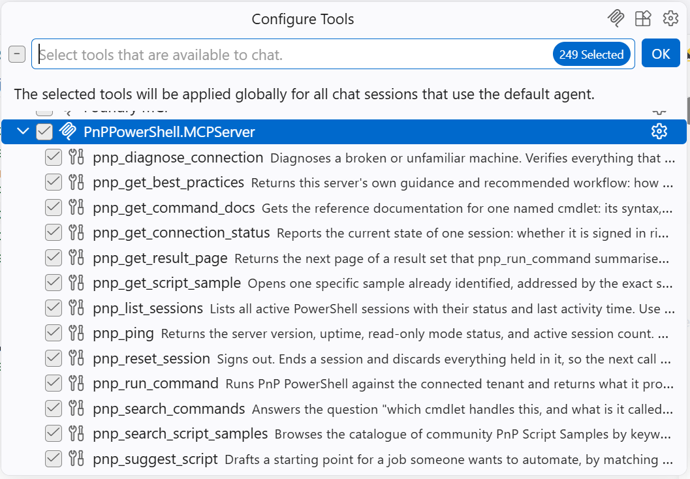
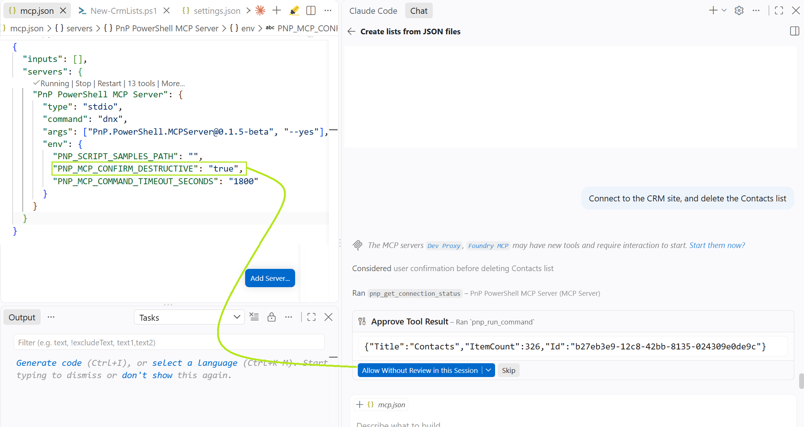

## 🤖 Say hello to your new PnP PowerShell co-pilot

Ever wished you could just *tell* PnP PowerShell what you want, instead of hunting through 800+ cmdlets and their parameter sets? Now you can. 🎉

The **PnP PowerShell MCP Server** turns your favourite AI assistant - GitHub Copilot, Claude, Cursor, and more - into a PnP PowerShell copilot. Type a plain-English request, and it figures out the right chain of cmdlets, runs them against your connected tenant, and hands you back the result. No more digging through docs to remember whether it's `-Identity` or `-List`, no more copy-pasting snippets from old scripts. Just describe the outcome you want.



It doesn't stop at running commands, either. It can search the community's [PnP Script Samples](https://pnp.github.io/script-samples/) library for you, pull up the exact cmdlet documentation you need, and it always asks before doing anything destructive - so you get the speed of natural language without giving up control.

## 🧩 So what actually is this thing?

The **Model Context Protocol (MCP)** is an open standard that lets AI assistants talk to external tools in a consistent way. The PnP PowerShell MCP Server is one of those tools - a small **local (stdio) MCP server** that runs on your machine and shells out to the PnP PowerShell module you already have installed.

That means it reuses *your* sign-in and *your* connection - it never authenticates on your behalf, and it never sends your tenant data anywhere else. Think of it as a thin, trustworthy layer that lets your AI client drive PnP PowerShell for you, safely.

## ✨ Why you'll want this in your toolbox

Once it's wired up, you can manage huge chunks of Microsoft 365 without leaving your chat window:

* **SharePoint Online** - sites, lists, libraries, columns, items, pages
* **Microsoft Teams** - teams, channels, posts
* **Entra ID**, **OneDrive**, **Planner**, **Power Platform**, **Microsoft 365 Groups**
* **Taxonomy, search, and tenant administration**

And honestly, one of the best parts is how it jump-starts your own scripts. Stuck on how to automate something? Just ask - it'll find the closest community sample and adapt it to your scenario, so you start from working code instead of a blank file.

## 🚀 Get it running in minutes

Setting this up is genuinely quick - you'll be chatting your way through PnP PowerShell before you know it. Pick whichever install path suits you.

### Option 1: Install as a .NET global tool

```bash
dotnet tool install --global PnP.PowerShell.MCPServer --version 0.1.4-beta
```

This installs a self-contained, native AOT executable named `pnp-powershell-mcp-server` on your `PATH`. It supports Windows (x64, arm64), macOS (arm64, x64), and Linux (x64, arm64, musl x64).




### Option 2: Run on-demand with `dnx`

If you're on the .NET 10 SDK, you don't need to install anything up front - you can point your MCP client at the NuGet package directly and let the [`dnx`](https://aka.ms/nuget/mcp/concepts) tool runner fetch and run it. Add this to your `.vscode/mcp.json`:

```json
{
  "servers": {
    "PnP.PowerShell.MCPServer": {
      "type": "stdio",
      "command": "dnx",
      "args": ["PnP.PowerShell.MCPServer@0.1.4-beta", "--yes"]
    }
  }
}
```

This is the configuration surfaced on the [NuGet package page](https://www.nuget.org/packages/PnP.PowerShell.MCPServer). Pin the version (`@0.1.4-beta`) to a specific release, or drop it to always pull the latest prerelease.

### Add to VS Code

If you installed the global tool (Option 1), register it with VS Code:

1. Open the Command Palette (`Ctrl+Shift+P` / `Cmd+Shift+P`) and type `MCP: Add Server`.
2. Select **Command (stdio)** as the server type.
3. Enter the command to run the MCP server:

   ```text
   pnp-powershell-mcp-server
   ```

4. Name the server (e.g., `PnP PowerShell MCP Server`).

You should end up with the following in your `.vscode/mcp.json` file:

```json
{
    "servers": {
        "PnP PowerShell MCP Server": {
            "type": "stdio",
            "command": "pnp-powershell-mcp-server"
        }
    }
}
```



Now open GitHub Copilot chat in Agent mode, and you'll see the **PnP PowerShell MCP Server** tools show up. Start your prompt with something like *"Using PnP PowerShell, I want you to..."* and watch Copilot take it from there.



You're not limited to VS Code, either - the server works just as well with **GitHub Copilot CLI**, **Claude Code**, **Claude Desktop**, and **Cursor**. See the [project README](https://github.com/pnp/pnp-powershell-mcp-server) for the exact steps for each client.

## 📷 What you can do with it

These are just a taste of what's possible - once you get going, you'll find yourself reaching for it constantly.

### Manage SharePoint Online

> Add a new list to this site with title 'awesome ducks'. Then add new columns to that list including them in the default view. The first should be a text description column and the second one should be a user column. Then add 3 items to this list with some funny jokes about ducks added in the description column and my user in the user column.


### Manage Microsoft Teams

> Create a new Team on Teams with name 'Awesome Ducks' and in the General channel add a welcome post.


### Bootstrap a script from a community sample

> I need a PnP PowerShell script that exports all SharePoint list items to a CSV file - find a community sample and adapt it for the 'Documents' list on my site.

### Report on tenant state

> Can you check if I have a Power Automate flow called 'HoursReportingReminder' and if so disable it?


Imagine being able to say things like this and just having them done - that's the everyday reality with this MCP server in your corner.

## 🔐 Safe by design, so you can move fast

Naturally, handing an AI assistant the keys to your tenant raises an eyebrow - so safety was baked in from day one:

* **You stay in control of authentication.** The server never signs in for you - it reuses the connection you made with `Connect-PnPOnline`.
* **Destructive commands require confirmation.** Anything that can change or delete state must be confirmed before it runs.
* **Everything is annotated.** Read-only, idempotent, and destructive hints let your client auto-approve safe operations while pausing on risky ones.



That means you get to move fast and explore freely, without worrying about an accidental `Remove-PnPTenantSite`.

## 🔁 Juggling multiple tenants? No problem

Commands run in a persistent `pwsh` session, so a connection made with `Connect-PnPOnline` stays alive across calls - you connect once rather than on every command.

For most work you never think about sessions. If you need to work against **two tenants (or two accounts) at the same time**, just say so, and the agent will keep each connection in its own named session:

> Connect to contoso in a session called "contoso" and to fabrikam in a session called "fabrikam", then list the site count in each and tell me which is larger.

### A few tips to make the experience smoother

* **Sign out or switch account** with `pnp_reset_session`. It ends that session and discards its connection and variables; the next call starts fresh.
* **Idle sessions end after 30 minutes.** A session busy running a command is never reclaimed, however long it takes - just reconnect if one does expire.
* **One command at a time per session.** A second call against a busy session waits, then reports the session is busy. To genuinely run two things at once, use two different session names.
* **Reuse the connection.** Don't re-run `Connect-PnPOnline` before every command; the agent checks `pnp_get_connection_status` first and reuses the existing connection.

## 💬 Give it a try - we'd love your feedback

The PnP PowerShell MCP Server is open source and community-driven, and it genuinely gets better with every person who tries it. So go on:

* 👉 **Try it out** and manage Microsoft 365 using natural language
* 👉 **Report any issues or bugs** you encounter
* 👉 **Share feedback, suggestions, and feature requests**

Everything you need - the project, full installation instructions for every client, and the source code - is right here on GitHub: [pnp/pnp-powershell-mcp-server](https://github.com/pnp/pnp-powershell-mcp-server). Star it, try it, and let us know what you build with it!

## Need more information?

For more on PnP PowerShell itself - commands, architecture, and getting started - visit [aka.ms/pnppowershell](https://aka.ms/pnppowershell).

Happy scripting with natural language! 💙

