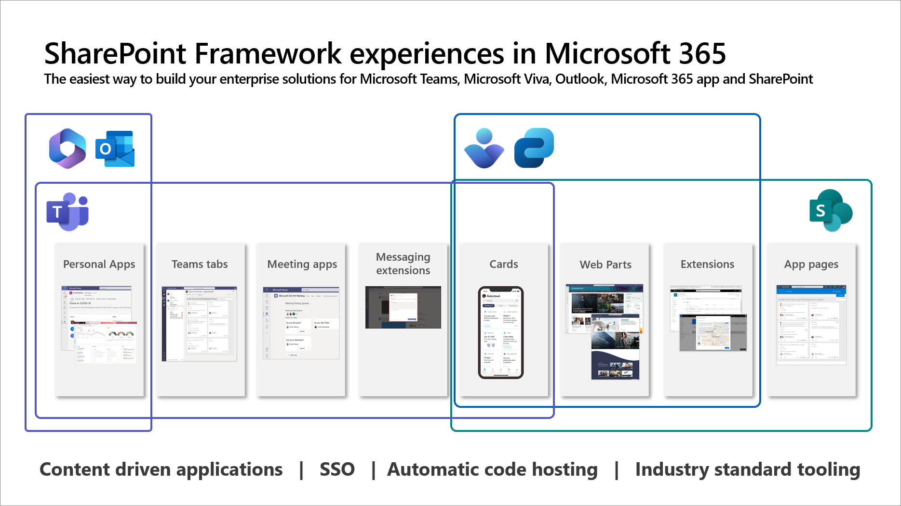

[SharePoint Framework](https://aka.ms/spfx) (SPFx) is an extensibility model for Microsoft 365 enabling developers to extend the Microsoft 365 services by including JavaScript driven components and experiences within the user interface.

SPFx provides a cost-efficient option to extend the user interface with industry standard web stack tooling and automatic hosting, all part of the standard licensing in Microsoft 365.

-	*What does that mean in practice and why is it called “SharePoint Framework” in the first place?*
-	That is a great question. Let’s start by clarifying what exact is SharePoint and why SPFx was initially created for it. Then we’ll talk about the capabilities and future of SPFx and how it’s not just about the SharePoint


This blog post is part of the a month long SPFx series for January 2023. Each business day we'll publish a new blog post covering different aspects of the SPFx.

* Next blog post in this series - [Getting started with SPFx – Building your first extensibility for Microsoft 365](https://pnp.github.io/blog/post/spfx-02-getting-started-with-spfx/)


## What is SharePoint?

*“SharePoint is a web-based collaboration platform that integrates natively with Microsoft Office”* – the introduction to SharePoint from [Wikipedia](https://en.wikipedia.org/wiki/SharePoint). [SharePoint](https://www.microsoft.com/microsoft-365/sharepoint/collaboration/) was originally launched back in 2001 as a server-side product for document management and storage system but was then extended further with the following versions with intranet and even Internet facing content management features.

SharePoint was a highly successful on-premises product with almost unlimited extensibility options for customers to take advantage of. Starting from the SharePoint 2007 version forward, it came to be one of the most successful content management products in the world. One of the key challenges we had, however, in the on-premises was that the customer specific extensibility was version specific, so whenever a new on-premises version was released, there were additional costs due to the extensibility built for the deployment.

With the introduction of [Office 365](https://en.wikipedia.org/wiki/Microsoft_365) (nowadays known as Microsoft 365), SharePoint features and capabilities were also included in the Microsoft cloud offering as the collaboration and content management services from the cloud. As part of this transition a completely new version of the SharePoint experiences were released starting from 2017 with so called modern experiences. These modern experiences were designed to be more future proof and to provide more evergreen options to enable new features for customers in the cloud without continuous maintenance or operation requirements due to the deployed extensibility. This also meant that a new extensibility option would be needed for supporting this cloud first model which resulted in the introduction of SharePoint Framework (SPFx).

SharePoint continues to be available in the on-premises with the latest version being called as the [SharePoint Subscription Edition](https://techcommunity.microsoft.com/t5/microsoft-sharepoint-blog/sharepoint-server-subscription-edition-general-availability/ba-p/2913714) (released in 2021), but the latest and greatest features are available as part of the Microsoft 365 offerings with even weekly updates and new features.

SharePoint provides the content and platform services for Microsoft 365 powering features and capabilities for example for [Microsoft Viva](https://www.microsoft.com/microsoft-viva), Microsoft Teams, Microsoft Syntex and Microsoft Stream. SharePoint Online has more than 200 million monthly active users in the cloud with continuous investments across the different feature sets across the different capabilities.

For intranet and collaboration usage, see example designs on the art of possible from [Microsoft Look Book service](https://lookbook.microsoft.com/).

## What is SharePoint Framework (SPFx)?

[SharePoint Framework](https://aka.ms/spfx) (SPFx) is a client-side extensibility model for Microsoft Teams, Microsoft Viva, Outlook, Microsoft 365 app (Office), and SharePoint. It was initially introduced for SharePoint as part of the “modern” SharePoint experiences introduced in Microsoft 365 (at the time called Office 365).

Microsoft needed to provide a future proof extensibility model which aligns with the objective of rolling out new features for customers even on a weekly basis. The classic SharePoint extensibility in the on-premises was not working for cloud as it would have blocked customers to receive the new capabilities as part of our Microsoft 365 subscription. So, SPFx model was introduced to support creating user interface extensibility initially in SharePoint Online (part of Microsoft 365).

All SPFx solutions are created during development time with TypeScript and then transformed to be native JavaScript as they are deployed to be used in browser. This aligns with the **industry standard web stack development model** and SPFx dev tooling provides great streamlined experience for creating these web components.

SPFx provides you an option to build your JavaScript components once and **reuse the same component across the different services in Microsoft 365** – so the exactly the same JavaScript based app can be used in Microsoft Teams, Microsoft Viva, Outlook, Microsoft 365 app (Office), and in SharePoint. Build once, expose across Microsoft 365.

SPFx is also used by Microsoft engineers to build the native out of the box features which are available in SharePoint Online, like the out of the box web parts.

SPFx has the following objectives:

-	Provide customers and partners **reliable and predictable extensibility model** for Microsoft 365
-	Support usage of **industry standards** without any requirement of proprietary programming options – with standard **web stack development** using Node, Gulp, Yeoman, React, and more
-	Simplify custom **solution hosting and operations by providing automatically hosted solutions for customer and partners** – no need to have externally hosted web sites for example in Microsoft Azure
- **Automatic Single sign-on** with Azure Active Directory with secure way to use Microsoft Graph APIs and Azure hosted services - no need to worry about tokens
-	Solutions built with SPFx will be **running in the context of the customer tenant** – without requirements of having externally hosted code having access on the customer tenant using APIs

You can of course also integrate SPFx solutions with code running in Microsoft Azure, for example with Azure Functions or with Web APIs. SPFx supports calling these cloud components securely based on the administrative approval in the customer tenant.

Given the worldwide success of the SPFx with customers and partners, Microsoft  decided to start investing in its usage outside of SharePoint Online. Starting from 2018, you have been able to use the SPFx solutions directly in the Microsoft Teams. In 2021 we announced the [Microsoft Viva Connections extensibility](https://learn.microsoft.com/sharepoint/dev/spfx/viva/overview-viva-connections) to be based on the SPFx and in 2022, we announced the support on building Outlook and Microsoft 365 app (Office) extensibility with SPFx – with all the previously mentioned benefits.

## Frequent questions around SPFx

**Is SPFx only for SharePoint Developers?**

No. SPFx is targeted for any web developer to extend Microsoft 365 easily and cost efficiently using TypeScript/JavaScript.

**Is SPFx only for developers with SharePoint background?**

No. As it’s based on web stack development tooling, there’s no SharePoint background needed. We hear all the time great feedback from the partner ecosystem on how new web developers have used SPFx to easily get familiar with the Microsoft 365 platform.

**I have an existing web site which I want to integrate to Microsoft 365, is SPFx for me?**

It could be, but it depends on the exact requirements. If you are an ISV with an existing web site, it’s most likely easier to integrate that service to Microsoft 365 using the [Microsoft Teams app model](https://learn.microsoft.com/microsoftteams/platform/).

**Is Microsoft investing in SPFx across Microsoft 365?**

Yes. Given the existing worldwide success of SPFx, we are investing heavily in the SPFx to be supported across the Microsoft 365 platform and are seeing great results in this.

**Do I need to understand SharePoint ism’s for understand SPFx?**

No. SPFx does not require you to understand SharePoint specific terms or tooling. You can easily build extensibility also for Microsoft Viva or Microsoft Teams without focusing on SharePoint.

**Can I extend SPFx solutions with Azure components?**

Absolutely and this is commonly done for long running operations or for elevating permissions for the needed operations. You’d typically do this with Azure Functions or with Azure Web APIs. SPFx supports calling securely Azure Active Directory secure resources.

**Can I use Angular or other common JavaScript frameworks with SPFx?**

Absolutely. Microsoft is using React for their out-of-the-box web parts and features in SharePoint Online, but you can use whatever framework you want. Microsoft does provide React templates in the SPFx Yeoman generator by default, but you can use any JavaScript library you want. You scaffold the default structure without a framework solution and then include the wanted library to the solution.

**Will SPFx name be changed in future?**

SharePoint Framework (SPFx) is a confusing name for an extensibility model which can be used across Microsoft 365, so there are ongoing discussions on updating the name to address the real scope of the possibilities with the SPFx. We do not have a final decision on this, and the timeline is still unclear, but your input is always welcome on this topic as well.

## References

Here are some initial references to get started with the SPFx in your development. Please do provide us with feedback and suggestions on what is needed to help you to get started with the SPFx development for Microsoft 365.

-	SPFx documentation – https://aka.ms/spfx
-	Issues and feedback around SPFx - https://aka.ms/spfx/issues
-	Microsoft 365 Platform Community – https://aka.ms/m365/community
-	Public SPFx and other community calls – https://aka.ms/m365/calls
    - These calls are for everyone to take advantage to stay up to date on the art of possible within Microsoft 365 and to provide guidance for beginners and more advance users
- Drive value with Microsoft 365 adoption tools – https://adoption.microsoft.com

- - -

We will provide more details on the different options and future direction of the SPFx in upcoming blog posts. This one was mainly to provide you the overall perspective on what exactly is SPFx and the background of it.
