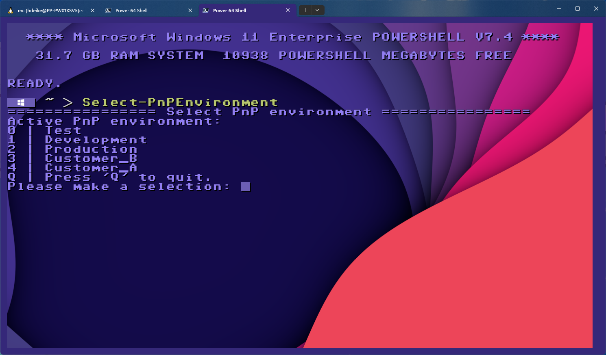
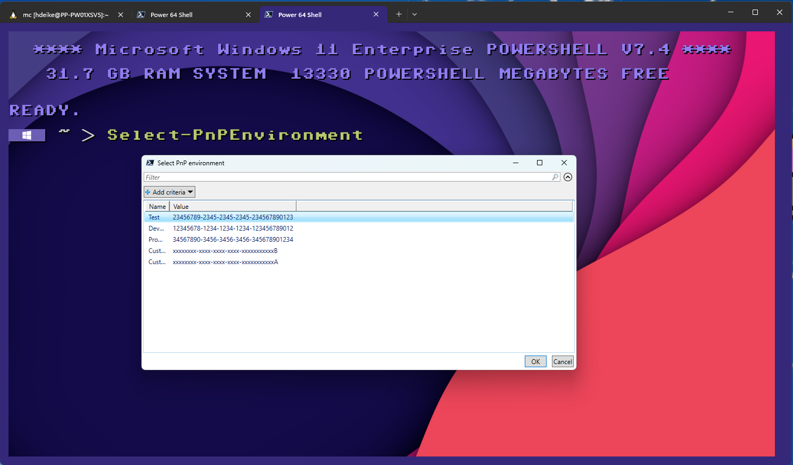
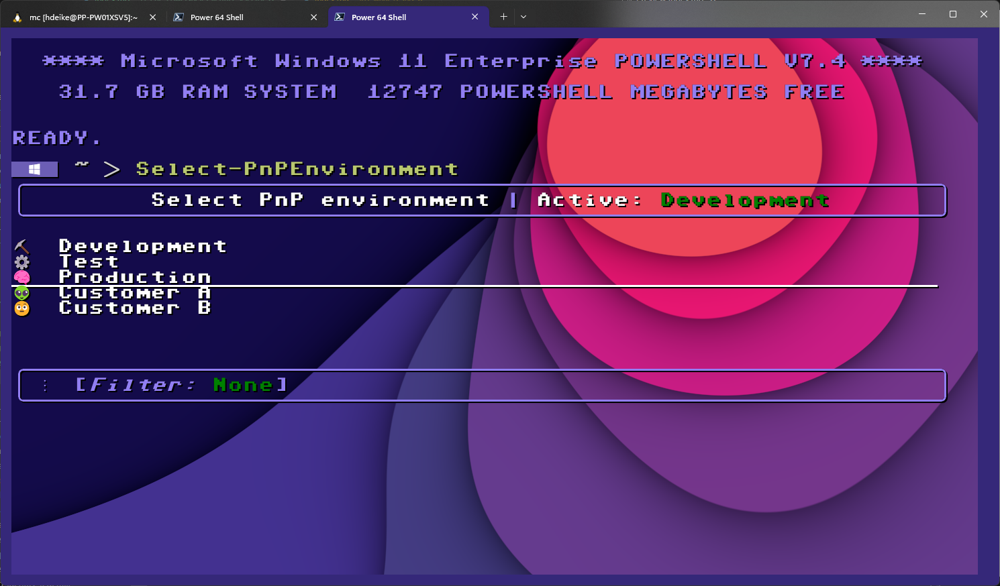

The PnP Powershell module has become very popular and for many of us it is the tool we work with on a daily basis. With version 2.12.0, it has become necessary to use your own Entra ID Application Registration to sign in to the tenant. This means that we now also have to enter the -ClientID parameter when logging in with Connect-PnPOnline. In my daily work, however, I have to switch back and forth between different environments. Entering the GUID everytime I logon is therefore too cumbersome in the long run.

## I'd rather be lazy

Working with computers should make our lives easier, not harder. That's why I wanted a simple solution to be able to switch quickly between different environments considering the following points:

- Easy to understand script
- Must be available in my Powershell at all times
- Simple menu navigation
- Expandable in the future for example to include automatic login

During my research I came up with three different approaches, all of which I have published in my Github. They are available for everyone to use as examples in their own Powershell environments. Everyone is free to choose the variant that best suits their needs.

### The basic principle

Although we now have to specify the client ID of the application registration when logging in with PnP Powershell, fortunately there is also the possibility to define the environment variable ENTRAID_APP_ID with the GUID of the client ID to which we want to log in by default. So if you write the GUID in to ENTRAID_APP_ID, you can omit the -ClientID parameter from Connect-PnPOnline.

```powershell
$env:ENTRAID_APP_ID="1337B33F-1337-B33F-1337-B33F1337B33F"
Connect-PnPOnline -Url "https:<tenant>-admin.sharepoint.com" -Interactive
```

My first two points, Easy to understand and Must be available in Powershell at all times, are realized by adding a small helper script to my Powershell profile. This script adds a new function with a small menu in which I can choose between the different client IDs. A single cmdlet without further parameters should be enough for now.

```powershell
function Select-PnPEnvironment {
    "================ Select PnP environment ================" | Write-Host
    "Active PnP environment:" | Write-Host -NoNewline
    Get-PnPEnvironment | Write-Host -ForegroundColor White
    Write-Host
    "1: My Development" | Write-Host
    "2: My Test" | Write-Host
    "3: My Production" | Write-Host
    "Q: Press 'Q' to quit." | Write-Host

    $selection = Read-Host "Please make a selection"
    switch ($selection) {
        '1' {
            $env:ENTRAID_APP_ID = "12345678-1234-1234-1234-123456789012"
        } '2' {
            $env:ENTRAID_APP_ID = "23456789-2345-2345-2345-234567890123"
        } '3' {
            $env:ENTRAID_APP_ID = "34567890-3456-3456-3456-345678901234"
        } 'q' {
            return
        }
    }
}
```

This script is very simple and straightforward. Simply type Select-PnPEnvironment to switch between the environments. However, it has a few disadvantages. Firstly, it is somewhat error-prone, as I always have to adapt both the menu and the switch case when making changes. The other problem is that if I have set the environment variable, after a while I can no longer keep track of which environment I have selected. Also, code that I have to write more than once is always not good.

### Let's optimize

The first thing I'll do is store the configuration of the client IDs in a hashtable. I'll also define another function called Get-PnPEnvironment that I can use later to read the value from the environment variable.

```powershell
$entraidAppIds = @{
    Development = "12345678-1234-1234-1234-123456789012"
    Test = "23456789-2345-2345-2345-234567890123"
    Production = "34567890-3456-3456-3456-345678901234"
    Customer_A = "xxxxxxxx-xxxx-xxxx-xxxx-xxxxxxxxxxxA"
    Customer_B = "xxxxxxxx-xxxx-xxxx-xxxx-xxxxxxxxxxxB"
}

function Get-PnPEnvironment {
    return $entraidAppIds.Keys.Where({$entraidAppIds[$PSItem] -eq $env:ENTRAID_APP_ID})
}

function Select-PnPEnvironment {
    "================ Select PnP environment ================" | Write-Host
    "Active PnP environment:" | Write-Host -NoNewline
    Get-PnPEnvironment | Write-Host -ForegroundColor White
    Write-Host

    for ($i = 0; $i -lt $entraidAppIds.Count; $i++) {
        ("{0} | {1}" -f $i,([array]$entraidAppIds.Keys)[$i]) | Write-Host
    }
    "Q | Press 'Q' to quit." | Write-Host

    $selection = Read-Host "Please make a selection"
    $clientid = ([array]$entraidAppIds.Values)[$selection]
    if (-not (([string]::IsNullOrEmpty($clientid)) -or ($selection -eq 'q'))) {
        "Client ID set to {0}" -f $clientid | Write-Host
        $env:ENTRAID_APP_ID = $clientid
    }
}

$env:ENTRAID_APP_ID = $entraidAppIds.Development
```

A loop creates a menu entry for each entry in the hashtable and the selection made is used to find the entry in the list. This way it's no longer necessary to amend the Select-PnPEnvironment function; now it is enough to add or remove entries to the $entraidAppIds hashtable.



The script can be added anywhere in the Powershell profile. Simply copy and paste the examples and then customize the hashtable with your GUIDs. You may want to place the hashtable higher up in your profile if you want to add or delete client IDs in the future to have faster access to the content.

This menu is simple but it has a short comming. It is not very expandable for the future. This is because I read a single digit with Read-Host. So if I enter more than 10 client IDs in the hashtable, I can no longer choose them.

### Would you like a bit less?

Another method is to use the Out-GridView cmdlet as a menu. It is actually meant to display data in a structured way, but if you use the -PassThru parameter, you can use it to select a row.

```powershell
function Select-PnPEnvironment {
    $selection = $entraidAppIds | Out-GridView -PassThru -Title "Select PnP environment"
    $clientid = $selection.value

    "Client ID set to {0}" -f $clientid | Write-Host
    $env:ENTRAID_APP_ID = $clientid
}
```

This script is even simpler in its functionality. The hashtable with the client IDs is simply piped into the Out-GridView cmdlet. The selection is then written directly into the environment variable. The rest remains as it is.



Errors are not intercepted in this script. If you select more than one row in the Out-GridView display, you can do this. There is no error, but the result may be different from what you would expect. The collection returned in $selection is sorted by the names of the hashtable. The first entry in the list is then used to assign the environment variable.

Unfortunately, this approach also has a disadvantage and the reason for this is that Out-GridView is only available for Windows.

### Do you like candy?

One functionality that I desperately miss in Powershell is the ability to create complex text based UIs. CSharp developers can use TerminalUI. Unfortunately I could not find a port, but I found a project on Github called psCandy. What I particularly like about this is that the module is 100% implemented in Powershell.

Adding the module is simply done with

```powershell
Install-Module -Name psCandy -Scope CurrentUser
```

To utilize psCandy, I first need to add the module with the using statement. Then I replace the hashtable with the client IDs by a generic list. This list is necessary for psCandy to be able to display the selection menu later.

Each item is added to the list as a new object. The constructor will accept three values. The name of the entry, the value and an icon. The symbol can be changed with the Windows + . key.


```powershell
using module psCandy

[Console]::OutputEncoding = [System.Text.Encoding]::UTF8
$entraidAppIds = [System.Collections.Generic.List[ListItem]]::new()
$entraidAppIds.Add([ListItem]::new("Development", "12345678-1234-1234-1234-123456789012", "⛏️"))
$entraidAppIds.Add([ListItem]::new("Test", "23456789-2345-2345-2345-234567890123", "⚙️"))
$entraidAppIds.Add([ListItem]::new("Production", "34567890-3456-3456-3456-345678901234", "🧠"))
$entraidAppIds.Add([ListItem]::new("Customer A", "xxxxxxxx-xxxx-xxxx-xxxx-xxxxxxxxxxxA", "👽"))
$entraidAppIds.Add([ListItem]::new("Customer B", "xxxxxxxx-xxxx-xxxx-xxxx-xxxxxxxxxxxB", "🤨"))

function Get-PnPEnvironment {
    return ($entraidAppIds | Where-Object { $_.value -eq $env:ENTRAID_APP_ID}).text
}

function Select-PnPEnvironment {
    $list = [List]::new($entraidAppIds)
    $list.SetHeight(10)
    $list.SetTitle( ("<White>Select PnP environment</White> | <White>Active:</White> <Green>{0}</Green>" -f (Get-PnPEnvironment)) )
    $list.SetLimit($true)
    
    $selection = $list.Display()
    $env:ENTRAID_APP_ID = $selection.value
    
    ("Environment set to {0}" -f $selection.text) | Write-Host
}

$env:ENTRAID_APP_ID = $entraidAppIds[0].value
```

The Get-PnPEnvironment function is very similar to the last example. The list for the selection is created and some parameters are defined, such as the title or how many entries should be displayed at the same time. SetLimit($true) is used to specify that only a single element can be selected at a time.



The menu with psCandy currently offers me everything I want. It is completely written in Powershell and is loaded with my Powershell profile at startup. It is easy to understand and psCandy offers me even more possibilities to extend the functionality in the future.

## In conclusion

tbc
