What if you could use Microsoft Copilot Studio not only to answer questions, but also to work with Power Platform resources using natural language?

Instead of manually navigating through Power Automate, you could just ask:

> "Create a Power Automate flow that sends an approval when a new request is created."

Or:

> "List the Power Automate flows in my environment."

Or:

> "Create a model-driven app for managing customer requests."

This article walks through how to connect a Power Platform MCP server to Microsoft Copilot Studio, and use the agent as a conversational interface to Power Platform capabilities. It covers installing and configuring the MCP server, authenticating it, running it over HTTP transport, exposing it through a development tunnel, and connecting it to a Copilot Studio agent that can actually build things - not just talk about them. Nothing here is skipped, down to the small clicks, so if you build agents or flows in Power Platform today, you have everything you need to follow along.

## What is Power Platform MCP?

Model Context Protocol (MCP) provides a standardized way for an AI client to discover and invoke tools exposed by a server. In this scenario, the MCP server acts as the bridge between Copilot Studio and Power Platform: the agent doesn't talk to Power Automate, Dataverse, or Power Apps directly - it calls a tool, the MCP server translates that into a real Power Platform API request, and the result comes back through the same channel so the agent can reason about what happened next.

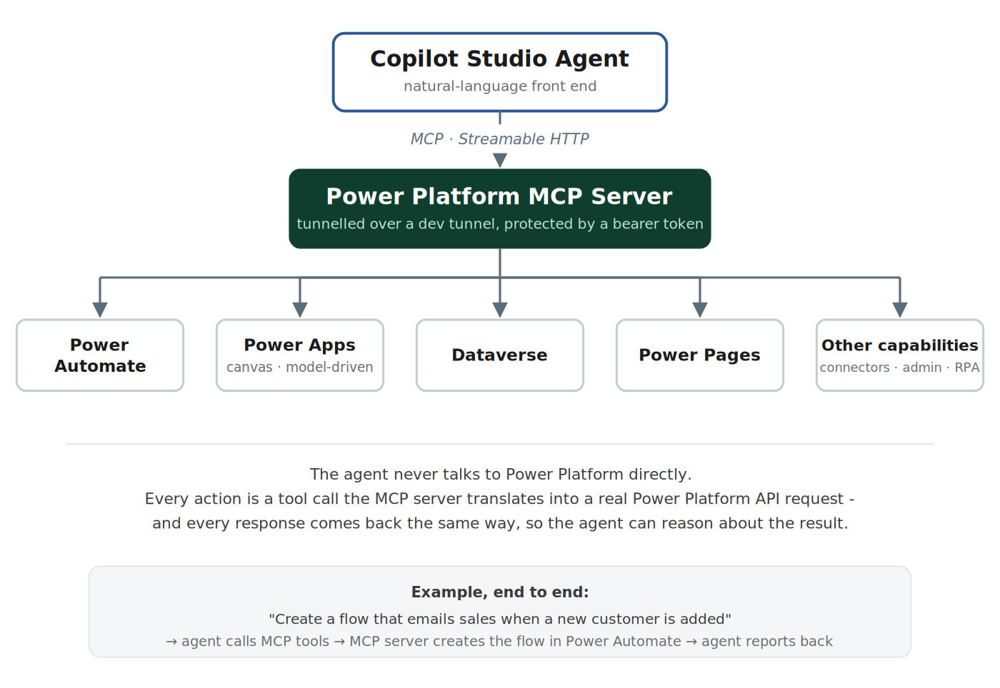

The implementation used in this walkthrough is based on a community Power Platform MCP server project. At a high level, it documents tools for flow creation and diagnosis, Dataverse operations, Power Apps (canvas and model-driven), Power Pages, connectors, and environment administration. A full categorised list of everything it exposes is included as a separate reference alongside this post, so this article can stay focused on the *how* rather than cataloguing every tool.

## Prerequisites

| Requirement | Notes |
|---|---|
| npm | Required to install and run the MCP server. [Download Node.js®](https://nodejs.org/en/download) (npm is bundled with it). |
| Microsoft work/school account | Sign-in uses a device code - no password is ever entered in the CLI. |
| .NET 10 SDK *(optional)* | Only required for Canvas App source authoring (preview feature). [Download .NET 10.0 SDK (v10.0.400) - Windows x64 Installer](https://dotnet.microsoft.com/en-us/download/dotnet/thank-you/sdk-10.0.400-windows-x64-installer) |

If you're not sure whether Node.js is already installed, open PowerShell (press the **Windows key**, type `powershell`, hit **Enter**) and run:

```powershell
node -v
npm -v
```

Both should print a version number. If either errors out, install Node.js from the link above first, then close and reopen PowerShell and try again.

## Part 1 - Install and configure the MCP server

Run these three commands, in order, in PowerShell:

```powershell
# 1. Install the server globally so it's available anywhere on your machine
npm install -g powerautomate-mcp

# 2. Sign in and connect it to an AI app - opens an interactive setup wizard
powerautomate-mcp --setup

# 3. Confirm everything is actually working
powerautomate-mcp --doctor
```

The `--setup` wizard is five steps. Here's exactly what happens at each one.

### Step 1/5 - Find your app

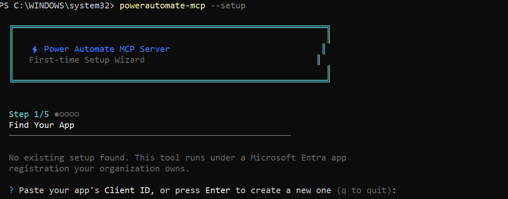

The wizard looks for an existing Microsoft Entra app registration to run under. The first time you do this, you don't have one yet - just press **Enter** to let it create a new one for you rather than pasting in a Client ID.

Right after that, it asks which permissions the app should request. This matters more than it looks: the app only ever gets to do what you allow it here, so it's worth choosing deliberately rather than clicking through.

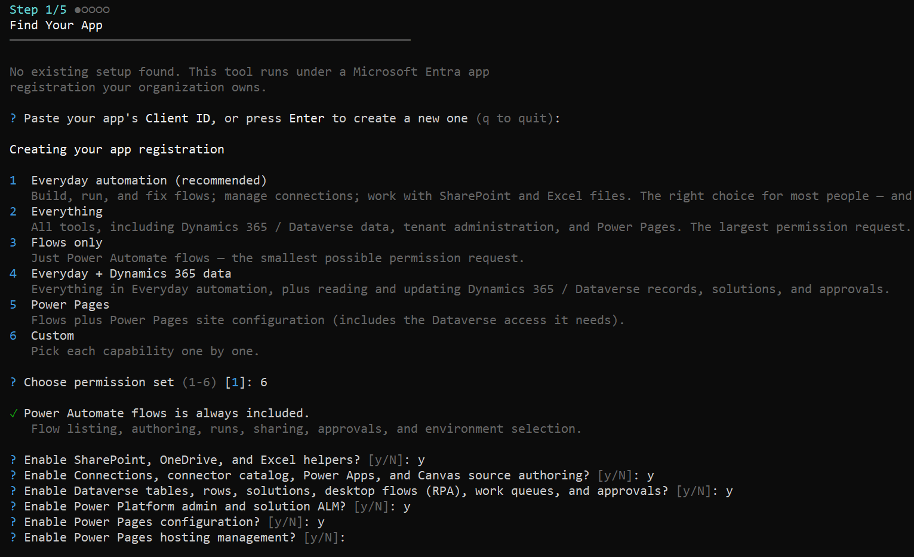

- If you just want to try things out, **Everyday automation** (option 1) is the safest default - flows, connections, SharePoint/Excel helpers.
- If you know exactly what you need (for example, Dataverse access but nothing else), pick **Custom** (option 6) - it then asks a plain **y/n** question for each capability (SharePoint/Excel helpers, connectors and canvas authoring, Dataverse tables/rows/solutions, tenant admin, Power Pages configuration, Power Pages hosting), so you end up with exactly the permission set you asked for and nothing more.

### Step 2/5 - Sign in

Before this step, make sure the **Azure CLI** is installed on your machine - the wizard uses it in the background to provision some of the app registration's permissions, and the step will fail partway through if it's missing. If you don't have it yet, install it first from [Microsoft's Azure CLI install guide](https://learn.microsoft.com/en-us/cli/azure/install-azure-cli), then come back and continue.

You'll be asked for consent on the permissions you chose in Step 1 - the same kind of admin consent screen you'd see approving any enterprise app, and it needs to be accepted by someone with the right admin rights in your tenant.

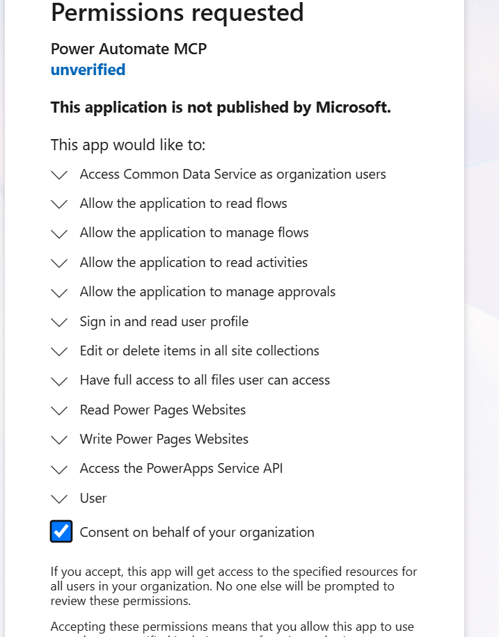

After consent, you're signed in using a **device code**: a short code plus a link (`https://login.microsoft.com/device`). Open that link in a browser, enter the code, and sign in with your work account. No password is ever typed into the terminal itself.

### Step 3/5 - Select environment

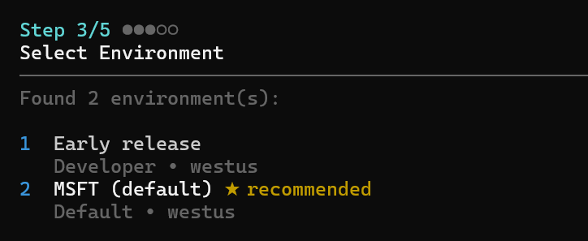

The wizard lists every Power Platform environment it found in your tenant and marks its recommended default. **While you're still getting familiar with this**, it's worth deliberately picking a non-production environment here (a Developer or sandbox one) rather than the default - you'll be asking an AI agent to create real flows, tables, and apps, and it's a much safer place to experiment until you trust how it behaves.

### Step 4/5 - Save

Nothing to click here - the wizard automatically saves everything you've configured into a local config file and moves straight on.

### Step 5/5 - Connect your AI app

This is the step that matters most for what we're building here, because it decides *how* this server gets consumed.

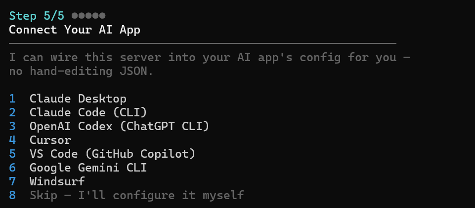

If you're using one of the seven listed clients (Claude Desktop, Claude Code, OpenAI Codex, Cursor, VS Code, Gemini CLI, Windsurf), picking its number here wires everything up automatically - no hand-editing JSON. If you want to host this server for a different system entirely, the project's own setup guide at [rcb0727/powerplatform-mcp-docs](https://github.com/rcb0727/powerplatform-mcp-docs) covers each option in more depth.

For Copilot Studio specifically, none of the eight options is it - Copilot Studio isn't a desktop AI client the wizard can wire into directly. So choose **8 - Skip, I'll configure it myself**, since we'll be exposing this over HTTP ourselves in Part 2.

Once you do, the wizard verifies everything and finishes:

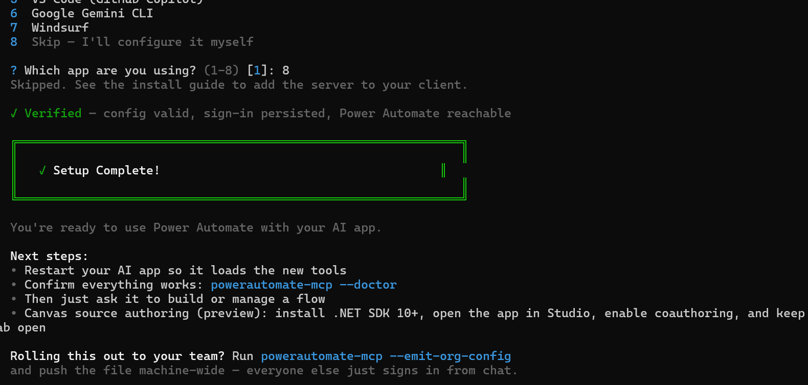

Run `powerautomate-mcp --doctor` once more here to double-check everything reads green before moving to Part 2.

## Part 2 - Bridge the server so Copilot Studio can reach it

Desktop AI clients talk to this server over **stdio** - a private pipe between two programs on the same machine. Copilot Studio can't do that: its MCP tool wizard only talks to servers over the open internet, using **Streamable HTTP**. So before Copilot Studio can use any of these tools, the server needs to run in HTTP mode, be reachable through a tunnel, and be locked behind a token so random strangers on the internet can't call it.

### Step 1 - Set a token to protect the endpoint

```powershell
# current terminal session only
$env:PA_MCP_HTTP_TOKEN = "<your-chosen-token>"
```

Pick a long, random value - this exact string is what both the server and Copilot Studio will use to prove they're allowed to talk to each other. Copy it somewhere safe now; you'll paste it into Copilot Studio shortly.

### Step 2 - Make the token persistent

```powershell
[Environment]::SetEnvironmentVariable("PA_MCP_HTTP_TOKEN", "<your-chosen-token>", "User")
```

This only takes effect in a **brand-new** PowerShell window - close the one you're in and open a fresh one before continuing.

### Step 3 - Run the server in HTTP mode (important)

```powershell
powerautomate-mcp --http --port 8000
```

This is the step that actually switches the server from the default stdio transport to one Copilot Studio can reach. Port `8000` is just an example - any free port works, as long as you're consistent with it below. Leave this window open; the server only runs while it's open.

### Step 4 - Tunnel the port with VS Code Dev Tunnels

Open **VS Code**, then open the **Ports** panel (`` Ctrl+` `` to open the terminal, then the **Ports** tab).

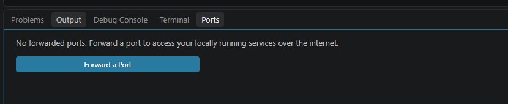

Click **Forward a Port** and enter `8000` (or whatever port you used above). VS Code generates a tunnel URL for it.

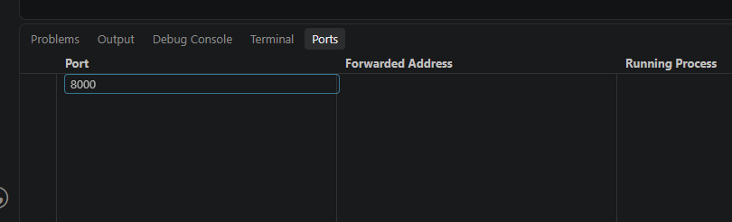

**Make it public** - at least while you're testing. Right-click the forwarded port and set **Port Visibility** to **Public**. Dev Tunnels default to **Private**, and a private tunnel silently returns a `403` on every call from Copilot Studio, because Copilot Studio can't complete the tunnel's own private sign-in handshake.

Copy the generated URL (something like `https://<random-id>-8000.<region>.devtunnels.ms`) and add `/mcp` to the end of it.

As a quick sanity check before touching Copilot Studio at all, paste that full URL straight into a browser tab. A JSON response saying `"Unauthorized"` is actually the *correct* result here - it just confirms the tunnel and server are both alive; you haven't sent the token yet.

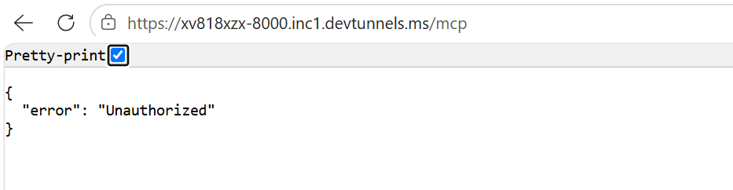

## Part 3 - Set up the agent in Copilot Studio

### Choose the right harness when you create the agent

Copilot Studio currently offers a few different harnesses to build on, and this choice matters a lot for a scenario like this one. Choose the **GitHub Copilot harness** rather than the Standard one - it's the harness Microsoft built specifically for reasoning-heavy, multi-step work: interpreting a goal, planning, calling several tools in sequence, checking the results, and adjusting if something fails. That's exactly the shape of what you'll see in Part 4 - inspect, ask, plan, build. On the Standard harness, the same request is more likely to stall or time out partway through a longer tool chain, since it's built around simpler, more predictable topic flows rather than open-ended multi-tool reasoning.

(If you do stay on the Standard harness for other reasons, make sure **Generative orchestration** is turned on under **Settings → Generative AI** - MCP tools won't even appear as an option otherwise.)

One thing worth knowing upfront: agents on the GitHub Copilot harness use usage-based Copilot Credits for building, testing, and running - worth keeping in mind if you're experimenting freely.

### Add the MCP server as a tool

In your agent, go to **Tools → Add a tool → New tool → Model Context Protocol**, and paste in your tunnel URL from Part 2 (ending in `/mcp`) as the server URL.

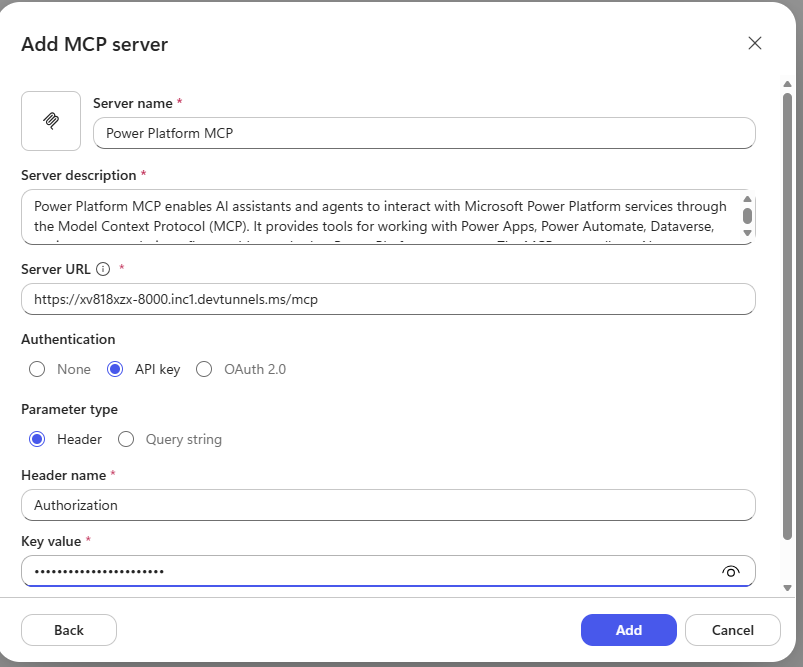

Under **Authentication**, choose **API key**, set the **Parameter type** to **Header**, the **Header name** to `Authorization`, and paste your token from Part 2 as the value - typically in the form `Bearer <your-token>`.

Once it's added, open the tool again and check its **Tools** tab - you should see the individual tools (`sign_in`, `list_flows`, `get_flow`, and so on) each with their own toggle.

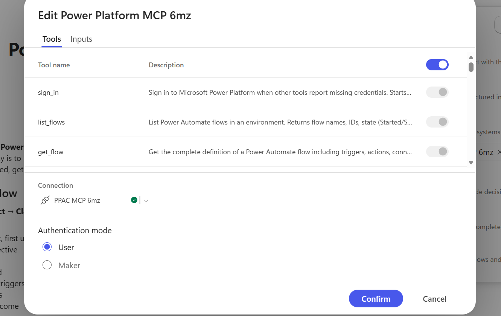

**Be selective here.** Copilot Studio's orchestrator can handle a maximum of 128 tools per agent, and Microsoft's own guidance recommends keeping it closer to 25-30 for the best results - this server alone exposes far more than that. Turn on only the tool groups your agent actually needs (for example, Power Automate and Dataverse for the flow-building scenario in Part 4) rather than flipping every toggle on.

### Give it a sample instruction

Under the agent's **Instructions**, it helps to explicitly tell it *how* to behave before it touches anything - otherwise it may just go ahead and create things without checking first. A short instruction set along these lines works well:

```
You are a Power Platform assistant working through Copilot Studio.

Before creating, editing, or deleting anything:
1. Review the request - understand the goal, the data involved, and what
   should trigger it.
2. Inspect the environment first - check whether the tables, flows, and
   connections you'd need already exist. Reuse what's there; never
   recreate blindly.
3. Ask only the questions that would actually change the design - skip
   anything you can reasonably assume, and say what you assumed.
4. Propose a short plan - what you'll create, what you'll reuse, any
   manual steps (like signing in to a new connection), and any
   limitations.
5. Wait for an explicit "GO" before you create, edit, or delete anything.

After building:
- Re-check what you actually created, not just what you configured.
- Report back plainly: what was built, any manual steps still needed,
  and anything that didn't go according to plan.

Golden rule: inspect first, plan clearly, get a "GO," build only what's
required, then report honestly.
```

You'll see exactly this pattern play out in Part 4.

### Restarting after a break

Both the local server process and the Dev Tunnel die the moment you sleep your laptop, reboot, or close VS Code - neither survives on its own. The good news: starting the server on the *same port* and re-forwarding it produces the *same tunnel URL*, so you don't need to go back and re-paste anything in Copilot Studio. Each new session, it's just: reopen PowerShell, run `powerautomate-mcp --http --port 8000` again, re-forward port 8000 in VS Code.

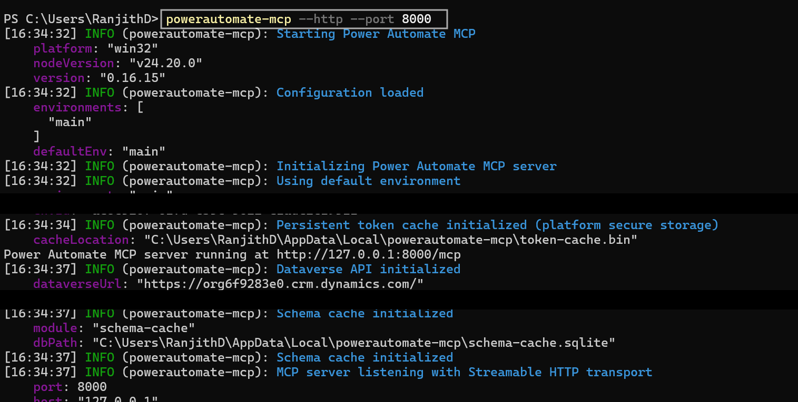

### Before you test

Test in a **non-production environment**, and stick with one until you're comfortable with how the agent behaves - this ties back to the environment you picked in Part 1's Step 3. And where Copilot Studio lets you choose the underlying model, favour a stronger, reasoning-capable one over the fastest default; a task that inspects, asks questions, plans, and only then builds benefits from more reasoning depth than a quick-response model is built for.

## Part 4 - Seeing it actually build something

Here's exactly what it looks like end to end, once the tool is live.

**1. Describe what you want, in plain English, in the agent's chat:**

> *"Whenever a new customer is added in Dataverse table, I want an email to be sent to the sales team letting them know that a new customer has been registered. The email should include the customer's name and email address."*

Feel free to use this exact prompt to try it yourself the first time.

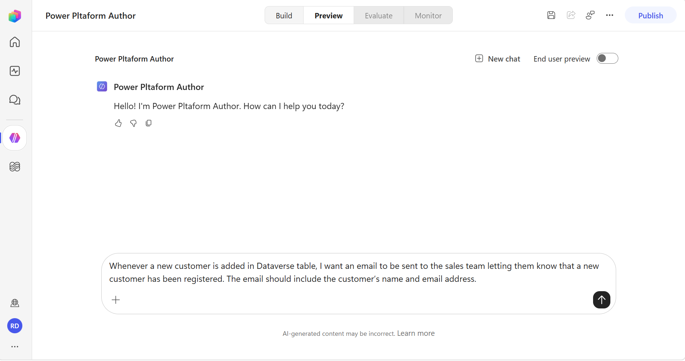

**2. It inspects what already exists first** - whether a "Customer" table exists, what flows and connections are already there. It doesn't assume, and it doesn't guess:

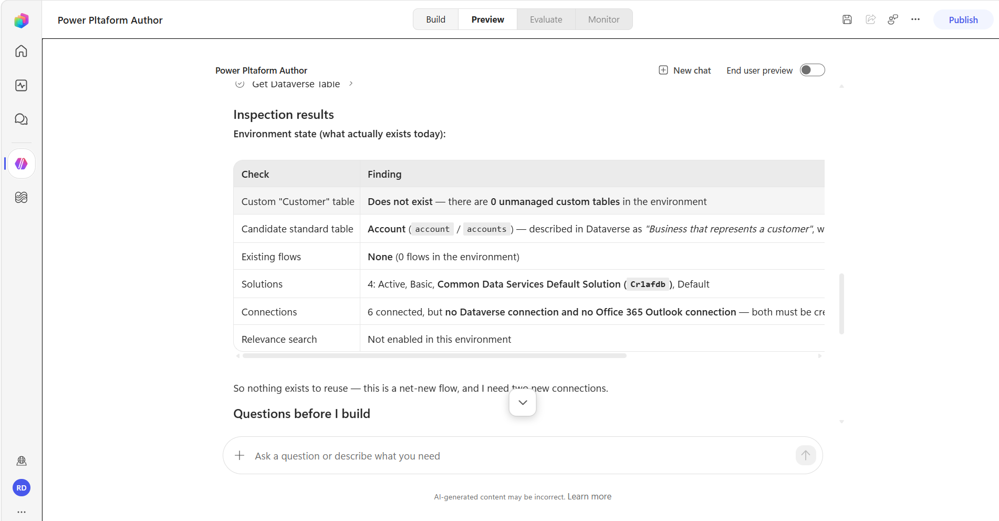

**3. It asks the questions that actually matter, and proposes a plan alongside them:**

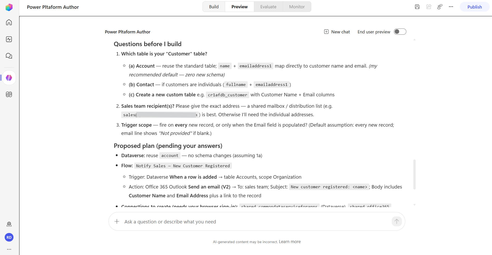

**4. It waits for an explicit "GO" before creating anything:**

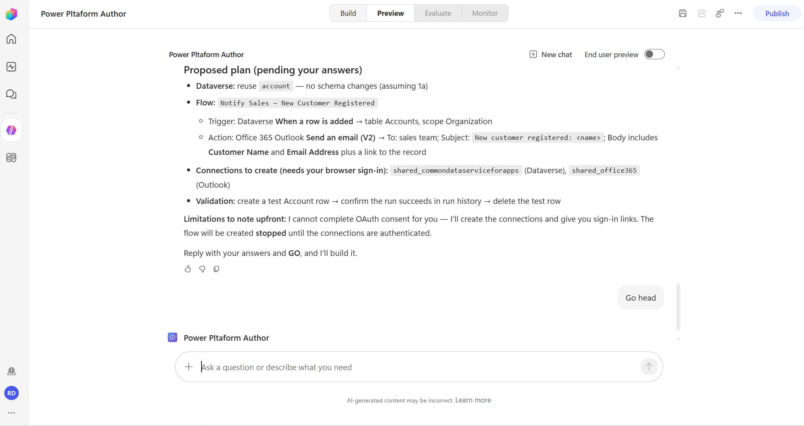

**5. Once confirmed, it builds - and the flow shows up in Power Automate, ready to run:**

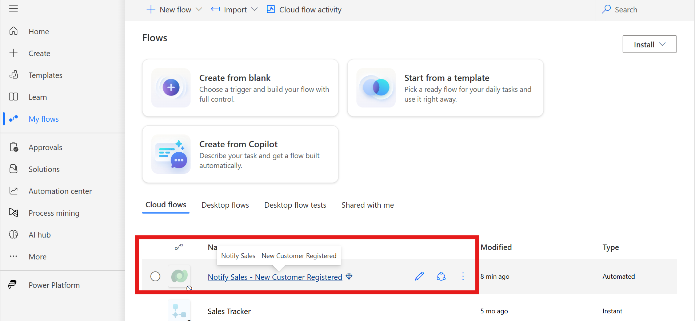

No flow designer, no manually wiring up a trigger and an action - a conversation, a plan you can review, and a go-ahead.

## Resources

- Power Platform MCP repository: [rcb0727/powerplatform-mcp-docs](https://github.com/rcb0727/powerplatform-mcp-docs) - full setup guide, changelog, and the complete tool reference.

