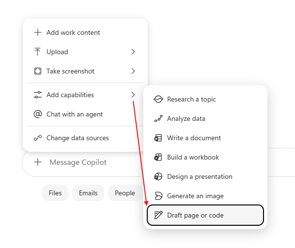
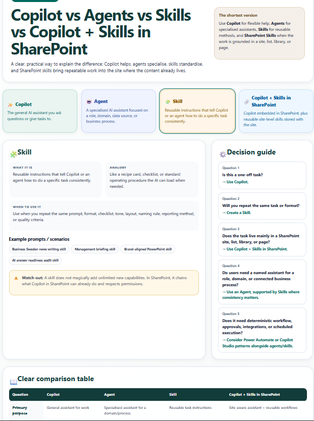
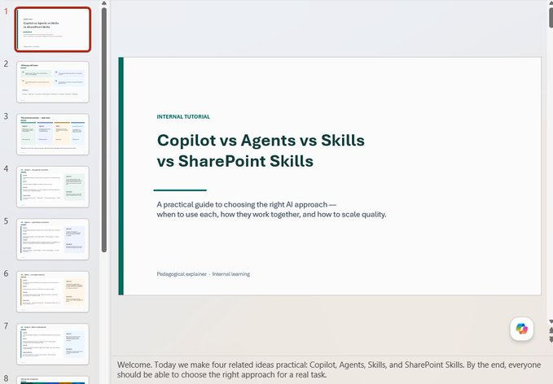
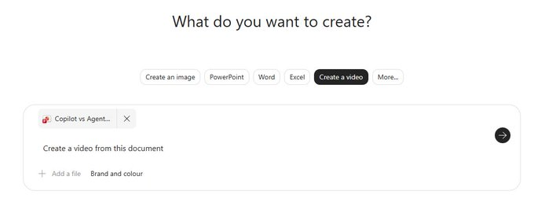
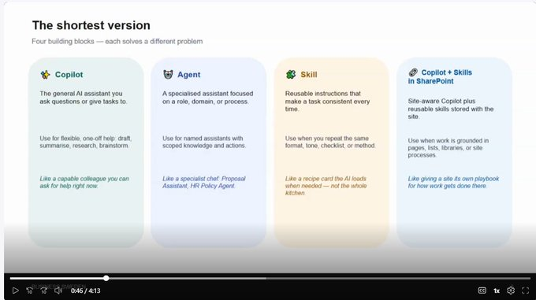
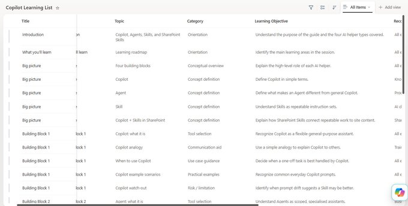
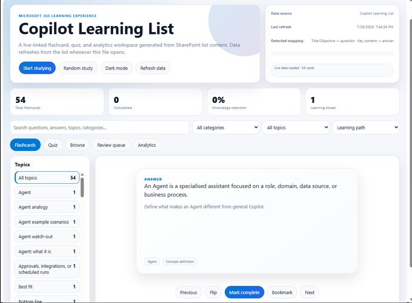

## From one prompt to a full learning experience

A colleague asked me the other day:

“What exactly is the difference between Copilot, Agents, Skills, and Copilot + Skills in SharePoint? Can you make a one page explainer? Explain what and when to use each. And show when and why Skills are useful.”

Fair question. The language is moving faster than most of us can keep up with.

So I wrote a prompt to Copilot, read the response and thought “this is useful… but what if it could become more than text?”

Not just an answer. Not just a slide.

But a complete, interactive learning journey that people can actually use, update, and enjoy.

That’s what these two workflows show.

With Copilot, a single idea didn’t stop at content. It became a living learning experience.

## The real shift

Most of us still treat AI as a faster way to produce the next document or slide. But the bigger opportunity is moving from idea → structure → content → experience with far less friction.

Here’s what one prompt turned into:

- An interactive HTML dashboard
- A full PowerPoint slide deck
- A tutorial-style video
- A structured SharePoint learning list
- A live flashcard-and-quiz dashboard connected directly to that list

The value isn’t only speed. It’s that the content stays reusable, easy to update, and more engaging.

## Workflow 1: From prompt to tutorial video

It started with a prompt to Copilot: compare Copilot, Agents, Skills, and Copilot with SharePoint. I added the draft with page capability when prompting.

Copilot didn’t just explain the concepts. It generated a full interactive HTML dashboard.

That dashboard became the source material for PowerPoint. Copilot in PowerPoint turned it into a complete slide deck.

The same deck went into Copilot Create and came out as a polished tutorial video.

One idea. Four formats. Almost no starting-from-scratch work.

You get a structured explanation, an interactive view, a presentation, and a video — all flowing from the same starting prompt.

## Workflow 2: From slide deck to live SharePoint learning experience

The slide deck didn’t stop there.

Copilot in SharePoint turned the tutorial material into a structured learning list — with clear modules and topic breakdowns.

Then came the part that makes it stick.

This is new, just fresh out of the SharePoint factory, today!

Copilot created a live-linked HTML dashboard connected directly to that SharePoint list. The dashboard presents the content as flashcards and quizzes.

Because it’s live-linked, any update you make in the list shows up in the dashboard when you refresh.

The SharePoint list becomes the learning content back-end. The HTML dashboard becomes the engaging front-end.

Update once. Learners see the refreshed experience. You see that "Refresh data" button? 👇

## Why this matters for how we create learning

These two workflows show something bigger than “AI is fast.”

You can start with a simple prompt and quickly create:

- Interactive dashboards
- Slide decks
- Tutorial videos
- Structured learning lists
- Flashcard-style experiences
- Quiz dashboards
- Live-connected material in SharePoint

The content stays reusable. It stays easy to update. And it feels far more engaging for the people who need to learn it.

Instead of rebuilding every asset from scratch, you transform one idea across formats — and keep the source of truth in one place.

## The simple takeaway

This is about showing how fast and efficiently we can go from an idea to interactive, engaging learning materials using Copilot.

In one workflow, a prompt becomes an HTML dashboard, then a PowerPoint deck, and finally a tutorial video.

In another, that same material becomes a SharePoint learning list and a live, flashcard-style quiz dashboard connected directly to the list.

Together they show what’s possible when you let Copilot help you move across formats instead of starting over every time.

From one prompt to a full learning experience.
