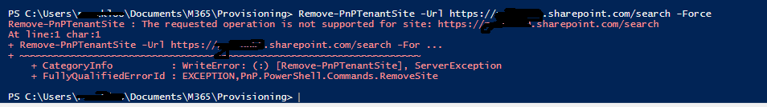
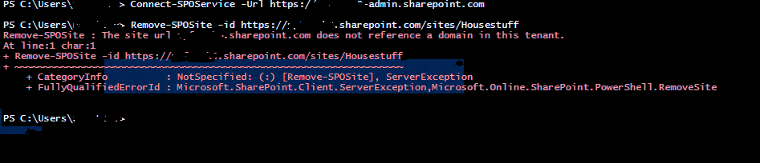

It is possible to change the SharePoint domain name after an organisation has gone through a rebranding, acquisition or needs to change to a more appropriate name [Change your SharePoint domain name (preview)](https://learn.microsoft.com/sharepoint/change-your-sharepoint-domain-name). The domain name was changed end of last year in November 2021 which created subsequent redirect sites for all existing sites and personal sites with more than 500 redirect sites. It coincided with setting up a M365 SAAS backup up with a third party to offer more data protection. However it was not working with redirect sites to the old domain prompting the removal of these redirect sites. Redirect sites [Manage site redirects (https://learn.microsoft.com/sharepoint/manage-site-redirects)] can be removed using PowerShell in a similar way deleting a normal site. However what seemed a simple task proved quite challenging taking months to resolve involving Microsoft through few cases raised to address individual scenerios.

## Things to consider

### 1. Some protected sites can not be deleted even they are redirect sites

#### 1.1 Redirect site for admin Site

It was not possible to delete redirect site for admin site with error message "Remove-PnPTenantSite : User is not authorized.". The error is misleading despite running the script as SharePoint Administrator or Global Admin

```powershell
PS C:\Windows\system32> Remove-PnPTenantSite -Url https://<oldDomain>-admin.sharepoint.com/ -Force
Remove-PnPTenantSite : User is not authorized.
At line:1 char:1
+ Remove-PnPTenantSite -Url https://<oldDomain>-admin.sharepoint.com/ -For ...
+ ~~~~~~~~~~~~~~~~~~~~~~~~~~~~~~~~~~~~~~~~~~~~~~~~~~~~~~~~~~~~~~~~~~~~~
    + CategoryInfo          : WriteError: (:) [Remove-PnPTenantSite], ServerException
    + FullyQualifiedErrorId : EXCEPTION,PnP.PowerShell.Commands.RemoveSite
PS C:\Windows\system32>
```

Microsoft deleted the redirect site for admin from a case which was raised for that specific purpose.

#### 1.2 Redirect site for search site

Attempt to delete redirect site for search `https://<oldDomain>.sharepoint.com/search` throws error message

```The requested operation is not supported for site: https://<oldDomain>.sharepoint.com/search```



Microsoft deleted the redirect site for search from another case raised for that purpose.

### 2. Don't delete the root redirect site prior to deletion of all corresponding sites

 The root redirect site https://<oldDomain>.sharepoint.com was deleted first as the following script to retrieve redirect sites returns the root redirect site first.
   ``` $redirectSites = Get-PnPTenantSite -Template RedirectSite#0 -IncludeOneDriveSites -Filter {Url -like  https://<olddomain>  }```
 Hence the subsequent deletions of the rest of the redirect sites failed with message "The site url <oldDomain>-my.sharepoint.com does not reference a domain in this tenant."



Microsoft recreated the root redirect site through a separate case to enable deletion of all redirect sites.

The script using PnP PowerShell used to delete redirect sites pointing to the old domain is as below

```powershell

$AdminCenterURL=https://<newdomain>-admin.sharepoint.com/

#Connect to SharePoint Online
Connect-PnPOnline -Url $AdminCenterURL -Interactive

$redirectSites = Get-PnPTenantSite -Template RedirectSite#0 -IncludeOneDriveSites -Filter {Url -like '*//<olddomain>*'}  | Where -Property Url -NotIn (https://<olddomain>-my.sharepoint.com/, https://<olddomain>-admin.sharepoint.com/,https://<olddomain>.sharepoint.com/,https://<oldDomain>.sharepoint.com/search)

$redirectSites | Format-Table Title, Url, Template  | out-file "c:\temp\redirectSites.csv"

Read-Host -Prompt "Press Enter to start deleting (CTRL + C to exit)"

$redirectSites | ForEach-Object{

 Write-Output ("Deleting Site " + $_.Url )

 Try{
  Remove-PnPTenantSite -Url $_.Url -Force
  Write-Output ("Deleted Site " + $_.Url )
  $_ | Add-Member -Name "Deleted?" -MemberType NoteProperty -Value "yes" -Force
 }

 Catch{
  Write-Host $_.Exception
  $_ | Add-Member -Name "Deleted?" -MemberType NoteProperty -Value "no" -Force
 }
}

$redirectSites | Format-Table Title, Url, Template,Deleted?  | out-file "c:\temp\deletedRedirectSites.csv"
```
