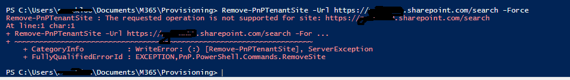
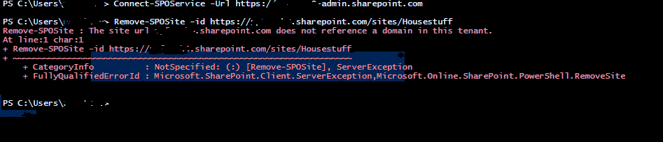

It is possible to change the SharePoint domain name after an organisation has gone through a rebranding, acquisition or needs to change to a more appropriate name [Change your SharePoint domain name (preview)](https://docs.microsoft.com/en-us/sharepoint/change-your-sharepoint-domain-name). Before migrating the all SharePoint 2013 applications to SharePoint Online, we changed the domain name end of last year in November 2021 which created a subsequent redirect site for all existing sites. There was a business need to remove these redirect sites to prevent failures in a backup solution. Redirect sites [Manage site redirects (https://docs.microsoft.com/en-us/sharepoint/manage-site-redirects)] can be removed using PowerShell in a similar way deleting a normal site.

Things to be mindful

## 1. Some protected sites can not be deleted even they are redirect sites

### 1.1 Redirect site for admin Site
Unable to delete redirect site for admin site with error message "Remove-PnPTenantSite : User is not authorized.". The error is misleading despite running the script as SharePoint Administrator or Global Admin

'''
PS C:\Windows\system32> Remove-PnPTenantSite -Url https://<newDomain>-admin.sharepoint.com/ -Force
Remove-PnPTenantSite : User is not authorized.
At line:1 char:1
+ Remove-PnPTenantSite -Url https://<oldDomain>-admin.sharepoint.com/ -For ...
+ ~~~~~~~~~~~~~~~~~~~~~~~~~~~~~~~~~~~~~~~~~~~~~~~~~~~~~~~~~~~~~~~~~~~~~
    + CategoryInfo          : WriteError: (:) [Remove-PnPTenantSite], ServerException
    + FullyQualifiedErrorId : EXCEPTION,PnP.PowerShell.Commands.RemoveSite
PS C:\Windows\system32>
 
''' 
Microsoft deleted the redirect site for admin from a case which was raised for that purpose.

### 1.2 Redirect site for search site

Attempt to delete redirect site for search https://<oldDomain>.sharepoint.com/search throws error message

"The requested operation is not supported for site: https://<oldDomain>.sharepoint.com/search “

Microsoft deleted the redirect site for search from a case which was raised for that purpose.

## 2. Don't delete the root redirect site prior to deletion of all corresponding sites

 The root redirect site https://<oldDomain>.sharepoint.com was deleted first as the script to retrieve redirect sites return the root redirect site first and hence the subsequent deletions of the rest of the redirect sites failed with message "The site url <oldDomain>-my.sharepoint.com does not reference a domain in this tenant." 

Microsoft recreated the root redirect site by raising a case to enable deletion of all redirect sites.
 

'''

$AdminCenterURL=https://ppfonline-admin.sharepoint.com/

 

#Connect to SharePoint Online

Connect-PnPOnline -Url $AdminCenterURL -Interactive

 

#$redirectSites = Get-PnPTenantSite -Template RedirectSite#0 -IncludeOneDriveSites -Filter {Url -like  https://ppfcouk0  }

$redirectSites = Get-PnPTenantSite -Template RedirectSite#0 -IncludeOneDriveSites -Filter {Url -like '*//ppfcouk0*'}  | Where -Property Url -NotIn (https://ppfcouk0-my.sharepoint.com/, https://ppfcouk0-admin.sharepoint.com/,https://ppfcouk0.sharepoint.com/)

 

$redirectSites | Format-Table Title, Url, Template  | out-file "c:\temp\redirectSites.csv"

 

Read-Host -Prompt "Press Enter to start deleting (CTRL + C to exit)"

 

$redirectSites | ForEach-Object{

 Write-Output ("Deleting Site " + $_.Url )

 Try{

  Remove-PnPTenantSite -Url $_.Url -Force

  Write-Output ("Deleted Site " + $_.Url )

  $_ | Add-Member -Name "Deleted?" -MemberType NoteProperty -Value "yes" -Force

 }

 Catch{

  Write-Host $_.Exception

  $_ | Add-Member -Name "Deleted?" -MemberType NoteProperty -Value "no" -Force

 }

}

$redirectSites | Format-Table Title, Url, Template,Deleted?  | out-file "c:\temp\deletedRedirectSites.csv"

...