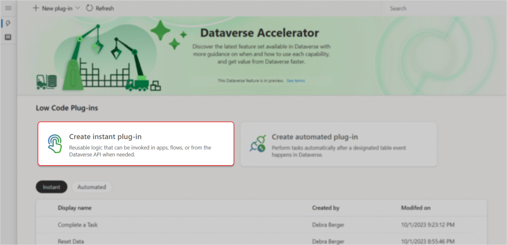
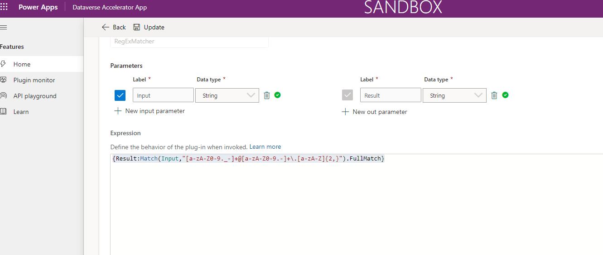
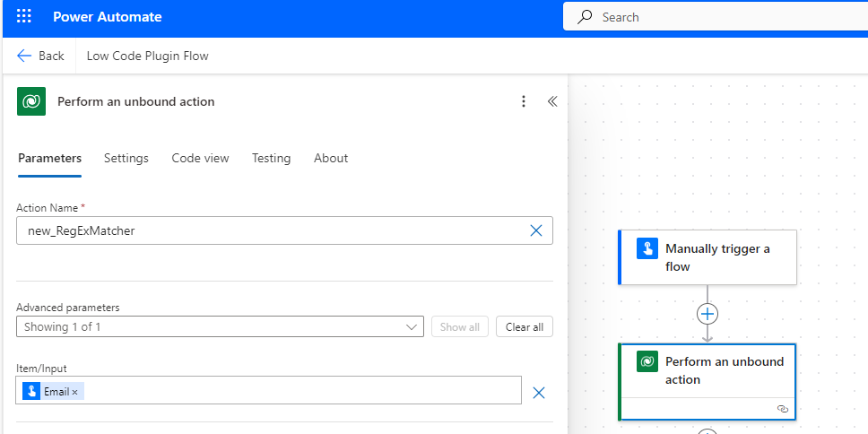

## Introduction

Currently, there is no direct support for regular expressions in Cloud flows. However, Power Automate, combined with Dataverse low-code plugins, offers a powerful way to streamline processes. In this article, we’ll explore how to leverage regular expressions (regex) in Power Automate using the IsMatch, Match, and MatchAll functions in Power Fx and plugins.

Regular expressions are a powerful tool for pattern matching and text manipulation. With Dataverse low-code plugins, you can now use regex in Power Automate, making it easier to automate complex text processing tasks.

## 1. Prerequisites for Creating a Low-Code Plugin in Dataverse

* **Role Requirements**: You need to have the System Administrator or System Customizer role in the Power Platform environment.
* **Dataverse Accelerator App:** Ensure the Dataverse Accelerator App is installed in your environment. If not, install it from AppSource under Dynamics 365 apps

## 2. Creating an Instant Low-Code Plugin

* **Launch the Dataverse Accelerator App:** Open the app and select the “Create instant plug-in” card.



* Display Name: Enter “RegExEmailMatcher”.
* Input Parameter: Add a new input parameter labeled “Input” with the data type “String”.
* Output Parameter: Add a new output parameter labeled “Result” with the data type “String”.
* Power Fx Expression: Enter the following expression in the Expression editor:

```markdown
{Result:Match(Input,"[a-zA-Z0-9._-]+@[a-zA-Z0-9.-]+\.[a-zA-Z]{2,}").FullMatch}
```
This expression assigns the result of the Match function to the output parameter “Result”. The Match function extracts the email ID from the input.

* **Advanced Options**: Expand the Advanced options to modify the solution, scope, or description as needed.
* **Save:** Click “Save” to create the plugin



## 3. Integrate with Power Automate Cloud Flow

* **Create an Instant Cloud Flow:** Open Power Automate and create a new instant cloud flow.
* **Perform an Unbound Action:** Use the “Perform an unbound action” step in the Dataverse connector to call your plugin.
* **Pass Inputs:** Provide the necessary inputs to the plugin.
* **Run the Flow:** Save the flow and run it to capture the outputs.



## 4. Real-World Use Cases

* **Data Validation:** Automatically validate user inputs in forms.
* **Text Extraction:** Extract specific patterns from large text data.

**Conclusion:** By integrating Low Code Plugins with Power Automate, you can significantly enhance your automation capabilities. This approach not only saves time but also reduces errors in text processing tasks. Start exploring the power of low-code plugins in your automation workflows today!