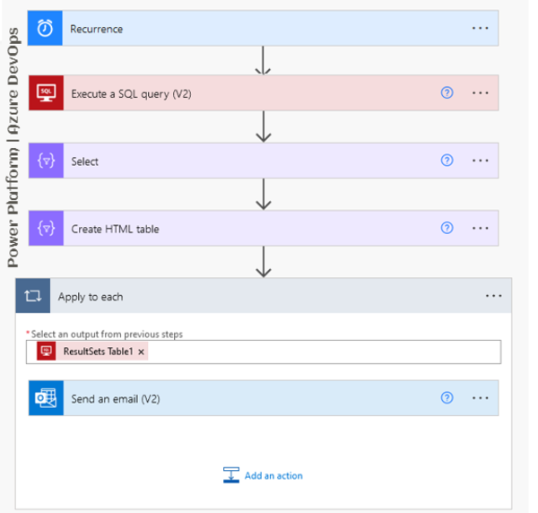
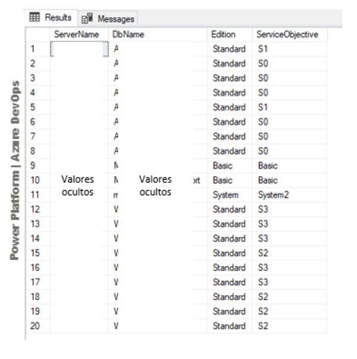
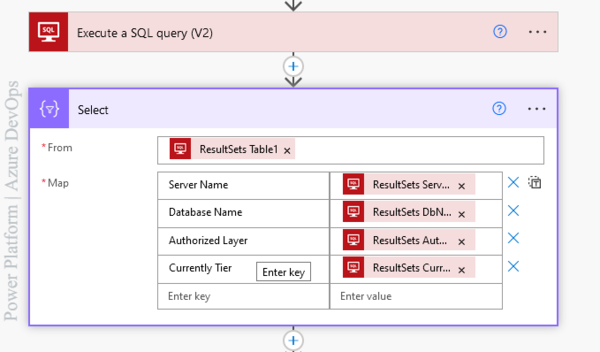
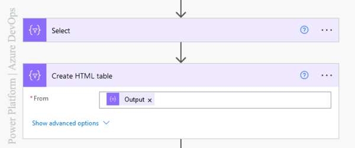
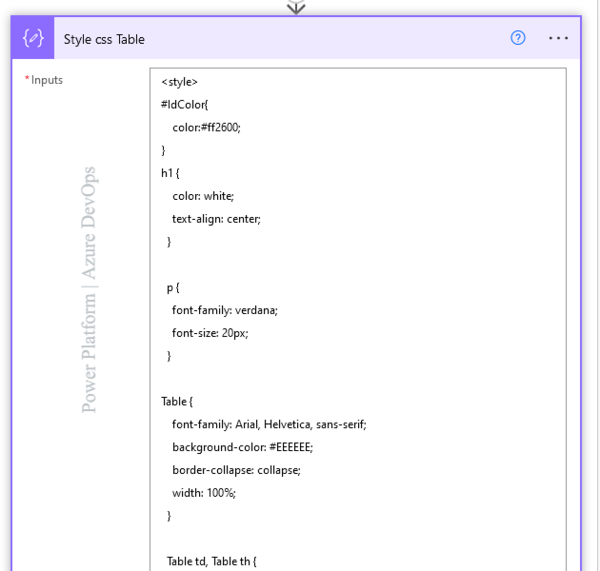
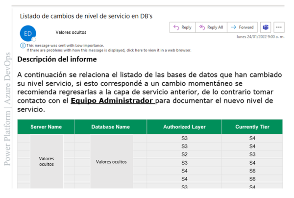

## How to generate an HTML table with a SQL Server query and send it from Outlook using Power Platform

We will make use of the Premium SQL Server connector and the standard Outlook connector.

We will use objects of type compose, timer, Apply to each these not being cataloged as connectors will have a role in the construction of this process.

Flow will be a (Flow on a schedule) in short words the process will have a responsibility to run due to a schedule that the creator of the process will assign to it.

**Why does this Process?**

Imagine that your cloud provider for databases is Microsoft Azure; There you have the responsibility to track the level of service with which those databases are provisioned.

It depends on the amount of resources with which you make that provisioning and will be reflected in the monthly billing to the organization.

You can then track the number of databases.  You move in the Microsoft ecosystem and you can make use of its tools that will allow you to better automate some processes.

> Site reliability engineers create a bridge between development and operations by applying a software engineering mindset to system administration topics. - **Opensource.com**

**How does this process work?**

Remember there are a lot of databases from which you must know day by day the changes with respect to their level of service.

This process reads information (Server Name, Database Name, Service Level Type, and Service Tier Value) stored in an Azure SQL database.

**If you ask yourself here, how did those values get there?**

It is easy enought, there is another pre-process that through Power Platform in the action SQL Server Premium / Insert Row connector, runs a script in the master database.

`SELECT @@SERVERNAME AS 'Server_Name', d.Name, slo.edition, slo.service_objective,` `slo.elastic_pool_name  ` 
`FROM sys.databases d`
`JOIN sys.database_service_objectives slo`
`ON d.database_id = slo.database_id`

Running the above script executes a record-by-record insertion into a table (Image No. 2) and converts it to historical information for reference. This would be the **1st step.**

You manage a lot of SQL servers which contain many databases that you think if in **step No. 2** you create the same old process to insert the service levels, but in a new table which would be considered mirrored from the other.

**Why does 2 Tables for this process?**

By having both tables on the same SQL Server, it is more comfortable for a SQL Query to extract the required information.

Also, something known as create external data source (Transact-SQL) where you can create an external data source to query using SQL Server, Azure SQL Database.

This mirror table has a different responsibility, which is to store the changing information of service levels every certain number of hours.

We have the two (02) automatic processes with different responsibilities, but with the same objective, to serve a third process so that it is responsible for making that comparison.

**Step No. 3** the use of the Premium SQL Server connector in the Execute SQL query (V2) action again plays a very important role.

`SELECT A.ServerName, A.DbName, A.ServiceObjective AS AuthorizedLayer,` `B.ServiceObjective AS CurrentlyTier FROM [xxx].[tblxxxxx] AS A`
`INNER JOIN [xxxx].[tmp_tblxxxxxxxx] AS B `
`ON A.DbName = B.DbName`
`AND A.ServerName = B.ServerName`
`AND A.ServiceObjective <> B.ServiceObjective`
`ORDER BY A.ServerName ASC`

**What does that script do?**

listing the different values regarding the service level in two (02) SQL tables (historical and mirror) or **steps Nro. 1 and 2**

**Step Nro. 4** we use the compose object of type Select of Power Automate where as a source the ResultSets Table1 parameter that is in the output of the execution of the query of the SQL Server connector is passed, That response is encapsulated in an array which has values.

**Why do you use that select object?**

To be able to assign a custom name to the column and give the order to the data according to my needed.

**Step Nro. 5** now let's list that data within an HTML table, here we can make equal use of the compose of type Create HTML Table which only expects a single source of type array.

For us that array is contained in the output of the select.

When you inspect the execution of the compose of type Create HTML Table, you see the basic HTML structure of a table without any styles.

`"body": "<table><thead><tr><th>Server Name</th><th>Database Name</th><th>Authorized Layer</th><th>Currently Tier</th></tr></thead><tbody>`

Now imagine, put styles to that table according to your corporate image.

**Step Nro. 6** let's make use of a new compose object in the input section in the middle of the tag `` inserts the CSS code

**Step Nro. 7** It's time to use our properly populated table with information to share via Outlook and contribute to decision-making regarding cloud infrastructure.

Here use the standard connector Outlook look for a good subject for your email and in the body section enable the HTML option and paste this code.

 ` <!DOCTYPE html>`
 ` <html lang="es">`
  `  <head>`
      `<meta charset="utf-8" />`
    `  <title>Hola Mundo!</title>`
    `</head>`
   ` <body>`
      `<h1>Power Platform | Azure DevOps!</h1>`
    `</body>`
  `</html>`

  Then call the compose that contains your styles written in CSS and the compose that contains the table within the body section.

  