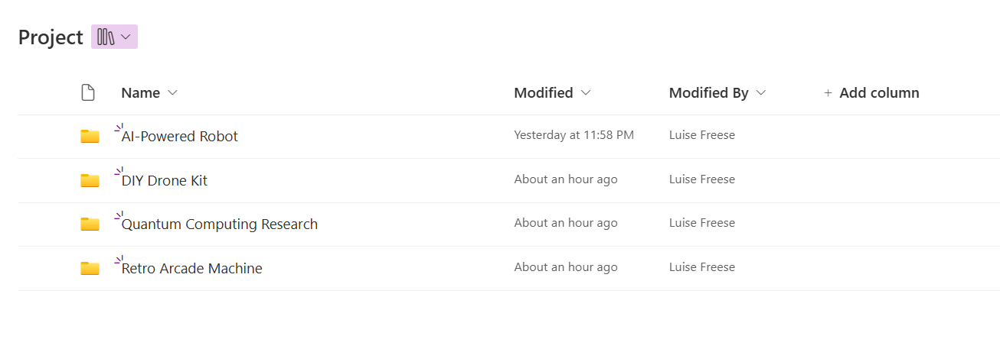

## Use Case

Recently, someone asked me if it was possible to utilize the SharePoint integration in Dataverse not only from a model-driven app, but also from a canvas app. Challenge accepted!

Tl;dr: yes, it is possible and it's easier than you might think!


## Some prep work

First, we will need to do some prep work.

1. Setup SharePoint integration in Dataverse - here is a [good blog post by Matthew Devaney](https://www.matthewdevaney.com/how-to-setup-sharepoint-integration-model-driven-power-apps/) that will guide you
2. Make sure that the SharePoint folders that get created, do not append the record name of the Dataverse record with some GUID (Microsoft does that so that there are no duplicates, if you for example name the record like a customer and then have 5 customers with name `Miller`.) You can do this with an [amazing tool](https://github.com/seanmcne/OrgDbOrgSettings) by Sean McNellis, [Shaun Wilkinson](https://spandcrm.com/2016/06/24/removing-guids-from-folders-in-sharepoint-created-by-crm-2013/) describes how to do this.
3. We will need the **SiteId** and **DriveId** of our SharePoint library. You can get those using [Graph Explorer](aka.ms/ge)

## The canvas app

At a minimum, you will need to have 3 things

1. a connector, that does the heavy lifting calling the right endpoint in the Graph API to upload a file to a specific folder - we will use the **Office 365 Groups** connector
2. an attachment control (you get this from a form, connect this to a random SharePoint list, cut out the **DatacardValue** control, rename to **Attachments** and delete the rest of the form)
3. a button that will take care of the action.

I also added a table/gallery so that I can choose the record to which I want to associate a file.

It looks like this:


### Table/Gallery

* Add the Dataverse table to your app and connect your table/gallery to it
* Add the **Office 365 Groups** connector
* In the **OnSelect** of the table, put

```powerappsfl

Set(varDriveId, "<DriveId goes in here>"); 
Set(varSiteId, "<SiteID goes in here>"); 
Set(varFolder, Table1.Selected.Name)
```

### Button

* Add a button
* Put in the **OnSelect**

```powerappsfl

ForAll(
    Attachments.Attachments,
    Office365Groups.HttpRequest(
        "https://graph.microsoft.com/v1.0/sites/" & varSiteId & "/drives/" & varDriveId & "/root:/" & varFolder & "/" & ThisRecord.Name & ":/content",
        "PUT",
        ThisRecord.Value
    )
);
Reset(Attachments);

```

This will upload all your files that you select with the **Attachments** control to a folder that has the same **Name** like the associated record that we selected in the table/gallery. If the folder does not exist yet, it will be created, if it already exists, then the file will be only uploaded into the folder.

As a result, regardless if we use the canvas app or the model-driven app to upload files, they all get associated with the correct record in Dataverse.



If you'd like to know how to display previews from files on SharePoint in the canvas app, [here is a neat blog post by Diana Birkelbach](https://dianabirkelbach.wordpress.com/2023/08/31/recursive-retrieval-of-sharepoint-documents-in-canvas-apps-using-the-graphapi-connector-and-powerfx/)

## Conclusion

Canvas app can work nicely in addition to a model driven app with SharePoint integration, powered by the Office 365 Groups connector. Let me know what you think!
