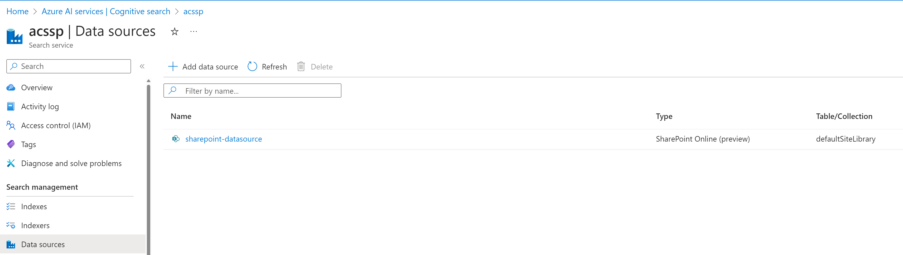
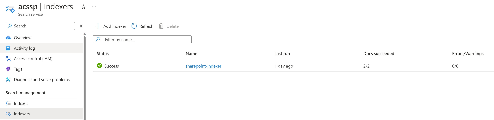
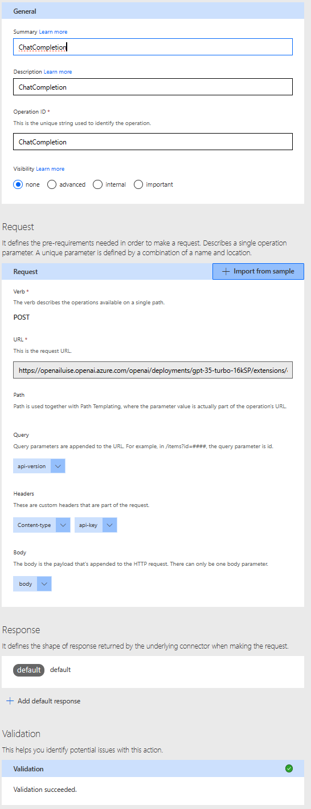
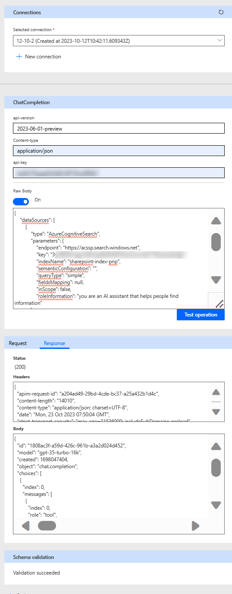

## tl;dr

We can index documents from a SharePoint library with Azure Cognitive Search and then use an Azure OpenAI model to query the data. Using a custom connector, we can bring this power into Power Apps.


## Prerequisites

* Have documents (*.docx, *.pdf) in a SharePoint library
* Azure Cognitive Search service (Basic or Standard tier)

## Preparations

* Note down the URL of the Site your library lives in
* Note down the URL and the Admin Key of your Azure Cognitive Search Service
* Turn on **System-Assigned Managed Identity** in your Azure Cognitive Search Service
* Create an Entra Id app registration with the following parameters:
  * single tenant
  * Microsoft Graph API delegated permissions (don't forget to grant admin consent) for
    * Files.Read.All
    * Sites.Read.All
  * Mobile and desktop applications
    * enable `https://login.microsoftonline.com/common/oauth2/nativeclient`
    💡Note down the App Id.

## Connect your SharePoint library with Azure Cognitive Search

### Create a Data Source with the Azure Cognitive Search Preview REST API

We will hop over to Postman to create a new data source for Azure Cognitive search using the REST API (it is still in preview.)

* **POST** to `https://<name-of-your Azure Cognitive Search service>.search.windows.net/datasources?api-version=2023-07-01-Preview`
* Params:
  * **api-version**: `2023-07-01-Preview`
* Headers:
  * **Content-Type**: `application/json`
  * **api**-key: `<the Admin key of your Azure Cognitive Search Service>`
* Body (Json):

```json
{
    "name": "sharepoint-datasource",
    "type": "sharepoint",
    "credentials": {
        "connectionString": "SharePointOnlineEndpoint=<your SharePoint Site URL>;ApplicationId=<your App Id>"
    },
    "container": {
        "name": "defaultSiteLibrary",
        "query": null
    }
}
```

This will return a `201` response, indicating that your datasource was created. You can check this in the Azure portal



### Create your Index

Let's now leverage metadata of your document to enhance your search experience. This as well is done by using the REST API. We will again do this in Postman:

* **POST** to `https://<name-of-your Azure Cognitive Search service>.search.windows.net/indexes?api-version=2023-07-01-Preview`
* Params:
  * **api-version**: `2023-07-01-Preview`
* Headers:
  * **Content-Type**: `application/json`
  * **api**-key: `<the Admin key of your Azure Cognitive Search Service>`
* Body (Json):

```json
{
    "name" : "sharepoint-index",
    "fields": [
        { "name": "id", "type": "Edm.String", "key": true, "searchable": false },
        { "name": "metadata_spo_item_name", "type": "Edm.String", "key": false, "searchable": true, "filterable": false, "sortable": false, "facetable": false },
        { "name": "metadata_spo_item_path", "type": "Edm.String", "key": false, "searchable": false, "filterable": false, "sortable": false, "facetable": false },
        { "name": "metadata_spo_item_content_type", "type": "Edm.String", "key": false, "searchable": false, "filterable": true, "sortable": false, "facetable": true },
        { "name": "metadata_spo_item_last_modified", "type": "Edm.DateTimeOffset", "key": false, "searchable": false, "filterable": false, "sortable": true, "facetable": false },
        { "name": "metadata_spo_item_size", "type": "Edm.Int64", "key": false, "searchable": false, "filterable": false, "sortable": false, "facetable": false },
        { "name": "content", "type": "Edm.String", "searchable": true, "filterable": false, "sortable": false, "facetable": false }
    ]
}
```

Also this will return a `201`.

### Create your indexer

Additionally to that index, we want to create an indexer. It will later automate the indexing process from your SharePoint library to the Azure Cognitive Search service.

Once again, we do this in Postman. This is a two-step process as we first need to **POST** a **Create an indexer** request - which will run and run and run as it is waiting for us to log in. So we will run a second call, which to **GET** the indexer status. This will return a devicecode with which we can can sign in - Once we did that we can see that the call returns a `200`. After that, the **POST** will succeed and return a `201` as well.

So let's do this together:

#### Create an indexer request

* **POST** to `https://<name-of-your Azure Cognitive Search service>.search.windows.net/indexers?api-version=2023-07-01-Preview`
* Params:
  * **api-version**: `2023-07-01-Preview`
* Headers:
  * **Content-Type**: `application/json`
  * **api-key**: `<the Admin key of your Azure Cognitive Search Service>`
* Body (Json):

```json
{
    "name" : "sharepoint-indexer",
    "dataSourceName" : "sharepoint-datasource",
    "targetIndexName" : "sharepoint-index",
    "parameters": {
    "batchSize": null,
    "maxFailedItems": null,
    "maxFailedItemsPerBatch": null,
    "base64EncodeKeys": null,
    "configuration": {
        "indexedFileNameExtensions" : ".pdf, .docx",
        "excludedFileNameExtensions" : ".png, .jpg",
        "dataToExtract": "contentAndMetadata"
      }
    },
    "schedule" : { },
    "fieldMappings" : [
        { 
          "sourceFieldName" : "metadata_spo_site_library_item_id", 
          "targetFieldName" : "id", 
          "mappingFunction" : { 
            "name" : "base64Encode" 
          } 
         }    
    ]
}
```

Once you post this, it will - as explained, wait for you to log in.

#### Get indexer status

* **GET** to `https://<name-of-your Azure Cognitive Search service>.search.windows.net/indexers/sharepoint-indexer/status?api-version=2023-07-01-Preview`
* Params:
  * **api-version**: `2023-07-01-Preview`
* Headers:
  * **Content-Type**: `application/json`
  * **api**-key: `<the Admin key of your Azure Cognitive Search Service>`

No body needed :-)

This will return a response that contains an **errormessage**:

```json
{

            "errorMessage": "To sign in, use a web browser to open the page https://microsoft.com/devicelogin and enter the code LFXXXXXP to authenticate.\r\nTo sign in, use a web browser to open the page https://microsoft.com/devicelogin and enter the code LFXXXXXP to authenticate.",
}

```

Copy the code and open the link, then paste the code into the devicelogin popup. Once you are logged in, you can close that browser tab again.

Check now in the Azure portal that you do not only have an index, but also an indexer and documents indexed.



## Test your app in the Playground

The Azure OpenAI playground is a fabulous way to test and try out - so let's do this

* In the Playground, create a new deployment
* Select **Add your data** and then **Add a data source**
* Select the Azure Cognitive Search service, your Subscription its running in, and the index we just created. All of these will automagically 🪄 appear in the respective dropdown fields.
* Now proceed with the **index data field mapping** - where you select all fields to be **content**
* **Save and close**

You can now chat against your documents and ask the bot questions about it. By check/uncheck of the **Limit responses to your data content** you can determin whether you want the bot only to consider content from your documents or not.

You can now deploy this as a web app - Or you can walk with me some more steps and have that power in Power Apps or Power Automate

## Make the magic happen in Power Apps

To connect to this API from a Power Apps, we will need to create a custom connector.

Following the Custom Connector wizard at [make.powerapps.com](https://make.powerapps.com):

**General**
  
* **Host**: `<name-of-your-openai-service>.openai.azure.com`
* **Base URL**: `/openai/deployments/<name-of-your-deployment>`


**Security:**

* **Authentication type**: `API Key`
* **Parameter-label**: `api-key`
* **Parameter name**:  `api-key`
* **Parameter location**: `Header`


**Definition**

* General:
   * **Summary**: `ChatCompletion`
   * **Description**: `ChatCompletion`
   * **Operation ID**: `ChatCompletion`
  * Request URL: `https://<name-of-your-openai-service>.openai.azure.com/openai/deployments/<name-of-your-deployment>/chat/completions`

  * Body:

```json
  {
    "dataSources": [
        {
            "type": "AzureCognitiveSearch",
            "parameters": {
                "endpoint": "https://<name-of-your-Azure-Cognitive-Search-service>.search.windows.net",
                "key": "<your Azure Cognitive Search service Admin key>",
                "indexName": "sharepoint-index",
                "semanticConfiguration": "",
                "queryType": "simple",
                "fieldsMapping": null,
                "inScope": true,
                "roleInformation": "you are an AI assistant that helps people find information"
            }
        }
    ],
    "messages": [
        {
            "role": "user",
            "content": "What is the answer to life, universe, and everything?"
        }
    ],
    "deployment": "<name-of-your-deployment>",
    "temperature": 0,
    "top_p": 1,
    "max_tokens": 800,
    "stop": null,
    "stream": false
 }
```



**Test**

* Connection:
  * Create a new Connection, provide the API for your Azure Open Ai service as api-key.
  * Run your action, it should return a `200` response code and show a response to your question. Please note that with the **inScope** property you can limit the responses to just your documents.



Your connector is now ready 🚀

## Conclusion

With Azure Cognitive Search we can make files in SharePoint libraries accessible to be queried by Azure OpenAI. We can then create a custom connector om Power Platform to easily use this in Power Apps or Power Automate. 


What will you build with it?
