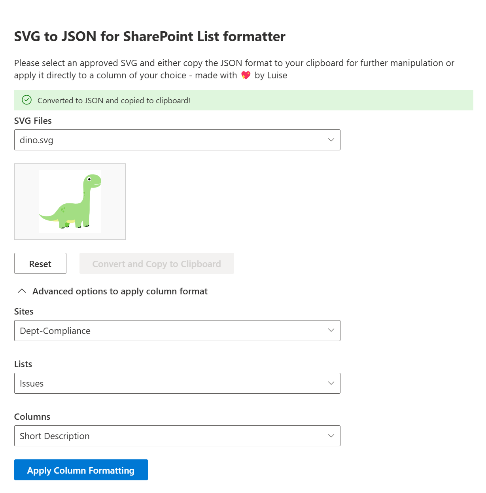

I promised, I’d improve my initial draft. So I want to address three things in here:

1. Using PnPjs
2. Splitting up a huge component in a parent component and child components
3. Leveling up with custom hooks

💡 This post is part of a series:

* [Building my first SharePoint Web Part with SharePoint Framework Toolkit- From Web App to Web Part](https://m365princess.com/blogs/spfx-1)
* 📌 you are here: [Improving a Web Part with PnP.js and React Webhooks](https://m365princess.com/blogs/spfx-2)
* Making a Web Part ready for the Sample Solution Gallery - *to be published soon*

First things first - here is an up-to-date screenshot so that you know what we are talking about!



Additionally to introducing a new features that allows users to not only select lists and their columns on the site the Web Part lives on, but also select a site, and then the lists and columns, I focused on improving the code itself.

## Using PnPjs

Oh boy, I did it the hard way and used native SharePoint REST API to get lists and columns. This made my code unnecessarily convoluted. It took me a while to realize that. I started without PnPjs as I thought it would be easier for me as a an SPFx beginner. I need to admit though, that quite the opposite was the case. So after a friend said "Wow I did not even know that one could use SharePoint REST natively as I **always** use PnPjs", this was the sign for me.

> Why not using the library everyone and their mom is using?

So [PnPjs](https://pnp.github.io/pnpjs/) to the rescue!

I think this is the best thing that I discovered so far about SPFx! It's a huge simplifier as URL construction, headers, authentication are handled by PnPjs, so no need to manually craft a URL, set headers etc.

To transform from a SharePoint REST API call to PnPjs, you will

1. install PnPjs with

```bash
npm install @pnp/sp @pnp/common @pnp/logging @pnp/odata

```

2. import the modules into your code

```typescript
import { spfi, SPFx } from "@pnp/sp"; // PnP JS functions
import "@pnp/sp/webs";                // Import the SPWeb methods
import "@pnp/sp/lists";               // Import the List methods
```

3. initialize PnPjs with SPFx context

```typescript
const sp = spfi(props.siteUrl).using(SPFx(props.context));

```

[`props.siteUrl` is the SharePoint site URL, `props.context` is the context provided by SPFx Web Part for authentication]

4. Replace REST API calls with PnPjs methods and remove headers - example

This is the native SharePoint REST API implementation

```typescript

const response = await fetch(`${siteUrl}/_api/web/lists?$filter=Hidden eq false`, {
  method: 'GET',
  headers: {
    'Accept': 'application/json;odata=verbose'
  },
});
const data = await response.json();
const lists = data.d.results;
```

This is the PnPjs method:

```typescript
const lists = await sp.web.lists.filter("Hidden eq false")();
```

SO. MUCH. CLEANER.

So rinse and repeat for all the other calls! This is stil a work in progress, but getting there!

## Split up the main component in child components

At first, I only had one very lengthy `SvgToJson.tsx` file, which made it hard for me to read code and address issues. So I worked on splitting up this beast into several child components so that my main react component would orchestrate the functionality of the Web Part and takes care of managing state and rendering the child components. In my case, this means, that I have components for

* `SVGInput.tsx` - Allows users to select an SVG file from a SharePoint library
* `SVGOutput.tsx` -  Displays the selected SVG content
* `ConvertButton.tsx` - Converts the SVG content to JSON format
* `ToggleSwitch.tsx` -  Toggles visibility of SiteSelector, ListSelector, ColumnSelector, and ApplyButton
* `SiteSelector.tsx` -  Allows users to select a SharePoint site
* `ListSelector.tsx` -  Allows users to select a SharePoint list
* `ColumnSelector.tsx` -  Allows users to select a column from the selected SharePoint list
* `ApplyButton.tsx` -  Applies the JSON result as column formatting to the selected SharePoint column
* `Message.tsx` -  Displays messages users
* `TeamsSaveCongurations` - Allows users in Microsoft Teams to set the site URL and the library Name where SVGs come from

To move functionality to a child component, you will

1. Create a new `.tsx` file in the same folder the other `.tsx` files live in
2. Move the logic from the main component to the new child component
3. Define props for the child component
4. Pass props from parent (main component) to child component

This takes care, that I have a lot more files, but that each file has a very dedicated scope which makes it a lot easier to go on bug-hunt 🐛.

## Playing with react hooks

I learned about custom hooks and thought it would be a great idea to making my components even more maintainable as they get cleaner. I think of them like a function that can use the already existing hooks (like `useState` and `useEffect`). This means: You write the logic in a separate file like `useFetchLists.ts` and call this function from your child component file. So we can now use this custom hook (function) in any component that needs to get lists from a SharePoint site. That means you only need to write (and debug and test) that code once. Also, I find it way cleaner to separate data-fetching-logic from UI logic.

Here is my `useFetchLists`:

```typescript

import { useState, useEffect } from 'react';
import { spfi, SPFx } from '@pnp/sp';
import "@pnp/sp/webs";
import "@pnp/sp/lists";
import { IDropdownOption, MessageBarType } from '@fluentui/react';

const useFetchLists = (siteUrl: string, context: any) => {
  const [lists, setLists] = useState<IDropdownOption[]>([]);
  const [message, setMessage] = useState<string | null>(null);
  const [messageType, setMessageType] = useState<MessageBarType>(MessageBarType.info);

  useEffect(() => {
    const fetchLists = async (): Promise<void> => {
      if (!siteUrl) {
        return;
      }

      try {
        const sp = spfi(siteUrl).using(SPFx(context)); 
        const fetchedLists: any[] = await sp.web.lists();

        // List of titles to exclude
        const excludedTitles = [
          'appdata', 'appfiles', 'Composed Looks', 'Converted Forms', 'Documents', 
          'Form Templates', 'List Template Gallery', 'Master Page Gallery', 'Site Assets', 
          'Site Pages', 'Solution Gallery', 'TaxonomyHiddenList', 'Theme Gallery', 
          'User Information List', 'Web Part Gallery', 'Web Template Extensions'
        ];

        const listOptions: IDropdownOption[] = fetchedLists
          .filter(list => excludedTitles.indexOf(list.Title) === -1)
          .map(list => ({
            key: list.Id,
            text: list.Title
          }));

        setLists(listOptions);
      } catch (error) {
        console.error('Error fetching lists:', error);
        setMessage(`Error fetching lists: ${error.message}`);
        setMessageType(MessageBarType.error);
      }
    };

    fetchLists();
  }, [siteUrl, context]);

  return { lists, message, messageType };
};

export default useFetchLists;
```

which then reduces my `ListSelector.tsx` to a very minimal


```typescript
import * as React from 'react';
import { Dropdown, MessageBar, IDropdownOption } from '@fluentui/react';
import styles from './SvgToJson.module.scss';
import useFetchLists from './useFetchLists';

interface ListSelectorProps {
  siteUrl: string;
  context: any;
  onListChange: (listId: string, listName: string) => void;
}

const ListSelector: React.FC<ListSelectorProps> = ({ siteUrl, context, onListChange }) => {
  const { lists, message, messageType } = useFetchLists(siteUrl, context);

  const handleListChange = (event: React.FormEvent<HTMLDivElement>, option?: IDropdownOption): void => {
    if (option) {
      onListChange(option.key as string, option.text as string);
    }
  };

  return (
    <div className={styles.dropdown}>
      {message && <MessageBar messageBarType={messageType}>{message}</MessageBar>}
      <Dropdown
        placeholder="Select a list"
        label="Lists"
        options={lists}
        onChange={handleListChange}
        className={styles.dropdown}
        aria-label="Select a list"
      />
    </div>
  );
};

export default ListSelector;
```

Full code here: [SVG to JSON Web Part](https://github.com/LuiseFreese/sp-dev-fx-webparts/tree/main/samples/react-svg-to-json-converter)

## Conclusion

Took me a while to get behind PnPjs, but once you get the hang of it, you will never want to do it differently. Splitting up my component file into an orchestrator and child components was one of the best ideas for working with the code. No more endless scrolling! What's left? Need to polish the Web Part, work on styling it properly for Microsoft Teams and implement your suggestions as well. This Web Part still needs a lot of work/love. Logic needs to be hardened, it needs to also better be able with users who won't choose the happy path, and there are still some more quirks to be ironed out. What do you think?

