# How to Use the Instagram Basic Display Connector in Power Apps and Power Automate

Instagram is a popular social media platform with over 1 billion monthly active users. It is a great platform for sharing photos and videos, and many businesses use it to promote their products and services. With the **Instagram Basic Display (IndependentPublisher)** connector, you can now easily retrieve data from Instagram accounts and use it in Power Apps and Power Automate.

## What is the Instagram Basic Display Independent Publisher Connector?

The **Instagram Basic Display (IndependentPublisher)** Connector allows you to retrieve data from Instagram accounts. It is based on the Instagram Basic Display API, which allows non-business accounts to access basic account information and media. The connector has three actions: 

1. Get My Details

Retrieves information about the authenticated user. By default it retrieves the Id and other details like username,media_count and account_type can be returned by requesting them via the fields parameter.

2. Get My Media

Retrieves a list of media items posted by the authenticated user and additional fields like media_type, media_url, caption, permalink, thumbnail_url timestamp of each item can be specified to be retrieved.

3. Get Media Details

Retrieves details of a media item posted by the authenticated user and additional fields like media_type, media_url, caption, permalink and timestamp can be specified to be retrieved.

## How to Use the Instagram Basic Display Connector?

To use the Instagram Basic Display Connector, you first need to create a connection in Power Automate or Power Apps. This connection will keep the access to the Instagram Basic Display API secure. Next a connection reference is created to the connection of the connector to retrieve data from Instagram accounts using the Instagram Basic Display API.

It is important to note that the Instagram Basic Display API has some limitation namely

- Number of calls per hour is 240 per hour per user
- Not intended for Business designated apps. Use the Instagram Graph API instead.
- Doesn’t return likes count or comments count

To create the connection to the **Instagram Basic Display (IndependentPublisher)** connector, an access token is required. 

### Generate your user access token. 

- Step 1 :
Go to developers.facebook.com and sign in to your Facebook account. Click on the "My Apps" button on the top right.
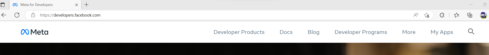

- Step 2 :
Click on the "Create App" button.
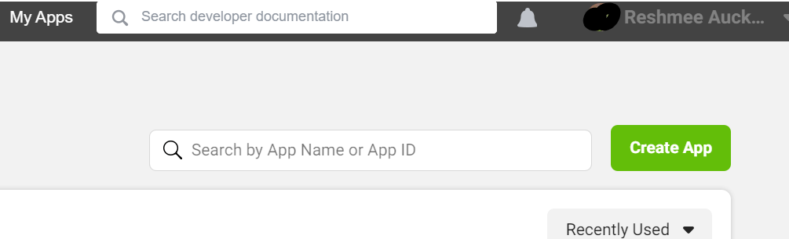

- Step 3 :
Select either "Consumer" or "None" as your application type.
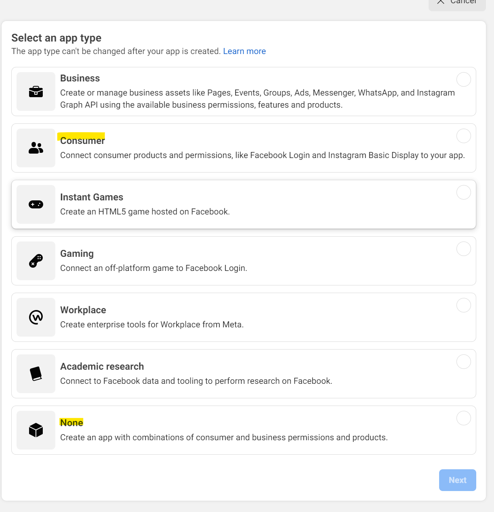

- Step 4 :
Give your application a name, enter your contact email, and create your app.
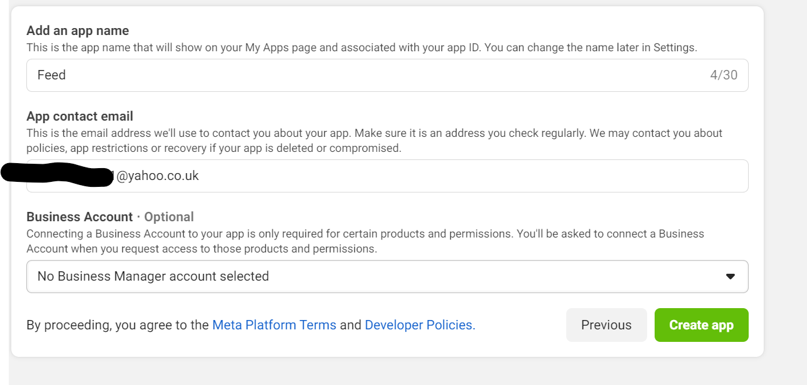

- Step 5 :
Re-enter your Facebook account password
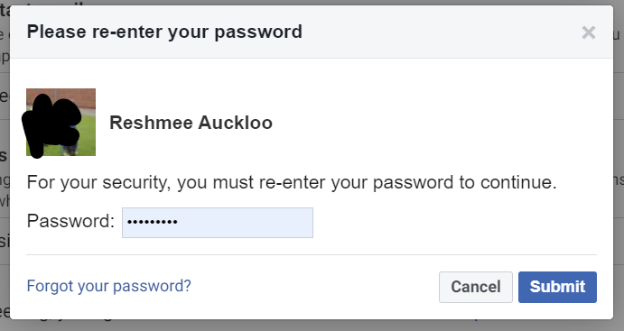

- Step 6 :
Click on the "Set Up" button in the "Instagram Basic Display" box.
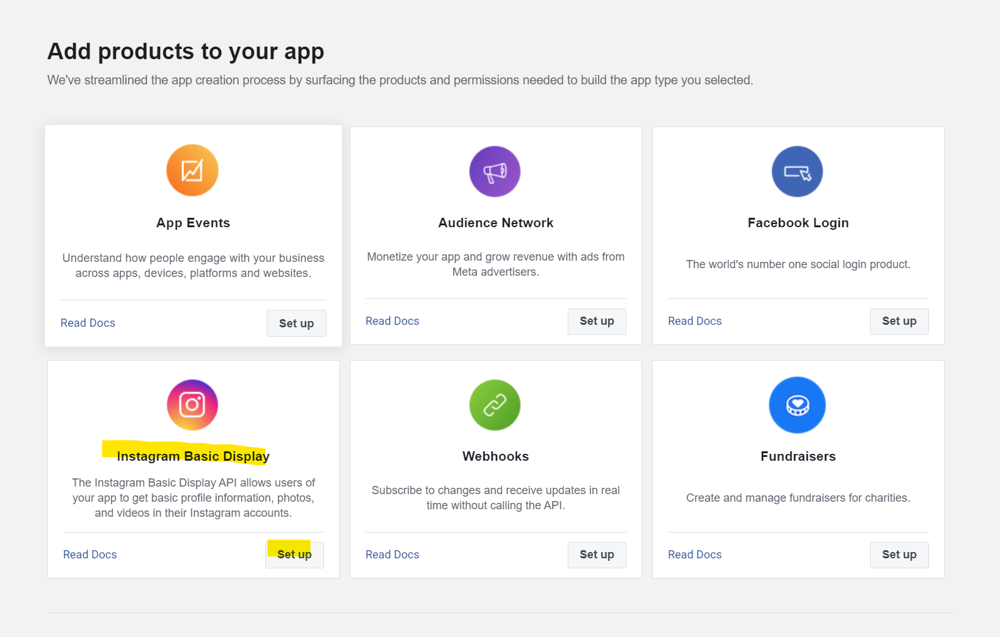

- Step 7 :
Click on "Create New App" and click on "Create App" from the pop up to create a new instagram app id.
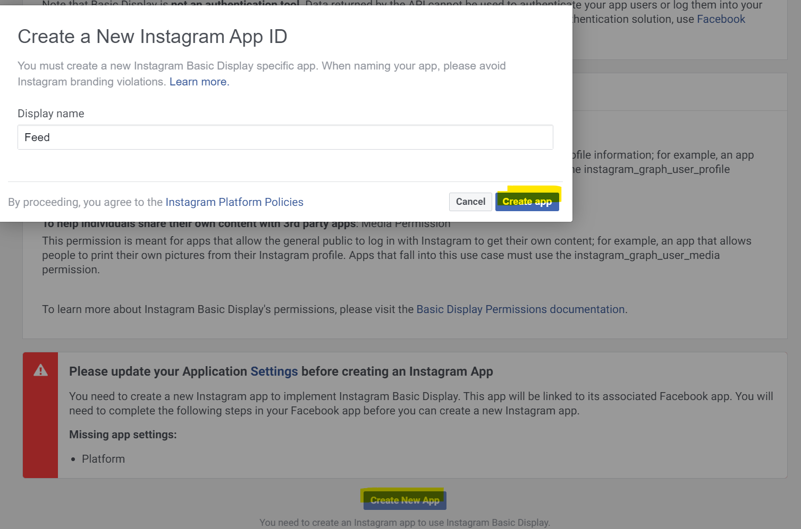

- Step 8 :
Save your changes. In the "User Token Generator" section, click on the "Add or Remove Instagram Testers" button, and follow the instructions.
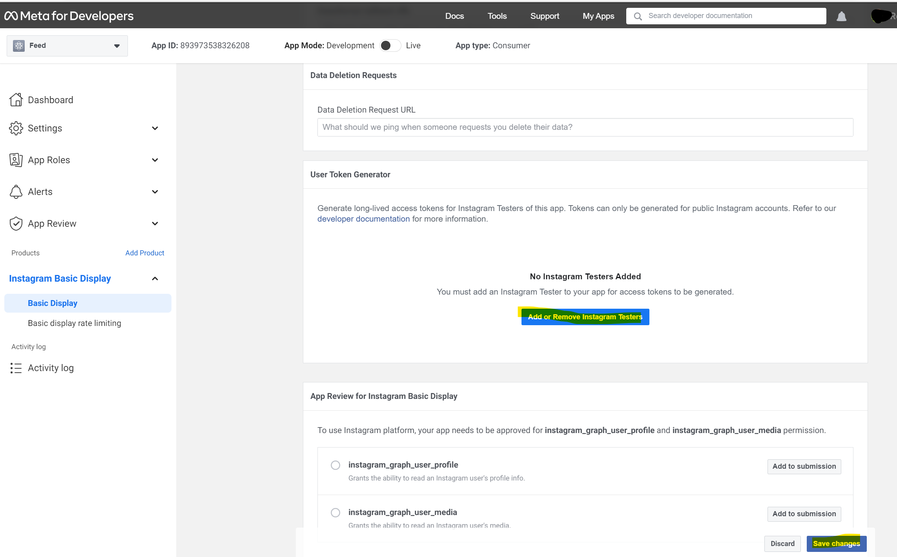

- Step 9 :
Click on the link "apps and websites" link to manage instagram tester invitations and click on accept.
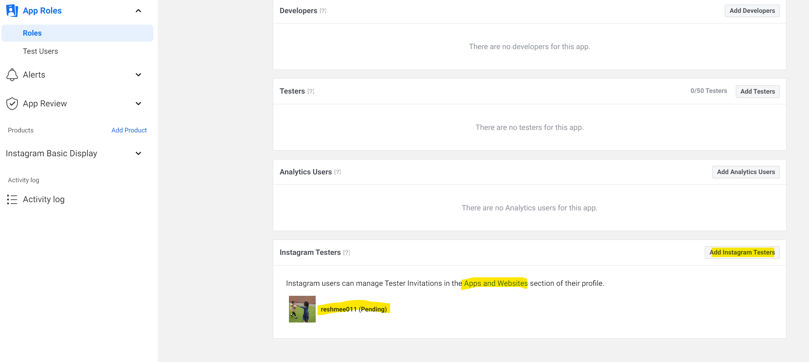
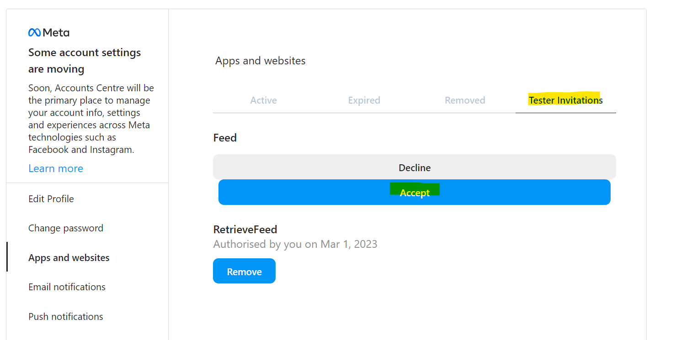

- Step 11 :
Click on "Basic Display", click on "Generate Token" under "User Token Generator" and from the pop up click on "continue as <testername>".
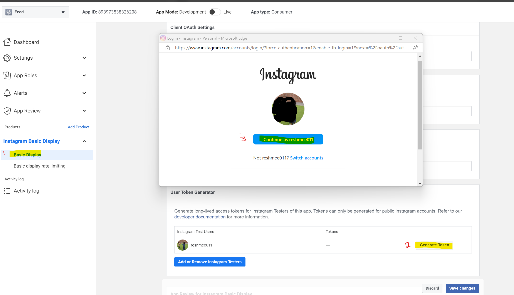

- Step 12 :
Click on "Allow" from the pop up to authorise the app to retrieve profile and media information about the instagram user.
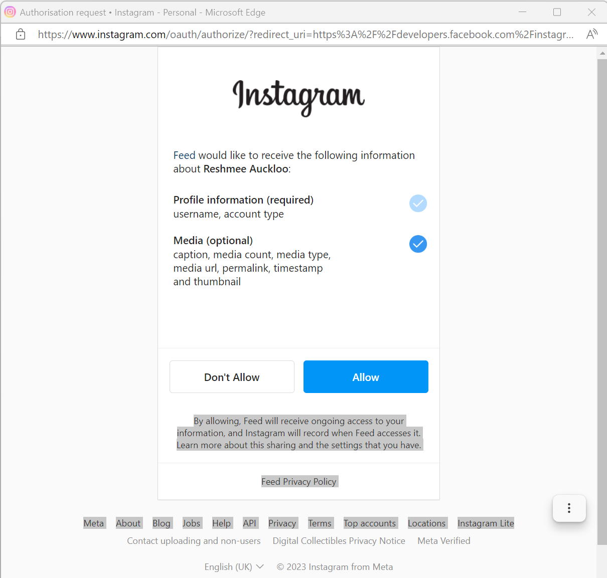

- Step 13 :
Copy the user token to be used on the webpart.
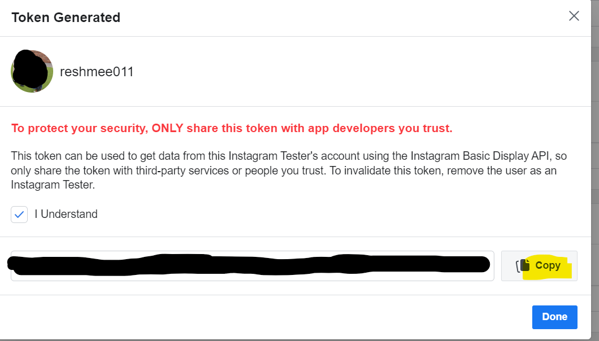

You must then enter this user token in the **Instagram Basic Display (IndependentPublisher)**  connector to display the instagram feeds from the user.

## Power Apps
Power Apps to create a gallery and add swiping effect using a slider control and use a button for diplaying the captions 
[How to build a curved gallery in Power Apps](https://www.m365princess.com/blogs/build-curved-gallery-power-apps/)


[More details of the apps](https://github.com/pnp/powerapps-samples/tree/main/samples/instagram-basic-display)

## Power Automate & View Formatting

Another use case is in Power Automate, where you can use the **Instagram Basic Display (IndependentPublisher)** connector to populate a SharePoint list. It is a scheduled workflow running every hour but the frequency it runs can be updated.

### SharePoint List

Create a list with the following details

| Column | Type            |
| --------- | ----------------- |
| caption     | Multiple lines of text  |
| permalink    | Single line of text    |
| timestamp    | Single line of text    |
| username    | Single line of text    |
| mediaUrl    | Multiple lines of text    |
| thumbnailUrl    | Multiple lines of text    |
| mediaId    | Single line of text    |
| mediaType    | Single line of text    |

### Power Automate

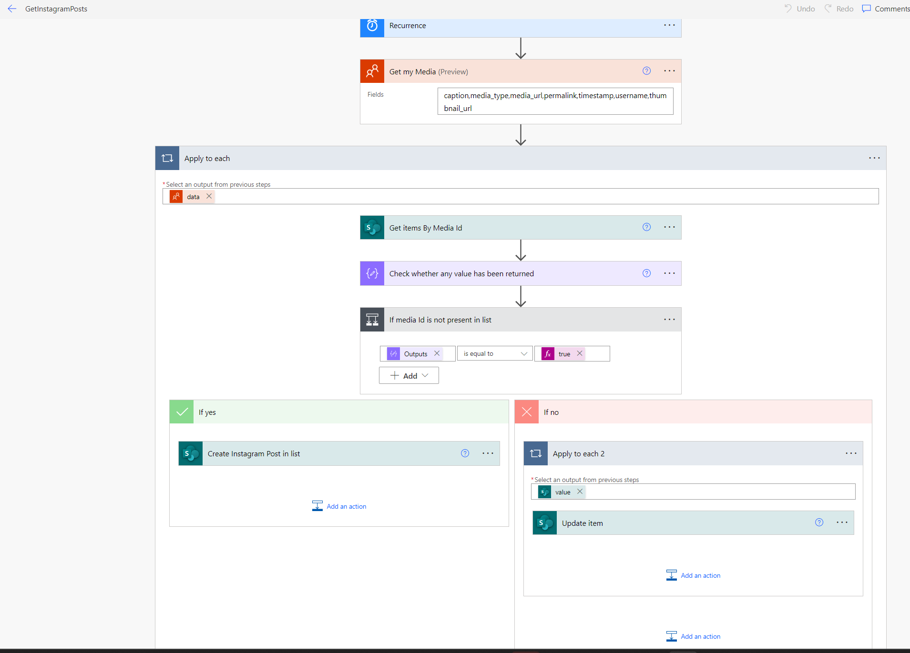

The flow runs on a schedule to retrieve the most recent 25 posts to push to a SharePoint list.

Import the solution flow

* [Download](./images/InstagramFeed.zip) the `.zip` from the `solution` folder
* Browse to [Power Automate](https://flow.microsoft.com/manage/environments) and select the environment where you wish to import the sample
* From the toolbar, select **Import**
* In the **Import package** page, select **Upload** and choose the `.zip` file containing the sample flow.
* Select **Import**
* Create the connections for InstagramBasicDisplay (enter the access token) and SharePoint InstagramFeed-fed15 [Connections](./images/ImportSolution_connectionReference_3.png) 
* Update list and Site Url environment variables [Site Url](./images/ImportSolution_SiteUrl_10.png) and [list](./images/ImportSolution_list_11.png)

### View Formatting

The view formatting was inspired by the [chevron-shape-format](https://github.com/reshmee011/List-Formatting/tree/master/view-samples/chevron-shape-format) by [André Lage](https://twitter.com/aaclage).

The list view is styled (using view formatting) so it looks like the familiar Instagram. On click of each post, the post opens up in a new tab within Instagram to allow user to view more details as well as engage within Instagram. On hover on each image the caption of the post is shown.

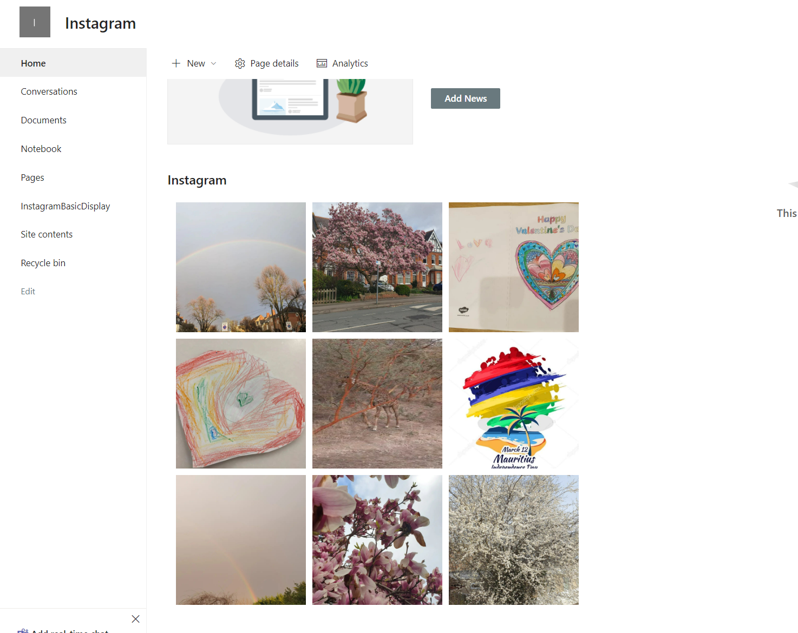


Please note that the "HTML Field Security" settings need to updated to add scontent-lhr8-1.cdninstagram.com, scontent-lhr8-2.cdninstagram.com, scontent-lhr8-3.cdninstagram.com, scontent-lcy1-1.cdninstagram.com, scontent-lcy1-2.cdninstagram.com, scontent-lcy1-3.cdninstagram.com. Please refer to [img-src-security](https://learn.microsoft.com/en-gb/sharepoint/dev/declarative-customization/formatting-syntax-reference#img-src-security) for more details.

However I noticed there are more random CDN(s) Instagram uses. It might be worthwhile downloading the image to a column of image type and amending the view formatting accordingly.

* Create a view with field caption, permalink, mediaUrl, thumbnailUrl and mediaType. Amend the item limit to the desired number, e.g. 9.

* Format the view and copy and paste the JSON provided.

```json
{
  "$schema": "https://developer.microsoft.com/json-schemas/sp/v2/row-formatting.schema.json",
  "schema": "https://developer.microsoft.com/json-schemas/sp/view-formatting.schema.json",
  "hideColumnHeader": "true",
  "hideSelection": true,
  "rowFormatter": {
    "elmType": "div",
    "style": {
      "position": "relative",
      "width": "200px",
      "text-decoration": "none",
      "float": "left",
      "min-width": "200px",
      "height": "200px",
      "margin": "5px",
      "cursor": "pointer"
    },
    "children": [
      {
        "elmType": "a",
        "attributes": {
          "href": "[$permalink]",
          "target": "_blank"
        },
        "children": [
          {
            "elmType": "img",
            "style": {
              "height": "200px",
              "width": "200px"
            },
            "attributes": {
              "src": "=if([$mediaType] =='IMAGE' ||[$mediaType] =='CAROUSEL_ALBUM',[$mediaUrl],[$thumbnailUrl])"
            },
            "customCardProps": {
              "openOnEvent": "hover",
              "directionalHint": "rightCenter",
              "isBeakVisible": true,
              "formatter": {
                "elmType": "div",
                "style": {
                  "max-width": "500px"
                },
                "children": [
                  {
                    "elmType": "div",
                    "style": {
                      "position": "absolute",
                      "bottom": "0"
                    },
                    "children": [
                      {
                        "elmType": "div",
                        "style": {
                          "font-size": "verdana",
                          "padding-left": "10px",
                          "white-space": "nowrap",
                          "overflow": "hidden",
                          "text-overflow": "ellipsis",
                          "max-width": "490px"
                        }
                      },
                      {
                        "elmType": "div",
                        "style": {
                          "padding": "10px",
                          "background-color": "rgba(0, 0, 0, 0.6)",
                          "opacity": "1",
                          "max-width": "490px"
                        },
                        "attributes": {
                          "title": "[$caption]",
                          "class": "ms-fontColor-white ms-fontSize-16"
                        },
                        "txtContent": "[$caption]"
                      }
                    ]
                  },
                  {
                    "elmType": "img",
                    "style": {
                      "max-width": "500px"
                    },
                    "attributes": {
                      "src": "=if([$mediaType] =='IMAGE' ||[$mediaType] =='CAROUSEL_ALBUM',[$mediaUrl],[$thumbnailUrl])"
                    }
                  }
                ]
              }
            }
          }
        ]
      }
    ]
  }
}
```

## Conclusion

The Instagram Basic Display Independent Publisher Connector can be used in Power Apps and Power Automate. With its ability to retrieve public photos, videos and albums from Instagram accounts, you can create engaging and visually appealing applications that will delight your users. To get started with the Instagram Basic Display Independent Publisher Connector, create a connection in Power Automate or Power Apps and start exploring the possibilities.

## References

[SPFx web part by Buse Kara](https://medium.com/arfitect/instagram-feed-in-spfx-web-part-61f76fe1ded4)
[View formatting by Andre Lage] (https://github.com/pnp/List-Formatting/tree/master/view-samples/chevron-shape-format)
[Step by Step guide by Tomasz Poszytek](https://poszytek.eu/en/microsoft-en/office-365-en/powerautomate-en/independent-publisher-connector-step-by-step/)
[Curved Gallery by Luise Freese](https://www.m365princess.com/blogs/build-curved-gallery-power-apps/)
[Instagram Basic Display Independent Publisher connector](https://github.com/microsoft/PowerPlatformConnectors/tree/dev/independent-publisher-connectors/InstagramBasicDisplay)
[Instagram Basic Display API](https://developers.facebook.com/docs/instagram-basic-display-api/)
