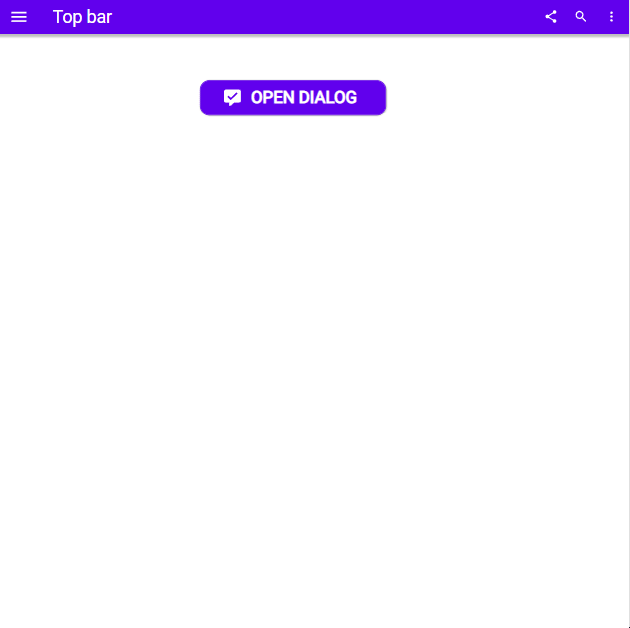
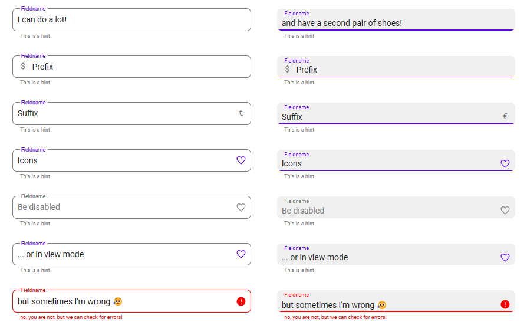

> This is a collaboration of [Luise Freese](https://twitter.com/LuiseFreese) |@LuiseFreese and [Robin Rosengrün](https://twitter.com/power_r2) | @power_r2

## Low code doesn't mean low standards!

It's easy to get started with Power Apps canvas apps and build simple UIs that serve basic use cases. However we see some shortcomings in the platform, that result in makers adopting practices, that rather lead to inconsistencies, reinventing the wheel and a less satisfying developer experience. 

We see lots of organizations, that do not provide makers with enough training on how to efficiently build apps serving the crucial pillars of intuitive UX, accessibility, and performance. There is also a lack on resources as template apps, component libraries and guidance how to use them. As a result, makers often need to do the same work over and over again, but the outcome doesn't match their efforts.

Most makers do not have a background in UI/UX design and are not familiar with how to create consistent and intuitive experiences. Also Power Apps canvas apps don't make it necessarily easy to build elegant and modern looking apps. 

## Material Design

What if we had a look at one of the most adopted design systems world-wide and bring that into Power Apps? Say *Hello* to *Material Design*, the design system developed and maintained by Google. 

Most will recognize tis look & feel from Google/Android. Could you tell that this is a Power Apps canvas app? 

### The journey begins

After doing some initial tests on how far one could stretch Power Apps design with canvas components only (in opposite to PCF code components), Luise and Robin teamed up to build an entire component library, that shall mimic Material Design components. For our v1.0 we came up with 16 components and a template app so that you could be ready to go in less than 5 minutes! Wouldn't you like your textinputs look like these?

All components and the template app are open source and published under [github.com/pnp/powerapps-designtoolkit](https://github.com/pnp/powerapps-designtoolkit). We look forward to your feedback!

*Sharing is Caring*

